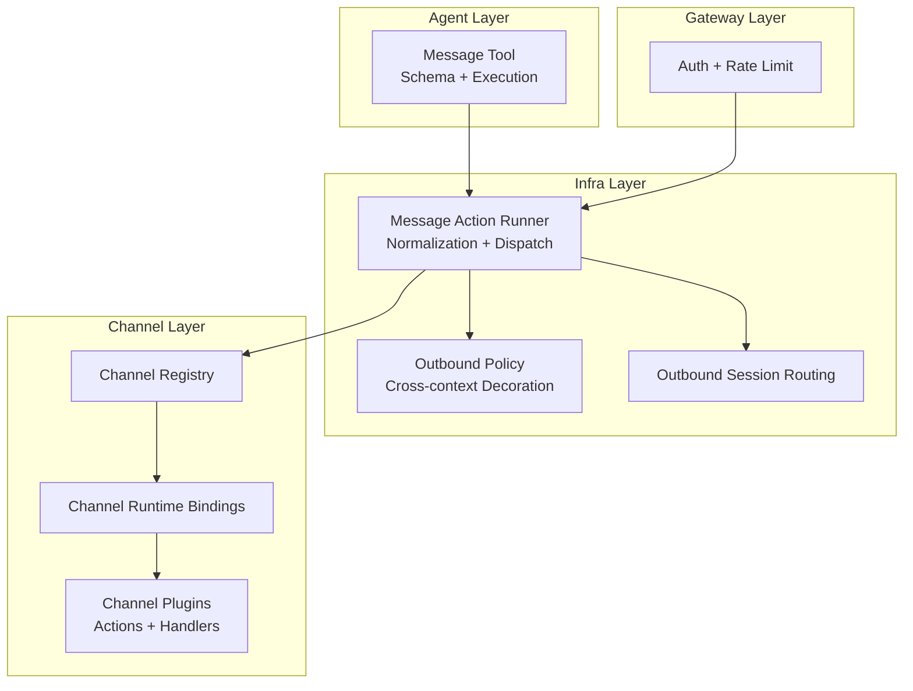
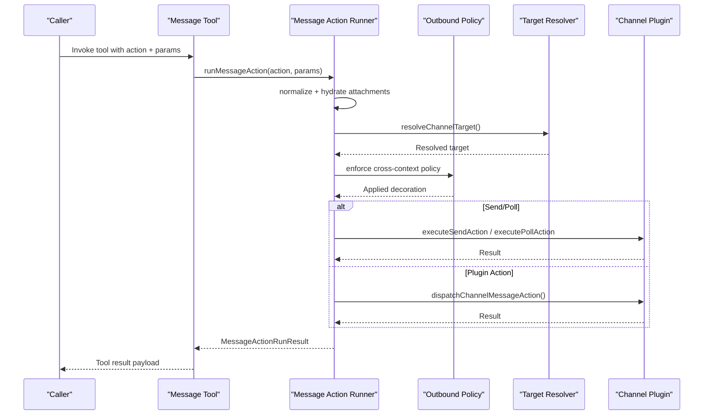
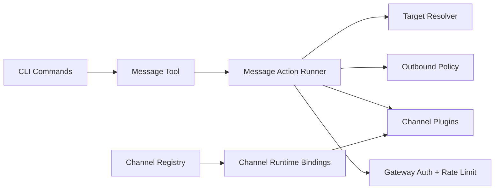

# Message Tool

<cite>
**Referenced Files in This Document**
- [README.md](file://README.md)
- [message-tool.ts](file://src/agents/tools/message-tool.ts)
- [message-action-runner.ts](file://src/infra/outbound/message-action-runner.ts)
- [register.reactions.ts](file://src/cli/program/message/register.reactions.ts)
- [register.poll.ts](file://src/cli/program/message/register.poll.ts)
- [register.pins.ts](file://src/cli/program/message/register.pins.ts)
- [registry.ts](file://src/channels/registry.ts)
- [runtime-channel.ts](file://src/plugins/runtime/runtime-channel.ts)
- [auth-rate-limit.ts](file://src/gateway/auth-rate-limit.ts)
- [auth.ts](file://src/gateway/auth.ts)
- [discord.md](file://docs/channels/discord.md)
- [googlechat.md](file://docs/channels/googlechat.md)
- [message-action-names.ts](file://src/channels/plugins/message-action-names.ts)
- [discord-actions-messaging.ts](file://src/agents/tools/discord-actions-messaging.ts)
- [discord-actions.test.ts](file://src/agents/tools/discord-actions.test.ts)
- [message-tool.test.ts](file://src/agents/tools/message-tool.test.ts)
</cite>

## Table of Contents
1. [Introduction](#introduction)
2. [Project Structure](#project-structure)
3. [Core Components](#core-components)
4. [Architecture Overview](#architecture-overview)
5. [Detailed Component Analysis](#detailed-component-analysis)
6. [Dependency Analysis](#dependency-analysis)
7. [Performance Considerations](#performance-considerations)
8. [Troubleshooting Guide](#troubleshooting-guide)
9. [Conclusion](#conclusion)
10. [Appendices](#appendices)

## Introduction
The OpenClaw Message Tool is the primary communication interface enabling cross-platform messaging across Discord, Google Chat, Slack, Telegram, WhatsApp, Signal, iMessage, Microsoft Teams, and many other supported channels. It provides a unified abstraction for sending, polling, reacting, managing pins, searching, editing/deleting, thread operations, sticker/emoji management, member/role/channel management, and moderation actions. The tool integrates with the Gateway’s control plane, applies cross-context decoration, enforces outbound policies, and routes actions to channel-specific plugins or core handlers.

## Project Structure
The Message Tool spans several layers:
- Agent tool definition and schema generation
- Outbound action runner orchestrating normalization, target resolution, and dispatch
- CLI command registration for reactions, polls, and pins
- Channel registry and runtime bindings
- Authentication and rate-limiting for secure access
- Documentation for platform-specific capabilities and configuration

**Diagram sources**
- [message-tool.ts](file://src/agents/tools/message-tool.ts#L669-L792)
- [message-action-runner.ts](file://src/infra/outbound/message-action-runner.ts#L696-L815)
- [registry.ts](file://src/channels/registry.ts#L69-L121)
- [runtime-channel.ts](file://src/plugins/runtime/runtime-channel.ts#L207-L264)
- [auth-rate-limit.ts](file://src/gateway/auth-rate-limit.ts#L25-L117)
- [auth.ts](file://src/gateway/auth.ts#L448-L485)

**Section sources**
- [README.md](file://README.md#L21-L50)
- [message-tool.ts](file://src/agents/tools/message-tool.ts#L669-L792)
- [message-action-runner.ts](file://src/infra/outbound/message-action-runner.ts#L696-L815)

## Core Components
- Message Tool: Defines the tool schema, action enumeration, and execution path. It dynamically adapts to the current channel and configured actions, supports cross-channel broadcasting, and injects cross-context decoration.
- Message Action Runner: Central dispatcher that normalizes inputs, resolves channels and targets, hydrates attachments, enforces policies, and executes send/poll/plugin actions.
- CLI Commands: Subcommands for reactions, polls, and pins, wiring into the tool’s parameter parsing and execution.
- Channel Registry and Runtime: Maps channel IDs to runtime capabilities and plugin actions; exposes per-channel gating and feature toggles.
- Authentication and Rate Limiting: Enforces secure access to the Gateway and protects against brute-force attacks.

**Section sources**
- [message-tool.ts](file://src/agents/tools/message-tool.ts#L1-L793)
- [message-action-runner.ts](file://src/infra/outbound/message-action-runner.ts#L1-L815)
- [register.reactions.ts](file://src/cli/program/message/register.reactions.ts#L1-L33)
- [register.poll.ts](file://src/cli/program/message/register.poll.ts#L1-L32)
- [register.pins.ts](file://src/cli/program/message/register.pins.ts#L1-L35)
- [registry.ts](file://src/channels/registry.ts#L69-L121)
- [runtime-channel.ts](file://src/plugins/runtime/runtime-channel.ts#L207-L264)
- [auth-rate-limit.ts](file://src/gateway/auth-rate-limit.ts#L25-L117)
- [auth.ts](file://src/gateway/auth.ts#L448-L485)

## Architecture Overview
The Message Tool follows a layered architecture:
- Tool layer validates parameters and delegates to the runner.
- Runner resolves channel, target, and account bindings; normalizes media and cross-context decoration; then dispatches to either core send/poll or channel plugin actions.
- Channel plugins implement platform-specific logic (e.g., Discord reactions, stickers, polls).
- Gateway handles authentication and rate limiting for incoming requests.

**Diagram sources**
- [message-tool.ts](file://src/agents/tools/message-tool.ts#L689-L790)
- [message-action-runner.ts](file://src/infra/outbound/message-action-runner.ts#L696-L815)

## Detailed Component Analysis

### Message Tool Schema and Actions
- Action Enumeration: Includes send, broadcast, poll, poll-vote, react, reactions, read, edit, unsend, reply, sendWithEffect, renameGroup, setGroupIcon, add/remove/leave participants, sendAttachment, delete, pin, unpin, list-pins, permissions, thread-create/list/reply, search, sticker, sticker-search, member-info, role-info, emoji-list, emoji-upload, sticker-upload, role-add/remove, channel-info/list/create/edit/delete/move, category-create/edit/delete, topic-create, voice-status, event-list/create, timeout/kick/ban, set-presence, download-file.
- Dynamic Schema: Builds tool schema based on current channel and configured actions; includes buttons/cards/components support when applicable; adapts poll parameters per channel.
- Execution: Strips reasoning tags from text, resolves gateway options, and invokes the runner with tool context and session keys.

**Section sources**
- [message-action-names.ts](file://src/channels/plugins/message-action-names.ts#L1-L57)
- [message-tool.ts](file://src/agents/tools/message-tool.ts#L481-L578)
- [message-tool.ts](file://src/agents/tools/message-tool.ts#L669-L792)

### Message Action Runner
- Normalization: Parses buttons/cards/components, resolves thread IDs, enforces cross-context policy, and hydrates attachment parameters.
- Target Resolution: Converts human-friendly targets to normalized channel IDs; validates group vs user targets.
- Dispatch: Routes send/poll to core handlers; routes other actions to channel plugins; supports dry-run and broadcast modes.
- Outbound Session Routing: Creates outbound session entries and mirrors messages when agent context is present.

**Section sources**
- [message-action-runner.ts](file://src/infra/outbound/message-action-runner.ts#L384-L566)
- [message-action-runner.ts](file://src/infra/outbound/message-action-runner.ts#L568-L654)
- [message-action-runner.ts](file://src/infra/outbound/message-action-runner.ts#L656-L694)
- [message-action-runner.ts](file://src/infra/outbound/message-action-runner.ts#L696-L815)

### CLI Commands: Reactions, Polls, Pins
- Reactions: Adds or lists reactions; supports platform-specific flags (e.g., WhatsApp participant/fromMe, Signal target author).
- Polls: Sends polls with options, multiselect, duration, and visibility controls; validates Telegram-only options.
- Pins: Pins/unpins messages and lists pinned messages with limits.

**Section sources**
- [register.reactions.ts](file://src/cli/program/message/register.reactions.ts#L1-L33)
- [register.poll.ts](file://src/cli/program/message/register.poll.ts#L1-L32)
- [register.pins.ts](file://src/cli/program/message/register.pins.ts#L1-L35)

### Channel Registry and Runtime Bindings
- Channel Registry: Lists supported channels (Discord, Google Chat, Slack, Signal, iMessage, LINE, etc.) with labels, docs paths, and blurb.
- Runtime Bindings: Exposes per-channel capabilities (e.g., Telegram message actions, Discord send/poll, Signal message actions).

**Section sources**
- [registry.ts](file://src/channels/registry.ts#L69-L121)
- [runtime-channel.ts](file://src/plugins/runtime/runtime-channel.ts#L207-L264)

### Platform-Specific Implementations

#### Discord
- Supported Actions: Messaging, reactions, emoji list, stickers, member/role info, emoji/sticker uploads, roles, channels, voice status, events, moderation (timeout/kick/ban), presence.
- Polls: Supports allowMultiselect, durationHours; gated by actions configuration.
- Stickers: Sends sticker IDs with optional content.
- Gating: Many actions disabled by default; enable via channels.discord.actions.*.

**Section sources**
- [discord.md](file://docs/channels/discord.md#L963-L979)
- [discord-actions-messaging.ts](file://src/agents/tools/discord-actions-messaging.ts#L133-L171)
- [discord-actions.test.ts](file://src/agents/tools/discord-actions.test.ts#L127-L181)

#### Google Chat
- Supported Actions: Reactions and more (see docs).
- Authentication: Webhook verification via audience type and value; bearer token checks.
- Targets: Users/spaces identifiers; DM pairing by default.

**Section sources**
- [googlechat.md](file://docs/channels/googlechat.md#L1-L200)

#### Telegram
- Polls: Supports durationSeconds and visibility flags; validated in runner.
- Threads: Auto-thread resolution for Slack/Telegram contexts.

**Section sources**
- [message-action-runner.ts](file://src/infra/outbound/message-action-runner.ts#L589-L600)

#### Slack
- Threads: Auto-thread resolution when replying; requires proper configuration.
- Presence: Set presence action supported.

**Section sources**
- [message-action-runner.ts](file://src/infra/outbound/message-action-runner.ts#L73-L88)

#### Others (Signal, iMessage, WhatsApp, MS Teams, etc.)
- Implemented via channel plugins and runtime bindings; actions vary by platform and configuration.

**Section sources**
- [runtime-channel.ts](file://src/plugins/runtime/runtime-channel.ts#L234-L245)
- [registry.ts](file://src/channels/registry.ts#L69-L121)

### Practical Workflows

#### Send a Message with Media
- Prepare parameters: action=send, to=target, message=text, media/url.
- Runner normalizes media, resolves thread ID if needed, applies cross-context decoration, and dispatches to channel plugin or core handler.

**Section sources**
- [message-action-runner.ts](file://src/infra/outbound/message-action-runner.ts#L384-L566)

#### Create a Poll
- Prepare parameters: action=poll, to=target, pollQuestion, pollOption (2+), optional pollMulti, pollDurationHours (Discord), pollDurationSeconds (Telegram), pollAnonymous/pollPublic (Telegram).
- Runner validates options, resolves thread ID, applies cross-context decoration, and executes poll creation.

**Section sources**
- [register.poll.ts](file://src/cli/program/message/register.poll.ts#L1-L32)
- [message-action-runner.ts](file://src/infra/outbound/message-action-runner.ts#L568-L654)

#### React to a Message
- Prepare parameters: action=react, to/target, messageId/message_id, emoji, remove flag, platform-specific fields (e.g., WhatsApp participant/fromMe, Signal target author).
- Runner dispatches to channel plugin; Discord gating enforced by action enablement.

**Section sources**
- [register.reactions.ts](file://src/cli/program/message/register.reactions.ts#L1-L33)
- [discord-actions.test.ts](file://src/agents/tools/discord-actions.test.ts#L127-L181)

#### Pin/Unpin/List Pins
- Prepare parameters: action=pin/unpin/pins, to/target, message-id, optional limit.
- Runner dispatches to channel plugin.

**Section sources**
- [register.pins.ts](file://src/cli/program/message/register.pins.ts#L1-L35)

#### Broadcast Across Channels
- Prepare parameters: action=broadcast, targets=list, optional channel hint.
- Runner iterates configured channels and targets, resolving each and sending.

**Section sources**
- [message-action-runner.ts](file://src/infra/outbound/message-action-runner.ts#L303-L382)

## Dependency Analysis
- Tool depends on runner for execution and on channel registry/runtime for capability discovery.
- Runner depends on target resolver, outbound policy, and channel plugins.
- CLI commands depend on tool helpers and parameter definitions.
- Gateway auth and rate limiting protect inbound requests.

**Diagram sources**
- [register.reactions.ts](file://src/cli/program/message/register.reactions.ts#L1-L33)
- [register.poll.ts](file://src/cli/program/message/register.poll.ts#L1-L32)
- [register.pins.ts](file://src/cli/program/message/register.pins.ts#L1-L35)
- [message-tool.ts](file://src/agents/tools/message-tool.ts#L669-L792)
- [message-action-runner.ts](file://src/infra/outbound/message-action-runner.ts#L696-L815)
- [registry.ts](file://src/channels/registry.ts#L69-L121)
- [runtime-channel.ts](file://src/plugins/runtime/runtime-channel.ts#L207-L264)
- [auth-rate-limit.ts](file://src/gateway/auth-rate-limit.ts#L25-L117)
- [auth.ts](file://src/gateway/auth.ts#L448-L485)

**Section sources**
- [message-tool.ts](file://src/agents/tools/message-tool.ts#L669-L792)
- [message-action-runner.ts](file://src/infra/outbound/message-action-runner.ts#L696-L815)
- [registry.ts](file://src/channels/registry.ts#L69-L121)
- [runtime-channel.ts](file://src/plugins/runtime/runtime-channel.ts#L207-L264)
- [auth-rate-limit.ts](file://src/gateway/auth-rate-limit.ts#L25-L117)
- [auth.ts](file://src/gateway/auth.ts#L448-L485)

## Performance Considerations
- Concurrency and chunking: Respect platform-specific limits (e.g., Telegram long-poll concurrency, Slack Socket Mode low latency).
- Media and limits: Use mediaMaxMb and chunking options; optimize attachment handling.
- Events and receipts: Ensure proper permissions for assistant:write and reaction/typing updates to avoid retries.

**Section sources**
- [README.md](file://README.md#L418-L422)

## Troubleshooting Guide
- Authentication and Rate Limiting
  - Token/password mismatch increments rate limiter; lockout occurs after maxAttempts within windowMs.
  - Loopback exemptions configurable; prune intervals prevent memory growth.
- Platform-Specific
  - Discord: Missing intents, permissions, or mention requirements cause no replies; verify actions gating.
  - Google Chat: Public webhook URL required; audience type/value must match Chat app config; bearer auth verified before parsing bodies.
  - Telegram: Privacy mode/admin requirements; webhook connectivity; poll visibility/duration constraints.
  - Slack: Socket/HTTP modes require correct tokens/signing secrets; auto-threading depends on replyTo and tool context.
  - Signal: Daemon reachability and pairing status; media size limits.
  - iMessage (legacy): imsg RPC support and permissions; remote attachment accessibility.
- Tool-Level
  - Explicit target required for certain actions; dry-run mode for safe testing.
  - Poll fields require action=poll; mixing with send throws validation error.

**Section sources**
- [auth-rate-limit.ts](file://src/gateway/auth-rate-limit.ts#L25-L117)
- [auth.ts](file://src/gateway/auth.ts#L448-L485)
- [discord.md](file://docs/channels/discord.md#L963-L979)
- [googlechat.md](file://docs/channels/googlechat.md#L139-L200)
- [message-action-runner.ts](file://src/infra/outbound/message-action-runner.ts#L700-L772)
- [message-tool.test.ts](file://src/agents/tools/message-tool.test.ts#L275-L295)

## Conclusion
The OpenClaw Message Tool provides a robust, extensible, and secure cross-platform messaging layer. Its dynamic schema, outbound policy enforcement, and channel plugin architecture enable consistent behavior across diverse platforms while respecting platform-specific constraints. Proper configuration, authentication, and rate limiting ensure reliable operation in production environments.

## Appendices

### Supported Actions Reference
- Messaging: send, broadcast, reply, thread-reply, edit, delete, unsend, read, sendWithEffect, sendAttachment
- Polls: poll, poll-vote
- Reactions: react, reactions, emoji-list
- Pins: pin, unpin, list-pins
- Search: search
- Stickers: sticker, sticker-search, sticker-upload
- Member/Role/Channel: member-info, role-info, role-add, role-remove, permissions
- Channels: channel-info, channel-list, channel-create, channel-edit, channel-delete, channel-move, category-create, category-edit, category-delete, topic-create
- Voice/Events: voice-status, event-list, event-create
- Moderation: timeout, kick, ban
- Presence: set-presence
- Download: download-file

**Section sources**
- [message-action-names.ts](file://src/channels/plugins/message-action-names.ts#L1-L57)