# Platform Integrations

<cite>
**Referenced Files in This Document**
- [discord.md](file://docs/channels/discord.md)
- [telegram.md](file://docs/channels/telegram.md)
- [slack.md](file://docs/channels/slack.md)
- [whatsapp.md](file://docs/channels/whatsapp.md)
- [signal.md](file://docs/channels/signal.md)
- [imessage.md](file://docs/channels/imessage.md)
- [googlechat.md](file://docs/channels/googlechat.md)
- [msteams.md](file://docs/channels/msteams.md)
- [discord/index.ts](file://extensions/discord/index.ts)
- [telegram/index.ts](file://extensions/telegram/index.ts)
- [slack/index.ts](file://extensions/slack/index.ts)
- [whatsapp/index.ts](file://extensions/whatsapp/index.ts)
- [signal/index.ts](file://extensions/signal/index.ts)
- [imessage/index.ts](file://extensions/imessage/index.ts)
- [googlechat/index.ts](file://extensions/googlechat/index.ts)
- [msteams/index.ts](file://extensions/msteams/index.ts)
</cite>

## Table of Contents
1. [Introduction](#introduction)
2. [Project Structure](#project-structure)
3. [Core Components](#core-components)
4. [Architecture Overview](#architecture-overview)
5. [Detailed Component Analysis](#detailed-component-analysis)
6. [Dependency Analysis](#dependency-analysis)
7. [Performance Considerations](#performance-considerations)
8. [Troubleshooting Guide](#troubleshooting-guide)
9. [Conclusion](#conclusion)

## Introduction
This document provides comprehensive, platform-specific documentation for message tool implementations across Discord, Telegram, Slack, WhatsApp, Signal, iMessage, Google Chat, and Microsoft Teams. It covers authentication requirements, permission models, message formatting, attachment handling, thread management, moderation capabilities, configuration options, rate-limiting considerations, and troubleshooting guidance for each platform. The goal is to help operators deploy, configure, and operate these integrations reliably and securely.

## Project Structure
Each supported platform is implemented as a plugin that registers a channel with the OpenClaw runtime. The plugin entry points define the channel identity, configuration schema, and registration hooks. Documentation pages describe platform-specific setup, capabilities, and operational guidance.

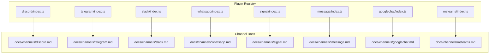

**Diagram sources**
- [discord/index.ts](file://extensions/discord/index.ts#L1-L20)
- [telegram/index.ts](file://extensions/telegram/index.ts#L1-L18)
- [slack/index.ts](file://extensions/slack/index.ts#L1-L18)
- [whatsapp/index.ts](file://extensions/whatsapp/index.ts#L1-L18)
- [signal/index.ts](file://extensions/signal/index.ts#L1-L18)
- [imessage/index.ts](file://extensions/imessage/index.ts#L1-L18)
- [googlechat/index.ts](file://extensions/googlechat/index.ts#L1-L18)
- [msteams/index.ts](file://extensions/msteams/index.ts#L1-L18)
- [discord.md](file://docs/channels/discord.md#L1-L1223)
- [telegram.md](file://docs/channels/telegram.md#L1-L948)
- [slack.md](file://docs/channels/slack.md#L1-L555)
- [whatsapp.md](file://docs/channels/whatsapp.md#L1-L446)
- [signal.md](file://docs/channels/signal.md#L1-L326)
- [imessage.md](file://docs/channels/imessage.md#L1-L368)
- [googlechat.md](file://docs/channels/googlechat.md#L1-L262)
- [msteams.md](file://docs/channels/msteams.md#L1-L777)

**Section sources**
- [discord/index.ts](file://extensions/discord/index.ts#L1-L20)
- [telegram/index.ts](file://extensions/telegram/index.ts#L1-L18)
- [slack/index.ts](file://extensions/slack/index.ts#L1-L18)
- [whatsapp/index.ts](file://extensions/whatsapp/index.ts#L1-L18)
- [signal/index.ts](file://extensions/signal/index.ts#L1-L18)
- [imessage/index.ts](file://extensions/imessage/index.ts#L1-L18)
- [googlechat/index.ts](file://extensions/googlechat/index.ts#L1-L18)
- [msteams/index.ts](file://extensions/msteams/index.ts#L1-L18)

## Core Components
- Plugin registration: Each platform plugin exports an id, name, description, and a register hook that sets the runtime and registers the channel.
- Channel documentation: Each platform has a dedicated documentation page detailing setup, access control, features, and troubleshooting.

Key responsibilities:
- Authentication: Tokens, secrets, service accounts, or device linking per platform.
- Authorization: Allowlists, mention gating, and per-channel/group policies.
- Delivery: Text, media, and interactive components with platform-specific constraints.
- Moderation: Reactions, acknowledgments, and system event mapping.
- Operations: Streaming, chunking, history limits, and webhook/path configuration.

**Section sources**
- [discord/index.ts](file://extensions/discord/index.ts#L7-L16)
- [telegram/index.ts](file://extensions/telegram/index.ts#L6-L14)
- [slack/index.ts](file://extensions/slack/index.ts#L6-L14)
- [whatsapp/index.ts](file://extensions/whatsapp/index.ts#L6-L14)
- [signal/index.ts](file://extensions/signal/index.ts#L6-L14)
- [imessage/index.ts](file://extensions/imessage/index.ts#L6-L14)
- [googlechat/index.ts](file://extensions/googlechat/index.ts#L6-L14)
- [msteams/index.ts](file://extensions/msteams/index.ts#L6-L14)

## Architecture Overview
The runtime integrates each platform via a plugin that registers a channel implementation. The channel consumes inbound events, normalizes them into a shared envelope, applies authorization and routing, and produces outbound messages respecting platform constraints.

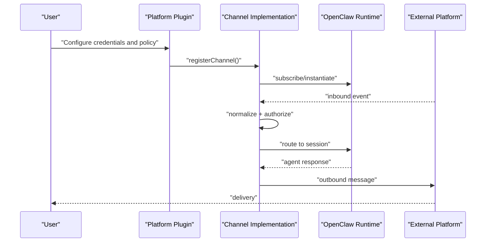

[No sources needed since this diagram shows conceptual workflow, not actual code structure]

## Detailed Component Analysis

### Discord
- Authentication: Bot token and optional app token; privileged intents required for content and members.
- Access control: DM policy (pairing/allowlist/open/disabled), guild allowlist, per-channel overrides, mention gating.
- Features: Slash commands, interactive components (buttons, selects, modals), reply threading, forum threads, live preview streaming, reaction notifications, ack reactions.
- Attachments: File blocks and media galleries; filename mapping; size limits.
- Rate limiting: Subject to Discord API quotas; chunking and streaming mitigate latency.
- Troubleshooting: Intents, permissions, pairing codes, forum thread creation, component restrictions.

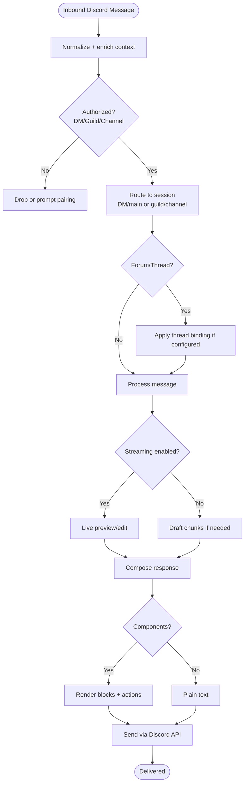

**Diagram sources**
- [discord.md](file://docs/channels/discord.md#L254-L326)
- [discord.md](file://docs/channels/discord.md#L368-L460)
- [discord.md](file://docs/channels/discord.md#L553-L617)
- [discord.md](file://docs/channels/discord.md#L619-L686)

**Section sources**
- [discord.md](file://docs/channels/discord.md#L1-L1223)
- [discord/index.ts](file://extensions/discord/index.ts#L1-L20)

### Telegram
- Authentication: Bot token; optional webhook mode with secret and path; long polling default.
- Access control: DM policy, group allowlists, mention gating, exec approvals.
- Features: Live preview edits, HTML fallback, inline buttons, forum topics, stickers, reactions, polls, typing indicators.
- Attachments: Voice/video notes, stickers, media size caps; caching and search.
- Limits: Chunking, retry, history limits, timeout overrides.
- Troubleshooting: Privacy mode, webhook URL/event subscriptions, DNS/HTTPS restrictions.

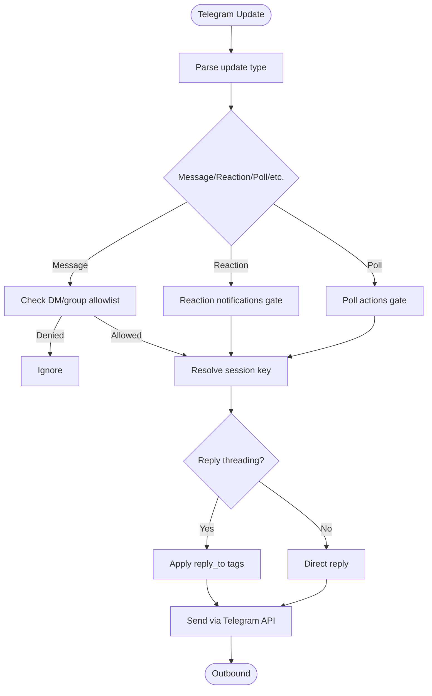

**Diagram sources**
- [telegram.md](file://docs/channels/telegram.md#L222-L231)
- [telegram.md](file://docs/channels/telegram.md#L232-L296)
- [telegram.md](file://docs/channels/telegram.md#L297-L393)
- [telegram.md](file://docs/channels/telegram.md#L394-L471)
- [telegram.md](file://docs/channels/telegram.md#L472-L541)
- [telegram.md](file://docs/channels/telegram.md#L542-L640)
- [telegram.md](file://docs/channels/telegram.md#L641-L703)
- [telegram.md](file://docs/channels/telegram.md#L704-L721)
- [telegram.md](file://docs/channels/telegram.md#L722-L763)
- [telegram.md](file://docs/channels/telegram.md#L764-L791)

**Section sources**
- [telegram.md](file://docs/channels/telegram.md#L1-L948)
- [telegram/index.ts](file://extensions/telegram/index.ts#L1-L18)

### Slack
- Authentication: Bot token + app token (Socket Mode) or bot token + signing secret (HTTP Events API).
- Access control: DM policy, channel allowlists, per-channel user allowlists, mention gating.
- Features: Slash commands, block actions, modal interactions, reactions, pins, member info, typing indicators, assistant thread status.
- Media: Inbound file downloads, outbound uploads, chunking, thread replies.
- Streaming: Native Slack streaming via Agents and AI Apps API with start/append/stop.
- Troubleshooting: Socket mode connectivity, HTTP webhook paths, signing secrets, native command registration.

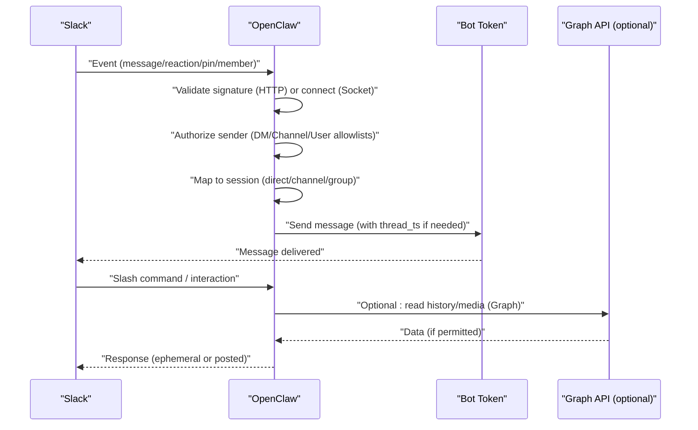

**Diagram sources**
- [slack.md](file://docs/channels/slack.md#L298-L325)
- [slack.md](file://docs/channels/slack.md#L492-L532)

**Section sources**
- [slack.md](file://docs/channels/slack.md#L1-L555)
- [slack/index.ts](file://extensions/slack/index.ts#L1-L18)

### WhatsApp
- Authentication: QR-based linking via Baileys; per-account credential directories; logout behavior.
- Access control: DM policy, group allowlists, sender allowlists, mention gating, self-chat safeguards.
- Features: Read receipts, pending history injection, media optimization, voice notes, GIF playback, ack reactions.
- Delivery: Text chunking, media size caps, fallback behavior on send failure.
- Troubleshooting: Link status, reconnect loops, active listener requirement, group gating, Bun compatibility.

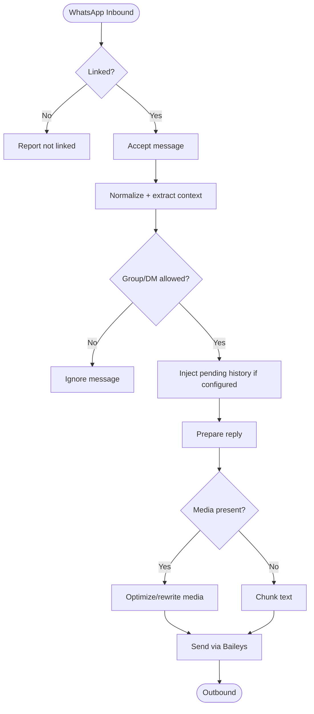

**Diagram sources**
- [whatsapp.md](file://docs/channels/whatsapp.md#L210-L290)
- [whatsapp.md](file://docs/channels/whatsapp.md#L292-L316)
- [whatsapp.md](file://docs/channels/whatsapp.md#L318-L342)

**Section sources**
- [whatsapp.md](file://docs/channels/whatsapp.md#L1-L446)
- [whatsapp/index.ts](file://extensions/whatsapp/index.ts#L1-L18)

### Signal
- Authentication: signal-cli daemon via JSON-RPC + SSE; account number or UUID-based allowlists.
- Access control: DM policy (pairing recommended), group allowlists, mention patterns.
- Features: External daemon mode, typing indicators, read receipts, reactions, media chunking, history limits.
- Delivery: Text chunking, newline preference, media caps, UUID/number targets.
- Troubleshooting: Daemon reachability, pairing approvals, config validation, signal-cli version.

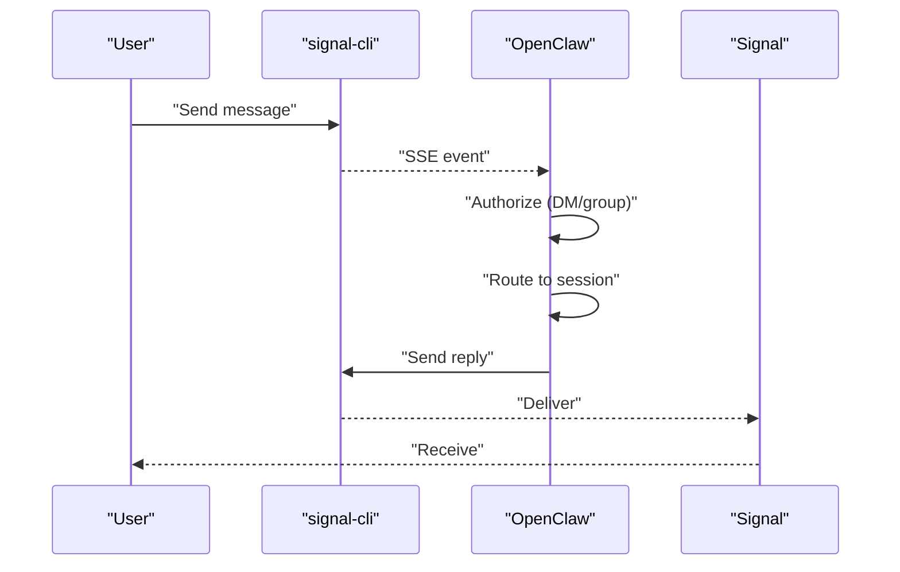

**Diagram sources**
- [signal.md](file://docs/channels/signal.md#L200-L220)

**Section sources**
- [signal.md](file://docs/channels/signal.md#L1-L326)
- [signal/index.ts](file://extensions/signal/index.ts#L1-L18)

### iMessage
- Authentication: Legacy imsg RPC over stdio; optional remote SSH wrapper; attachment fetching via SCP.
- Access control: DM policy, group allowlists, mention patterns, multi-account support.
- Features: Attachment ingestion, outbound chunking, delivery targets, config writes.
- Troubleshooting: RPC support, permissions (Full Disk Access, Automation), remote attachment paths.

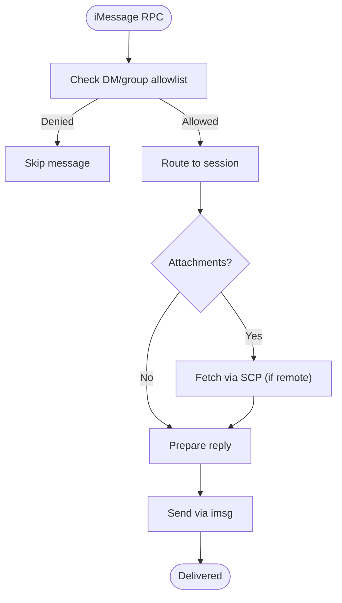

**Diagram sources**
- [imessage.md](file://docs/channels/imessage.md#L247-L286)

**Section sources**
- [imessage.md](file://docs/channels/imessage.md#L1-L368)
- [imessage/index.ts](file://extensions/imessage/index.ts#L1-L18)

### Google Chat
- Authentication: Service account with Chat API credentials; webhook audience validation; bearer token verification.
- Access control: DM pairing, group allowlists, mention gating, bot user for detection.
- Features: Webhook-only, typing indicators, reactions, media downloads, targets by user/space.
- Security: Audience type and value enforcement; path exposure via Tailscale Funnel or reverse proxy.
- Troubleshooting: 405 errors, plugin enabled, gateway restart, webhook URL/event subscriptions.

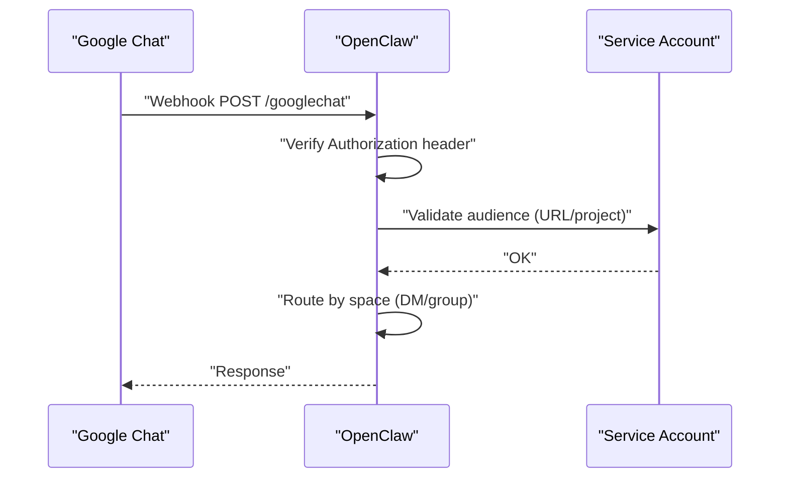

**Diagram sources**
- [googlechat.md](file://docs/channels/googlechat.md#L139-L153)

**Section sources**
- [googlechat.md](file://docs/channels/googlechat.md#L1-L262)
- [googlechat/index.ts](file://extensions/googlechat/index.ts#L1-L18)

### Microsoft Teams
- Authentication: Azure Bot registration (App ID, client secret, tenant ID); Bot Framework webhook endpoint.
- Access control: DM policy, group allowlists, per-team/channel overrides, mention gating.
- Features: Adaptive Cards, polls, file handling (DMs via FileConsentCard; group chats via SharePoint), reply style (threads vs posts).
- Media/history: RSC-only vs Graph API; SharePoint site ID for group file uploads; per-user sharing links.
- Troubleshooting: Webhook timeouts, manifest upload errors, RSC permissions, version mismatches.

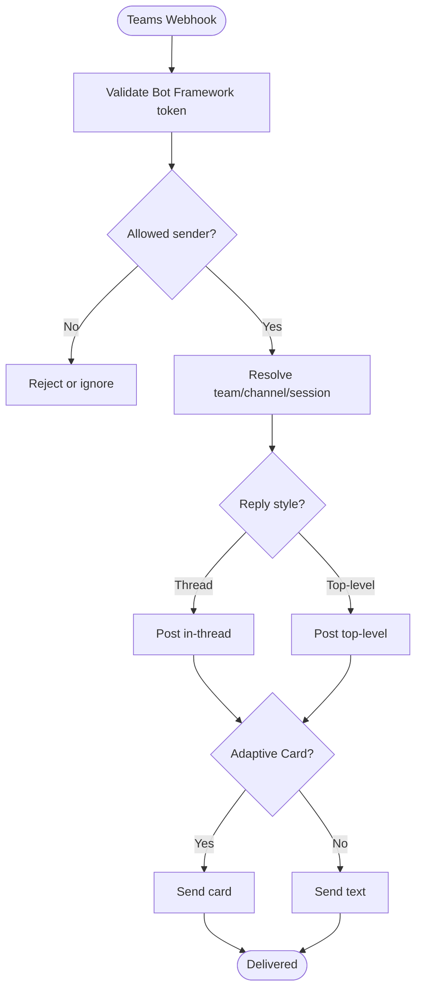

**Diagram sources**
- [msteams.md](file://docs/channels/msteams.md#L487-L518)

**Section sources**
- [msteams.md](file://docs/channels/msteams.md#L1-L777)
- [msteams/index.ts](file://extensions/msteams/index.ts#L1-L18)

## Dependency Analysis
- Plugin-to-channel mapping: Each platform plugin registers a channel implementation with the runtime.
- Documentation-to-feature mapping: Each docs page enumerates capabilities, limits, and configuration keys.
- External dependencies: Platform SDKs, service accounts, tokens, and daemon processes vary by platform.

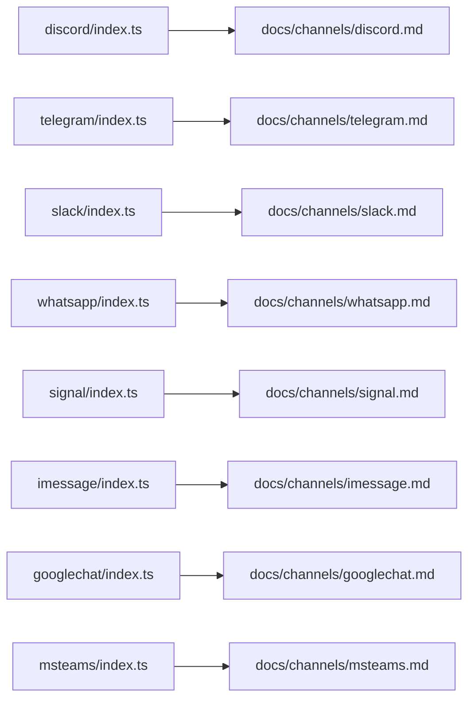

**Diagram sources**
- [discord/index.ts](file://extensions/discord/index.ts#L1-L20)
- [telegram/index.ts](file://extensions/telegram/index.ts#L1-L18)
- [slack/index.ts](file://extensions/slack/index.ts#L1-L18)
- [whatsapp/index.ts](file://extensions/whatsapp/index.ts#L1-L18)
- [signal/index.ts](file://extensions/signal/index.ts#L1-L18)
- [imessage/index.ts](file://extensions/imessage/index.ts#L1-L18)
- [googlechat/index.ts](file://extensions/googlechat/index.ts#L1-L18)
- [msteams/index.ts](file://extensions/msteams/index.ts#L1-L18)
- [discord.md](file://docs/channels/discord.md#L1-L1223)
- [telegram.md](file://docs/channels/telegram.md#L1-L948)
- [slack.md](file://docs/channels/slack.md#L1-L555)
- [whatsapp.md](file://docs/channels/whatsapp.md#L1-L446)
- [signal.md](file://docs/channels/signal.md#L1-L326)
- [imessage.md](file://docs/channels/imessage.md#L1-L368)
- [googlechat.md](file://docs/channels/googlechat.md#L1-L262)
- [msteams.md](file://docs/channels/msteams.md#L1-L777)

**Section sources**
- [discord/index.ts](file://extensions/discord/index.ts#L1-L20)
- [telegram/index.ts](file://extensions/telegram/index.ts#L1-L18)
- [slack/index.ts](file://extensions/slack/index.ts#L1-L18)
- [whatsapp/index.ts](file://extensions/whatsapp/index.ts#L1-L18)
- [signal/index.ts](file://extensions/signal/index.ts#L1-L18)
- [imessage/index.ts](file://extensions/imessage/index.ts#L1-L18)
- [googlechat/index.ts](file://extensions/googlechat/index.ts#L1-L18)
- [msteams/index.ts](file://extensions/msteams/index.ts#L1-L18)

## Performance Considerations
- Streaming and chunking: Many platforms support live preview or block streaming to improve perceived latency. Tune chunk sizes and modes per platform.
- Media handling: Optimize images and enforce size caps to reduce bandwidth and API costs.
- Rate limiting: Respect platform quotas; implement backoff and retry strategies for transient failures.
- History context: Limit history depth to balance context quality and prompt size.
- Webhook security: Validate signatures and audience claims to prevent abuse and unnecessary load.

[No sources needed since this section provides general guidance]

## Troubleshooting Guide
- Discord: Verify intents, permissions, pairing codes, forum thread creation, component usage.
- Telegram: Privacy mode, webhook URL/event subscriptions, DNS/HTTPS restrictions, long polling vs webhook.
- Slack: Socket mode connectivity, HTTP webhook paths, signing secrets, native command registration.
- WhatsApp: Link status, reconnect loops, active listener requirement, group gating, Bun compatibility.
- Signal: Daemon reachability, pairing approvals, config validation, signal-cli version.
- iMessage: RPC support, permissions, remote attachment paths, SSH key auth.
- Google Chat: 405 errors, plugin enabled, gateway restart, webhook URL/event subscriptions.
- Microsoft Teams: Webhook timeouts, manifest upload errors, RSC permissions, version mismatches.

**Section sources**
- [discord.md](file://docs/channels/discord.md#L169-L171)
- [discord.md](file://docs/channels/discord.md#L286-L326)
- [telegram.md](file://docs/channels/telegram.md#L793-L800)
- [telegram.md](file://docs/channels/telegram.md#L704-L721)
- [slack.md](file://docs/channels/slack.md#L433-L490)
- [whatsapp.md](file://docs/channels/whatsapp.md#L374-L424)
- [signal.md](file://docs/channels/signal.md#L251-L286)
- [imessage.md](file://docs/channels/imessage.md#L304-L360)
- [googlechat.md](file://docs/channels/googlechat.md#L209-L256)
- [msteams.md](file://docs/channels/msteams.md#L745-L777)

## Conclusion
Each platform integration in OpenClaw balances rich feature sets with platform-specific constraints. Operators should carefully configure authentication, authorization, and delivery policies, and leverage streaming, chunking, and moderation features to provide a responsive and secure user experience. The documentation pages and plugin architecture enable consistent deployment and maintenance across Discord, Telegram, Slack, WhatsApp, Signal, iMessage, Google Chat, and Microsoft Teams.