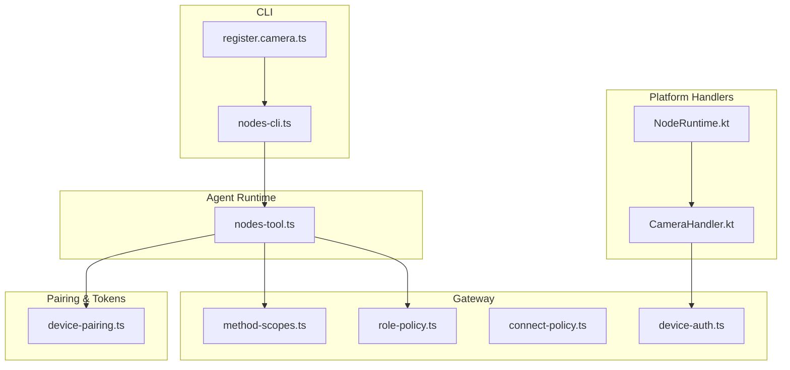
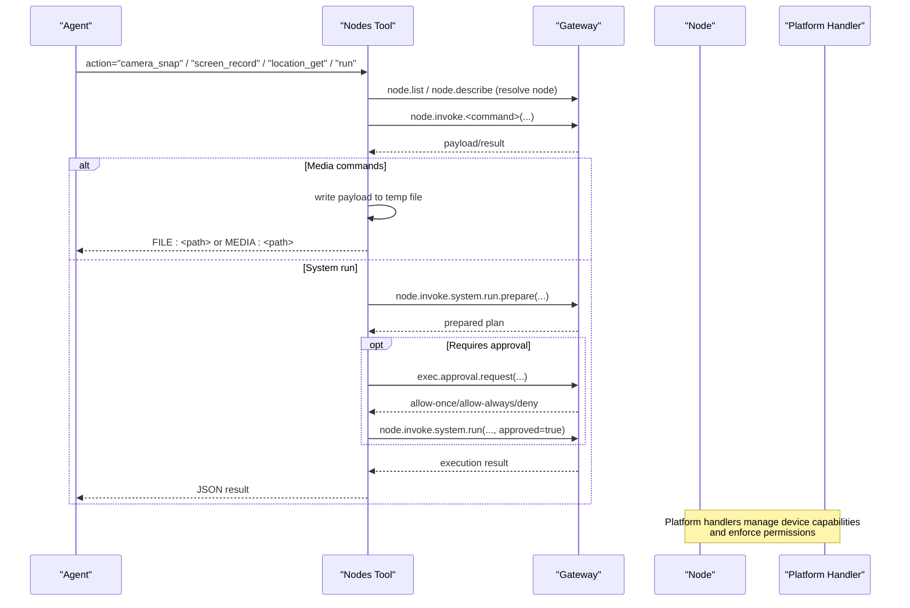
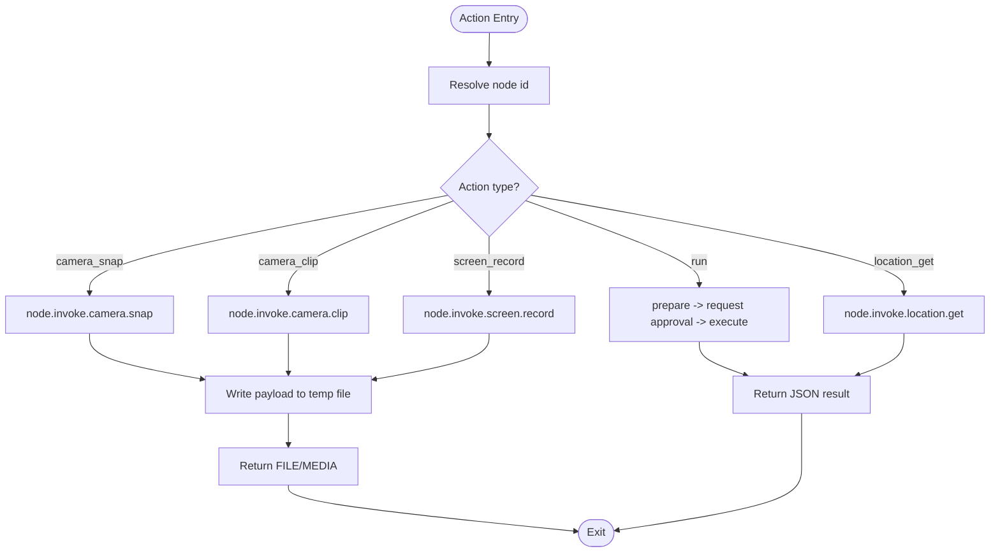
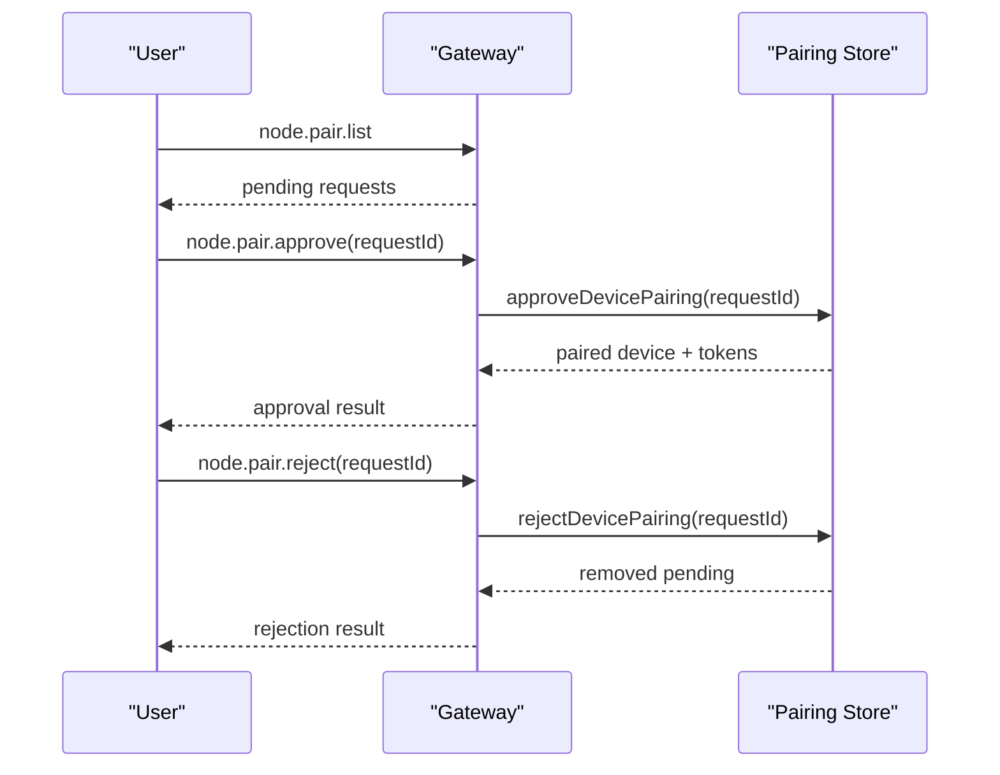
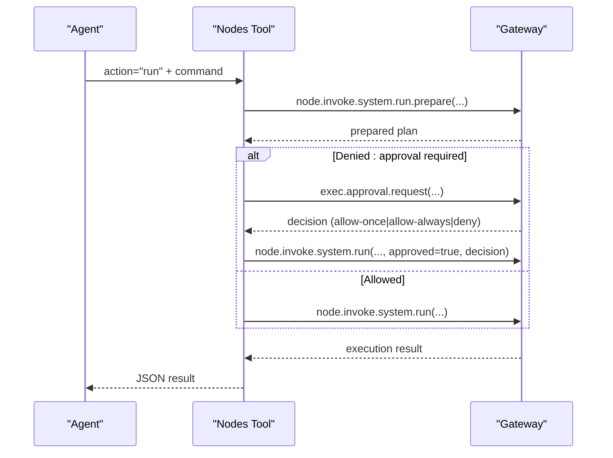
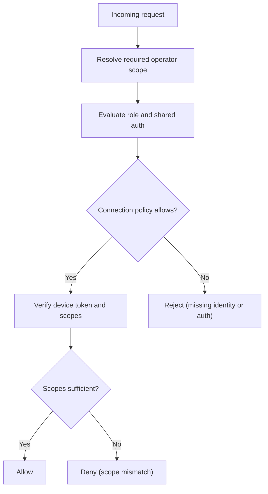
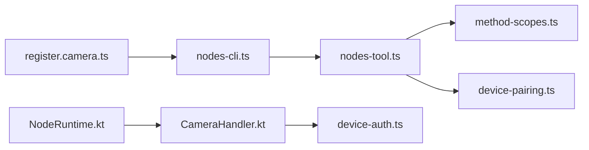

# Nodes Tool

<cite>
**Referenced Files in This Document**
- [nodes-tool.ts](file://src/agents/tools/nodes-tool.ts)
- [nodes-cli.ts](file://src/cli/nodes-cli.ts)
- [register.camera.ts](file://src/cli/nodes-cli/register.camera.ts)
- [approval-buttons.ts](file://src/telegram/approval-buttons.ts)
- [commands-approve.ts](file://src/auto-reply/reply/commands-approve.ts)
- [exec-approval-forwarder.ts](file://src/infra/exec-approval-forwarder.ts)
- [method-scopes.ts](file://src/gateway/method-scopes.ts)
- [role-policy.ts](file://src/gateway/role-policy.ts)
- [connect-policy.ts](file://src/gateway/server/ws-connection/connect-policy.ts)
- [device-auth.ts](file://src/gateway/device-auth.ts)
- [device-pairing.ts](file://src/infra/device-pairing.ts)
- [NodeRuntime.kt](file://apps/android/app/src/main/java/ai/openclaw/app/NodeRuntime.kt)
- [CameraHandler.kt](file://apps/android/app/src/main/java/ai/openclaw/app/node/CameraHandler.kt)
- [troubleshooting.md](file://docs/nodes/troubleshooting.md)
- [nodes/troubleshooting.md](file://docs/nodes/troubleshooting.md)
</cite>

## Table of Contents
1. [Introduction](#introduction)
2. [Project Structure](#project-structure)
3. [Core Components](#core-components)
4. [Architecture Overview](#architecture-overview)
5. [Detailed Component Analysis](#detailed-component-analysis)
6. [Dependency Analysis](#dependency-analysis)
7. [Performance Considerations](#performance-considerations)
8. [Troubleshooting Guide](#troubleshooting-guide)
9. [Conclusion](#conclusion)
10. [Appendices](#appendices)

## Introduction
This document explains the Nodes Tool that discovers, authenticates, and controls paired nodes across platforms. It covers node discovery and status, device management operations (camera, screen recording, location), notifications and system command execution, pairing workflows (approve, reject, pending), and permission management. It also documents authentication, security policies, device capabilities, integration patterns, automation scenarios, troubleshooting, and best practices.

## Project Structure
The Nodes Tool spans agent-side orchestration, CLI registration, gateway method scoping, pairing and token management, and platform-specific handlers (Android). The diagram below highlights the main modules involved in node control and pairing.

**Diagram sources**
- [nodes-tool.ts](file://src/agents/tools/nodes-tool.ts#L1-L816)
- [nodes-cli.ts](file://src/cli/nodes-cli.ts#L1-L2)
- [register.camera.ts](file://src/cli/nodes-cli/register.camera.ts#L37-L95)
- [method-scopes.ts](file://src/gateway/method-scopes.ts#L1-L217)
- [role-policy.ts](file://src/gateway/role-policy.ts#L1-L23)
- [connect-policy.ts](file://src/gateway/server/ws-connection/connect-policy.ts#L68-L102)
- [device-auth.ts](file://src/gateway/device-auth.ts#L1-L55)
- [device-pairing.ts](file://src/infra/device-pairing.ts#L1-L654)
- [NodeRuntime.kt](file://apps/android/app/src/main/java/ai/openclaw/app/NodeRuntime.kt#L44-L77)
- [CameraHandler.kt](file://apps/android/app/src/main/java/ai/openclaw/app/node/CameraHandler.kt#L22-L56)

**Section sources**
- [nodes-tool.ts](file://src/agents/tools/nodes-tool.ts#L1-L816)
- [nodes-cli.ts](file://src/cli/nodes-cli.ts#L1-L2)
- [register.camera.ts](file://src/cli/nodes-cli/register.camera.ts#L37-L95)
- [method-scopes.ts](file://src/gateway/method-scopes.ts#L1-L217)
- [role-policy.ts](file://src/gateway/role-policy.ts#L1-L23)
- [connect-policy.ts](file://src/gateway/server/ws-connection/connect-policy.ts#L68-L102)
- [device-auth.ts](file://src/gateway/device-auth.ts#L1-L55)
- [device-pairing.ts](file://src/infra/device-pairing.ts#L1-L654)
- [NodeRuntime.kt](file://apps/android/app/src/main/java/ai/openclaw/app/NodeRuntime.kt#L44-L77)
- [CameraHandler.kt](file://apps/android/app/src/main/java/ai/openclaw/app/node/CameraHandler.kt#L22-L56)

## Core Components
- Nodes Tool (agent): Orchestrates node actions (status, describe, pairing, notify, camera, screen record, location, notifications, run, invoke) and integrates with the gateway via node.invoke and pairing APIs.
- CLI camera subcommands: List cameras on a node and render results.
- Pairing and token management: Device pairing lifecycle (pending, approve, reject), token issuance/rotation/revoke, and verification.
- Security and roles: Method scoping, operator roles, and connection policy decisions.
- Platform handlers (Android): Discovery, camera listing/handling, and device identity/connection policy enforcement.

**Section sources**
- [nodes-tool.ts](file://src/agents/tools/nodes-tool.ts#L31-L816)
- [register.camera.ts](file://src/cli/nodes-cli/register.camera.ts#L37-L95)
- [device-pairing.ts](file://src/infra/device-pairing.ts#L255-L403)
- [method-scopes.ts](file://src/gateway/method-scopes.ts#L32-L133)
- [role-policy.ts](file://src/gateway/role-policy.ts#L1-L23)
- [connect-policy.ts](file://src/gateway/server/ws-connection/connect-policy.ts#L68-L102)
- [NodeRuntime.kt](file://apps/android/app/src/main/java/ai/openclaw/app/NodeRuntime.kt#L44-L77)
- [CameraHandler.kt](file://apps/android/app/src/main/java/ai/openclaw/app/node/CameraHandler.kt#L22-L56)

## Architecture Overview
The Nodes Tool executes actions by resolving node identifiers, invoking gateway methods, and coordinating with platform-specific handlers. Pairing and token verification ensure secure access. Approval workflows govern sensitive operations like system.run.

**Diagram sources**
- [nodes-tool.ts](file://src/agents/tools/nodes-tool.ts#L181-L786)
- [device-pairing.ts](file://src/infra/device-pairing.ts#L320-L384)
- [exec-approval-forwarder.ts](file://src/infra/exec-approval-forwarder.ts#L453-L495)

## Detailed Component Analysis

### Nodes Tool Orchestration
- Actions supported: status, describe, pending, approve, reject, notify, camera_snap, camera_clip, photos_latest, screen_record, location_get, notifications_list/action, device_status/info/permissions/health, run, invoke.
- Resolves node identifiers via gateway and invokes node.invoke with idempotency keys.
- Media commands download payloads to temporary files and optionally attach inline images when vision is available.
- System.run uses a two-phase flow: prepare, then request approval if needed, then execute with approval flags.

**Diagram sources**
- [nodes-tool.ts](file://src/agents/tools/nodes-tool.ts#L181-L786)

**Section sources**
- [nodes-tool.ts](file://src/agents/tools/nodes-tool.ts#L31-L816)

### CLI Camera Subcommands
- Lists cameras on a node by invoking node.invoke.camera.list and rendering a table or JSON.

**Section sources**
- [register.camera.ts](file://src/cli/nodes-cli/register.camera.ts#L37-L95)

### Pairing Workflows
- Pending pairing requests are listed and approved or rejected via gateway methods.
- Device pairing state includes pending requests and paired devices with tokens.
- Token verification ensures role and scope alignment before granting access.

**Diagram sources**
- [nodes-tool.ts](file://src/agents/tools/nodes-tool.ts#L195-L216)
- [device-pairing.ts](file://src/infra/device-pairing.ts#L255-L403)

**Section sources**
- [nodes-tool.ts](file://src/agents/tools/nodes-tool.ts#L195-L216)
- [device-pairing.ts](file://src/infra/device-pairing.ts#L255-L403)

### System Run and Exec Approvals
- Preparation phase returns a plan; if denied due to approval requirement, the tool requests approval and retries with decision flags.
- Approval buttons and commands enable Telegram-based approvals.

**Diagram sources**
- [nodes-tool.ts](file://src/agents/tools/nodes-tool.ts#L607-L748)
- [exec-approval-forwarder.ts](file://src/infra/exec-approval-forwarder.ts#L453-L495)
- [approval-buttons.ts](file://src/telegram/approval-buttons.ts#L10-L42)
- [commands-approve.ts](file://src/auto-reply/reply/commands-approve.ts#L75-L116)

**Section sources**
- [nodes-tool.ts](file://src/agents/tools/nodes-tool.ts#L607-L748)
- [exec-approval-forwarder.ts](file://src/infra/exec-approval-forwarder.ts#L453-L495)
- [approval-buttons.ts](file://src/telegram/approval-buttons.ts#L10-L42)
- [commands-approve.ts](file://src/auto-reply/reply/commands-approve.ts#L75-L116)

### Authentication, Roles, and Security Policies
- Method scoping maps gateway methods to operator scopes (read/write/admin/approvals/pairing).
- Role policy determines whether a role can skip device identity and which methods are authorized.
- Connection policy evaluates missing device identity and allows local control UI under specific conditions.
- Device authentication payloads encode device metadata and scopes for verification.

**Diagram sources**
- [method-scopes.ts](file://src/gateway/method-scopes.ts#L137-L217)
- [role-policy.ts](file://src/gateway/role-policy.ts#L14-L23)
- [connect-policy.ts](file://src/gateway/server/ws-connection/connect-policy.ts#L68-L102)
- [device-auth.ts](file://src/gateway/device-auth.ts#L20-L54)

**Section sources**
- [method-scopes.ts](file://src/gateway/method-scopes.ts#L1-L217)
- [role-policy.ts](file://src/gateway/role-policy.ts#L1-L23)
- [connect-policy.ts](file://src/gateway/server/ws-connection/connect-policy.ts#L68-L102)
- [device-auth.ts](file://src/gateway/device-auth.ts#L1-L55)

### Platform Handlers (Android)
- NodeRuntime orchestrates discovery, camera, location, and other device capabilities.
- CameraHandler lists cameras and builds device payloads for the gateway.

**Section sources**
- [NodeRuntime.kt](file://apps/android/app/src/main/java/ai/openclaw/app/NodeRuntime.kt#L44-L77)
- [CameraHandler.kt](file://apps/android/app/src/main/java/ai/openclaw/app/node/CameraHandler.kt#L22-L56)

## Dependency Analysis
The Nodes Tool depends on gateway method scoping, pairing/token management, and platform handlers. The diagram below shows key dependencies.

**Diagram sources**
- [nodes-tool.ts](file://src/agents/tools/nodes-tool.ts#L1-L816)
- [method-scopes.ts](file://src/gateway/method-scopes.ts#L1-L217)
- [device-pairing.ts](file://src/infra/device-pairing.ts#L1-L654)
- [nodes-cli.ts](file://src/cli/nodes-cli.ts#L1-L2)
- [register.camera.ts](file://src/cli/nodes-cli/register.camera.ts#L37-L95)
- [NodeRuntime.kt](file://apps/android/app/src/main/java/ai/openclaw/app/NodeRuntime.kt#L44-L77)
- [CameraHandler.kt](file://apps/android/app/src/main/java/ai/openclaw/app/node/CameraHandler.kt#L22-L56)
- [device-auth.ts](file://src/gateway/device-auth.ts#L1-L55)

**Section sources**
- [nodes-tool.ts](file://src/agents/tools/nodes-tool.ts#L1-L816)
- [method-scopes.ts](file://src/gateway/method-scopes.ts#L1-L217)
- [device-pairing.ts](file://src/infra/device-pairing.ts#L1-L654)
- [nodes-cli.ts](file://src/cli/nodes-cli.ts#L1-L2)
- [register.camera.ts](file://src/cli/nodes-cli/register.camera.ts#L37-L95)
- [NodeRuntime.kt](file://apps/android/app/src/main/java/ai/openclaw/app/NodeRuntime.kt#L44-L77)
- [CameraHandler.kt](file://apps/android/app/src/main/java/ai/openclaw/app/node/CameraHandler.kt#L22-L56)
- [device-auth.ts](file://src/gateway/device-auth.ts#L1-L55)

## Performance Considerations
- Media operations (camera snap/clip, screen record) write to temporary files; ensure adequate disk space and avoid excessive concurrency.
- System.run preparation and approval introduces latency; batch related commands and reuse prepared plans when possible.
- Use appropriate timeouts for node.invoke and approval requests to balance responsiveness and reliability.

## Troubleshooting Guide
Common symptoms and resolutions:
- Node visible but tool calls fail: verify pairing and foreground permissions.
- Foreground-restricted commands fail: bring node to foreground and retry.
- System execution denied: check exec approvals and allowlist configuration.
- Permission errors: confirm OS permissions for camera, screen recording, location, and system execution.
- Quick recovery loop: check node status, device approvals, and logs.

**Section sources**
- [troubleshooting.md](file://docs/nodes/troubleshooting.md#L51-L115)
- [nodes/troubleshooting.md](file://docs/nodes/troubleshooting.md#L51-L115)

## Conclusion
The Nodes Tool provides a unified interface to discover, authenticate, and control nodes across platforms. Robust pairing, token management, and approval workflows ensure secure operations, while method scoping and role policies enforce least privilege. Following the troubleshooting steps and best practices helps maintain reliable automation.

## Appendices

### Common Automation Scenarios
- Camera monitoring: periodically capture camera snaps and upload to storage.
- Screen recording: schedule short screen captures for UI regression checks.
- Location polling: fetch location updates at intervals for presence tracking.
- System run automation: prepare commands, request approvals, and execute with safeguards.

### Best Practices for Secure Device Management
- Keep pairing approvals current and scoped to minimal required roles and scopes.
- Rotate device tokens regularly and revoke unused ones.
- Enforce foreground execution for sensitive operations and respect platform permissions.
- Monitor logs and use approvals to limit risky system.run commands.