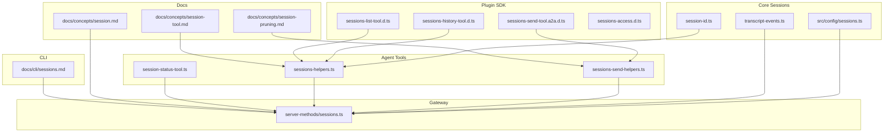
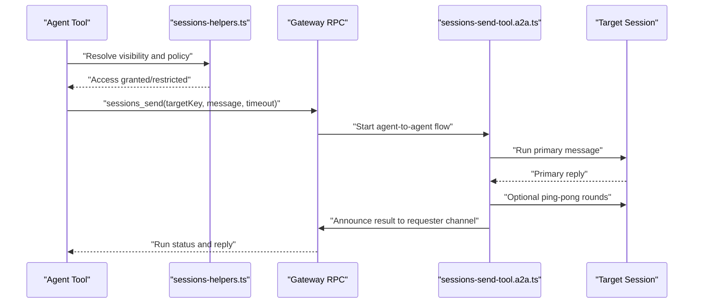
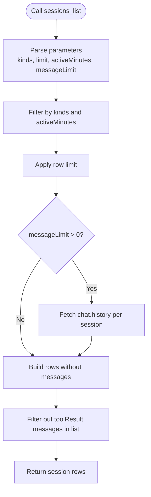
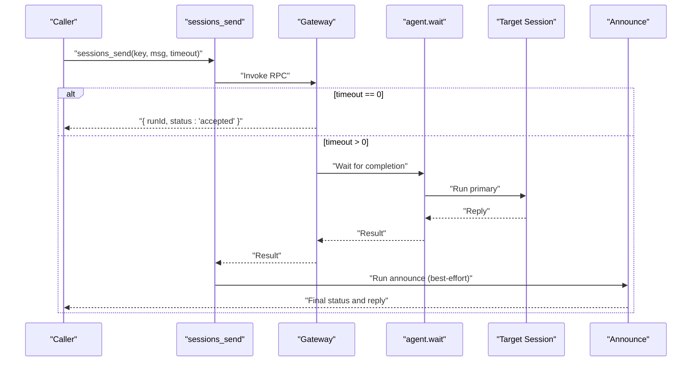
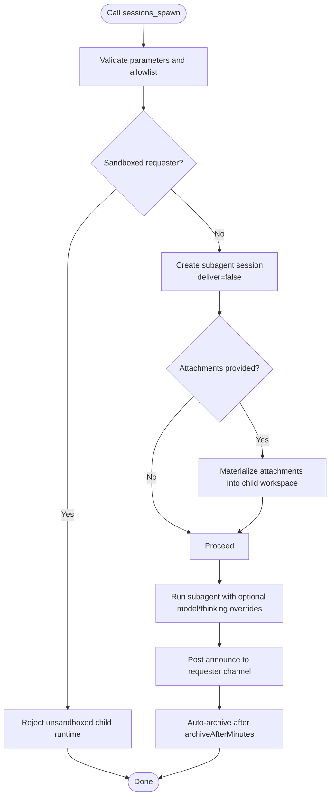
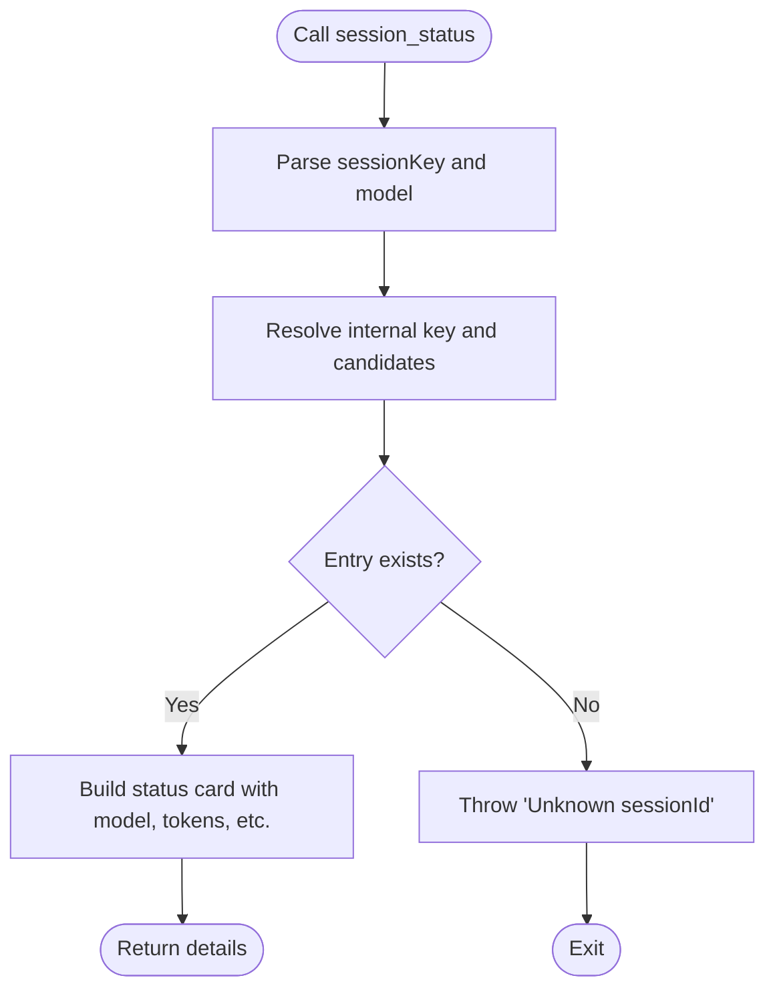
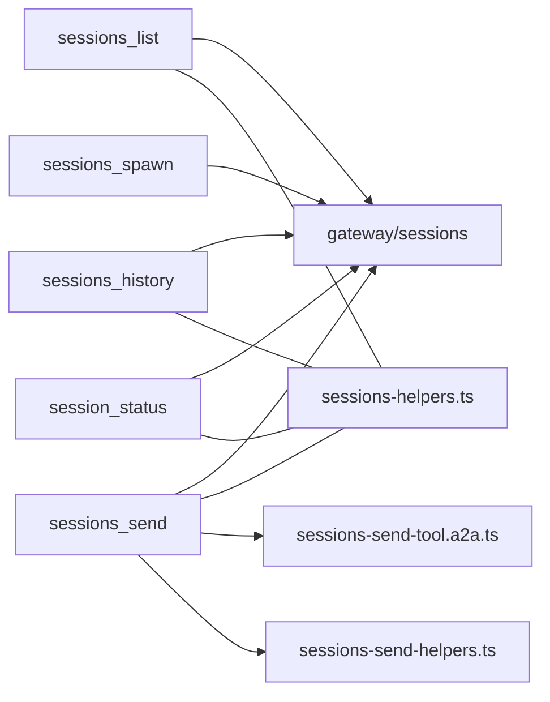

# Session Management Tools

<cite>
**Referenced Files in This Document**
- [docs/cli/sessions.md](file://docs/cli/sessions.md)
- [docs/concepts/session.md](file://docs/concepts/session.md)
- [docs/concepts/session-tool.md](file://docs/concepts/session-tool.md)
- [docs/concepts/session-pruning.md](file://docs/concepts/session-pruning.md)
- [src/sessions/session-id.ts](file://src/sessions/session-id.ts)
- [src/sessions/transcript-events.ts](file://src/sessions/transcript-events.ts)
- [dist/plugin-sdk/agents/tools/sessions-list-tool.d.ts](file://dist/plugin-sdk/agents/tools/sessions-list-tool.d.ts)
- [dist/plugin-sdk/agents/tools/sessions-history-tool.d.ts](file://dist/plugin-sdk/agents/tools/sessions-history-tool.d.ts)
- [dist/plugin-sdk/agents/tools/sessions-send-tool.a2a.d.ts](file://dist/plugin-sdk/agents/tools/sessions-send-tool.a2a.d.ts)
- [dist/plugin-sdk/agents/tools/sessions-access.d.ts](file://dist/plugin-sdk/agents/tools/sessions-access.d.ts)
- [src/agents/tools/session-status-tool.ts](file://src/agents/tools/session-status-tool.ts)
- [src/agents/tools/sessions-helpers.ts](file://src/agents/tools/sessions-helpers.ts)
- [src/agents/tools/sessions-send-helpers.ts](file://src/agents/tools/sessions-send-helpers.ts)
- [src/gateway/server-methods/sessions.ts](file://src/gateway/server-methods/sessions.ts)
- [src/config/sessions.ts](file://src/config/sessions.ts)
</cite>

## Table of Contents
1. [Introduction](#introduction)
2. [Project Structure](#project-structure)
3. [Core Components](#core-components)
4. [Architecture Overview](#architecture-overview)
5. [Detailed Component Analysis](#detailed-component-analysis)
6. [Dependency Analysis](#dependency-analysis)
7. [Performance Considerations](#performance-considerations)
8. [Troubleshooting Guide](#troubleshooting-guide)
9. [Conclusion](#conclusion)
10. [Appendices](#appendices)

## Introduction
This document explains OpenClaw’s session management tools and concepts: sessions_list, sessions_history, sessions_send, sessions_spawn, and session_status. It covers session lifecycle management, cross-session communication, subagent spawning, visibility controls, targeting restrictions, sandbox integration, attachment handling, pruning policies, and practical orchestration workflows. It also provides troubleshooting tips and best practices for organizing conversation threads across multiple agents and sessions.

## Project Structure
OpenClaw organizes session-related logic across documentation, configuration, gateway RPC, agent tools, and plugin SDK types. The CLI reference documents operational commands; the concepts guide explains policies and lifecycles; the plugin SDK defines tool signatures; and the gateway implements the authoritative session store and RPC methods.

**Diagram sources**
- [docs/cli/sessions.md](file://docs/cli/sessions.md#L1-L105)
- [docs/concepts/session.md](file://docs/concepts/session.md#L1-L311)
- [docs/concepts/session-tool.md](file://docs/concepts/session-tool.md#L1-L224)
- [docs/concepts/session-pruning.md](file://docs/concepts/session-pruning.md#L1-L122)
- [dist/plugin-sdk/agents/tools/sessions-list-tool.d.ts](file://dist/plugin-sdk/agents/tools/sessions-list-tool.d.ts#L1-L6)
- [dist/plugin-sdk/agents/tools/sessions-history-tool.d.ts](file://dist/plugin-sdk/agents/tools/sessions-history-tool.d.ts#L1-L6)
- [dist/plugin-sdk/agents/tools/sessions-send-tool.a2a.d.ts](file://dist/plugin-sdk/agents/tools/sessions-send-tool.a2a.d.ts#L1-L13)
- [dist/plugin-sdk/agents/tools/sessions-access.d.ts](file://dist/plugin-sdk/agents/tools/sessions-access.d.ts#L1-L43)
- [src/agents/tools/session-status-tool.ts](file://src/agents/tools/session-status-tool.ts#L45-L88)
- [src/agents/tools/sessions-helpers.ts](file://src/agents/tools/sessions-helpers.ts#L1-L172)
- [src/agents/tools/sessions-send-helpers.ts](file://src/agents/tools/sessions-send-helpers.ts#L1-L167)
- [src/gateway/server-methods/sessions.ts](file://src/gateway/server-methods/sessions.ts#L331-L755)
- [src/sessions/session-id.ts](file://src/sessions/session-id.ts#L1-L6)
- [src/sessions/transcript-events.ts](file://src/sessions/transcript-events.ts#L1-L30)
- [src/config/sessions.ts](file://src/config/sessions.ts#L1-L13)

**Section sources**
- [docs/cli/sessions.md](file://docs/cli/sessions.md#L1-L105)
- [docs/concepts/session.md](file://docs/concepts/session.md#L1-L311)
- [docs/concepts/session-tool.md](file://docs/concepts/session-tool.md#L1-L224)
- [docs/concepts/session-pruning.md](file://docs/concepts/session-pruning.md#L1-L122)
- [src/sessions/session-id.ts](file://src/sessions/session-id.ts#L1-L6)
- [src/sessions/transcript-events.ts](file://src/sessions/transcript-events.ts#L1-L30)
- [src/config/sessions.ts](file://src/config/sessions.ts#L1-L13)

## Core Components
- sessions_list: Lists sessions with optional filtering and recent messages.
- sessions_history: Fetches transcript for a session, optionally including tool results.
- sessions_send: Sends a message into another session with wait/timeout and announce behavior.
- sessions_spawn: Spawns a sub-agent run in an isolated session with sandbox and attachment support.
- session_status: Reports status and usage for a given session key or current session.

These tools rely on:
- Session keys and identifiers
- Visibility and sandbox policies
- Send policy rules
- Gateway RPC for authoritative session state
- Maintenance and pruning policies

**Section sources**
- [docs/concepts/session-tool.md](file://docs/concepts/session-tool.md#L12-L28)
- [docs/concepts/session.md](file://docs/concepts/session.md#L177-L218)
- [docs/concepts/session-pruning.md](file://docs/concepts/session-pruning.md#L1-L122)

## Architecture Overview
The session tools integrate with the gateway to provide authoritative session state and operations. Cross-session messaging uses agent-to-agent flows with optional ping-pong and announce steps. Subagent spawning creates isolated sessions with sandbox enforcement and attachment handling.

**Diagram sources**
- [docs/concepts/session-tool.md](file://docs/concepts/session-tool.md#L78-L106)
- [src/agents/tools/sessions-helpers.ts](file://src/agents/tools/sessions-helpers.ts#L1-L172)
- [src/agents/tools/sessions-send-helpers.ts](file://src/agents/tools/sessions-send-helpers.ts#L1-L167)
- [src/agents/tools/sessions-send-tool.a2a.d.ts](file://dist/plugin-sdk/agents/tools/sessions-send-tool.a2a.d.ts#L1-L13)
- [src/gateway/server-methods/sessions.ts](file://src/gateway/server-methods/sessions.ts#L331-L755)

## Detailed Component Analysis

### sessions_list
- Purpose: List sessions with optional filters and recent messages.
- Parameters: kinds, limit, activeMinutes, messageLimit.
- Behavior:
  - messageLimit > 0 fetches chat.history per session and includes the last N messages.
  - Tool results are filtered out in list output; use sessions_history for tool messages.
  - In sandboxed sessions, visibility defaults to spawned-only.
- Output row fields include key, kind, channel, displayName, updatedAt, sessionId, model, contextTokens, totalTokens, thinkingLevel, verboseLevel, systemSent, abortedLastRun, sendPolicy, lastChannel, lastTo, deliveryContext, transcriptPath, and optional messages.

**Diagram sources**
- [docs/concepts/session-tool.md](file://docs/concepts/session-tool.md#L29-L61)

**Section sources**
- [docs/concepts/session-tool.md](file://docs/concepts/session-tool.md#L29-L61)

### sessions_history
- Purpose: Fetch transcript for one session.
- Parameters: sessionKey (accepts session key or sessionId), limit, includeTools.
- Behavior:
  - includeTools=false filters role: "toolResult" messages.
  - Returns messages array in raw transcript format.
  - When given a sessionId, resolves to the corresponding session key (missing ids error).

**Section sources**
- [docs/concepts/session-tool.md](file://docs/concepts/session-tool.md#L62-L77)

### sessions_send
- Purpose: Send a message into another session.
- Parameters: sessionKey, message, timeoutSeconds.
- Behavior:
  - timeoutSeconds = 0: enqueue and return { runId, status: "accepted" }.
  - timeoutSeconds > 0: wait up to N seconds for completion, then return { runId, status: "ok", reply }.
  - If wait times out: { runId, status: "timeout", error }; run continues; call sessions_history later.
  - If the run fails: { runId, status: "error", error }.
  - Announce delivery runs after the primary run completes and is best-effort.
  - Waits via gateway agent.wait so reconnects don’t drop the wait.
  - Agent-to-agent message context is injected for the primary run.
  - Inter-session messages are persisted with provenance.kind = "inter_session".
  - Reply-back loop alternates between requester and target agents; max turns governed by session.agentToAgent.maxPingPongTurns.
  - After the loop, agent-to-agent announce step posts to the target channel; reply exactly ANNOUNCE_SKIP to stay silent.

**Diagram sources**
- [docs/concepts/session-tool.md](file://docs/concepts/session-tool.md#L78-L106)
- [src/agents/tools/sessions-send-helpers.ts](file://src/agents/tools/sessions-send-helpers.ts#L1-L167)
- [src/agents/tools/sessions-send-tool.a2a.d.ts](file://dist/plugin-sdk/agents/tools/sessions-send-tool.a2a.d.ts#L1-L13)

**Section sources**
- [docs/concepts/session-tool.md](file://docs/concepts/session-tool.md#L78-L106)

### sessions_spawn
- Purpose: Spawn a sub-agent run in an isolated session and announce the result back to the requester chat channel.
- Parameters: task, label, agentId, model, thinking, runTimeoutSeconds, thread, mode, cleanup, sandbox, attachments, attachAs.
- Allowlist and sandbox:
  - agents.list[].subagents.allowAgents governs allowed agent ids.
  - Sandbox inheritance guard: if the requester session is sandboxed, reject targets that would run unsandboxed.
- Discovery: Use agents_list to discover allowed agent ids.
- Behavior:
  - Starts a new agent:<agentId>:subagent:<uuid> session with deliver: false.
  - Sub-agents default to the full tool set minus session tools (configurable via tools.subagents.tools).
  - Always non-blocking: returns { status: "accepted", runId, childSessionKey } immediately.
  - With thread=true, channel plugins can bind delivery/routing to a thread target.
  - After completion, runs sub-agent announce step and posts result to requester chat channel.
  - Reply exactly ANNOUNCE_SKIP during announce to stay silent.
  - Sub-agent sessions are auto-archived after agents.defaults.subagents.archiveAfterMinutes.

**Diagram sources**
- [docs/concepts/session-tool.md](file://docs/concepts/session-tool.md#L144-L185)

**Section sources**
- [docs/concepts/session-tool.md](file://docs/concepts/session-tool.md#L144-L185)

### session_status
- Purpose: Report status and usage for a given session key or current session.
- Parameters: sessionKey (optional), model (optional).
- Resolution logic:
  - Accepts raw key, internal key, agent alias, or "main".
  - Resolves candidates and returns the session entry if found.
  - Errors for unknown session keys.

**Diagram sources**
- [src/agents/tools/session-status-tool.ts](file://src/agents/tools/session-status-tool.ts#L45-L88)

**Section sources**
- [src/agents/tools/session-status-tool.ts](file://src/agents/tools/session-status-tool.ts#L45-L88)

## Dependency Analysis
- Tool-to-Gateway dependencies:
  - sessions_list depends on sessions.list and chat.history.
  - sessions_history depends on chat.history.
  - sessions_send depends on agent, agent.wait, chat.history.
  - sessions_spawn depends on ACP or sub-agent derivation interfaces.
  - session_status depends on session store and usage summaries.
- Visibility and policy enforcement:
  - All tools use sessions-helpers for visibility guards and sandbox policies.
  - Agent-to-agent policy driven by tools.agentToAgent configuration.
- Cross-session communication:
  - sessions_send uses sessions-send-tool.a2a for agent-to-agent flows and announce steps.
  - sessions_send-helpers coordinates wait semantics and result propagation.

**Diagram sources**
- [docs/concepts/session-tool.md](file://docs/concepts/session-tool.md#L352-L376)
- [src/agents/tools/sessions-helpers.ts](file://src/agents/tools/sessions-helpers.ts#L1-L172)
- [src/agents/tools/sessions-send-helpers.ts](file://src/agents/tools/sessions-send-helpers.ts#L1-L167)
- [src/agents/tools/sessions-send-tool.a2a.d.ts](file://dist/plugin-sdk/agents/tools/sessions-send-tool.a2a.d.ts#L1-L13)
- [src/gateway/server-methods/sessions.ts](file://src/gateway/server-methods/sessions.ts#L331-L755)

**Section sources**
- [docs/concepts/session-tool.md](file://docs/concepts/session-tool.md#L352-L376)

## Performance Considerations
- Large session stores:
  - Maintenance runs during writes; consider mode: "enforce" to bound growth.
  - Tune pruneAfter, maxEntries, rotateBytes, and maxDiskBytes with highWaterBytes.
  - Use dry-run previews to estimate impact before enforcing.
- Pruning:
  - Session pruning trims old tool results from in-memory context before LLM calls (not on-disk history).
  - For Anthropic, cache-ttl pruning reduces cacheWrite size and resets TTL window after pruning.
- Disk budgeting:
  - Enable maxDiskBytes and highWaterBytes for hard upper bounds; keep highWaterBytes meaningfully below maxDiskBytes.

[No sources needed since this section provides general guidance]

## Troubleshooting Guide
Common issues and remedies:
- Unknown session key errors:
  - session_status throws when resolving an unknown key; verify the key or use sessions_list to discover valid keys.
- Cross-session send failures:
  - Check send policy rules and runtime overrides; ensure requester and target agents are allowed by tools.agentToAgent.
  - Confirm visibility settings (self/tree/agent/all) and sandbox constraints.
- Timeout or missing replies:
  - sessions_send with timeoutSeconds > 0 may return timeout; call sessions_history later to inspect progress.
  - Verify agent.wait availability and connectivity.
- Subagent spawn rejected:
  - Ensure allowAgents includes the requested agentId; sandboxed sessions prevent spawning unsandboxed children.
- Maintenance backlog:
  - Use openclaw sessions cleanup --dry-run to preview pruning/capping; adjust session.maintenance.* settings accordingly.

**Section sources**
- [src/agents/tools/session-status-tool.ts](file://src/agents/tools/session-status-tool.ts#L118-L129)
- [docs/concepts/session-tool.md](file://docs/concepts/session-tool.md#L114-L143)
- [docs/cli/sessions.md](file://docs/cli/sessions.md#L48-L100)

## Conclusion
OpenClaw’s session tools provide a cohesive framework for listing, inspecting, sending, spawning, and monitoring sessions. By combining authoritative gateway state, robust visibility and sandbox policies, and structured agent-to-agent flows, teams can orchestrate complex multi-agent workflows while maintaining control over context, privacy, and resource usage.

[No sources needed since this section summarizes without analyzing specific files]

## Appendices

### Session Keys and Identifiers
- Main direct chat bucket is always the literal key "main" (resolved to the current agent’s main key).
- Group chats use agent:<agentId>:<channel>:group:<id> or agent:<agentId>:<channel>:channel:<id>.
- Cron jobs use cron:<job.id>; hooks use hook:<uuid> unless explicitly set; node sessions use node-<nodeId>.

**Section sources**
- [docs/concepts/session-tool.md](file://docs/concepts/session-tool.md#L19-L27)

### Session Lifecycle and Reset Policies
- Reset policy: sessions are reused until they expire; expiry evaluated on next inbound message.
- Daily reset defaults to 4:00 AM local time on the gateway host.
- Idle reset (optional): idleMinutes adds a sliding idle window.
- Per-type and per-channel overrides supported.
- Reset triggers: /new or /reset (plus resetTriggers) start a fresh sessionId.

**Section sources**
- [docs/concepts/session.md](file://docs/concepts/session.md#L207-L218)

### Maintenance and Cleanup
- Maintenance modes: warn (preview) or enforce (apply).
- Pruning: older-than pruneAfter, capping by maxEntries, archiving removed transcripts, purging old archives, rotating sessions.json, and enforcing disk budget toward highWaterBytes.
- Use openclaw sessions cleanup with --dry-run and --json to preview impacts.

**Section sources**
- [docs/concepts/session.md](file://docs/concepts/session.md#L74-L120)
- [docs/cli/sessions.md](file://docs/cli/sessions.md#L48-L100)

### Sandbox Integration and Visibility Controls
- Default visibility: tree (current session + spawned subagent sessions).
- For sandboxed sessions, agents.defaults.sandbox.sessionToolsVisibility can hard-clamp visibility.
- Configurable via tools.sessions.visibility and agents.defaults.sandbox.sessionToolsVisibility.

**Section sources**
- [docs/concepts/session-tool.md](file://docs/concepts/session-tool.md#L186-L224)

### Attachment Handling in Subagent Spawning
- Optional attachments array with name, content, encoding, mimeType materialized into child workspace.
- Returns a receipt with sha256 per file; ACP rejects inline attachments.

**Section sources**
- [docs/concepts/session-tool.md](file://docs/concepts/session-tool.md#L159-L161)

### Session Pruning Details
- Trims old tool results from in-memory context before LLM calls (not on-disk history).
- Supports cache-ttl mode for Anthropic with TTL-aware pruning and placeholder hard-clears.
- KeepLastAssistants protection and skip for image blocks.

**Section sources**
- [docs/concepts/session-pruning.md](file://docs/concepts/session-pruning.md#L1-L122)

### Operational Workflows

#### Listing and Inspecting Sessions
- Use openclaw sessions to list and openclaw sessions --json for machine-readable output.
- Use sessions_list to programmatically enumerate sessions and optionally include recent messages.

**Section sources**
- [docs/cli/sessions.md](file://docs/cli/sessions.md#L12-L18)
- [docs/concepts/session-tool.md](file://docs/concepts/session-tool.md#L29-L44)

#### Cross-Agent Orchestration with sessions_send
- Send a message to another session with optional timeout.
- Expect best-effort announce delivery; use sessions_history to inspect outcomes after timeouts.

**Section sources**
- [docs/concepts/session-tool.md](file://docs/concepts/session-tool.md#L78-L106)

#### Subagent Orchestration with sessions_spawn
- Spawn isolated sub-agent runs with sandbox enforcement and optional attachments.
- Monitor announce results and auto-archive after archiveAfterMinutes.

**Section sources**
- [docs/concepts/session-tool.md](file://docs/concepts/session-tool.md#L144-L185)

#### Session Status Monitoring
- Use session_status to report model, tokens, and session metadata for a given key or current session.

**Section sources**
- [src/agents/tools/session-status-tool.ts](file://src/agents/tools/session-status-tool.ts#L45-L88)

### Best Practices
- Keep primary key dedicated to 1:1 traffic; let groups keep their own keys.
- Use secure DM mode (dmScope) for multi-user setups to avoid context leakage.
- Configure both time and count limits for maintenance; preview with dry-run.
- Restrict send policy by channel/chat type; use runtime overrides sparingly.
- Prefer tree visibility for sandboxed sessions; avoid exposing "all" unless necessary.
- Use sessions_history to audit toolResult messages and prune policies.

[No sources needed since this section provides general guidance]