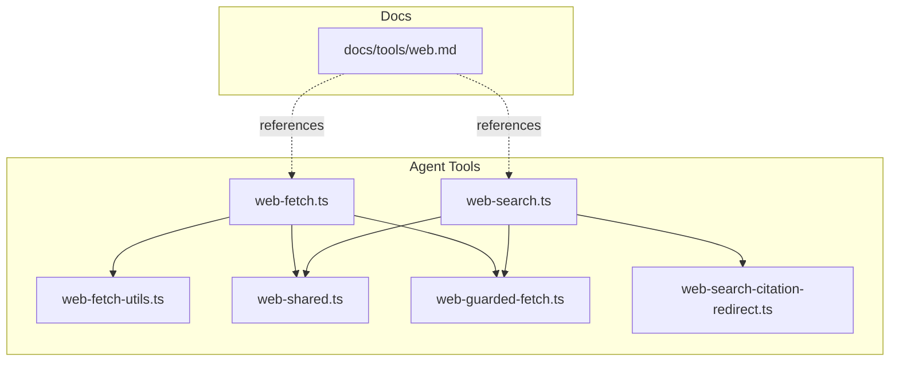
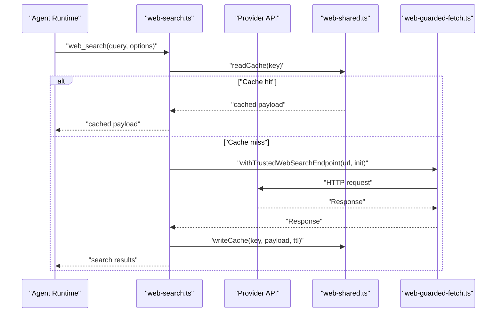
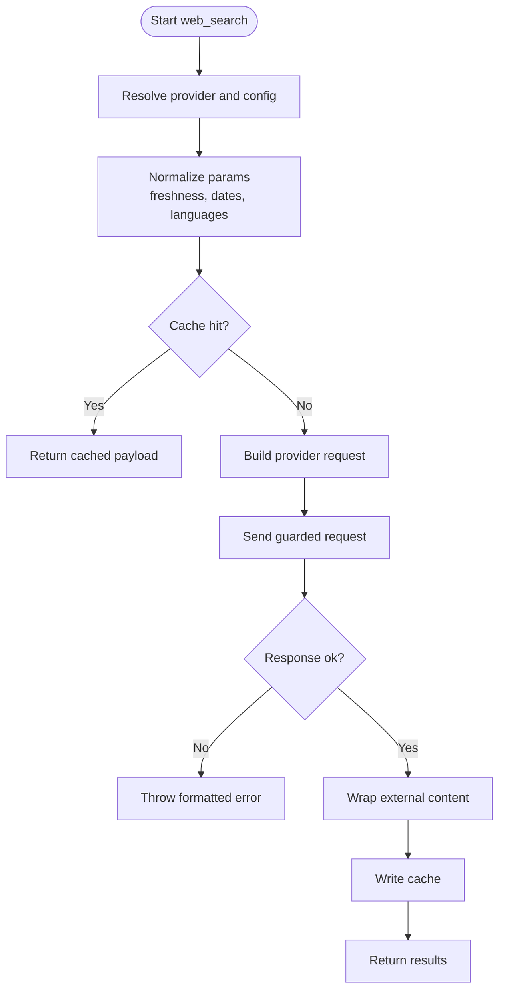
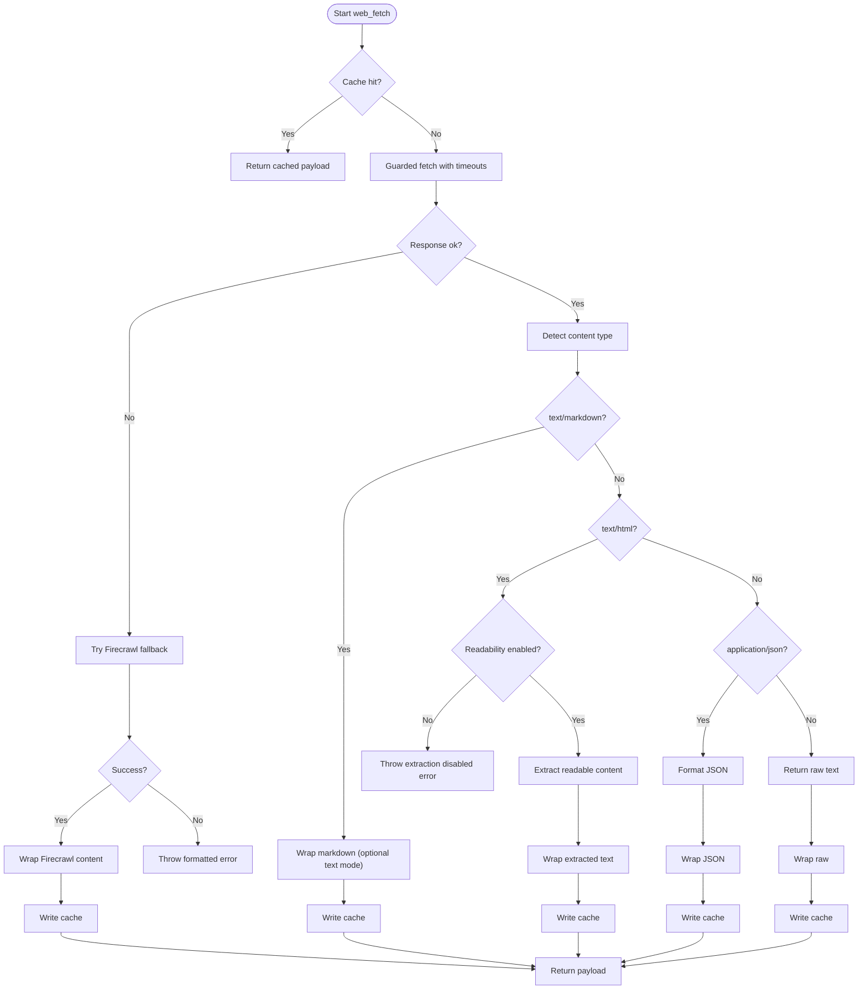
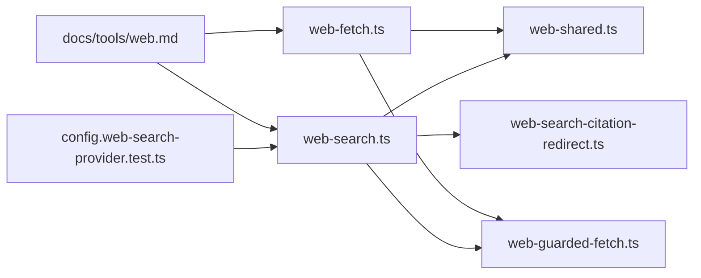

# Web Tools

<cite>
**Referenced Files in This Document**
- [web-search.ts](file://src/agents/tools/web-search.ts)
- [web-fetch.ts](file://src/agents/tools/web-fetch.ts)
- [web-fetch-utils.ts](file://src/agents/tools/web-fetch-utils.ts)
- [web-shared.ts](file://src/agents/tools/web-shared.ts)
- [web-guarded-fetch.ts](file://src/agents/tools/web-guarded-fetch.ts)
- [web-search-citation-redirect.ts](file://src/agents/tools/web-search-citation-redirect.ts)
- [web-tools.ts](file://src/agents/tools/web-tools.ts)
- [web.md](file://docs/tools/web.md)
- [config.web-search-provider.test.ts](file://src/config/config.web-search-provider.test.ts)
- [web-fetch-utils.test.ts](file://src/agents/tools/web-tools.readability.test.ts)
- [web-fetch.cf-markdown.test.ts](file://src/agents/tools/web-fetch.cf-markdown.test.ts)
</cite>

## Table of Contents
1. [Introduction](#introduction)
2. [Project Structure](#project-structure)
3. [Core Components](#core-components)
4. [Architecture Overview](#architecture-overview)
5. [Detailed Component Analysis](#detailed-component-analysis)
6. [Dependency Analysis](#dependency-analysis)
7. [Performance Considerations](#performance-considerations)
8. [Troubleshooting Guide](#troubleshooting-guide)
9. [Conclusion](#conclusion)
10. [Appendices](#appendices)

## Introduction
This document explains OpenClaw’s web tools with a focus on web search and web fetch capabilities. It covers supported providers (Brave, Gemini, Grok, Kimi, Perplexity), search result processing, caching, configuration, and robust content extraction. It also describes HTML-to-markdown conversion, JavaScript-heavy site handling, anti-bot detection bypass options, provider-specific setup, rate limiting considerations, caching strategies, and troubleshooting guidance for reliable web scraping and content retrieval.

## Project Structure
The web tools are implemented as agent tools with provider-specific handlers, shared caching and timeouts, and guarded network access. The primary modules are:
- Web search tool: provider selection, parameter normalization, API routing, and result wrapping
- Web fetch tool: HTTP fetching, content extraction, Firecrawl fallback, and security wrappers
- Shared utilities: caching, timeouts, and guarded fetch
- Documentation: provider comparison and configuration guidance

**Diagram sources**
- [web-search.ts](file://src/agents/tools/web-search.ts#L1-L2223)
- [web-fetch.ts](file://src/agents/tools/web-fetch.ts#L1-L787)
- [web-fetch-utils.ts](file://src/agents/tools/web-fetch-utils.ts#L1-L255)
- [web-shared.ts](file://src/agents/tools/web-shared.ts)
- [web-guarded-fetch.ts](file://src/agents/tools/web-guarded-fetch.ts)
- [web-search-citation-redirect.ts](file://src/agents/tools/web-search-citation-redirect.ts)
- [web.md](file://docs/tools/web.md)

**Section sources**
- [web-tools.ts](file://src/agents/tools/web-tools.ts#L1-L3)
- [web.md](file://docs/tools/web.md#L30-L38)

## Core Components
- Web Search Tool
  - Providers: Brave, Gemini, Grok, Kimi, Perplexity
  - Parameter normalization and validation
  - Provider-specific API routing and result shaping
  - Caching with cache key composition
  - Security: external content wrapping and guarded endpoints
- Web Fetch Tool
  - HTTP fetching with guarded network access
  - Content extraction: Readability, HTML-to-Markdown, JSON formatting
  - Firecrawl fallback for JavaScript-heavy pages
  - Security: external content wrapping, truncation, and warnings
  - Configuration: max chars, response bytes, redirects, timeouts, cache TTL

**Section sources**
- [web-search.ts](file://src/agents/tools/web-search.ts#L25-L283)
- [web-fetch.ts](file://src/agents/tools/web-fetch.ts#L51-L787)
- [web-fetch-utils.ts](file://src/agents/tools/web-fetch-utils.ts#L3-L255)

## Architecture Overview
The web tools integrate with OpenClaw’s agent runtime and configuration system. They use guarded endpoints for external HTTP calls, enforce timeouts, and apply caching to reduce latency and cost. Extraction utilities convert HTML to markdown and handle edge cases.

**Diagram sources**
- [web-search.ts](file://src/agents/tools/web-search.ts#L1606-L1889)
- [web-shared.ts](file://src/agents/tools/web-shared.ts)
- [web-guarded-fetch.ts](file://src/agents/tools/web-guarded-fetch.ts)

## Detailed Component Analysis

### Web Search Tool
- Supported providers and defaults
  - Brave Search API and LLM Context API
  - Gemini with Google Search grounding
  - Grok via xAI Responses API
  - Kimi via Moonshot chat with built-in $web_search tool
  - Perplexity via native Search API or OpenRouter chat-completions
- Provider selection and configuration
  - Auto-detection from environment variables and config
  - Explicit provider override
  - Perplexity transport routing based on base URL and model
- Parameter normalization
  - Freshness normalization across providers
  - Date parsing and validation
  - Language and UI language normalization for Brave
- Execution flow
  - Cache lookup by composed key
  - Provider-specific request building and execution
  - Citation resolution and result wrapping
  - Cache write with TTL

**Diagram sources**
- [web-search.ts](file://src/agents/tools/web-search.ts#L1606-L1889)

**Section sources**
- [web-search.ts](file://src/agents/tools/web-search.ts#L25-L283)
- [web-search.ts](file://src/agents/tools/web-search.ts#L604-L670)
- [web-search.ts](file://src/agents/tools/web-search.ts#L1095-L1144)
- [web-search.ts](file://src/agents/tools/web-search.ts#L1606-L1889)
- [web-search.ts](file://src/agents/tools/web-search.ts#L1915-L1928)

### Web Fetch Tool
- Fetch pipeline
  - Guarded network access with timeouts and redirects
  - Content-type-aware extraction
  - Readability-based extraction for HTML
  - Firecrawl fallback for JavaScript-heavy sites
  - Security wrappers and truncation
- Extraction utilities
  - HTML-to-Markdown conversion
  - Markdown-to-text conversion
  - Readability with safety heuristics
- Configuration and limits
  - Max characters, response bytes, redirects, timeouts
  - Firecrawl enablement, base URL, main content only, max age, proxy mode
  - Cache TTL and key normalization

**Diagram sources**
- [web-fetch.ts](file://src/agents/tools/web-fetch.ts#L508-L684)
- [web-fetch-utils.ts](file://src/agents/tools/web-fetch-utils.ts#L209-L255)

**Section sources**
- [web-fetch.ts](file://src/agents/tools/web-fetch.ts#L51-L787)
- [web-fetch-utils.ts](file://src/agents/tools/web-fetch-utils.ts#L3-L255)

### HTML-to-Markdown Conversion and Readability
- HTML-to-Markdown
  - Strips script/style/noscript
  - Converts anchors to markdown links
  - Converts headings to ATX-style headers
  - Converts lists to markdown bullets
  - Normalizes whitespace and extracts title
- Markdown-to-text
  - Removes images, inline code, fenced code blocks
  - Strips headers, list prefixes, and preserves plain text
- Readability extraction
  - Sanitization and depth checks to avoid pathological HTML
  - Mozilla Readability parsing with baseURI support
  - Fallback to HTML-to-Markdown or raw text extraction

**Section sources**
- [web-fetch-utils.ts](file://src/agents/tools/web-fetch-utils.ts#L60-L103)
- [web-fetch-utils.ts](file://src/agents/tools/web-fetch-utils.ts#L209-L255)
- [web-tools.readability.test.ts](file://src/agents/tools/web-tools.readability.test.ts#L1-L48)

### Firecrawl Fallback and Anti-Bot Detection
- Firecrawl integration
  - Optional fallback when initial fetch fails or readability extraction fails
  - Supports onlyMainContent, maxAge, proxy modes, and timeout
  - Returns markdown with optional warning and metadata
- Anti-bot detection bypass
  - Firecrawl proxy modes: auto/basic/stealth
  - Respect of robots and rate limits via timeouts and retries
  - Warning propagation for downstream awareness

**Section sources**
- [web-fetch.ts](file://src/agents/tools/web-fetch.ts#L357-L432)
- [web-fetch.ts](file://src/agents/tools/web-fetch.ts#L686-L716)

### Provider-Specific Setup and Routing
- Brave Search
  - Web API and LLM Context API modes
  - Country/language/UI language parameters
  - Freshness normalization and date range support
- Gemini
  - Google Search grounding via tool configuration
  - Citation redirect resolution with concurrency limit
- Grok
  - xAI Responses API with inline citation support
- Kimi
  - Multi-round chat with $web_search tool invocation
  - Aggregates citations across rounds
- Perplexity
  - Native Search API with structured filters
  - OpenRouter chat-completions compatibility
  - Base URL and model inference from API key prefixes

**Section sources**
- [web-search.ts](file://src/agents/tools/web-search.ts#L29-L45)
- [web-search.ts](file://src/agents/tools/web-search.ts#L1513-L1578)
- [web-search.ts](file://src/agents/tools/web-search.ts#L1746-L1770)
- [web-search.ts](file://src/agents/tools/web-search.ts#L1305-L1360)
- [web-search.ts](file://src/agents/tools/web-search.ts#L1412-L1511)
- [web-search.ts](file://src/agents/tools/web-search.ts#L1249-L1303)
- [web-search.ts](file://src/agents/tools/web-search.ts#L800-L824)
- [web-search.ts](file://src/agents/tools/web-search.ts#L738-L764)

### Configuration Options
- Web Search
  - Provider selection and per-provider config (keys, models, base URLs)
  - Freshness, date filters, country/language for supported providers
  - Max results and cache TTL
- Web Fetch
  - Enable/disable, readability, Firecrawl toggles and parameters
  - Max characters, response bytes, redirects, timeouts
  - User-Agent and cache TTL

**Section sources**
- [web-search.ts](file://src/agents/tools/web-search.ts#L533-L562)
- [web-search.ts](file://src/agents/tools/web-search.ts#L604-L670)
- [web-fetch.ts](file://src/agents/tools/web-fetch.ts#L84-L138)
- [web-fetch.ts](file://src/agents/tools/web-fetch.ts#L718-L787)

### Rate Limiting and Caching Strategies
- Caching
  - In-memory caches for search and fetch
  - Cache keys include provider, parameters, and provider-specific variants
  - TTL configurable per tool; defaults applied when not set
- Timeouts
  - Per-request timeout enforcement
  - Firecrawl and guarded fetch timeouts
- Rate limiting
  - Provider-side throttling applies; consider reducing concurrency and increasing delays
  - Use cache TTL to minimize repeated requests

**Section sources**
- [web-shared.ts](file://src/agents/tools/web-shared.ts)
- [web-search.ts](file://src/agents/tools/web-search.ts#L1618-L1626)
- [web-fetch.ts](file://src/agents/tools/web-fetch.ts#L508-L515)

### Security and External Content Wrapping
- External content wrapping
  - Web search and fetch payloads are wrapped with security markers
  - Optional warning inclusion based on capacity
- Error handling
  - Redacted error messages and truncated details
  - Markdown rendering for HTML errors

**Section sources**
- [web-search.ts](file://src/agents/tools/web-search.ts#L1238-L1244)
- [web-search.ts](file://src/agents/tools/web-search.ts#L1711-L1713)
- [web-fetch.ts](file://src/agents/tools/web-fetch.ts#L253-L302)
- [web-fetch.ts](file://src/agents/tools/web-fetch.ts#L218-L236)

## Dependency Analysis
- Provider selection tests validate precedence and explicit overrides
- Documentation outlines provider capabilities and environment variables
- Shared modules underpin guarded fetch, timeouts, and caching

**Diagram sources**
- [config.web-search-provider.test.ts](file://src/config/config.web-search-provider.test.ts#L160-L175)
- [web-search.ts](file://src/agents/tools/web-search.ts#L1-L2223)
- [web-fetch.ts](file://src/agents/tools/web-fetch.ts#L1-L787)
- [web-shared.ts](file://src/agents/tools/web-shared.ts)
- [web-guarded-fetch.ts](file://src/agents/tools/web-guarded-fetch.ts)
- [web-search-citation-redirect.ts](file://src/agents/tools/web-search-citation-redirect.ts)
- [web.md](file://docs/tools/web.md#L30-L38)

**Section sources**
- [config.web-search-provider.test.ts](file://src/config/config.web-search-provider.test.ts#L160-L175)
- [web.md](file://docs/tools/web.md#L30-L38)

## Performance Considerations
- Prefer caching to reduce latency and cost; tune TTL based on content volatility
- Use Firecrawl fallback judiciously; it adds latency and cost
- Limit maxChars and response bytes to control payload sizes
- Normalize freshness and date filters to reduce provider-side processing overhead
- For Perplexity, choose the native Search API for structured filters to avoid extra round trips

## Troubleshooting Guide
- Missing API keys
  - Ensure environment variables or config values are set for the selected provider
  - See provider-specific keys in documentation
- Unsupported filters
  - Country/language filters are only supported by Brave and native Perplexity Search API
  - Remove base URL/model overrides or use direct API keys to enable structured filters
- Extraction failures
  - Readability disabled or HTML too large/pathological triggers fallback to Firecrawl
  - Verify Firecrawl is enabled and configured when dealing with JavaScript-heavy sites
- Error messages
  - Errors are wrapped and truncated; check logs for details and adjust maxChars accordingly
- Cloudflare Markdown for Agents
  - x-markdown-tokens header indicates server-rendered markdown availability; consider switching to text/markdown accept headers

**Section sources**
- [web-search.ts](file://src/agents/tools/web-search.ts#L564-L602)
- [web-search.ts](file://src/agents/tools/web-search.ts#L1970-L1993)
- [web-fetch.ts](file://src/agents/tools/web-fetch.ts#L614-L641)
- [web-fetch.ts](file://src/agents/tools/web-fetch.ts#L626-L636)
- [web-fetch.cf-markdown.test.ts](file://src/agents/tools/web-fetch.cf-markdown.test.ts#L43-L172)

## Conclusion
OpenClaw’s web tools provide a robust, secure, and configurable way to search the web and fetch content. With provider-specific routing, intelligent caching, extraction utilities, and Firecrawl fallback, they handle diverse scenarios reliably. Proper configuration, awareness of provider capabilities, and cautious use of Firecrawl ensure performance and reliability.

## Appendices
- Provider comparison and environment variables
  - Refer to the official documentation for provider capabilities and setup steps

**Section sources**
- [web.md](file://docs/tools/web.md#L30-L38)