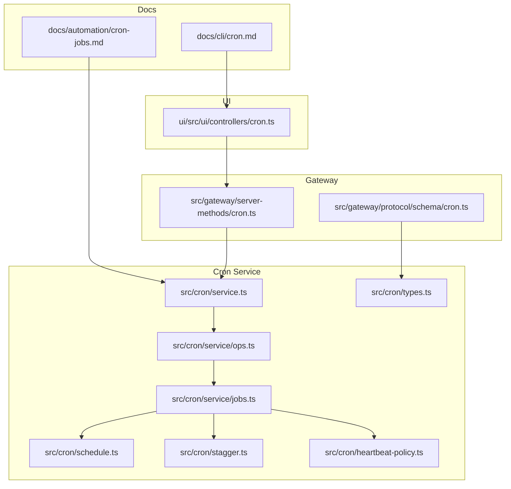
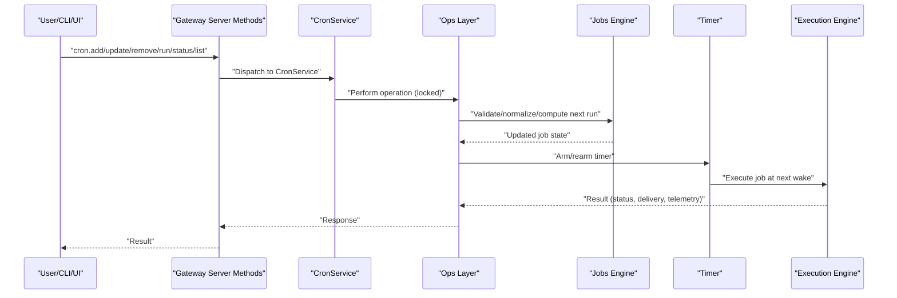
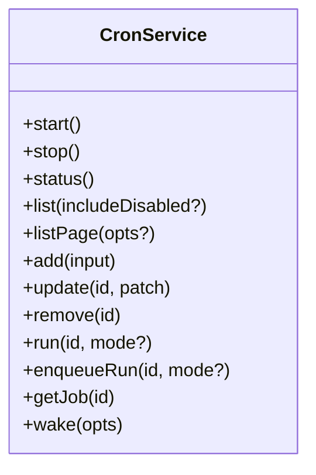
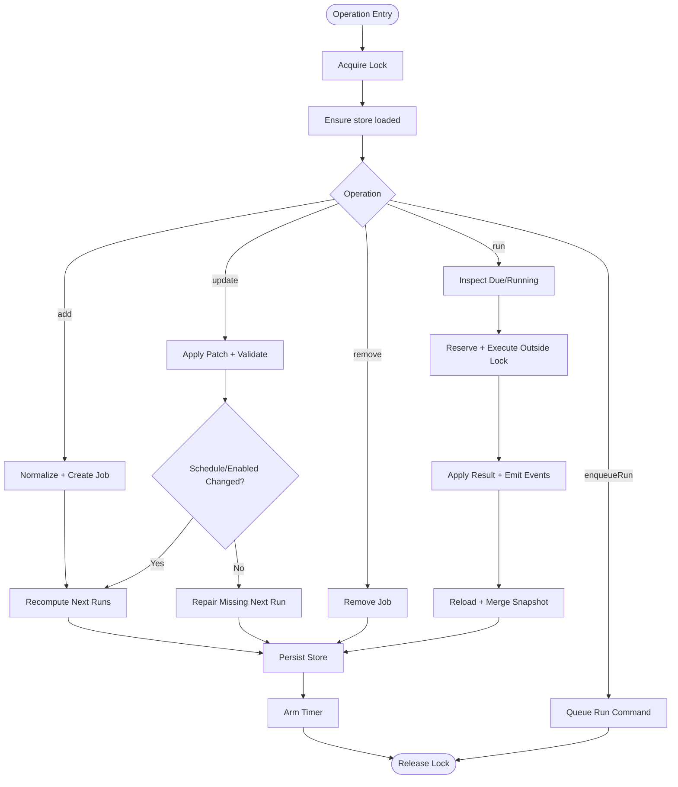
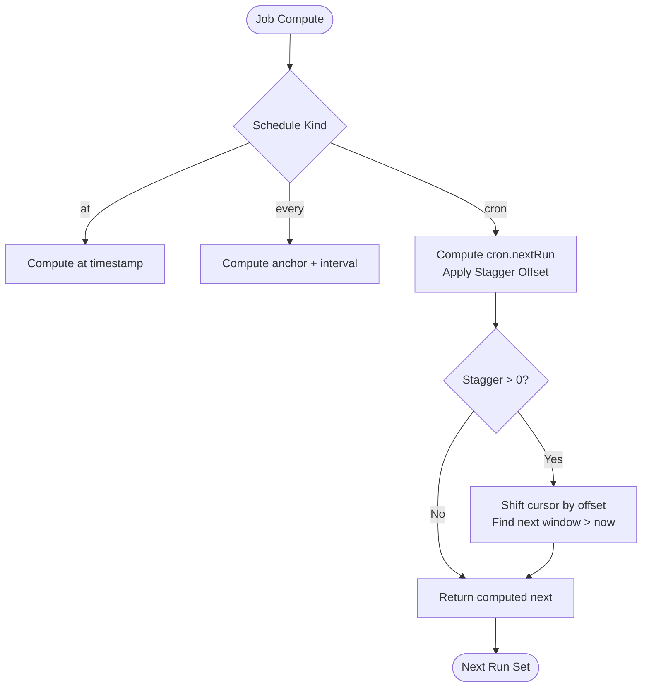
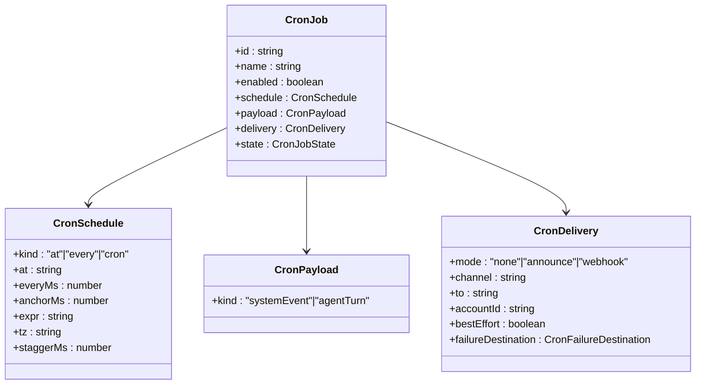
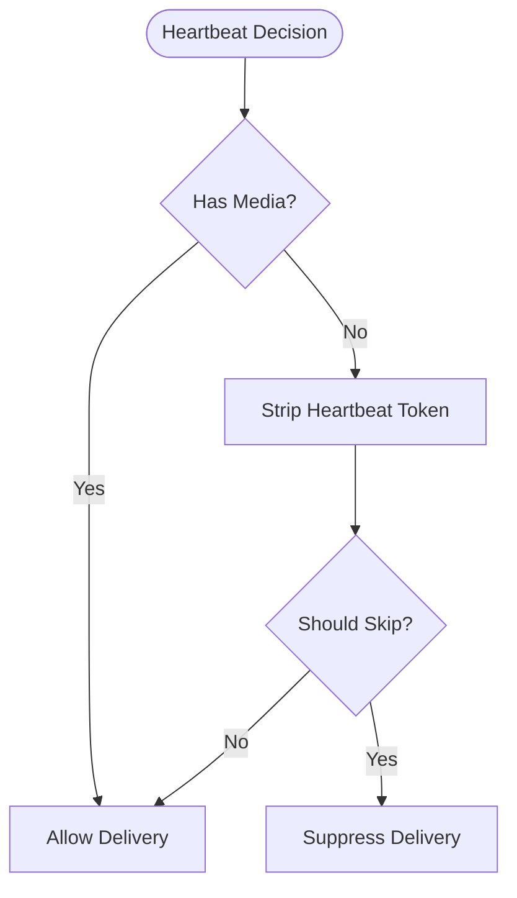
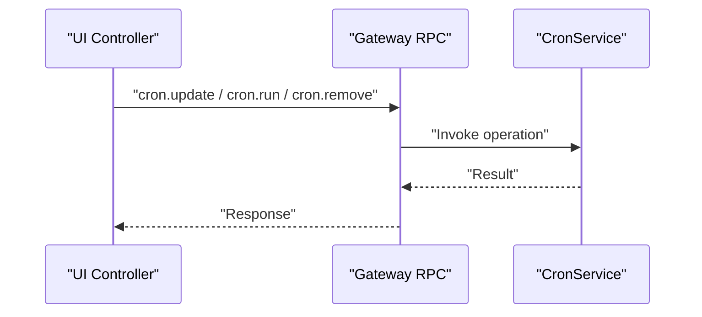
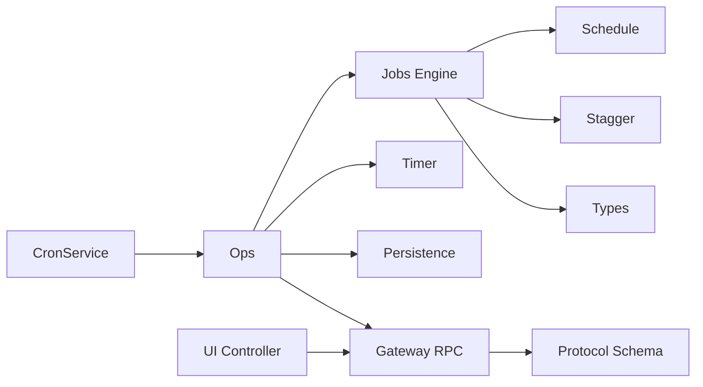

# Cron Automation

<cite>
**Referenced Files in This Document**
- [cron-jobs.md](file://docs/automation/cron-jobs.md)
- [cron.md](file://docs/cli/cron.md)
- [service.ts](file://src/cron/service.ts)
- [jobs.ts](file://src/cron/service/jobs.ts)
- [ops.ts](file://src/cron/service/ops.ts)
- [types.ts](file://src/cron/types.ts)
- [schedule.ts](file://src/cron/schedule.ts)
- [stagger.ts](file://src/cron/stagger.ts)
- [heartbeat-policy.ts](file://src/cron/heartbeat-policy.ts)
- [cron.ts](file://src/gateway/server-methods/cron.ts)
- [cron.ts](file://src/gateway/protocol/schema/cron.ts)
- [cron.ts](file://ui/src/ui/controllers/cron.ts)
</cite>

## Table of Contents
1. [Introduction](#introduction)
2. [Project Structure](#project-structure)
3. [Core Components](#core-components)
4. [Architecture Overview](#architecture-overview)
5. [Detailed Component Analysis](#detailed-component-analysis)
6. [Dependency Analysis](#dependency-analysis)
7. [Performance Considerations](#performance-considerations)
8. [Troubleshooting Guide](#troubleshooting-guide)
9. [Conclusion](#conclusion)
10. [Appendices](#appendices)

## Introduction
This document explains OpenClaw’s cron automation system: how to manage cron jobs, how scheduling and execution work, how wake functionality enqueues system events and triggers heartbeats, and how cron integrates with the Gateway’s cron service and job persistence. It covers job lifecycle operations (status, list, add, update, remove, run, runs), scheduling patterns (one-shot, interval, cron), execution contexts (main vs isolated), and delivery modes (announce, webhook, none). It also includes practical examples, best practices, and troubleshooting guidance.

## Project Structure
OpenClaw’s cron automation spans documentation, CLI, Gateway server methods, protocol schema, UI controller, and the core cron service implementation.

**Diagram sources**
- [cron-jobs.md](file://docs/automation/cron-jobs.md#L1-L686)
- [cron.md](file://docs/cli/cron.md#L1-L78)
- [service.ts](file://src/cron/service.ts#L1-L61)
- [ops.ts](file://src/cron/service/ops.ts#L1-L570)
- [jobs.ts](file://src/cron/service/jobs.ts#L1-L901)
- [types.ts](file://src/cron/types.ts#L1-L160)
- [schedule.ts](file://src/cron/schedule.ts#L1-L171)
- [stagger.ts](file://src/cron/stagger.ts#L1-L48)
- [heartbeat-policy.ts](file://src/cron/heartbeat-policy.ts#L1-L49)
- [cron.ts](file://src/gateway/server-methods/cron.ts)
- [cron.ts](file://src/gateway/protocol/schema/cron.ts)
- [cron.ts](file://ui/src/ui/controllers/cron.ts#L709-L771)

**Section sources**
- [cron-jobs.md](file://docs/automation/cron-jobs.md#L1-L686)
- [cron.md](file://docs/cli/cron.md#L1-L78)
- [service.ts](file://src/cron/service.ts#L1-L61)
- [ops.ts](file://src/cron/service/ops.ts#L1-L570)
- [jobs.ts](file://src/cron/service/jobs.ts#L1-L901)
- [types.ts](file://src/cron/types.ts#L1-L160)
- [schedule.ts](file://src/cron/schedule.ts#L1-L171)
- [stagger.ts](file://src/cron/stagger.ts#L1-L48)
- [heartbeat-policy.ts](file://src/cron/heartbeat-policy.ts#L1-L49)
- [cron.ts](file://src/gateway/server-methods/cron.ts)
- [cron.ts](file://src/gateway/protocol/schema/cron.ts)
- [cron.ts](file://ui/src/ui/controllers/cron.ts#L709-L771)

## Core Components
- CronService: Public API for cron operations (start, stop, status, list, add, update, remove, run, enqueueRun, wake).
- Ops layer: Implements operations with locking, persistence, timer arming, and manual run queuing.
- Jobs engine: Validates, normalizes, computes next runs, applies patches, and manages job state.
- Types: Defines schedules, payloads, delivery, failure alerts, and run outcomes.
- Schedule and Stagger: Compute next/previous runs and apply deterministic stagger for top-of-hour cron expressions.
- Heartbeat policy: Controls when main-session summaries are posted and when heartbeat-only deliveries are suppressed.
- Gateway integration: Exposes cron.* RPC methods and protocol schema for external callers.
- CLI and UI: Provide user-facing commands and controller actions for managing cron jobs.

**Section sources**
- [service.ts](file://src/cron/service.ts#L7-L60)
- [ops.ts](file://src/cron/service/ops.ts#L236-L342)
- [jobs.ts](file://src/cron/service/jobs.ts#L503-L560)
- [types.ts](file://src/cron/types.ts#L5-L160)
- [schedule.ts](file://src/cron/schedule.ts#L64-L139)
- [stagger.ts](file://src/cron/stagger.ts#L35-L47)
- [heartbeat-policy.ts](file://src/cron/heartbeat-policy.ts#L31-L48)
- [cron.ts](file://src/gateway/server-methods/cron.ts)
- [cron.ts](file://src/gateway/protocol/schema/cron.ts)
- [cron.md](file://docs/cli/cron.md#L1-L78)
- [cron.ts](file://ui/src/ui/controllers/cron.ts#L709-L771)

## Architecture Overview
Cron runs inside the Gateway. Jobs are persisted to disk and loaded at startup. The service computes next run times, arms a timer, and executes jobs either as main-session system events or isolated agent turns. Delivery can be announce (channel), webhook, or none. Manual runs are queued and executed under a concurrency lane.

**Diagram sources**
- [service.ts](file://src/cron/service.ts#L13-L60)
- [ops.ts](file://src/cron/service/ops.ts#L92-L131)
- [jobs.ts](file://src/cron/service/jobs.ts#L232-L286)
- [cron.ts](file://src/gateway/server-methods/cron.ts)

## Detailed Component Analysis

### CronService API
- Lifecycle: start, stop, status, list, listPage, add, update, remove, run, enqueueRun, getJob, wake.
- Responsibilities: orchestrate operations, maintain state, and delegate to ops.

**Diagram sources**
- [service.ts](file://src/cron/service.ts#L7-L60)

**Section sources**
- [service.ts](file://src/cron/service.ts#L7-L60)

### Operations (Ops)
- start: loads store, clears stale running markers, runs missed jobs, recomputes next runs, arms timer.
- list/listPage: read-only, with filtering, sorting, pagination.
- add/update/remove: normalized creation, validation, persistence, and timer rearming.
- run/enqueueRun: inspect readiness, reserve execution under lock, then run outside lock; emits events and persists results.

**Diagram sources**
- [ops.ts](file://src/cron/service/ops.ts#L92-L131)
- [ops.ts](file://src/cron/service/ops.ts#L236-L342)
- [ops.ts](file://src/cron/service/ops.ts#L518-L562)

**Section sources**
- [ops.ts](file://src/cron/service/ops.ts#L92-L131)
- [ops.ts](file://src/cron/service/ops.ts#L236-L342)
- [ops.ts](file://src/cron/service/ops.ts#L518-L562)

### Jobs Engine
- Validation and normalization: sessionTarget/payload compatibility, delivery/webhook/channel rules, telegram target validation, failure destination support.
- Scheduling: compute next/previous run for at/every/cron; handle schedule errors; auto-disable after repeated failures.
- Stagger: deterministic per-job offset for top-of-hour cron expressions; shift cursors for accurate staggered windows.
- State: tracks nextRunAtMs, runningAtMs, lastRunAtMs/status/error/duration, consecutiveErrors, lastDeliveryStatus, scheduleErrorCount.

**Diagram sources**
- [jobs.ts](file://src/cron/service/jobs.ts#L232-L286)
- [jobs.ts](file://src/cron/service/jobs.ts#L64-L90)
- [schedule.ts](file://src/cron/schedule.ts#L64-L139)
- [stagger.ts](file://src/cron/stagger.ts#L39-L47)

**Section sources**
- [jobs.ts](file://src/cron/service/jobs.ts#L134-L223)
- [jobs.ts](file://src/cron/service/jobs.ts#L232-L294)
- [jobs.ts](file://src/cron/service/jobs.ts#L299-L339)
- [schedule.ts](file://src/cron/schedule.ts#L64-L139)
- [stagger.ts](file://src/cron/stagger.ts#L35-L47)

### Types and Scheduling Patterns
- Schedules: at (absolute), every (interval with anchor), cron (5/6-field with optional timezone and stagger).
- Payloads: systemEvent (main) and agentTurn (isolated).
- Delivery: announce (channel), webhook (HTTP), none; failureDestination supported for webhook or isolated.
- Execution contexts: main session enqueues system events and optionally wakes; isolated runs in cron:<jobId> with optional delivery.

**Diagram sources**
- [types.ts](file://src/cron/types.ts#L5-L160)

**Section sources**
- [types.ts](file://src/cron/types.ts#L5-L160)
- [cron-jobs.md](file://docs/automation/cron-jobs.md#L113-L167)

### Heartbeat and Delivery Policy
- Heartbeat-only deliveries (e.g., HEARTBEAT_OK with no content) are suppressed unless media is present.
- Main-session summaries are posted conditionally based on delivery attempts and suppression flags.

**Diagram sources**
- [heartbeat-policy.ts](file://src/cron/heartbeat-policy.ts#L9-L29)

**Section sources**
- [heartbeat-policy.ts](file://src/cron/heartbeat-policy.ts#L31-L48)

### Gateway Integration and Protocol
- Server methods: cron.list, cron.status, cron.add, cron.update, cron.remove, cron.run, cron.runs.
- Protocol schema defines request/response shapes for tool-call and RPC usage.
- UI controller: toggles enable/disable, runs jobs, removes jobs, and refreshes lists/runs.

**Diagram sources**
- [cron.ts](file://ui/src/ui/controllers/cron.ts#L709-L771)
- [cron.ts](file://src/gateway/server-methods/cron.ts)
- [cron.ts](file://src/gateway/protocol/schema/cron.ts)

**Section sources**
- [cron.ts](file://src/gateway/server-methods/cron.ts)
- [cron.ts](file://src/gateway/protocol/schema/cron.ts)
- [cron.ts](file://ui/src/ui/controllers/cron.ts#L709-L771)

## Dependency Analysis
- CronService depends on Ops for synchronization and persistence.
- Ops depends on Jobs for validation, scheduling, and state transitions.
- Jobs depends on Schedule and Stagger for time computations and on Types for shapes.
- Heartbeat policy influences when main-session summaries are posted.
- Gateway server methods and protocol schema define the external contract.
- UI controller interacts with Gateway RPC to manage jobs.

**Diagram sources**
- [service.ts](file://src/cron/service.ts#L1-L61)
- [ops.ts](file://src/cron/service/ops.ts#L1-L570)
- [jobs.ts](file://src/cron/service/jobs.ts#L1-L901)
- [schedule.ts](file://src/cron/schedule.ts#L1-L171)
- [stagger.ts](file://src/cron/stagger.ts#L1-L48)
- [types.ts](file://src/cron/types.ts#L1-L160)
- [cron.ts](file://src/gateway/server-methods/cron.ts)
- [cron.ts](file://src/gateway/protocol/schema/cron.ts)
- [cron.ts](file://ui/src/ui/controllers/cron.ts#L709-L771)

**Section sources**
- [service.ts](file://src/cron/service.ts#L1-L61)
- [ops.ts](file://src/cron/service/ops.ts#L1-L570)
- [jobs.ts](file://src/cron/service/jobs.ts#L1-L901)
- [schedule.ts](file://src/cron/schedule.ts#L1-L171)
- [stagger.ts](file://src/cron/stagger.ts#L1-L48)
- [types.ts](file://src/cron/types.ts#L1-L160)
- [cron.ts](file://src/gateway/server-methods/cron.ts)
- [cron.ts](file://src/gateway/protocol/schema/cron.ts)
- [cron.ts](file://ui/src/ui/controllers/cron.ts#L709-L771)

## Performance Considerations
- Deterministic stagger for top-of-hour cron reduces load spikes across many Gateways.
- Maintenance: session retention pruning and run-log size/line limits reduce IO overhead.
- Concurrency: manual runs are queued to avoid blocking reads; ensure max concurrent runs aligns with workload.
- Large run logs and long retention windows increase IO; tune runLog.maxBytes and runLog.keepLines and sessionRetention accordingly.

[No sources needed since this section provides general guidance]

## Troubleshooting Guide
- Nothing runs: verify cron.enabled and OPENCLAW_SKIP_CRON; ensure the Gateway is running; confirm timezone alignment for cron schedules.
- Recurring job delays after failures: exponential backoff applies; backoff resets after next successful run.
- Telegram delivery issues: use explicit topic format (-100…:topic:<id>) to avoid ambiguity.
- Subagent announce retries: gateway retries announce delivery up to 3 times; monitor announceRetryCount and requester session availability.

**Section sources**
- [cron-jobs.md](file://docs/automation/cron-jobs.md#L659-L686)

## Conclusion
OpenClaw’s cron system provides robust, persistent scheduling inside the Gateway with flexible execution contexts and delivery modes. It supports one-shot, interval, and cron schedules, with deterministic stagger and maintenance policies to keep performance predictable. The Gateway exposes a clear RPC surface, and the UI/CLI offer convenient management workflows.

[No sources needed since this section summarizes without analyzing specific files]

## Appendices

### Cron Job Management Operations
- Status: retrieve enabled flag, store path, job count, and next wake time.
- List: fetch jobs ordered by next run time; listPage supports filtering, sorting, and pagination.
- Add: create a job with normalized schedule, payload, and delivery; recompute next runs and persist.
- Update: apply patches to schedule, payload, delivery, or state; recompute next run if needed.
- Remove: delete a job by id; persist and rearm timer.
- Run: execute a job immediately (force or due); returns queued or executed status.
- Runs: inspect run history per job.

**Section sources**
- [ops.ts](file://src/cron/service/ops.ts#L137-L156)
- [ops.ts](file://src/cron/service/ops.ts#L197-L234)
- [ops.ts](file://src/cron/service/ops.ts#L236-L269)
- [ops.ts](file://src/cron/service/ops.ts#L271-L323)
- [ops.ts](file://src/cron/service/ops.ts#L325-L342)
- [ops.ts](file://src/cron/service/ops.ts#L518-L562)

### Wake Functionality
- Enqueue system events and trigger heartbeats: wakeNow supports immediate or next heartbeat modes.
- Main jobs enqueue system events; isolated jobs run agent turns and optionally deliver results.

**Section sources**
- [ops.ts](file://src/cron/service/ops.ts#L564-L569)
- [heartbeat-policy.ts](file://src/cron/heartbeat-policy.ts#L31-L48)

### Scheduling Best Practices
- Use stagger for top-of-hour cron to avoid spikes.
- Prefer isolated jobs for noisy or frequent tasks; use announce or webhook delivery as needed.
- Keep run logs bounded; tune session retention for debugging needs.
- Use exact timing only when required; otherwise rely on default stagger.

**Section sources**
- [stagger.ts](file://src/cron/stagger.ts#L3-L37)
- [cron-jobs.md](file://docs/automation/cron-jobs.md#L445-L522)

### Examples of Common Scenarios
- One-shot reminder in main session with immediate wake and auto-delete after success.
- Recurring isolated job with announce delivery to a specific channel.
- Manual run queued and followed by run history inspection.

**Section sources**
- [cron-jobs.md](file://docs/automation/cron-jobs.md#L34-L64)
- [cron.md](file://docs/cli/cron.md#L26-L27)
- [ui/src/ui/controllers/cron.ts](file://ui/src/ui/controllers/cron.ts#L726-L744)