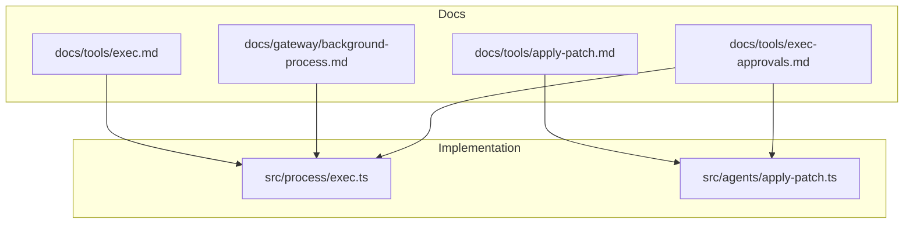
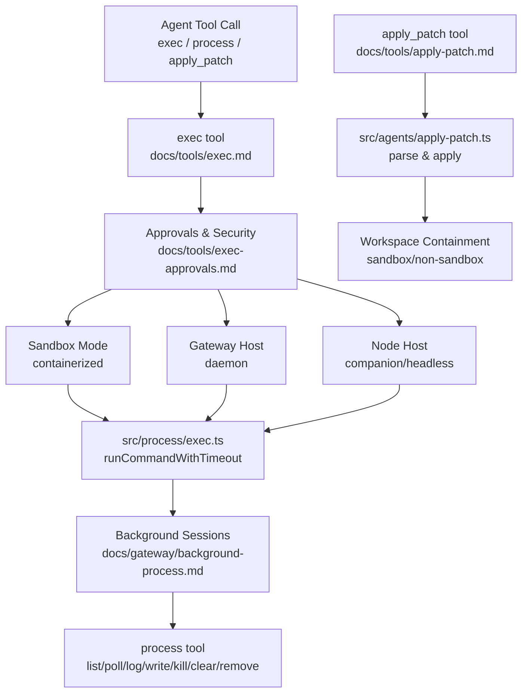
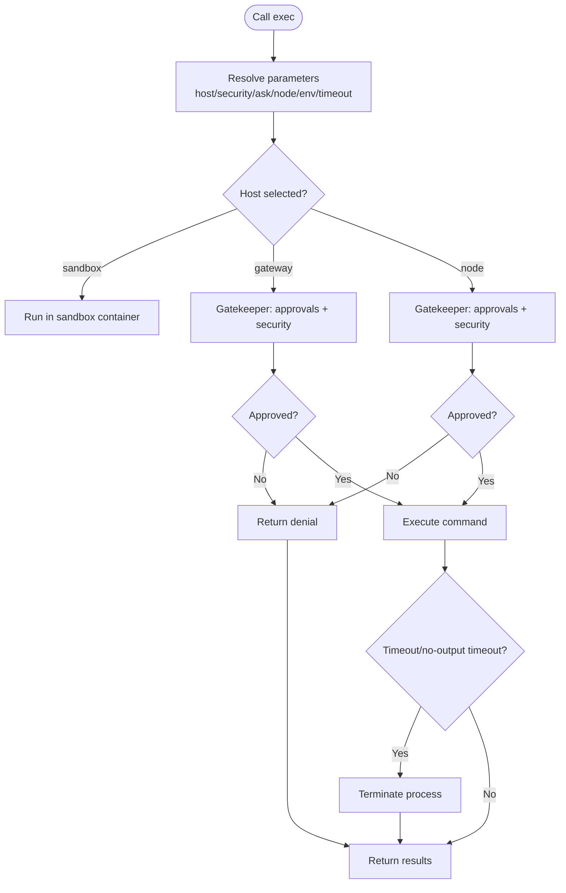
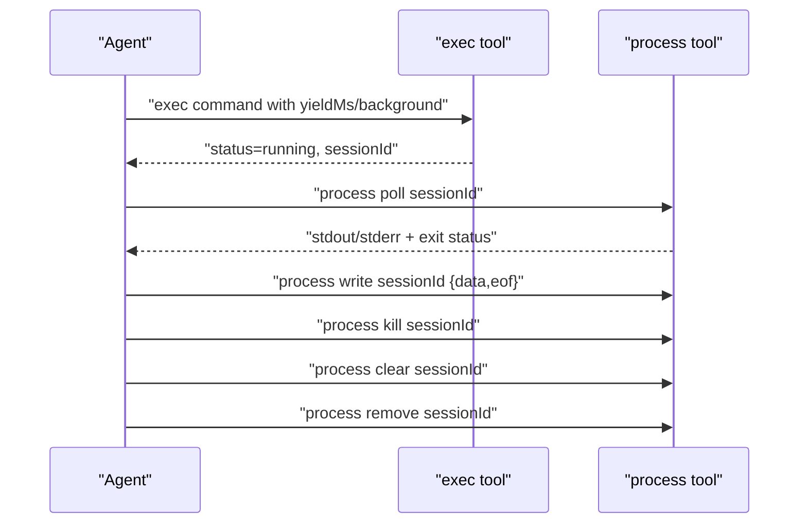
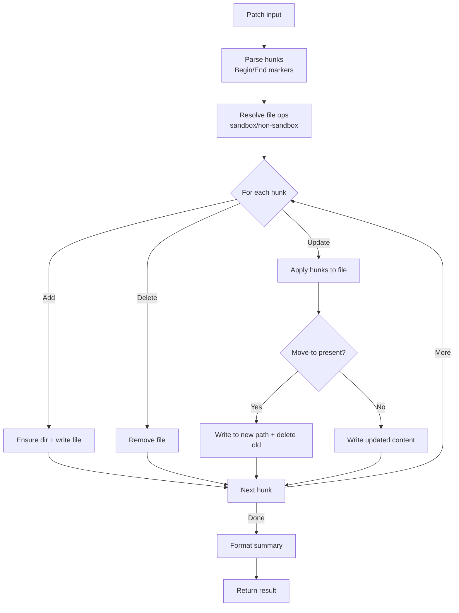
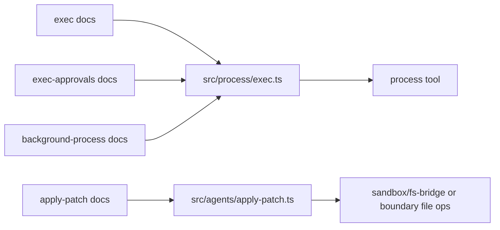

# Execution Tools

<cite>
**Referenced Files in This Document**
- [docs/tools/exec.md](file://docs/tools/exec.md)
- [docs/tools/apply-patch.md](file://docs/tools/apply-patch.md)
- [docs/tools/exec-approvals.md](file://docs/tools/exec-approvals.md)
- [docs/gateway/background-process.md](file://docs/gateway/background-process.md)
- [src/process/exec.ts](file://src/process/exec.ts)
- [src/agents/apply-patch.ts](file://src/agents/apply-patch.ts)
</cite>

## Table of Contents
1. [Introduction](#introduction)
2. [Project Structure](#project-structure)
3. [Core Components](#core-components)
4. [Architecture Overview](#architecture-overview)
5. [Detailed Component Analysis](#detailed-component-analysis)
6. [Dependency Analysis](#dependency-analysis)
7. [Performance Considerations](#performance-considerations)
8. [Troubleshooting Guide](#troubleshooting-guide)
9. [Conclusion](#conclusion)

## Introduction
This document explains OpenClaw’s execution tools with a focus on three capabilities:
- exec: running shell commands with parameters for foreground/background execution, timeouts, PTY/TUI support, host targeting, and approvals.
- process: managing background execution sessions (listing, polling, logging, writing input, killing, clearing, and removing).
- apply_patch: applying structured, multi-file, multi-hunk edits with workspace containment and model gating.

It covers security policies, approval systems, sandboxing considerations, and practical examples for secure execution patterns and troubleshooting.

## Project Structure
The execution tooling spans documentation and implementation across:
- Documentation for exec, approvals, and background process management
- Implementation of low-level command execution and process spawning
- Agent-side apply_patch tool with sandbox-aware file operations

**Diagram sources**
- [docs/tools/exec.md](file://docs/tools/exec.md#L1-L205)
- [docs/tools/apply-patch.md](file://docs/tools/apply-patch.md#L1-L52)
- [docs/tools/exec-approvals.md](file://docs/tools/exec-approvals.md#L1-L379)
- [docs/gateway/background-process.md](file://docs/gateway/background-process.md#L1-L98)
- [src/process/exec.ts](file://src/process/exec.ts#L1-L344)
- [src/agents/apply-patch.ts](file://src/agents/apply-patch.ts#L1-L583)

**Section sources**
- [docs/tools/exec.md](file://docs/tools/exec.md#L1-L205)
- [docs/gateway/background-process.md](file://docs/gateway/background-process.md#L1-L98)
- [src/process/exec.ts](file://src/process/exec.ts#L1-L344)
- [src/agents/apply-patch.ts](file://src/agents/apply-patch.ts#L1-L583)

## Core Components
- exec tool
  - Runs commands with configurable host, security, and approval behavior.
  - Supports foreground, background, PTY, timeouts, and environment control.
  - Integrates with approvals and sandboxing policies.
- process tool
  - Manages background sessions: listing, polling, logging, writing input, killing, clearing, and removal.
  - Scoped per agent and ephemeral in-memory.
- apply_patch tool
  - Applies structured multi-file, multi-hunk edits with workspace containment.
  - Supports sandboxed and non-sandboxed modes with explicit workspace-only option.

**Section sources**
- [docs/tools/exec.md](file://docs/tools/exec.md#L9-L120)
- [docs/gateway/background-process.md](file://docs/gateway/background-process.md#L52-L98)
- [docs/tools/apply-patch.md](file://docs/tools/apply-patch.md#L9-L52)
- [src/agents/apply-patch.ts](file://src/agents/apply-patch.ts#L85-L123)

## Architecture Overview
The exec tool orchestrates command execution across three execution contexts: sandbox, gateway host, and node host. Approvals and security policies gate host execution. Background runs are tracked in memory and managed via the process tool. The apply_patch tool parses structured patches and applies them with sandbox-aware file operations.

**Diagram sources**
- [docs/tools/exec.md](file://docs/tools/exec.md#L1-L205)
- [docs/tools/exec-approvals.md](file://docs/tools/exec-approvals.md#L1-L379)
- [docs/gateway/background-process.md](file://docs/gateway/background-process.md#L1-L98)
- [src/process/exec.ts](file://src/process/exec.ts#L220-L344)
- [docs/tools/apply-patch.md](file://docs/tools/apply-patch.md#L1-L52)
- [src/agents/apply-patch.ts](file://src/agents/apply-patch.ts#L125-L276)

## Detailed Component Analysis

### Exec Tool
The exec tool runs shell commands with robust controls for host selection, security, and approvals. It supports:
- Foreground vs background execution with yield windows and timeouts
- PTY/TUI support for interactive shells
- Environment and working directory control
- Host targeting (sandbox, gateway, node) with security modes and approval prompts
- Elevated mode and sandboxing behavior

Key behaviors and parameters are documented in the exec tool guide, including configuration defaults, PATH handling, and per-session overrides.

**Diagram sources**
- [docs/tools/exec.md](file://docs/tools/exec.md#L15-L63)
- [docs/tools/exec-approvals.md](file://docs/tools/exec-approvals.md#L10-L46)
- [src/process/exec.ts](file://src/process/exec.ts#L220-L344)

**Section sources**
- [docs/tools/exec.md](file://docs/tools/exec.md#L15-L120)
- [docs/tools/exec-approvals.md](file://docs/tools/exec-approvals.md#L10-L120)
- [src/process/exec.ts](file://src/process/exec.ts#L94-L182)

### Process Tool (Background Sessions)
The process tool manages background sessions created by exec:
- list: enumerate running and finished sessions scoped per agent
- poll: drain new output and report exit status
- log: read aggregated output with offset/limit
- write: send stdin data and optional EOF
- kill: terminate a running session
- clear: remove a finished session from memory
- remove: kill if running, otherwise clear if finished

Sessions are ephemeral and not persisted across process restarts.

**Diagram sources**
- [docs/gateway/background-process.md](file://docs/gateway/background-process.md#L52-L98)
- [docs/tools/exec.md](file://docs/tools/exec.md#L11-L30)

**Section sources**
- [docs/gateway/background-process.md](file://docs/gateway/background-process.md#L52-L98)

### Apply Patch Tool
The apply_patch tool applies structured multi-file, multi-hunk edits:
- Parses a patch with Begin/End markers and per-file hunks (Add/Delete/Update)
- Supports renaming via Move-to within Update hunks
- Enforces workspace containment by default and supports sandboxed file bridge
- Operates in sandboxed or non-sandboxed modes with explicit workspace-only option

**Diagram sources**
- [docs/tools/apply-patch.md](file://docs/tools/apply-patch.md#L14-L42)
- [src/agents/apply-patch.ts](file://src/agents/apply-patch.ts#L125-L276)

**Section sources**
- [docs/tools/apply-patch.md](file://docs/tools/apply-patch.md#L14-L52)
- [src/agents/apply-patch.ts](file://src/agents/apply-patch.ts#L125-L276)

## Dependency Analysis
- exec depends on:
  - Approval and security policies (exec-approvals)
  - Host execution backends (sandbox, gateway, node)
  - Low-level process spawning utilities
- process depends on:
  - exec’s background session tracking
  - Agent scoping and ephemeral memory storage
- apply_patch depends on:
  - Sandbox-aware file bridge or boundary-checked writes
  - Path resolution and containment utilities

**Diagram sources**
- [docs/tools/exec.md](file://docs/tools/exec.md#L1-L205)
- [docs/tools/exec-approvals.md](file://docs/tools/exec-approvals.md#L1-L379)
- [docs/gateway/background-process.md](file://docs/gateway/background-process.md#L1-L98)
- [src/process/exec.ts](file://src/process/exec.ts#L1-L344)
- [docs/tools/apply-patch.md](file://docs/tools/apply-patch.md#L1-L52)
- [src/agents/apply-patch.ts](file://src/agents/apply-patch.ts#L1-L583)

**Section sources**
- [src/process/exec.ts](file://src/process/exec.ts#L1-L344)
- [src/agents/apply-patch.ts](file://src/agents/apply-patch.ts#L1-L583)

## Performance Considerations
- Background sessions are held in memory; tune cleanup and notification thresholds to balance observability and memory usage.
- Use PTY only when needed to avoid overhead for non-interactive commands.
- Prefer allowlist or safe-bins configurations to minimize approval prompts and improve throughput.
- For long-running tasks, poll periodically and clear finished sessions to limit memory retention.

[No sources needed since this section provides general guidance]

## Troubleshooting Guide
Common issues and resolutions:
- Approval prompts required
  - Configure approvals and allowlists on the gateway or node host; use ask fallback behavior when UI is unavailable.
  - Forward approval prompts to chat channels for operator-driven decisions.
- Sandbox failures
  - If sandboxing is off and host=sandbox is requested, exec fails closed. Enable sandboxing or adjust host/security/ask accordingly.
- PATH and environment
  - Host-specific PATH merging and env overrides are enforced; avoid injecting loader variables that could lead to hijinks.
- No output timeouts
  - Increase no-output timeout or ensure the process produces output; otherwise it will be terminated.
- Interactive sessions
  - Use PTY for TTY-dependent tools; ensure stdin is properly written via the process tool when needed.

**Section sources**
- [docs/tools/exec.md](file://docs/tools/exec.md#L30-L63)
- [docs/tools/exec-approvals.md](file://docs/tools/exec-approvals.md#L10-L46)
- [docs/gateway/background-process.md](file://docs/gateway/background-process.md#L37-L51)
- [src/process/exec.ts](file://src/process/exec.ts#L258-L293)

## Conclusion
OpenClaw’s exec, process, and apply_patch tools provide a secure, policy-driven framework for running commands and applying structured edits. By combining sandboxing, approvals, and careful host selection, operators can maintain strong isolation while enabling flexible automation. Use the process tool to manage long-running tasks and the apply_patch tool for reliable, workspace-contained multi-file edits.

[No sources needed since this section summarizes without analyzing specific files]