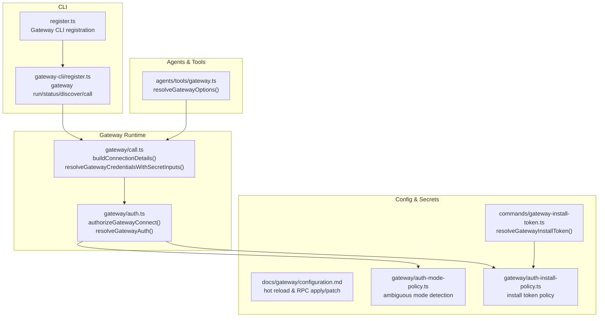
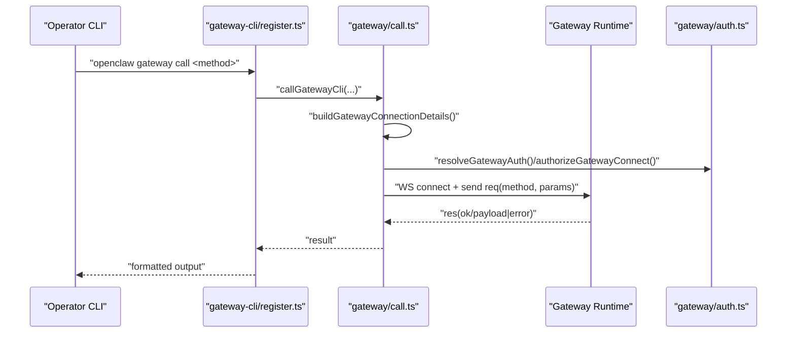
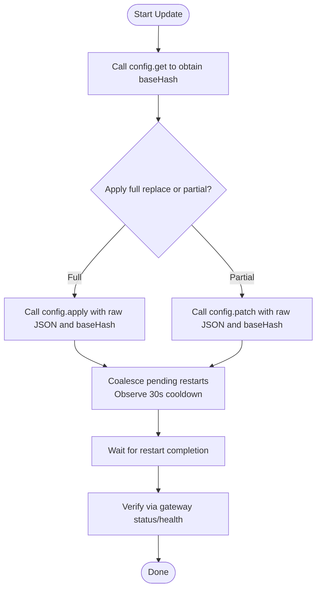
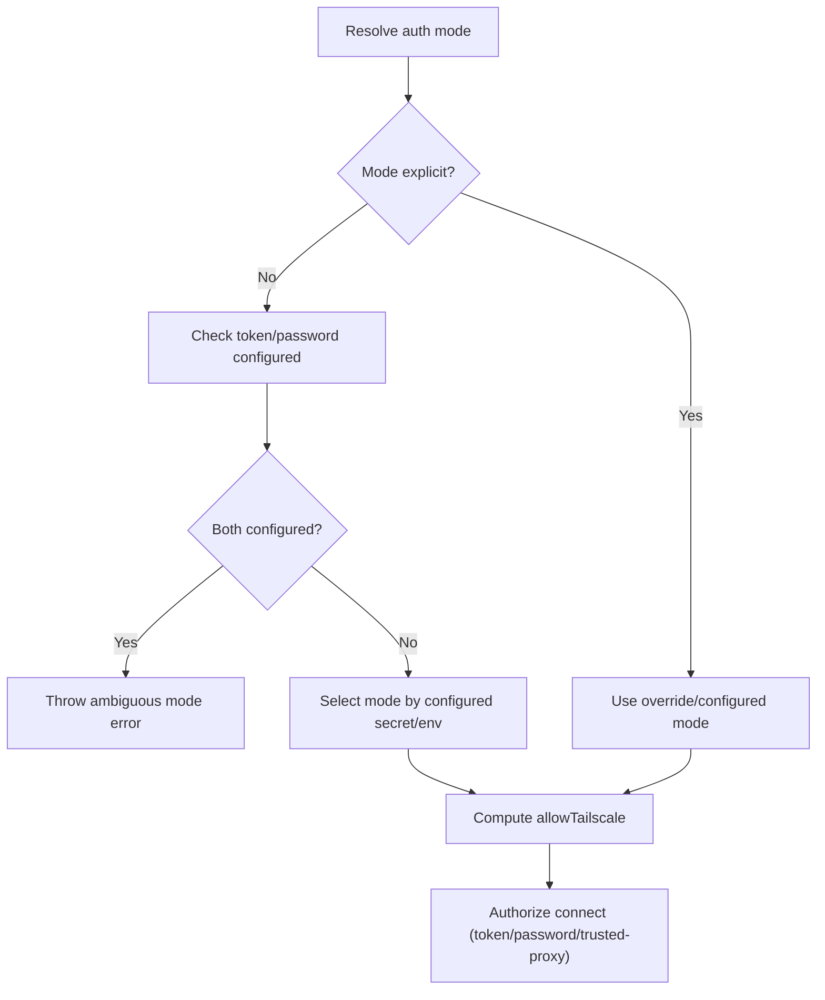
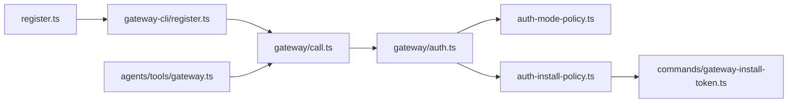

# Gateway Management

<cite>
**Referenced Files in This Document**
- [docs/cli/gateway.md](file://docs/cli/gateway.md)
- [docs/gateway/index.md](file://docs/gateway/index.md)
- [docs/gateway/configuration.md](file://docs/gateway/configuration.md)
- [docs/gateway/troubleshooting.md](file://docs/gateway/troubleshooting.md)
- [src/cli/gateway-cli/register.ts](file://src/cli/gateway-cli/register.ts)
- [src/gateway/call.ts](file://src/gateway/call.ts)
- [src/gateway/auth.ts](file://src/gateway/auth.ts)
- [src/gateway/auth-install-policy.ts](file://src/gateway/auth-install-policy.ts)
- [src/gateway/auth-mode-policy.ts](file://src/gateway/auth-mode-policy.ts)
- [src/agents/tools/gateway.ts](file://src/agents/tools/gateway.ts)
- [src/commands/gateway-install-token.ts](file://src/commands/gateway-install-token.ts)
- [src/commands/gateway-presence.ts](file://src/commands/gateway-presence.ts)
</cite>

## Table of Contents
1. [Introduction](#introduction)
2. [Project Structure](#project-structure)
3. [Core Components](#core-components)
4. [Architecture Overview](#architecture-overview)
5. [Detailed Component Analysis](#detailed-component-analysis)
6. [Dependency Analysis](#dependency-analysis)
7. [Performance Considerations](#performance-considerations)
8. [Troubleshooting Guide](#troubleshooting-guide)
9. [Conclusion](#conclusion)

## Introduction
This document provides comprehensive gateway management guidance for OpenClaw’s gateway tool capabilities. It covers:
- Gateway restart behavior and lifecycle operations
- Configuration inspection and modification via CLI and RPC
- In-place update procedures using control-plane RPCs
- Authorization requirements and security considerations
- Practical maintenance workflows and troubleshooting

The content synthesizes official documentation and the underlying implementation to help operators safely manage the Gateway in development and production environments.

## Project Structure
The gateway management surface spans:
- CLI commands for running, querying, discovering, and managing the Gateway
- RPC helpers for programmatic control-plane operations
- Authentication and authorization policies
- Configuration hot-reload and RPC-based apply/patch/update flows

**Diagram sources**
- [src/cli/gateway-cli/register.ts](file://src/cli/gateway-cli/register.ts#L89-L281)
- [src/gateway/call.ts](file://src/gateway/call.ts#L137-L226)
- [src/gateway/auth.ts](file://src/gateway/auth.ts#L217-L292)
- [src/gateway/auth-mode-policy.ts](file://src/gateway/auth-mode-policy.ts#L1-L27)
- [src/gateway/auth-install-policy.ts](file://src/gateway/auth-install-policy.ts#L1-L38)
- [src/commands/gateway-install-token.ts](file://src/commands/gateway-install-token.ts#L34-L148)
- [src/agents/tools/gateway.ts](file://src/agents/tools/gateway.ts#L116-L161)
- [docs/gateway/configuration.md](file://docs/gateway/configuration.md#L389-L447)

**Section sources**
- [docs/cli/gateway.md](file://docs/cli/gateway.md#L10-L215)
- [docs/gateway/index.md](file://docs/gateway/index.md#L1-L262)

## Core Components
- Gateway CLI: Provides run, query, discovery, and service management commands. Supports JSON output and SSH tunnel probing.
- RPC Helpers: Resolve connection details, enforce security constraints, and resolve credentials including SecretRefs.
- Authentication Policies: Enforce mode selection, ambiguous mode detection, and install-time token requirements.
- Configuration Management: Hot reload behavior, RPC-based apply/patch, and environment/SecretRef integration.

**Section sources**
- [docs/cli/gateway.md](file://docs/cli/gateway.md#L22-L215)
- [docs/gateway/configuration.md](file://docs/gateway/configuration.md#L349-L447)
- [src/gateway/call.ts](file://src/gateway/call.ts#L137-L226)
- [src/gateway/auth.ts](file://src/gateway/auth.ts#L217-L292)

## Architecture Overview
The Gateway is a WebSocket server exposing RPC methods for control and data. Operators interact via CLI or programmatic RPC. The system enforces:
- Secure transport (wss:// for remote)
- Explicit credentials for URL overrides
- Auth modes (token/password/trusted-proxy/none)
- Controlled restarts for critical config changes

**Diagram sources**
- [src/cli/gateway-cli/register.ts](file://src/cli/gateway-cli/register.ts#L114-L137)
- [src/gateway/call.ts](file://src/gateway/call.ts#L137-L226)
- [src/gateway/auth.ts](file://src/gateway/auth.ts#L378-L485)

## Detailed Component Analysis

### Gateway Restart Functionality
- Lifecycle commands: install, start, stop, restart, uninstall.
- Restart behavior depends on configuration reload mode:
  - hybrid: hot-apply safe changes; restart for critical changes
  - hot: hot-apply safe changes; warn on restart-required
  - restart: restart on any change
  - off: disable file watching; restart required manually
- Restart coalescing and cooldown apply to control-plane restart requests.

Operational notes:
- SIGUSR1 triggers an in-process restart when authorized (commands.restart enabled by default).
- Restart requests are rate-limited and coalesced; a 30-second cooldown separates restart cycles.

**Section sources**
- [docs/gateway/index.md](file://docs/gateway/index.md#L94-L106)
- [docs/gateway/index.md](file://docs/gateway/index.md#L125-L169)
- [docs/gateway/configuration.md](file://docs/gateway/configuration.md#L349-L387)

### Configuration Inspection and Modification
- Inspect:
  - CLI: openclaw config get <key>
  - Control UI: Config tab (form + Raw JSON editor)
  - RPC: config.get (returns hash for apply/patch)
- Modify:
  - CLI: openclaw config set/unset
  - Programmatic RPC: config.apply (full replace), config.patch (partial)
- Hot reload:
  - Hybrid mode applies safe changes instantly; critical changes trigger restart.
  - gateway.reload and gateway.remote changes do not trigger restart.

Security and safety:
- Strict validation: unknown keys or invalid values cause refusal to start.
- Doctor and logs assist in diagnosing validation failures.

**Section sources**
- [docs/gateway/configuration.md](file://docs/gateway/configuration.md#L36-L59)
- [docs/gateway/configuration.md](file://docs/gateway/configuration.md#L389-L447)
- [docs/gateway/configuration.md](file://docs/gateway/configuration.md#L349-L387)

### In-Place Update Procedures (Control-Plane RPC)
- config.apply:
  - Validates and writes the entire config in one step
  - Requires baseHash from config.get
  - Supports sessionKey and note for post-restart wake-up
  - RestartDelayMs defaults to 2000ms
- config.patch:
  - Partial update using JSON merge patch semantics
  - Requires baseHash
  - Same restart behavior as apply
- Rate limiting: 3 requests per 60 seconds per deviceId+clientIp; returns UNAVAILABLE with retryAfterMs when exceeded.

**Diagram sources**
- [docs/gateway/configuration.md](file://docs/gateway/configuration.md#L396-L447)

**Section sources**
- [docs/gateway/configuration.md](file://docs/gateway/configuration.md#L389-L447)

### Authorization Requirements and Security Considerations
- Auth modes:
  - Token or password-based (default token)
  - Trusted-proxy mode with user header and allowlist
  - None mode (not recommended)
- Install-time token requirement:
  - Determined by auth mode and whether Tailscale allows header auth
  - Password mode may be inferred only from durable service env sources
- Ambiguous mode:
  - If both token and password are configured without explicit mode, installation is blocked until mode is set
- URL override security:
  - Explicit credentials required when overriding URL (CLI or env)
  - Prevents accidental reuse of implicit credentials against attacker-controlled endpoints
- Transport security:
  - Plaintext ws:// to non-loopback is blocked; use wss:// or SSH/Tailscale
- Device and control UI auth:
  - Device identity challenges and nonce/signature flows enforced for secure contexts

**Diagram sources**
- [src/gateway/auth.ts](file://src/gateway/auth.ts#L217-L292)
- [src/gateway/auth-mode-policy.ts](file://src/gateway/auth-mode-policy.ts#L1-L27)
- [src/gateway/auth-install-policy.ts](file://src/gateway/auth-install-policy.ts#L1-L38)

**Section sources**
- [src/gateway/auth.ts](file://src/gateway/auth.ts#L217-L292)
- [src/gateway/auth-mode-policy.ts](file://src/gateway/auth-mode-policy.ts#L1-L27)
- [src/gateway/auth-install-policy.ts](file://src/gateway/auth-install-policy.ts#L1-L38)
- [src/gateway/call.ts](file://src/gateway/call.ts#L186-L207)

### Gateway Tool Actions and Workflows
- Restart:
  - CLI: openclaw gateway restart
  - In-process restart via SIGUSR1 when authorized
- Inspect configuration:
  - CLI: openclaw config get
  - RPC: config.get
- Retrieve configuration values:
  - CLI: openclaw config get <key>
  - RPC: config.get with optional params
- Apply configuration changes:
  - CLI: openclaw config set/unset
  - RPC: config.patch (recommended for partial updates)
- Run updates:
  - RPC: config.apply (full replace) or config.patch (partial)
  - Followed by restart if critical changes are detected

Operational tips:
- Use --json for scripting and automation
- Prefer config.patch for incremental changes
- Capture baseHash from config.get before apply/patch

**Section sources**
- [docs/cli/gateway.md](file://docs/cli/gateway.md#L64-L177)
- [docs/gateway/configuration.md](file://docs/gateway/configuration.md#L389-L447)

### Maintenance Workflows
- Day-1 startup:
  - Start gateway, verify status and channel readiness, monitor logs
- Routine maintenance:
  - Use gateway status and probe to validate reachability
  - Perform config changes via CLI or RPC; rely on hybrid reload behavior
- Remote access:
  - Prefer Tailscale/VPN; fallback to SSH tunnel
  - Respect auth requirements even over tunnels

**Section sources**
- [docs/gateway/index.md](file://docs/gateway/index.md#L27-L61)
- [docs/gateway/index.md](file://docs/gateway/index.md#L108-L123)

## Dependency Analysis
Key dependencies and interactions:
- CLI registration delegates to runtime and command options
- RPC helpers depend on config resolution and credential resolution
- Auth policies feed into runtime authorization decisions
- Install token resolution integrates with secrets and environment

**Diagram sources**
- [src/cli/gateway-cli/register.ts](file://src/cli/gateway-cli/register.ts#L89-L281)
- [src/gateway/call.ts](file://src/gateway/call.ts#L137-L226)
- [src/gateway/auth.ts](file://src/gateway/auth.ts#L217-L292)
- [src/gateway/auth-mode-policy.ts](file://src/gateway/auth-mode-policy.ts#L1-L27)
- [src/gateway/auth-install-policy.ts](file://src/gateway/auth-install-policy.ts#L1-L38)
- [src/commands/gateway-install-token.ts](file://src/commands/gateway-install-token.ts#L34-L148)
- [src/agents/tools/gateway.ts](file://src/agents/tools/gateway.ts#L116-L161)

**Section sources**
- [src/cli/gateway-cli/register.ts](file://src/cli/gateway-cli/register.ts#L89-L281)
- [src/gateway/call.ts](file://src/gateway/call.ts#L137-L226)
- [src/gateway/auth.ts](file://src/gateway/auth.ts#L217-L292)
- [src/gateway/auth-mode-policy.ts](file://src/gateway/auth-mode-policy.ts#L1-L27)
- [src/gateway/auth-install-policy.ts](file://src/gateway/auth-install-policy.ts#L1-L38)
- [src/commands/gateway-install-token.ts](file://src/commands/gateway-install-token.ts#L34-L148)
- [src/agents/tools/gateway.ts](file://src/agents/tools/gateway.ts#L116-L161)

## Performance Considerations
- Hybrid reload mode balances availability and correctness by applying safe changes instantly and restarting only when necessary.
- RPC rate limiting prevents abuse and ensures stability during frequent control-plane updates.
- Use JSON output for machine-readable automation to minimize parsing overhead.

[No sources needed since this section provides general guidance]

## Troubleshooting Guide
Common issues and remediation:
- Gateway not running:
  - Check service status and runtime state; review logs and doctor output
  - Look for bind+auth mismatch or port conflicts
- Unauthorized or connectivity issues:
  - Validate auth mode and credentials; ensure device identity flows for control UI
  - Confirm correct URL and transport (wss:// for remote)
- Post-upgrade regressions:
  - Review auth mode and URL override behavior changes
  - Reinstall service metadata if config and runtime drift

Diagnostic ladder:
- Start with status, logs, doctor, and channel probe
- Drill into specific subsystems (channels, cron, nodes, browser) as needed

**Section sources**
- [docs/gateway/troubleshooting.md](file://docs/gateway/troubleshooting.md#L14-L367)
- [docs/gateway/index.md](file://docs/gateway/index.md#L216-L244)

## Conclusion
OpenClaw’s gateway management combines a robust CLI surface, secure RPC pathways, and strict configuration validation. Operators can confidently restart, inspect, and update the Gateway while adhering to strong security defaults. Use hybrid reload for smooth operations, apply/patch RPCs for precise updates, and follow the troubleshooting steps for rapid diagnosis.