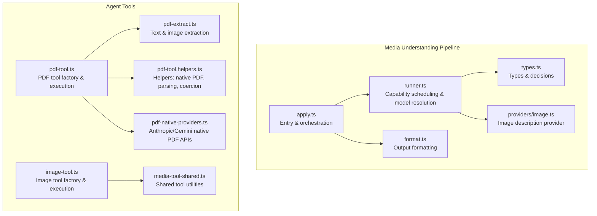
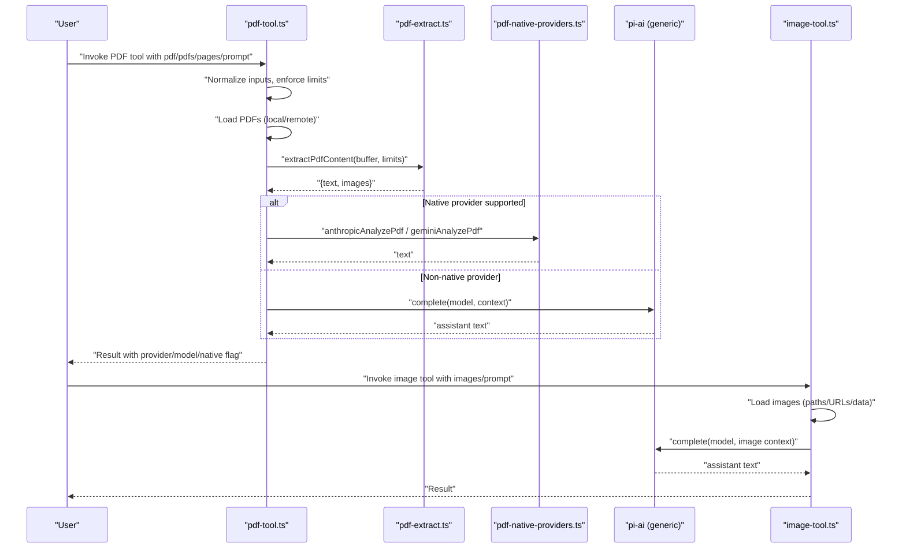
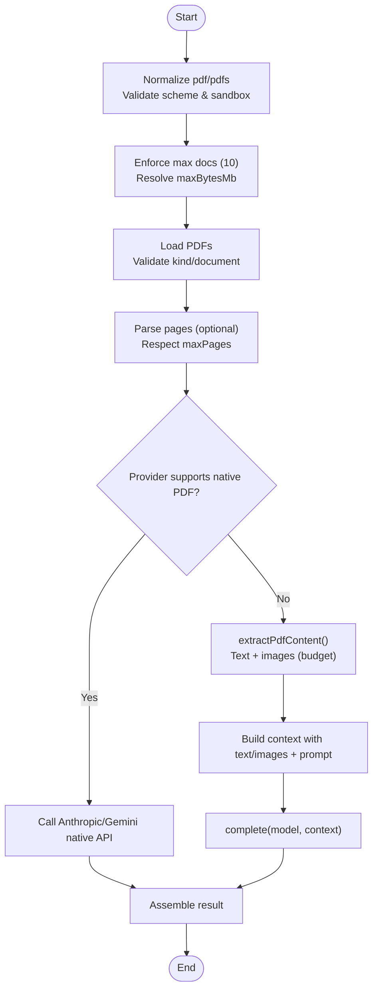
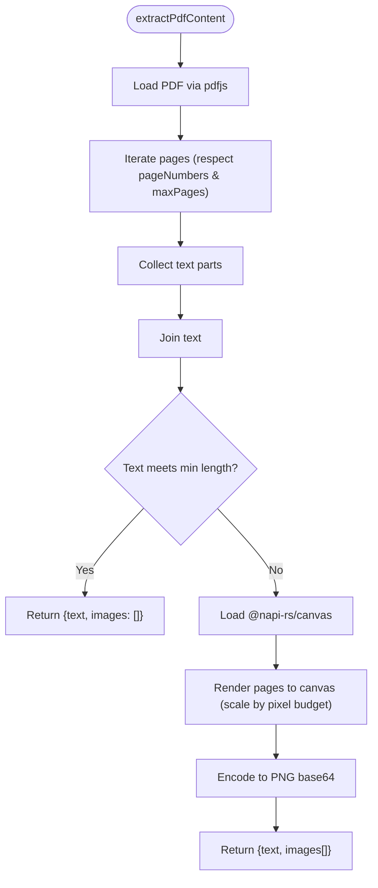
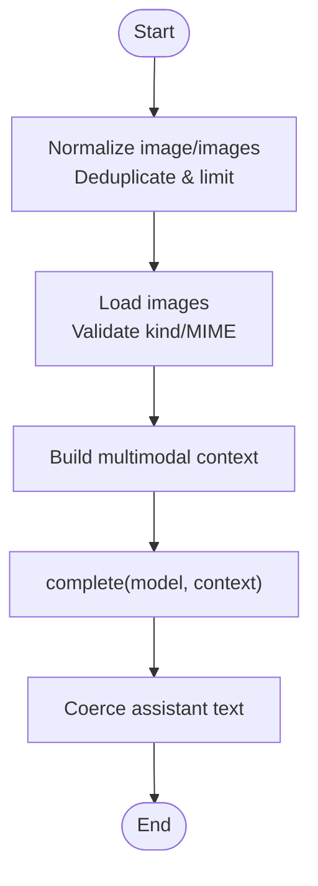
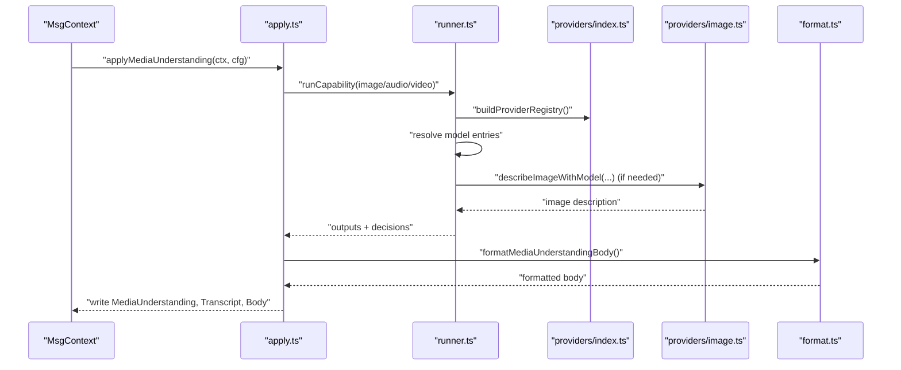
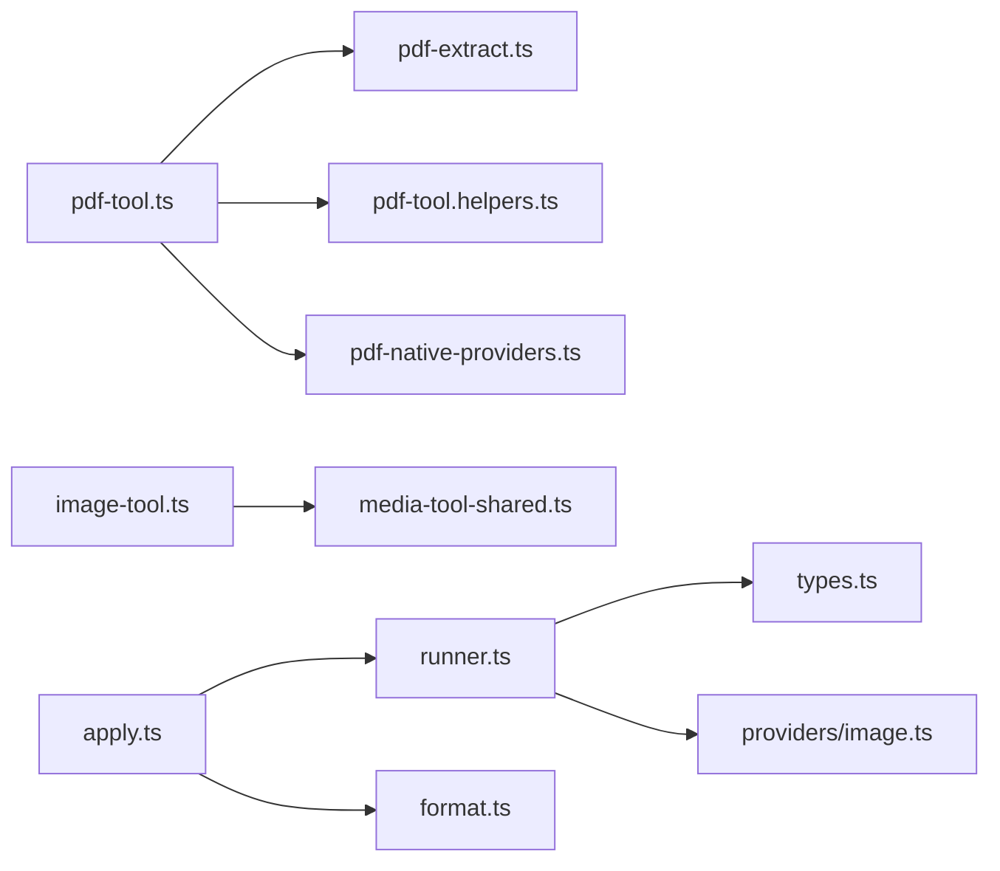

# Media Processing

<cite>
**Referenced Files in This Document**
- [src/agents/tools/pdf-tool.ts](file://src/agents/tools/pdf-tool.ts)
- [src/media/pdf-extract.ts](file://src/media/pdf-extract.ts)
- [src/agents/tools/pdf-tool.helpers.ts](file://src/agents/tools/pdf-tool.helpers.ts)
- [src/agents/tools/pdf-native-providers.ts](file://src/agents/tools/pdf-native-providers.ts)
- [src/agents/tools/image-tool.ts](file://src/agents/tools/image-tool.ts)
- [src/media-understanding/apply.ts](file://src/media-understanding/apply.ts)
- [src/media-understanding/runner.ts](file://src/media-understanding/runner.ts)
- [src/media-understanding/format.ts](file://src/media-understanding/format.ts)
- [src/media-understanding/types.ts](file://src/media-understanding/types.ts)
- [src/media-understanding/providers/image.ts](file://src/media-understanding/providers/image.ts)
- [src/agents/tools/media-tool-shared.ts](file://src/agents/tools/media-tool-shared.ts)
</cite>

## Table of Contents
1. [Introduction](#introduction)
2. [Project Structure](#project-structure)
3. [Core Components](#core-components)
4. [Architecture Overview](#architecture-overview)
5. [Detailed Component Analysis](#detailed-component-analysis)
6. [Dependency Analysis](#dependency-analysis)
7. [Performance Considerations](#performance-considerations)
8. [Troubleshooting Guide](#troubleshooting-guide)
9. [Conclusion](#conclusion)

## Introduction
This document explains OpenClaw’s media processing capabilities with a focus on:
- Image analysis via the image tool, including configurable prompts, models, and size limits
- PDF processing via the PDF tool, including native provider support, extraction fallback, and configuration controls
- Media model integration and image understanding workflows
- Practical scenarios and troubleshooting guidance

The goal is to help both developers and operators understand how media is ingested, understood, and integrated into agent workflows, and how to configure and troubleshoot the system effectively.

## Project Structure
OpenClaw organizes media processing across two primary pathways:
- Media Understanding pipeline: automatic, concurrent analysis of images, audio, and video attached to messages
- Agent tools: explicit, user-driven tools for image and PDF analysis

**Diagram sources**
- [src/media-understanding/apply.ts](file://src/media-understanding/apply.ts#L466-L581)
- [src/media-understanding/runner.ts](file://src/media-understanding/runner.ts#L659-L800)
- [src/media-understanding/format.ts](file://src/media-understanding/format.ts#L47-L98)
- [src/media-understanding/types.ts](file://src/media-understanding/types.ts#L1-L116)
- [src/media-understanding/providers/image.ts](file://src/media-understanding/providers/image.ts#L19-L79)
- [src/agents/tools/pdf-tool.ts](file://src/agents/tools/pdf-tool.ts#L295-L559)
- [src/agents/tools/pdf-tool.helpers.ts](file://src/agents/tools/pdf-tool.helpers.ts#L1-L110)
- [src/agents/tools/pdf-native-providers.ts](file://src/agents/tools/pdf-native-providers.ts#L1-L180)
- [src/media/pdf-extract.ts](file://src/media/pdf-extract.ts#L42-L105)
- [src/agents/tools/image-tool.ts](file://src/agents/tools/image-tool.ts#L270-L331)
- [src/agents/tools/media-tool-shared.ts](file://src/agents/tools/media-tool-shared.ts#L1-L52)

**Section sources**
- [src/media-understanding/apply.ts](file://src/media-understanding/apply.ts#L1-L581)
- [src/media-understanding/runner.ts](file://src/media-understanding/runner.ts#L1-L806)
- [src/media-understanding/format.ts](file://src/media-understanding/format.ts#L1-L99)
- [src/media-understanding/types.ts](file://src/media-understanding/types.ts#L1-L116)
- [src/media-understanding/providers/image.ts](file://src/media-understanding/providers/image.ts#L1-L79)
- [src/agents/tools/pdf-tool.ts](file://src/agents/tools/pdf-tool.ts#L1-L559)
- [src/agents/tools/pdf-tool.helpers.ts](file://src/agents/tools/pdf-tool.helpers.ts#L1-L110)
- [src/agents/tools/pdf-native-providers.ts](file://src/agents/tools/pdf-native-providers.ts#L1-L180)
- [src/media/pdf-extract.ts](file://src/media/pdf-extract.ts#L1-L105)
- [src/agents/tools/image-tool.ts](file://src/agents/tools/image-tool.ts#L1-L512)
- [src/agents/tools/media-tool-shared.ts](file://src/agents/tools/media-tool-shared.ts#L1-L52)

## Core Components
- PDF tool
  - Validates inputs, enforces limits, loads PDFs from local or remote sources, parses page ranges, and executes either native provider analysis or extraction-based fallback
  - Parameters include prompt, pdf/pdfs (up to 10), pages, model override, and maxBytesMb
  - Native providers: Anthropic and Google; non-native models trigger text/image extraction before model completion
- PDF extraction
  - Uses pdfjs to extract text; if insufficient text, renders thumbnails up to a pixel budget and returns PNG images
  - Returns structured content with text and extracted images
- Image tool
  - Accepts single or multiple images via path/URL or data URL; enforces maxImages and maxBytesMb
  - Builds a multimodal context and runs a vision-capable model; supports provider-specific special cases (e.g., MiniMax VLM)
- Media Understanding pipeline
  - Automatically runs image/audio/video understanding concurrently per capability
  - Resolves models, filters attachments, and records detailed decisions and attempts
  - Formats outputs into a unified body and optional transcript echo

**Section sources**
- [src/agents/tools/pdf-tool.ts](file://src/agents/tools/pdf-tool.ts#L337-L559)
- [src/media/pdf-extract.ts](file://src/media/pdf-extract.ts#L42-L105)
- [src/agents/tools/image-tool.ts](file://src/agents/tools/image-tool.ts#L270-L512)
- [src/media-understanding/apply.ts](file://src/media-understanding/apply.ts#L466-L581)
- [src/media-understanding/runner.ts](file://src/media-understanding/runner.ts#L659-L800)

## Architecture Overview
The media processing architecture separates concerns between automatic media understanding and explicit agent tools. The PDF tool orchestrates native provider APIs when available, otherwise falls back to extraction and model completion. The image tool and media understanding pipeline share similar model resolution and fallback strategies.

**Diagram sources**
- [src/agents/tools/pdf-tool.ts](file://src/agents/tools/pdf-tool.ts#L357-L559)
- [src/media/pdf-extract.ts](file://src/media/pdf-extract.ts#L42-L105)
- [src/agents/tools/pdf-native-providers.ts](file://src/agents/tools/pdf-native-providers.ts#L36-L105)
- [src/agents/tools/image-tool.ts](file://src/agents/tools/image-tool.ts#L321-L512)

## Detailed Component Analysis

### PDF Tool
- Purpose: Analyze one or more PDFs with configurable prompts, models, and limits
- Inputs and limits
  - pdf/pdfs: up to 10 documents; deduplicated and validated
  - pages: page range parser supporting comma-separated ranges and hyphenated spans
  - model: optional override; otherwise resolved from configuration or defaults
  - maxBytesMb: per-document size limit; defaults to agent defaults or built-in default
- Execution modes
  - Native PDF providers: Anthropic and Google; sends raw PDF base64 with document blocks
  - Extraction fallback: when native not supported, extracts text and/or images, then completes with the model
- Page range restrictions
  - Native providers reject page filtering; attempting to use pages with native providers throws an error
- Output
  - Includes provider, model, native flag, and details about the processed PDFs

**Diagram sources**
- [src/agents/tools/pdf-tool.ts](file://src/agents/tools/pdf-tool.ts#L357-L559)
- [src/media/pdf-extract.ts](file://src/media/pdf-extract.ts#L42-L105)
- [src/agents/tools/pdf-tool.helpers.ts](file://src/agents/tools/pdf-tool.helpers.ts#L28-L56)
- [src/agents/tools/pdf-native-providers.ts](file://src/agents/tools/pdf-native-providers.ts#L36-L105)

**Section sources**
- [src/agents/tools/pdf-tool.ts](file://src/agents/tools/pdf-tool.ts#L337-L559)
- [src/agents/tools/pdf-tool.helpers.ts](file://src/agents/tools/pdf-tool.helpers.ts#L1-L110)
- [src/media/pdf-extract.ts](file://src/media/pdf-extract.ts#L42-L105)
- [src/agents/tools/pdf-native-providers.ts](file://src/agents/tools/pdf-native-providers.ts#L1-L180)

### PDF Extraction
- Text extraction: iterates pages, collects text content, joins into a single text block
- Threshold-based fallback: if total text length is below a minimum threshold, renders thumbnails up to a pixel budget and returns PNG images
- Optional dependency handling: lazy loads pdfjs and canvas modules; errors surfaced clearly when dependencies are missing

**Diagram sources**
- [src/media/pdf-extract.ts](file://src/media/pdf-extract.ts#L42-L105)

**Section sources**
- [src/media/pdf-extract.ts](file://src/media/pdf-extract.ts#L1-L105)

### Image Tool
- Purpose: Analyze one or more images with a vision-capable model
- Inputs and limits
  - image or images (up to 20 by default)
  - prompt, model override, maxBytesMb, maxImages
- Loading and validation
  - Accepts file paths, file:// URLs, http(s) URLs, and data URLs; enforces scheme checks and sandbox constraints
  - Validates media kind and infers MIME type
- Model execution
  - Builds a multimodal context with text + images
  - Supports provider-specific logic (e.g., MiniMax VLM single-image constraint)
- Output
  - Provider, model, and formatted text result

**Diagram sources**
- [src/agents/tools/image-tool.ts](file://src/agents/tools/image-tool.ts#L321-L512)

**Section sources**
- [src/agents/tools/image-tool.ts](file://src/agents/tools/image-tool.ts#L270-L512)

### Media Understanding Pipeline
- Capability ordering: image → audio → video
- Concurrency: tasks run concurrently respecting global concurrency limits
- Attachment selection: applies capability-specific policies and scope decisions
- Model resolution: resolves active model, provider entries, CLI fallbacks, and auto-detected entries
- Decision recording: tracks attempts, outcomes, and reasons for each attachment
- Output formatting: merges outputs into a unified body and optionally echoes transcripts

**Diagram sources**
- [src/media-understanding/apply.ts](file://src/media-understanding/apply.ts#L466-L581)
- [src/media-understanding/runner.ts](file://src/media-understanding/runner.ts#L659-L800)
- [src/media-understanding/providers/image.ts](file://src/media-understanding/providers/image.ts#L19-L79)
- [src/media-understanding/format.ts](file://src/media-understanding/format.ts#L32-L91)

**Section sources**
- [src/media-understanding/apply.ts](file://src/media-understanding/apply.ts#L466-L581)
- [src/media-understanding/runner.ts](file://src/media-understanding/runner.ts#L659-L800)
- [src/media-understanding/format.ts](file://src/media-understanding/format.ts#L1-L99)
- [src/media-understanding/types.ts](file://src/media-understanding/types.ts#L1-L116)
- [src/media-understanding/providers/image.ts](file://src/media-understanding/providers/image.ts#L1-L79)

## Dependency Analysis
- PDF tool depends on:
  - pdf-extract for text and image extraction
  - pdf-tool.helpers for native provider detection, page range parsing, and model coercion
  - pdf-native-providers for Anthropic and Google native APIs
- Image tool depends on:
  - media-tool-shared for model configuration defaults and local roots resolution
- Media understanding pipeline depends on:
  - providers registry and provider implementations (e.g., image description)
  - runner for capability scheduling and model resolution
  - format for output formatting

**Diagram sources**
- [src/agents/tools/pdf-tool.ts](file://src/agents/tools/pdf-tool.ts#L1-L50)
- [src/media/pdf-extract.ts](file://src/media/pdf-extract.ts#L1-L41)
- [src/agents/tools/pdf-tool.helpers.ts](file://src/agents/tools/pdf-tool.helpers.ts#L1-L23)
- [src/agents/tools/pdf-native-providers.ts](file://src/agents/tools/pdf-native-providers.ts#L1-L26)
- [src/agents/tools/image-tool.ts](file://src/agents/tools/image-tool.ts#L1-L35)
- [src/agents/tools/media-tool-shared.ts](file://src/agents/tools/media-tool-shared.ts#L1-L37)
- [src/media-understanding/apply.ts](file://src/media-understanding/apply.ts#L1-L28)
- [src/media-understanding/runner.ts](file://src/media-understanding/runner.ts#L1-L48)
- [src/media-understanding/format.ts](file://src/media-understanding/format.ts#L1-L2)
- [src/media-understanding/types.ts](file://src/media-understanding/types.ts#L1-L116)
- [src/media-understanding/providers/image.ts](file://src/media-understanding/providers/image.ts#L1-L8)

**Section sources**
- [src/agents/tools/pdf-tool.ts](file://src/agents/tools/pdf-tool.ts#L1-L50)
- [src/media/pdf-extract.ts](file://src/media/pdf-extract.ts#L1-L41)
- [src/agents/tools/pdf-tool.helpers.ts](file://src/agents/tools/pdf-tool.helpers.ts#L1-L23)
- [src/agents/tools/pdf-native-providers.ts](file://src/agents/tools/pdf-native-providers.ts#L1-L26)
- [src/agents/tools/image-tool.ts](file://src/agents/tools/image-tool.ts#L1-L35)
- [src/agents/tools/media-tool-shared.ts](file://src/agents/tools/media-tool-shared.ts#L1-L37)
- [src/media-understanding/apply.ts](file://src/media-understanding/apply.ts#L1-L28)
- [src/media-understanding/runner.ts](file://src/media-understanding/runner.ts#L1-L48)
- [src/media-understanding/format.ts](file://src/media-understanding/format.ts#L1-L2)
- [src/media-understanding/types.ts](file://src/media-understanding/types.ts#L1-L116)
- [src/media-understanding/providers/image.ts](file://src/media-understanding/providers/image.ts#L1-L8)

## Performance Considerations
- Concurrency and batching
  - Media understanding runs capabilities concurrently; tune concurrency via configuration to balance throughput and resource usage
- Resource budgets
  - PDF extraction respects maxPages, maxPixels, and minTextChars thresholds to avoid heavy rendering
  - Image tool enforces maxImages and maxBytesMb to constrain payload sizes
- Model selection and fallback
  - Prefer native PDF providers when available to minimize bandwidth and computation
  - When primary model supports vision, media understanding may skip redundant image description
- I/O and caching
  - Attachment cache reduces repeated reads; ensure cleanup after processing to free resources

[No sources needed since this section provides general guidance]

## Troubleshooting Guide
Common issues and resolutions:
- Unsupported PDF reference
  - Symptom: Error indicating unsupported scheme or remote URL in sandbox mode
  - Resolution: Use local paths or file:// URLs; avoid http(s) URLs in sandboxed environments
  - Section sources
    - [src/agents/tools/pdf-tool.ts](file://src/agents/tools/pdf-tool.ts#L437-L451)
- Too many PDFs or images
  - Symptom: Tool returns an error indicating exceeding the maximum count (10 for PDFs, default 20 for images)
  - Resolution: Reduce the number of inputs or adjust the respective max parameter
  - Section sources
    - [src/agents/tools/pdf-tool.ts](file://src/agents/tools/pdf-tool.ts#L383-L394)
    - [src/agents/tools/image-tool.ts](file://src/agents/tools/image-tool.ts#L350-L366)
- Native PDF providers with page filtering
  - Symptom: Error stating pages is not supported with native providers
  - Resolution: Remove the pages parameter when using Anthropic or Google native PDF models
  - Section sources
    - [src/agents/tools/pdf-tool.ts](file://src/agents/tools/pdf-tool.ts#L211-L215)
- Model does not support images
  - Symptom: Error indicating the selected model does not support images
  - Resolution: Choose a vision-capable model or use the image tool with a compatible model
  - Section sources
    - [src/agents/tools/image-tool.ts](file://src/agents/tools/image-tool.ts#L221-L223)
- No extractable text and model does not support images
  - Symptom: Error when PDF has no text and the model cannot accept images
  - Resolution: Use a model that supports images or ensure sufficient text is present for extraction
  - Section sources
    - [src/agents/tools/pdf-tool.ts](file://src/agents/tools/pdf-tool.ts#L248-L254)
- Missing optional dependencies for extraction
  - Symptom: Errors related to missing pdfjs-dist or @napi-rs/canvas
  - Resolution: Install the required optional dependencies to enable image extraction from PDFs
  - Section sources
    - [src/media/pdf-extract.ts](file://src/media/pdf-extract.ts#L7-L28)

## Conclusion
OpenClaw’s media processing combines robust automatic media understanding with flexible, explicit tools for images and PDFs. The PDF tool leverages native provider APIs when available and falls back to extraction and model completion otherwise. The image tool provides a straightforward interface for analyzing images with configurable limits and model selection. Together, these components offer a scalable, configurable foundation for media analysis across diverse agent workflows.