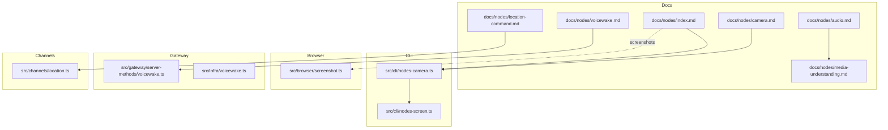
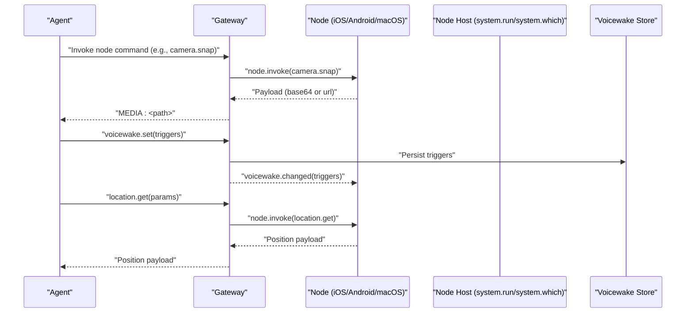
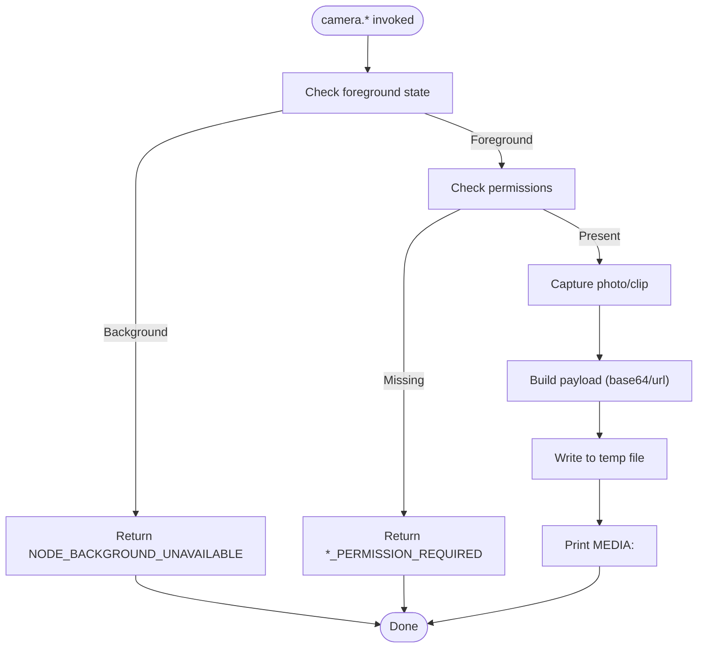
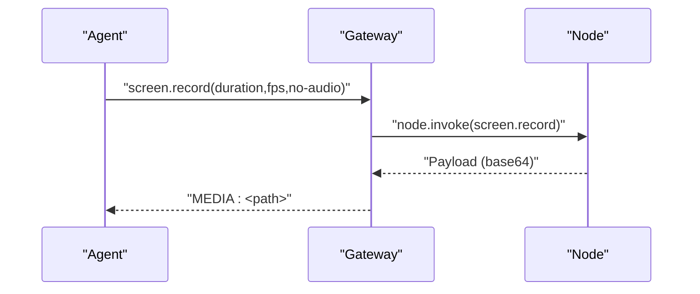
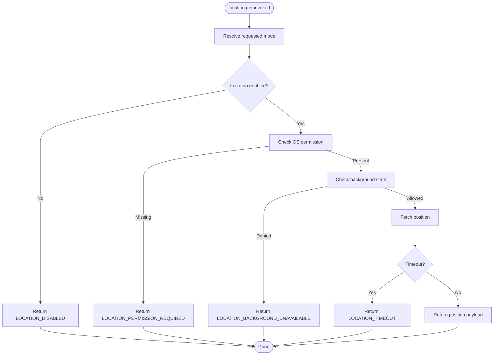
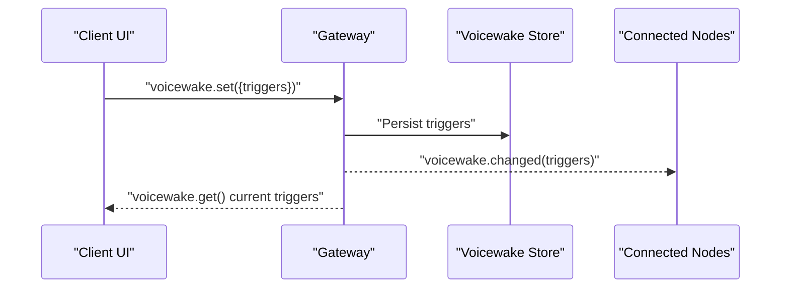
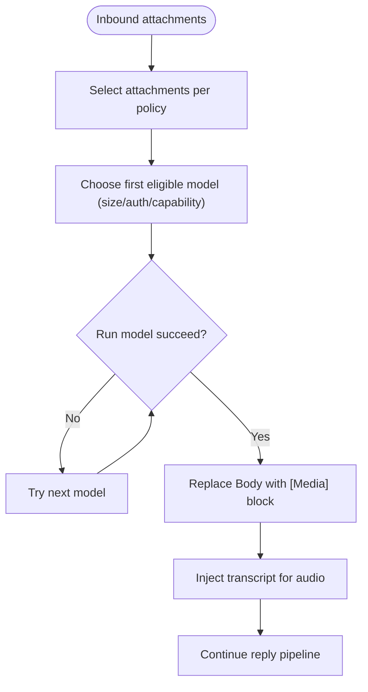
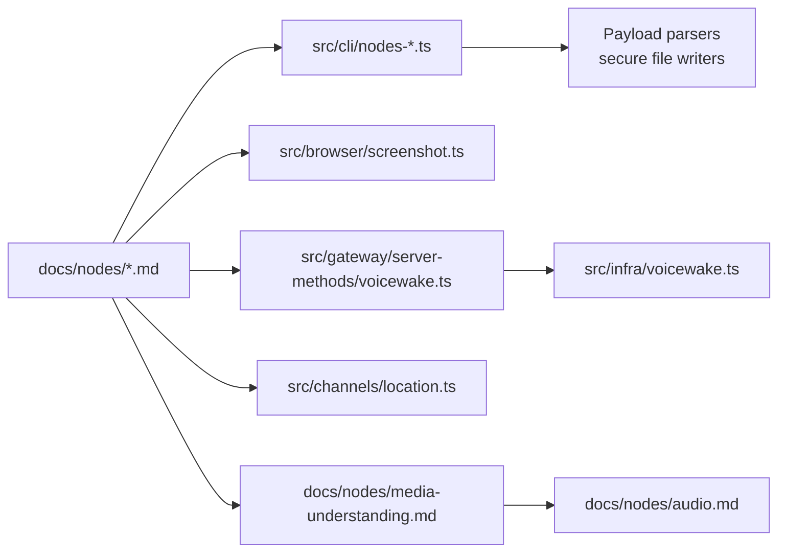

# Device Interaction Tools

<cite>
**Referenced Files in This Document**
- [docs/nodes/index.md](file://docs/nodes/index.md)
- [docs/nodes/camera.md](file://docs/nodes/camera.md)
- [docs/nodes/voicewake.md](file://docs/nodes/voicewake.md)
- [docs/nodes/location-command.md](file://docs/nodes/location-command.md)
- [docs/nodes/audio.md](file://docs/nodes/audio.md)
- [docs/nodes/media-understanding.md](file://docs/nodes/media-understanding.md)
- [src/cli/nodes-camera.ts](file://src/cli/nodes-camera.ts)
- [src/cli/nodes-screen.ts](file://src/cli/nodes-screen.ts)
- [src/browser/screenshot.ts](file://src/browser/screenshot.ts)
- [src/gateway/server-methods/voicewake.ts](file://src/gateway/server-methods/voicewake.ts)
- [src/infra/voicewake.ts](file://src/infra/voicewake.ts)
- [src/channels/location.ts](file://src/channels/location.ts)
- [apps/ios/WatchApp/Assets.xcassets/AppIcon.appiconset/watch-notification-38@2x.png](file://apps/ios/WatchApp/Assets.xcassets/AppIcon.appiconset/watch-notification-38@2x.png)
- [src/imessage/monitor/parse-notification.ts](file://src/imessage/monitor/parse-notification.ts)
</cite>

## Table of Contents
1. [Introduction](#introduction)
2. [Project Structure](#project-structure)
3. [Core Components](#core-components)
4. [Architecture Overview](#architecture-overview)
5. [Detailed Component Analysis](#detailed-component-analysis)
6. [Dependency Analysis](#dependency-analysis)
7. [Performance Considerations](#performance-considerations)
8. [Troubleshooting Guide](#troubleshooting-guide)
9. [Conclusion](#conclusion)
10. [Appendices](#appendices)

## Introduction
This document explains how OpenClaw’s node system interacts with device hardware to support notifications, system command execution, camera operations, screen recording, location services, and voice wake functionality. It covers permission requirements, security considerations, media processing, audio handling, and device-specific features. Practical examples demonstrate automation workflows, and troubleshooting guidance helps diagnose connectivity and permission issues across platforms.

## Project Structure
OpenClaw organizes device interaction under:
- Documentation: user-facing guides for nodes, camera, voicewake, location, audio, and media understanding
- CLI utilities: helpers for camera and screen recording payloads and file writing
- Browser integration: screenshot utilities
- Gateway services: voicewake server methods and persistence
- Channels: location retrieval and processing
- Platform assets and monitors: notification parsing and watch assets

**Diagram sources**
- [docs/nodes/index.md](file://docs/nodes/index.md#L147-L232)
- [docs/nodes/camera.md](file://docs/nodes/camera.md#L1-L163)
- [docs/nodes/voicewake.md](file://docs/nodes/voicewake.md#L1-L67)
- [docs/nodes/location-command.md](file://docs/nodes/location-command.md#L1-L99)
- [docs/nodes/audio.md](file://docs/nodes/audio.md#L1-L188)
- [docs/nodes/media-understanding.md](file://docs/nodes/media-understanding.md#L1-L388)
- [src/cli/nodes-camera.ts](file://src/cli/nodes-camera.ts#L1-L234)
- [src/cli/nodes-screen.ts](file://src/cli/nodes-screen.ts#L1-L39)
- [src/browser/screenshot.ts](file://src/browser/screenshot.ts)
- [src/gateway/server-methods/voicewake.ts](file://src/gateway/server-methods/voicewake.ts)
- [src/infra/voicewake.ts](file://src/infra/voicewake.ts)
- [src/channels/location.ts](file://src/channels/location.ts)

**Section sources**
- [docs/nodes/index.md](file://docs/nodes/index.md#L1-L373)

## Core Components
- Node command surface: canvas, camera, device, notifications, system, and location exposed via node.invoke
- Remote node host: executes system.run/system.which on a different machine; approvals enforced per node host
- Media helpers: camera and screen payload parsing/writing to temp files for agent workflows
- Voicewake: global wake word list managed by the Gateway and synchronized to nodes
- Location: node-level location.get with permission modes and platform differences
- Audio and media understanding: inbound audio transcription and media summarization with provider/CLI fallbacks

**Section sources**
- [docs/nodes/index.md](file://docs/nodes/index.md#L12-L146)
- [docs/nodes/camera.md](file://docs/nodes/camera.md#L9-L163)
- [docs/nodes/voicewake.md](file://docs/nodes/voicewake.md#L9-L67)
- [docs/nodes/location-command.md](file://docs/nodes/location-command.md#L9-L99)
- [docs/nodes/audio.md](file://docs/nodes/audio.md#L10-L188)
- [docs/nodes/media-understanding.md](file://docs/nodes/media-understanding.md#L9-L388)

## Architecture Overview
The node system connects peripheral devices (macOS/iOS/Android/headless) to the Gateway over WebSocket. Nodes expose a command surface; the Gateway routes tool calls and may forward exec to a node host. Media flows through node.invoke payloads (base64 or signed URLs) to CLI helpers that write temp files for agent consumption. Voicewake and location are node commands with platform-specific permission and foreground/background behavior.

**Diagram sources**
- [docs/nodes/index.md](file://docs/nodes/index.md#L147-L232)
- [docs/nodes/voicewake.md](file://docs/nodes/voicewake.md#L30-L67)
- [docs/nodes/location-command.md](file://docs/nodes/location-command.md#L44-L81)
- [src/gateway/server-methods/voicewake.ts](file://src/gateway/server-methods/voicewake.ts)
- [src/infra/voicewake.ts](file://src/infra/voicewake.ts)

## Detailed Component Analysis

### Notification Management
- iOS/Android nodes expose notifications-related commands (e.g., listing and actions) when permissions are granted.
- macOS app notifications are gated by user permission state and support priority and delivery hints.
- WatchOS assets and notification parsing exist in platform assets and monitors.

Practical guidance:
- Use node.describe to inspect permissions and capabilities.
- For macOS, ensure notification permission is granted in system settings.
- For iOS/Android, enable notifications in app settings; denied permissions cause permission-required errors.

**Section sources**
- [docs/nodes/index.md](file://docs/nodes/index.md#L265-L290)
- [docs/nodes/index.md](file://docs/nodes/index.md#L290-L316)
- [apps/ios/WatchApp/Assets.xcassets/AppIcon.appiconset/watch-notification-38@2x.png](file://apps/ios/WatchApp/Assets.xcassets/AppIcon.appiconset/watch-notification-38@2x.png)
- [src/imessage/monitor/parse-notification.ts](file://src/imessage/monitor/parse-notification.ts)

### System Command Execution
- macOS node and headless node host expose system.run/system.which and exec approvals.
- Exec approvals are enforced per node host; allowlist entries control allowed commands.
- Remote node host supports token/password auth and SSH tunneling for loopback-bound gateways.

Security considerations:
- PATH overrides are ignored; dangerous environment keys are stripped.
- Shell wrapper forms may require approvals depending on platform.
- Denial returns SYSTEM_RUN_DENIED.

**Section sources**
- [docs/nodes/index.md](file://docs/nodes/index.md#L290-L316)
- [docs/nodes/index.md](file://docs/nodes/index.md#L317-L373)

### Camera Operations
- iOS/Android/macOS nodes support camera.list, camera.snap (jpg), and camera.clip (mp4 with optional audio).
- Foreground requirement applies to iOS/Android camera commands; background calls return NODE_BACKGROUND_UNAVAILABLE.
- Payloads may be base64 or signed URLs; CLI helpers write temp files and print MEDIA:<path>.

Safety and limits:
- Photos are recompressed to keep payloads under 5 MB.
- Clips are capped at 60 seconds to prevent oversized payloads.
- Android requires CAMERA and RECORD_AUDIO permissions; denied permissions yield *_PERMISSION_REQUIRED.

**Diagram sources**
- [docs/nodes/camera.md](file://docs/nodes/camera.md#L60-L101)
- [src/cli/nodes-camera.ts](file://src/cli/nodes-camera.ts#L18-L58)
- [src/cli/nodes-camera.ts](file://src/cli/nodes-camera.ts#L193-L234)

**Section sources**
- [docs/nodes/camera.md](file://docs/nodes/camera.md#L9-L163)
- [src/cli/nodes-camera.ts](file://src/cli/nodes-camera.ts#L1-L234)

### Screen Recording Capabilities
- Nodes may expose screen.record (mp4). Options include duration, fps, audio toggle, and screen index for multi-display setups.
- Recordings are clamped to 60 seconds; availability depends on node platform.

**Diagram sources**
- [docs/nodes/index.md](file://docs/nodes/index.md#L217-L232)
- [src/cli/nodes-screen.ts](file://src/cli/nodes-screen.ts#L1-L39)

**Section sources**
- [docs/nodes/index.md](file://docs/nodes/index.md#L217-L232)
- [src/cli/nodes-screen.ts](file://src/cli/nodes-screen.ts#L1-L39)

### Location Services
- location.get is a node command; off by default. iOS/macOS may offer While Using or Always; Android supports foreground location.
- Precise location is a separate grant; actual permission level may differ from requested mode.
- Background restrictions vary by platform; Android denies location.get while backgrounded.

**Diagram sources**
- [docs/nodes/location-command.md](file://docs/nodes/location-command.md#L44-L81)
- [src/channels/location.ts](file://src/channels/location.ts)

**Section sources**
- [docs/nodes/location-command.md](file://docs/nodes/location-command.md#L9-L99)
- [src/channels/location.ts](file://src/channels/location.ts)

### Voice Wake Functionality
- Wake words are a global list owned by the Gateway and broadcast to all nodes and clients.
- macOS and iOS maintain local toggles; Android currently uses manual mic capture instead of wake-word triggers.
- Storage is at ~./openclaw/settings/voicewake.json with normalized triggers and updatedAtMs.

**Diagram sources**
- [docs/nodes/voicewake.md](file://docs/nodes/voicewake.md#L18-L67)
- [src/gateway/server-methods/voicewake.ts](file://src/gateway/server-methods/voicewake.ts)
- [src/infra/voicewake.ts](file://src/infra/voicewake.ts)

**Section sources**
- [docs/nodes/voicewake.md](file://docs/nodes/voicewake.md#L9-L67)
- [src/gateway/server-methods/voicewake.ts](file://src/gateway/server-methods/voicewake.ts)
- [src/infra/voicewake.ts](file://src/infra/voicewake.ts)

### Media Processing and Audio Handling
- Inbound media understanding can summarize images/audio/video before reply processing with provider/CLI fallbacks.
- Audio transcription auto-detects local CLIs or providers; supports echo transcript and scope gating.
- Media understanding preserves original attachments and enforces maxBytes/maxChars per capability.

**Diagram sources**
- [docs/nodes/media-understanding.md](file://docs/nodes/media-understanding.md#L20-L32)
- [docs/nodes/audio.md](file://docs/nodes/audio.md#L10-L36)

**Section sources**
- [docs/nodes/media-understanding.md](file://docs/nodes/media-understanding.md#L9-L388)
- [docs/nodes/audio.md](file://docs/nodes/audio.md#L1-L188)

### Screenshots (Canvas Snapshots)
- If the node is showing the Canvas, canvas.snapshot returns format/base64; CLI helpers write temp files and print MEDIA:<path>.
- Canvas controls include present, hide, navigate, and eval.

**Section sources**
- [docs/nodes/index.md](file://docs/nodes/index.md#L157-L189)
- [src/browser/screenshot.ts](file://src/browser/screenshot.ts)

## Dependency Analysis
- Node command surface depends on node pairing and permissions; payloads may be base64 or signed URLs.
- CLI camera/screen helpers depend on payload parsers and secure file-writing utilities.
- Voicewake depends on Gateway server methods and persistent storage.
- Location depends on node permissions and platform-specific foreground/background behavior.
- Media understanding integrates provider/CLI models and respects scope and concurrency.

**Diagram sources**
- [docs/nodes/index.md](file://docs/nodes/index.md#L147-L232)
- [src/cli/nodes-camera.ts](file://src/cli/nodes-camera.ts#L1-L234)
- [src/cli/nodes-screen.ts](file://src/cli/nodes-screen.ts#L1-L39)
- [src/browser/screenshot.ts](file://src/browser/screenshot.ts)
- [src/gateway/server-methods/voicewake.ts](file://src/gateway/server-methods/voicewake.ts)
- [src/infra/voicewake.ts](file://src/infra/voicewake.ts)
- [src/channels/location.ts](file://src/channels/location.ts)
- [docs/nodes/media-understanding.md](file://docs/nodes/media-understanding.md#L1-L388)
- [docs/nodes/audio.md](file://docs/nodes/audio.md#L1-L188)

**Section sources**
- [docs/nodes/index.md](file://docs/nodes/index.md#L1-L373)
- [src/cli/nodes-camera.ts](file://src/cli/nodes-camera.ts#L1-L234)
- [src/cli/nodes-screen.ts](file://src/cli/nodes-screen.ts#L1-L39)
- [src/browser/screenshot.ts](file://src/browser/screenshot.ts)
- [src/gateway/server-methods/voicewake.ts](file://src/gateway/server-methods/voicewake.ts)
- [src/infra/voicewake.ts](file://src/infra/voicewake.ts)
- [src/channels/location.ts](file://src/channels/location.ts)
- [docs/nodes/media-understanding.md](file://docs/nodes/media-understanding.md#L1-L388)
- [docs/nodes/audio.md](file://docs/nodes/audio.md#L1-L188)

## Performance Considerations
- Payload size caps: photos recompressed under 5 MB; clips capped at 60 seconds; camera URL downloads limited to 250 MB.
- Concurrency: media understanding supports configurable concurrency per capability.
- Provider fallbacks: auto-detection selects the first working option; ensure reliable local CLIs or provider keys to minimize retries.
- Proxy support: provider-based media understanding honors standard proxy environment variables.

[No sources needed since this section provides general guidance]

## Troubleshooting Guide
Common issues and resolutions:
- Node background unavailability: iOS/Android camera commands require foreground state; bring the node app to foreground.
- Permission failures: Android camera/clip requires CAMERA and RECORD_AUDIO; accept prompts and re-check permissions.
- Location disabled or background: Enable location in settings and keep the app foreground on Android; verify requested accuracy level.
- Voicewake synchronization: Changes are broadcast by the Gateway; ensure nodes are connected and voicewake.json persists on the Gateway host.
- Exec approvals: On macOS/headless node hosts, approve commands in Settings or manage ~/.openclaw/exec-approvals.json; denied prompts return SYSTEM_RUN_DENIED.
- Remote node host connectivity: For loopback-bound gateways, create an SSH tunnel and point the node host at the local end of the tunnel.

**Section sources**
- [docs/nodes/camera.md](file://docs/nodes/camera.md#L60-L101)
- [docs/nodes/index.md](file://docs/nodes/index.md#L213-L216)
- [docs/nodes/location-command.md](file://docs/nodes/location-command.md#L82-L87)
- [docs/nodes/voicewake.md](file://docs/nodes/voicewake.md#L46-L49)
- [docs/nodes/index.md](file://docs/nodes/index.md#L302-L316)
- [docs/nodes/index.md](file://docs/nodes/index.md#L65-L80)

## Conclusion
OpenClaw’s node system provides a unified interface to device hardware with strong permission and security controls. By leveraging node commands, approvals, and media helpers, agents can reliably automate tasks across platforms. Use the documented workflows, adhere to platform-specific permission and foreground requirements, and rely on built-in fallbacks for robust operation.

[No sources needed since this section summarizes without analyzing specific files]

## Appendices
- Practical automation workflows:
  - Capture camera frames and upload to a channel by invoking camera.snap/clip and printing MEDIA:<path> for agent processing.
  - Schedule periodic screen recordings for monitoring by invoking screen.record and attaching the resulting media.
  - Request location updates for context-aware actions using location.get with appropriate accuracy and timeout parameters.
  - Manage wake words globally by editing the list on the Gateway; changes propagate to all nodes and clients.
  - Execute system commands remotely via a node host with approved allowlist entries.

[No sources needed since this section provides general guidance]