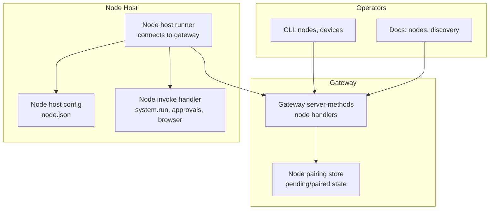
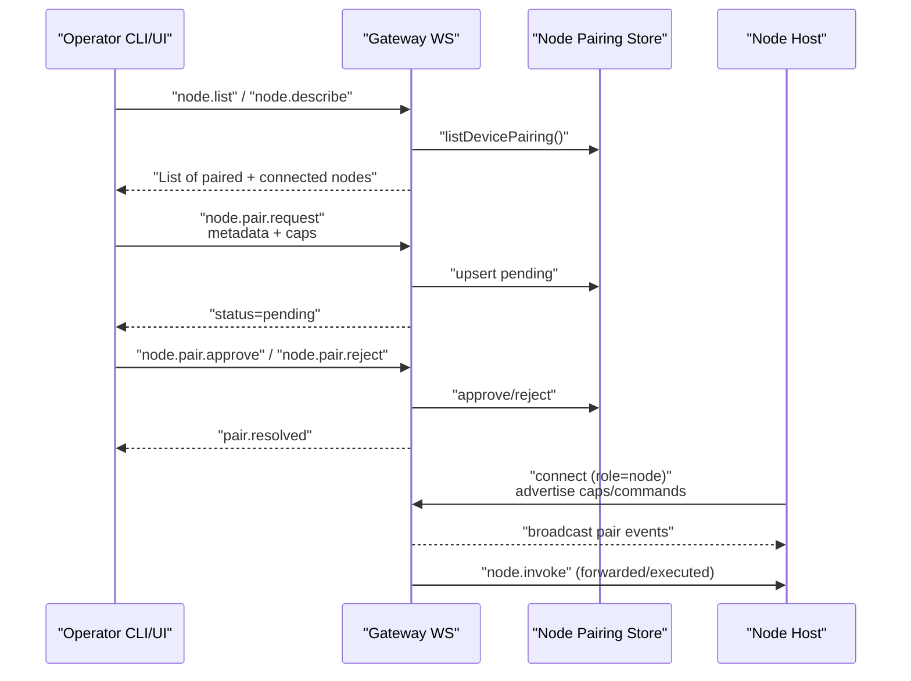
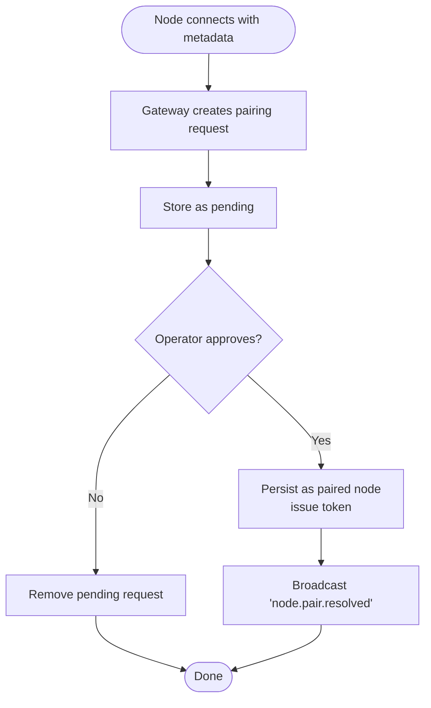
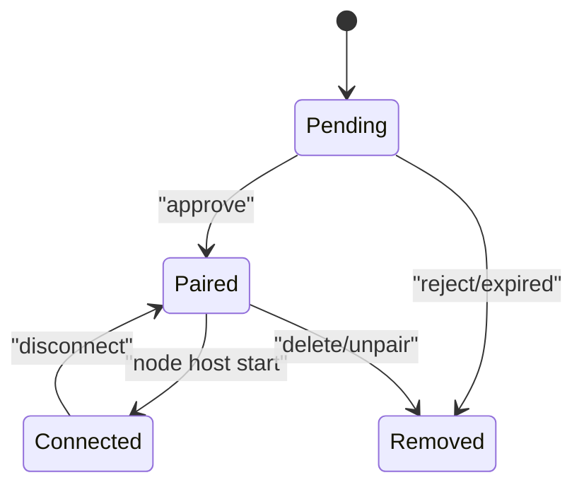
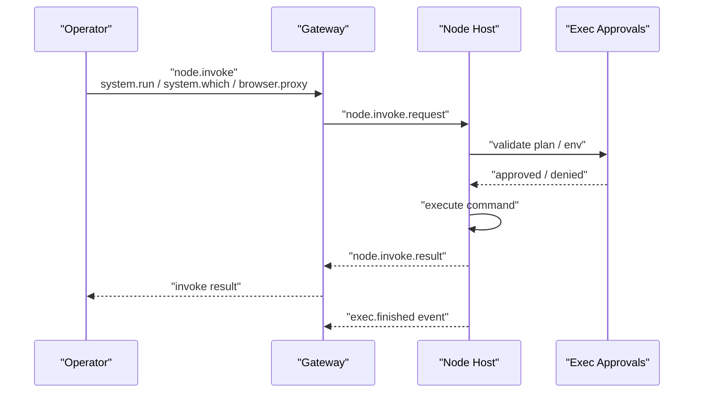
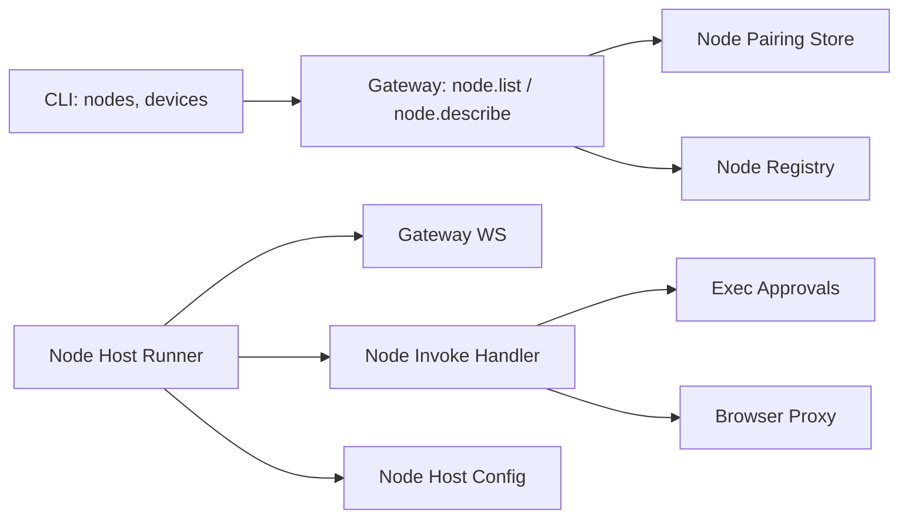

# Node Discovery & Management

<cite>
**Referenced Files in This Document**
- [docs/nodes/index.md](file://docs/nodes/index.md)
- [docs/cli/nodes.md](file://docs/cli/nodes.md)
- [docs/gateway/discovery.md](file://docs/gateway/discovery.md)
- [src/gateway/server-methods/nodes.ts](file://src/gateway/server-methods/nodes.ts)
- [src/infra/node-pairing.ts](file://src/infra/node-pairing.ts)
- [src/node-host/config.ts](file://src/node-host/config.ts)
- [src/node-host/runner.ts](file://src/node-host/runner.ts)
- [src/node-host/invoke.ts](file://src/node-host/invoke.ts)
</cite>

## Table of Contents
1. [Introduction](#introduction)
2. [Project Structure](#project-structure)
3. [Core Components](#core-components)
4. [Architecture Overview](#architecture-overview)
5. [Detailed Component Analysis](#detailed-component-analysis)
6. [Dependency Analysis](#dependency-analysis)
7. [Performance Considerations](#performance-considerations)
8. [Troubleshooting Guide](#troubleshooting-guide)
9. [Conclusion](#conclusion)

## Introduction
This document explains how OpenClaw discovers and manages nodes, including discovery inputs, pairing and approval workflows, status checks, and lifecycle management. It covers how to discover available nodes, check node health, manage connections, and handle authentication. It also documents the relationship between gateway nodes and companion applications, including node registration and capability detection.

## Project Structure
The node discovery and management system spans three primary areas:
- Gateway server-side methods for node listing, pairing, approval, and invocation
- Node host runtime that connects to the gateway and exposes capabilities
- CLI surfaces for operators to inspect, approve, and invoke node capabilities

**Diagram sources**
- [src/gateway/server-methods/nodes.ts](file://src/gateway/server-methods/nodes.ts#L384-L800)
- [src/infra/node-pairing.ts](file://src/infra/node-pairing.ts#L1-L274)
- [src/node-host/runner.ts](file://src/node-host/runner.ts#L144-L232)
- [src/node-host/invoke.ts](file://src/node-host/invoke.ts#L417-L557)
- [src/node-host/config.ts](file://src/node-host/config.ts#L45-L67)
- [docs/nodes/index.md](file://docs/nodes/index.md#L1-L373)
- [docs/cli/nodes.md](file://docs/cli/nodes.md#L1-L76)
- [docs/gateway/discovery.md](file://docs/gateway/discovery.md#L1-L124)

**Section sources**
- [docs/nodes/index.md](file://docs/nodes/index.md#L1-L373)
- [docs/cli/nodes.md](file://docs/cli/nodes.md#L1-L76)
- [docs/gateway/discovery.md](file://docs/gateway/discovery.md#L1-L124)

## Core Components
- Gateway node handlers: provide listing, description, pairing, approval/rejection, renaming, canvas capability refresh, and invocation routing.
- Node pairing store: maintains pending and paired nodes with metadata and tokens.
- Node host runner: connects to the gateway, advertises capabilities, and handles invoke requests.
- Node invoke handler: validates and executes commands (system.run, system.which, approvals, browser proxy).
- Node host config: persists node identity, display name, and gateway connection details.

**Section sources**
- [src/gateway/server-methods/nodes.ts](file://src/gateway/server-methods/nodes.ts#L384-L800)
- [src/infra/node-pairing.ts](file://src/infra/node-pairing.ts#L1-L274)
- [src/node-host/runner.ts](file://src/node-host/runner.ts#L144-L232)
- [src/node-host/invoke.ts](file://src/node-host/invoke.ts#L417-L557)
- [src/node-host/config.ts](file://src/node-host/config.ts#L45-L67)

## Architecture Overview
The system separates discovery and transport concerns from node pairing and invocation:

- Discovery and transports: Bonjour, Tailscale, and SSH fallback guide clients to a reachable gateway endpoint.
- Pairing and auth: Gateway owns pairing decisions and enforces auth, scopes, and rate limits.
- Invocation: Gateway forwards or executes commands based on node capabilities and approvals.

**Diagram sources**
- [docs/gateway/discovery.md](file://docs/gateway/discovery.md#L43-L124)
- [src/gateway/server-methods/nodes.ts](file://src/gateway/server-methods/nodes.ts#L384-L800)
- [src/infra/node-pairing.ts](file://src/infra/node-pairing.ts#L104-L201)

## Detailed Component Analysis

### Node Discovery Inputs and Transport Selection
- Bonjour/mDNS: LAN-only discovery; gateway advertises its WS endpoint and optional hints (TLS, tailnet DNS).
- Tailnet: cross-network discovery via MagicDNS or stable IPs.
- SSH fallback: universal fallback when direct routes are unavailable.
- Client policy: prefer paired direct endpoint, else Bonjour, else tailnet, else SSH.

Operational notes:
- TXT records are unauthenticated; clients should prefer resolved SRV/A/AAAA over TXT hints.
- TLS pinning must not be overridden by TXT; first-time pins require explicit user confirmation.

**Section sources**
- [docs/gateway/discovery.md](file://docs/gateway/discovery.md#L43-L124)

### Node Pairing and Approval Workflows
- Pairing request: initiated by node metadata and capabilities; stored as pending until operator approval.
- Approval/rejection: operator actions resolve pending requests; gateway broadcasts resolution events.
- Verification: gateway verifies node tokens for authenticated access.
- Renaming: operator can rename paired nodes for easier identification.

**Diagram sources**
- [src/gateway/server-methods/nodes.ts](file://src/gateway/server-methods/nodes.ts#L384-L490)
- [src/infra/node-pairing.ts](file://src/infra/node-pairing.ts#L104-L201)

**Section sources**
- [src/gateway/server-methods/nodes.ts](file://src/gateway/server-methods/nodes.ts#L384-L490)
- [src/infra/node-pairing.ts](file://src/infra/node-pairing.ts#L104-L201)

### Node Status Checking and Capability Detection
- Listing: gateway merges paired and connected node views, sorting by connectivity and display name.
- Description: detailed view of a specific node, combining live and paired metadata.
- Capabilities: union of live and paired capabilities; commands reflect node-advertised command surface.
- Permissions: optional permissions map included in listings and descriptions.

Practical commands:
- List nodes: filtered by connectedness or last-connect window.
- Describe a node: retrieve capabilities, commands, permissions, and connectivity timestamps.

**Section sources**
- [src/gateway/server-methods/nodes.ts](file://src/gateway/server-methods/nodes.ts#L536-L670)
- [docs/cli/nodes.md](file://docs/cli/nodes.md#L23-L38)

### Node Lifecycle Management
- Registration: node connects with role "node" and metadata; gateway stores pairing request.
- Connection lifecycle: node host connects to gateway, advertises capabilities and commands; gateway tracks connected nodes.
- Metadata updates: gateway updates paired node metadata on reconnect or explicit updates.
- Renaming: operator can change display names for paired nodes.

**Diagram sources**
- [src/infra/node-pairing.ts](file://src/infra/node-pairing.ts#L104-L201)
- [src/gateway/server-methods/nodes.ts](file://src/gateway/server-methods/nodes.ts#L536-L670)

**Section sources**
- [src/infra/node-pairing.ts](file://src/infra/node-pairing.ts#L1-L274)
- [src/gateway/server-methods/nodes.ts](file://src/gateway/server-methods/nodes.ts#L536-L670)

### Node Authentication and Security
- Token verification: gateway verifies node tokens to authorize requests.
- Auth precedence: node host resolves credentials from local or remote config; avoids inheriting conflicting remote auth that could mismatch local tokens.
- TLS pinning: node host supports TLS with optional fingerprint pinning; clients must confirm first-time pins.

**Section sources**
- [src/infra/node-pairing.ts](file://src/infra/node-pairing.ts#L203-L215)
- [src/node-host/runner.ts](file://src/node-host/runner.ts#L112-L142)
- [docs/gateway/discovery.md](file://docs/gateway/discovery.md#L71-L77)

### Node Invocation and Command Execution
- Invocation surface: nodes expose commands via node.invoke; gateway forwards or executes depending on node capabilities and approvals.
- Exec approvals: enforced on node host; system.run requires approvals; system.which helps locate executables; browser proxy enables controlled browser access.
- Results and events: node invoke results are best-effort; exec finished events carry combined output and exit status.

**Diagram sources**
- [src/gateway/server-methods/nodes.ts](file://src/gateway/server-methods/nodes.ts#L776-L800)
- [src/node-host/invoke.ts](file://src/node-host/invoke.ts#L417-L557)

**Section sources**
- [src/gateway/server-methods/nodes.ts](file://src/gateway/server-methods/nodes.ts#L776-L800)
- [src/node-host/invoke.ts](file://src/node-host/invoke.ts#L417-L557)

### Node Targeting Strategies and Approvals
- Targeting: choose nodes by ID, name, or IP; gateway merges paired and connected views to resolve targets.
- Approvals: exec approvals are enforced per node host; allowlist entries govern system.run; ask/allowlist/full modes control prompting.
- Exec defaults: nodes run with sanitized env; PATH overrides are ignored; shell wrappers require approvals on Windows.

**Section sources**
- [docs/nodes/index.md](file://docs/nodes/index.md#L290-L316)
- [docs/cli/nodes.md](file://docs/cli/nodes.md#L40-L76)

### Practical Examples and Commands
- List nodes: filtered by connectedness and last-connect window.
- Approve/reject pairing requests: via devices CLI or UI.
- Invoke commands: low-level node.invoke or higher-level helpers for canvas, camera, screen, and system.
- Rename nodes: update display names for easier management.

**Section sources**
- [docs/cli/nodes.md](file://docs/cli/nodes.md#L23-L76)
- [docs/nodes/index.md](file://docs/nodes/index.md#L147-L373)

## Dependency Analysis
The following diagram highlights key dependencies among components involved in node discovery and management.

**Diagram sources**
- [src/gateway/server-methods/nodes.ts](file://src/gateway/server-methods/nodes.ts#L536-L670)
- [src/infra/node-pairing.ts](file://src/infra/node-pairing.ts#L87-L94)
- [src/node-host/runner.ts](file://src/node-host/runner.ts#L180-L232)
- [src/node-host/invoke.ts](file://src/node-host/invoke.ts#L417-L557)
- [src/node-host/config.ts](file://src/node-host/config.ts#L45-L67)

**Section sources**
- [src/gateway/server-methods/nodes.ts](file://src/gateway/server-methods/nodes.ts#L536-L670)
- [src/infra/node-pairing.ts](file://src/infra/node-pairing.ts#L87-L94)
- [src/node-host/runner.ts](file://src/node-host/runner.ts#L180-L232)
- [src/node-host/invoke.ts](file://src/node-host/invoke.ts#L417-L557)
- [src/node-host/config.ts](file://src/node-host/config.ts#L45-L67)

## Performance Considerations
- Output truncation: node invoke results cap total output to prevent oversized payloads.
- Event trimming: exec finished events trim trailing output to reduce noise.
- Background restrictions: foreground-restricted commands (canvas.*, camera.*, screen.*, talk.*) return background-unavailable when the node is not foregrounded.
- Wake and reconnect: gateway can attempt APNs wake and poll for reconnection to minimize downtime.

**Section sources**
- [src/node-host/invoke.ts](file://src/node-host/invoke.ts#L32-L104)
- [src/gateway/server-methods/nodes.ts](file://src/gateway/server-methods/nodes.ts#L109-L139)
- [src/gateway/server-methods/nodes.ts](file://src/gateway/server-methods/nodes.ts#L365-L382)

## Troubleshooting Guide
- Disconnected nodes:
  - Use node.list to confirm paired vs connected state.
  - Trigger APNs wake for iOS nodes and poll for reconnection.
  - Verify gateway connectivity and transport selection (Bonjour/Tailscale/SSH).
- Authentication issues:
  - Confirm node token validity via verify endpoint.
  - Ensure correct credential precedence and avoid inheriting conflicting remote auth.
  - Validate TLS pinning and first-time pin confirmation.
- Invocation failures:
  - Check exec approvals and allowlist entries.
  - Review sanitized env and PATH behavior; PATH overrides are ignored.
  - Inspect exec finished events for combined stdout/stderr/error and exit code.

**Section sources**
- [src/gateway/server-methods/nodes.ts](file://src/gateway/server-methods/nodes.ts#L211-L382)
- [src/infra/node-pairing.ts](file://src/infra/node-pairing.ts#L203-L215)
- [src/node-host/runner.ts](file://src/node-host/runner.ts#L112-L142)
- [src/node-host/invoke.ts](file://src/node-host/invoke.ts#L95-L97)

## Conclusion
OpenClaw’s node discovery and management system cleanly separates discovery/transports from pairing and invocation. Operators use CLI and UI to approve nodes, track status, and invoke commands. Node hosts connect to the gateway, advertise capabilities, enforce approvals, and execute commands. The design emphasizes secure pairing, robust transport fallbacks, and clear operational signals for troubleshooting.