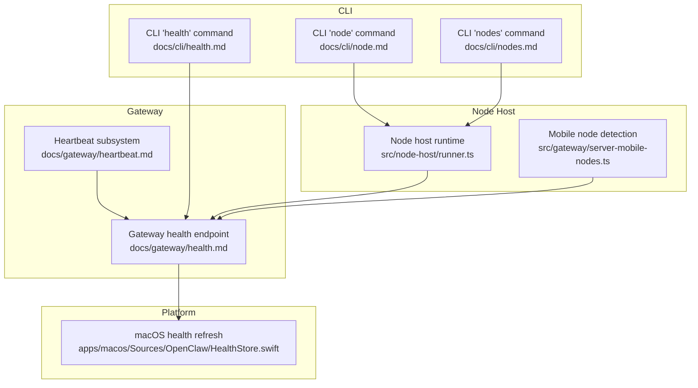
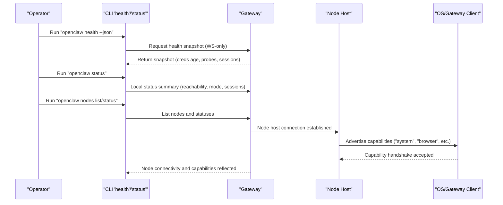
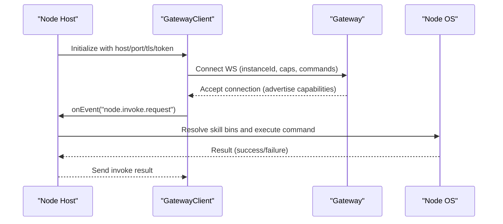
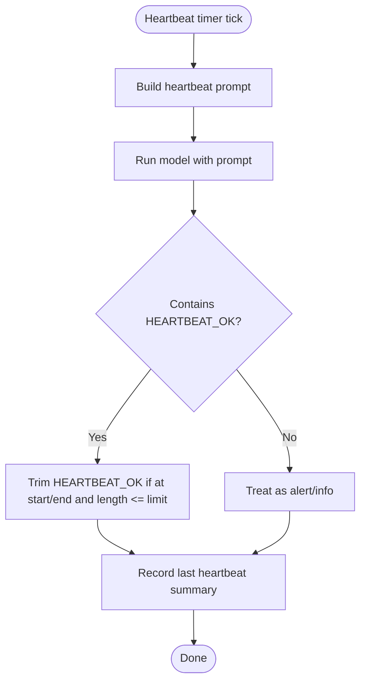
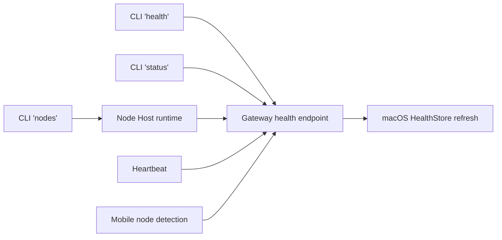

# Node Health & Monitoring

<cite>
**Referenced Files in This Document**
- [docs/gateway/health.md](file://docs/gateway/health.md)
- [docs/cli/health.md](file://docs/cli/health.md)
- [docs/cli/node.md](file://docs/cli/node.md)
- [docs/cli/nodes.md](file://docs/cli/nodes.md)
- [docs/gateway/heartbeat.md](file://docs/gateway/heartbeat.md)
- [src/node-host/runner.ts](file://src/node-host/runner.ts)
- [src/gateway/server-mobile-nodes.ts](file://src/gateway/server-mobile-nodes.ts)
- [apps/macos/Sources/OpenClaw/HealthStore.swift](file://apps/macos/Sources/OpenClaw/HealthStore.swift)
- [src/commands/health.ts](file://src/commands/health.ts)
</cite>

## Table of Contents
1. [Introduction](#introduction)
2. [Project Structure](#project-structure)
3. [Core Components](#core-components)
4. [Architecture Overview](#architecture-overview)
5. [Detailed Component Analysis](#detailed-component-analysis)
6. [Dependency Analysis](#dependency-analysis)
7. [Performance Considerations](#performance-considerations)
8. [Troubleshooting Guide](#troubleshooting-guide)
9. [Conclusion](#conclusion)
10. [Appendices](#appendices)

## Introduction
This document explains how OpenClaw monitors node health and performs diagnostics across the Gateway, CLI, and node host. It covers:
- How node connectivity and capabilities are tracked
- How health metrics are collected and surfaced
- How to monitor node status, detect failures, and interpret health data
- Practical workflows for diagnosing connectivity issues and resolving them
- The relationship between node health and overall system performance

## Project Structure
OpenClaw’s node health and monitoring spans CLI documentation, Gateway health endpoints, node host runtime, and platform-specific health refresh logic. The following diagram shows how these pieces relate to each other.

**Diagram sources**
- [docs/cli/health.md](file://docs/cli/health.md#L1-L22)
- [docs/cli/node.md](file://docs/cli/node.md#L1-L123)
- [docs/cli/nodes.md](file://docs/cli/nodes.md#L1-L76)
- [docs/gateway/health.md](file://docs/gateway/health.md#L1-L36)
- [docs/gateway/heartbeat.md](file://docs/gateway/heartbeat.md#L1-L386)
- [src/node-host/runner.ts](file://src/node-host/runner.ts#L144-L232)
- [src/gateway/server-mobile-nodes.ts](file://src/gateway/server-mobile-nodes.ts#L1-L14)
- [apps/macos/Sources/OpenClaw/HealthStore.swift](file://apps/macos/Sources/OpenClaw/HealthStore.swift#L110-L145)

**Section sources**
- [docs/cli/health.md](file://docs/cli/health.md#L1-L22)
- [docs/cli/node.md](file://docs/cli/node.md#L1-L123)
- [docs/cli/nodes.md](file://docs/cli/nodes.md#L1-L76)
- [docs/gateway/health.md](file://docs/gateway/health.md#L1-L36)
- [docs/gateway/heartbeat.md](file://docs/gateway/heartbeat.md#L1-L386)
- [src/node-host/runner.ts](file://src/node-host/runner.ts#L144-L232)
- [src/gateway/server-mobile-nodes.ts](file://src/gateway/server-mobile-nodes.ts#L1-L14)
- [apps/macos/Sources/OpenClaw/HealthStore.swift](file://apps/macos/Sources/OpenClaw/HealthStore.swift#L110-L145)

## Core Components
- CLI health and node commands: Provide quick checks, deep diagnostics, and actionable remediation steps for Gateway and node connectivity.
- Gateway health endpoint: Returns a health snapshot including credentials age, per-channel probe summaries, session store summary, and probe duration.
- Node host runtime: Establishes a WebSocket connection to the Gateway, advertises capabilities, and handles node invocation requests.
- Heartbeat subsystem: Periodically triggers agent turns to surface attention items and acts as a system liveness indicator.
- Platform health refresh: On macOS, the UI periodically queries the Gateway for a health snapshot and records success/error timestamps.

**Section sources**
- [docs/gateway/health.md](file://docs/gateway/health.md#L8-L36)
- [docs/cli/health.md](file://docs/cli/health.md#L8-L22)
- [docs/cli/node.md](file://docs/cli/node.md#L9-L123)
- [docs/cli/nodes.md](file://docs/cli/nodes.md#L9-L76)
- [docs/gateway/heartbeat.md](file://docs/gateway/heartbeat.md#L9-L386)
- [apps/macos/Sources/OpenClaw/HealthStore.swift](file://apps/macos/Sources/OpenClaw/HealthStore.swift#L110-L145)

## Architecture Overview
The node health architecture integrates CLI-driven diagnostics, Gateway-side health snapshots, node host capability advertisement, and heartbeat-driven liveness checks.

**Diagram sources**
- [docs/cli/health.md](file://docs/cli/health.md#L8-L22)
- [docs/gateway/health.md](file://docs/gateway/health.md#L14-L36)
- [docs/cli/nodes.md](file://docs/cli/nodes.md#L25-L38)
- [src/node-host/runner.ts](file://src/node-host/runner.ts#L180-L232)

## Detailed Component Analysis

### CLI Health and Status Commands
- Purpose: Provide a quick, safe way to diagnose Gateway health and node status without guesswork.
- Key commands:
  - `openclaw status`: Local summary of Gateway reachability/mode, update hints, auth age, sessions, and recent activity.
  - `openclaw status --all`: Full local diagnosis (read-only, color, safe to paste for debugging).
  - `openclaw status --deep`: Probes running Gateway with per-channel probes when supported.
  - `openclaw health --json`: Requests a full health snapshot from the running Gateway (WS-only).
- Deep diagnostics:
  - Verify credentials age and session store locations.
  - Relink channels when specific status codes or logged-out conditions appear.
- Failure scenarios:
  - Logged out or status codes 409–515: Relogin via channel logout/login flow.
  - Gateway unreachable: Start the Gateway on the configured port.
  - No inbound messages: Confirm device online, allowlist rules, and group chat settings.

**Section sources**
- [docs/gateway/health.md](file://docs/gateway/health.md#L12-L36)
- [docs/cli/health.md](file://docs/cli/health.md#L8-L22)

### Node Host Runtime and Capabilities
- Purpose: Run a headless node host that connects to the Gateway WebSocket and exposes system execution and browser proxy capabilities.
- Connectivity:
  - Establishes a WebSocket connection using resolved Gateway credentials.
  - Supports TLS with optional certificate fingerprint verification.
- Capability advertisement:
  - Caps include "system" and optionally "browser" depending on browser configuration.
  - Commands include system run, exec approvals, and browser proxy when enabled.
- Invocation handling:
  - Subscribes to node.invoke.request events and delegates to the invocation handler.
- Path environment:
  - Ensures OpenClaw CLI presence on PATH and logs effective PATH for diagnostics.

**Diagram sources**
- [src/node-host/runner.ts](file://src/node-host/runner.ts#L144-L232)

**Section sources**
- [docs/cli/node.md](file://docs/cli/node.md#L9-L123)
- [src/node-host/runner.ts](file://src/node-host/runner.ts#L144-L232)

### Nodes Management and Capability Tracking
- Purpose: Manage paired nodes, approve pending requests, and invoke node capabilities.
- Key commands:
  - List nodes, filter by connectedness and last-connect age.
  - Approve pending pairing requests.
  - Invoke commands and run shell-like commands with approvals and timeouts.
- Exec defaults:
  - Mirrors model exec behavior with approvals and agent-scoped overrides.
  - Supports raw shell execution and requires approvals for wrappers on some platforms.

**Section sources**
- [docs/cli/nodes.md](file://docs/cli/nodes.md#L9-L76)

### Heartbeat as a Health Indicator
- Purpose: Periodic agent turns surface attention items and act as a liveness indicator.
- Behavior:
  - Default interval is 30 minutes (1 hour for specific auth modes).
  - Responds with HEARTBEAT_OK to acknowledge when appropriate.
  - Visibility controls allow suppressing OKs or alerts per channel/account.
- Delivery:
  - Runs in the agent’s main session by default; delivery controlled by target and to.
  - Skips when queues are busy or outside active hours.

**Diagram sources**
- [docs/gateway/heartbeat.md](file://docs/gateway/heartbeat.md#L47-L91)
- [docs/gateway/heartbeat.md](file://docs/gateway/heartbeat.md#L64-L71)
- [docs/gateway/heartbeat.md](file://docs/gateway/heartbeat.md#L238-L252)

**Section sources**
- [docs/gateway/heartbeat.md](file://docs/gateway/heartbeat.md#L9-L386)

### Platform Health Refresh (macOS)
- Purpose: Periodically refresh the health snapshot from the Gateway and record success/error timestamps.
- Behavior:
  - Attempts to decode health output; logs warnings/errors when decoding fails.
  - Clears snapshot on demand when errors occur.
  - Logs recovery when previously failing refresh succeeds.

**Section sources**
- [apps/macos/Sources/OpenClaw/HealthStore.swift](file://apps/macos/Sources/OpenClaw/HealthStore.swift#L110-L145)

### Mobile Node Detection
- Purpose: Detect whether any connected node is a mobile platform (iOS/iPadOS/Android).
- Behavior:
  - Iterates connected nodes and checks platform prefix.

**Section sources**
- [src/gateway/server-mobile-nodes.ts](file://src/gateway/server-mobile-nodes.ts#L1-L14)

## Dependency Analysis
The following diagram shows how CLI commands, Gateway health, node host runtime, and heartbeat interact.

**Diagram sources**
- [docs/cli/health.md](file://docs/cli/health.md#L8-L22)
- [docs/gateway/health.md](file://docs/gateway/health.md#L14-L36)
- [docs/cli/nodes.md](file://docs/cli/nodes.md#L25-L38)
- [src/node-host/runner.ts](file://src/node-host/runner.ts#L180-L232)
- [docs/gateway/heartbeat.md](file://docs/gateway/heartbeat.md#L9-L386)
- [apps/macos/Sources/OpenClaw/HealthStore.swift](file://apps/macos/Sources/OpenClaw/HealthStore.swift#L110-L145)
- [src/gateway/server-mobile-nodes.ts](file://src/gateway/server-mobile-nodes.ts#L1-L14)

**Section sources**
- [docs/cli/health.md](file://docs/cli/health.md#L8-L22)
- [docs/gateway/health.md](file://docs/gateway/health.md#L14-L36)
- [docs/cli/nodes.md](file://docs/cli/nodes.md#L25-L38)
- [src/node-host/runner.ts](file://src/node-host/runner.ts#L180-L232)
- [docs/gateway/heartbeat.md](file://docs/gateway/heartbeat.md#L9-L386)
- [apps/macos/Sources/OpenClaw/HealthStore.swift](file://apps/macos/Sources/OpenClaw/HealthStore.swift#L110-L145)
- [src/gateway/server-mobile-nodes.ts](file://src/gateway/server-mobile-nodes.ts#L1-L14)

## Performance Considerations
- Heartbeat frequency and cost:
  - Shorter intervals increase token usage; keep the heartbeat prompt concise and consider cheaper models or disabling delivery when only internal updates are needed.
- Node invocation timeouts:
  - Configure invoke-timeout and command-timeout appropriately to balance responsiveness and resource usage.
- Capability caching:
  - Node host caches skill binaries with TTL to reduce repeated lookups; ensure cache invalidation aligns with environment changes.

[No sources needed since this section provides general guidance]

## Troubleshooting Guide
- Gateway unreachable:
  - Start the Gateway on the configured port; use force if the port is busy.
- Logged out or status codes 409–515:
  - Relogin via the channel logout/login flow; QR login may auto-restart once for specific status codes after pairing.
- No inbound messages:
  - Confirm the linked device is online and sender is allowed; for group chats, verify allowlist and mention rules.
- Node connectivity issues:
  - Verify node host credentials resolution and TLS fingerprint if used.
  - Ensure PATH includes the OpenClaw CLI and node host is advertising expected capabilities.
  - Approve pending pairing requests from the Gateway.
- Heartbeat anomalies:
  - Adjust intervals, visibility flags, and active hours; use manual wake to trigger on-demand heartbeats.

**Section sources**
- [docs/gateway/health.md](file://docs/gateway/health.md#L27-L36)
- [docs/cli/node.md](file://docs/cli/node.md#L61-L123)
- [docs/gateway/heartbeat.md](file://docs/gateway/heartbeat.md#L354-L386)

## Conclusion
OpenClaw’s node health and monitoring combine CLI diagnostics, Gateway health snapshots, node host capability advertisement, and heartbeat-driven liveness checks. Operators can quickly assess connectivity, detect failures, and resolve issues using documented commands and workflows. Integrating heartbeat visibility and platform-specific health refresh further strengthens observability and system reliability.

[No sources needed since this section summarizes without analyzing specific files]

## Appendices

### Practical Monitoring Workflows
- Quick health check:
  - Run the health command to fetch a snapshot from the running Gateway.
  - Review status summaries and deep diagnostics for credentials and session store.
- Node connectivity audit:
  - List nodes and filter by connectedness and last-connect age.
  - Approve pending pairing requests and verify advertised capabilities.
- Resolving connectivity issues:
  - Re-establish Gateway connection with proper TLS and credentials.
  - Ensure node host PATH and capabilities are correctly advertised.
  - Use heartbeat visibility controls to tune alert delivery.

**Section sources**
- [docs/cli/health.md](file://docs/cli/health.md#L8-L22)
- [docs/gateway/health.md](file://docs/gateway/health.md#L12-L36)
- [docs/cli/nodes.md](file://docs/cli/nodes.md#L25-L38)
- [docs/cli/node.md](file://docs/cli/node.md#L61-L123)