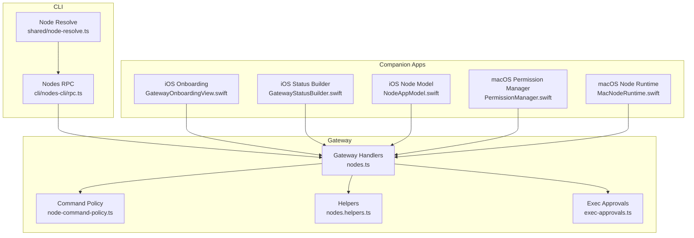
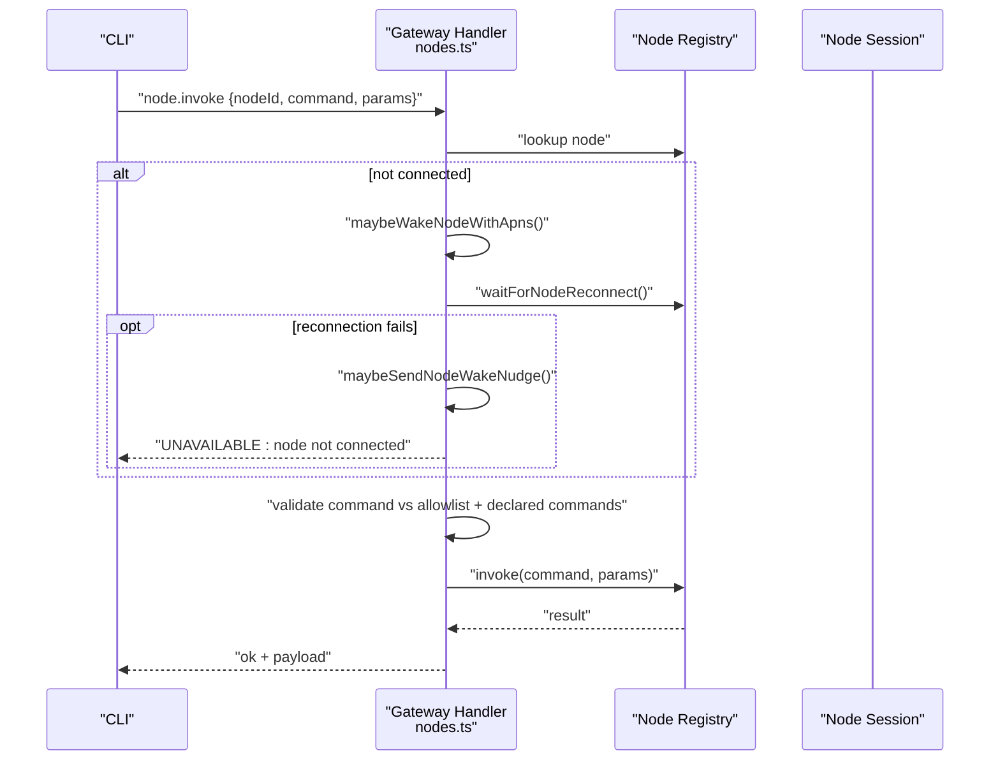
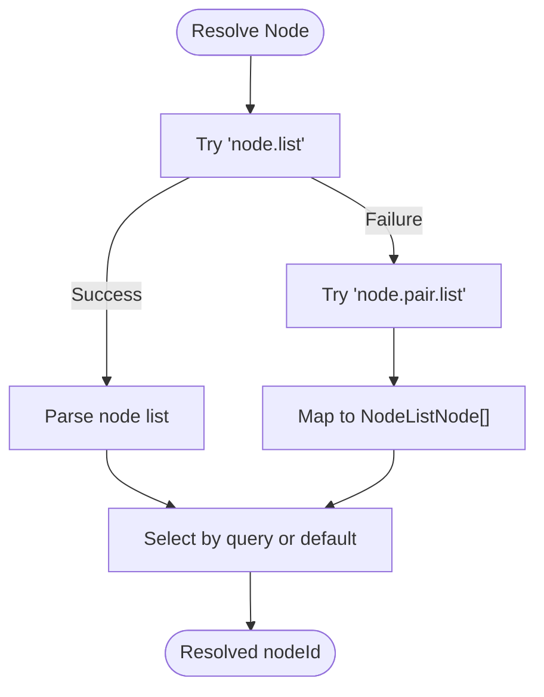
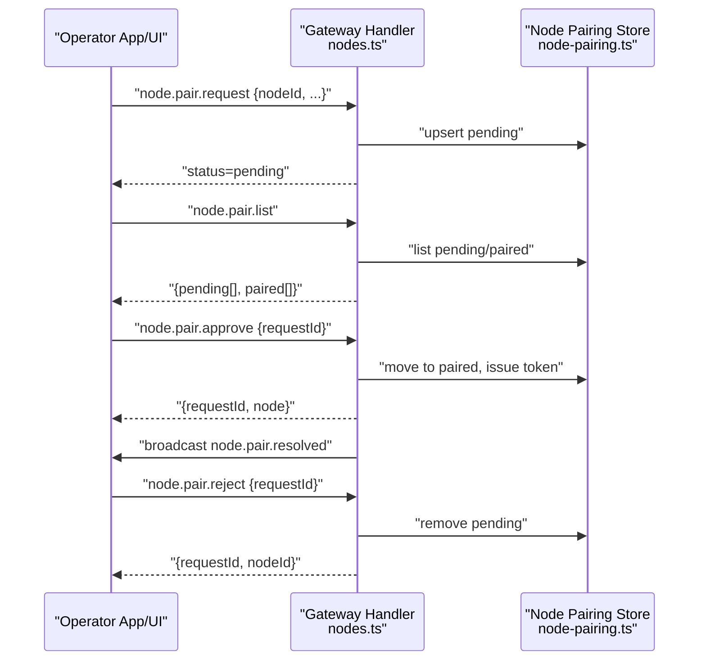
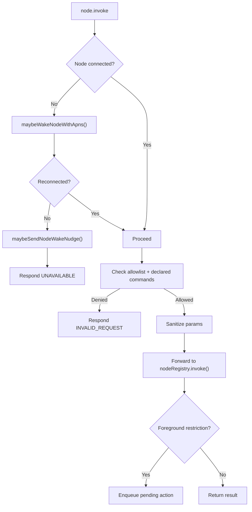
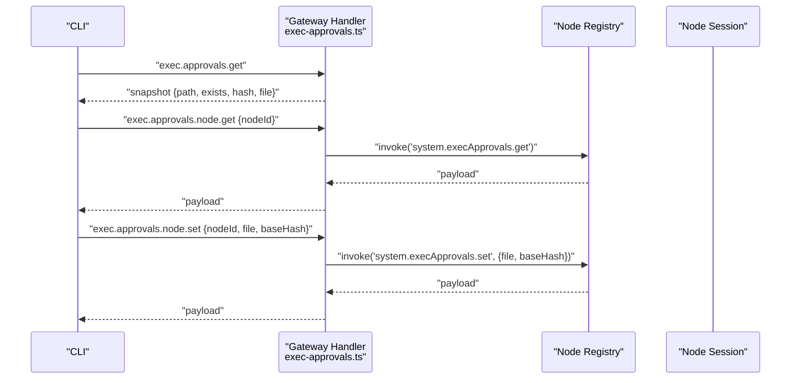
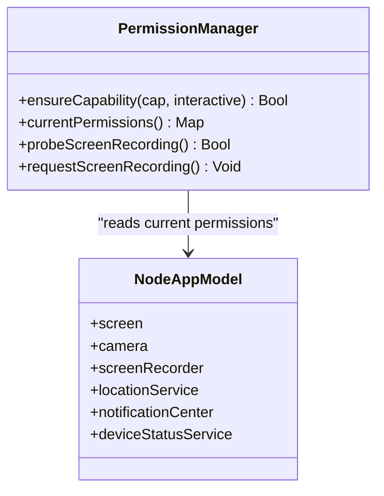
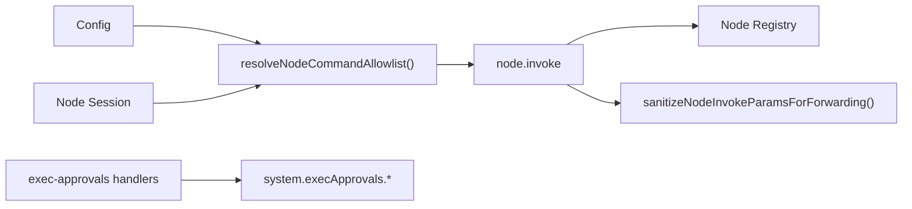

# Node Interaction

<cite>
**Referenced Files in This Document**
- [nodes.ts](file://src/gateway/server-methods/nodes.ts)
- [rpc.ts](file://src/cli/nodes-cli/rpc.ts)
- [node-resolve.ts](file://src/shared/node-resolve.ts)
- [node-pairing.ts](file://src/infra/node-pairing.ts)
- [nodes.helpers.ts](file://src/gateway/server-methods/nodes.helpers.ts)
- [exec-approvals.ts](file://src/gateway/server-methods/exec-approvals.ts)
- [node-command-policy.ts](file://src/gateway/node-command-policy.ts)
- [index.md](file://docs/nodes/index.md)
- [troubleshooting.md](file://docs/nodes/troubleshooting.md)
- [GatewayOnboardingView.swift](file://apps/ios/Sources/Onboarding/GatewayOnboardingView.swift)
- [GatewayStatusBuilder.swift](file://apps/ios/Sources/Status/GatewayStatusBuilder.swift)
- [NodeAppModel.swift](file://apps/ios/Sources/Model/NodeAppModel.swift)
- [PermissionManager.swift](file://apps/macos/Sources/OpenClaw/PermissionManager.swift)
- [MacNodeRuntime.swift](file://apps/macos/Sources/OpenClaw/NodeMode/MacNodeRuntime.swift)
- [windows-acl.ts](file://src/security/windows-acl.ts)
- [audit-extra.sync.ts](file://src/security/audit-extra.sync.ts)
- [node-commands.ts](file://src/infra/node-commands.ts)
</cite>

## Table of Contents
1. [Introduction](#introduction)
2. [Project Structure](#project-structure)
3. [Core Components](#core-components)
4. [Architecture Overview](#architecture-overview)
5. [Detailed Component Analysis](#detailed-component-analysis)
6. [Dependency Analysis](#dependency-analysis)
7. [Performance Considerations](#performance-considerations)
8. [Troubleshooting Guide](#troubleshooting-guide)
9. [Conclusion](#conclusion)
10. [Appendices](#appendices)

## Introduction
This document explains how OpenClaw’s node interaction system discovers, targets, and manages nodes; how to operate device capabilities such as notifications, system commands, camera, screen recording, and location; and how permissions, health monitoring, and capability detection work. It also covers the relationship between gateway nodes and companion applications, provides node-based workflow examples, outlines security considerations for device access, and offers troubleshooting guidance for connectivity issues.

## Project Structure
OpenClaw organizes node-related logic across three primary areas:
- Gateway server handlers that implement node lifecycle, discovery, targeting, and invocation
- CLI utilities that resolve nodes and call gateway RPCs
- Companion app integrations (iOS/macOS) that surface permissions, device capabilities, and runtime behaviors

**Diagram sources**
- [nodes.ts](file://src/gateway/server-methods/nodes.ts#L384-L1052)
- [node-command-policy.ts](file://src/gateway/node-command-policy.ts#L173-L211)
- [nodes.helpers.ts](file://src/gateway/server-methods/nodes.helpers.ts#L1-L81)
- [exec-approvals.ts](file://src/gateway/server-methods/exec-approvals.ts#L98-L194)
- [rpc.ts](file://src/cli/nodes-cli/rpc.ts#L16-L38)
- [node-resolve.ts](file://src/shared/node-resolve.ts#L8-L33)
- [GatewayOnboardingView.swift](file://apps/ios/Sources/Onboarding/GatewayOnboardingView.swift#L1-L42)
- [GatewayStatusBuilder.swift](file://apps/ios/Sources/Status/GatewayStatusBuilder.swift#L1-L21)
- [NodeAppModel.swift](file://apps/ios/Sources/Model/NodeAppModel.swift#L151-L176)
- [PermissionManager.swift](file://apps/macos/Sources/OpenClaw/PermissionManager.swift#L33-L482)
- [MacNodeRuntime.swift](file://apps/macos/Sources/OpenClaw/NodeMode/MacNodeRuntime.swift#L671-L693)

**Section sources**
- [nodes.ts](file://src/gateway/server-methods/nodes.ts#L384-L1052)
- [rpc.ts](file://src/cli/nodes-cli/rpc.ts#L16-L38)
- [node-resolve.ts](file://src/shared/node-resolve.ts#L8-L33)

## Core Components
- Node discovery and targeting
  - The gateway exposes node listing and description APIs, merging paired device metadata with live connections.
  - CLI resolves nodes by querying either node list or pairing list and selecting by ID/name/IP.
- Pairing and lifecycle
  - Nodes request pairing; approvals/rejections are tracked separately from the WebSocket connect handshake.
- Invocation pipeline
  - Gateway validates commands against allowlists and declared capabilities, optionally wakes nodes via push, and forwards invocations to connected nodes.
- Exec approvals and security gating
  - Exec approvals enforce policy on node hosts; gateway-side handlers coordinate approvals retrieval and updates per node.
- Permissions and capability detection
  - Nodes report capabilities and permissions; companion apps manage OS-level permissions and reflect them back to the gateway.

**Section sources**
- [nodes.ts](file://src/gateway/server-methods/nodes.ts#L536-L670)
- [rpc.ts](file://src/cli/nodes-cli/rpc.ts#L75-L96)
- [node-pairing.ts](file://src/infra/node-pairing.ts#L104-L201)
- [exec-approvals.ts](file://src/gateway/server-methods/exec-approvals.ts#L98-L194)
- [PermissionManager.swift](file://apps/macos/Sources/OpenClaw/PermissionManager.swift#L33-L482)

## Architecture Overview
The node interaction architecture centers on a WebSocket-based gateway that orchestrates:
- Discovery: node.list and node.describe
- Pairing: node.pair.request, node.pair.approve, node.pair.reject
- Invocation: node.invoke with APNs wake and pending action queuing
- Approvals: exec.approvals.node.get/set bridged to node-local exec approvals
- Permissions: node-reported permissions and OS-level permission managers

**Diagram sources**
- [nodes.ts](file://src/gateway/server-methods/nodes.ts#L776-L1004)

**Section sources**
- [nodes.ts](file://src/gateway/server-methods/nodes.ts#L776-L1004)

## Detailed Component Analysis

### Node Discovery and Targeting
- Discovery
  - node.list merges paired device entries (role: node) with currently connected nodes, normalizing capabilities and commands.
  - node.describe returns a single node’s metadata, including permissions and connection state.
- Targeting
  - CLI resolveNode attempts node.list; if unavailable, falls back to node.pair.list and maps to a NodeListNode for selection.
  - resolveNodeIdFromNodeList selects by query, with optional default picking.

**Diagram sources**
- [rpc.ts](file://src/cli/nodes-cli/rpc.ts#L79-L96)
- [node-resolve.ts](file://src/shared/node-resolve.ts#L8-L33)

**Section sources**
- [nodes.ts](file://src/gateway/server-methods/nodes.ts#L536-L670)
- [rpc.ts](file://src/cli/nodes-cli/rpc.ts#L75-L96)
- [node-resolve.ts](file://src/shared/node-resolve.ts#L8-L33)

### Pairing, Pending, Approve, Reject
- Pairing lifecycle
  - node.pair.request creates a pending pairing request with metadata.
  - node.pair.list enumerates pending and paired nodes.
  - node.pair.approve moves a pending request to paired; broadcasts resolution.
  - node.pair.reject removes a pending request.
- Verification
  - node.pair.verify authenticates a node using a token stored in the paired record.

**Diagram sources**
- [nodes.ts](file://src/gateway/server-methods/nodes.ts#L384-L508)
- [node-pairing.ts](file://src/infra/node-pairing.ts#L104-L201)

**Section sources**
- [nodes.ts](file://src/gateway/server-methods/nodes.ts#L384-L508)
- [node-pairing.ts](file://src/infra/node-pairing.ts#L104-L201)

### Invocation Pipeline, Wake, and Pending Actions
- Validation
  - Commands are validated against a platform-specific allowlist and the node’s declared commands.
- Wake and reconnect
  - If disconnected, the gateway attempts to wake via APNs, waits for reconnect, retries wake if needed, and may nudge the user.
- Pending actions
  - Foreground-restricted commands on iOS/ iPadOS may be queued as pending actions when the node is backgrounded; later acknowledged via node.pending.ack.

**Diagram sources**
- [nodes.ts](file://src/gateway/server-methods/nodes.ts#L776-L1004)
- [nodes.helpers.ts](file://src/gateway/server-methods/nodes.helpers.ts#L55-L81)

**Section sources**
- [nodes.ts](file://src/gateway/server-methods/nodes.ts#L776-L1004)
- [nodes.helpers.ts](file://src/gateway/server-methods/nodes.helpers.ts#L55-L81)

### Exec Approvals and Security Gating
- Gateway handlers
  - exec.approvals.get/set retrieve and update approvals snapshots.
  - exec.approvals.node.get/set delegate to the target node session for per-node approvals.
- Base hash validation
  - Changes to approvals require a matching base hash to prevent stale updates.
- Node-local enforcement
  - macOS node mode and headless node hosts enforce approvals via local exec-approvals.json or app settings.

**Diagram sources**
- [exec-approvals.ts](file://src/gateway/server-methods/exec-approvals.ts#L98-L194)

**Section sources**
- [exec-approvals.ts](file://src/gateway/server-methods/exec-approvals.ts#L98-L194)
- [MacNodeRuntime.swift](file://apps/macos/Sources/OpenClaw/NodeMode/MacNodeRuntime.swift#L671-L693)

### Permissions, Capabilities, and Health Monitoring
- Permissions map
  - Nodes may include a permissions map in node.list/node.describe indicating granted booleans for keys such as screenRecording, accessibility, camera, microphone, location.
- Capability detection
  - Companion apps probe OS permissions and reflect them back; macOS PermissionManager centralizes checks and requests for permissions like notifications, screen recording, camera, microphone, location.
- Health monitoring
  - The gateway emits health events and maintains a health cache; companion apps surface gateway connection status and can influence wake nudges.

**Diagram sources**
- [PermissionManager.swift](file://apps/macos/Sources/OpenClaw/PermissionManager.swift#L33-L482)
- [NodeAppModel.swift](file://apps/ios/Sources/Model/NodeAppModel.swift#L151-L176)

**Section sources**
- [nodes.ts](file://src/gateway/server-methods/nodes.ts#L536-L670)
- [PermissionManager.swift](file://apps/macos/Sources/OpenClaw/PermissionManager.swift#L33-L482)
- [GatewayStatusBuilder.swift](file://apps/ios/Sources/Status/GatewayStatusBuilder.swift#L1-L21)

### Device Interaction Tools
- Notifications
  - system.notify is available on nodes supporting system commands; macOS respects notification permission state.
- System commands
  - system.run/system.which are gated by exec approvals; headless node hosts and macOS node mode enforce approvals differently.
- Camera and screen
  - camera.* and screen.* are foreground-only on iOS/Android; gateway may queue actions and wake nodes.
- Location
  - location.get is available when enabled; response includes lat/lon, accuracy, and timestamp.

**Section sources**
- [index.md](file://docs/nodes/index.md#L147-L373)
- [nodes.ts](file://src/gateway/server-methods/nodes.ts#L776-L1004)

### Relationship Between Gateway Nodes and Companion Applications
- Companion apps connect to the gateway as nodes, exposing capabilities such as canvas, camera, and system commands.
- iOS onboarding guides connecting to a gateway and status reporting reflects connection state.
- macOS PermissionManager coordinates OS permission flows and reports current permissions to the gateway.

**Section sources**
- [GatewayOnboardingView.swift](file://apps/ios/Sources/Onboarding/GatewayOnboardingView.swift#L1-L42)
- [GatewayStatusBuilder.swift](file://apps/ios/Sources/Status/GatewayStatusBuilder.swift#L1-L21)
- [PermissionManager.swift](file://apps/macos/Sources/OpenClaw/PermissionManager.swift#L33-L482)

### Examples of Node-Based Workflows
- Snapshot and attach media
  - Use canvas snapshot to capture a screenshot and attach it to a message.
- Run a system command on a specific node
  - Bind exec to a node and run a command; approvals must be configured on the node host.
- Camera capture
  - Capture a photo or short clip; ensure permissions and foreground state on iOS/Android.

**Section sources**
- [index.md](file://docs/nodes/index.md#L147-L373)

## Dependency Analysis
- Command allowlist resolution depends on platform/device family metadata and configuration overrides.
- Invocation validation depends on declared commands reported by the node and the computed allowlist.
- Exec approvals rely on a base hash to prevent stale updates and delegate to node-local storage.

**Diagram sources**
- [node-command-policy.ts](file://src/gateway/node-command-policy.ts#L173-L211)
- [nodes.ts](file://src/gateway/server-methods/nodes.ts#L776-L1004)
- [exec-approvals.ts](file://src/gateway/server-methods/exec-approvals.ts#L98-L194)

**Section sources**
- [node-command-policy.ts](file://src/gateway/node-command-policy.ts#L173-L211)
- [nodes.ts](file://src/gateway/server-methods/nodes.ts#L776-L1004)
- [exec-approvals.ts](file://src/gateway/server-methods/exec-approvals.ts#L98-L194)

## Performance Considerations
- Throttling and retries
  - Node wake attempts are throttled and retried with backoff; APNs wake and reconnect waits are bounded to avoid excessive load.
- Pending action limits
  - Pending actions are pruned by TTL and capped per node to prevent unbounded queues.
- Foreground restrictions
  - Foreground-only commands are queued rather than failing immediately, reducing immediate retries and improving UX.

**Section sources**
- [nodes.ts](file://src/gateway/server-methods/nodes.ts#L50-L56)
- [nodes.ts](file://src/gateway/server-methods/nodes.ts#L141-L198)

## Troubleshooting Guide
- Command ladder
  - Check gateway and node status, review logs, run doctor, and probe channels.
- Foreground requirements
  - canvas.*, camera.*, and screen.* require foreground on iOS/Android; bring the app to foreground and retry.
- Pairing vs approvals
  - Device pairing enables connection; exec approvals enable specific commands. Approve pairing first, then adjust approvals.
- Common error codes
  - NODE_BACKGROUND_UNAVAILABLE, *_PERMISSION_REQUIRED, LOCATION_* errors, SYSTEM_RUN_DENIED.

**Section sources**
- [troubleshooting.md](file://docs/nodes/troubleshooting.md#L13-L115)

## Conclusion
OpenClaw’s node interaction system provides robust discovery, pairing, and invocation with strong security controls via exec approvals and permission gating. The gateway orchestrates wake and reconnect flows, enforces command allowlists, and integrates with companion apps to surface OS permissions and capabilities. Following the workflows and troubleshooting steps outlined here ensures reliable node-based automation.

## Appendices

### Security Considerations for Device Access
- Windows ACL and principal classification
  - Trusted and world principals are recognized; rights derived from tokens; status lines identified for audit.
- Audit of deny command patterns
  - Deny lists are audited for unsupported pattern-like entries and unknown exact commands.

**Section sources**
- [windows-acl.ts](file://src/security/windows-acl.ts#L121-L163)
- [audit-extra.sync.ts](file://src/security/audit-extra.sync.ts#L970-L1006)

### Node Commands Reference
- System run commands
  - system.run.prepare, system.run, system.which
- System notify
  - system.notify
- Exec approvals commands
  - system.execApprovals.get, system.execApprovals.set

**Section sources**
- [node-commands.ts](file://src/infra/node-commands.ts#L1-L13)