# Plugin Tools

<cite>
**Referenced Files in This Document**
- [docs/tools/plugin.md](file://docs/tools/plugin.md)
- [docs/plugins/manifest.md](file://docs/plugins/manifest.md)
- [src/plugins/loader.ts](file://src/plugins/loader.ts)
- [src/plugins/discovery.ts](file://src/plugins/discovery.ts)
- [src/plugins/registry.ts](file://src/plugins/registry.ts)
- [src/plugins/runtime.ts](file://src/plugins/runtime.ts)
- [src/plugins/types.ts](file://src/plugins/types.ts)
- [src/plugins/config-state.ts](file://src/plugins/config-state.ts)
- [src/plugins/config-schema.ts](file://src/plugins/config-schema.ts)
- [src/plugins/cli.ts](file://src/plugins/cli.ts)
- [src/plugin-sdk/index.ts](file://src/plugin-sdk/index.ts)
- [extensions/voice-call/openclaw.plugin.json](file://extensions/voice-call/openclaw.plugin.json)
- [extensions/voice-call/index.ts](file://extensions/voice-call/index.ts)
</cite>

## Table of Contents
1. [Introduction](#introduction)
2. [Project Structure](#project-structure)
3. [Core Components](#core-components)
4. [Architecture Overview](#architecture-overview)
5. [Detailed Component Analysis](#detailed-component-analysis)
6. [Dependency Analysis](#dependency-analysis)
7. [Performance Considerations](#performance-considerations)
8. [Troubleshooting Guide](#troubleshooting-guide)
9. [Conclusion](#conclusion)
10. [Appendices](#appendices)

## Introduction
This document explains OpenClaw’s plugin-based tool extension system. It covers how plugins are discovered, validated, loaded, and integrated into the runtime; how plugin tools are registered and invoked; and how policies and security controls govern plugin behavior. It also provides practical guidance for developing plugins, configuring them, and troubleshooting common issues.

## Project Structure
OpenClaw’s plugin system spans several subsystems:
- Discovery and validation: locate plugin roots, enforce safety, and validate manifests and configs
- Loading and activation: JIT load plugin modules, construct plugin registries, and call plugin registration functions
- Registry and API: expose the plugin API surface, register tools, hooks, HTTP routes, CLI commands, services, and providers
- Runtime integration: provide core helpers and channel runtime access to plugins
- CLI integration: dynamically register plugin-defined CLI commands
- SDK: standardized subpaths for plugin authors

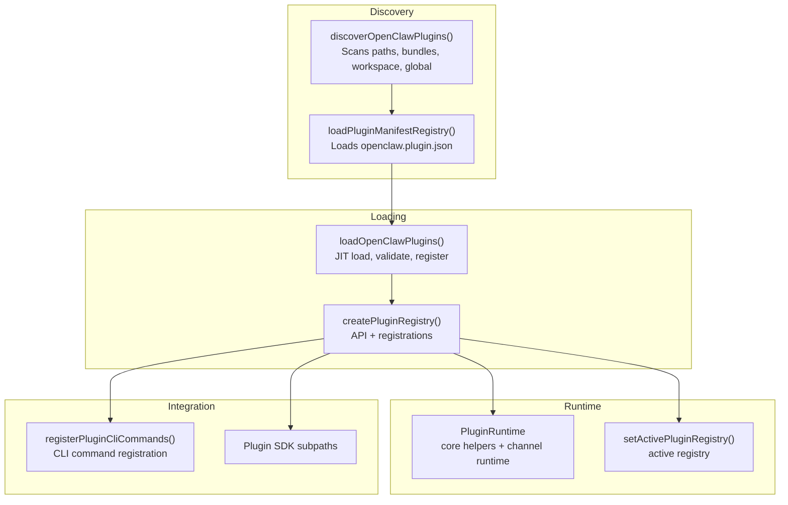

**Diagram sources**
- [src/plugins/discovery.ts](file://src/plugins/discovery.ts#L618-L711)
- [src/plugins/loader.ts](file://src/plugins/loader.ts#L447-L800)
- [src/plugins/registry.ts](file://src/plugins/registry.ts#L185-L624)
- [src/plugins/runtime.ts](file://src/plugins/runtime.ts#L25-L49)
- [src/plugins/cli.ts](file://src/plugins/cli.ts#L11-L59)
- [src/plugin-sdk/index.ts](file://src/plugin-sdk/index.ts#L1-L812)

**Section sources**
- [src/plugins/discovery.ts](file://src/plugins/discovery.ts#L1-L712)
- [src/plugins/loader.ts](file://src/plugins/loader.ts#L1-L829)
- [src/plugins/registry.ts](file://src/plugins/registry.ts#L1-L625)
- [src/plugins/runtime.ts](file://src/plugins/runtime.ts#L1-L49)
- [src/plugins/cli.ts](file://src/plugins/cli.ts#L1-L60)
- [src/plugin-sdk/index.ts](file://src/plugin-sdk/index.ts#L1-L812)

## Core Components
- Plugin discovery and manifest validation: enumerates plugin candidates, enforces safety, and validates manifests and JSON schemas
- Plugin loader: JIT-loads plugin modules, constructs registries, and invokes plugin registration functions
- Plugin registry and API: central registry for tools, hooks, HTTP routes, CLI commands, services, providers, and gateway methods
- Runtime integration: exposes core helpers and channel runtime access to plugins
- CLI integration: registers plugin-defined CLI commands and prevents conflicts
- Plugin SDK: standardized subpaths for plugin authors

**Section sources**
- [src/plugins/discovery.ts](file://src/plugins/discovery.ts#L1-L712)
- [src/plugins/loader.ts](file://src/plugins/loader.ts#L1-L829)
- [src/plugins/registry.ts](file://src/plugins/registry.ts#L1-L625)
- [src/plugins/runtime.ts](file://src/plugins/runtime.ts#L1-L49)
- [src/plugins/cli.ts](file://src/plugins/cli.ts#L1-L60)
- [src/plugin-sdk/index.ts](file://src/plugin-sdk/index.ts#L1-L812)

## Architecture Overview
The plugin system is layered:
- Safety-first discovery and validation
- Strict manifest and schema validation prior to code execution
- Controlled loading and registration via a typed API
- Central registry for tools, hooks, routes, and commands
- Runtime access to core helpers and channel capabilities
- CLI command registration with conflict detection

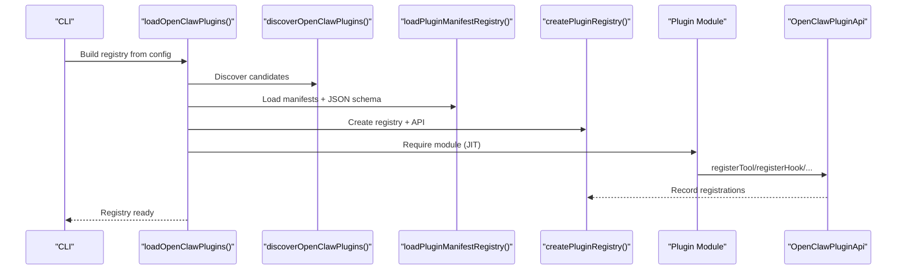

**Diagram sources**
- [src/plugins/loader.ts](file://src/plugins/loader.ts#L447-L800)
- [src/plugins/discovery.ts](file://src/plugins/discovery.ts#L618-L711)
- [src/plugins/registry.ts](file://src/plugins/registry.ts#L185-L624)

## Detailed Component Analysis

### Plugin Discovery and Safety
- Scans multiple locations in order: config paths, workspace extensions, global extensions, bundled extensions
- Enforces safety: rejects candidates that escape plugin root, are world-writable, or have suspicious ownership
- Supports package packs with multiple extension entries
- Caches discovery results for startup performance

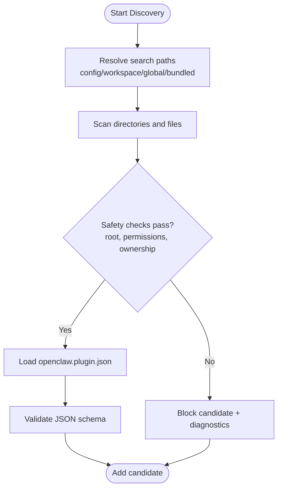

**Diagram sources**
- [src/plugins/discovery.ts](file://src/plugins/discovery.ts#L618-L711)

**Section sources**
- [src/plugins/discovery.ts](file://src/plugins/discovery.ts#L1-L712)

### Plugin Manifest and Configuration
- Every plugin must ship a manifest with a strict JSON schema for its configuration
- Validation occurs before plugin code executes
- Supports UI hints for better control form rendering
- Enforces allowlists for plugin ids and channel ids

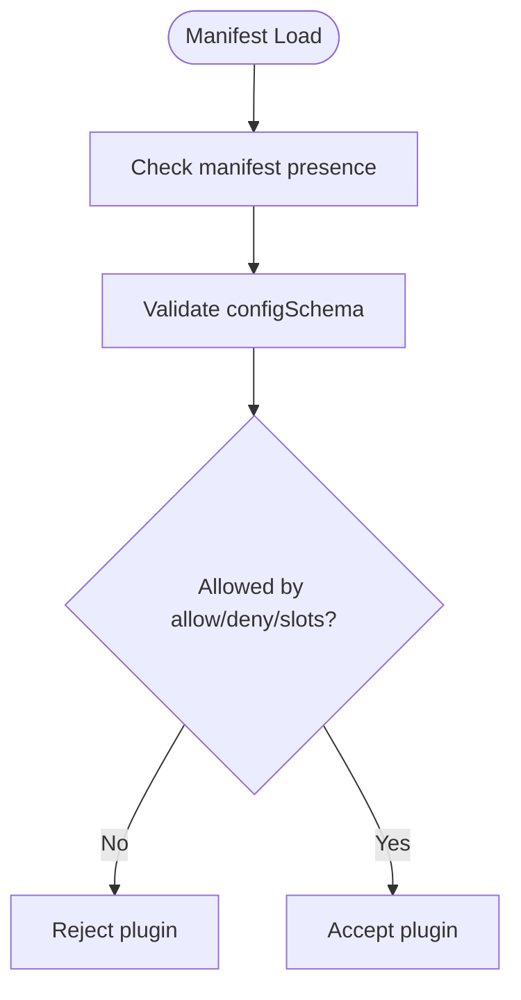

**Diagram sources**
- [docs/plugins/manifest.md](file://docs/plugins/manifest.md#L1-L76)
- [src/plugins/loader.ts](file://src/plugins/loader.ts#L745-L755)

**Section sources**
- [docs/plugins/manifest.md](file://docs/plugins/manifest.md#L1-L76)
- [src/plugins/loader.ts](file://src/plugins/loader.ts#L175-L194)

### Plugin Loading and Registration
- JIT-loads plugin modules with alias support for SDK subpaths
- Constructs a registry and API for each plugin
- Calls plugin registration function with typed API surface
- Records tools, hooks, HTTP routes, CLI commands, services, providers, and gateway methods

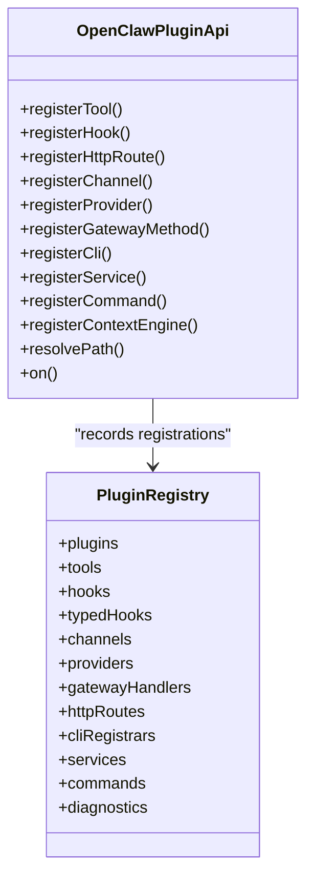

**Diagram sources**
- [src/plugins/registry.ts](file://src/plugins/registry.ts#L263-L306)
- [src/plugins/registry.ts](file://src/plugins/registry.ts#L129-L142)

**Section sources**
- [src/plugins/loader.ts](file://src/plugins/loader.ts#L538-L558)
- [src/plugins/registry.ts](file://src/plugins/registry.ts#L185-L624)

### Plugin Tools and Invocation
- Plugins can register tools that agents can invoke
- Tools can be factories or direct tool objects
- Tools receive contextual information (session, agent, requester identity)
- Optional tools are supported

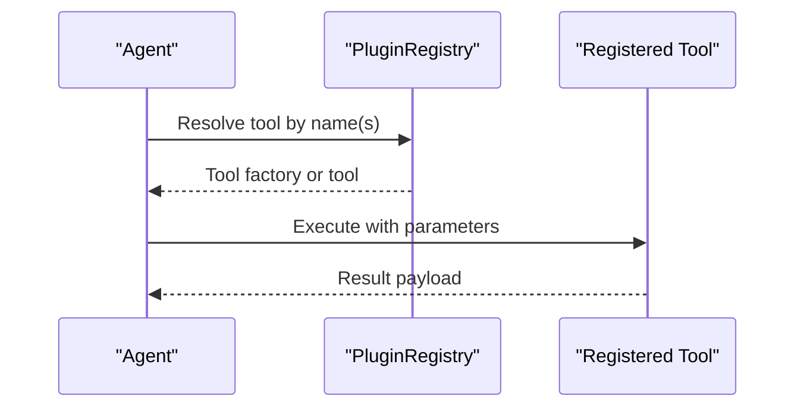

**Diagram sources**
- [src/plugins/registry.ts](file://src/plugins/registry.ts#L193-L218)
- [src/plugins/types.ts](file://src/plugins/types.ts#L75-L83)

**Section sources**
- [src/plugins/registry.ts](file://src/plugins/registry.ts#L193-L218)
- [src/plugins/types.ts](file://src/plugins/types.ts#L58-L83)

### Plugin Hooks and Policies
- Plugins can register lifecycle hooks for agent runs, messages, tools, sessions, and gateway lifecycle
- Core enforces policies, including prompt injection controls per plugin entry
- Typed hook registration supports priority ordering

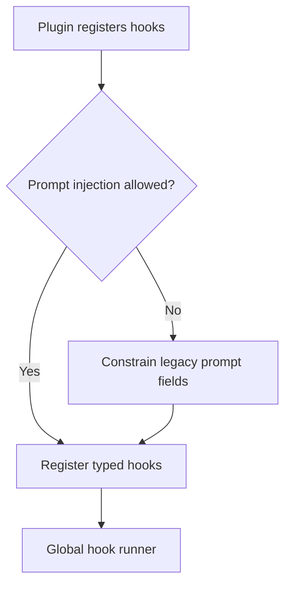

**Diagram sources**
- [src/plugins/registry.ts](file://src/plugins/registry.ts#L519-L566)
- [src/plugins/types.ts](file://src/plugins/types.ts#L321-L377)

**Section sources**
- [src/plugins/registry.ts](file://src/plugins/registry.ts#L220-L288)
- [src/plugins/types.ts](file://src/plugins/types.ts#L321-L488)

### Plugin HTTP Routes and Gateway Methods
- Plugins can register HTTP routes with explicit auth modes and path semantics
- Gateway methods can be registered for internal RPC
- Route overlap and auth conflicts are detected and rejected

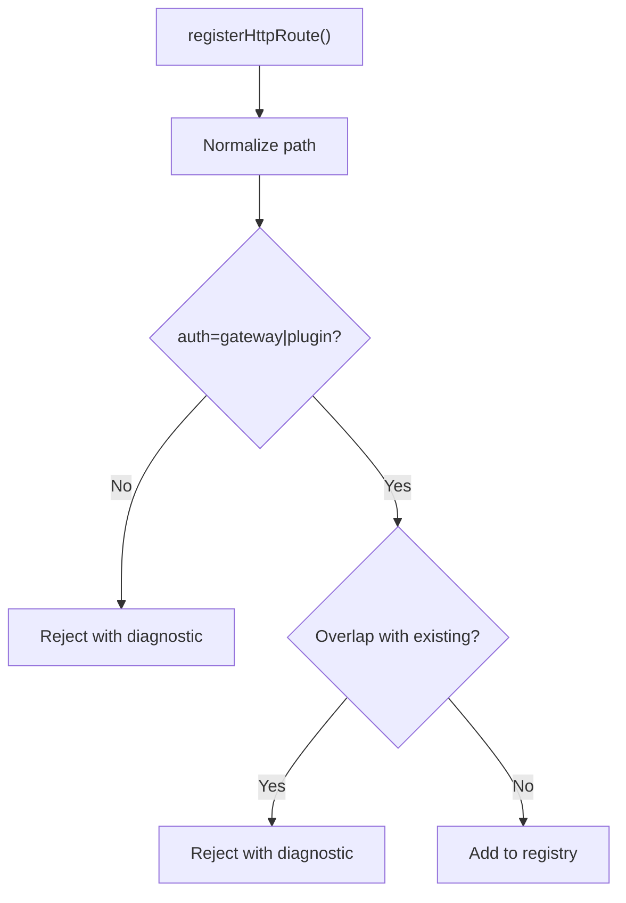

**Diagram sources**
- [src/plugins/registry.ts](file://src/plugins/registry.ts#L318-L400)

**Section sources**
- [src/plugins/registry.ts](file://src/plugins/registry.ts#L290-L400)

### Plugin CLI Integration
- Plugins can register CLI commands; the CLI loader prevents conflicts with existing commands
- Registration happens after loading the plugin registry

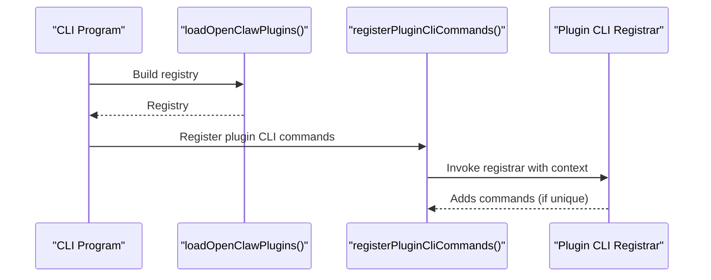

**Diagram sources**
- [src/plugins/cli.ts](file://src/plugins/cli.ts#L11-L59)
- [src/plugins/loader.ts](file://src/plugins/loader.ts#L447-L468)

**Section sources**
- [src/plugins/cli.ts](file://src/plugins/cli.ts#L1-L60)
- [src/plugins/loader.ts](file://src/plugins/loader.ts#L467-L468)

### Plugin SDK Import Paths
- Use SDK subpaths for better isolation and compatibility
- Examples include channel-specific subpaths and core/shared helpers
- Maintains backward compatibility with the monolithic import

**Section sources**
- [src/plugin-sdk/index.ts](file://src/plugin-sdk/index.ts#L1-L812)
- [docs/tools/plugin.md](file://docs/tools/plugin.md#L146-L186)

### Example: Voice Call Plugin
- Demonstrates registering tools, gateway methods, CLI commands, and services
- Uses a dedicated config schema and UI hints
- Exposes runtime helpers for TTS/STT integration

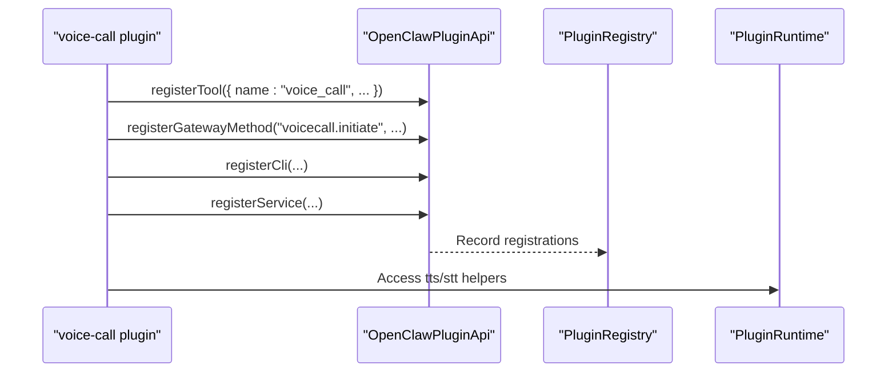

**Diagram sources**
- [extensions/voice-call/index.ts](file://extensions/voice-call/index.ts#L146-L543)
- [extensions/voice-call/openclaw.plugin.json](file://extensions/voice-call/openclaw.plugin.json#L1-L601)

**Section sources**
- [extensions/voice-call/index.ts](file://extensions/voice-call/index.ts#L1-L543)
- [extensions/voice-call/openclaw.plugin.json](file://extensions/voice-call/openclaw.plugin.json#L1-L601)

## Dependency Analysis
- Discovery depends on path scanning, boundary checks, and manifest parsing
- Loader depends on discovery, manifest registry, and JIT module loading
- Registry depends on typed plugin API and runtime environment
- CLI integration depends on registry’s CLI registrars
- SDK provides import aliases and subpaths for plugin authors

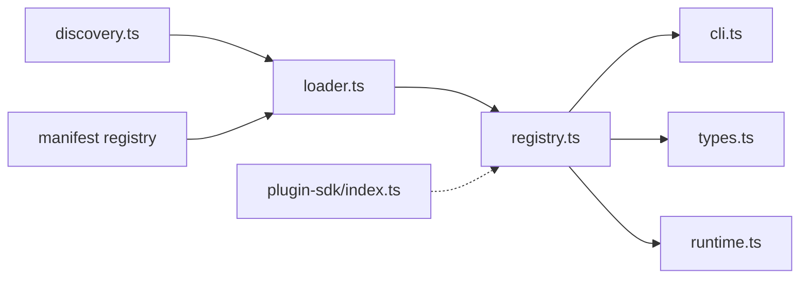

**Diagram sources**
- [src/plugins/discovery.ts](file://src/plugins/discovery.ts#L618-L711)
- [src/plugins/loader.ts](file://src/plugins/loader.ts#L447-L800)
- [src/plugins/registry.ts](file://src/plugins/registry.ts#L185-L624)
- [src/plugins/cli.ts](file://src/plugins/cli.ts#L11-L59)
- [src/plugin-sdk/index.ts](file://src/plugin-sdk/index.ts#L1-L812)

**Section sources**
- [src/plugins/discovery.ts](file://src/plugins/discovery.ts#L1-L712)
- [src/plugins/loader.ts](file://src/plugins/loader.ts#L1-L829)
- [src/plugins/registry.ts](file://src/plugins/registry.ts#L1-L625)
- [src/plugins/cli.ts](file://src/plugins/cli.ts#L1-L60)
- [src/plugin-sdk/index.ts](file://src/plugin-sdk/index.ts#L1-L812)

## Performance Considerations
- Discovery and manifest metadata use short in-process caches to reduce startup bursts
- Environment variables can disable caches or tune TTL windows
- Lazy initialization of runtime avoids loading heavy channel dependencies until needed

**Section sources**
- [docs/tools/plugin.md](file://docs/tools/plugin.md#L219-L227)
- [src/plugins/discovery.ts](file://src/plugins/discovery.ts#L36-L84)
- [src/plugins/loader.ts](file://src/plugins/loader.ts#L470-L502)

## Troubleshooting Guide
Common issues and resolutions:
- Missing or invalid manifest: ensure openclaw.plugin.json exists and contains a valid JSON schema
- Plugin not loading: verify allow/deny/slots configuration and that the plugin id is allowed
- Route overlap or auth mismatch: adjust path/match/auth or use replaceExisting appropriately
- CLI command conflicts: ensure plugin commands do not collide with existing ones
- Safety warnings: fix world-writable paths, ownership issues, or root escapes
- Config validation errors: align plugin config with the embedded JSON schema

**Section sources**
- [docs/plugins/manifest.md](file://docs/plugins/manifest.md#L53-L63)
- [src/plugins/registry.ts](file://src/plugins/registry.ts#L318-L400)
- [src/plugins/cli.ts](file://src/plugins/cli.ts#L26-L58)
- [src/plugins/discovery.ts](file://src/plugins/discovery.ts#L216-L251)

## Conclusion
OpenClaw’s plugin system is designed for safety, flexibility, and developer ergonomics. By validating manifests and configurations prior to code execution, enforcing strict policies, and providing a rich API surface, it enables powerful extensions while maintaining operational reliability. Following the guidelines and patterns outlined here will help you build robust plugins that integrate seamlessly with the platform.

## Appendices

### Plugin Development Guidelines
- Ship a manifest with a strict JSON schema for configuration
- Use SDK subpaths for imports and adhere to channel/provider boundaries
- Register tools, hooks, HTTP routes, CLI commands, services, and providers via the typed API
- Keep configuration minimal and document UI hints for better UX

**Section sources**
- [docs/plugins/manifest.md](file://docs/plugins/manifest.md#L1-L76)
- [docs/tools/plugin.md](file://docs/tools/plugin.md#L146-L186)
- [src/plugins/registry.ts](file://src/plugins/registry.ts#L263-L306)

### Tool Definition Schemas
- Tools can be factories or direct objects
- Parameters should be strongly typed and documented
- Optional tools allow graceful degradation when features are unavailable

**Section sources**
- [src/plugins/types.ts](file://src/plugins/types.ts#L75-L83)
- [src/plugins/registry.ts](file://src/plugins/registry.ts#L193-L218)

### Plugin Lifecycle Management
- Discovery → Manifest validation → JIT load → Registration → Activation
- Active registry is set globally for runtime access
- CLI commands are registered after loading completes

**Section sources**
- [src/plugins/loader.ts](file://src/plugins/loader.ts#L447-L800)
- [src/plugins/runtime.ts](file://src/plugins/runtime.ts#L25-L49)
- [src/plugins/cli.ts](file://src/plugins/cli.ts#L11-L59)

### Plugin Security Considerations
- Safety checks prevent world-writable paths, suspicious ownership, and root escapes
- Allow/deny/slots control which plugins are permitted
- Route overlap and auth mismatches are rejected
- Deprecated APIs are detected and warned

**Section sources**
- [src/plugins/discovery.ts](file://src/plugins/discovery.ts#L117-L251)
- [src/plugins/registry.ts](file://src/plugins/registry.ts#L318-L400)
- [src/plugins/loader.ts](file://src/plugins/loader.ts#L256-L284)