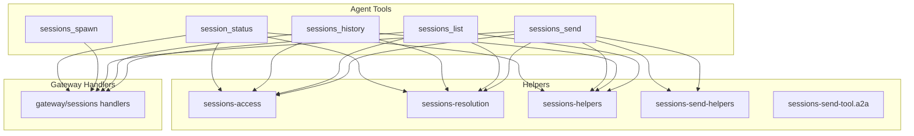
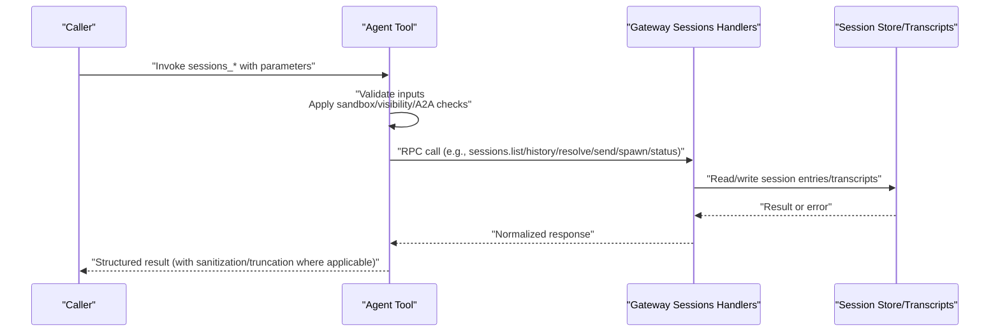
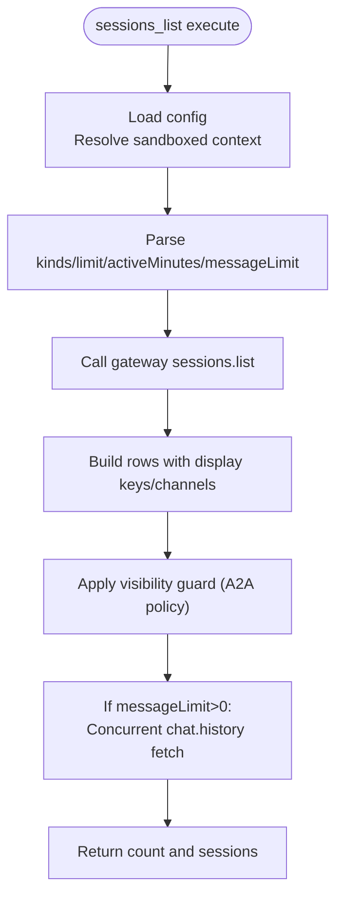
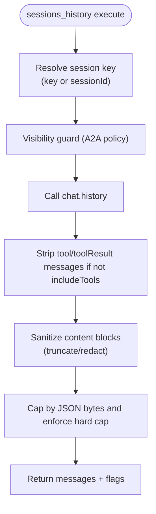
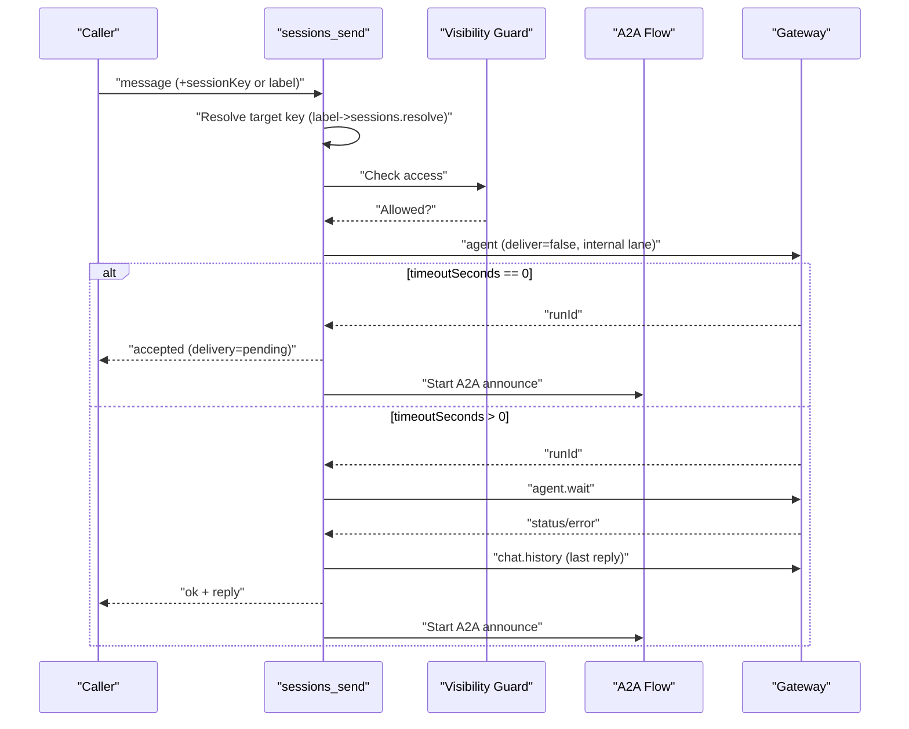
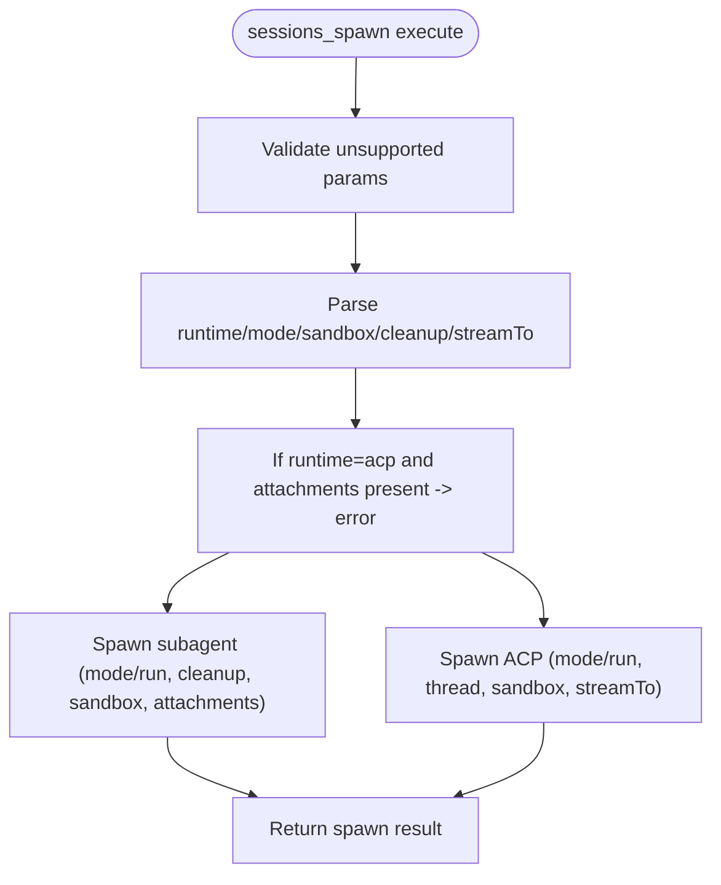
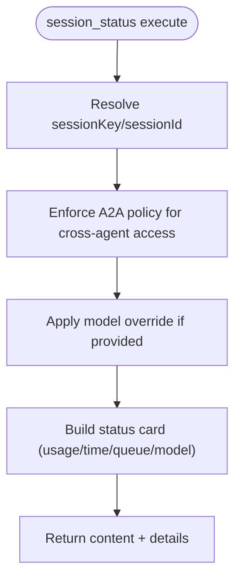
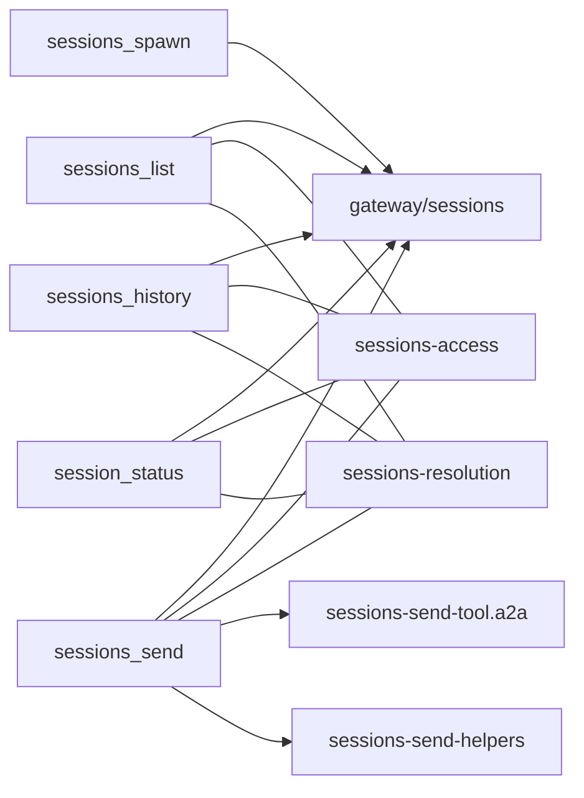

# Session Management

<cite>
**Referenced Files in This Document**
- [sessions-list-tool.ts](file://src/agents/tools/sessions-list-tool.ts)
- [sessions-history-tool.ts](file://src/agents/tools/sessions-history-tool.ts)
- [sessions-send-tool.ts](file://src/agents/tools/sessions-send-tool.ts)
- [sessions-spawn-tool.ts](file://src/agents/tools/sessions-spawn-tool.ts)
- [session-status-tool.ts](file://src/agents/tools/session-status-tool.ts)
- [sessions-helpers.ts](file://src/agents/tools/sessions-helpers.ts)
- [sessions-access.ts](file://src/agents/tools/sessions-access.ts)
- [sessions-resolution.ts](file://src/agents/tools/sessions-resolution.ts)
- [sessions-send-helpers.ts](file://src/agents/tools/sessions-send-helpers.ts)
- [sessions-send-tool.a2a.ts](file://src/agents/tools/sessions-send-tool.a2a.ts)
- [sessions.ts](file://src/gateway/server-methods/sessions.ts)
</cite>

## Table of Contents
1. [Introduction](#introduction)
2. [Project Structure](#project-structure)
3. [Core Components](#core-components)
4. [Architecture Overview](#architecture-overview)
5. [Detailed Component Analysis](#detailed-component-analysis)
6. [Dependency Analysis](#dependency-analysis)
7. [Performance Considerations](#performance-considerations)
8. [Troubleshooting Guide](#troubleshooting-guide)
9. [Conclusion](#conclusion)

## Introduction
This document explains OpenClaw’s session management capabilities centered around five tools:
- sessions_list: discover and filter sessions, optionally fetch recent messages
- sessions_history: inspect a session’s message history with sanitization and limits
- sessions_send: inter-session communication with agent-to-agent (A2A) announcement and optional reply ping-pong
- sessions_spawn: spawn isolated subagents or ACP sessions with one-shot or persistent modes
- session_status: view a session’s status card and optionally override model selection

It covers session discovery, transcript inspection, inter-session communication, subagent spawning, targeting controls, visibility restrictions, sandbox considerations, attachment handling, and lifecycle management. Practical orchestration patterns and troubleshooting guidance are included.

## Project Structure
OpenClaw organizes session tools under agents/tools and delegates storage and lifecycle operations to the gateway server methods. The tools validate inputs, enforce visibility and sandbox policies, and call gateway RPCs to operate on session stores and transcripts.

**Diagram sources**
- [sessions-list-tool.ts](file://src/agents/tools/sessions-list-tool.ts#L1-L259)
- [sessions-history-tool.ts](file://src/agents/tools/sessions-history-tool.ts#L1-L271)
- [sessions-send-tool.ts](file://src/agents/tools/sessions-send-tool.ts#L1-L362)
- [sessions-spawn-tool.ts](file://src/agents/tools/sessions-spawn-tool.ts#L1-L198)
- [session-status-tool.ts](file://src/agents/tools/session-status-tool.ts#L1-L399)
- [sessions-helpers.ts](file://src/agents/tools/sessions-helpers.ts#L1-L172)
- [sessions-access.ts](file://src/agents/tools/sessions-access.ts#L1-L241)
- [sessions-resolution.ts](file://src/agents/tools/sessions-resolution.ts#L1-L330)
- [sessions-send-helpers.ts](file://src/agents/tools/sessions-send-helpers.ts#L1-L167)
- [sessions-send-tool.a2a.ts](file://src/agents/tools/sessions-send-tool.a2a.ts#L1-L150)
- [sessions.ts](file://src/gateway/server-methods/sessions.ts#L331-L755)

**Section sources**
- [sessions-list-tool.ts](file://src/agents/tools/sessions-list-tool.ts#L1-L259)
- [sessions-history-tool.ts](file://src/agents/tools/sessions-history-tool.ts#L1-L271)
- [sessions-send-tool.ts](file://src/agents/tools/sessions-send-tool.ts#L1-L362)
- [sessions-spawn-tool.ts](file://src/agents/tools/sessions-spawn-tool.ts#L1-L198)
- [session-status-tool.ts](file://src/agents/tools/session-status-tool.ts#L1-L399)
- [sessions.ts](file://src/gateway/server-methods/sessions.ts#L331-L755)

## Core Components
- sessions_list: Lists sessions with filters (kinds, limit, active minutes), optional last N messages, and derives display keys and channels. Honors sandbox visibility and spawns restrictions.
- sessions_history: Fetches a session’s history, strips tool messages by default, sanitizes content, enforces size caps, and truncates sensitive or large fields.
- sessions_send: Sends a message into another session. Supports label-based targeting with agent-to-agent policy checks, sandbox-aware visibility, and A2A announcement with optional ping-pong replies.
- sessions_spawn: Spawns isolated runtime sessions (subagent or ACP). Supports one-shot and persistent modes, sandbox inheritance/requirement, optional thread binding, and inline attachments for subagent mode.
- session_status: Builds a status card including usage, time, and queue metrics; optionally sets a per-session model override and enforces agent-to-agent policy for cross-agent access.

**Section sources**
- [sessions-list-tool.ts](file://src/agents/tools/sessions-list-tool.ts#L26-L98)
- [sessions-history-tool.ts](file://src/agents/tools/sessions-history-tool.ts#L20-L45)
- [sessions-send-tool.ts](file://src/agents/tools/sessions-send-tool.ts#L27-L61)
- [sessions-spawn-tool.ts](file://src/agents/tools/sessions-spawn-tool.ts#L23-L60)
- [session-status-tool.ts](file://src/agents/tools/session-status-tool.ts#L45-L48)

## Architecture Overview
The tools call gateway RPCs to list, resolve, read, and mutate sessions. Visibility and sandbox policies gate access. A2A flows for sessions_send include announcement and optional ping-pong replies.

**Diagram sources**
- [sessions-list-tool.ts](file://src/agents/tools/sessions-list-tool.ts#L79-L88)
- [sessions-history-tool.ts](file://src/agents/tools/sessions-history-tool.ts#L240-L243)
- [sessions-send-tool.ts](file://src/agents/tools/sessions-send-tool.ts#L283-L300)
- [sessions-spawn-tool.ts](file://src/agents/tools/sessions-spawn-tool.ts#L138-L158)
- [session-status-tool.ts](file://src/agents/tools/session-status-tool.ts#L185-L195)
- [sessions.ts](file://src/gateway/server-methods/sessions.ts#L331-L755)

## Detailed Component Analysis

### sessions_list
- Purpose: Discover sessions with optional filters and fetch recent messages.
- Key behaviors:
  - Filters: kinds, limit, activeMinutes; messageLimit capped at 20.
  - Visibility: Respects tools.sessions.visibility and sandbox restrictions; restrictToSpawned may limit to spawned sessions.
  - A2A policy: Enforced via visibility guard.
  - Last messages: Optional concurrent fetch via chat.history with tool messages stripped.
  - Display key normalization and channel derivation.
- Sandboxing: restrictToSpawned enforced; global/main visibility gated by sandbox policy.
- Complexity: O(N) for listing plus optional O(M) for concurrent history fetches up to a bounded worker pool.

**Diagram sources**
- [sessions-list-tool.ts](file://src/agents/tools/sessions-list-tool.ts#L42-L98)
- [sessions-list-tool.ts](file://src/agents/tools/sessions-list-tool.ts#L228-L250)

**Section sources**
- [sessions-list-tool.ts](file://src/agents/tools/sessions-list-tool.ts#L26-L98)
- [sessions-list-tool.ts](file://src/agents/tools/sessions-list-tool.ts#L102-L133)
- [sessions-list-tool.ts](file://src/agents/tools/sessions-list-tool.ts#L228-L250)

### sessions_history
- Purpose: Inspect a session’s message history safely.
- Key behaviors:
  - Resolves target session key (by key or sessionId) with sandbox visibility checks.
  - Strips tool messages unless includeTools is true.
  - Sanitizes content blocks (truncates text, redacts sensitive info, removes large fields).
  - Enforces JSON byte caps and a hard cap to protect downstream consumers.
- Security: Content redaction and truncation prevent sensitive data exposure.

**Diagram sources**
- [sessions-history-tool.ts](file://src/agents/tools/sessions-history-tool.ts#L178-L233)
- [sessions-history-tool.ts](file://src/agents/tools/sessions-history-tool.ts#L246-L267)

**Section sources**
- [sessions-history-tool.ts](file://src/agents/tools/sessions-history-tool.ts#L20-L45)
- [sessions-history-tool.ts](file://src/agents/tools/sessions-history-tool.ts#L169-L233)
- [sessions-history-tool.ts](file://src/agents/tools/sessions-history-tool.ts#L246-L267)

### sessions_send
- Purpose: Send a message into another session with optional label-based targeting and A2A announcement.
- Key behaviors:
  - Targeting: sessionKey or label; label requires requester agentId and optional agentId; sandbox restricts label lookup to requester’s agent.
  - A2A policy: Enabled and allowed by tools.agentToAgent; enforced for cross-agent sends.
  - Delivery: Non-blocking accept (timeoutSeconds=0) returns “accepted” with “pending” delivery; otherwise waits for agent.wait and returns “ok” with reply text.
  - Announcement: After initial send, runs A2A flow to optionally ping-pong replies and post an announcement to the target’s channel.
- Sandbox and visibility: Visibility guard prevents unauthorized access; restrictToSpawned may disallow resolving targets outside spawned scope.

**Diagram sources**
- [sessions-send-tool.ts](file://src/agents/tools/sessions-send-tool.ts#L46-L151)
- [sessions-send-tool.ts](file://src/agents/tools/sessions-send-tool.ts#L239-L251)
- [sessions-send-tool.a2a.ts](file://src/agents/tools/sessions-send-tool.a2a.ts#L18-L52)
- [sessions-send-helpers.ts](file://src/agents/tools/sessions-send-helpers.ts#L73-L89)

**Section sources**
- [sessions-send-tool.ts](file://src/agents/tools/sessions-send-tool.ts#L27-L105)
- [sessions-send-tool.ts](file://src/agents/tools/sessions-send-tool.ts#L160-L213)
- [sessions-send-tool.ts](file://src/agents/tools/sessions-send-tool.ts#L239-L358)
- [sessions-send-tool.a2a.ts](file://src/agents/tools/sessions-send-tool.a2a.ts#L18-L120)
- [sessions-send-helpers.ts](file://src/agents/tools/sessions-send-helpers.ts#L20-L89)

### sessions_spawn
- Purpose: Spawn isolated sessions (subagent or ACP) with one-shot or persistent modes.
- Key behaviors:
  - Runtime selection: runtime=subagent or runtime=acp.
  - One-shot vs persistent: mode=run (one-shot) or mode=session (persistent/thread-bound).
  - Sandbox: sandbox=inherit or sandbox=require; inherit follows parent sandbox policy.
  - Attachments: supported for subagent mode; ACP runtime currently does not support inline attachments.
  - Cleanup: cleanup=keep or cleanup=delete for subagent artifacts.
  - Streaming: streamTo=parent supported only for ACP runtime.
  - Unsupported parameters: target/transport/channel/to/threadId/replyTo are intentionally rejected to avoid confusion with channel delivery.
- Lifecycle: Delegates to spawnSubagentDirect or spawnAcpDirect with appropriate options.

**Diagram sources**
- [sessions-spawn-tool.ts](file://src/agents/tools/sessions-spawn-tool.ts#L82-L89)
- [sessions-spawn-tool.ts](file://src/agents/tools/sessions-spawn-tool.ts#L130-L137)
- [sessions-spawn-tool.ts](file://src/agents/tools/sessions-spawn-tool.ts#L161-L192)

**Section sources**
- [sessions-spawn-tool.ts](file://src/agents/tools/sessions-spawn-tool.ts#L23-L60)
- [sessions-spawn-tool.ts](file://src/agents/tools/sessions-spawn-tool.ts#L130-L137)
- [sessions-spawn-tool.ts](file://src/agents/tools/sessions-spawn-tool.ts#L161-L192)

### session_status
- Purpose: Render a status card for a session and optionally set a per-session model override.
- Key behaviors:
  - Resolution: Accepts sessionKey or sessionId; supports alias/main resolution and cross-agent access via A2A policy.
  - Model override: Optional model parameter supports default/reset semantics and validates against allowed models.
  - Status card: Includes usage summary, time, queue depth/overrides, and model auth label.
  - Cross-agent gating: Requires tools.agentToAgent.enabled and allow rules.

**Diagram sources**
- [session-status-tool.ts](file://src/agents/tools/session-status-tool.ts#L191-L254)
- [session-status-tool.ts](file://src/agents/tools/session-status-tool.ts#L264-L295)
- [session-status-tool.ts](file://src/agents/tools/session-status-tool.ts#L357-L385)

**Section sources**
- [session-status-tool.ts](file://src/agents/tools/session-status-tool.ts#L45-L48)
- [session-status-tool.ts](file://src/agents/tools/session-status-tool.ts#L191-L254)
- [session-status-tool.ts](file://src/agents/tools/session-status-tool.ts#L264-L295)
- [session-status-tool.ts](file://src/agents/tools/session-status-tool.ts#L357-L385)

## Dependency Analysis
- Tool-to-gateway dependencies:
  - sessions_list → sessions.list, chat.history
  - sessions_history → chat.history
  - sessions_send → agent, agent.wait, sessions.resolve, send (via A2A)
  - sessions_spawn → spawnSubagentDirect/spawnAcpDirect
  - session_status → session store reads, provider usage APIs
- Visibility and policy enforcement:
  - All tools rely on sessions-access for visibility and A2A policy.
  - sessions-resolution provides key normalization, display keys, and sandbox-aware resolution.

**Diagram sources**
- [sessions-list-tool.ts](file://src/agents/tools/sessions-list-tool.ts#L79-L88)
- [sessions-history-tool.ts](file://src/agents/tools/sessions-history-tool.ts#L240-L243)
- [sessions-send-tool.ts](file://src/agents/tools/sessions-send-tool.ts#L114-L151)
- [sessions-spawn-tool.ts](file://src/agents/tools/sessions-spawn-tool.ts#L138-L158)
- [session-status-tool.ts](file://src/agents/tools/session-status-tool.ts#L185-L195)
- [sessions-access.ts](file://src/agents/tools/sessions-access.ts#L174-L240)
- [sessions-resolution.ts](file://src/agents/tools/sessions-resolution.ts#L260-L300)
- [sessions-send-tool.a2a.ts](file://src/agents/tools/sessions-send-tool.a2a.ts#L18-L52)
- [sessions-send-helpers.ts](file://src/agents/tools/sessions-send-helpers.ts#L73-L89)
- [sessions.ts](file://src/gateway/server-methods/sessions.ts#L331-L755)

**Section sources**
- [sessions-access.ts](file://src/agents/tools/sessions-access.ts#L90-L124)
- [sessions-resolution.ts](file://src/agents/tools/sessions-resolution.ts#L35-L62)
- [sessions.ts](file://src/gateway/server-methods/sessions.ts#L331-L755)

## Performance Considerations
- sessions_list:
  - Concurrent history fetching is bounded by a small worker pool to avoid overwhelming the gateway.
  - messageLimit is capped to reduce payload sizes.
- sessions_history:
  - Enforces JSON byte caps and a hard cap to prevent memory pressure and slow serialization.
  - Truncates large content blocks and redacts sensitive data to minimize risk and overhead.
- sessions_send:
  - Non-blocking accept (timeoutSeconds=0) avoids long waits; A2A announce runs asynchronously.
  - Ping-pong turns are limited to reduce back-and-forth overhead.
- sessions_spawn:
  - Subagent attachments are validated and limited; ACP runtime avoids heavy attachment handling.
- session_status:
  - Provider usage queries are time-bounded; queue depth and group activation are computed efficiently.

[No sources needed since this section provides general guidance]

## Troubleshooting Guide
- sessions_list
  - Empty results: Verify kinds, limit, activeMinutes, and messageLimit constraints; sandbox restrictToSpawned may hide sessions.
- sessions_history
  - Truncated or missing content: Adjust includeTools and limit; content may be truncated or hard-capped.
  - Access denied: Confirm sessionKey correctness and visibility; A2A policy may block cross-agent access.
- sessions_send
  - timeoutSeconds=0 returns accepted/pending: Expect A2A announce to post later; check announce flow logs.
  - timeoutSeconds>0 returns timeout/error: Check target availability, model compatibility, and channel permissions.
  - Label targeting fails: Ensure tools.agentToAgent is enabled and allow patterns permit requester/target agent IDs; sandbox restricts label lookup to requester’s agent.
- sessions_spawn
  - Unsupported parameters: Remove target/transport/channel/to/threadId/replyTo; use message/sessions_send for channel delivery.
  - runtime=acp with attachments: Not supported; switch to subagent or remove attachments.
  - Cleanup and mounts: Confirm cleanup behavior and attach mount path for subagent mode.
- session_status
  - Cross-agent access denied: Enable tools.agentToAgent and configure allow patterns.
  - Model override invalid: Ensure model is recognized and allowed; use “default” to reset.

**Section sources**
- [sessions-list-tool.ts](file://src/agents/tools/sessions-list-tool.ts#L409-L411)
- [sessions-history-tool.ts](file://src/agents/tools/sessions-history-tool.ts#L415-L418)
- [sessions-send-tool.ts](file://src/agents/tools/sessions-send-tool.ts#L81-L87)
- [sessions-send-tool.ts](file://src/agents/tools/sessions-send-tool.ts#L90-L104)
- [sessions-spawn-tool.ts](file://src/agents/tools/sessions-spawn-tool.ts#L82-L89)
- [sessions-spawn-tool.ts](file://src/agents/tools/sessions-spawn-tool.ts#L131-L137)
- [session-status-tool.ts](file://src/agents/tools/session-status-tool.ts#L205-L212)
- [session-status-tool.ts](file://src/agents/tools/session-status-tool.ts#L158-L164)

## Conclusion
OpenClaw’s session management tools provide robust session discovery, safe transcript inspection, secure inter-session communication with A2A safeguards, and flexible spawning of isolated subagents or ACP sessions. Visibility and sandbox controls ensure safe multi-agent environments, while built-in sanitization, truncation, and caps protect performance and privacy. Use the orchestration patterns and troubleshooting tips to reliably manage sessions across agents and channels.