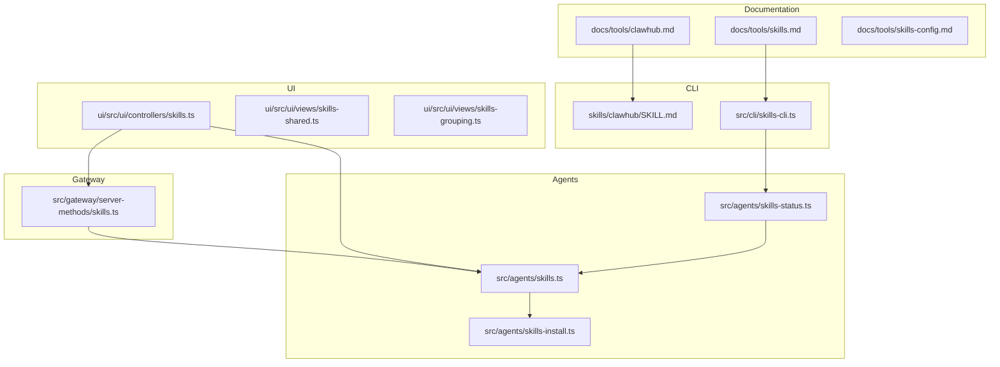
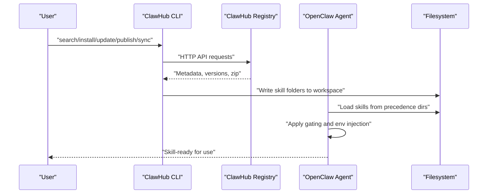
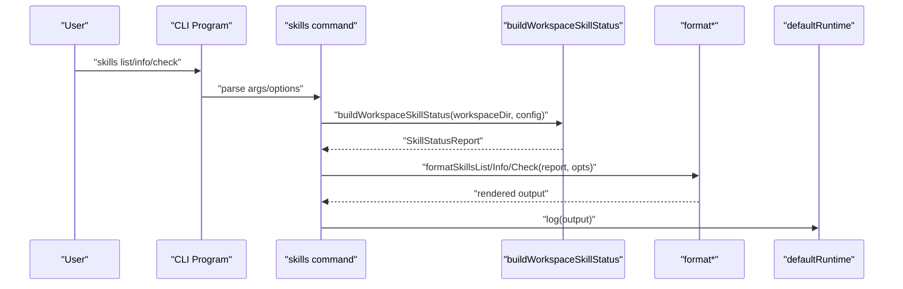
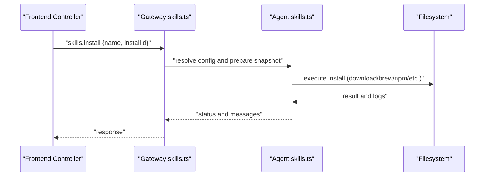
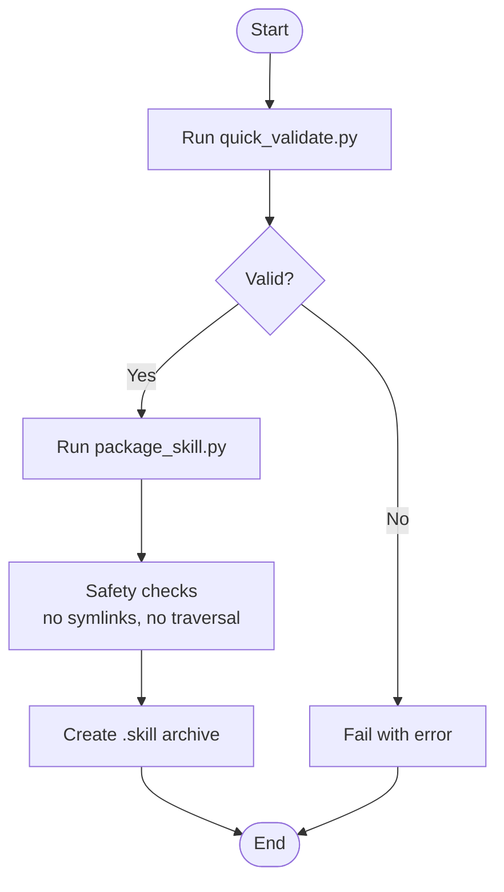
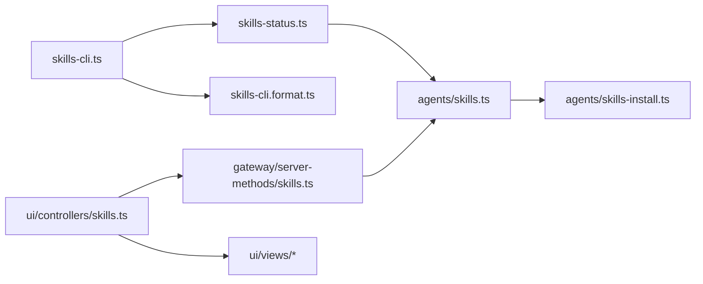

# ClawHub Platform

<cite>
**Referenced Files in This Document**
- [SKILL.md](file://skills/clawhub/SKILL.md)
- [clawhub.md](file://docs/tools/clawhub.md)
- [skills.md](file://docs/tools/skills.md)
- [skills-config.md](file://docs/tools/skills-config.md)
- [skills-cli.ts](file://src/cli/skills-cli.ts)
- [skills-cli.commands.test.ts](file://src/cli/skills-cli.commands.test.ts)
- [skills.ts](file://src/gateway/server-methods/skills.ts)
- [skills.ts](file://src/agents/skills.ts)
- [skills-install.ts](file://src/agents/skills-install.ts)
- [skills-status.ts](file://src/agents/skills-status.ts)
- [skills.ts（前端控制器）](file://ui/src/ui/controllers/skills.ts)
- [skills-shared.ts](file://ui/src/ui/views/skills-shared.ts)
- [skills-grouping.ts](file://ui/src/ui/views/skills-grouping.ts)
- [技能平台.md](file://docs-zh/项目概述/核心功能/工具和技能系统/技能平台/技能平台.md)
- [技能打包和分发.md](file://docs-zh/工具和技能/技能开发/技能打包和分发.md)
- [quick_validate.py](file://skills/skill-creator/scripts/quick_validate.py)
- [package_skill.py](file://skills/skill-creator/scripts/package_skill.py)
- [init_skill.py](file://skills/skill-creator/scripts/init_skill.py)
- [label-open-issues.ts](file://scripts/label-open-issues.ts)
</cite>

## Table of Contents
1. [Introduction](#introduction)
2. [Project Structure](#project-structure)
3. [Core Components](#core-components)
4. [Architecture Overview](#architecture-overview)
5. [Detailed Component Analysis](#detailed-component-analysis)
6. [Dependency Analysis](#dependency-analysis)
7. [Performance Considerations](#performance-considerations)
8. [Troubleshooting Guide](#troubleshooting-guide)
9. [Conclusion](#conclusion)
10. [Appendices](#appendices)

## Introduction
This document describes the ClawHub skills registry and distribution platform for OpenClaw. It explains how to use the ClawHub CLI to search, install, update, list, publish, and sync skills; how skills are discovered, categorized, and rated; and how the skill submission workflow, quality standards, and moderation processes operate. It also covers practical operations for agents and workspaces, including managing skill collections across multiple agents and workspaces.

## Project Structure
The ClawHub platform spans documentation, CLI commands, agent-side skill loading, and UI integration:
- Documentation: ClawHub guide and skills system reference
- CLI: skills list/info/check commands and ClawHub CLI usage
- Agents: skills status, install/update, and load precedence
- UI: skills controller and views for installation and status
- Packaging and validation: scripts for validating and packaging skills

**Diagram sources**
- [clawhub.md](file://docs/tools/clawhub.md#L1-L258)
- [skills.md](file://docs/tools/skills.md#L1-L303)
- [skills-config.md](file://docs/tools/skills-config.md#L1-L78)
- [skills-cli.ts](file://src/cli/skills-cli.ts#L1-L82)
- [SKILL.md](file://skills/clawhub/SKILL.md#L1-L78)
- [skills-status.ts](file://src/agents/skills-status.ts)
- [skills.ts](file://src/agents/skills.ts)
- [skills-install.ts](file://src/agents/skills-install.ts)
- [skills.ts](file://src/gateway/server-methods/skills.ts)
- [skills.ts（前端控制器）](file://ui/src/ui/controllers/skills.ts#L39-L157)
- [skills-shared.ts](file://ui/src/ui/views/skills-shared.ts#L1-L52)
- [skills-grouping.ts](file://ui/src/ui/views/skills-grouping.ts#L1-L40)

**Section sources**
- [clawhub.md](file://docs/tools/clawhub.md#L1-L258)
- [skills.md](file://docs/tools/skills.md#L1-L303)
- [skills-cli.ts](file://src/cli/skills-cli.ts#L1-L82)

## Core Components
- ClawHub CLI: Provides commands to search, install, update, list, publish, and sync skills; supports environment overrides and non-interactive operation.
- Skills system: Defines locations and precedence, gating rules, and configuration overrides; integrates with workspace and managed skill directories.
- Agent skill status and install: Builds workspace skill status, exposes install/update flows, and applies gating and environment injection.
- UI controller and views: Presents skills status, grouping, and installation actions to users.
- Packaging and validation: Scripts to validate and package skills for distribution.

**Section sources**
- [clawhub.md](file://docs/tools/clawhub.md#L118-L258)
- [skills.md](file://docs/tools/skills.md#L13-L296)
- [skills-cli.ts](file://src/cli/skills-cli.ts#L1-L82)
- [skills.ts（前端控制器）](file://ui/src/ui/controllers/skills.ts#L39-L157)

## Architecture Overview
The ClawHub platform integrates a public registry with OpenClaw’s agent skill system. Users search and install skills via the CLI or UI; skills are stored in the registry and loaded locally according to precedence and gating rules. Publishing and syncing back up local skills to the registry are supported.

**Diagram sources**
- [clawhub.md](file://docs/tools/clawhub.md#L118-L258)
- [skills.md](file://docs/tools/skills.md#L13-L296)

## Detailed Component Analysis

### ClawHub CLI Commands
The ClawHub CLI enables:
- Authentication: login, logout, whoami
- Discovery: search with limit
- Installation: install with optional version and force overwrite
- Updates: update single or all skills, with version and force
- Listing: list installed skills via lockfile
- Publishing: publish a skill with slug, name, version, changelog, and tags
- Syncing: scan local roots, publish new/updated skills, dry-run, bump, concurrency, and tags

Operational defaults and environment overrides:
- Default registry and site URLs
- Workdir and skills directory resolution
- Non-interactive mode and telemetry controls

Common workflows:
- Search for skills, install, update all, and sync backups

**Section sources**
- [clawhub.md](file://docs/tools/clawhub.md#L118-L258)
- [SKILL.md](file://skills/clawhub/SKILL.md#L1-L78)

### Skills Discovery, Categorization, and Ratings
Discovery and categorization:
- Public browsing and search powered by embeddings (vector search)
- Metadata indexing for tags and usage signals
- Stars and comments for community feedback

Ratings and ranking:
- Usage signals (stars, downloads) improve ranking and visibility
- Moderation hooks for approvals and audits

Security and moderation:
- Anyone can publish with a minimum account age requirement
- Reporting and auto-hiding thresholds; moderators can act on hidden items

**Section sources**
- [clawhub.md](file://docs/tools/clawhub.md#L90-L117)

### Skill Submission Workflow, Quality Standards, and Moderation
Submission workflow:
- Prepare a skill directory with a SKILL.md and optional resources
- Validate and package the skill
- Publish or sync to the registry

Quality standards:
- SKILL.md frontmatter must include required fields and follow format constraints
- Validation enforces naming, length limits, and safe content
- Packaging prevents path traversal and symbolic links

Moderation:
- Reporting and auto-hiding policies
- Moderator actions: hide/unhide/delete/ban
- Abuse penalties for misuse of reporting

**Section sources**
- [skills.md](file://docs/tools/skills.md#L78-L187)
- [quick_validate.py](file://skills/skill-creator/scripts/quick_validate.py#L136-L159)
- [package_skill.py](file://skills/skill-creator/scripts/package_skill.py#L28-L112)
- [clawhub.md](file://docs/tools/clawhub.md#L100-L117)

### Managing Skill Collections Across Agents and Workspaces
Locations and precedence:
- Bundled skills (lowest precedence)
- Managed/local skills (~/.openclaw/skills)
- Workspace skills (<workspace>/skills, highest precedence)

Per-agent vs shared:
- Per-agent skills in each workspace
- Shared skills via managed/local and extraDirs

Gating and environment:
- Load-time filtering by metadata (bins, env, config, OS)
- Env and apiKey injection scoped to agent runs
- Sandboxed environments require explicit setup

Session snapshot and watcher:
- Eligible skills snapshot taken at session start
- Watcher refreshes mid-session on changes

**Section sources**
- [skills.md](file://docs/tools/skills.md#L13-L296)
- [skills-config.md](file://docs/tools/skills-config.md#L1-L78)

### Agent Skills Status and CLI Integration
The skills CLI registers list/info/check commands and delegates to the agent skills status builder. It resolves workspace directories, builds a status report, and renders formatted output.

**Diagram sources**
- [skills-cli.ts](file://src/cli/skills-cli.ts#L20-L81)
- [skills-cli.commands.test.ts](file://src/cli/skills-cli.commands.test.ts#L47-L124)

**Section sources**
- [skills-cli.ts](file://src/cli/skills-cli.ts#L1-L82)
- [skills-cli.commands.test.ts](file://src/cli/skills-cli.commands.test.ts#L1-L125)

### Gateway and Agent Skill Lifecycle
Gateway server methods:
- skills.status: builds a comprehensive status report
- skills.install: executes installation based on installId
- skills.update: updates skill entries and persists configuration

Agent layer:
- Skills module orchestrates loading, gating, and environment injection
- Skills install module handles multiple installer types and safety checks

**Diagram sources**
- [skills.ts（前端控制器）](file://ui/src/ui/controllers/skills.ts#L39-L157)
- [skills.ts](file://src/gateway/server-methods/skills.ts#L57-L204)
- [skills.ts](file://src/agents/skills.ts)
- [skills-install.ts](file://src/agents/skills-install.ts#L392-L471)

**Section sources**
- [skills.ts](file://src/gateway/server-methods/skills.ts#L57-L204)
- [skills.ts](file://src/agents/skills.ts)
- [skills-install.ts](file://src/agents/skills-install.ts#L392-L471)

### Packaging and Distribution Pipeline
The packaging pipeline validates SKILL.md, packages the skill into a .skill file, and ensures safety against path traversal and symbolic links. The distribution pipeline supports installers and environment injection.

**Diagram sources**
- [quick_validate.py](file://skills/skill-creator/scripts/quick_validate.py#L136-L159)
- [package_skill.py](file://skills/skill-creator/scripts/package_skill.py#L28-L112)

**Section sources**
- [技能打包和分发.md](file://docs-zh/工具和技能/技能开发/技能打包和分发.md#L86-L123)
- [quick_validate.py](file://skills/skill-creator/scripts/quick_validate.py#L136-L159)
- [package_skill.py](file://skills/skill-creator/scripts/package_skill.py#L28-L112)

## Dependency Analysis
The skills system composes multiple layers with clear boundaries:
- CLI depends on agent skills status and formatting utilities
- Agent skills status depends on configuration and workspace resolution
- Gateway server methods depend on agent skills and filesystem operations
- UI depends on gateway methods and view utilities

**Diagram sources**
- [skills-cli.ts](file://src/cli/skills-cli.ts#L1-L82)
- [skills-status.ts](file://src/agents/skills-status.ts)
- [skills.ts](file://src/agents/skills.ts)
- [skills-install.ts](file://src/agents/skills-install.ts)
- [skills.ts](file://src/gateway/server-methods/skills.ts)
- [skills.ts（前端控制器）](file://ui/src/ui/controllers/skills.ts#L39-L157)
- [skills-shared.ts](file://ui/src/ui/views/skills-shared.ts#L1-L52)
- [skills-grouping.ts](file://ui/src/ui/views/skills-grouping.ts#L1-L40)

**Section sources**
- [skills-cli.ts](file://src/cli/skills-cli.ts#L1-L82)
- [skills.ts](file://src/gateway/server-methods/skills.ts#L57-L204)
- [skills.ts](file://src/agents/skills.ts)

## Performance Considerations
- Skills snapshot caching: eligible skills are cached per session to reduce repeated computation
- Watcher debouncing: configurable debounce reduces churn during frequent file changes
- Prompt token impact: skills list adds deterministic overhead to prompts; keep SKILL.md concise

**Section sources**
- [skills.md](file://docs/tools/skills.md#L242-L286)
- [skills-config.md](file://docs/tools/skills-config.md#L17-L21)

## Troubleshooting Guide
Common issues and resolutions:
- Authentication failures: ensure login succeeded and tokens are stored; override config path if needed
- Installation conflicts: use force flag for overwrite when local files differ from published versions
- Workspace not picking up skills: ensure skills are placed under the workspace skills directory; session snapshot takes effect on next session
- Sandboxed environments: install required binaries inside the sandbox or configure setup commands
- Excessive reports or moderation actions: review reporting thresholds and moderation policies

Environment variables and flags:
- Override site, registry, workdir, and telemetry settings as needed

**Section sources**
- [clawhub.md](file://docs/tools/clawhub.md#L120-L258)
- [skills.md](file://docs/tools/skills.md#L69-L187)

## Conclusion
ClawHub provides a robust, open skills registry integrated with OpenClaw’s agent system. Users can discover, install, update, and publish skills with the CLI and UI, while the platform enforces quality and moderation standards. The skills system’s precedence, gating, and configuration enable flexible deployment across agents and workspaces, with performance-conscious snapshotting and watcher mechanisms.

## Appendices

### Appendix A: CLI Command Reference
- Global options: workdir, dir, site, registry, no-input, cli-version
- Auth: login, logout, whoami
- Search: search with limit
- Install: install with version and force
- Update: update single or all, with version and force
- List: list via lockfile
- Publish: publish with slug, name, version, changelog, tags
- Sync: sync with roots, all, dry-run, bump, changelog, tags, concurrency

**Section sources**
- [clawhub.md](file://docs/tools/clawhub.md#L118-L258)

### Appendix B: Skill Submission Checklist
- Validate SKILL.md with quick_validate.py
- Package skill with package_skill.py
- Publish or sync to registry
- Monitor ratings and reports

**Section sources**
- [quick_validate.py](file://skills/skill-creator/scripts/quick_validate.py#L136-L159)
- [package_skill.py](file://skills/skill-creator/scripts/package_skill.py#L28-L112)
- [clawhub.md](file://docs/tools/clawhub.md#L100-L117)

### Appendix C: Multi-Agent and Workspace Management Tips
- Place per-agent skills in each workspace’s skills directory
- Use managed/local skills for shared capabilities
- Configure extraDirs for cross-agent shared packs
- Apply gating and environment injection per skill

**Section sources**
- [skills.md](file://docs/tools/skills.md#L28-L296)
- [skills-config.md](file://docs/tools/skills-config.md#L13-L78)