# Common Skill Patterns & Examples

<cite>
**Referenced Files in This Document**
- [creating-skills.md](file://docs/tools/creating-skills.md)
- [skills.md](file://docs/tools/skills.md)
- [pdf/SKILL.md](file://skills/pdf/SKILL.md)
- [video-frames/SKILL.md](file://skills/video-frames/SKILL.md)
- [openai-image-gen/SKILL.md](file://skills/openai-image-gen/SKILL.md)
- [nano-banana-pro/SKILL.md](file://skills/nano-banana-pro/SKILL.md)
- [lobster/SKILL.md](file://extensions/lobster/SKILL.md)
- [memory-lancedb/index.ts](file://extensions/memory-lancedb/index.ts)
- [google-gemini-cli-auth/oauth.ts](file://extensions/google-gemini-cli-auth/oauth.ts)
- [discord/index.ts](file://extensions/discord/index.ts)
- [telegram/index.ts](file://extensions/telegram/index.ts)
- [skill-creator/SKILL.md](file://skills/skill-creator/SKILL.md)
- [skill-creator/scripts/init_skill.py](file://skills/skill-creator/scripts/init_skill.py)
</cite>

## Table of Contents
1. [Introduction](#introduction)
2. [Project Structure](#project-structure)
3. [Core Components](#core-components)
4. [Architecture Overview](#architecture-overview)
5. [Detailed Component Analysis](#detailed-component-analysis)
6. [Dependency Analysis](#dependency-analysis)
7. [Performance Considerations](#performance-considerations)
8. [Troubleshooting Guide](#troubleshooting-guide)
9. [Conclusion](#conclusion)
10. [Appendices](#appendices)

## Introduction
This document presents common skill development patterns in OpenClaw, with practical examples drawn from real skills and extensions. It focuses on typical use cases such as API integrations, file processing, media manipulation, and automation tasks. You will find step-by-step tutorials for creating popular skill types, reusable components, and best practices for error handling, resource management, and user interaction patterns.

## Project Structure
OpenClaw organizes capabilities primarily through:
- Skills: directories with a SKILL.md and optional bundled resources (scripts, references, assets)
- Extensions: plugins that add channels, tools, and services
- Built-in skills and curated examples under skills/

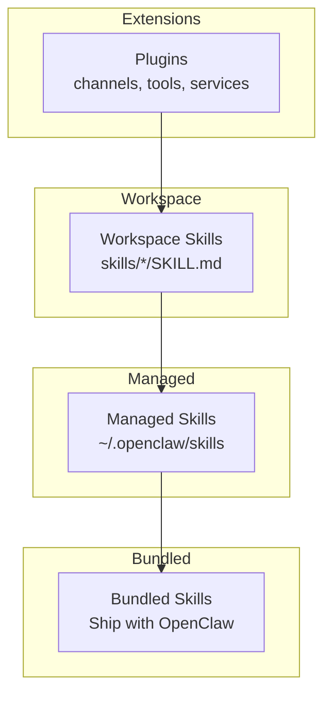

**Diagram sources**
- [skills.md](file://docs/tools/skills.md#L13-L48)

**Section sources**
- [skills.md](file://docs/tools/skills.md#L13-L48)

## Core Components
- Skills: Self-contained packages with a SKILL.md frontmatter and optional scripts/references/assets
- Plugins: Extend capabilities with channels, tools, CLI commands, and lifecycle hooks
- Gatekeeping: Skills can gate themselves based on environment, binaries, and config
- Execution surfaces: Skills can expose tools, scripts, or integrate with external APIs

Key patterns:
- API integrations: Provide tool definitions and environment gating
- File processing: Bundle scripts and reference docs
- Media manipulation: Use external CLIs and scripts
- Automation: Use Lobster-like workflows with approval gates

**Section sources**
- [creating-skills.md](file://docs/tools/creating-skills.md#L13-L58)
- [skills.md](file://docs/tools/skills.md#L78-L187)

## Architecture Overview
OpenClaw composes skills into a dynamic toolset for the agent. Skills are filtered at load time by gating rules and environment checks. Plugins can register tools and services that skills can invoke.

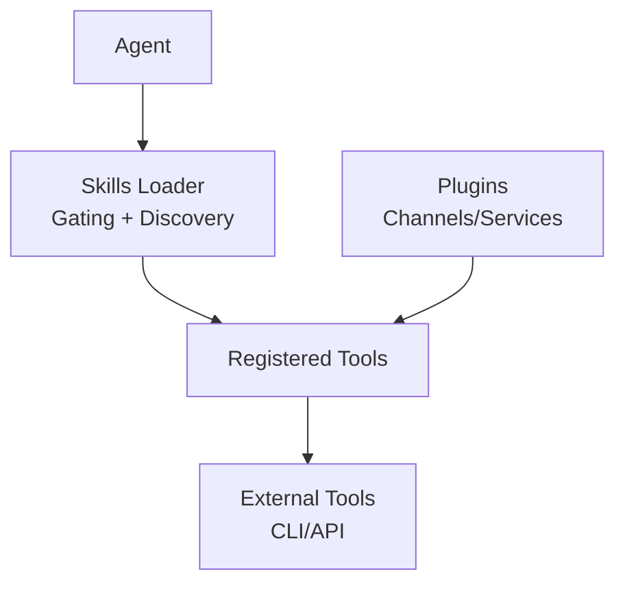

**Diagram sources**
- [skills.md](file://docs/tools/skills.md#L106-L187)
- [discord/index.ts](file://extensions/discord/index.ts#L1-L20)
- [telegram/index.ts](file://extensions/telegram/index.ts#L1-L18)

## Detailed Component Analysis

### Pattern: API Integration (OpenAI Images)
A skill integrates with an external API via a script and environment gating.

Key elements:
- Frontmatter declares metadata and gating (binary and environment)
- Script-based invocation with explicit flags and outputs
- Guidance on model parameters and output formats

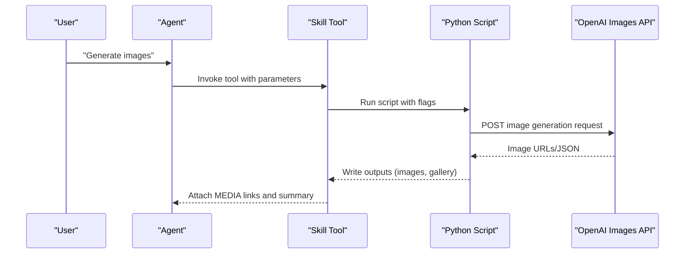

**Diagram sources**
- [openai-image-gen/SKILL.md](file://skills/openai-image-gen/SKILL.md#L1-L93)

**Section sources**
- [openai-image-gen/SKILL.md](file://skills/openai-image-gen/SKILL.md#L1-L93)

### Pattern: File Processing (PDF)
A skill provides comprehensive guidance for PDF operations, mixing code samples, CLI commands, and best practices.

Highlights:
- Python libraries (pypdf, pdfplumber, reportlab)
- Command-line tools (pdftotext, qpdf, pdftk)
- Structured quick reference and troubleshooting pointers
- Clear separation between quick start and advanced features

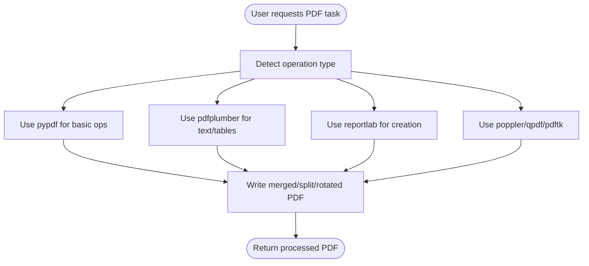

**Diagram sources**
- [pdf/SKILL.md](file://skills/pdf/SKILL.md#L13-L315)

**Section sources**
- [pdf/SKILL.md](file://skills/pdf/SKILL.md#L13-L315)

### Pattern: Media Manipulation (Video Frames)
A skill leverages an external CLI to extract frames or thumbnails.

Highlights:
- Binary gating ensures ffmpeg availability
- Script-based invocation with timestamp and output controls
- Recommendations for output formats

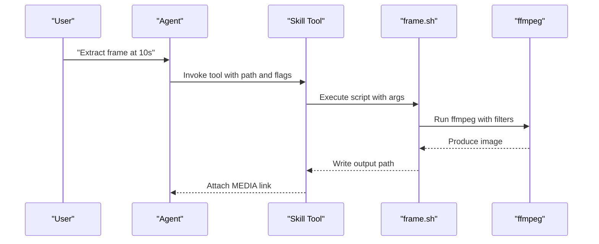

**Diagram sources**
- [video-frames/SKILL.md](file://skills/video-frames/SKILL.md#L1-L47)

**Section sources**
- [video-frames/SKILL.md](file://skills/video-frames/SKILL.md#L1-L47)

### Pattern: Image Generation with API (Gemini)
A skill demonstrates gated API usage with environment variables and installation hints.

Highlights:
- Gating via binary and environment variables
- Script invocation with resolution and aspect ratio options
- Output conventions for media attachment

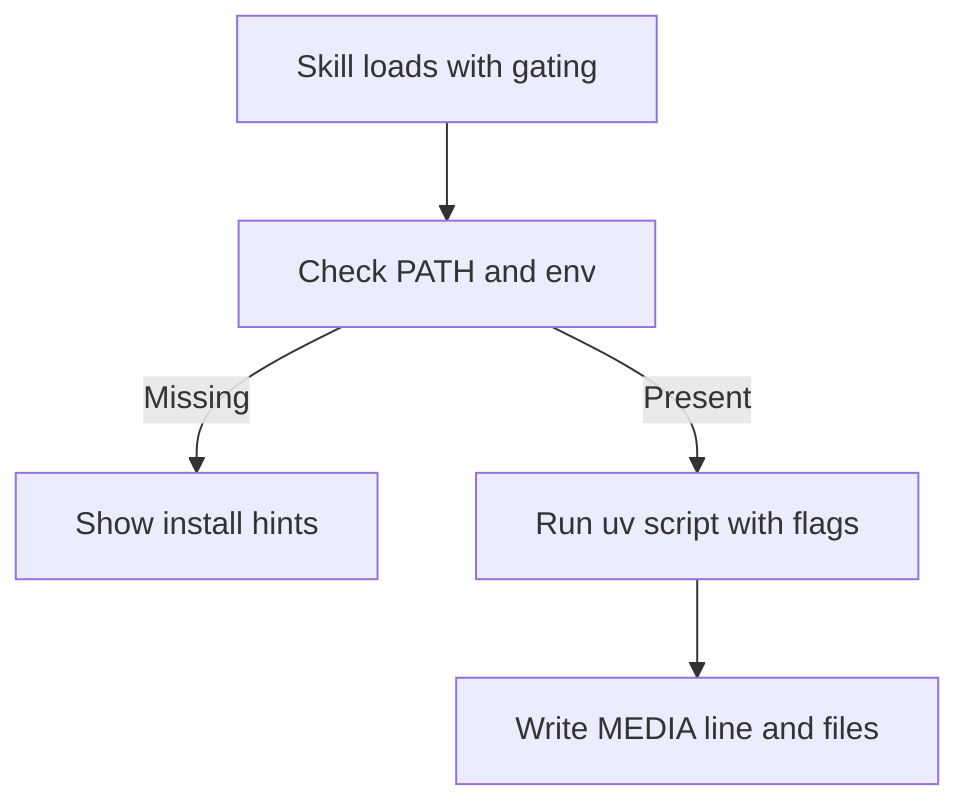

**Diagram sources**
- [nano-banana-pro/SKILL.md](file://skills/nano-banana-pro/SKILL.md#L1-L66)

**Section sources**
- [nano-banana-pro/SKILL.md](file://skills/nano-banana-pro/SKILL.md#L1-L66)

### Pattern: Automation with Approval Gates (Lobster)
A skill orchestrates multi-step workflows with approval checkpoints.

Highlights:
- Deterministic pipelines
- Approval gates returning resume tokens
- Structured JSON envelopes for results

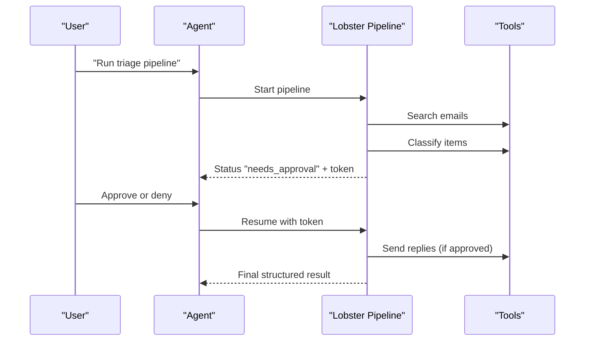

**Diagram sources**
- [lobster/SKILL.md](file://extensions/lobster/SKILL.md#L1-L98)

**Section sources**
- [lobster/SKILL.md](file://extensions/lobster/SKILL.md#L1-L98)

### Pattern: Long-Term Memory (LanceDB Plugin)
A plugin provides memory tools with auto-recall and auto-capture via lifecycle hooks.

Highlights:
- Vector search with embeddings
- Auto-recall before agent start
- Auto-capture after agent end with filtering
- CLI commands for diagnostics

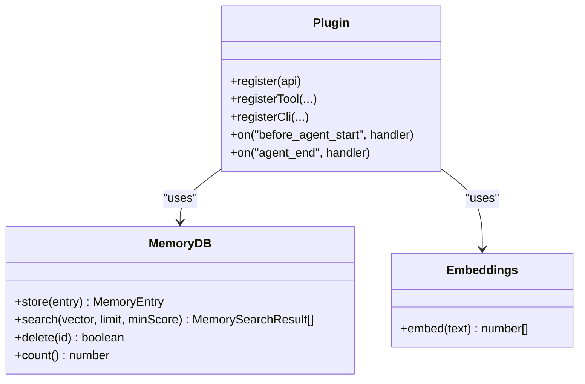

**Diagram sources**
- [memory-lancedb/index.ts](file://extensions/memory-lancedb/index.ts#L59-L157)

**Section sources**
- [memory-lancedb/index.ts](file://extensions/memory-lancedb/index.ts#L292-L679)

### Pattern: OAuth Setup for API Access
A plugin encapsulates OAuth flows for secure API access.

Highlights:
- PKCE flow with local callback or manual paste
- Discovery of client credentials from installed CLI
- Project discovery and tier handling

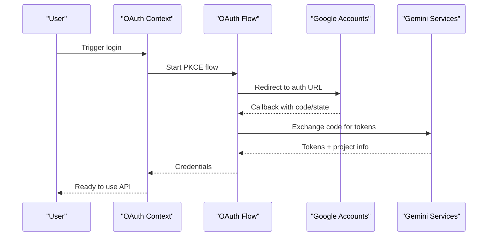

**Diagram sources**
- [google-gemini-cli-auth/oauth.ts](file://extensions/google-gemini-cli-auth/oauth.ts#L659-L735)

**Section sources**
- [google-gemini-cli-auth/oauth.ts](file://extensions/google-gemini-cli-auth/oauth.ts#L1-L735)

### Pattern: Creating Skills (Skill Creator)
A skill and its companion scripts demonstrate a repeatable authoring workflow.

Highlights:
- Initialization template with TODO placeholders
- Structuring guidance (workflow/task/reference/capabilities)
- Packaging and validation pipeline

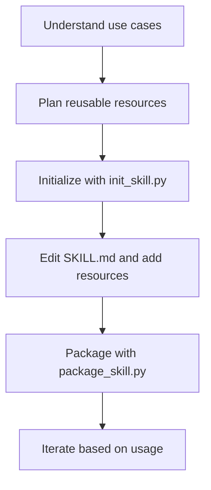

**Diagram sources**
- [skill-creator/SKILL.md](file://skills/skill-creator/SKILL.md#L201-L373)
- [skill-creator/scripts/init_skill.py](file://skills/skill-creator/scripts/init_skill.py#L1-L379)

**Section sources**
- [skill-creator/SKILL.md](file://skills/skill-creator/SKILL.md#L1-L373)
- [skill-creator/scripts/init_skill.py](file://skills/skill-creator/scripts/init_skill.py#L1-L379)

## Dependency Analysis
- Skills depend on gating rules (environment, binaries, config) and are discovered from workspace, managed, and bundled locations
- Plugins can register tools/services consumed by skills
- External dependencies include CLIs (ffmpeg, python, uv) and APIs (OpenAI, Google)

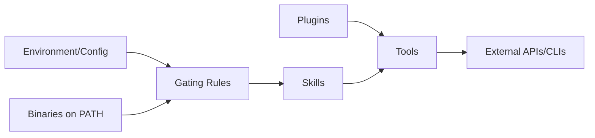

**Diagram sources**
- [skills.md](file://docs/tools/skills.md#L106-L187)

**Section sources**
- [skills.md](file://docs/tools/skills.md#L106-L187)

## Performance Considerations
- Token footprint: Skills list is injected into the system prompt; keep SKILL.md concise and leverage references for heavy content
- Exec timeouts: Some operations (e.g., image generation) may exceed default timeouts; configure exec timeouts accordingly
- Vector search: Memory plugin uses embedding dimensionality and similarity thresholds to balance recall and performance

[No sources needed since this section provides general guidance]

## Troubleshooting Guide
- Skills not appearing: Verify gating rules and environment; refresh skills or restart the gateway
- Exec timeouts: Increase exec timeout for long-running tasks
- OAuth failures: Ensure PKCE state matches, client credentials are available, and project is configured
- Memory plugin errors: Validate DB path, vector dimensions, and lifecycle hook registration

**Section sources**
- [skills.md](file://docs/tools/skills.md#L254-L286)
- [google-gemini-cli-auth/oauth.ts](file://extensions/google-gemini-cli-auth/oauth.ts#L659-L735)
- [memory-lancedb/index.ts](file://extensions/memory-lancedb/index.ts#L292-L679)

## Conclusion
OpenClaw’s skill and plugin ecosystem enables robust, composable capabilities. By following the patterns demonstrated here—gated API access, script-driven file/media processing, structured automation with approval gates, and long-term memory—you can build reliable, maintainable skills and extensions. Use the provided tutorials and templates to accelerate development and adhere to best practices for safety, performance, and user experience.

[No sources needed since this section summarizes without analyzing specific files]

## Appendices

### Step-by-Step: Create a New Skill
- Create a directory in your workspace and add a SKILL.md with frontmatter and instructions
- Optionally add scripts/, references/, and assets/ directories
- Refresh skills or restart the gateway to load the new skill
- Test locally and iterate

**Section sources**
- [creating-skills.md](file://docs/tools/creating-skills.md#L17-L58)

### Step-by-Step: Author a PDF Processing Skill
- Use the PDF skill as a reference for structuring operations (merge, split, extract, rotate)
- Provide code samples and CLI commands
- Link to reference docs for advanced features

**Section sources**
- [pdf/SKILL.md](file://skills/pdf/SKILL.md#L13-L315)

### Step-by-Step: Build a Media Frame Extraction Skill
- Gate on ffmpeg presence
- Provide a script wrapper with timestamp and output flags
- Recommend output formats for sharing

**Section sources**
- [video-frames/SKILL.md](file://skills/video-frames/SKILL.md#L1-L47)

### Step-by-Step: Integrate an Image Generation API
- Declare environment gating and installation hints
- Provide a script wrapper with resolution and aspect ratio options
- Standardize output for media attachment

**Section sources**
- [nano-banana-pro/SKILL.md](file://skills/nano-banana-pro/SKILL.md#L1-L66)

### Step-by-Step: Create an Automation Skill with Approval Gates
- Define a deterministic pipeline
- Insert approval checkpoints with resume tokens
- Return structured results

**Section sources**
- [lobster/SKILL.md](file://extensions/lobster/SKILL.md#L1-L98)

### Step-by-Step: Add a Plugin Tool (Memory)
- Register tools for recall/store/forget
- Implement lifecycle hooks for auto-recall and auto-capture
- Provide CLI commands for diagnostics

**Section sources**
- [memory-lancedb/index.ts](file://extensions/memory-lancedb/index.ts#L292-L679)

### Step-by-Step: Implement OAuth for API Access
- Support PKCE with local callback or manual paste
- Discover client credentials and project
- Handle tier/project provisioning

**Section sources**
- [google-gemini-cli-auth/oauth.ts](file://extensions/google-gemini-cli-auth/oauth.ts#L659-L735)