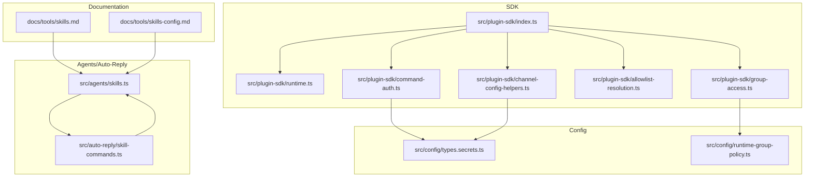
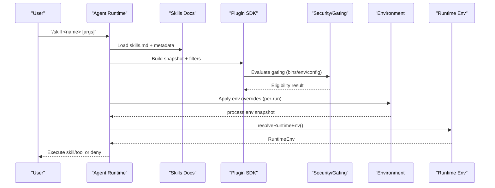
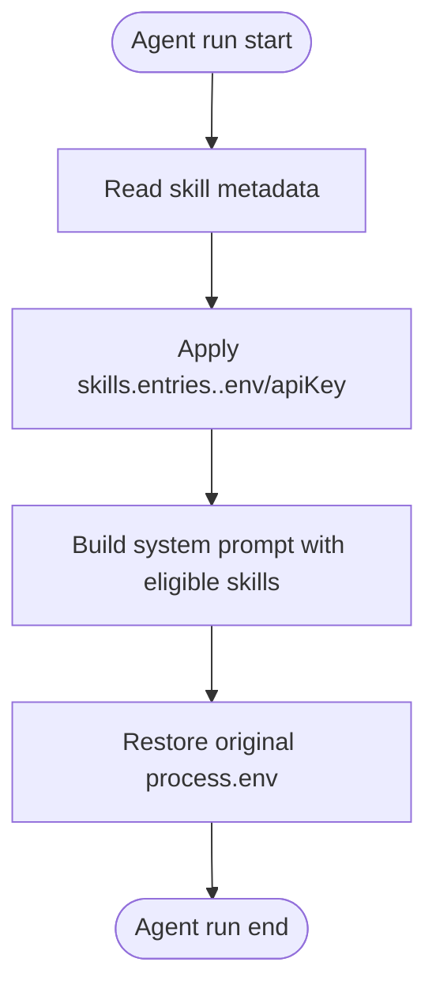
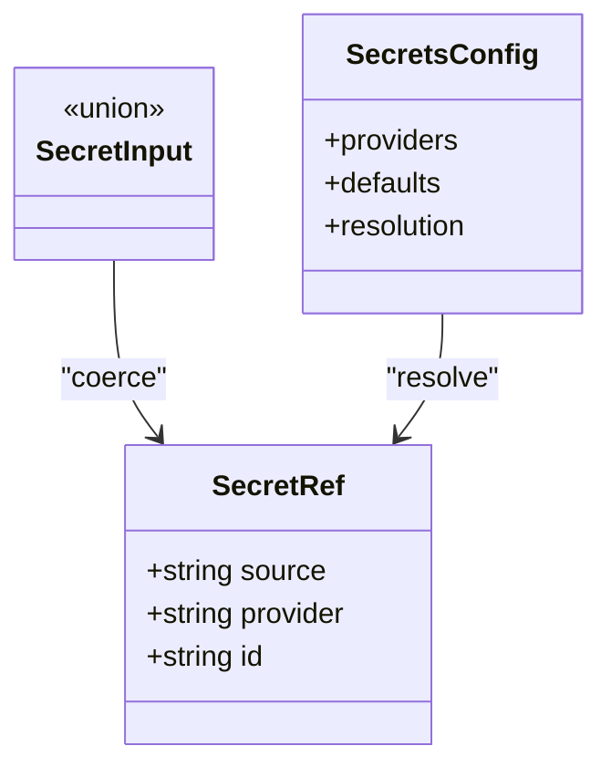
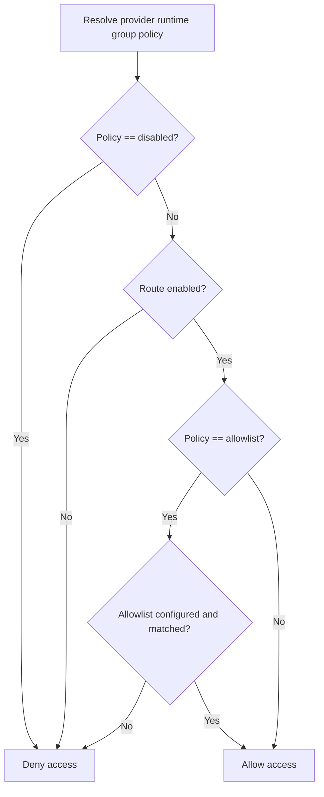
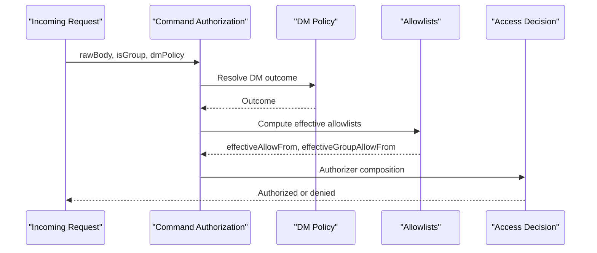
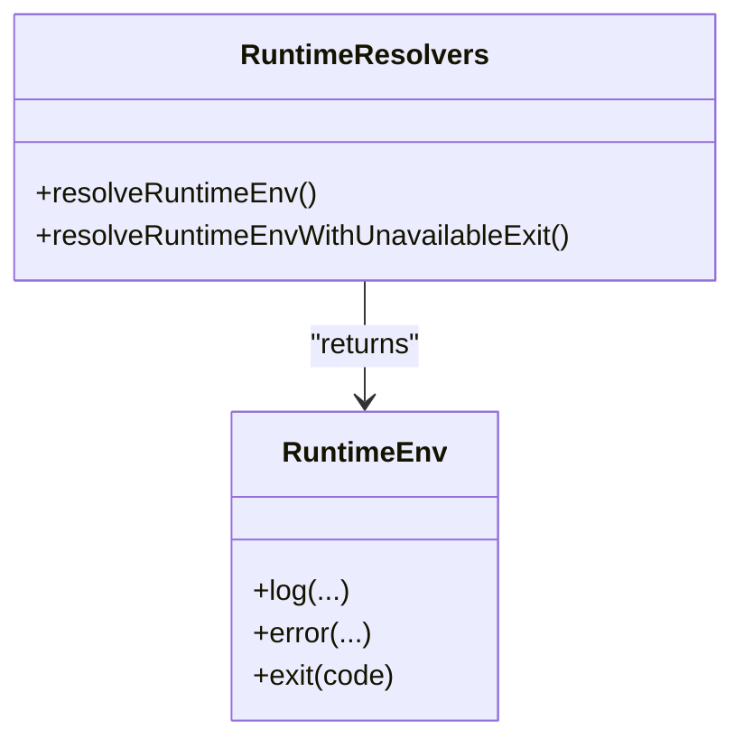
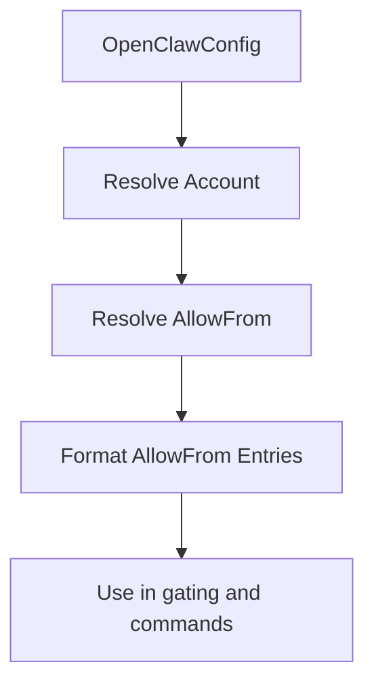
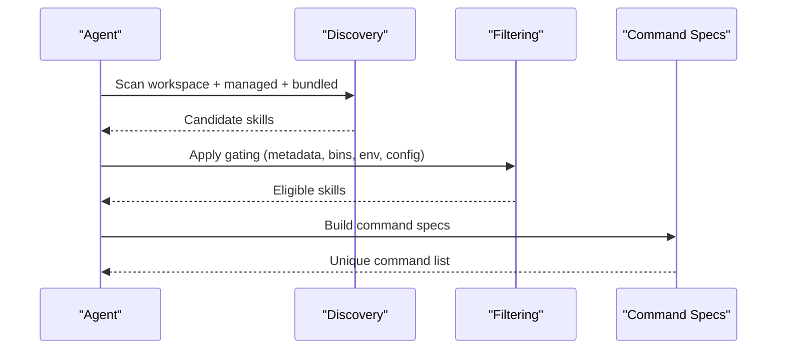
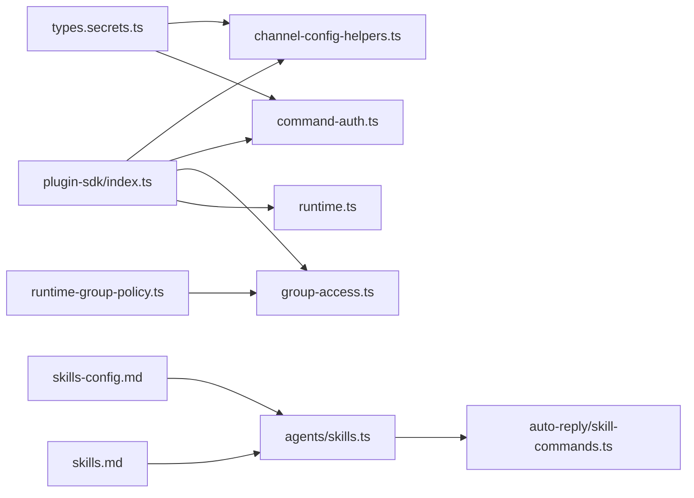

# Skill Configuration & Gating

<cite>
**Referenced Files in This Document**
- [index.ts](file://src/plugin-sdk/index.ts)
- [skills.md](file://docs/tools/skills.md)
- [skills-config.md](file://docs/tools/skills-config.md)
- [types.secrets.ts](file://src/config/types.secrets.ts)
- [runtime.ts](file://src/plugin-sdk/runtime.ts)
- [allowlist-resolution.ts](file://src/plugin-sdk/allowlist-resolution.ts)
- [group-access.ts](file://src/plugin-sdk/group-access.ts)
- [runtime-group-policy.ts](file://src/config/runtime-group-policy.ts)
- [command-auth.ts](file://src/plugin-sdk/command-auth.ts)
- [channel-config-helpers.ts](file://src/plugin-sdk/channel-config-helpers.ts)
- [skills.ts](file://src/agents/skills.ts)
- [skill-commands.ts](file://src/auto-reply/skill-commands.ts)
</cite>

## Table of Contents
1. [Introduction](#introduction)
2. [Project Structure](#project-structure)
3. [Core Components](#core-components)
4. [Architecture Overview](#architecture-overview)
5. [Detailed Component Analysis](#detailed-component-analysis)
6. [Dependency Analysis](#dependency-analysis)
7. [Performance Considerations](#performance-considerations)
8. [Troubleshooting Guide](#troubleshooting-guide)
9. [Conclusion](#conclusion)
10. [Appendices](#appendices)

## Introduction
This document explains how OpenClaw manages skill configuration, gating, and runtime behavior. It covers:
- Environment variable injection and secret handling
- Permission gating and group policies
- Execution constraints and load-time filtering
- Validation, configuration inheritance, and runtime parameter handling
- Conditional execution patterns, environment-specific configurations, and security gating
- Best practices for secure skill deployment and configuration management

## Project Structure
OpenClaw organizes skill-related logic across documentation, SDK utilities, configuration types, and runtime components:
- Documentation defines configuration schemas and gating rules
- SDK exports helpers for environment, permissions, and runtime
- Configuration types define secret resolution and policy defaults
- Agents and auto-reply orchestrate discovery, filtering, and command mapping

**Diagram sources**
- [skills.md](file://docs/tools/skills.md#L1-L303)
- [skills-config.md](file://docs/tools/skills-config.md#L1-L78)
- [index.ts](file://src/plugin-sdk/index.ts#L1-L812)
- [runtime.ts](file://src/plugin-sdk/runtime.ts#L1-L45)
- [group-access.ts](file://src/plugin-sdk/group-access.ts#L1-L209)
- [command-auth.ts](file://src/plugin-sdk/command-auth.ts#L1-L115)
- [allowlist-resolution.ts](file://src/plugin-sdk/allowlist-resolution.ts#L1-L31)
- [channel-config-helpers.ts](file://src/plugin-sdk/channel-config-helpers.ts#L1-L141)
- [types.secrets.ts](file://src/config/types.secrets.ts#L1-L225)
- [runtime-group-policy.ts](file://src/config/runtime-group-policy.ts#L1-L119)
- [skills.ts](file://src/agents/skills.ts#L1-L47)
- [skill-commands.ts](file://src/auto-reply/skill-commands.ts#L1-L205)

**Section sources**
- [skills.md](file://docs/tools/skills.md#L1-L303)
- [skills-config.md](file://docs/tools/skills-config.md#L1-L78)
- [index.ts](file://src/plugin-sdk/index.ts#L1-L812)

## Core Components
- Skill configuration schema and environment injection are documented and enforced via configuration files and SDK helpers.
- Secret handling supports multiple providers (environment, file, exec) with validation and normalization.
- Group access evaluation and runtime group policy resolution provide permission gating.
- Command authorization integrates allowlists and DM/group policies.
- Agent-side utilities build snapshots, filter skills, and map commands.

**Section sources**
- [skills-config.md](file://docs/tools/skills-config.md#L1-L78)
- [types.secrets.ts](file://src/config/types.secrets.ts#L1-L225)
- [group-access.ts](file://src/plugin-sdk/group-access.ts#L1-L209)
- [runtime-group-policy.ts](file://src/config/runtime-group-policy.ts#L1-L119)
- [command-auth.ts](file://src/plugin-sdk/command-auth.ts#L1-L115)
- [skills.ts](file://src/agents/skills.ts#L1-L47)
- [skill-commands.ts](file://src/auto-reply/skill-commands.ts#L1-L205)

## Architecture Overview
The skill lifecycle spans discovery, gating, configuration application, and runtime execution:

**Diagram sources**
- [skills.md](file://docs/tools/skills.md#L106-L187)
- [skills-config.md](file://docs/tools/skills-config.md#L54-L78)
- [runtime.ts](file://src/plugin-sdk/runtime.ts#L26-L44)
- [command-auth.ts](file://src/plugin-sdk/command-auth.ts#L63-L114)
- [group-access.ts](file://src/plugin-sdk/group-access.ts#L145-L208)

## Detailed Component Analysis

### Skill Configuration Schema and Environment Injection
- Configuration locations and precedence are defined in the skills documentation.
- Global and per-skill environment variables are injected at run-time and restored after completion.
- Sandbox considerations: sandboxed runs do not inherit host environment; use sandbox-specific environment configuration.

**Diagram sources**
- [skills.md](file://docs/tools/skills.md#L230-L241)
- [skills-config.md](file://docs/tools/skills-config.md#L57-L78)

**Section sources**
- [skills.md](file://docs/tools/skills.md#L13-L77)
- [skills.md](file://docs/tools/skills.md#L189-L241)
- [skills-config.md](file://docs/tools/skills-config.md#L13-L78)

### Secret Resolution and Validation
Secrets support multiple providers and are validated and normalized:
- SecretRef shape and coercion
- Validation of environment template references
- Defaults for legacy and template forms
- Assertions for unresolved references

**Diagram sources**
- [types.secrets.ts](file://src/config/types.secrets.ts#L1-L225)

**Section sources**
- [types.secrets.ts](file://src/config/types.secrets.ts#L1-L225)

### Permission Gating and Group Policies
Group access decisions are evaluated based on:
- Provider presence and defaults
- Allowlists and route matching
- Sender allowlist checks
- DM/group policy combinations

**Diagram sources**
- [runtime-group-policy.ts](file://src/config/runtime-group-policy.ts#L16-L87)
- [group-access.ts](file://src/plugin-sdk/group-access.ts#L53-L143)

**Section sources**
- [runtime-group-policy.ts](file://src/config/runtime-group-policy.ts#L1-L119)
- [group-access.ts](file://src/plugin-sdk/group-access.ts#L1-L209)

### Command Authorization and DM Policy Integration
Command authorization considers:
- DM policy and allowlists
- Effective allowlists derived from configuration and persisted store
- Authorizer composition across owner and group scopes

**Diagram sources**
- [command-auth.ts](file://src/plugin-sdk/command-auth.ts#L63-L114)
- [skills.md](file://docs/tools/skills.md#L56-L76)

**Section sources**
- [command-auth.ts](file://src/plugin-sdk/command-auth.ts#L1-L115)
- [skills.md](file://docs/tools/skills.md#L69-L76)

### Runtime Environment and Parameter Handling
- RuntimeEnv abstraction enables logging, erroring, and controlled exits.
- Environment resolution supports overriding defaults and unavailable exit scenarios.

**Diagram sources**
- [runtime.ts](file://src/plugin-sdk/runtime.ts#L9-L44)

**Section sources**
- [runtime.ts](file://src/plugin-sdk/runtime.ts#L1-L45)

### Configuration Inheritance and Channel Scoping
- Helpers provide scoped accessors for channel accounts and allowlists.
- Normalize and format allowlist entries consistently across channels.

**Diagram sources**
- [channel-config-helpers.ts](file://src/plugin-sdk/channel-config-helpers.ts#L33-L60)
- [channel-config-helpers.ts](file://src/plugin-sdk/channel-config-helpers.ts#L107-L141)

**Section sources**
- [channel-config-helpers.ts](file://src/plugin-sdk/channel-config-helpers.ts#L1-L141)

### Skill Discovery, Filtering, and Command Mapping
- Agent utilities build snapshots, filter skills, and compute commands.
- Command mapping deduplicates by skill name and resolves invocations.

**Diagram sources**
- [skills.ts](file://src/agents/skills.ts#L26-L34)
- [skill-commands.ts](file://src/auto-reply/skill-commands.ts#L36-L129)

**Section sources**
- [skills.ts](file://src/agents/skills.ts#L1-L47)
- [skill-commands.ts](file://src/auto-reply/skill-commands.ts#L1-L205)

## Dependency Analysis
The following diagram highlights key dependencies among components involved in skill gating and configuration:

**Diagram sources**
- [types.secrets.ts](file://src/config/types.secrets.ts#L1-L225)
- [runtime-group-policy.ts](file://src/config/runtime-group-policy.ts#L1-L119)
- [group-access.ts](file://src/plugin-sdk/group-access.ts#L1-L209)
- [command-auth.ts](file://src/plugin-sdk/command-auth.ts#L1-L115)
- [channel-config-helpers.ts](file://src/plugin-sdk/channel-config-helpers.ts#L1-L141)
- [runtime.ts](file://src/plugin-sdk/runtime.ts#L1-L45)
- [index.ts](file://src/plugin-sdk/index.ts#L1-L812)
- [skills.md](file://docs/tools/skills.md#L1-L303)
- [skills-config.md](file://docs/tools/skills-config.md#L1-L78)
- [skills.ts](file://src/agents/skills.ts#L1-L47)
- [skill-commands.ts](file://src/auto-reply/skill-commands.ts#L1-L205)

**Section sources**
- [index.ts](file://src/plugin-sdk/index.ts#L1-L812)

## Performance Considerations
- Skills snapshot caching reduces repeated computation across turns within a session.
- Watcher refreshes enable hot reload when SKILL.md changes.
- Prompt token overhead from skills list is deterministic and depends on the number and length of skill fields.

**Section sources**
- [skills.md](file://docs/tools/skills.md#L242-L286)

## Troubleshooting Guide
- Unresolved SecretRef errors indicate missing or misconfigured secret providers; ensure providers are defined and resolvable before reading sensitive values.
- Group policy warnings highlight missing provider configuration; configure groupPolicy explicitly or provide provider credentials.
- Command authorization failures often stem from missing allowlists or DM policy restrictions; verify effective allowlists and sender eligibility.

**Section sources**
- [types.secrets.ts](file://src/config/types.secrets.ts#L125-L142)
- [runtime-group-policy.ts](file://src/config/runtime-group-policy.ts#L91-L111)
- [command-auth.ts](file://src/plugin-sdk/command-auth.ts#L63-L114)

## Conclusion
OpenClaw’s skill configuration and gating system combines declarative metadata, robust secret handling, and flexible group policies to enforce secure and predictable execution. By leveraging environment injection, runtime policy resolution, and command authorization, operators can tailor skill availability and invocation to their operational context while maintaining strong security boundaries.

## Appendices

### Best Practices for Secure Skill Deployment and Configuration Management
- Treat third-party skills as untrusted; review before enabling.
- Prefer sandboxed runs for untrusted inputs and risky tools.
- Use secrets configuration to avoid embedding credentials in prompts or logs.
- Configure group policies explicitly to avoid fallbacks that inadvertently restrict or expose functionality.
- Keep environment variables scoped to agent runs and avoid global shell pollution.
- Validate gating criteria (binaries, environment variables, configuration paths) prior to enabling skills.

[No sources needed since this section provides general guidance]