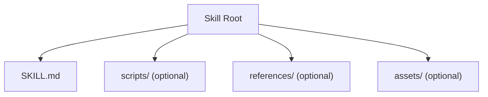
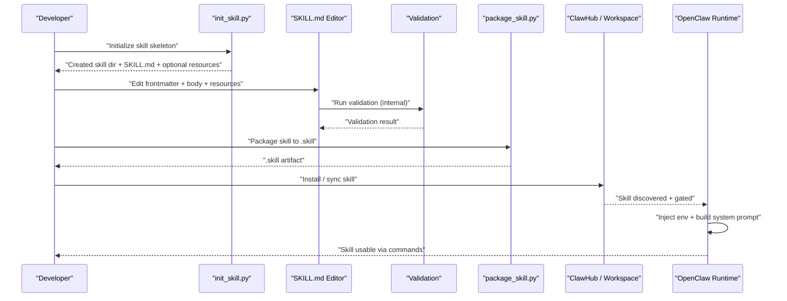
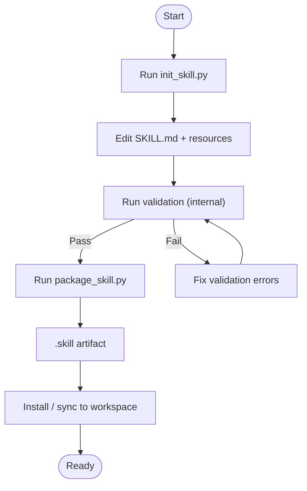

# Skill Development Guide

<cite>
**Referenced Files in This Document**
- [creating-skills.md](file://docs/tools/creating-skills.md)
- [skills.md](file://docs/tools/skills.md)
- [skills-config.md](file://docs/tools/skills-config.md)
- [slash-commands.md](file://docs/tools/slash-commands.md)
- [SKILL.md (skill-creator)](file://skills/skill-creator/SKILL.md)
- [init_skill.py](file://skills/skill-creator/scripts/init_skill.py)
- [package_skill.py](file://skills/skill-creator/scripts/package_skill.py)
- [SKILL.md (gemini)](file://skills/gemini/SKILL.md)
- [SKILL.md (summarize)](file://skills/summarize/SKILL.md)
- [SKILL.md (pdf)](file://skills/pdf/SKILL.md)
- [SKILL.md (lobster)](file://extensions/lobster/SKILL.md)
</cite>

## Table of Contents
1. [Introduction](#introduction)
2. [Project Structure](#project-structure)
3. [Core Components](#core-components)
4. [Architecture Overview](#architecture-overview)
5. [Detailed Component Analysis](#detailed-component-analysis)
6. [Dependency Analysis](#dependency-analysis)
7. [Performance Considerations](#performance-considerations)
8. [Troubleshooting Guide](#troubleshooting-guide)
9. [Conclusion](#conclusion)
10. [Appendices](#appendices)

## Introduction
This guide explains how to design, build, configure, and distribute skills for the OpenClaw system. It covers the SKILL.md format, YAML frontmatter, gating rules, environment injection, installer specifications, best practices, security, performance, and step-by-step tutorials for common skill types. It also documents testing and debugging workflows grounded in the repository’s documentation and example skills.

## Project Structure
Skills are self-contained directories with a required SKILL.md file and optional bundled resources:
- SKILL.md: YAML frontmatter (name, description, optional metadata) followed by Markdown instructions.
- scripts/: executable code (Python, Bash, etc.) for deterministic tasks.
- references/: reference materials loaded on demand.
- assets/: output-oriented files (templates, icons, fonts) not loaded into context.

**Diagram sources**
- [SKILL.md (pdf)](file://skills/pdf/SKILL.md#L1-L315)

**Section sources**
- [creating-skills.md](file://docs/tools/creating-skills.md#L17-L48)
- [SKILL.md (pdf)](file://skills/pdf/SKILL.md#L1-L315)

## Core Components
- SKILL.md frontmatter: name and description are required; optional metadata governs gating, UI, and tool dispatch.
- Gating rules: metadata.openclaw.requires controls eligibility based on binaries, environment, and config.
- Environment injection: per-agent runs inject env/apiKey from configuration into the host process.
- Installer specs: metadata.openclaw.install describes platform-specific installers for UI-driven setup.
- Progressive disclosure: metadata + SKILL.md body + on-demand references reduce context load.

**Section sources**
- [skills.md](file://docs/tools/skills.md#L78-L187)
- [SKILL.md (gemini)](file://skills/gemini/SKILL.md#L1-L44)
- [SKILL.md (summarize)](file://skills/summarize/SKILL.md#L1-L88)

## Architecture Overview
The skill lifecycle spans authoring, validation, packaging, distribution, and runtime evaluation.

**Diagram sources**
- [init_skill.py](file://skills/skill-creator/scripts/init_skill.py#L255-L317)
- [package_skill.py](file://skills/skill-creator/scripts/package_skill.py#L28-L111)
- [skills.md](file://docs/tools/skills.md#L106-L187)

## Detailed Component Analysis

### SKILL.md Format and Frontmatter
- Required frontmatter fields:
  - name: concise, hyphenated identifier.
  - description: primary trigger and usage guidance; included in metadata for selection.
- Optional frontmatter keys:
  - homepage: URL surfaced as “Website”.
  - user-invocable: whether exposed as a user slash command.
  - disable-model-invocation: exclude from model prompt while keeping user invocation.
  - command-dispatch: tool to bypass model for deterministic dispatch.
  - command-tool: tool name when command-dispatch: tool.
  - command-arg-mode: raw forwarding of args to the tool.
- Single-line YAML frontmatter and single-line JSON metadata are supported.
- Use {baseDir} in instructions to reference the skill folder path.

**Section sources**
- [skills.md](file://docs/tools/skills.md#L78-L105)
- [SKILL.md (gemini)](file://skills/gemini/SKILL.md#L1-L23)
- [SKILL.md (summarize)](file://skills/summarize/SKILL.md#L1-L23)

### Gating Rules and Load-Time Filters
- metadata.openclaw.requires:
  - bins: PATH binaries required.
  - anyBins: at least one of listed binaries required.
  - env: environment variables required (or provided via config).
  - config: truthy paths in openclaw.json required.
- metadata.openclaw:
  - always: include skill regardless of other gates.
  - emoji/homepage: UI hints.
  - os: platform filter (darwin, linux, win32).
  - install: installer specs for UI-driven installation.
  - primaryEnv: maps apiKey to an env key for convenience.
- Sandbox note: binaries must exist inside the sandbox container; install via agents.defaults.sandbox.docker.setupCommand.

**Section sources**
- [skills.md](file://docs/tools/skills.md#L106-L187)
- [SKILL.md (gemini)](file://skills/gemini/SKILL.md#L5-L22)
- [SKILL.md (summarize)](file://skills/summarize/SKILL.md#L5-L22)

### Environment Injection and Secrets
- At the start of an agent run:
  - Read skill metadata.
  - Apply skills.entries.<key>.env or skills.entries.<key>.apiKey to process.env (only if not already set).
  - Build system prompt with eligible skills.
  - Restore original environment after the run.
- For sandboxed sessions, the sandbox does not inherit host process.env; use agents.defaults.sandbox.docker.env or bake env into the image.

**Section sources**
- [skills.md](file://docs/tools/skills.md#L230-L241)
- [skills-config.md](file://docs/tools/skills-config.md#L67-L77)

### Installer Specifications
- metadata.openclaw.install is an array of installer objects:
  - id, kind, formula/binaries/labels for brew/node/go/download.
  - os filtering for platform-specific options.
  - Node manager preference via skills.install.nodeManager.
- Behavior: single preferred option chosen when multiple are present; download entries list available artifacts.

**Section sources**
- [skills.md](file://docs/tools/skills.md#L148-L185)
- [SKILL.md (gemini)](file://skills/gemini/SKILL.md#L11-L21)

### Progressive Disclosure and Context Efficiency
- Three-tier loading:
  1) Metadata (name + description) always in context (~100 words).
  2) SKILL.md body when skill triggers (<5k words).
  3) Bundled resources as needed (scripts may run without loading).
- Recommendations:
  - Keep SKILL.md body under ~500 lines.
  - Split detailed content into references/; link from SKILL.md.
  - Avoid deeply nested references; keep one-level depth.

**Section sources**
- [SKILL.md (skill-creator)](file://skills/skill-creator/SKILL.md#L113-L200)

### Skill Naming and Organization
- Use lowercase letters, digits, and hyphens; normalize titles to hyphen-case.
- Keep names under 64 characters; prefer verb-led phrasing.
- Namespace by tool when it improves clarity.
- Folder name should match the skill name.

**Section sources**
- [SKILL.md (skill-creator)](file://skills/skill-creator/SKILL.md#L214-L221)

### Authoring Workflow and Tooling
- Initialization:
  - Use init_skill.py to scaffold a skill directory with a SKILL.md template and optional resource directories.
  - Options: --resources (scripts,references,assets) and --examples to seed example files.
- Packaging:
  - Use package_skill.py to validate and produce a .skill artifact.
  - Validation rejects symlinks and ensures required structure.
- Distribution:
  - Publish to ClawHub or install into workspace/skills for local overrides.

**Diagram sources**
- [init_skill.py](file://skills/skill-creator/scripts/init_skill.py#L320-L379)
- [package_skill.py](file://skills/skill-creator/scripts/package_skill.py#L114-L140)

**Section sources**
- [init_skill.py](file://skills/skill-creator/scripts/init_skill.py#L1-L379)
- [package_skill.py](file://skills/skill-creator/scripts/package_skill.py#L1-L140)
- [creating-skills.md](file://docs/tools/creating-skills.md#L17-L48)

### Example Skills and Patterns
- Gemini CLI skill demonstrates minimal frontmatter, optional homepage, and installer spec.
- Summarize skill shows trigger phrases, quick start, model/key guidance, useful flags, and optional config/services.
- PDF skill showcases extensive reference-based guidance, code examples, and quick reference tables.

**Section sources**
- [SKILL.md (gemini)](file://skills/gemini/SKILL.md#L1-L44)
- [SKILL.md (summarize)](file://skills/summarize/SKILL.md#L1-L88)
- [SKILL.md (pdf)](file://skills/pdf/SKILL.md#L1-L315)

### Command Dispatch and Deterministic Execution
- Skills can opt-in to command-dispatch: tool to bypass the model and route slash commands directly to a tool.
- command-tool specifies the tool; command-arg-mode raw forwards raw args to the tool.

**Section sources**
- [skills.md](file://docs/tools/skills.md#L99-L105)
- [slash-commands.md](file://docs/tools/slash-commands.md#L140-L145)

### Lobster Workflows (Advanced Pattern)
- Lobster executes multi-step workflows with approval checkpoints, deterministic behavior, and resumable execution.
- Use cases: triage, monitoring, and automations requiring human approval before sending or posting.

**Section sources**
- [SKILL.md (lobster)](file://extensions/lobster/SKILL.md#L1-L98)

## Dependency Analysis
- Skill discovery and precedence:
  - Workspace skills override managed/local; managed/local override bundled.
  - Extra directories can be added via skills.load.extraDirs.
- Plugin skills participate in the same precedence rules and can be gated via plugin metadata.
- Remote macOS nodes can expose macOS-only skills when binaries are present and allowed.

**Diagram sources**
- [skills.md](file://docs/tools/skills.md#L13-L48)

**Section sources**
- [skills.md](file://docs/tools/skills.md#L13-L48)

## Performance Considerations
- Token impact:
  - Eligible skills are injected into the system prompt as a compact XML list.
  - Base overhead: 195 characters; per skill: 97 + escaped name/description/location lengths.
  - XML escaping increases length; estimate ~4 chars/token for OpenAI-style tokenizers.
- Session snapshot:
  - Skills snapshot is taken at session start and reused; changes take effect on next session.
  - Watcher can hot-reload on SKILL.md changes.

**Section sources**
- [skills.md](file://docs/tools/skills.md#L269-L286)
- [skills.md](file://docs/tools/skills.md#L242-L247)

## Troubleshooting Guide
- Validation failures during packaging:
  - package_skill.py reports validation errors; fix issues and rerun.
  - Symlinks are rejected; ensure no symlinks in the skill tree.
- Environment not applied:
  - Ensure skills.entries.<key>.env/apiKey is set and not already present in process.env.
  - For sandboxed sessions, set agents.defaults.sandbox.docker.env or bake env into the image.
- Installer not available:
  - Confirm metadata.openclaw.install entries match platform and tool availability.
  - Node manager preference is controlled by skills.install.nodeManager.
- Command not found:
  - Verify metadata.openclaw.requires.bins are present on PATH (host and sandbox).
- Remote macOS-only skills unavailable:
  - Confirm the node reports command support and system.run is allowed.

**Section sources**
- [package_skill.py](file://skills/skill-creator/scripts/package_skill.py#L56-L63)
- [skills.md](file://docs/tools/skills.md#L138-L147)
- [skills-config.md](file://docs/tools/skills-config.md#L67-L77)

## Conclusion
OpenClaw skills are modular, AgentSkills-compatible packages that extend capabilities through clear frontmatter, progressive disclosure, and optional bundling of scripts, references, and assets. By following gating, environment injection, and installer specifications documented here, developers can build secure, performant, and user-friendly skills. The provided tooling (init_skill.py, package_skill.py) and examples (gemini, summarize, pdf) offer practical pathways to design, validate, package, and distribute skills effectively.

## Appendices

### Step-by-Step: Create a Minimal Skill
- Create the directory and define SKILL.md with name and description.
- Optionally add tools or instruct the agent to use existing system tools.
- Refresh OpenClaw (refresh skills or restart gateway).
- Test locally with openclaw agent --message "use my new skill".

**Section sources**
- [creating-skills.md](file://docs/tools/creating-skills.md#L17-L58)

### Step-by-Step: Create a Skill with Installer Spec
- Author SKILL.md with metadata.openclaw.requires and metadata.openclaw.install entries.
- Use init_skill.py to scaffold resources if needed.
- Package with package_skill.py and distribute via ClawHub or workspace.

**Section sources**
- [skills.md](file://docs/tools/skills.md#L148-L185)
- [init_skill.py](file://skills/skill-creator/scripts/init_skill.py#L255-L317)
- [package_skill.py](file://skills/skill-creator/scripts/package_skill.py#L28-L111)

### Best Practices Checklist
- Keep SKILL.md concise; defer details to references/.
- Use progressive disclosure: metadata + SKILL.md body + on-demand references.
- Normalize skill names to lowercase hyphens; avoid deeply nested references.
- Include gating rules for binaries, environment, and config.
- Prefer sandboxed runs for untrusted inputs; avoid exposing secrets in prompts/logs.
- Validate before packaging; avoid symlinks.

**Section sources**
- [SKILL.md (skill-creator)](file://skills/skill-creator/SKILL.md#L113-L200)
- [skills.md](file://docs/tools/skills.md#L69-L77)