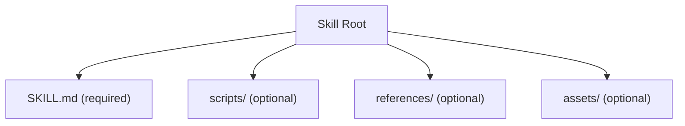
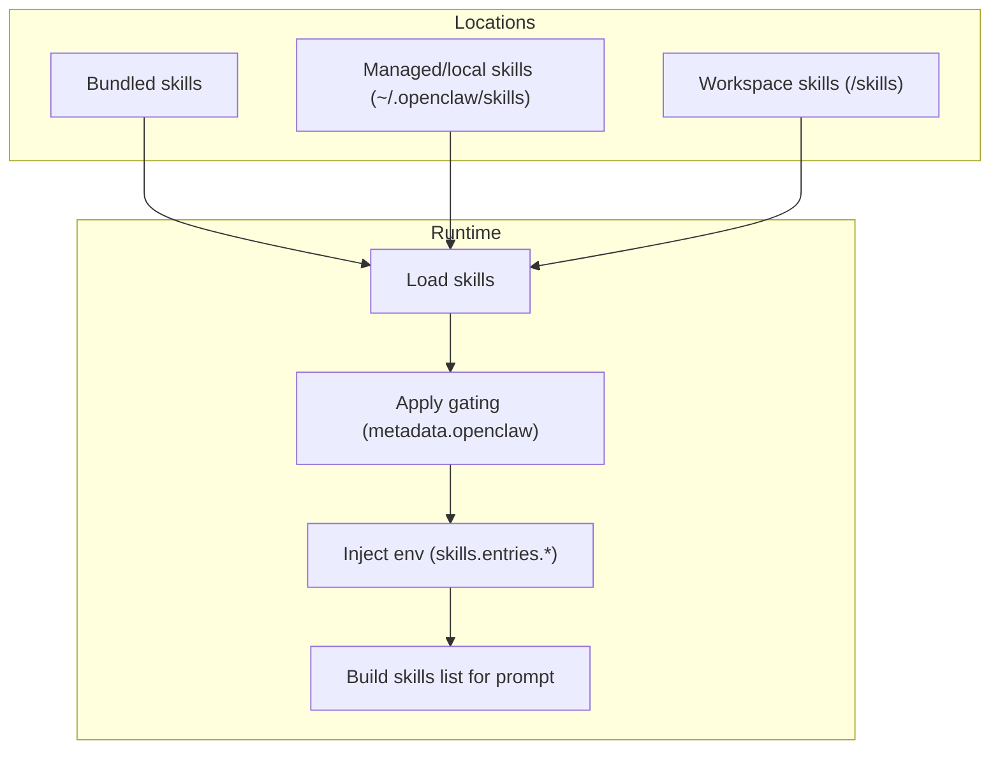
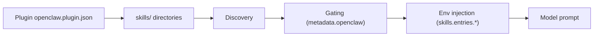

# Skill Format Specification

<cite>
**Referenced Files in This Document**
- [SKILL.md](file://skills/skill-creator/SKILL.md)
- [creating-skills.md](file://docs/tools/creating-skills.md)
- [skills.md](file://docs/tools/skills.md)
- [gemini/SKILL.md](file://skills/gemini/SKILL.md)
- [gh-issues/SKILL.md](file://skills/gh-issues/SKILL.md)
- [pdf/SKILL.md](file://skills/pdf/SKILL.md)
- [model-usage/SKILL.md](file://skills/model-usage/SKILL.md)
- [nano-banana-pro/SKILL.md](file://skills/nano-banana-pro/SKILL.md)
- [voice-call/SKILL.md](file://skills/voice-call/SKILL.md)
- [tmux/SKILL.md](file://skills/tmux/SKILL.md)
- [lobster/SKILL.md](file://extensions/lobster/SKILL.md)
- [init_skill.py](file://skills/skill-creator/scripts/init_skill.py)
- [package_skill.py](file://skills/skill-creator/scripts/package_skill.py)
</cite>

## Table of Contents
1. [Introduction](#introduction)
2. [Project Structure](#project-structure)
3. [Core Components](#core-components)
4. [Architecture Overview](#architecture-overview)
5. [Detailed Component Analysis](#detailed-component-analysis)
6. [Dependency Analysis](#dependency-analysis)
7. [Performance Considerations](#performance-considerations)
8. [Troubleshooting Guide](#troubleshooting-guide)
9. [Conclusion](#conclusion)
10. [Appendices](#appendices)

## Introduction
This document specifies the SKILL.md format and YAML frontmatter schema used by the system to define skills. It explains the metadata fields, gating rules, environment injection, installer specifications, and the hierarchical structure of skill directories. It also covers file naming conventions, required versus optional components, packaging and distribution, and practical examples of different skill types.

## Project Structure
Skills are organized as directories with a required SKILL.md file and optional bundled resources:
- Required: SKILL.md (with YAML frontmatter and Markdown body)
- Optional: scripts/, references/, assets/

**Diagram sources**
- [SKILL.md](file://skills/skill-creator/SKILL.md#L48-L61)

**Section sources**
- [SKILL.md](file://skills/skill-creator/SKILL.md#L48-L61)
- [creating-skills.md](file://docs/tools/creating-skills.md#L13-L16)

## Core Components
- YAML frontmatter: Defines metadata that controls skill eligibility, presentation, and behavior.
- Markdown body: Instructions and guidance for using the skill and its bundled resources.
- Optional resources:
  - scripts/: Executable code for deterministic operations.
  - references/: Reference materials loaded on demand.
  - assets/: Output-oriented files used by the skill.

Key frontmatter fields (AgentSkills + Pi-compatible):
- name: Unique skill identifier (lowercase, hyphen-case).
- description: Primary trigger and usage guidance.
- homepage: Optional website URL surfaced in UI.
- user-invocable: Expose as a user slash command (default true).
- disable-model-invocation: Exclude from model prompt while keeping user invocation (default false).
- command-dispatch: Dispatch slash command directly to a tool (optional).
- command-tool: Tool name when command-dispatch: tool.
- command-arg-mode: Forward raw args string to the tool (default raw).
- metadata: Single-line JSON object under metadata.openclaw for gating and installers.

**Section sources**
- [skills.md](file://docs/tools/skills.md#L78-L105)
- [creating-skills.md](file://docs/tools/creating-skills.md#L27-L41)

## Architecture Overview
The system discovers skills from multiple locations, applies gating rules, injects environment variables, and builds a compact skills list for the model prompt.

**Diagram sources**
- [skills.md](file://docs/tools/skills.md#L13-L27)
- [skills.md](file://docs/tools/skills.md#L106-L188)
- [skills.md](file://docs/tools/skills.md#L230-L241)

## Detailed Component Analysis

### YAML Frontmatter Schema
- Required fields
  - name: Lowercase, hyphen-case; normalized if needed.
  - description: Concise, trigger-focused guidance.
- Optional fields
  - homepage: URL for UI.
  - user-invocable: true|false (default true).
  - disable-model-invocation: true|false (default false).
  - command-dispatch: tool (optional).
  - command-tool: tool name when command-dispatch: tool.
  - command-arg-mode: raw (default).
  - metadata: Single-line JSON object with metadata.openclaw.

metadata.openclaw fields:
- always: true (bypass other gates).
- emoji: UI emoji.
- homepage: UI website.
- os: darwin|linux|win32 list.
- requires.bins: PATH binaries.
- requires.anyBins: At least one PATH binary.
- requires.env: Env vars required or provided via config.
- requires.config: Truthy config paths under openclaw.json.
- primaryEnv: Env key for skills.entries.<name>.apiKey.
- install: Installer specs for macOS Skills UI.

Validation notes:
- Frontmatter supports single-line keys only.
- Use {baseDir} in instructions to reference the skill folder path.

**Section sources**
- [skills.md](file://docs/tools/skills.md#L78-L105)
- [skills.md](file://docs/tools/skills.md#L106-L188)
- [creating-skills.md](file://docs/tools/creating-skills.md#L27-L41)

### Gating Rules (Load-time Filters)
Skills are filtered at load time using metadata.openclaw:
- Platform gating: os list restricts eligibility.
- Binary gating: requires.bins and requires.anyBins.
- Environment gating: requires.env (exists or provided in config).
- Config gating: requires.config paths must be truthy.
- Always include: always: true.
- Primary env: primaryEnv maps to skills.entries.<name>.apiKey.

Behavioral notes:
- requires.bins checked on host; if sandboxed, binaries must exist inside container.
- Installer specs enable UI-driven installation.

**Section sources**
- [skills.md](file://docs/tools/skills.md#L106-L188)

### Environment Injection (Per-agent Run)
During an agent run:
1. Read skill metadata.
2. Apply skills.entries.<key>.env or skills.entries.<key>.apiKey to process.env (only if not already set).
3. Build system prompt with eligible skills.
4. Restore original environment after the run.

Scope:
- Per-agent run, not global shell environment.

**Section sources**
- [skills.md](file://docs/tools/skills.md#L230-L241)

### Installer Specifications
Installer entries support:
- brew, node (npm/pnpm/yarn/bun), go, download installers.
- Platform filtering via os: ["darwin"|"linux"|"win32"].
- Node manager selection via skills.install.nodeManager.
- Download installers: url, archive, extract, stripComponents, targetDir.

Selection:
- Preferred option: brew when available, otherwise node.
- Multiple download entries list each artifact.

**Section sources**
- [skills.md](file://docs/tools/skills.md#L148-L185)

### Hierarchical Structure and Naming Conventions
- Skill directory name equals normalized skill name.
- File naming: SKILL.md is required; scripts/, references/, assets/ are optional.
- Resource organization:
  - scripts/: Executable code (Python/Bash/etc.).
  - references/: Reference docs loaded on demand.
  - assets/: Output-oriented files (templates, images, fonts, etc.).

Guidance:
- Keep SKILL.md body concise; split into separate files when approaching 500 lines.
- Avoid deeply nested references; keep references one level deep from SKILL.md.
- Include a table of contents for longer reference files.

**Section sources**
- [SKILL.md](file://skills/skill-creator/SKILL.md#L48-L61)
- [SKILL.md](file://skills/skill-creator/SKILL.md#L113-L200)

### Required vs Optional Components
- Required: SKILL.md with YAML frontmatter and Markdown body.
- Optional: scripts/, references/, assets/.
- Additional files (e.g., README.md, INSTALLATION_GUIDE.md) are discouraged in skills.

**Section sources**
- [SKILL.md](file://skills/skill-creator/SKILL.md#L101-L112)

### Skill Creation and Packaging Workflow
Initialization:
- Use init_skill.py to scaffold a skill directory with a template SKILL.md and optional resource directories.
- Normalize skill names to lowercase hyphen-case; enforce length limits.

Packaging:
- Use package_skill.py to validate and package a skill into a .skill file (zip).
- Validation includes frontmatter, naming, description quality, and resource organization.
- Security: symlinks are rejected; packaging fails if any symlink is present.

Distribution:
- The .skill file preserves directory structure and can be installed via ClawHub or copied into workspace locations.

**Section sources**
- [init_skill.py](file://skills/skill-creator/scripts/init_skill.py#L194-L225)
- [init_skill.py](file://skills/skill-creator/scripts/init_skill.py#L255-L318)
- [package_skill.py](file://skills/skill-creator/scripts/package_skill.py#L28-L112)
- [skills.md](file://docs/tools/skills.md#L50-L68)

### Examples of Different Skill Types

- CLI-based skill (Gemini)
  - Demonstrates frontmatter with homepage, metadata.openclaw.requires, and metadata.openclaw.install.
  - Includes quick start and notes.

- Orchestrator skill (gh-issues)
  - Multi-phase workflow with argument parsing, pre-flight checks, sub-agent spawning, and review handling.
  - Uses environment injection and config paths.

- Reference-heavy skill (PDF)
  - Extensive reference documentation split across multiple sections and code examples.
  - Guides for Python libraries, command-line tools, and common tasks.

- Platform-specific skill (model-usage)
  - Uses os gating and requires.bins to restrict eligibility to macOS.
  - Provides installer spec for brew cask.

- Tool-integrated skill (nano-banana-pro)
  - Demonstrates primaryEnv and installer spec for uv.
  - Includes usage examples and filename conventions.

- Plugin-backed skill (voice-call)
  - Uses requires.config to gate on plugin enablement.
  - Documents tool actions and provider configurations.

- Interactive session skill (tmux)
  - Uses emoji and os gating.
  - Provides examples for session control and Claude Code patterns.

- Extension skill (lobster)
  - Multi-step workflows with approval checkpoints and structured output.

**Section sources**
- [gemini/SKILL.md](file://skills/gemini/SKILL.md#L1-L24)
- [gh-issues/SKILL.md](file://skills/gh-issues/SKILL.md#L1-L7)
- [pdf/SKILL.md](file://skills/pdf/SKILL.md#L1-L5)
- [model-usage/SKILL.md](file://skills/model-usage/SKILL.md#L1-L23)
- [nano-banana-pro/SKILL.md](file://skills/nano-banana-pro/SKILL.md#L1-L24)
- [voice-call/SKILL.md](file://skills/voice-call/SKILL.md#L1-L13)
- [tmux/SKILL.md](file://skills/tmux/SKILL.md#L1-L6)
- [lobster/SKILL.md](file://extensions/lobster/SKILL.md#L1-L8)

## Dependency Analysis
- Discovery precedence: Workspace skills > Managed/local skills > Bundled skills.
- Plugin skills participate in precedence when enabled.
- Installer specs depend on platform and toolchain availability.

**Diagram sources**
- [skills.md](file://docs/tools/skills.md#L41-L49)
- [skills.md](file://docs/tools/skills.md#L13-L27)
- [skills.md](file://docs/tools/skills.md#L106-L188)
- [skills.md](file://docs/tools/skills.md#L230-L241)

**Section sources**
- [skills.md](file://docs/tools/skills.md#L13-L27)
- [skills.md](file://docs/tools/skills.md#L41-L49)

## Performance Considerations
- Skills list token impact is deterministic:
  - Base overhead: 195 characters when ≥1 skill.
  - Per skill: 97 + escaped name/description/location lengths.
- XML escaping increases length; tokenization varies by model.
- Snapshotting eligible skills at session start reduces repeated computation.

**Section sources**
- [skills.md](file://docs/tools/skills.md#L269-L286)

## Troubleshooting Guide
Common pitfalls:
- Multi-line frontmatter: Only single-line keys are supported.
- Missing required fields: Ensure name and description are present.
- Incorrect metadata structure: metadata must be a single-line JSON object.
- Unsafe resource placement: Avoid README.md, INSTALLATION_GUIDE.md, etc.
- Symlink presence: Packaging rejects symlinks; remove or fix.
- Environment leakage: Secrets should not be embedded in prompts/logs.

Validation and remediation:
- Use init_skill.py to scaffold and validate structure.
- Use package_skill.py to validate and package; fix reported errors.
- Review gating rules and environment injection behavior.

**Section sources**
- [skills.md](file://docs/tools/skills.md#L78-L105)
- [package_skill.py](file://skills/skill-creator/scripts/package_skill.py#L56-L63)
- [SKILL.md](file://skills/skill-creator/SKILL.md#L101-L112)

## Conclusion
The SKILL.md format provides a standardized, portable way to define skills with clear metadata, gating rules, environment injection, and optional bundling of scripts, references, and assets. By following the naming conventions, frontmatter schema, and packaging workflow, developers can create robust, distributable skills that integrate seamlessly with the system.

## Appendices

### Frontmatter Field Reference
- name: Lowercase, hyphen-case; normalized if needed.
- description: Concise, trigger-focused guidance.
- homepage: Optional website URL.
- user-invocable: Expose as slash command (default true).
- disable-model-invocation: Exclude from model prompt (default false).
- command-dispatch: tool (optional).
- command-tool: Tool name when command-dispatch: tool.
- command-arg-mode: raw (default).
- metadata: Single-line JSON object with metadata.openclaw.

metadata.openclaw:
- always: true
- emoji: UI emoji
- homepage: UI website
- os: ["darwin","linux","win32"]
- requires.bins: ["binary"]
- requires.anyBins: ["binary"]
- requires.env: ["ENV_VAR"]
- requires.config: ["path.to.field"]
- primaryEnv: "ENV_VAR"
- install: [InstallerSpec...]

**Section sources**
- [skills.md](file://docs/tools/skills.md#L78-L105)
- [skills.md](file://docs/tools/skills.md#L106-L188)

### Installer Spec Fields
- id: Unique installer identifier.
- kind: brew | node | go | download.
- formula: Formula name (brew).
- bins: Executables installed.
- label: Human-readable label.
- os: Platform filter.
- nodeManager: npm|pnpm|yarn|bun.
- url: Artifact URL (download).
- archive: tar.gz|tar.bz2|zip.
- extract: Auto when archive detected.
- stripComponents: Directory depth to strip.
- targetDir: Installation directory.

**Section sources**
- [skills.md](file://docs/tools/skills.md#L148-L185)