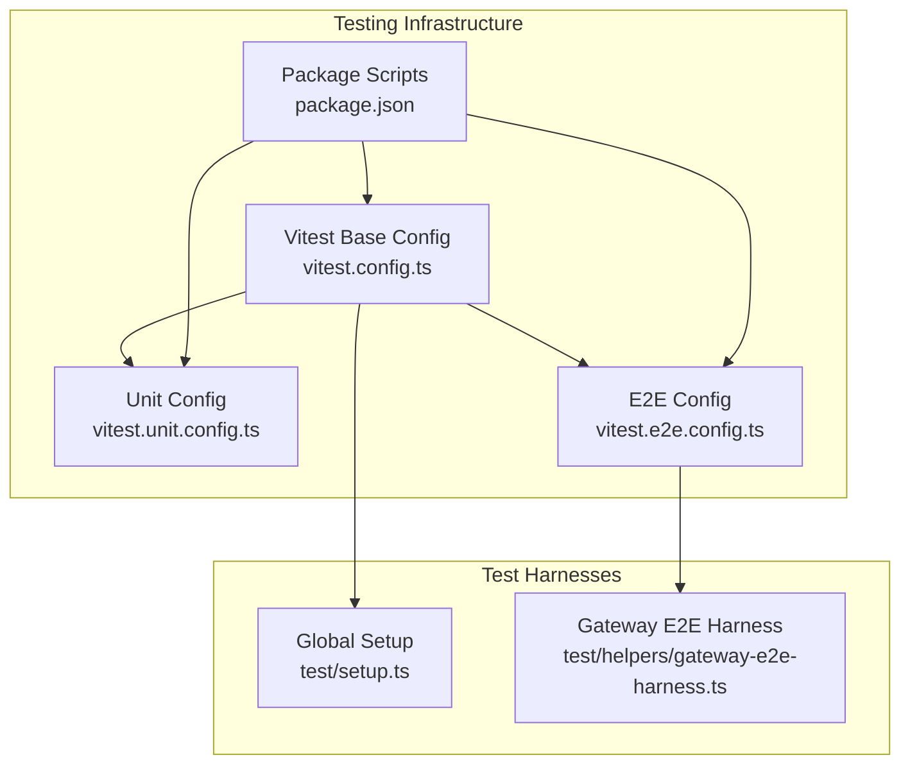
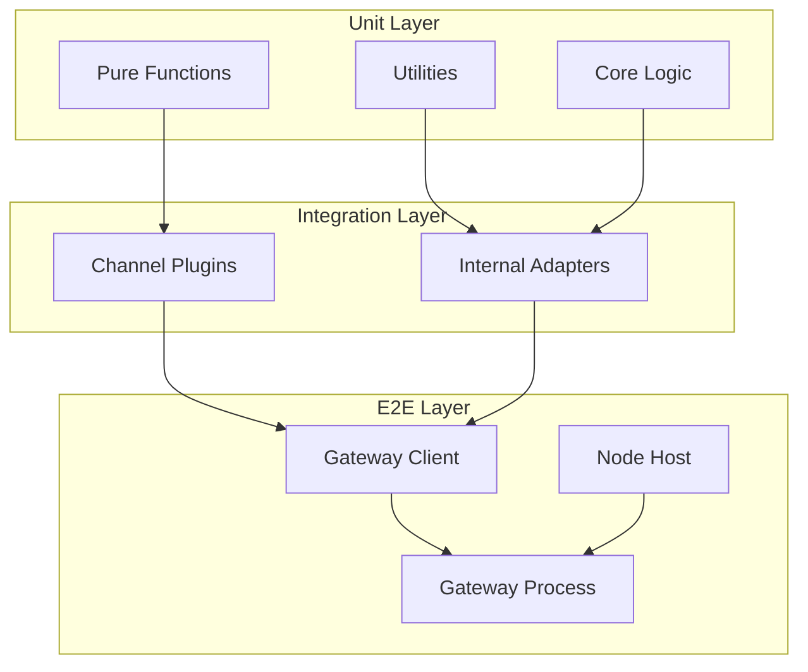
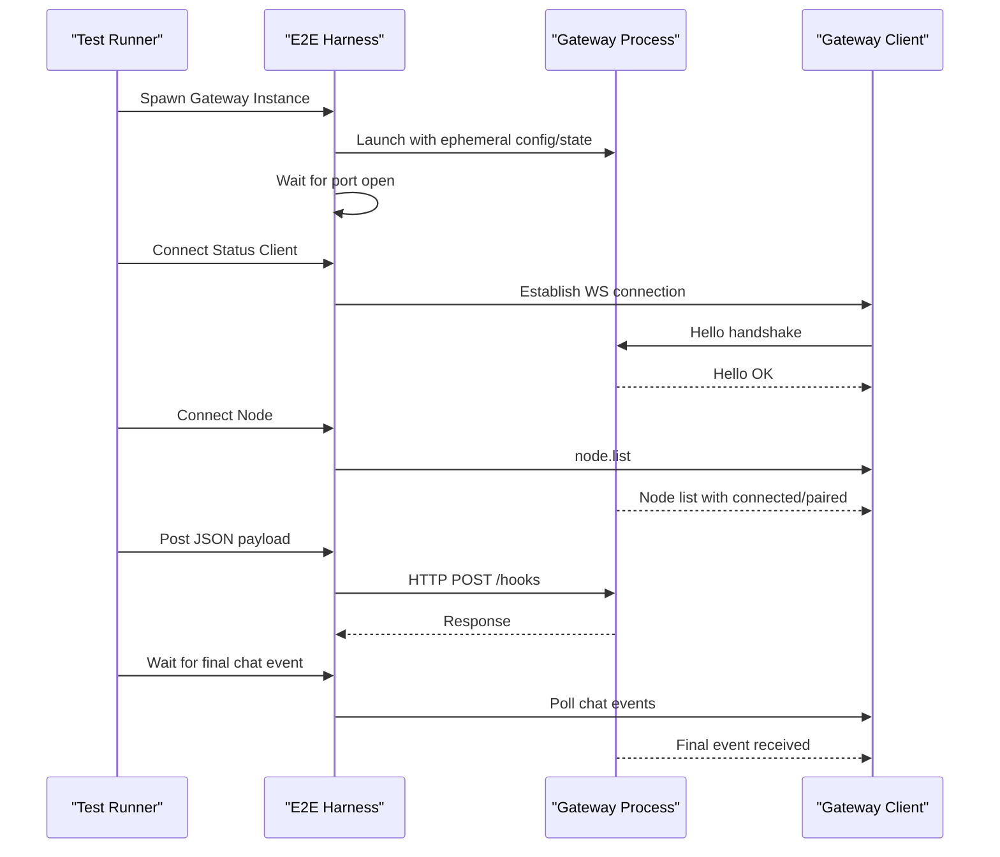
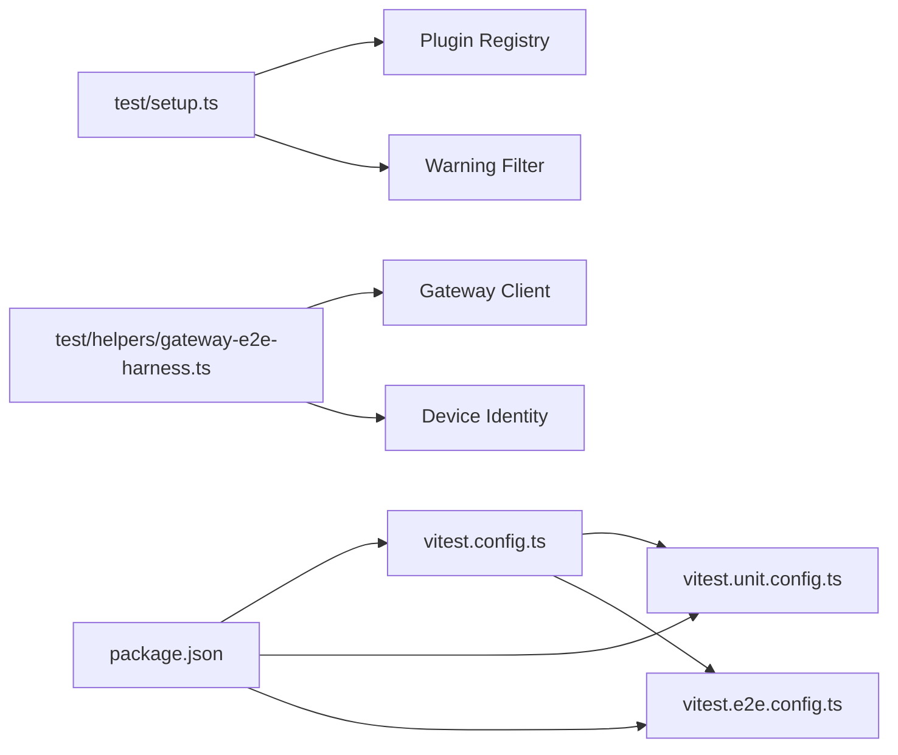

# Skill Testing & Debugging

<cite>
**Referenced Files in This Document**
- [README.md](file://README.md)
- [CONTRIBUTING.md](file://CONTRIBUTING.md)
- [vitest.config.ts](file://vitest.config.ts)
- [vitest.unit.config.ts](file://vitest.unit.config.ts)
- [vitest.e2e.config.ts](file://vitest.e2e.config.ts)
- [package.json](file://package.json)
- [test/setup.ts](file://test/setup.ts)
- [test/helpers/gateway-e2e-harness.ts](file://test/helpers/gateway-e2e-harness.ts)
- [src/test-utils/vitest-mock-fn.ts](file://src/test-utils/vitest-mock-fn.ts)
</cite>

## Table of Contents
1. [Introduction](#introduction)
2. [Project Structure](#project-structure)
3. [Core Components](#core-components)
4. [Architecture Overview](#architecture-overview)
5. [Detailed Component Analysis](#detailed-component-analysis)
6. [Dependency Analysis](#dependency-analysis)
7. [Performance Considerations](#performance-considerations)
8. [Troubleshooting Guide](#troubleshooting-guide)
9. [Conclusion](#conclusion)
10. [Appendices](#appendices)

## Introduction
This document provides comprehensive testing and debugging guidance for developing skills within the OpenClaw ecosystem. It covers unit testing, integration/e2e testing, automated validation, debugging techniques, logging best practices, performance profiling, and continuous integration patterns. The goal is to help contributors and maintainers build reliable, observable, and maintainable skills with confidence.

## Project Structure
OpenClaw uses Vitest as the primary test runner and orchestrator. The repository defines multiple Vitest configurations tailored to different test categories:
- Unit tests: focused on pure logic and isolated modules
- E2E tests: integration-level tests that spawn a Gateway instance and exercise end-to-end flows
- Extension-specific suites: channel plugins and extension tests
- Live tests: optional live-model and gateway connectivity tests
- Coverage thresholds: enforced via v8 coverage provider

Key configuration highlights:
- Global test configuration supports fork-based pools, environment stubbing, and coverage thresholds
- Unit test configuration narrows focus to core modules and excludes heavy integrations
- E2E configuration isolates tests in process forks and controls worker concurrency
- Scripts in package.json drive test execution, coverage, and Docker-based smoke tests

**Diagram sources**
- [vitest.config.ts](file://vitest.config.ts#L57-L202)
- [vitest.unit.config.ts](file://vitest.unit.config.ts#L1-L31)
- [vitest.e2e.config.ts](file://vitest.e2e.config.ts#L1-L33)
- [package.json](file://package.json#L217-L334)
- [test/setup.ts](file://test/setup.ts#L1-L195)
- [test/helpers/gateway-e2e-harness.ts](file://test/helpers/gateway-e2e-harness.ts#L1-L383)

**Section sources**
- [README.md](file://README.md#L1-L560)
- [CONTRIBUTING.md](file://CONTRIBUTING.md#L76-L90)
- [vitest.config.ts](file://vitest.config.ts#L57-L202)
- [vitest.unit.config.ts](file://vitest.unit.config.ts#L1-L31)
- [vitest.e2e.config.ts](file://vitest.e2e.config.ts#L1-L33)
- [package.json](file://package.json#L217-L334)

## Core Components
- Vitest configuration and coverage:
  - Base config defines timeouts, environment stubbing, worker counts, include/exclude patterns, and coverage thresholds
  - Unit config filters out heavy integrations and focuses on core modules
  - E2E config enforces process forks and controlled concurrency
- Global setup:
  - Isolates HOME/state directories, installs warning filters, and initializes a default plugin registry for channel adapters
  - Ensures fake timers are reset between tests
- E2E harness:
  - Spawns a Gateway instance with ephemeral config and state directories
  - Provides helpers to connect clients, wait for node pairing, and collect chat events
  - Offers HTTP helpers for posting JSON payloads to the Gateway
- Mock utilities:
  - Centralized mock function type for consistent mocking across test harnesses

Practical implications for skill development:
- Prefer unit tests for pure logic and small modules
- Use E2E tests to validate skill interactions with the Gateway and channel adapters
- Leverage the global setup to reduce boilerplate and ensure isolation
- Use the E2E harness to simulate real-world flows without external dependencies

**Section sources**
- [vitest.config.ts](file://vitest.config.ts#L57-L202)
- [vitest.unit.config.ts](file://vitest.unit.config.ts#L1-L31)
- [vitest.e2e.config.ts](file://vitest.e2e.config.ts#L1-L33)
- [test/setup.ts](file://test/setup.ts#L1-L195)
- [test/helpers/gateway-e2e-harness.ts](file://test/helpers/gateway-e2e-harness.ts#L1-L383)
- [src/test-utils/vitest-mock-fn.ts](file://src/test-utils/vitest-mock-fn.ts#L1-L7)

## Architecture Overview
The testing architecture separates concerns across layers:
- Unit layer: isolated modules, stubbed dependencies, and focused assertions
- Integration layer: channel plugins and internal APIs mocked or stubbed
- E2E layer: real Gateway process, real clients, and end-to-end flows

[No sources needed since this diagram shows conceptual workflow, not actual code structure]

## Detailed Component Analysis

### Unit Testing Framework
- Scope and exclusions:
  - Includes core modules under src/, extensions/, and test/ directories
  - Excludes heavy integrations (channels, agents, gateway server, browser, etc.) to keep unit tests fast and stable
- Coverage:
  - Enforces minimum thresholds for lines, functions, branches, and statements
  - Anchors coverage to the repository’s src/ folder to avoid counting workspace packages
- Worker configuration:
  - Uses process forks for determinism and environment isolation
  - Adjusts worker counts based on CI and local environments

Best practices for skills:
- Write unit tests for skill logic, validators, and transformers
- Keep tests focused and deterministic
- Use the global setup to minimize fixture creation

**Section sources**
- [vitest.config.ts](file://vitest.config.ts#L71-L100)
- [vitest.config.ts](file://vitest.config.ts#L101-L200)
- [vitest.unit.config.ts](file://vitest.unit.config.ts#L6-L29)

### Integration Testing Strategies
- Channel adapter testing:
  - The global setup creates a default plugin registry with stubbed channel adapters (Discord, Slack, Telegram, WhatsApp, Signal, iMessage)
  - Tests can override the active registry per-suite or per-test to validate skill behavior across channels
- Outbound stubs:
  - Helpers provide a generic outbound adapter that routes to channel-specific send functions when available
- Environment isolation:
  - Tests run with isolated HOME directories and suppressed warnings to prevent cross-test contamination

Practical tips:
- Validate skill behavior across multiple channels by swapping registries
- Stub outbound sends to assert delivery behavior without relying on external services
- Use environment stubbing to simulate missing credentials or partial configurations

**Section sources**
- [test/setup.ts](file://test/setup.ts#L24-L57)
- [test/setup.ts](file://test/setup.ts#L59-L82)
- [test/setup.ts](file://test/setup.ts#L131-L176)

### Automated Validation Processes
- Coverage enforcement:
  - Coverage thresholds ensure meaningful test coverage without bloating excludes
  - Thresholds are tuned to balance quality and maintainability
- Script-driven execution:
  - Scripts in package.json orchestrate linting, building, unit tests, E2E tests, live tests, and Docker smoke tests
  - Parallel execution is supported via a dedicated script

Guidance:
- Run the full test suite locally before submitting changes
- Monitor coverage reports to identify untested areas
- Use Docker-based smoke tests to validate installation and basic flows

**Section sources**
- [vitest.config.ts](file://vitest.config.ts#L101-L112)
- [package.json](file://package.json#L299-L334)

### End-to-End (E2E) Testing
- E2E configuration:
  - Forces process forks for deterministic isolation
  - Controls worker concurrency and verbosity via environment variables
- E2E harness:
  - Spawns a Gateway instance with a temporary config and state directory
  - Provides helpers to connect clients, wait for node pairing, and collect chat events
  - Offers HTTP helpers to post JSON payloads to the Gateway

Common E2E scenarios:
- Pairing a node and validating readiness
- Sending a message through a skill and asserting the final chat event
- Verifying webhook or control-plane interactions

**Diagram sources**
- [test/helpers/gateway-e2e-harness.ts](file://test/helpers/gateway-e2e-harness.ts#L104-L191)
- [test/helpers/gateway-e2e-harness.ts](file://test/helpers/gateway-e2e-harness.ts#L265-L288)
- [test/helpers/gateway-e2e-harness.ts](file://test/helpers/gateway-e2e-harness.ts#L339-L362)
- [test/helpers/gateway-e2e-harness.ts](file://test/helpers/gateway-e2e-harness.ts#L220-L263)

**Section sources**
- [vitest.e2e.config.ts](file://vitest.e2e.config.ts#L1-L33)
- [test/helpers/gateway-e2e-harness.ts](file://test/helpers/gateway-e2e-harness.ts#L1-L383)

### Mock Implementations and Utilities
- Centralized mock function type:
  - Provides a consistent MockFn type for test harnesses under src/
  - Avoids TypeScript inference pitfalls and improves type safety
- Global setup utilities:
  - Warning filters and plugin registry management
  - Isolation of HOME/state directories

Recommendations:
- Use MockFn for all mocks in test harnesses to maintain consistency
- Reuse the global setup to avoid repetitive initialization
- Keep mocks minimal and focused on the behavior under test

**Section sources**
- [src/test-utils/vitest-mock-fn.ts](file://src/test-utils/vitest-mock-fn.ts#L1-L7)
- [test/setup.ts](file://test/setup.ts#L1-L195)

### Continuous Integration Patterns and Quality Assurance
- CI status badge:
  - The repository README displays a CI status badge indicating current workflow health
- Contribution guidelines:
  - Contributors are encouraged to run tests locally and ensure CI checks pass
- Script-driven QA:
  - Scripts cover linting, building, unit tests, E2E tests, live tests, and Docker smoke tests
  - Coverage is enforced via v8 provider and thresholds

Quality gates:
- Local verification: build, check, and test
- CI verification: all scripts and coverage thresholds
- Docker smoke tests: installation and basic flows

**Section sources**
- [README.md](file://README.md#L15-L19)
- [CONTRIBUTING.md](file://CONTRIBUTING.md#L82-L90)
- [package.json](file://package.json#L299-L334)

## Dependency Analysis
Testing dependencies and relationships:
- Vitest base configuration is extended by unit and E2E configs
- Global setup depends on plugin runtime and test utilities
- E2E harness depends on Gateway client and device identity utilities
- Scripts orchestrate all testing activities and Docker-based smoke tests

**Diagram sources**
- [vitest.config.ts](file://vitest.config.ts#L57-L202)
- [vitest.unit.config.ts](file://vitest.unit.config.ts#L1-L31)
- [vitest.e2e.config.ts](file://vitest.e2e.config.ts#L1-L33)
- [test/setup.ts](file://test/setup.ts#L1-L195)
- [test/helpers/gateway-e2e-harness.ts](file://test/helpers/gateway-e2e-harness.ts#L1-L383)
- [package.json](file://package.json#L217-L334)

**Section sources**
- [vitest.config.ts](file://vitest.config.ts#L57-L202)
- [vitest.unit.config.ts](file://vitest.unit.config.ts#L1-L31)
- [vitest.e2e.config.ts](file://vitest.e2e.config.ts#L1-L33)
- [test/setup.ts](file://test/setup.ts#L1-L195)
- [test/helpers/gateway-e2e-harness.ts](file://test/helpers/gateway-e2e-harness.ts#L1-L383)
- [package.json](file://package.json#L217-L334)

## Performance Considerations
- Worker configuration:
  - Base config dynamically adjusts workers based on CI and local CPU counts
  - E2E config limits workers to keep runs deterministic and efficient
- Coverage scope:
  - Coverage is anchored to src/ to avoid counting workspace packages and reduce noise
- Test timeouts:
  - Unit and hook timeouts are tuned to balance reliability and speed

Recommendations:
- Keep unit tests fast; avoid heavy I/O or external dependencies
- Use E2E sparingly; reserve for critical flows
- Monitor coverage trends to detect regressions early

[No sources needed since this section provides general guidance]

## Troubleshooting Guide
Common debugging scenarios and techniques:
- Environment leakage:
  - The base config enables unstubbing of environment variables and globals to prevent cross-test pollution under vmForks
- Deterministic E2E runs:
  - E2E config forces process forks and allows overriding worker counts via environment variables
- Gateway E2E harness:
  - Spawns a Gateway instance with ephemeral config and state directories
  - Provides helpers to connect clients, wait for node pairing, and collect chat events
  - Offers HTTP helpers to post JSON payloads to the Gateway

Practical steps:
- If tests hang, increase verbosity for E2E runs and inspect stdout/stderr
- If environment-dependent tests fail, ensure environment stubbing is applied
- For E2E flakiness, reduce worker count or run tests serially

**Section sources**
- [vitest.config.ts](file://vitest.config.ts#L74-L78)
- [vitest.e2e.config.ts](file://vitest.e2e.config.ts#L22-L31)
- [test/helpers/gateway-e2e-harness.ts](file://test/helpers/gateway-e2e-harness.ts#L104-L191)
- [test/helpers/gateway-e2e-harness.ts](file://test/helpers/gateway-e2e-harness.ts#L265-L288)
- [test/helpers/gateway-e2e-harness.ts](file://test/helpers/gateway-e2e-harness.ts#L339-L362)
- [test/helpers/gateway-e2e-harness.ts](file://test/helpers/gateway-e2e-harness.ts#L220-L263)

## Conclusion
OpenClaw’s testing and debugging framework emphasizes isolation, determinism, and coverage. By leveraging unit tests for pure logic, integration tests for channel adapters, and E2E tests for end-to-end flows, contributors can build robust skills. The provided harnesses, utilities, and CI patterns ensure consistent quality and reliable development workflows.

[No sources needed since this section summarizes without analyzing specific files]

## Appendices
- Example test scripts and commands:
  - Run unit tests: pnpm test:fast
  - Run E2E tests: pnpm test:e2e
  - Run coverage: pnpm test:coverage
  - Run Docker smoke tests: pnpm test:docker:all
- Mock function type:
  - Use MockFn for consistent mocking across test harnesses

**Section sources**
- [package.json](file://package.json#L299-L334)
- [src/test-utils/vitest-mock-fn.ts](file://src/test-utils/vitest-mock-fn.ts#L1-L7)