# Skill Platform

<cite>
**Referenced Files in This Document**
- [README.md](file://README.md)
- [skills.md](file://docs/tools/skills.md)
- [clawhub.md](file://docs/tools/clawhub.md)
- [skills-config.md](file://docs/tools/skills-config.md)
- [sandboxing.md](file://docs/gateway/sandboxing.md)
- [hubs.md](file://docs/start/hubs.md)
- [clawhub/SKILL.md](file://skills/clawhub/SKILL.md)
- [skill-creator/SKILL.md](file://skills/skill-creator/SKILL.md)
- [openclaw.plugin.json](file://extensions/lobster/openclaw.plugin.json)
</cite>

## Table of Contents
1. [Introduction](#introduction)
2. [Project Structure](#project-structure)
3. [Core Components](#core-components)
4. [Architecture Overview](#architecture-overview)
5. [Detailed Component Analysis](#detailed-component-analysis)
6. [Dependency Analysis](#dependency-analysis)
7. [Performance Considerations](#performance-considerations)
8. [Troubleshooting Guide](#troubleshooting-guide)
9. [Conclusion](#conclusion)
10. [Appendices](#appendices)

## Introduction
This document describes OpenClaw’s skill platform and the ClawHub ecosystem. It explains how skills are discovered, installed, and managed across bundled, managed/local, and workspace locations; how skills relate to tools and configuration; and how the lifecycle of skills is governed. It also covers security, sandboxing, and performance considerations, and provides practical workflows for installing, updating, and developing skills.

## Project Structure
OpenClaw organizes skills as directories with a standardized metadata file and optional bundled resources. The platform supports:
- Bundled skills shipped with the product
- Managed/local skills under the user’s home directory
- Workspace skills under each agent’s workspace
- Plugin-provided skills
- ClawHub for discovery, installation, and synchronization

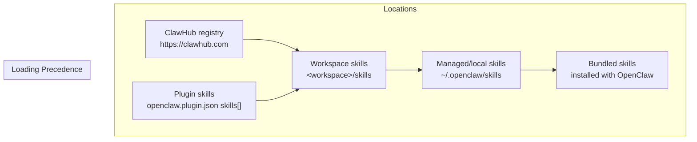

**Diagram sources**
- [skills.md](file://docs/tools/skills.md#L13-L48)
- [clawhub.md](file://docs/tools/clawhub.md#L67-L72)

**Section sources**
- [skills.md](file://docs/tools/skills.md#L13-L48)
- [hubs.md](file://docs/start/hubs.md#L166-L178)

## Core Components
- Skills registry (ClawHub): Public registry for discovering, downloading, and publishing skills.
- Skills loader: Loads skills from multiple locations with precedence rules and gating.
- Skill configuration: Controls enablement, environment injection, and per-skill overrides.
- Sandbox integration: Optional containerization of tool execution to constrain risk.
- Plugin skills: Skills bundled within plugins that participate in the same loading and gating rules.

**Section sources**
- [skills.md](file://docs/tools/skills.md#L50-L77)
- [clawhub.md](file://docs/tools/clawhub.md#L10-L27)
- [skills-config.md](file://docs/tools/skills-config.md#L11-L78)
- [sandboxing.md](file://docs/gateway/sandboxing.md#L10-L17)

## Architecture Overview
The skill platform integrates with the agent runtime and tools. Skills are represented as directories with a metadata file and optional scripts/references. At runtime, eligible skills are injected into the system prompt and can be invoked via user slash commands or model dispatch depending on skill metadata.

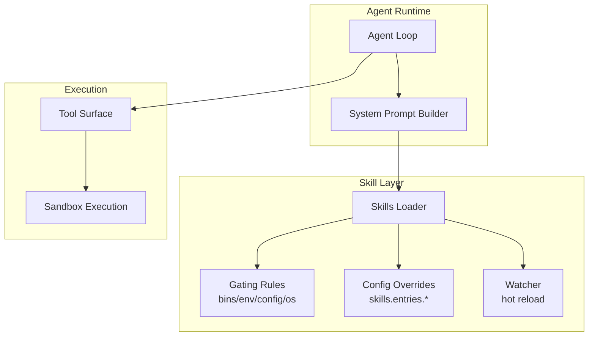

**Diagram sources**
- [skills.md](file://docs/tools/skills.md#L106-L187)
- [skills-config.md](file://docs/tools/skills-config.md#L13-L78)
- [sandboxing.md](file://docs/gateway/sandboxing.md#L19-L37)

## Detailed Component Analysis

### Skills Registry (ClawHub)
ClawHub is the public skills registry and CLI for discovery, installation, updates, and publishing. It indexes skills with metadata and supports versioning and tags.

- Discovery and installation: Search, install, update, list, and publish via CLI.
- Workflows: Install into workspace or managed directory; sync backups; versioning with semver and tags.
- Security and moderation: Open by default with thresholds for reports; moderators can act on reported content.

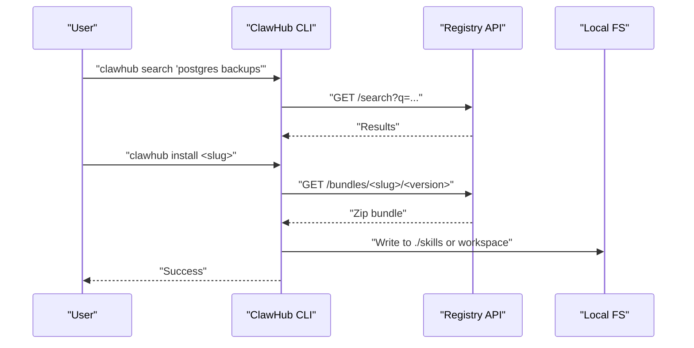

**Diagram sources**
- [clawhub.md](file://docs/tools/clawhub.md#L118-L186)
- [clawhub.md](file://docs/tools/clawhub.md#L188-L221)

**Section sources**
- [clawhub.md](file://docs/tools/clawhub.md#L10-L27)
- [clawhub.md](file://docs/tools/clawhub.md#L118-L186)
- [clawhub.md](file://docs/tools/clawhub.md#L188-L258)

### Skills Loading, Gating, and Precedence
Skills are loaded from multiple sources with clear precedence and gating rules:
- Sources: bundled → managed/local → workspace (plus plugin skills and extraDirs)
- Gating: bins, env, config, OS, always, install metadata
- Overrides: enable/disable, env injection, apiKey, allowBundled
- Hot reload: watcher refreshes skills snapshot on changes

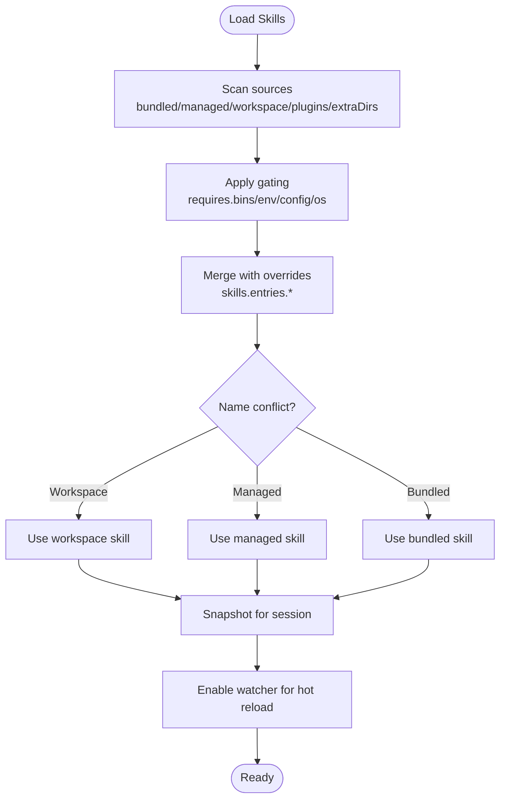

**Diagram sources**
- [skills.md](file://docs/tools/skills.md#L13-L48)
- [skills.md](file://docs/tools/skills.md#L106-L187)
- [skills-config.md](file://docs/tools/skills-config.md#L13-L78)

**Section sources**
- [skills.md](file://docs/tools/skills.md#L13-L48)
- [skills.md](file://docs/tools/skills.md#L106-L187)
- [skills-config.md](file://docs/tools/skills-config.md#L13-L78)

### Relationship Between Skills and Tools
Skills teach the agent how to use tools. They can be invoked directly via slash commands or dispatched to tools depending on metadata. The agent’s system prompt includes a compact list of eligible skills to guide invocation.

- Slash command dispatch: optional tool dispatch bypass for direct tool invocation
- Tool policy: gating still applies even under sandboxing
- Session snapshot: eligible skills cached per session; watcher refreshes mid-session when enabled

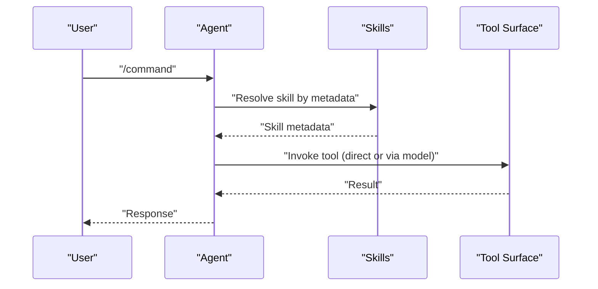

**Diagram sources**
- [skills.md](file://docs/tools/skills.md#L95-L105)
- [skills.md](file://docs/tools/skills.md#L242-L247)

**Section sources**
- [skills.md](file://docs/tools/skills.md#L95-L105)
- [skills.md](file://docs/tools/skills.md#L242-L247)

### Skill Configuration and Environment Injection
Configuration controls which skills are eligible and how environment variables are injected during agent runs. Secrets can be provided via config or secret references.

- Entries: enable/disable, env, apiKey, custom config fields
- Env injection: scoped to agent run; restored after run
- Secrets: keep out of prompts/logs; use secret refs when available

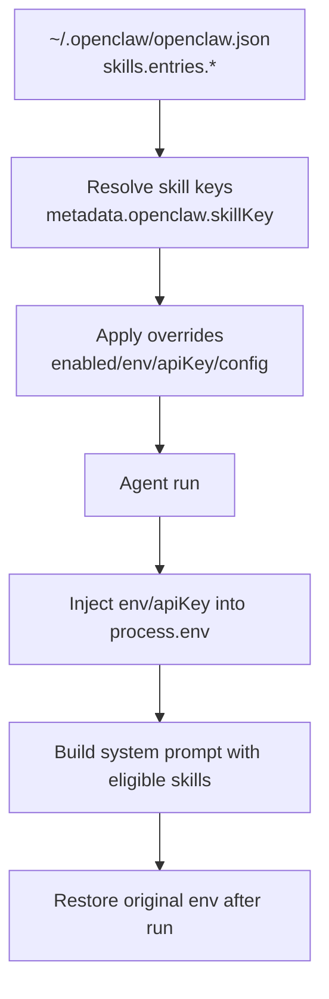

**Diagram sources**
- [skills-config.md](file://docs/tools/skills-config.md#L26-L78)
- [skills.md](file://docs/tools/skills.md#L230-L241)

**Section sources**
- [skills-config.md](file://docs/tools/skills-config.md#L26-L78)
- [skills.md](file://docs/tools/skills.md#L230-L241)

### Sandbox Integration and Security
Skills can run inside Docker sandboxes to limit filesystem/process access. The sandbox applies tool policy and can mirror eligible skills into the sandbox workspace.

- Modes: off/non-main/all
- Scope: session/agent/shared
- Workspace access: none/ro/rw
- Setup: default image, common image, browser image; setupCommand for one-time container setup
- Tool policy and elevated exec: escape hatches still apply

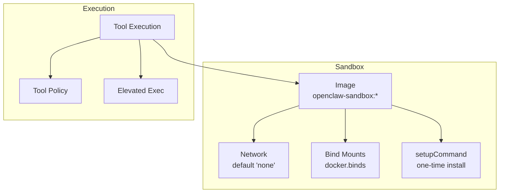

**Diagram sources**
- [sandboxing.md](file://docs/gateway/sandboxing.md#L39-L56)
- [sandboxing.md](file://docs/gateway/sandboxing.md#L117-L150)
- [sandboxing.md](file://docs/gateway/sandboxing.md#L199-L217)

**Section sources**
- [sandboxing.md](file://docs/gateway/sandboxing.md#L10-L17)
- [sandboxing.md](file://docs/gateway/sandboxing.md#L39-L56)
- [sandboxing.md](file://docs/gateway/sandboxing.md#L117-L150)
- [sandboxing.md](file://docs/gateway/sandboxing.md#L199-L217)

### Plugin Skills
Plugins can ship their own skills via a manifest. When enabled, plugin skills participate in the normal precedence and gating rules.

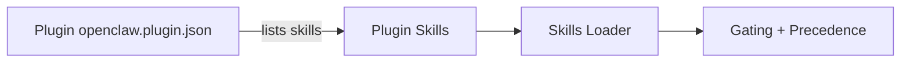

**Diagram sources**
- [skills.md](file://docs/tools/skills.md#L41-L48)
- [openclaw.plugin.json](file://extensions/lobster/openclaw.plugin.json#L1-L11)

**Section sources**
- [skills.md](file://docs/tools/skills.md#L41-L48)
- [openclaw.plugin.json](file://extensions/lobster/openclaw.plugin.json#L1-L11)

### Skill Lifecycle Management
Lifecycle stages include discovery, installation, updates, and publishing. Workspace skills take precedence over managed and bundled skills.

- Discovery: browse or search via ClawHub
- Installation: install into workspace or managed directory
- Updates: update to latest or specific version; hash-based matching
- Publishing: publish or sync backups; versioning and tags

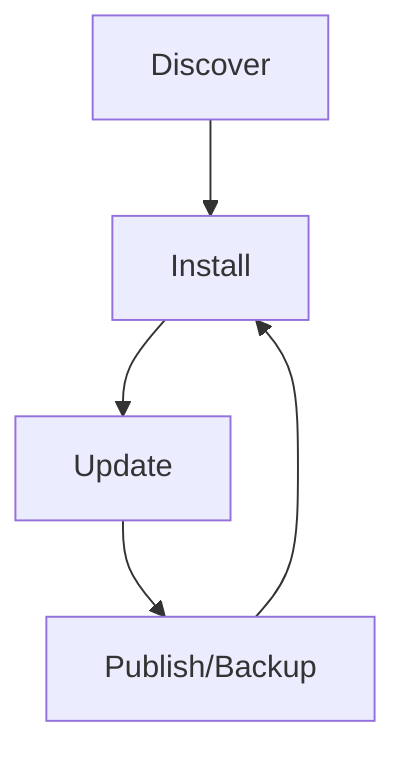

**Diagram sources**
- [clawhub.md](file://docs/tools/clawhub.md#L188-L221)
- [skills.md](file://docs/tools/skills.md#L287-L292)

**Section sources**
- [clawhub.md](file://docs/tools/clawhub.md#L188-L221)
- [skills.md](file://docs/tools/skills.md#L287-L292)

### Skill Development Guidelines
Use the built-in skill-creator skill to author, audit, and package skills following AgentSkills compatibility. The creator skill outlines best practices for structure, progressive disclosure, and resource organization.

- Structure: SKILL.md with frontmatter + Markdown body; optional scripts/references/assets
- Progressive disclosure: metadata always, body on trigger, resources on demand
- Authoring process: understand, plan, initialize, edit, package, iterate

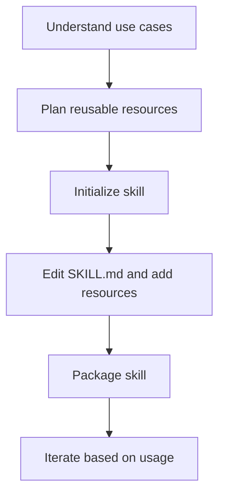

**Diagram sources**
- [skill-creator/SKILL.md](file://skills/skill-creator/SKILL.md#L201-L211)
- [skill-creator/SKILL.md](file://skills/skill-creator/SKILL.md#L263-L293)

**Section sources**
- [skill-creator/SKILL.md](file://skills/skill-creator/SKILL.md#L10-L120)
- [skill-creator/SKILL.md](file://skills/skill-creator/SKILL.md#L201-L211)
- [skill-creator/SKILL.md](file://skills/skill-creator/SKILL.md#L263-L293)

## Dependency Analysis
The skill platform depends on:
- Configuration schema for skills and sandbox
- Tool policy and sandbox configuration
- Plugin manifests for plugin-provided skills
- ClawHub CLI for registry operations

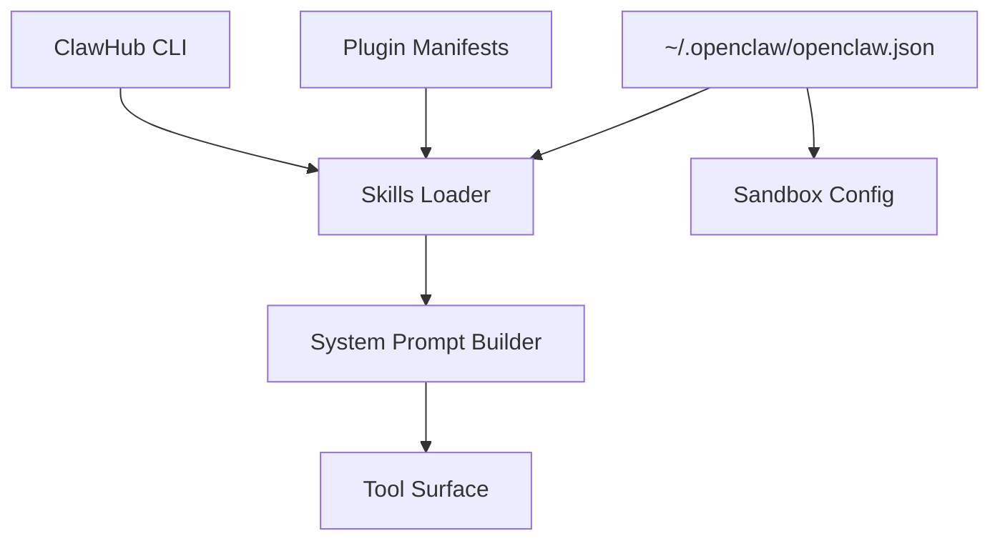

**Diagram sources**
- [skills-config.md](file://docs/tools/skills-config.md#L13-L78)
- [sandboxing.md](file://docs/gateway/sandboxing.md#L117-L150)
- [skills.md](file://docs/tools/skills.md#L41-L48)
- [clawhub.md](file://docs/tools/clawhub.md#L118-L186)

**Section sources**
- [skills-config.md](file://docs/tools/skills-config.md#L13-L78)
- [sandboxing.md](file://docs/gateway/sandboxing.md#L117-L150)
- [skills.md](file://docs/tools/skills.md#L41-L48)
- [clawhub.md](file://docs/tools/clawhub.md#L118-L186)

## Performance Considerations
- Token impact: skills list injected into system prompt; overhead is deterministic and increases with number and length of skill fields
- Snapshot caching: eligible skills snapshot taken per session and reused; watcher refreshes mid-session when enabled
- Workspace access: read-only workspace reduces unnecessary writes; bind mounts bypass sandbox filesystem

**Section sources**
- [skills.md](file://docs/tools/skills.md#L269-L286)
- [skills.md](file://docs/tools/skills.md#L242-L247)
- [sandboxing.md](file://docs/gateway/sandboxing.md#L57-L70)

## Troubleshooting Guide
- Untrusted skills: treat third-party skills as untrusted; read before enabling
- Security defaults: review DM pairing and allowlists; run diagnostics
- Sandbox pitfalls: ensure network and writable root for setupCommand; combine with workspaceAccess; avoid dangerous bind sources
- Watcher not triggering: confirm watch settings and debounce; verify file changes are within resolved realpath bounds
- Environment leakage: secrets should not appear in prompts/logs; use secret refs and sandbox env injection

**Section sources**
- [skills.md](file://docs/tools/skills.md#L69-L77)
- [README.md](file://README.md#L112-L125)
- [sandboxing.md](file://docs/gateway/sandboxing.md#L109-L116)
- [sandboxing.md](file://docs/gateway/sandboxing.md#L209-L217)
- [skills.md](file://docs/tools/skills.md#L254-L267)

## Conclusion
OpenClaw’s skill platform provides a flexible, secure, and extensible way to enhance agent capabilities. With multiple load locations, robust gating, and strong sandboxing, teams can discover, install, and manage skills confidently. ClawHub simplifies distribution and collaboration, while configuration and watcher features streamline lifecycle management.

## Appendices

### Quick Reference: Skill Locations and Precedence
- Bundled → Managed/local → Workspace (plugins and extraDirs participate with lowest precedence)

**Section sources**
- [skills.md](file://docs/tools/skills.md#L13-L48)

### Quick Reference: ClawHub CLI Commands
- Search, install, update, list, publish, sync

**Section sources**
- [clawhub.md](file://docs/tools/clawhub.md#L141-L186)
- [clawhub.md](file://docs/tools/clawhub.md#L188-L221)

### Quick Reference: Security and Sandbox Defaults
- Treat third-party skills as untrusted
- Sandbox default allowlist/deny and workspace access modes

**Section sources**
- [skills.md](file://docs/tools/skills.md#L69-L77)
- [sandboxing.md](file://docs/gateway/sandboxing.md#L39-L56)
- [sandboxing.md](file://docs/gateway/sandboxing.md#L57-L70)