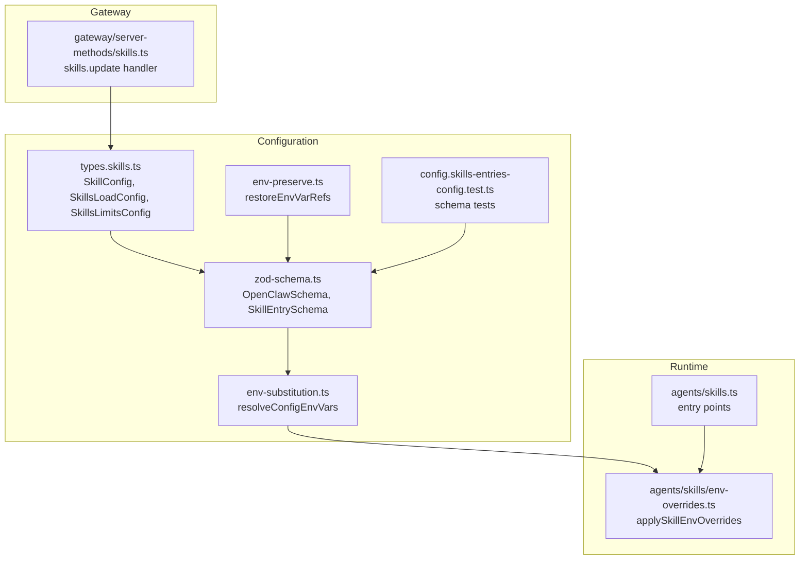
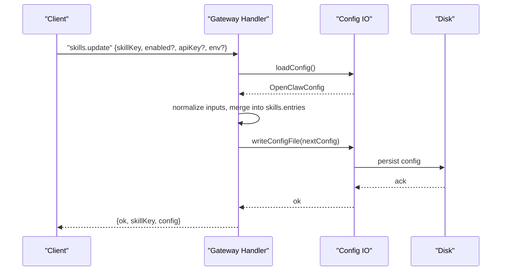
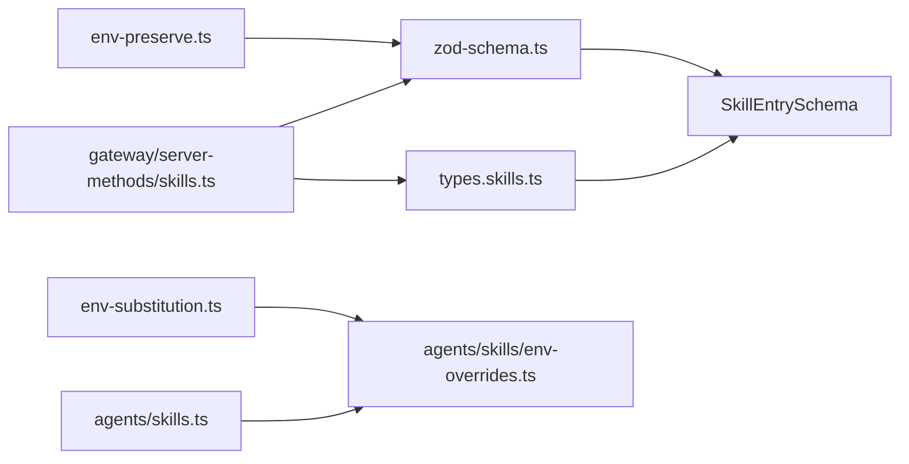

# Skill Configuration & Management

<cite>
**Referenced Files in This Document**
- [src/config/types.skills.ts](file://src/config/types.skills.ts)
- [src/config/zod-schema.ts](file://src/config/zod-schema.ts)
- [src/config/env-substitution.ts](file://src/config/env-substitution.ts)
- [src/config/env-preserve.ts](file://src/config/env-preserve.ts)
- [src/config/config.skills-entries-config.test.ts](file://src/config/config.skills-entries-config.test.ts)
- [src/agents/skills.ts](file://src/agents/skills.ts)
- [src/agents/skills/env-overrides.ts](file://src/agents/skills/env-overrides.ts)
- [src/gateway/server-methods/skills.ts](file://src/gateway/server-methods/skills.ts)
</cite>

## Table of Contents
1. [Introduction](#introduction)
2. [Project Structure](#project-structure)
3. [Core Components](#core-components)
4. [Architecture Overview](#architecture-overview)
5. [Detailed Component Analysis](#detailed-component-analysis)
6. [Dependency Analysis](#dependency-analysis)
7. [Performance Considerations](#performance-considerations)
8. [Troubleshooting Guide](#troubleshooting-guide)
9. [Conclusion](#conclusion)

## Introduction
This document explains how skills are configured and managed at runtime, focusing on:
- The skills.entries configuration structure and semantics
- How enabled flags, API key management, environment injection, and custom config fields work
- The skillKey override mechanism and configuration precedence
- Environment injection behavior scoped to agent runs and security considerations
- The skills.load configuration including watch mode and debounce
- Practical workflows for enabling/disabling skills, managing API keys, and troubleshooting configuration issues

## Project Structure
The skill configuration system spans configuration schemas, runtime loaders, environment injection utilities, and gateway handlers that update configuration at runtime.

**Diagram sources**
- [src/config/types.skills.ts](file://src/config/types.skills.ts#L1-L48)
- [src/config/zod-schema.ts](file://src/config/zod-schema.ts#L140-L147)
- [src/config/env-substitution.ts](file://src/config/env-substitution.ts#L197-L203)
- [src/config/env-preserve.ts](file://src/config/env-preserve.ts#L89-L134)
- [src/config/config.skills-entries-config.test.ts](file://src/config/config.skills-entries-config.test.ts#L1-L48)
- [src/agents/skills.ts](file://src/agents/skills.ts#L1-L47)
- [src/agents/skills/env-overrides.ts](file://src/agents/skills/env-overrides.ts#L136-L262)
- [src/gateway/server-methods/skills.ts](file://src/gateway/server-methods/skills.ts#L146-L204)

**Section sources**
- [src/config/types.skills.ts](file://src/config/types.skills.ts#L1-L48)
- [src/config/zod-schema.ts](file://src/config/zod-schema.ts#L140-L147)
- [src/config/env-substitution.ts](file://src/config/env-substitution.ts#L1-L204)
- [src/config/env-preserve.ts](file://src/config/env-preserve.ts#L1-L135)
- [src/config/config.skills-entries-config.test.ts](file://src/config/config.skills-entries-config.test.ts#L1-L48)
- [src/agents/skills.ts](file://src/agents/skills.ts#L1-L47)
- [src/agents/skills/env-overrides.ts](file://src/agents/skills/env-overrides.ts#L136-L262)
- [src/gateway/server-methods/skills.ts](file://src/gateway/server-methods/skills.ts#L146-L204)

## Core Components
- SkillConfig: Defines per-skill settings including enabled flag, apiKey, env overrides, and arbitrary config fields.
- SkillsLoadConfig: Controls scanning behavior, including extraDirs, watch mode, and watchDebounceMs.
- SkillsLimitsConfig: Enforces guardrails for loading and prompting behavior.
- SkillEntrySchema: Zod schema validating skills.entries entries.
- Environment substitution and preservation: Resolve ${VAR} references at load time and preserve them on write-back.
- Runtime environment overrides: Apply env overrides from configuration scoped to agent runs.
- Gateway skills.update: Update enabled, apiKey, and env settings for a skill and persist to disk.

**Section sources**
- [src/config/types.skills.ts](file://src/config/types.skills.ts#L3-L47)
- [src/config/zod-schema.ts](file://src/config/zod-schema.ts#L140-L147)
- [src/config/env-substitution.ts](file://src/config/env-substitution.ts#L197-L203)
- [src/config/env-preserve.ts](file://src/config/env-preserve.ts#L89-L134)
- [src/agents/skills/env-overrides.ts](file://src/agents/skills/env-overrides.ts#L136-L262)
- [src/gateway/server-methods/skills.ts](file://src/gateway/server-methods/skills.ts#L146-L204)

## Architecture Overview
The system separates concerns across configuration parsing, environment handling, runtime application, and remote updates.

**Diagram sources**
- [src/gateway/server-methods/skills.ts](file://src/gateway/server-methods/skills.ts#L146-L204)
- [src/config/config.ts](file://src/config/config.ts#L1-L28)

## Detailed Component Analysis

### Skills.entries configuration structure
- enabled: Boolean flag to enable or disable a skill.
- apiKey: Secret input for the skill; treated as sensitive.
- env: Map of environment variable overrides applied at runtime.
- config: Arbitrary record for custom fields; validated to avoid unknown top-level fields.

Validation and schema:
- SkillEntrySchema enforces allowed fields and strictness.
- Unknown fields in skills.entries are rejected by the schema.

Practical notes:
- Custom fields under config are accepted by the schema and tests demonstrate acceptance of url/token fields.
- Unknown top-level fields (e.g., placing url directly under skills.entries.<skill>) are rejected.

**Section sources**
- [src/config/types.skills.ts](file://src/config/types.skills.ts#L3-L8)
- [src/config/zod-schema.ts](file://src/config/zod-schema.ts#L140-L147)
- [src/config/config.skills-entries-config.test.ts](file://src/config/config.skills-entries-config.test.ts#L5-L46)

### API key management
- apiKey is modeled as a secret input and registered as sensitive in the schema.
- During runtime environment overrides, if a primaryEnv is declared and allowed, the resolved apiKey value can be injected into that environment variable.
- The gateway skills.update handler accepts an apiKey string, normalizes it, and persists it into skills.entries.

Security considerations:
- Treat apiKey as sensitive; avoid logging or exposing it.
- Ensure only necessary env keys are allowed for injection.

**Section sources**
- [src/config/zod-schema.ts](file://src/config/zod-schema.ts#L143-L143)
- [src/agents/skills/env-overrides.ts](file://src/agents/skills/env-overrides.ts#L169-L182)
- [src/gateway/server-methods/skills.ts](file://src/gateway/server-methods/skills.ts#L171-L178)

### Environment injection behavior scoped to agent runs
- applySkillEnvOverrides reads per-skill env overrides from skills.entries and applies them to process.env during a run.
- It tracks active env keys to ensure clean restoration after the run.
- Required env keys and primaryEnv are considered sensitive; overrides are sanitized and warnings are logged for blocked or suspicious keys.
- The function supports applying overrides from either a snapshot or a configuration object.

Lifecycle:
- applySkillEnvOverrides is called at the start of a run to inject env.
- The returned reverter restores env to its previous state after the run.

**Section sources**
- [src/agents/skills/env-overrides.ts](file://src/agents/skills/env-overrides.ts#L136-L262)

### Environment variable substitution and preservation
- resolveConfigEnvVars substitutes ${VAR} references in loaded configuration using process.env. Missing vars cause an error unless an onMissing callback is provided.
- restoreEnvVarRefs preserves ${VAR} references when writing back configuration, ensuring that env var references survive round-trips.

Operational guidance:
- Use $${VAR} to escape literal ${VAR} in configuration.
- Prefer storing secrets via secret inputs rather than plain env references in persisted config.

**Section sources**
- [src/config/env-substitution.ts](file://src/config/env-substitution.ts#L197-L203)
- [src/config/env-preserve.ts](file://src/config/env-preserve.ts#L89-L134)

### skillKey override mechanism and configuration precedence
- skillKey is derived from the skill definition; the gateway skills.update handler uses the provided skillKey to locate and update entries in skills.entries.
- Precedence:
  - skills.entries overrides take effect immediately for the targeted skill.
  - Runtime env overrides apply during a run and are reverted afterward.
  - Schema validation ensures only known fields are accepted; unknown fields are rejected.

**Section sources**
- [src/gateway/server-methods/skills.ts](file://src/gateway/server-methods/skills.ts#L159-L204)
- [src/agents/skills/env-overrides.ts](file://src/agents/skills/env-overrides.ts#L213-L234)

### skills.load configuration
- extraDirs: Additional directories scanned for skills (lowest precedence).
- watch: Enable watching for changes and refreshing the skills snapshot.
- watchDebounceMs: Debounce period for watcher refreshes.

These settings influence how workspace skills are discovered and reloaded.

**Section sources**
- [src/config/types.skills.ts](file://src/config/types.skills.ts#L10-L20)

### Practical workflows

#### Enable or disable a skill
- Use the skills.update handler with enabled flag to toggle a skill’s activation.
- The change is persisted to configuration and effective on subsequent runs.

**Section sources**
- [src/gateway/server-methods/skills.ts](file://src/gateway/server-methods/skills.ts#L168-L170)

#### Manage API keys for a skill
- Use skills.update with apiKey to set or clear a key.
- The handler normalizes the input and writes it into skills.entries.

**Section sources**
- [src/gateway/server-methods/skills.ts](file://src/gateway/server-methods/skills.ts#L171-L178)

#### Inject environment variables for a skill
- Add env overrides in skills.entries for the skill.
- During a run, applySkillEnvOverrides injects these into process.env and tracks them for later restoration.

**Section sources**
- [src/agents/skills/env-overrides.ts](file://src/agents/skills/env-overrides.ts#L157-L203)

#### Configure watch mode and debounce
- Set skills.load.watch and skills.load.watchDebounceMs to control how often and when the skills snapshot is refreshed.

**Section sources**
- [src/config/types.skills.ts](file://src/config/types.skills.ts#L16-L20)

## Dependency Analysis

**Diagram sources**
- [src/config/zod-schema.ts](file://src/config/zod-schema.ts#L140-L147)
- [src/config/types.skills.ts](file://src/config/types.skills.ts#L1-L48)
- [src/config/env-substitution.ts](file://src/config/env-substitution.ts#L197-L203)
- [src/config/env-preserve.ts](file://src/config/env-preserve.ts#L89-L134)
- [src/agents/skills/env-overrides.ts](file://src/agents/skills/env-overrides.ts#L136-L262)
- [src/gateway/server-methods/skills.ts](file://src/gateway/server-methods/skills.ts#L146-L204)
- [src/agents/skills.ts](file://src/agents/skills.ts#L1-L47)

**Section sources**
- [src/config/zod-schema.ts](file://src/config/zod-schema.ts#L140-L147)
- [src/config/types.skills.ts](file://src/config/types.skills.ts#L1-L48)
- [src/config/env-substitution.ts](file://src/config/env-substitution.ts#L197-L203)
- [src/config/env-preserve.ts](file://src/config/env-preserve.ts#L89-L134)
- [src/agents/skills/env-overrides.ts](file://src/agents/skills/env-overrides.ts#L136-L262)
- [src/gateway/server-methods/skills.ts](file://src/gateway/server-methods/skills.ts#L146-L204)
- [src/agents/skills.ts](file://src/agents/skills.ts#L1-L47)

## Performance Considerations
- Watch mode and debounce: Tune watchDebounceMs to balance responsiveness and CPU usage when scanning extraDirs.
- Environment overrides: Minimize the number of env keys injected per run to reduce overhead and contention.
- Limits: Use skills.limits to cap the number of skills loaded and included in prompts to control prompt size and processing cost.

[No sources needed since this section provides general guidance]

## Troubleshooting Guide
Common issues and resolutions:
- Unknown field errors in skills.entries: Ensure only allowed fields (enabled, apiKey, env, config) are used. Unknown fields are rejected by the schema.
- Missing environment variables: resolveConfigEnvVars throws when a referenced ${VAR} is unset. Provide the variable or use onMissing to collect warnings.
- Env var references lost on write-back: restoreEnvVarRefs preserves ${VAR} references when the resolved value matches the original template.
- Conflicts during env overrides: applySkillEnvOverrides sanitizes overrides and warns about blocked or suspicious keys; adjust env overrides to align with requiredEnv and primaryEnv.

**Section sources**
- [src/config/config.skills-entries-config.test.ts](file://src/config/config.skills-entries-config.test.ts#L23-L46)
- [src/config/env-substitution.ts](file://src/config/env-substitution.ts#L29-L37)
- [src/config/env-substitution.ts](file://src/config/env-substitution.ts#L115-L124)
- [src/config/env-preserve.ts](file://src/config/env-preserve.ts#L89-L134)
- [src/agents/skills/env-overrides.ts](file://src/agents/skills/env-overrides.ts#L184-L194)

## Conclusion
The skill configuration system provides a robust, schema-validated way to manage per-skill settings, inject environment variables scoped to agent runs, and update configuration at runtime. By leveraging watch mode, environment substitution/preservation, and strict validation, operators can safely enable/disable skills, manage API keys, and troubleshoot configuration issues with confidence.