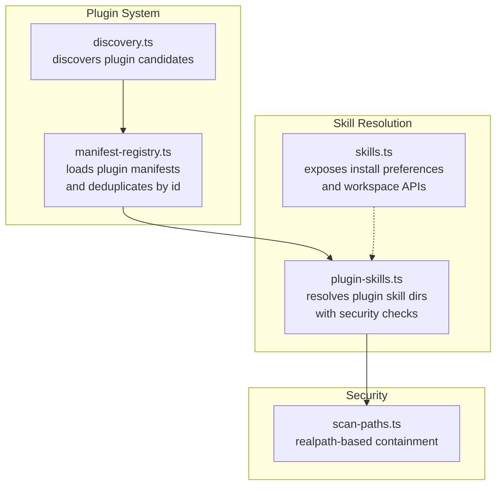
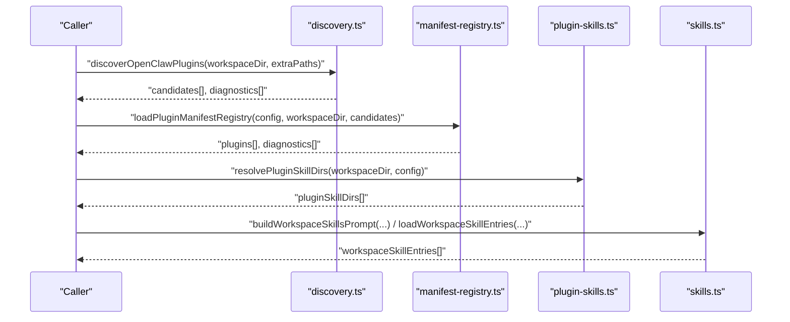
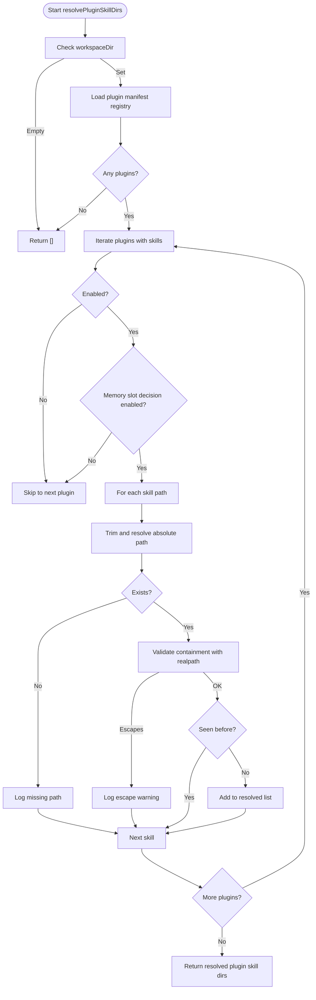
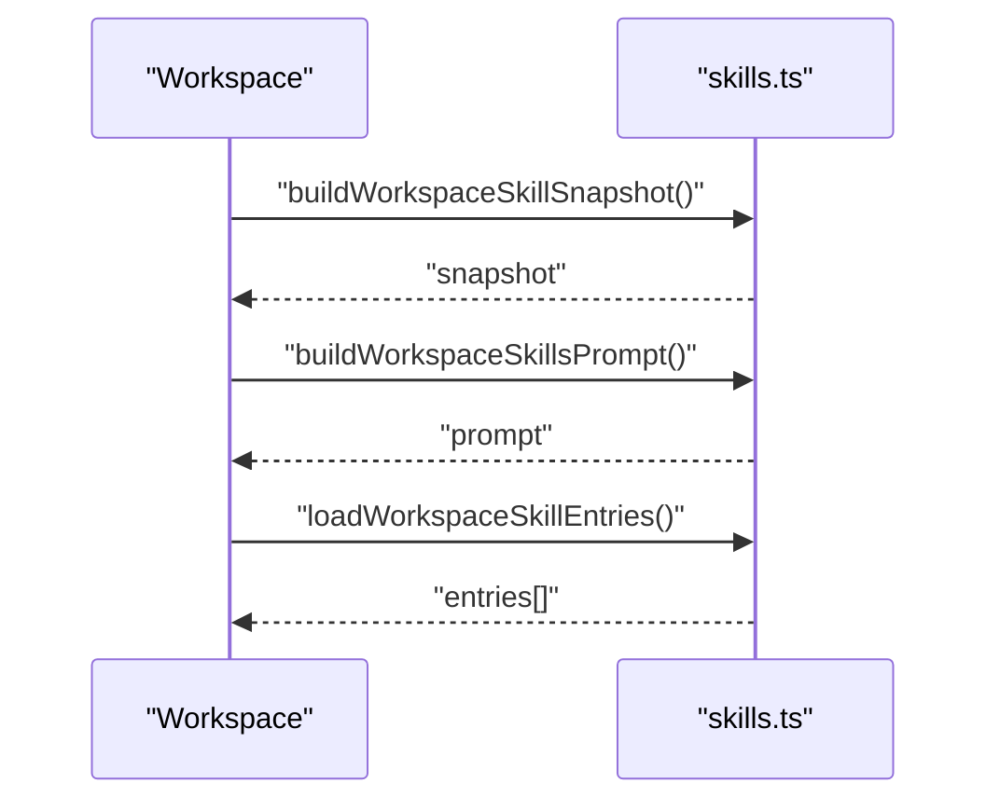
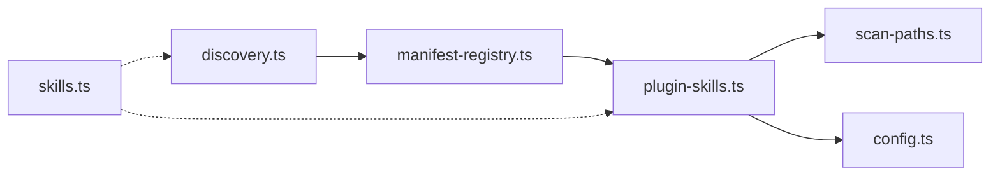

# Skill Discovery & Loading

<cite>
**Referenced Files in This Document**
- [plugin-skills.ts](file://src/agents/skills/plugin-skills.ts)
- [skills-install-download.ts](file://src/agents/skills-install-download.ts)
- [skills.ts](file://src/agents/skills.ts)
- [discovery.ts](file://src/plugins/discovery.ts)
- [manifest-registry.ts](file://src/plugins/manifest-registry.ts)
- [scan-paths.ts](file://src/security/scan-paths.ts)
- [config.ts](file://src/config/config.ts)
</cite>

## Table of Contents
1. [Introduction](#introduction)
2. [Project Structure](#project-structure)
3. [Core Components](#core-components)
4. [Architecture Overview](#architecture-overview)
5. [Detailed Component Analysis](#detailed-component-analysis)
6. [Dependency Analysis](#dependency-analysis)
7. [Performance Considerations](#performance-considerations)
8. [Troubleshooting Guide](#troubleshooting-guide)
9. [Conclusion](#conclusion)

## Introduction
This document explains how OpenClaw discovers and loads skills across three tiers: bundled skills, managed skills, and workspace skills. It also covers how plugin skills integrate into the discovery system and participate in precedence rules. The document details the resolution algorithm, file system scanning patterns, and real path validation for security. It includes configuration options such as skills.load.extraDirs for adding custom skill directories and provides practical examples of skill location hierarchies and troubleshooting steps.

## Project Structure
OpenClaw organizes skills and plugins under distinct subsystems:
- Plugins and plugin discovery scan multiple roots and produce manifests with origin metadata.
- Plugin manifests expose a skills array that maps to skill directories.
- Workspace skills are loaded separately from the workspace’s skills directory.
- Bundled skills are part of the distribution and are scanned with a lower precedence than user-defined overrides.

**Diagram sources**
- [discovery.ts](file://src/plugins/discovery.ts#L618-L711)
- [manifest-registry.ts](file://src/plugins/manifest-registry.ts#L135-L261)
- [plugin-skills.ts](file://src/agents/skills/plugin-skills.ts#L15-L89)
- [scan-paths.ts](file://src/security/scan-paths.ts#L1-L43)
- [skills.ts](file://src/agents/skills.ts#L1-L47)

**Section sources**
- [discovery.ts](file://src/plugins/discovery.ts#L618-L711)
- [manifest-registry.ts](file://src/plugins/manifest-registry.ts#L135-L261)
- [plugin-skills.ts](file://src/agents/skills/plugin-skills.ts#L15-L89)
- [scan-paths.ts](file://src/security/scan-paths.ts#L1-L43)
- [skills.ts](file://src/agents/skills.ts#L1-L47)

## Core Components
- Plugin discovery scans configured roots and directories, validates safety, and produces candidates with origin metadata.
- Manifest registry loads plugin manifests, deduplicates by plugin id, and ranks origins to resolve precedence.
- Plugin skill directory resolution extracts skill directories from enabled plugins, validates containment, and avoids duplicates.
- Workspace skills are resolved independently from the workspace’s skills directory and participate in precedence rules.
- Installation utilities enforce safe downloads and extraction within controlled tool roots.

**Section sources**
- [discovery.ts](file://src/plugins/discovery.ts#L618-L711)
- [manifest-registry.ts](file://src/plugins/manifest-registry.ts#L135-L261)
- [plugin-skills.ts](file://src/agents/skills/plugin-skills.ts#L15-L89)
- [skills.ts](file://src/agents/skills.ts#L1-L47)
- [skills-install-download.ts](file://src/agents/skills-install-download.ts#L104-L238)

## Architecture Overview
The skill discovery and loading architecture follows a layered approach:
- Origins and precedence: config > workspace > global > bundled.
- Plugin discovery locates plugin entry points and package manifests.
- Manifest registry normalizes and deduplicates plugin records by id and origin rank.
- Plugin skill directories are resolved from enabled plugins and validated for containment.
- Workspace skills are resolved from the workspace’s skills directory and merged with plugin skills according to precedence.
- Installation utilities ensure downloads occur within a controlled tool root and are extracted safely.

**Diagram sources**
- [discovery.ts](file://src/plugins/discovery.ts#L618-L711)
- [manifest-registry.ts](file://src/plugins/manifest-registry.ts#L135-L261)
- [plugin-skills.ts](file://src/agents/skills/plugin-skills.ts#L15-L89)
- [skills.ts](file://src/agents/skills.ts#L26-L34)

## Detailed Component Analysis

### Three-Tier Loading System and Precedence Rules
- Tier 1: Bundled skills (lowest precedence). Scanned from the bundled plugins directory.
- Tier 2: Managed skills (workspace overrides). Resolved from the workspace’s skills directory.
- Tier 3: Workspace skills (highest precedence). Scanned from the workspace’s skills directory and merged with managed skills.

Precedence rules:
- Origin ranking: config > workspace > global > bundled.
- Duplicate plugin ids are deduplicated; higher-precedence origins replace lower ones.
- Plugin skill directories are included only if they are enabled and pass containment checks.

Practical hierarchy examples:
- Example A: A plugin skill path inside the workspace overrides a bundled skill with the same id.
- Example B: A plugin skill path added via extraPaths (config) overrides a global plugin skill.
- Example C: A workspace skill directory takes precedence over bundled and managed plugin skills.

**Section sources**
- [manifest-registry.ts](file://src/plugins/manifest-registry.ts#L15-L21)
- [manifest-registry.ts](file://src/plugins/manifest-registry.ts#L203-L231)
- [discovery.ts](file://src/plugins/discovery.ts#L679-L701)
- [discovery.ts](file://src/plugins/discovery.ts#L663-L677)
- [discovery.ts](file://src/plugins/discovery.ts#L644-L662)

### Plugin Skill Discovery and Containment Validation
Plugin skills are resolved from enabled plugins:
- Load the plugin manifest registry from discovery results.
- Normalize plugins config and resolve effective enable state per plugin.
- Resolve memory slot decisions for memory-kind plugins.
- For each plugin with skills, resolve absolute paths, check existence, and validate containment against the plugin root using realpath-based checks.
- Deduplicate resolved paths.

**Diagram sources**
- [plugin-skills.ts](file://src/agents/skills/plugin-skills.ts#L15-L89)
- [scan-paths.ts](file://src/security/scan-paths.ts#L19-L33)

**Section sources**
- [plugin-skills.ts](file://src/agents/skills/plugin-skills.ts#L15-L89)
- [scan-paths.ts](file://src/security/scan-paths.ts#L19-L33)

### Workspace Skills Resolution
Workspace skills are resolved from the workspace’s skills directory:
- Build a snapshot of workspace skills and compute a skills prompt for runtime.
- Load workspace skill entries and filter them as needed.
- Merge workspace skills with managed and plugin skills according to precedence.

**Diagram sources**
- [skills.ts](file://src/agents/skills.ts#L26-L34)

**Section sources**
- [skills.ts](file://src/agents/skills.ts#L26-L34)

### File System Scanning Patterns and Security Validation
Plugin discovery scanning:
- Reads directories and files, filters by supported extensions, and ignores disabled or backup-like directories.
- Validates plugin entry sources against package boundaries and rejects hardlinks for non-bundled origins.
- Enforces safety checks: source must not escape root, paths must not be world-writable, and ownership must match expectations on Unix systems.

Real path validation:
- Uses realpath-based containment checks to prevent symlink escapes.
- Ensures that plugin skill paths reside within the plugin root after canonicalization.

Installation safety:
- Downloads are staged in a temporary directory and written atomically within the skill tools root.
- Target directories are validated to remain within the skill tools root.
- Archive extraction respects stripComponents and is gated by archive type detection.

**Section sources**
- [discovery.ts](file://src/plugins/discovery.ts#L253-L276)
- [discovery.ts](file://src/plugins/discovery.ts#L394-L500)
- [discovery.ts](file://src/plugins/discovery.ts#L502-L616)
- [discovery.ts](file://src/plugins/discovery.ts#L117-L251)
- [scan-paths.ts](file://src/security/scan-paths.ts#L19-L33)
- [skills-install-download.ts](file://src/agents/skills-install-download.ts#L62-L102)
- [skills-install-download.ts](file://src/agents/skills-install-download.ts#L133-L156)
- [skills-install-download.ts](file://src/agents/skills-install-download.ts#L175-L187)
- [skills-install-download.ts](file://src/agents/skills-install-download.ts#L210-L229)

### Configuration Options and Extra Skill Directories
- skills.load.extraDirs: Adds custom directories to the skill loading pipeline. These directories are scanned alongside workspace, global, and bundled roots, participating in precedence rules.
- plugins.load.paths: Controls plugin discovery roots; plugin candidates from these paths are ranked highest (config origin) and can override workspace and global bundles.

Note: The configuration types and validation are exposed via the config module.

**Section sources**
- [discovery.ts](file://src/plugins/discovery.ts#L618-L711)
- [manifest-registry.ts](file://src/plugins/manifest-registry.ts#L135-L163)
- [config.ts](file://src/config/config.ts#L1-L28)

## Dependency Analysis
The following diagram shows key dependencies among the components involved in skill discovery and loading:

**Diagram sources**
- [discovery.ts](file://src/plugins/discovery.ts#L618-L711)
- [manifest-registry.ts](file://src/plugins/manifest-registry.ts#L135-L261)
- [plugin-skills.ts](file://src/agents/skills/plugin-skills.ts#L15-L89)
- [scan-paths.ts](file://src/security/scan-paths.ts#L1-L43)
- [config.ts](file://src/config/config.ts#L1-L28)
- [skills.ts](file://src/agents/skills.ts#L1-L47)

**Section sources**
- [discovery.ts](file://src/plugins/discovery.ts#L618-L711)
- [manifest-registry.ts](file://src/plugins/manifest-registry.ts#L135-L261)
- [plugin-skills.ts](file://src/agents/skills/plugin-skills.ts#L15-L89)
- [scan-paths.ts](file://src/security/scan-paths.ts#L1-L43)
- [config.ts](file://src/config/config.ts#L1-L28)
- [skills.ts](file://src/agents/skills.ts#L1-L47)

## Performance Considerations
- Discovery and manifest caches: Both discovery and manifest registry support short TTL caches to reduce repeated scans during startup bursts. Environment variables control cache TTL and whether caching is enabled.
- Safe canonicalization: Realpath operations are cached to avoid redundant filesystem calls.
- Directory scanning: Ignoring disabled or backup-like directories reduces unnecessary IO.

[No sources needed since this section provides general guidance]

## Troubleshooting Guide
Common issues and resolutions:
- Plugin path not found: Ensure the path exists and is readable. Discovery reports errors for missing paths.
- Unsupported plugin file: Only supported extension files are considered; non-supported files are ignored.
- World-writable or suspicious ownership: On Unix systems, paths flagged as world-writable or owned by unexpected users are blocked with warnings.
- Source escapes plugin root: Plugin entry sources must remain within the package or plugin root; realpath-based containment is enforced.
- Plugin id mismatch: If a file’s id hint differs from the manifest id, a warning is emitted.
- Duplicate plugin id: Later occurrences may be overridden; prefer unique plugin ids.
- Plugin skill path not found or escapes: Plugin skill resolution logs warnings and skips invalid paths.
- Download outside skill tools root: Installation utilities enforce target directories within the skill tools root and reject out-of-bounds targets.

**Section sources**
- [discovery.ts](file://src/plugins/discovery.ts#L403-L416)
- [discovery.ts](file://src/plugins/discovery.ts#L512-L530)
- [discovery.ts](file://src/plugins/discovery.ts#L117-L251)
- [discovery.ts](file://src/plugins/discovery.ts#L183-L191)
- [discovery.ts](file://src/plugins/discovery.ts#L184-L190)
- [discovery.ts](file://src/plugins/discovery.ts#L340-L350)
- [discovery.ts](file://src/plugins/discovery.ts#L184-L190)
- [plugin-skills.ts](file://src/agents/skills/plugin-skills.ts#L72-L79)
- [skills-install-download.ts](file://src/agents/skills-install-download.ts#L36-L41)
- [skills-install-download.ts](file://src/agents/skills-install-download.ts#L133-L156)
- [skills-install-download.ts](file://src/agents/skills-install-download.ts#L160-L173)

## Conclusion
OpenClaw’s skill discovery and loading system combines plugin-based discovery with workspace and bundled skill resolution, governed by clear precedence rules. Plugin skills are integrated into the system via plugin manifests and validated for security using realpath-based containment checks. Workspace skills participate in precedence and are resolved from the workspace’s skills directory. Configuration options such as plugins.load.paths and skills.load.extraDirs allow flexible customization while maintaining strong safety guarantees.