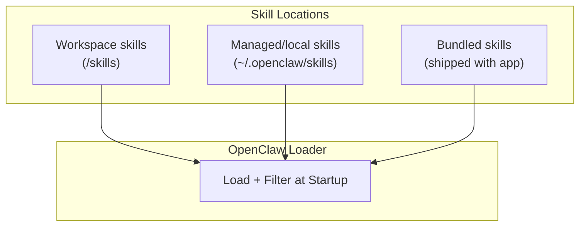
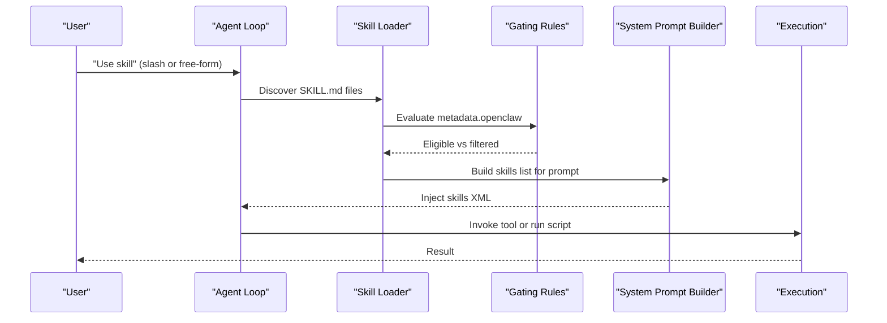
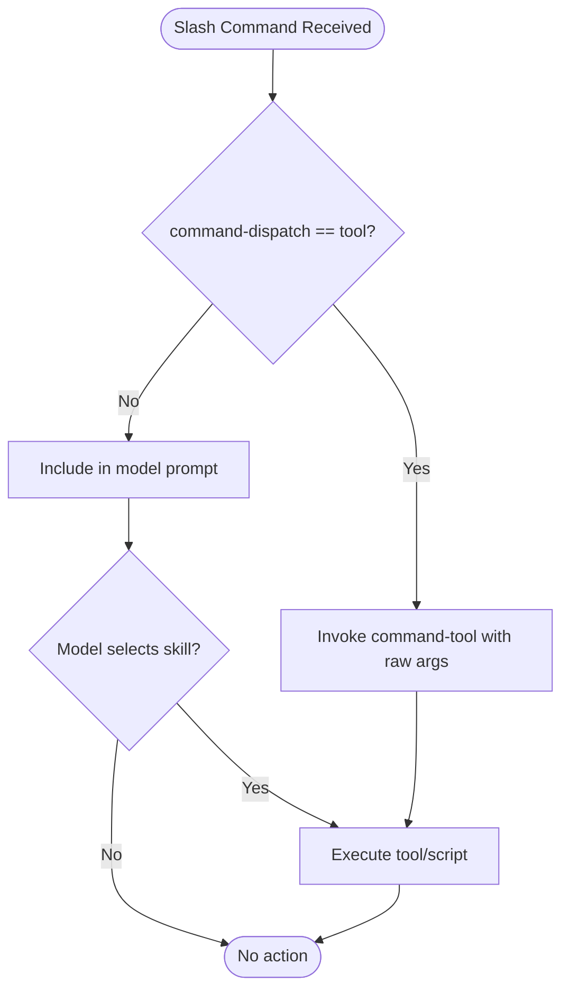
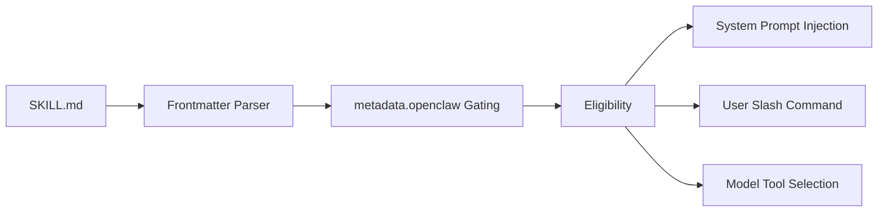

# Skill Format & Metadata

<cite>
**Referenced Files in This Document**
- [skills.md](file://docs/tools/skills.md)
- [creating-skills.md](file://docs/tools/creating-skills.md)
- [skills-config.md](file://docs/tools/skills-config.md)
- [SKILL.md (nano-banana-pro)](file://skills/nano-banana-pro/SKILL.md)
- [SKILL.md (gemini)](file://skills/gemini/SKILL.md)
- [SKILL.md (summarize)](file://skills/summarize/SKILL.md)
- [SKILL.md (model-usage)](file://skills/model-usage/SKILL.md)
- [SKILL.md (voice-call)](file://skills/voice-call/SKILL.md)
- [SKILL.md (pdf)](file://skills/pdf/SKILL.md)
- [quick_validate.py](file://skills/skill-creator/scripts/quick_validate.py)
- [skills.e2e-test-helpers.ts](file://src/agents/skills.e2e-test-helpers.ts)
- [skills.e2e-test-helpers.test.ts](file://src/agents/skills.e2e-test-helpers.test.ts)
</cite>

## Table of Contents
1. [Introduction](#introduction)
2. [Project Structure](#project-structure)
3. [Core Components](#core-components)
4. [Architecture Overview](#architecture-overview)
5. [Detailed Component Analysis](#detailed-component-analysis)
6. [Dependency Analysis](#dependency-analysis)
7. [Performance Considerations](#performance-considerations)
8. [Troubleshooting Guide](#troubleshooting-guide)
9. [Conclusion](#conclusion)

## Introduction
This document specifies the AgentSkills-compatible skill format and metadata for OpenClaw. It explains the SKILL.md structure, YAML frontmatter requirements, single-line JSON constraints, and metadata fields. It also documents the baseDir variable usage, instruction formatting, and the relationship between metadata and skill behavior, including user invocation modes and model integration.

## Project Structure
Skills are organized as directories with a single SKILL.md file that contains YAML frontmatter and Markdown instructions. OpenClaw loads skills from three locations with precedence:
- Workspace skills: <workspace>/skills
- Managed/local skills: ~/.openclaw/skills
- Bundled skills: shipped with the application

**Diagram sources**
- [skills.md](file://docs/tools/skills.md#L13-L40)

**Section sources**
- [skills.md](file://docs/tools/skills.md#L13-L40)

## Core Components
- SKILL.md: The skill definition file containing:
  - YAML frontmatter with required fields (name, description) and optional fields (homepage, user-invocable, disable-model-invocation, command-dispatch, command-tool, command-arg-mode)
  - Single-line JSON constraint for metadata
  - Instructions in Markdown
  - Optional baseDir usage for skill-relative paths

- Metadata (single-line JSON): Under metadata.openclaw, OpenClaw applies gating rules at load time (e.g., required binaries, environment variables, config paths, OS, installers).

- User invocation and model integration:
  - user-invocable controls whether a skill is exposed as a user slash command
  - disable-model-invocation excludes a skill from model prompts while keeping it user-invocable
  - command-dispatch and related fields enable direct tool dispatch for slash commands

**Section sources**
- [skills.md](file://docs/tools/skills.md#L78-L106)
- [skills.md](file://docs/tools/skills.md#L106-L187)

## Architecture Overview
The skill lifecycle spans discovery, gating, prompt construction, and invocation.

**Diagram sources**
- [skills.md](file://docs/tools/skills.md#L106-L187)
- [skills.md](file://docs/tools/skills.md#L230-L246)

## Detailed Component Analysis

### SKILL.md YAML Frontmatter and Single-Line JSON
- Required fields:
  - name: Unique skill identifier
  - description: Purpose and trigger conditions
- Optional fields:
  - homepage: Website URL surfaced in UI
  - user-invocable: true|false (default true)
  - disable-model-invocation: true|false (default false)
  - command-dispatch: tool (optional)
  - command-tool: tool name when command-dispatch=tool
  - command-arg-mode: raw (default); forwards raw args to tool
- metadata: Must be a single-line JSON object
- Additional allowed frontmatter keys include license and allowed-tools

Validation behavior:
- The validator enforces allowed properties and single-line JSON for metadata
- The embedded agent parser supports only single-line frontmatter keys

**Section sources**
- [skills.md](file://docs/tools/skills.md#L78-L106)
- [quick_validate.py](file://skills/skill-creator/scripts/quick_validate.py#L98-L107)

### Metadata.openclaw Gating and Behavior
- always: true to always include the skill (skip other gates)
- emoji: UI icon
- homepage: UI website link
- os: platform filter (darwin, linux, win32)
- requires.bins / requires.anyBins: binary presence checks
- requires.env: environment variable availability (host or via config)
- requires.config: truthy paths in openclaw.json
- primaryEnv: ties skills.entries.<name>.apiKey to an env var
- install: installer specs for UI (brew/node/go/uv/download)

Notes:
- requires.bins checked on host at load time; sandbox containers must also have binaries
- Installer examples demonstrate brew/node/go/uv/download with platform filtering and manager preferences

**Section sources**
- [skills.md](file://docs/tools/skills.md#L106-L187)
- [skills-config.md](file://docs/tools/skills-config.md#L13-L78)

### User Invocation Modes and Model Integration
- user-invocable=true exposes the skill as a slash command
- disable-model-invocation=true removes the skill from model prompts while retaining user invocation
- command-dispatch: tool bypasses the model and dispatches directly to a tool
- command-tool: tool name for direct dispatch
- command-arg-mode: raw forwards raw args to the tool

**Diagram sources**
- [skills.md](file://docs/tools/skills.md#L95-L105)

**Section sources**
- [skills.md](file://docs/tools/skills.md#L95-L105)

### baseDir Variable Usage and Instruction Formatting
- baseDir: Use {baseDir} in instructions to reference the skill folder path
- Instructions: Keep concise, use progressive disclosure (metadata always, body on trigger, resources on demand)
- Examples across skills demonstrate consistent formatting and baseDir usage

**Section sources**
- [skills.md](file://docs/tools/skills.md#L94-L95)
- [SKILL.md (nano-banana-pro)](file://skills/nano-banana-pro/SKILL.md#L33-L34)
- [SKILL.md (summarize)](file://skills/summarize/SKILL.md#L40-L44)

### Examples of Proper Metadata Configuration
- nano-banana-pro: Demonstrates homepage, metadata.openclaw with emoji, requires, primaryEnv, and install
- gemini: Demonstrates homepage, metadata.openclaw with emoji and requires.bins
- model-usage: Demonstrates os filter, requires.bins, and install
- voice-call: Demonstrates requires.config and skillKey for config gating
- summarize: Demonstrates homepage, metadata.openclaw with requires.bins and install

**Section sources**
- [SKILL.md (nano-banana-pro)](file://skills/nano-banana-pro/SKILL.md#L1-L24)
- [SKILL.md (gemini)](file://skills/gemini/SKILL.md#L1-L23)
- [SKILL.md (model-usage)](file://skills/model-usage/SKILL.md#L1-L23)
- [SKILL.md (voice-call)](file://skills/voice-call/SKILL.md#L1-L13)
- [SKILL.md (summarize)](file://skills/summarize/SKILL.md#L1-L23)

### End-to-End Test Coverage of Frontmatter Extras
- Tests confirm that optional frontmatter entries (e.g., user-invocable) are preserved and that empty bodies are trimmed appropriately
- Confirms metadata is written as single-line JSON and frontmatterExtra is included when provided

**Section sources**
- [skills.e2e-test-helpers.ts](file://src/agents/skills.e2e-test-helpers.ts#L14-L29)
- [skills.e2e-test-helpers.test.ts](file://src/agents/skills.e2e-test-helpers.test.ts#L41-L76)

## Dependency Analysis
- Discovery and precedence:
  - Workspace > Managed/local > Bundled
  - Extra directories can be added via skills.load.extraDirs
- Gating:
  - metadata.openclaw drives eligibility at load time
  - Environment injection occurs per agent run
- Execution:
  - User invocation controlled by user-invocable and command-* fields
  - Model integration controlled by disable-model-invocation

**Diagram sources**
- [skills.md](file://docs/tools/skills.md#L106-L187)
- [skills.md](file://docs/tools/skills.md#L230-L246)

**Section sources**
- [skills.md](file://docs/tools/skills.md#L13-L40)
- [skills.md](file://docs/tools/skills.md#L106-L187)
- [skills.md](file://docs/tools/skills.md#L230-L246)

## Performance Considerations
- Skills list token impact is deterministic and depends on the number of skills and field lengths
- OpenClaw snapshots eligible skills at session start and reuses them for subsequent turns
- Watcher can hot-reload changes when enabled

**Section sources**
- [skills.md](file://docs/tools/skills.md#L242-L286)
- [skills.md](file://docs/tools/skills.md#L254-L268)

## Troubleshooting Guide
- Invalid frontmatter format or unsupported YAML syntax will fail validation
- Unexpected keys in frontmatter are rejected
- Ensure metadata is a single-line JSON object
- For sandboxed environments, verify required binaries exist inside the container
- Use skills.entries overrides to supply env/apiKey or toggle enabled state

**Section sources**
- [quick_validate.py](file://skills/skill-creator/scripts/quick_validate.py#L98-L107)
- [skills.md](file://docs/tools/skills.md#L138-L147)
- [skills-config.md](file://docs/tools/skills-config.md#L54-L78)

## Conclusion
OpenClaw’s AgentSkills-compatible skill format centers on a concise SKILL.md with strict YAML frontmatter and single-line JSON metadata. The metadata.openclaw block governs gating and UI behavior, while user-invocable and command-* fields control user slash commands and direct tool dispatch. Following the examples and validation rules ensures predictable behavior across environments and consistent integration with the model and user interface.