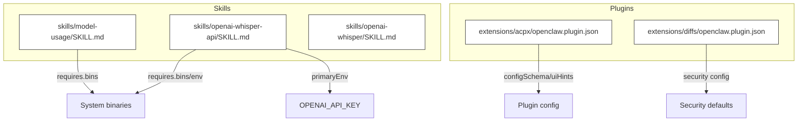
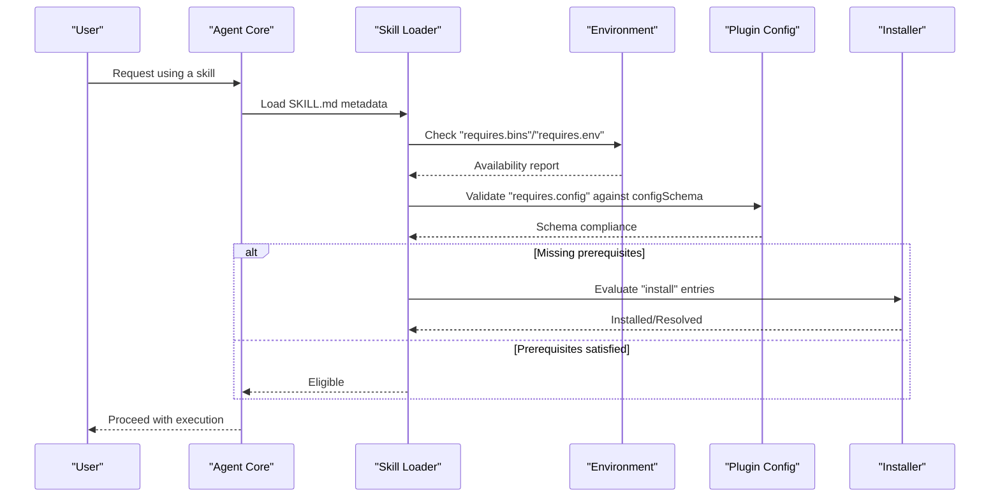
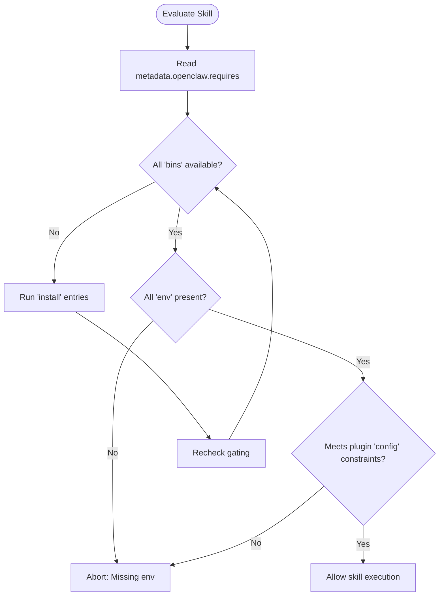
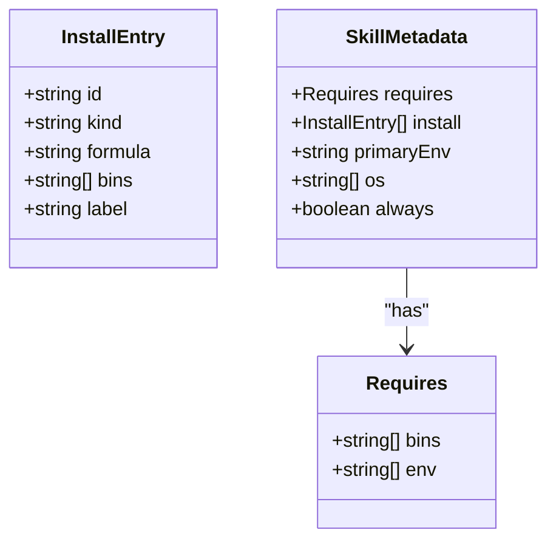
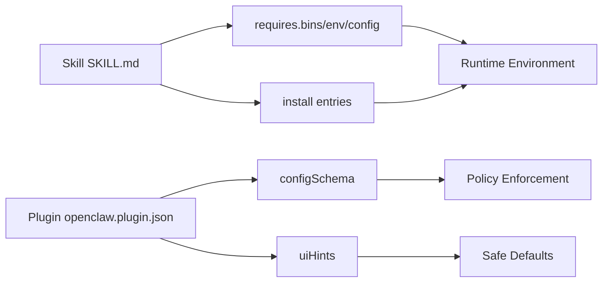

# Skill Gating & Security

<cite>
**Referenced Files in This Document**
- [SKILL.md](file://skills/model-usage/SKILL.md)
- [SKILL.md](file://skills/openai-whisper-api/SKILL.md)
- [SKILL.md](file://skills/openai-whisper/SKILL.md)
- [openclaw.plugin.json](file://extensions/acpx/openclaw.plugin.json)
- [openclaw.plugin.json](file://extensions/diffs/openclaw.plugin.json)
- [SKILL.md](file://skills/healthcheck/SKILL.md)
- [sandbox.md](file://docs/cli/sandbox.md)
- [sandboxing.md](file://docs/gateway/sandboxing.md)
- [security.md](file://docs/cli/security.md)
- [security.md](file://docs/gateway/security/)
- [README.md](file://docs/security/README.md)
- [CONTRIBUTING-THREAT-MODEL.md](file://docs/security/CONTRIBUTING-THREAT-MODEL.md)
- [THREAT-MODEL-ATLAS.md](file://docs/security/THREAT-MODEL-ATLAS.md)
- [formal-verification.md](file://docs/security/formal-verification.md)
</cite>

## Table of Contents
1. [Introduction](#introduction)
2. [Project Structure](#project-structure)
3. [Core Components](#core-components)
4. [Architecture Overview](#architecture-overview)
5. [Detailed Component Analysis](#detailed-component-analysis)
6. [Dependency Analysis](#dependency-analysis)
7. [Performance Considerations](#performance-considerations)
8. [Troubleshooting Guide](#troubleshooting-guide)
9. [Conclusion](#conclusion)
10. [Appendices](#appendices)

## Introduction
This document explains OpenClaw’s skill gating and security mechanisms with a focus on the metadata.openclaw.requirements system. It covers:
- Requirement gating via bins, env, and config
- The always flag for unconditional inclusion
- OS filtering for platform-specific skills
- The primaryEnv field for API key management
- The install metadata for automated dependency resolution
- Sandbox considerations for binary requirements and environment injection
- Security implications and best practices for evaluating third-party skills

## Project Structure
OpenClaw organizes skills as self-contained directories with a SKILL.md frontmatter that declares gating and installation metadata. Plugins contribute runtime backends and configuration schemas that further gate and constrain execution.

**Diagram sources**
- [SKILL.md](file://skills/model-usage/SKILL.md#L4-L22)
- [SKILL.md](file://skills/openai-whisper-api/SKILL.md#L5-L13)
- [openclaw.plugin.json](file://extensions/acpx/openclaw.plugin.json#L6-L62)
- [openclaw.plugin.json](file://extensions/diffs/openclaw.plugin.json#L68-L182)

**Section sources**
- [SKILL.md](file://skills/model-usage/SKILL.md#L4-L22)
- [SKILL.md](file://skills/openai-whisper-api/SKILL.md#L5-L13)
- [openclaw.plugin.json](file://extensions/acpx/openclaw.plugin.json#L6-L62)
- [openclaw.plugin.json](file://extensions/diffs/openclaw.plugin.json#L68-L182)

## Core Components
- metadata.openclaw.requires: Declares environment prerequisites for a skill.
  - bins: List of required system binaries.
  - env: List of required environment variables.
  - config: Optional plugin-level gating via configSchema properties.
- metadata.openclaw.install: Automated dependency resolution entries for missing prerequisites.
- metadata.openclaw.primaryEnv: Names a single environment variable used to supply an API key for the skill.
- metadata.openclaw.os: Platform filter restricting skill visibility to specific operating systems.
- metadata.openclaw.always: Flag enabling unconditional inclusion regardless of gating.
- Plugin configSchema and uiHints: Gate and constrain runtime behavior for backends (e.g., ACPX, Diffs).

**Section sources**
- [SKILL.md](file://skills/model-usage/SKILL.md#L4-L22)
- [SKILL.md](file://skills/openai-whisper-api/SKILL.md#L5-L13)
- [openclaw.plugin.json](file://extensions/acpx/openclaw.plugin.json#L6-L62)
- [openclaw.plugin.json](file://extensions/diffs/openclaw.plugin.json#L68-L182)

## Architecture Overview
The gating pipeline evaluates a skill’s metadata against the runtime environment and plugin configuration before allowing execution. Automated install entries can provision missing dependencies.

**Diagram sources**
- [SKILL.md](file://skills/model-usage/SKILL.md#L4-L22)
- [SKILL.md](file://skills/openai-whisper-api/SKILL.md#L5-L13)
- [openclaw.plugin.json](file://extensions/acpx/openclaw.plugin.json#L6-L62)

## Detailed Component Analysis

### Requirement Gating: bins, env, config
- bins: Ensures required executables are available in PATH. Used widely across skills to gate on system tools.
- env: Ensures required environment variables are present. Often paired with primaryEnv to centralize credential management.
- config: Validates against plugin configSchema to gate on backend availability and policy settings.

**Diagram sources**
- [SKILL.md](file://skills/model-usage/SKILL.md#L4-L22)
- [SKILL.md](file://skills/openai-whisper-api/SKILL.md#L5-L13)
- [openclaw.plugin.json](file://extensions/acpx/openclaw.plugin.json#L6-L62)

**Section sources**
- [SKILL.md](file://skills/model-usage/SKILL.md#L4-L22)
- [SKILL.md](file://skills/openai-whisper-api/SKILL.md#L5-L13)
- [openclaw.plugin.json](file://extensions/acpx/openclaw.plugin.json#L6-L62)

### The always flag for unconditional inclusion
- The metadata.openclaw.always flag allows a skill to bypass gating checks and be included unconditionally. This is useful for foundational or diagnostic skills that must be available regardless of environment state.

**Section sources**
- [SKILL.md](file://skills/healthcheck/SKILL.md#L1-L246)

### OS filtering for platform-specific skills
- The metadata.openclaw.os array restricts a skill to specific operating systems (e.g., darwin). This prevents incompatible binaries or commands from being exposed on unsupported platforms.

**Section sources**
- [SKILL.md](file://skills/model-usage/SKILL.md#L9-L9)

### primaryEnv for API key management
- The metadata.openclaw.primaryEnv field identifies a single environment variable used to supply an API key for the skill. This simplifies credential handling and aligns with centralized secret management.

**Section sources**
- [SKILL.md](file://skills/openai-whisper-api/SKILL.md#L11-L11)

### install metadata for automated dependency resolution
- The metadata.openclaw.install array defines automated provisioning entries for missing prerequisites. Each entry specifies:
  - id: Unique identifier for the entry
  - kind: Installer type (e.g., brew)
  - formula/bin: Package or binary name
  - bins: Executables to verify post-install
  - label: Human-readable label for the install action

**Diagram sources**
- [SKILL.md](file://skills/model-usage/SKILL.md#L11-L21)
- [SKILL.md](file://skills/openai-whisper/SKILL.md#L11-L21)

**Section sources**
- [SKILL.md](file://skills/model-usage/SKILL.md#L11-L21)
- [SKILL.md](file://skills/openai-whisper/SKILL.md#L11-L21)

### Plugin-level gating and security controls
- Plugin configSchema defines allowed configuration keys and values, enabling policy-driven gating for backends.
- uiHints provide labels and help text for configuration, aiding safe defaults and user guidance.
- Security-related plugin settings (e.g., diffs.security.allowRemoteViewer) gate potentially risky behaviors.

**Section sources**
- [openclaw.plugin.json](file://extensions/acpx/openclaw.plugin.json#L6-L62)
- [openclaw.plugin.json](file://extensions/diffs/openclaw.plugin.json#L68-L182)

### Sandbox considerations for binary requirements and environment injection
- Sandboxing limits filesystem, network, and process access for skills and plugins. Binary gating ensures only approved tools are invoked.
- Environment injection should be minimized and constrained to primaryEnv and explicit config-derived values to reduce attack surface.

**Section sources**
- [sandbox.md](file://docs/cli/sandbox.md)
- [sandboxing.md](file://docs/gateway/sandboxing.md)

## Dependency Analysis
Skills declare explicit dependencies via metadata.openclaw.requires and metadata.openclaw.install. Plugins define policy boundaries via configSchema and uiHints. Together, they form a layered gating system.

**Diagram sources**
- [SKILL.md](file://skills/model-usage/SKILL.md#L4-L22)
- [openclaw.plugin.json](file://extensions/acpx/openclaw.plugin.json#L6-L62)

**Section sources**
- [SKILL.md](file://skills/model-usage/SKILL.md#L4-L22)
- [openclaw.plugin.json](file://extensions/acpx/openclaw.plugin.json#L6-L62)

## Performance Considerations
- Minimize unnecessary installs by leveraging cached binaries and pre-provisioned environments.
- Use os filters to avoid redundant gating checks on incompatible platforms.
- Consolidate env checks to reduce repeated lookups during evaluation.

## Troubleshooting Guide
Common issues and resolutions:
- Missing binaries: Ensure bins are installed and on PATH; rely on install entries when available.
- Missing environment variables: Set primaryEnv or required env variables according to skill metadata.
- Plugin config mismatches: Align with plugin configSchema and uiHints to meet backend constraints.
- Sandbox restrictions: Confirm sandbox policies permit required filesystem/process access.

**Section sources**
- [SKILL.md](file://skills/model-usage/SKILL.md#L4-L22)
- [SKILL.md](file://skills/openai-whisper-api/SKILL.md#L5-L13)
- [openclaw.plugin.json](file://extensions/acpx/openclaw.plugin.json#L6-L62)
- [openclaw.plugin.json](file://extensions/diffs/openclaw.plugin.json#L68-L182)

## Conclusion
OpenClaw’s gating system combines skill-level metadata with plugin-level configuration to enforce secure, predictable execution. By using bins, env, config, install, primaryEnv, os, and always flags, developers can craft robust, portable skills while maintaining strong security boundaries enforced by sandboxing and policy.

## Appendices

### Security and Threat Modeling References
- Security overview and threat modeling resources are available in the security documentation set.

**Section sources**
- [README.md](file://docs/security/README.md)
- [CONTRIBUTING-THREAT-MODEL.md](file://docs/security/CONTRIBUTING-THREAT-MODEL.md)
- [THREAT-MODEL-ATLAS.md](file://docs/security/THREAT-MODEL-ATLAS.md)
- [formal-verification.md](file://docs/security/formal-verification.md)