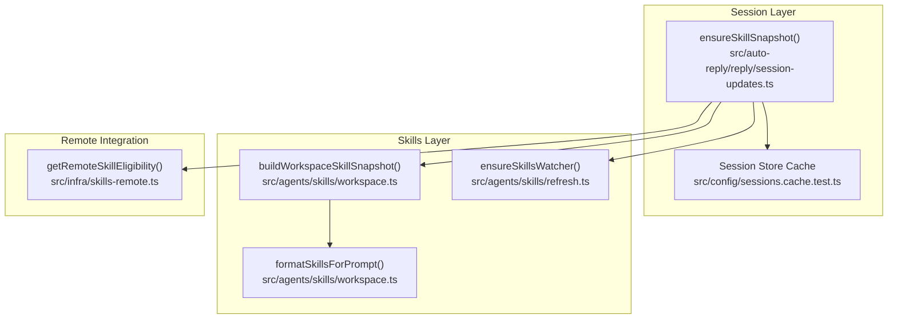
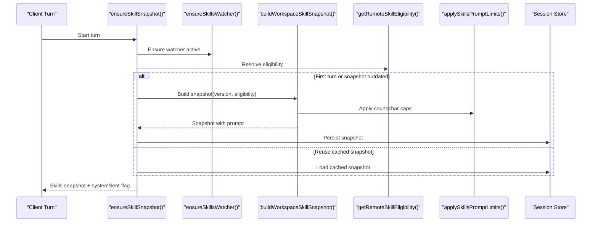
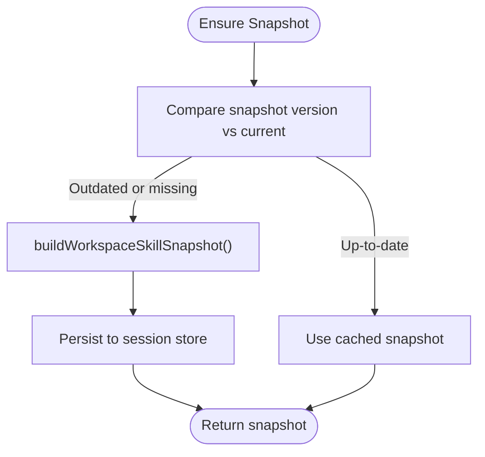
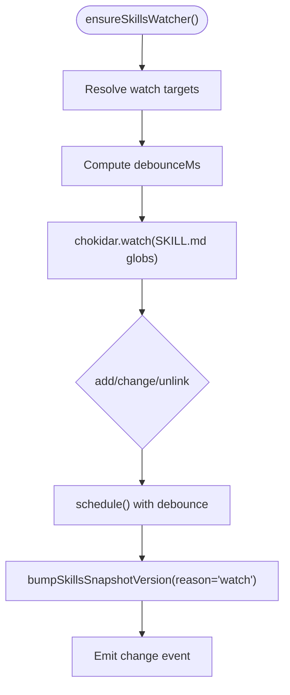
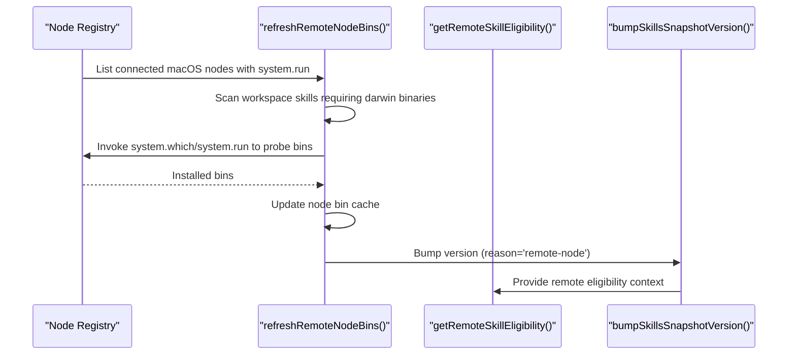
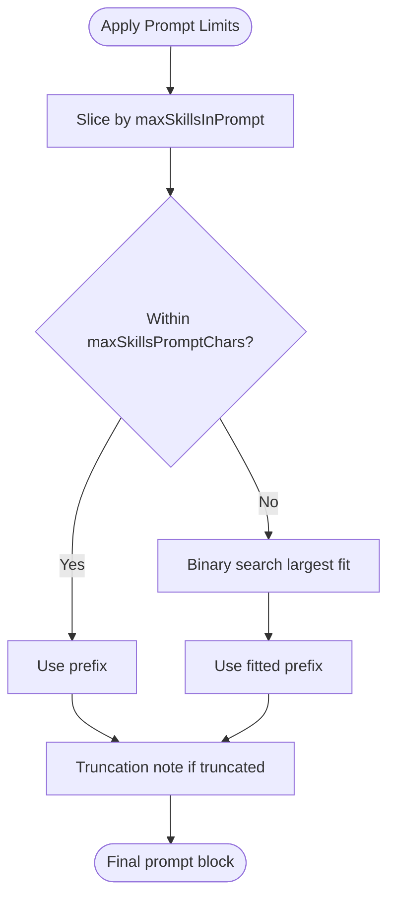
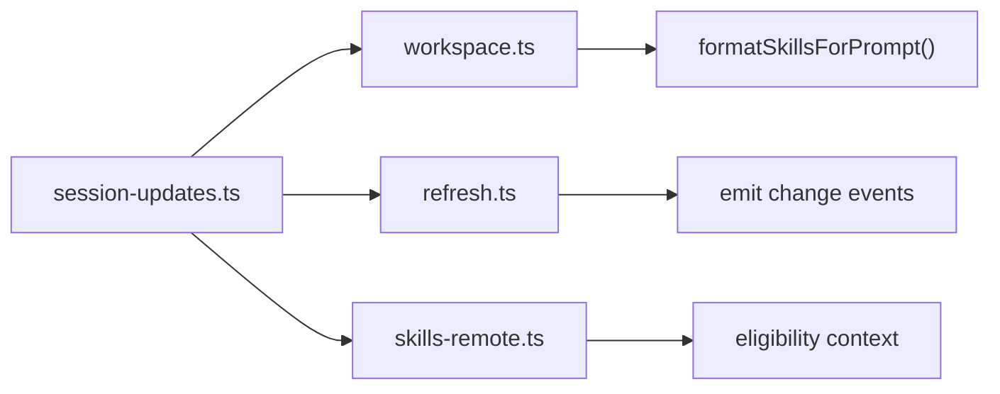

# Skill Performance & Optimization

<cite>
**Referenced Files in This Document**
- [session-updates.ts](file://src/auto-reply/reply/session-updates.ts)
- [refresh.ts](file://src/agents/skills/refresh.ts)
- [skills-remote.ts](file://src/infra/skills-remote.ts)
- [workspace.ts](file://src/agents/skills/workspace.ts)
- [system-prompt.ts](file://src/agents/system-prompt.ts)
- [token-use.md](file://docs/reference/token-use.md)
- [skills.md](file://docs/tools/skills.md)
- [cache-fields.test.ts](file://src/config/sessions/cache-fields.test.ts)
- [sessions.cache.test.ts](file://src/config/sessions.cache.test.ts)
- [usage.ts](file://src/agents/usage.ts)
- [manager.ts](file://src/memory/manager.ts)
</cite>

## Table of Contents
1. [Introduction](#introduction)
2. [Project Structure](#project-structure)
3. [Core Components](#core-components)
4. [Architecture Overview](#architecture-overview)
5. [Detailed Component Analysis](#detailed-component-analysis)
6. [Dependency Analysis](#dependency-analysis)
7. [Performance Considerations](#performance-considerations)
8. [Troubleshooting Guide](#troubleshooting-guide)
9. [Conclusion](#conclusion)
10. [Appendices](#appendices)

## Introduction
This document explains how OpenClaw optimizes skill performance and efficiency across conversations. It covers:
- The session snapshot mechanism that caches eligible skills to reduce repeated scanning and serialization overhead.
- The skills watcher system for hot reloading and automatic refresh.
- Token impact calculations for skill lists in system prompts and optimization strategies.
- Remote node integration for macOS-only skills on Linux gateways.
- Performance benchmarks, memory usage considerations, and best practices for managing large skill collections.

## Project Structure
OpenClaw organizes skill performance logic primarily around three subsystems:
- Session lifecycle and snapshot caching
- Skills discovery, filtering, and prompt construction
- Remote node eligibility and dynamic gating

**Diagram sources**
- [session-updates.ts](file://src/auto-reply/reply/session-updates.ts#L120-L239)
- [workspace.ts](file://src/agents/skills/workspace.ts#L567-L638)
- [refresh.ts](file://src/agents/skills/refresh.ts#L132-L207)
- [skills-remote.ts](file://src/infra/skills-remote.ts#L311-L335)
- [sessions.cache.test.ts](file://src/config/sessions.cache.test.ts#L61-L88)

**Section sources**
- [session-updates.ts](file://src/auto-reply/reply/session-updates.ts#L120-L239)
- [workspace.ts](file://src/agents/skills/workspace.ts#L567-L638)
- [refresh.ts](file://src/agents/skills/refresh.ts#L132-L207)
- [skills-remote.ts](file://src/infra/skills-remote.ts#L311-L335)
- [sessions.cache.test.ts](file://src/config/sessions.cache.test.ts#L61-L88)

## Core Components
- Session snapshot caching: On the first turn of a session, OpenClaw builds a snapshot of eligible skills and persists it to the session store. Subsequent turns reuse the cached snapshot unless conditions change.
- Skills watcher: Watches SKILL.md files and bumps a snapshot version to trigger hot reload on changes.
- Remote node eligibility: Detects macOS nodes with system.run capability and probes required binaries to expand eligible skills dynamically.
- Prompt construction and limits: Applies character and count caps to the skills list injected into the system prompt.

**Section sources**
- [session-updates.ts](file://src/auto-reply/reply/session-updates.ts#L120-L239)
- [refresh.ts](file://src/agents/skills/refresh.ts#L105-L130)
- [skills-remote.ts](file://src/infra/skills-remote.ts#L311-L335)
- [workspace.ts](file://src/agents/skills/workspace.ts#L529-L565)

## Architecture Overview
The skill performance pipeline integrates session state, skills discovery, and remote eligibility to minimize I/O and prompt size.

**Diagram sources**
- [session-updates.ts](file://src/auto-reply/reply/session-updates.ts#L120-L239)
- [refresh.ts](file://src/agents/skills/refresh.ts#L132-L207)
- [workspace.ts](file://src/agents/skills/workspace.ts#L529-L565)
- [skills-remote.ts](file://src/infra/skills-remote.ts#L311-L335)

## Detailed Component Analysis

### Session Snapshot Mechanism
- Purpose: Cache eligible skills per session to avoid repeated filesystem scans and prompt rebuilds.
- Behavior:
  - On first turn or when snapshot version advances, build a snapshot containing:
    - Compact skills list for the prompt
    - Minimal metadata (names, primaryEnv, requiredEnv)
    - Optional skillFilter and resolvedSkills
  - Persist snapshot to session store and mark systemSent to avoid redundant injections.
  - On subsequent turns, reuse cached snapshot unless conditions change (new snapshot version or missing snapshot).
- Hot reload triggers:
  - Skills watcher detects changes to SKILL.md and increments snapshot version.
  - Remote node availability changes can bump version when eligible macOS nodes appear or disappear.

**Diagram sources**
- [session-updates.ts](file://src/auto-reply/reply/session-updates.ts#L163-L212)
- [workspace.ts](file://src/agents/skills/workspace.ts#L567-L584)

**Section sources**
- [session-updates.ts](file://src/auto-reply/reply/session-updates.ts#L120-L239)
- [workspace.ts](file://src/agents/skills/workspace.ts#L567-L584)

### Skills Watcher System (Hot Reload)
- Purpose: Automatically refresh the skills snapshot when SKILL.md files change.
- Implementation:
  - Watches configured paths for SKILL.md and nested SKILL.md patterns.
  - Debounces events to avoid thrashing during multi-file saves.
  - Emits a skills change event that bumps the snapshot version.
  - Ignores large subtrees (e.g., .git, node_modules) to prevent FD exhaustion.
- Configuration:
  - Enable/disable watching and adjust debounceMs via skills.load settings.

**Diagram sources**
- [refresh.ts](file://src/agents/skills/refresh.ts#L132-L207)

**Section sources**
- [refresh.ts](file://src/agents/skills/refresh.ts#L84-L96)
- [refresh.ts](file://src/agents/skills/refresh.ts#L132-L207)

### Remote Node Integration (macOS-only Skills on Linux Gateways)
- Purpose: Allow Linux gateways to treat macOS-only skills as eligible when a paired macOS node with system.run capability is available.
- Mechanism:
  - Probe nodes for platform and command support.
  - Collect required binaries across workspace skills targeting macOS.
  - Probe node for installed binaries and update eligibility accordingly.
  - Expose eligibility context with platform darwin and binary presence checks.
- Impact:
  - Expands eligible skills list dynamically when nodes become available.
  - Requires nodes to support system.run or system.which to probe binaries.

**Diagram sources**
- [skills-remote.ts](file://src/infra/skills-remote.ts#L130-L154)
- [skills-remote.ts](file://src/infra/skills-remote.ts#L241-L309)
- [skills-remote.ts](file://src/infra/skills-remote.ts#L311-L335)

**Section sources**
- [skills-remote.ts](file://src/infra/skills-remote.ts#L130-L154)
- [skills-remote.ts](file://src/infra/skills-remote.ts#L241-L309)
- [skills-remote.ts](file://src/infra/skills-remote.ts#L311-L335)

### Token Impact Calculations for Skill Lists
- Prompt injection:
  - OpenClaw injects a compact skills list into the system prompt via formatSkillsForPrompt.
- Overhead formula (characters):
  - Base overhead when ≥1 skill: 195 characters.
  - Per skill: 97 characters + XML-escaped lengths of name, description, and location.
- Token estimate:
  - Rough OpenAI-style estimate: ~4 characters per token; ~24 tokens per skill plus field lengths.
- Mitigation strategies:
  - Keep skill descriptions concise.
  - Limit total skills in prompt via maxSkillsInPrompt and maxSkillsPromptChars.
  - Use skillFilter to restrict to channel-specific skills.

**Diagram sources**
- [workspace.ts](file://src/agents/skills/workspace.ts#L529-L565)
- [skills.md](file://docs/tools/skills.md#L269-L286)

**Section sources**
- [workspace.ts](file://src/agents/skills/workspace.ts#L529-L565)
- [skills.md](file://docs/tools/skills.md#L269-L286)

### Prompt Construction and System Prompt Integration
- Skills section is inserted into the system prompt with explicit guidance on reading and selecting skills.
- The skills list is formatted and truncated according to configured limits.

**Section sources**
- [system-prompt.ts](file://src/agents/system-prompt.ts#L20-L36)
- [workspace.ts](file://src/agents/skills/workspace.ts#L618-L638)

## Dependency Analysis
- Session snapshot depends on:
  - Skills snapshot version (from watcher and remote node changes)
  - Remote eligibility context
  - Session store persistence
- Skills snapshot depends on:
  - Loaded and filtered skill entries
  - Prompt limits and formatting
- Remote node integration depends on:
  - Node registry and command support
  - Bin probing via system.run/system.which

**Diagram sources**
- [session-updates.ts](file://src/auto-reply/reply/session-updates.ts#L120-L239)
- [workspace.ts](file://src/agents/skills/workspace.ts#L567-L638)
- [refresh.ts](file://src/agents/skills/refresh.ts#L105-L130)
- [skills-remote.ts](file://src/infra/skills-remote.ts#L311-L335)

**Section sources**
- [session-updates.ts](file://src/auto-reply/reply/session-updates.ts#L120-L239)
- [workspace.ts](file://src/agents/skills/workspace.ts#L567-L638)
- [refresh.ts](file://src/agents/skills/refresh.ts#L105-L130)
- [skills-remote.ts](file://src/infra/skills-remote.ts#L311-L335)

## Performance Considerations
- Snapshot caching
  - Reduces repeated filesystem scans and prompt rebuilds across conversation turns.
  - Persisted in session store to avoid recomputation.
- Watcher efficiency
  - Watches only SKILL.md and nested SKILL.md to minimize FD usage.
  - Debounced to coalesce rapid edits.
- Prompt size control
  - Enforced caps on skill count and character length.
  - Path compaction reduces per-skill token overhead.
- Remote node probing
  - Bin probing is performed per connected macOS node to expand eligibility.
  - Changes to node availability or binaries bump snapshot version for hot reload.
- Memory usage
  - Session store cache avoids repeated deserialization.
  - Memory index managers are closed on shutdown to free resources.

**Section sources**
- [session-updates.ts](file://src/auto-reply/reply/session-updates.ts#L120-L239)
- [refresh.ts](file://src/agents/skills/refresh.ts#L169-L178)
- [workspace.ts](file://src/agents/skills/workspace.ts#L529-L565)
- [skills-remote.ts](file://src/infra/skills-remote.ts#L241-L309)
- [sessions.cache.test.ts](file://src/config/sessions.cache.test.ts#L61-L88)
- [manager.ts](file://src/memory/manager.ts#L40-L59)

## Troubleshooting Guide
- Skills not refreshing after edits
  - Verify skills watcher is enabled and debounceMs is reasonable.
  - Confirm SKILL.md changes are detected and snapshot version bumps.
- Remote macOS-only skills not appearing
  - Ensure paired nodes report system.run support and have required binaries.
  - Check that bin probing succeeds and node metadata is updated.
- Prompt too large or truncated
  - Reduce skill count or descriptions; adjust maxSkillsInPrompt and maxSkillsPromptChars.
  - Use skillFilter to narrow to channel-specific skills.
- Session store cache anomalies
  - Ensure cache invalidation occurs on writes and disk changes are observed.
  - Verify cacheRead/cacheWrite fields are handled correctly when clearing.

**Section sources**
- [refresh.ts](file://src/agents/skills/refresh.ts#L132-L207)
- [skills-remote.ts](file://src/infra/skills-remote.ts#L337-L351)
- [workspace.ts](file://src/agents/skills/workspace.ts#L529-L565)
- [sessions.cache.test.ts](file://src/config/sessions.cache.test.ts#L114-L134)
- [cache-fields.test.ts](file://src/config/sessions/cache-fields.test.ts#L50-L67)

## Conclusion
OpenClaw’s skill performance strategy centers on efficient caching, targeted watching, and dynamic eligibility expansion. By combining session snapshots, a focused skills watcher, and remote node probing, it minimizes I/O and prompt size while keeping the skill list fresh and relevant. Careful tuning of limits and filters ensures predictable token usage and cost control, especially when managing large skill collections.

## Appendices

### Best Practices for Managing Large Skill Collections
- Keep skill descriptions concise to reduce per-skill token overhead.
- Use skillFilter to limit skills per channel or conversation context.
- Tune skills.load.watch and watchDebounceMs to balance responsiveness and I/O.
- Monitor prompt size with /context and adjust maxSkillsInPrompt/maxSkillsPromptChars.
- Leverage remote node integration to offload macOS-only skills to capable nodes.

**Section sources**
- [skills.md](file://docs/tools/skills.md#L242-L247)
- [skills.md](file://docs/tools/skills.md#L254-L267)
- [skills.md](file://docs/tools/skills.md#L269-L286)
- [token-use.md](file://docs/reference/token-use.md#L167-L176)