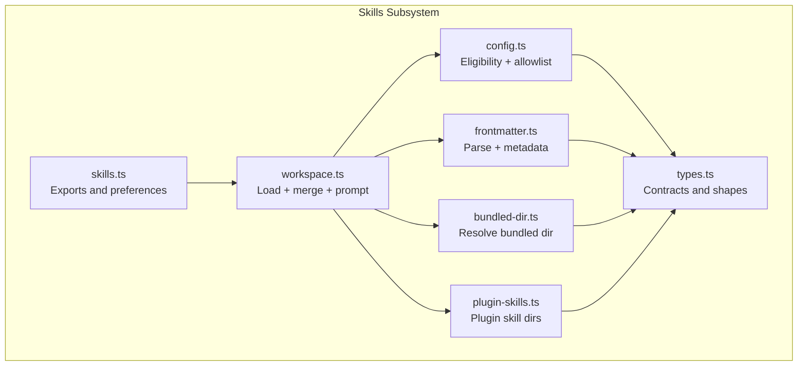
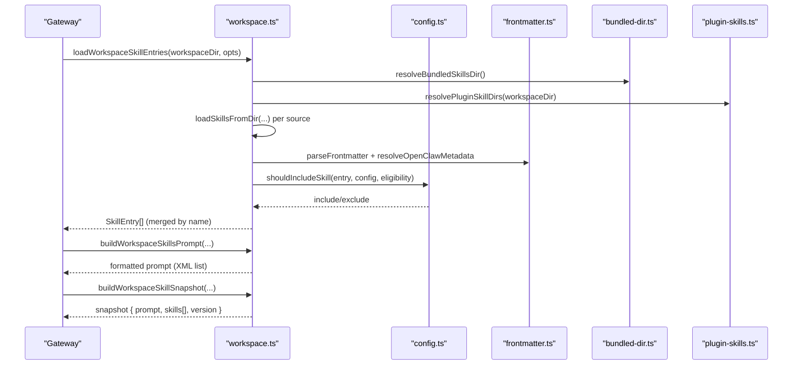
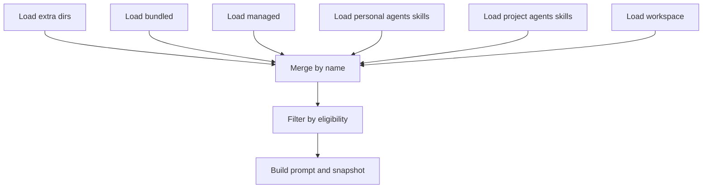
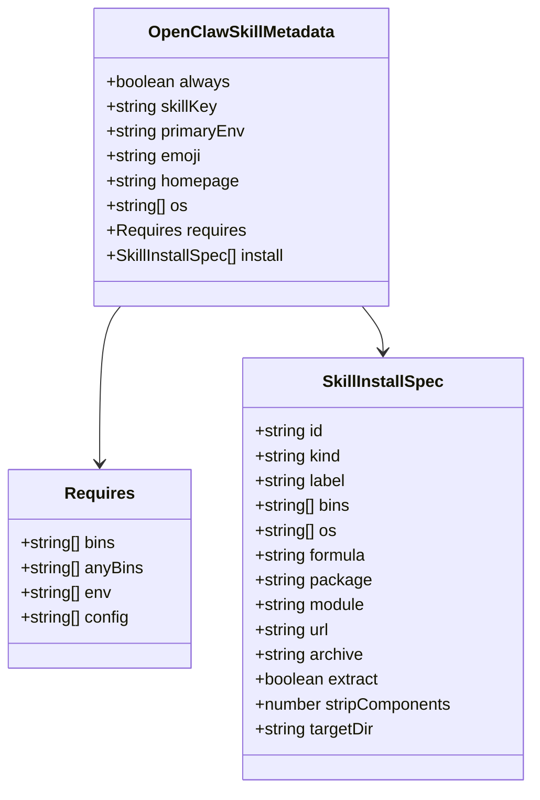
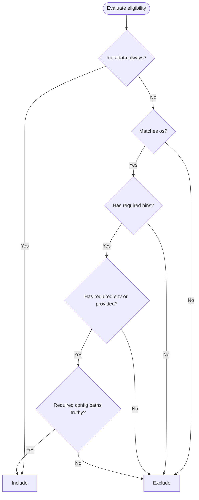
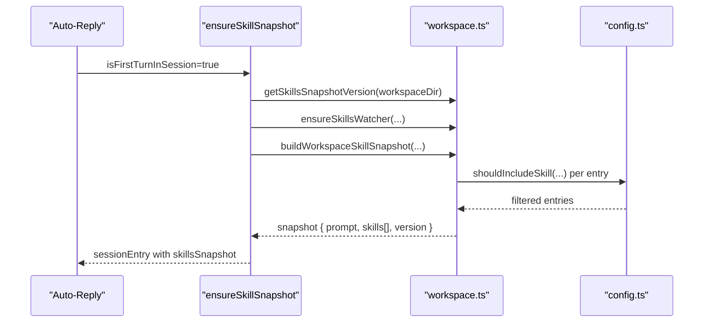
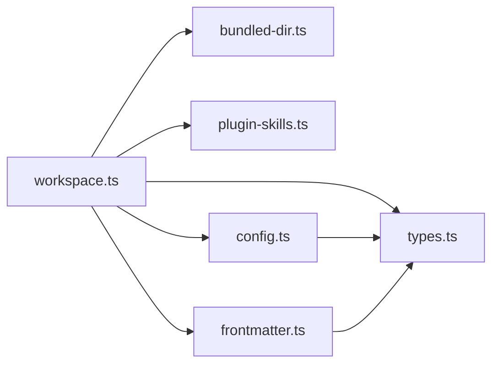

# Skills Architecture

<cite>
**Referenced Files in This Document**
- [skills.ts](file://src/agents/skills.ts)
- [workspace.ts](file://src/agents/skills/workspace.ts)
- [config.ts](file://src/agents/skills/config.ts)
- [frontmatter.ts](file://src/agents/skills/frontmatter.ts)
- [bundled-dir.ts](file://src/agents/skills/bundled-dir.ts)
- [plugin-skills.ts](file://src/agents/skills/plugin-skills.ts)
- [types.ts](file://src/agents/skills/types.ts)
- [skills.loadworkspaceskillentries.test.ts](file://src/agents/skills.loadworkspaceskillentries.test.ts)
- [skills.buildworkspaceskillsnapshot.test.ts](file://src/agents/skills.buildworkspaceskillsnapshot.test.ts)
- [skills.build-workspace-skills-prompt.applies-bundled-allowlist-without-affecting-workspace-skills.test.ts](file://src/agents/skills.build-workspace-skills-prompt.applies-bundled-allowlist-without-affecting-workspace-skills.test.ts)
- [skills.build-workspace-skills-prompt.prefers-workspace-skills-managed-skills.test.ts](file://src/agents/skills.build-workspace-skills-prompt.prefers-workspace-skills-managed-skills.test.ts)
- [session-updates.ts](file://src/auto-reply/reply/session-updates.ts)
- [skills.ts](file://src/gateway/server-methods/skills.ts)
- [creating-skills.md](file://docs/tools/creating-skills.md)
- [skills.md](file://docs/tools/skills.md)
</cite>

## Table of Contents
1. [Introduction](#introduction)
2. [Project Structure](#project-structure)
3. [Core Components](#core-components)
4. [Architecture Overview](#architecture-overview)
5. [Detailed Component Analysis](#detailed-component-analysis)
6. [Dependency Analysis](#dependency-analysis)
7. [Performance Considerations](#performance-considerations)
8. [Troubleshooting Guide](#troubleshooting-guide)
9. [Conclusion](#conclusion)

## Introduction
This document explains OpenClaw’s skills architecture and implementation. It covers the three-tier skill loading system (bundled, managed/local, workspace), precedence rules, configuration options, AgentSkills-compatible format and metadata, gating mechanisms, and the skill lifecycle including session snapshots and token impact calculations.

## Project Structure
OpenClaw organizes skills discovery and filtering in a dedicated subsystem under agents/skills. The key modules are:
- Entry exports and preferences resolution
- Workspace loading and merging of sources
- Eligibility checks and gating
- Frontmatter parsing and metadata extraction
- Bundled skills directory resolution
- Plugin-provided skill directories
- Types and constants for skills and snapshots

**Diagram sources**
- [skills.ts](file://src/agents/skills.ts#L1-L47)
- [workspace.ts](file://src/agents/skills/workspace.ts#L1-L800)
- [config.ts](file://src/agents/skills/config.ts#L1-L104)
- [frontmatter.ts](file://src/agents/skills/frontmatter.ts#L1-L223)
- [bundled-dir.ts](file://src/agents/skills/bundled-dir.ts#L1-L91)
- [plugin-skills.ts](file://src/agents/skills/plugin-skills.ts#L1-L90)
- [types.ts](file://src/agents/skills/types.ts#L1-L90)

**Section sources**
- [skills.ts](file://src/agents/skills.ts#L1-L47)
- [workspace.ts](file://src/agents/skills/workspace.ts#L1-L800)
- [config.ts](file://src/agents/skills/config.ts#L1-L104)
- [frontmatter.ts](file://src/agents/skills/frontmatter.ts#L1-L223)
- [bundled-dir.ts](file://src/agents/skills/bundled-dir.ts#L1-L91)
- [plugin-skills.ts](file://src/agents/skills/plugin-skills.ts#L1-L90)
- [types.ts](file://src/agents/skills/types.ts#L1-L90)

## Core Components
- Three-tier loading:
  - Bundled skills: shipped with the installation
  - Managed/local skills: user-managed overrides
  - Workspace skills: per-agent, user-owned
- Precedence: workspace > managed/local > bundled (plus extra/plugin sources)
- Eligibility gating: platform, binaries, environment, config paths, and optional “always”
- Prompt building: compact XML list injected into system prompt with deterministic token impact
- Lifecycle: snapshot at session start, hot-refresh on changes or remote availability

**Section sources**
- [workspace.ts](file://src/agents/skills/workspace.ts#L445-L527)
- [config.ts](file://src/agents/skills/config.ts#L71-L103)
- [skills.md](file://docs/tools/skills.md#L13-L48)
- [skills.md](file://docs/tools/skills.md#L106-L187)
- [skills.md](file://docs/tools/skills.md#L242-L246)
- [skills.md](file://docs/tools/skills.md#L269-L286)

## Architecture Overview
The skills subsystem composes multiple sources, merges them by name, applies eligibility filters, and produces a prompt and snapshot for agent runs.

**Diagram sources**
- [workspace.ts](file://src/agents/skills/workspace.ts#L292-L527)
- [config.ts](file://src/agents/skills/config.ts#L71-L103)
- [frontmatter.ts](file://src/agents/skills/frontmatter.ts#L186-L223)
- [bundled-dir.ts](file://src/agents/skills/bundled-dir.ts#L36-L91)
- [plugin-skills.ts](file://src/agents/skills/plugin-skills.ts#L15-L90)

## Detailed Component Analysis

### Three-Tier Loading and Precedence
- Sources and precedence:
  - Extra directories (skills.load.extraDirs)
  - Bundled skills
  - Managed/local skills (~/.openclaw/skills)
  - Personal project skills (.agents/skills under home)
  - Project skills (.agents/skills under workspace)
  - Workspace skills (<workspace>/skills)
- Name collision resolution follows the precedence list above.
- Plugin skills are discovered from enabled plugins and treated as extra directories.

**Diagram sources**
- [workspace.ts](file://src/agents/skills/workspace.ts#L445-L527)

**Section sources**
- [workspace.ts](file://src/agents/skills/workspace.ts#L445-L527)
- [plugin-skills.ts](file://src/agents/skills/plugin-skills.ts#L15-L90)
- [skills.md](file://docs/tools/skills.md#L13-L48)

### AgentSkills-Compatible Format and Metadata
- SKILL.md structure:
  - YAML frontmatter with name and description
  - Optional metadata.openclaw single-line JSON object
  - Markdown body with instructions
- Frontmatter keys:
  - user-invocable: whether exposed as slash command
  - disable-model-invocation: exclude from model prompt
  - command-dispatch/tool/arg-mode: deterministic tool dispatch
- metadata.openclaw fields:
  - always, emoji, homepage, os
  - requires: bins, anyBins, env, config
  - primaryEnv, install (installer specs)

**Diagram sources**
- [types.ts](file://src/agents/skills/types.ts#L19-L33)

**Section sources**
- [frontmatter.ts](file://src/agents/skills/frontmatter.ts#L186-L223)
- [types.ts](file://src/agents/skills/types.ts#L1-L90)
- [skills.md](file://docs/tools/skills.md#L78-L187)
- [creating-skills.md](file://docs/tools/creating-skills.md#L27-L48)

### Skill Gating Mechanisms
- Eligibility conditions evaluated at load time:
  - Platform filters (os)
  - Binary presence (requires.bins, requires.anyBins)
  - Environment variables (requires.env) or provided via config
  - Config path truthiness (requires.config)
  - Optional always flag to bypass other gates
- Config-driven overrides:
  - skills.entries.<key>: enabled, env, apiKey, config
  - allowBundled: allowlist for bundled skills only
- Remote eligibility:
  - When a macOS node is reachable and system.run is allowed, binaries on that node can make macOS-only skills eligible

**Diagram sources**
- [config.ts](file://src/agents/skills/config.ts#L71-L103)

**Section sources**
- [config.ts](file://src/agents/skills/config.ts#L71-L103)
- [skills.md](file://docs/tools/skills.md#L106-L187)

### Relationship Between Skills and Tools
- Skills teach the agent how to use tools described in SKILL.md.
- Command dispatch:
  - user-invocable controls slash command exposure
  - command-dispatch: tool enables direct tool invocation without model involvement
  - command-tool and command-arg-mode define forwarding behavior
- Tools are resolved by name and executed according to the agent runtime.

**Section sources**
- [frontmatter.ts](file://src/agents/skills/frontmatter.ts#L208-L223)
- [skills.md](file://docs/tools/skills.md#L95-L105)

### Skill Lifecycle Management and Session Snapshots
- Snapshot creation:
  - At session start, eligible skills are computed and stored in a snapshot
  - Reused across turns in the same session to avoid repeated scanning
- Hot refresh:
  - Enabled by skills.load.watch; snapshot version increments on changes
  - Mid-session refresh when skills watcher detects changes or remote eligibility changes
- Environment injection:
  - Per-run env overrides applied from skills.entries.<key>.env or apiKey
  - Restored after the run completes

**Diagram sources**
- [session-updates.ts](file://src/auto-reply/reply/session-updates.ts#L120-L164)
- [workspace.ts](file://src/agents/skills/workspace.ts#L567-L584)
- [config.ts](file://src/agents/skills/config.ts#L71-L103)

**Section sources**
- [session-updates.ts](file://src/auto-reply/reply/session-updates.ts#L120-L164)
- [workspace.ts](file://src/agents/skills/workspace.ts#L567-L584)
- [skills.md](file://docs/tools/skills.md#L242-L246)

### Gateway Integration and Status
- Gateway exposes endpoints to query skills status and binary readiness.
- Uses buildWorkspaceSkillStatus internally to report eligibility and environment.

**Section sources**
- [skills.ts](file://src/gateway/server-methods/skills.ts#L57-L97)

### Workspace Skill Discovery and Safety
- Workspace discovery enforces containment:
  - Resolved realpath of skill roots and SKILL.md must stay within configured root
  - Symlinks outside the root are skipped with warnings
- Tests demonstrate:
  - Hidden vs visible skills in prompt
  - Prefer workspace over managed
  - Respect allowlist for bundled skills

**Section sources**
- [workspace.ts](file://src/agents/skills/workspace.ts#L187-L247)
- [skills.buildworkspaceskillsnapshot.test.ts](file://src/agents/skills.buildworkspaceskillsnapshot.test.ts#L81-L94)
- [skills.build-workspace-skills-prompt.prefers-workspace-skills-managed-skills.test.ts](file://src/agents/skills.build-workspace-skills-prompt.prefers-workspace-skills-managed-skills.test.ts#L19-L37)
- [skills.build-workspace-skills-prompt.applies-bundled-allowlist-without-affecting-workspace-skills.test.ts](file://src/agents/skills.build-workspace-skills-prompt.applies-bundled-allowlist-without-affecting-workspace-skills.test.ts#L9-L37)
- [skills.loadworkspaceskillentries.test.ts](file://src/agents/skills.loadworkspaceskillentries.test.ts#L133-L178)

## Dependency Analysis
- Cohesion:
  - workspace.ts orchestrates loading, merging, filtering, prompting, and snapshotting
  - config.ts encapsulates gating logic and allowlists
  - frontmatter.ts parses and normalizes metadata and install specs
- Coupling:
  - workspace.ts depends on bundled-dir.ts, plugin-skills.ts, frontmatter.ts, and config.ts
  - types.ts centralizes shared contracts
- External integrations:
  - pi-coding-agent for skill loading and prompt formatting
  - Node filesystem APIs for discovery and safety checks

**Diagram sources**
- [workspace.ts](file://src/agents/skills/workspace.ts#L1-L800)
- [config.ts](file://src/agents/skills/config.ts#L1-L104)
- [frontmatter.ts](file://src/agents/skills/frontmatter.ts#L1-L223)
- [bundled-dir.ts](file://src/agents/skills/bundled-dir.ts#L1-L91)
- [plugin-skills.ts](file://src/agents/skills/plugin-skills.ts#L1-L90)
- [types.ts](file://src/agents/skills/types.ts#L1-L90)

**Section sources**
- [workspace.ts](file://src/agents/skills/workspace.ts#L1-L800)
- [config.ts](file://src/agents/skills/config.ts#L1-L104)
- [frontmatter.ts](file://src/agents/skills/frontmatter.ts#L1-L223)
- [bundled-dir.ts](file://src/agents/skills/bundled-dir.ts#L1-L91)
- [plugin-skills.ts](file://src/agents/skills/plugin-skills.ts#L1-L90)
- [types.ts](file://src/agents/skills/types.ts#L1-L90)

## Performance Considerations
- Prompt token impact:
  - Deterministic overhead and per-skill cost for XML list injection
  - Formula provided for character and token estimates
- Snapshot reuse:
  - Reduces repeated filesystem scanning and parsing within a session
  - Watcher enables hot reload with minimal disruption
- Limits:
  - Max candidates per root, skills loaded per source, skills in prompt, prompt characters, and file size caps prevent resource exhaustion

**Section sources**
- [workspace.ts](file://src/agents/skills/workspace.ts#L139-L149)
- [workspace.ts](file://src/agents/skills/workspace.ts#L529-L565)
- [skills.md](file://docs/tools/skills.md#L269-L286)
- [skills.md](file://docs/tools/skills.md#L242-L246)

## Troubleshooting Guide
- Skills not appearing:
  - Verify SKILL.md presence and valid frontmatter
  - Check precedence: workspace overrides managed/local/bundled
  - Confirm allowlist and gating (os, bins, env, config)
- Escaped paths:
  - Workspace and extra-dir discovery skips symlinks or files resolving outside the configured root
- Environment issues:
  - Ensure env overrides are set via skills.entries.<key>.env or apiKey
  - Confirm environment variables are present or provided in config
- Remote eligibility:
  - When using remote macOS nodes, ensure required binaries exist on the node and system.run is allowed

**Section sources**
- [workspace.ts](file://src/agents/skills/workspace.ts#L187-L247)
- [config.ts](file://src/agents/skills/config.ts#L71-L103)
- [skills.md](file://docs/tools/skills.md#L69-L76)
- [skills.md](file://docs/tools/skills.md#L138-L147)

## Conclusion
OpenClaw’s skills architecture provides a robust, layered system for discovering, gating, and exposing capabilities to agents. The three-tier loading model, strict safety checks, deterministic prompt formatting, and session snapshots deliver both flexibility and performance. By adhering to the AgentSkills-compatible format and leveraging metadata and configuration, users can safely extend and manage skills across environments.