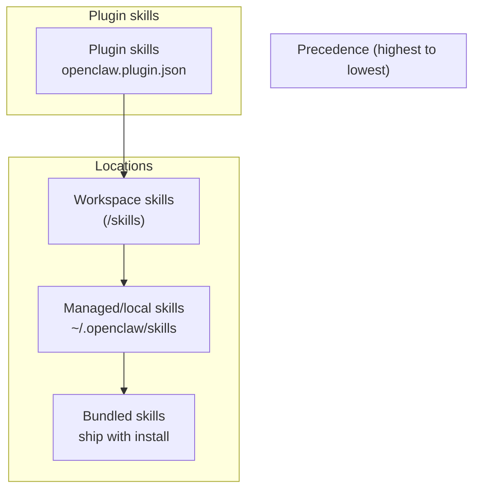
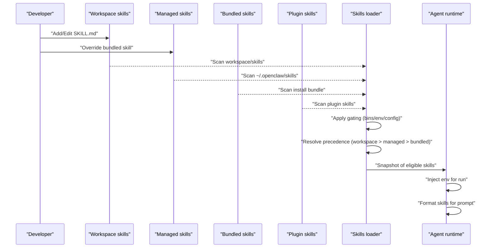
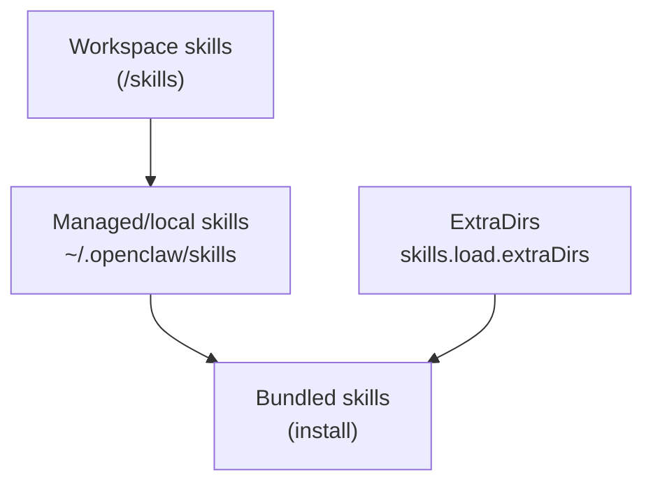
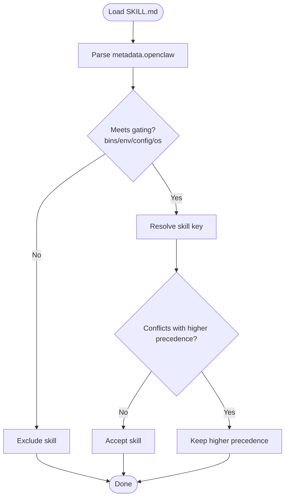
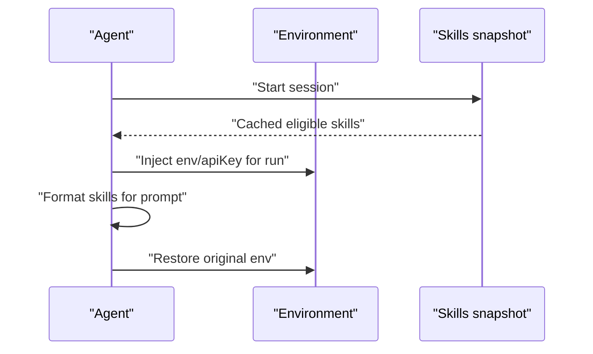
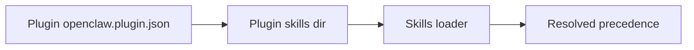
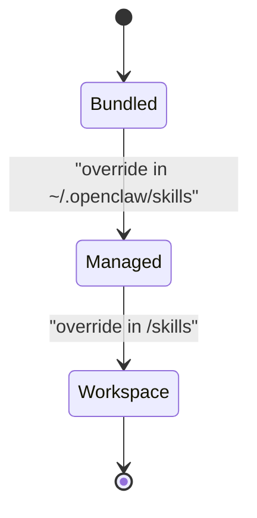
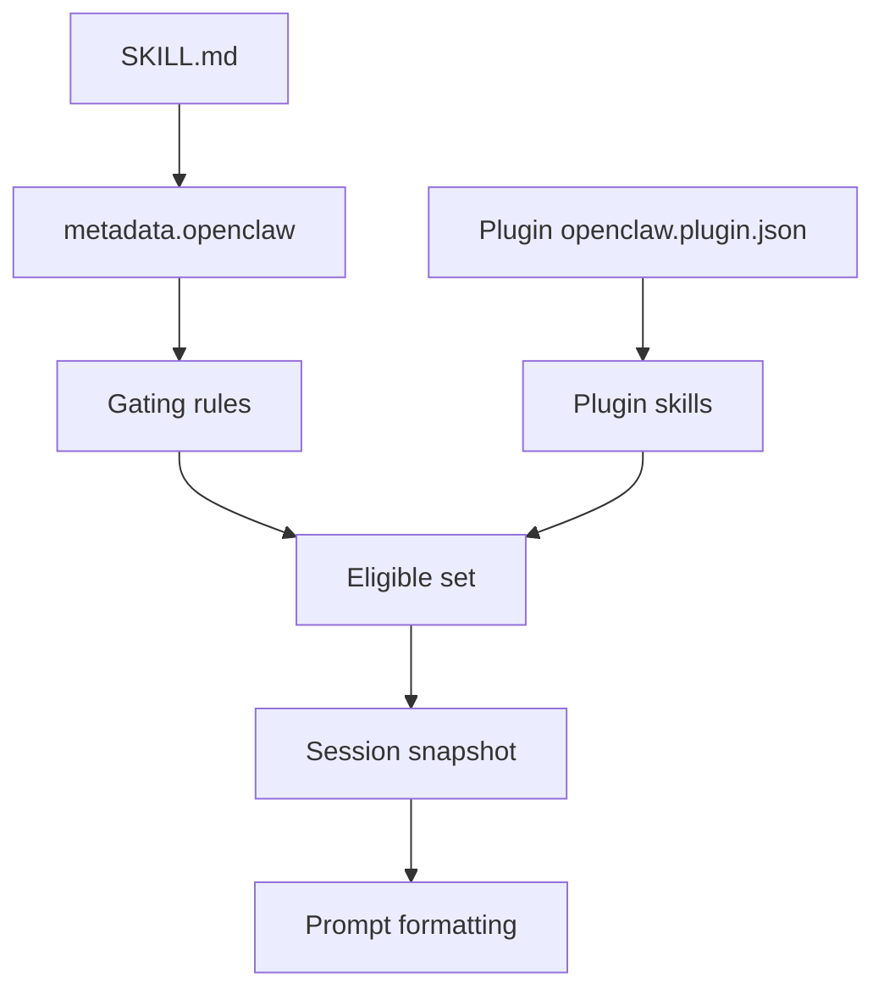

# Workspace Skills Management

<cite>
**Referenced Files in This Document**
- [skills.md](file://docs/tools/skills.md)
- [skills-config.md](file://docs/tools/skills-config.md)
- [creating-skills.md](file://docs/tools/creating-skills.md)
- [openclaw.md](file://docs/start/openclaw.md)
- [README.md](file://README.md)
- [SKILL.md (nano-banana-pro)](file://skills/nano-banana-pro/SKILL.md)
- [SKILL.md (summarize)](file://skills/summarize/SKILL.md)
- [SKILL.md (diffs)](file://extensions/diffs/skills/diffs/SKILL.md)
- [openclaw.plugin.json (diffs)](file://extensions/diffs/openclaw.plugin.json)
- [openclaw.plugin.json (lobster)](file://extensions/lobster/openclaw.plugin.json)
</cite>

## Table of Contents
1. [Introduction](#introduction)
2. [Project Structure](#project-structure)
3. [Core Components](#core-components)
4. [Architecture Overview](#architecture-overview)
5. [Detailed Component Analysis](#detailed-component-analysis)
6. [Dependency Analysis](#dependency-analysis)
7. [Performance Considerations](#performance-considerations)
8. [Troubleshooting Guide](#troubleshooting-guide)
9. [Conclusion](#conclusion)
10. [Appendices](#appendices)

## Introduction
This document explains how workspace skills are discovered, installed, configured, and maintained in development environments. It covers the distinction between workspace skills and managed skills, precedence rules, gating and conflict resolution, synchronization across teams, version control strategies, collaborative workflows, troubleshooting, performance optimization, and best practices for organizing skills in large projects.

## Project Structure
OpenClaw organizes skills across three locations with a clear precedence order. Workspace skills live under the project’s skills directory and override managed/local skills, which in turn override bundled skills. Plugins can ship their own skills that participate in the same precedence rules.

**Diagram sources**
- [skills.md](file://docs/tools/skills.md#L13-L26)
- [openclaw.plugin.json (diffs)](file://extensions/diffs/openclaw.plugin.json#L1-L5)

**Section sources**
- [skills.md](file://docs/tools/skills.md#L13-L26)
- [openclaw.plugin.json (diffs)](file://extensions/diffs/openclaw.plugin.json#L1-L5)

## Core Components
- Workspace skills: local, per-project skills under the workspace’s skills directory. They take highest precedence and are ideal for team-specific or project-scoped capabilities.
- Managed/local skills: user-level overrides under ~/.openclaw/skills. Useful for pinning or patching bundled skills without altering the repository.
- Bundled skills: included with the install (npm package or OpenClaw.app). Lowest precedence.
- Plugin skills: optional skills shipped by plugins via openclaw.plugin.json. They follow the same precedence rules and can be gated by plugin configuration.
- Skills registry (ClawHub): a public registry for discovering, installing, updating, and backing up skills.

Key behaviors:
- Load-time gating via metadata (binary availability, environment variables, config flags).
- Environment injection scoped to agent runs.
- Snapshot caching of eligible skills per session with optional hot reload via watchers.
- Optional macOS-only skill eligibility when remote nodes are available with required binaries.

**Section sources**
- [skills.md](file://docs/tools/skills.md#L13-L26)
- [skills.md](file://docs/tools/skills.md#L106-L187)
- [skills.md](file://docs/tools/skills.md#L230-L246)
- [skills.md](file://docs/tools/skills.md#L248-L252)
- [skills.md](file://docs/tools/skills.md#L254-L267)
- [skills.md](file://docs/tools/skills.md#L50-L67)

## Architecture Overview
The skills system resolves a final, filtered set of skills for each agent run. The process includes discovery across locations, gating evaluation, environment injection, and prompt formatting.

**Diagram sources**
- [skills.md](file://docs/tools/skills.md#L13-L26)
- [skills.md](file://docs/tools/skills.md#L106-L187)
- [skills.md](file://docs/tools/skills.md#L230-L246)

## Detailed Component Analysis

### Locations and Precedence
- Three discovery locations: bundled, managed/local, workspace.
- Precedence: workspace > managed/local > bundled.
- Additional shared folders can be added via skills.load.extraDirs with the lowest precedence.
- Per-agent vs shared skills: in multi-agent setups, workspace skills are per-agent; managed/local and extraDirs are shared across agents on the same machine.

**Diagram sources**
- [skills.md](file://docs/tools/skills.md#L13-L26)
- [skills-config.md](file://docs/tools/skills-config.md#L17-L18)

**Section sources**
- [skills.md](file://docs/tools/skills.md#L13-L26)
- [skills-config.md](file://docs/tools/skills-config.md#L17-L18)

### Gating and Conflict Resolution
- Gating fields under metadata.openclaw:
  - always: force inclusion.
  - os: platform filter.
  - requires.bins and requires.anyBins: PATH presence checks.
  - requires.env: environment variables must exist or be provided in config.
  - requires.config: truthy config paths.
  - primaryEnv: maps to skills.entries.<name>.apiKey.
  - install: installer hints for UI.
- Conflict resolution follows precedence: workspace overrides managed/local, which overrides bundled.
- If multiple installers are listed, the gateway selects a single preferred option; download installers enumerate choices.

**Diagram sources**
- [skills.md](file://docs/tools/skills.md#L106-L187)

**Section sources**
- [skills.md](file://docs/tools/skills.md#L106-L187)

### Environment Injection and Session Snapshots
- During an agent run, environment variables from skills.entries.<key>.env or skills.entries.<key>.apiKey are injected into the process (only if not already set).
- The system snapshots eligible skills when a session starts and reuses the list for subsequent turns in the same session.
- Watcher can refresh mid-session when enabled or when new eligible remote nodes appear.

**Diagram sources**
- [skills.md](file://docs/tools/skills.md#L230-L246)

**Section sources**
- [skills.md](file://docs/tools/skills.md#L230-L246)

### Plugin Skills and Discovery
- Plugins can list skills directories in openclaw.plugin.json; these load when the plugin is enabled and participate in precedence.
- Plugins can gate their skills via metadata.openclaw.requires.config on the plugin’s config entry.
- Example plugin manifests demonstrate how skills are declared and configured.

**Diagram sources**
- [skills.md](file://docs/tools/skills.md#L41-L48)
- [openclaw.plugin.json (diffs)](file://extensions/diffs/openclaw.plugin.json#L1-L5)
- [openclaw.plugin.json (lobster)](file://extensions/lobster/openclaw.plugin.json#L1-L11)

**Section sources**
- [skills.md](file://docs/tools/skills.md#L41-L48)
- [openclaw.plugin.json (diffs)](file://extensions/diffs/openclaw.plugin.json#L1-L5)
- [openclaw.plugin.json (lobster)](file://extensions/lobster/openclaw.plugin.json#L1-L11)

### Workspace Skills Lifecycle and Management
- Workspace skills are user-owned and override bundled and managed/local on name conflicts.
- Managed skills live under ~/.openclaw/skills for local overrides (e.g., pinning or patching).
- Bundled skills ship with the install and are the baseline.

**Diagram sources**
- [skills.md](file://docs/tools/skills.md#L287-L292)

**Section sources**
- [skills.md](file://docs/tools/skills.md#L287-L292)

### Skills Format and Best Practices
- SKILL.md must include a YAML frontmatter with name and description.
- Optional fields include homepage, user-invocable, disable-model-invocation, command-dispatch, command-tool, and command-arg-mode.
- Use {baseDir} to reference the skill folder path.
- Follow AgentSkills spec for layout and intent.

**Section sources**
- [skills.md](file://docs/tools/skills.md#L78-L101)
- [creating-skills.md](file://docs/tools/creating-skills.md#L13-L58)

### Installer Specifications and Preferences
- Installer examples show brew, node, go, and download installers.
- Preferences include preferBrew and install.nodeManager (npm/pnpm/yarn/bun).
- Download installers support url, archive, extract, stripComponents, targetDir.

**Section sources**
- [skills.md](file://docs/tools/skills.md#L148-L184)
- [skills-config.md](file://docs/tools/skills-config.md#L22-L25)

### Remote macOS Nodes and Eligibility
- When the Gateway runs on Linux but a macOS node is connected with system.run allowed, macOS-only skills can become eligible if required binaries are present on that node.
- Eligibility depends on node reporting command support and bin probing via system.run.

**Section sources**
- [skills.md](file://docs/tools/skills.md#L248-L252)

### Token Impact and Prompt Formatting
- When skills are eligible, a compact XML list is injected into the system prompt.
- Base overhead and per-skill character costs are documented; XML escaping increases length.

**Section sources**
- [skills.md](file://docs/tools/skills.md#L269-L285)

## Dependency Analysis
- Skills depend on metadata gating and environment/config availability.
- Plugin skills depend on plugin enablement and plugin config gating.
- Workspace vs managed vs bundled relationships are enforced by precedence rules.
- Watcher and snapshot caching reduce repeated scanning and improve responsiveness.

**Diagram sources**
- [skills.md](file://docs/tools/skills.md#L106-L187)
- [skills.md](file://docs/tools/skills.md#L230-L246)
- [openclaw.plugin.json (diffs)](file://extensions/diffs/openclaw.plugin.json#L1-L5)

**Section sources**
- [skills.md](file://docs/tools/skills.md#L106-L187)
- [skills.md](file://docs/tools/skills.md#L230-L246)
- [openclaw.plugin.json (diffs)](file://extensions/diffs/openclaw.plugin.json#L1-L5)

## Performance Considerations
- Use skills.load.watch to auto-refresh on changes; tune skills.load.watchDebounceMs to balance responsiveness and I/O.
- Snapshot caching avoids repeated scans; changes take effect on new sessions unless watcher is enabled.
- Token overhead from skills list is deterministic; keep SKILL.md concise and leverage progressive disclosure patterns.
- For sandboxed runs, bake environment into custom images or use agents.defaults.sandbox.docker.env to avoid per-run injection overhead.

**Section sources**
- [skills-config.md](file://docs/tools/skills-config.md#L19-L21)
- [skills-config.md](file://docs/tools/skills-config.md#L46-L47)
- [skills.md](file://docs/tools/skills.md#L242-L246)
- [skills.md](file://docs/tools/skills.md#L269-L285)
- [skills-config.md](file://docs/tools/skills-config.md#L67-L77)

## Troubleshooting Guide
Common issues and resolutions:
- Skill not appearing
  - Verify SKILL.md frontmatter and that the skill is not disabled in config.
  - Confirm gating conditions (bins/env/config) are satisfied.
  - Check precedence: workspace overrides managed/local overrides bundled.
- Environment variables not applied
  - Ensure variables are not already set in the process; env is only injected if not present.
  - For sandboxed runs, set agents.defaults.sandbox.docker.env or bake into the image.
- Watcher not refreshing
  - Enable skills.load.watch and adjust skills.load.watchDebounceMs.
  - Confirm file changes are persisted and within configured roots.
- Remote macOS-only skill eligibility
  - Ensure required binaries exist on the node and system.run is allowed.
  - Confirm node reporting and bin probing succeed.

**Section sources**
- [skills.md](file://docs/tools/skills.md#L106-L187)
- [skills.md](file://docs/tools/skills.md#L230-L246)
- [skills.md](file://docs/tools/skills.md#L254-L267)
- [skills.md](file://docs/tools/skills.md#L248-L252)
- [skills-config.md](file://docs/tools/skills-config.md#L67-L77)

## Conclusion
OpenClaw’s skills system provides a flexible, layered approach to capability management. By leveraging workspace, managed, and bundled locations with clear precedence, robust gating, and environment injection, teams can tailor agent behavior to project needs while maintaining safety and performance. Plugins extend this model seamlessly, and tools like watchers and snapshots optimize responsiveness. Adopting version control and collaborative workflows further strengthens team alignment and reliability.

## Appendices

### A. Workspace and Skills Reference
- Workspace root and skills location are configurable; default is ~/.openclaw/workspace with skills under ~/.openclaw/workspace/skills.
- Treat workspace as the assistant’s “memory” and consider initializing it as a git repository for backups.

**Section sources**
- [openclaw.md](file://docs/start/openclaw.md#L70-L82)
- [README.md](file://README.md#L312-L316)

### B. Example Skills and Metadata
- Example gating and install metadata in SKILL.md files illustrate typical patterns for binary requirements, environment variables, and installer hints.

**Section sources**
- [SKILL.md (nano-banana-pro)](file://skills/nano-banana-pro/SKILL.md#L1-L24)
- [SKILL.md (summarize)](file://skills/summarize/SKILL.md#L1-L23)
- [SKILL.md (diffs)](file://extensions/diffs/skills/diffs/SKILL.md#L1-L23)