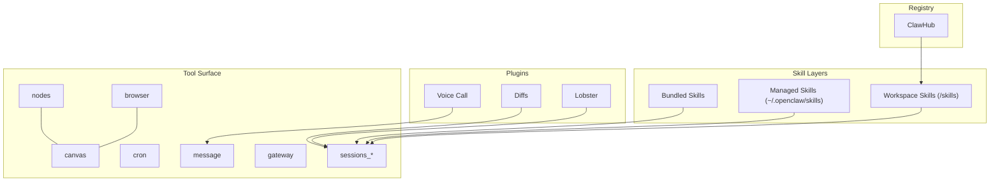
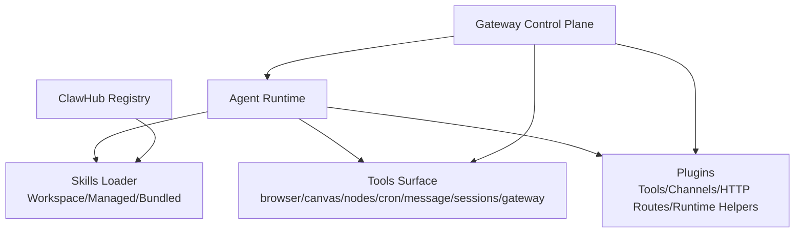
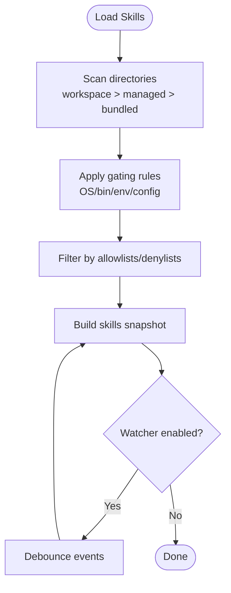
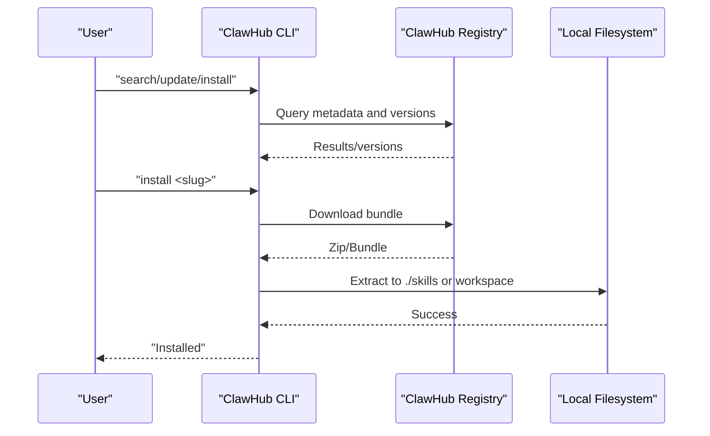
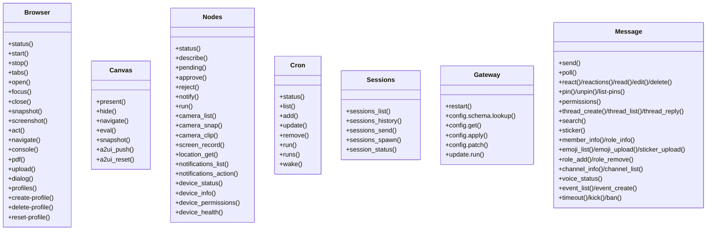
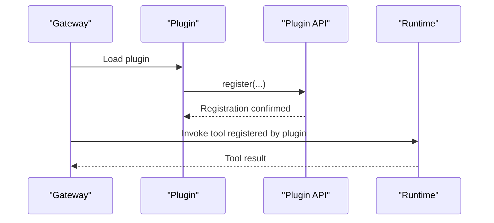
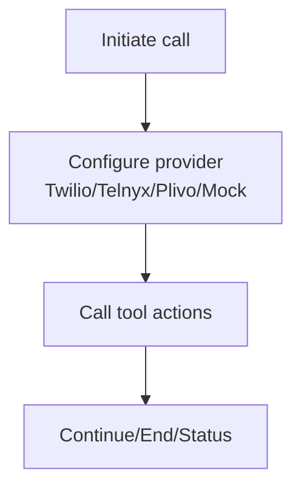
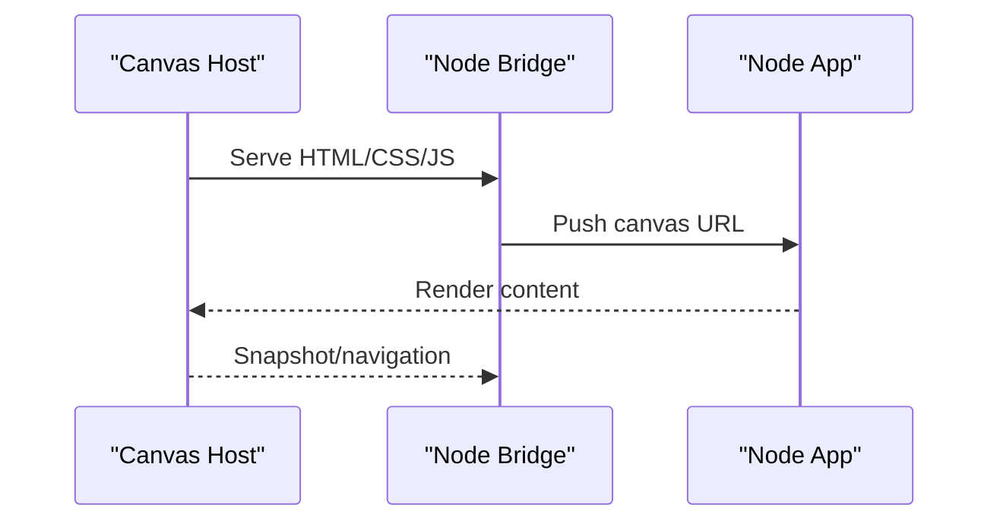
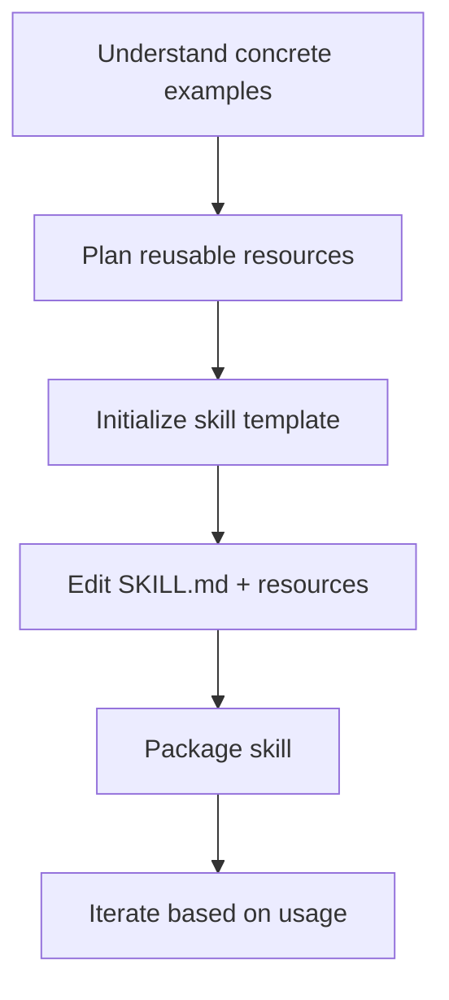
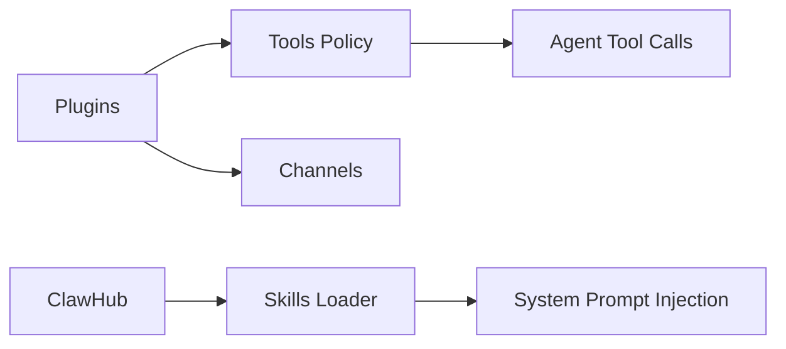

# Skills & Tools

<cite>
**Referenced Files in This Document**
- [README.md](file://README.md)
- [docs/tools/index.md](file://docs/tools/index.md)
- [docs/tools/skills.md](file://docs/tools/skills.md)
- [docs/tools/clawhub.md](file://docs/tools/clawhub.md)
- [docs/tools/plugin.md](file://docs/tools/plugin.md)
- [docs/tools/creating-skills.md](file://docs/tools/creating-skills.md)
- [docs/tools/skills-config.md](file://docs/tools/skills-config.md)
- [docs/start/hubs.md](file://docs/start/hubs.md)
- [skills/skill-creator/SKILL.md](file://skills/skill-creator/SKILL.md)
- [skills/voice-call/SKILL.md](file://skills/voice-call/SKILL.md)
- [skills/canvas/SKILL.md](file://skills/canvas/SKILL.md)
- [skills/clawhub/SKILL.md](file://skills/clawhub/SKILL.md)
- [extensions/lobster/SKILL.md](file://extensions/lobster/SKILL.md)
</cite>

## Table of Contents
1. [Introduction](#introduction)
2. [Project Structure](#project-structure)
3. [Core Components](#core-components)
4. [Architecture Overview](#architecture-overview)
5. [Detailed Component Analysis](#detailed-component-analysis)
6. [Dependency Analysis](#dependency-analysis)
7. [Performance Considerations](#performance-considerations)
8. [Troubleshooting Guide](#troubleshooting-guide)
9. [Conclusion](#conclusion)
10. [Appendices](#appendices)

## Introduction
OpenClaw provides a powerful, extensible skills and tools platform that lets you compose agent capabilities from modular skills and first-class tools. Skills are authored as directories with a SKILL.md file and optional bundled resources; tools are typed, safe, and integrated directly into the agent’s reasoning loop. The system includes:
- A skills architecture with workspace, managed, and bundled precedence
- A public registry (ClawHub) for discovering, installing, and managing skills
- A first-class tools surface for browser control, canvas rendering, nodes, cron, and messaging
- Plugins that extend capabilities with additional tools, channels, and runtime helpers
- Strong security and sandboxing controls, with guidance for safe tool usage

This document explains how skills and tools fit together, how to develop and deploy them, and how to integrate them safely and efficiently.

## Project Structure
OpenClaw organizes skills and tools across three layers:
- Bundled skills shipped with the product
- Managed skills in ~/.openclaw/skills
- Workspace skills under the agent’s workspace

Skills are discovered and filtered by gating rules (OS, binaries, environment, and configuration). Tools are exposed via a typed schema and a human-readable prompt, and can be restricted by profiles and allow/deny lists.

**Diagram sources**
- [docs/tools/index.md](file://docs/tools/index.md#L1-L120)
- [docs/tools/skills.md](file://docs/tools/skills.md#L13-L40)
- [docs/tools/clawhub.md](file://docs/tools/clawhub.md#L1-L120)
- [docs/tools/plugin.md](file://docs/tools/plugin.md#L60-L120)

**Section sources**
- [README.md](file://README.md#L260-L320)
- [docs/tools/index.md](file://docs/tools/index.md#L1-L120)
- [docs/tools/skills.md](file://docs/tools/skills.md#L13-L40)

## Core Components
- Skills: Modular, self-contained packages with SKILL.md and optional scripts/references. They are loaded from workspace, managed, and bundled directories with precedence and gating rules.
- Tools: Typed functions exposed to the agent (browser, canvas, nodes, cron, sessions, gateway, messaging). Policies govern allowlists, profiles, and provider-specific restrictions.
- Plugins: Extend OpenClaw with additional tools, channels, HTTP routes, and runtime helpers. They can ship skills and integrate with the agent’s tool surface.
- Registry (ClawHub): A public skills registry for discovery, installation, updates, and publishing.

Key capabilities:
- Skills precedence and gating: workspace > managed > bundled; gating by OS/bin/env/config
- Tool profiles and allowlists: minimal, coding, messaging, full; group:* shorthands
- Plugin tool registration and exclusive slots (memory/context engine)
- ClawHub CLI for search, install, update, publish, and sync

**Section sources**
- [docs/tools/skills.md](file://docs/tools/skills.md#L13-L188)
- [docs/tools/index.md](file://docs/tools/index.md#L15-L120)
- [docs/tools/plugin.md](file://docs/tools/plugin.md#L60-L120)
- [docs/tools/clawhub.md](file://docs/tools/clawhub.md#L1-L120)

## Architecture Overview
OpenClaw’s skills and tools architecture centers on the agent runtime and the Gateway control plane. The runtime composes skills into the system prompt and invokes tools based on the agent’s decisions. Plugins can register additional tools and channels, and the system enforces security and sandboxing policies.

**Diagram sources**
- [docs/tools/index.md](file://docs/tools/index.md#L1-L120)
- [docs/tools/skills.md](file://docs/tools/skills.md#L13-L40)
- [docs/tools/plugin.md](file://docs/tools/plugin.md#L60-L120)
- [docs/tools/clawhub.md](file://docs/tools/clawhub.md#L1-L120)

## Detailed Component Analysis

### Skills Architecture and Management
- Precedence: workspace skills override managed skills, which override bundled skills.
- Gating: skills can be gated by OS, required binaries, environment variables, and configuration paths.
- Overrides: per-skill entries in configuration allow enabling/disabling and injecting env/apiKey.
- Watcher: skills snapshot refreshes on change (or on new eligible remote node appearance).
- Token impact: skills list is injected into the system prompt with a deterministic overhead.

**Diagram sources**
- [docs/tools/skills.md](file://docs/tools/skills.md#L106-L188)
- [docs/tools/skills-config.md](file://docs/tools/skills-config.md#L13-L78)

**Section sources**
- [docs/tools/skills.md](file://docs/tools/skills.md#L13-L188)
- [docs/tools/skills-config.md](file://docs/tools/skills-config.md#L13-L78)

### Skills Registry (ClawHub)
- Public registry for discovering, installing, updating, and publishing skills.
- CLI supports search, install, update, list, publish, and sync with versioning and tags.
- Default install location is ./skills under current working directory or the configured workspace.

**Diagram sources**
- [docs/tools/clawhub.md](file://docs/tools/clawhub.md#L118-L220)

**Section sources**
- [docs/tools/clawhub.md](file://docs/tools/clawhub.md#L1-L258)
- [docs/tools/skills.md](file://docs/tools/skills.md#L50-L68)

### Tools Surface
- Browser control: start/stop/status, snapshots, screenshots, actions, navigation, console, PDF, uploads, dialog handling, and profile management.
- Canvas: present, hide, navigate, eval, snapshot, A2UI push/reset.
- Nodes: status/describe, pairing (pending/approve/reject), notifications, system run, camera/screen capture, location, device info/permissions/health.
- Cron: add/update/remove/run/list/status/wake.
- Sessions: list/history/send/spawn/status with sandbox-aware visibility and attachment support.
- Gateway: restart, config lookup/patch/apply, update run.
- Messaging: send, react/reactions/read/edit/delete, pin/unpin/list-pins, permissions, threads, search, stickers, member/role/channel info, voice status, events, timeouts/kicks/bans.

**Diagram sources**
- [docs/tools/index.md](file://docs/tools/index.md#L292-L508)

**Section sources**
- [docs/tools/index.md](file://docs/tools/index.md#L15-L120)
- [docs/tools/index.md](file://docs/tools/index.md#L292-L508)

### Plugins and Tool Development
- Plugins can register tools, channels, HTTP routes, context engines, and skills.
- Plugin manifests include config schemas and UI hints for better Control UI forms.
- Plugins run in-process with the Gateway and are treated as trusted code.
- Exclusive slots (memory/context engine) allow selecting active plugins.

**Diagram sources**
- [docs/tools/plugin.md](file://docs/tools/plugin.md#L484-L521)

**Section sources**
- [docs/tools/plugin.md](file://docs/tools/plugin.md#L60-L120)
- [docs/tools/plugin.md](file://docs/tools/plugin.md#L484-L521)

### Voice Call Capability
- Uses the voice-call plugin to initiate and manage calls via Twilio, Telnyx, Plivo, or a mock provider.
- Requires the plugin to be enabled and configured; exposes tool actions for initiating, continuing, speaking to the user, ending, and checking status.

**Diagram sources**
- [skills/voice-call/SKILL.md](file://skills/voice-call/SKILL.md#L26-L46)

**Section sources**
- [skills/voice-call/SKILL.md](file://skills/voice-call/SKILL.md#L1-L46)

### Canvas Rendering and A2UI
- Presents HTML content on connected nodes (Mac/iOS/Android) via a canvas host and bridge.
- Supports live reload, snapshotting, navigation, and evaluation.
- URL path structure and Tailscale integration affect reachability.

**Diagram sources**
- [skills/canvas/SKILL.md](file://skills/canvas/SKILL.md#L13-L57)

**Section sources**
- [skills/canvas/SKILL.md](file://skills/canvas/SKILL.md#L1-L199)

### Skill Creator and Authoring Guidance
- Provides a structured approach to creating effective skills: understanding use cases, planning reusable resources (scripts/references/assets), initializing templates, editing instructions, packaging, and iterating.
- Emphasizes progressive disclosure, concise descriptions, and avoiding duplication.

**Diagram sources**
- [skills/skill-creator/SKILL.md](file://skills/skill-creator/SKILL.md#L201-L212)

**Section sources**
- [skills/skill-creator/SKILL.md](file://skills/skill-creator/SKILL.md#L1-L373)

### ClawHub CLI and Workflow
- Search, install, update, list, publish, and sync skills.
- Supports versioning, tags, and telemetry controls.

**Section sources**
- [docs/tools/clawhub.md](file://docs/tools/clawhub.md#L118-L220)
- [skills/clawhub/SKILL.md](file://skills/clawhub/SKILL.md#L1-L78)

### Additional Tools: Lobster Workflows
- Executes multi-step workflows with approval checkpoints, deterministic execution, and resumable operations.
- Useful for triage, monitoring, and automations requiring human oversight.

**Section sources**
- [extensions/lobster/SKILL.md](file://extensions/lobster/SKILL.md#L1-L98)

## Dependency Analysis
- Skills precedence and gating influence which skills are eligible and included in the system prompt.
- Tools are governed by profiles and allowlists; provider-specific policies further restrict tool sets.
- Plugins can register new tools and channels, extending the tool surface and integrating with the agent runtime.
- ClawHub integrates with the skills loader to bring workspace skills into play.

**Diagram sources**
- [docs/tools/skills.md](file://docs/tools/skills.md#L106-L188)
- [docs/tools/index.md](file://docs/tools/index.md#L32-L120)
- [docs/tools/plugin.md](file://docs/tools/plugin.md#L60-L120)
- [docs/tools/clawhub.md](file://docs/tools/clawhub.md#L67-L120)

**Section sources**
- [docs/tools/skills.md](file://docs/tools/skills.md#L106-L188)
- [docs/tools/index.md](file://docs/tools/index.md#L32-L120)
- [docs/tools/plugin.md](file://docs/tools/plugin.md#L60-L120)
- [docs/tools/clawhub.md](file://docs/tools/clawhub.md#L67-L120)

## Performance Considerations
- Skills token overhead is deterministic; keep SKILL.md concise and leverage references for large content.
- Browser and canvas operations can be expensive; use snapshots and screenshots judiciously.
- Cron and sessions tools should be used with care to avoid excessive background activity.
- Plugins run in-process; ensure they are efficient and avoid heavy synchronous operations.

[No sources needed since this section provides general guidance]

## Troubleshooting Guide
- Skills not appearing: verify gating rules (OS/bin/env/config), precedence, and watcher configuration.
- Tools blocked: check tools.allow/deny/profiles and provider-specific policies.
- Canvas URL issues: confirm gateway bind mode and Tailscale hostname; ensure live reload and correct path structure.
- Voice call configuration: ensure plugin is enabled and provider credentials are set.

**Section sources**
- [docs/tools/skills.md](file://docs/tools/skills.md#L248-L293)
- [docs/tools/index.md](file://docs/tools/index.md#L15-L120)
- [skills/canvas/SKILL.md](file://skills/canvas/SKILL.md#L151-L199)
- [skills/voice-call/SKILL.md](file://skills/voice-call/SKILL.md#L38-L46)

## Conclusion
OpenClaw’s skills and tools system offers a flexible, secure, and extensible foundation for building agent capabilities. By combining modular skills, a typed tools surface, a public registry, and a robust plugin architecture, you can compose powerful automations tailored to your needs while maintaining strong security and performance characteristics.

[No sources needed since this section summarizes without analyzing specific files]

## Appendices

### Appendix A: Quick Start References
- Getting started and onboarding overview: [README](file://README.md#L26-L82)
- Tools surface reference: [Tools](file://docs/tools/index.md#L1-L120)
- Skills reference: [Skills](file://docs/tools/skills.md#L1-L120)
- Plugins reference: [Plugins](file://docs/tools/plugin.md#L1-L120)
- ClawHub reference: [ClawHub](file://docs/tools/clawhub.md#L1-L120)
- Docs hubs: [Docs Hubs](file://docs/start/hubs.md#L106-L124)

**Section sources**
- [README.md](file://README.md#L26-L82)
- [docs/tools/index.md](file://docs/tools/index.md#L1-L120)
- [docs/tools/skills.md](file://docs/tools/skills.md#L1-L120)
- [docs/tools/plugin.md](file://docs/tools/plugin.md#L1-L120)
- [docs/tools/clawhub.md](file://docs/tools/clawhub.md#L1-L120)
- [docs/start/hubs.md](file://docs/start/hubs.md#L106-L124)