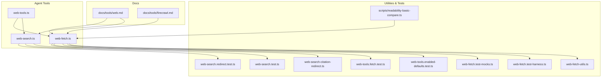
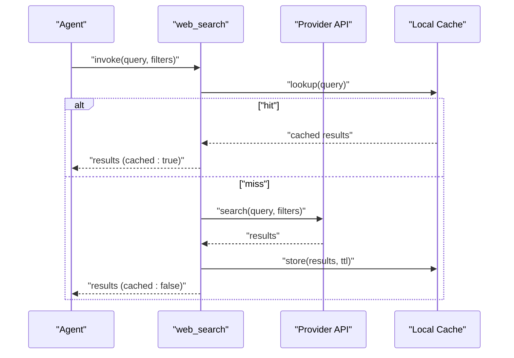
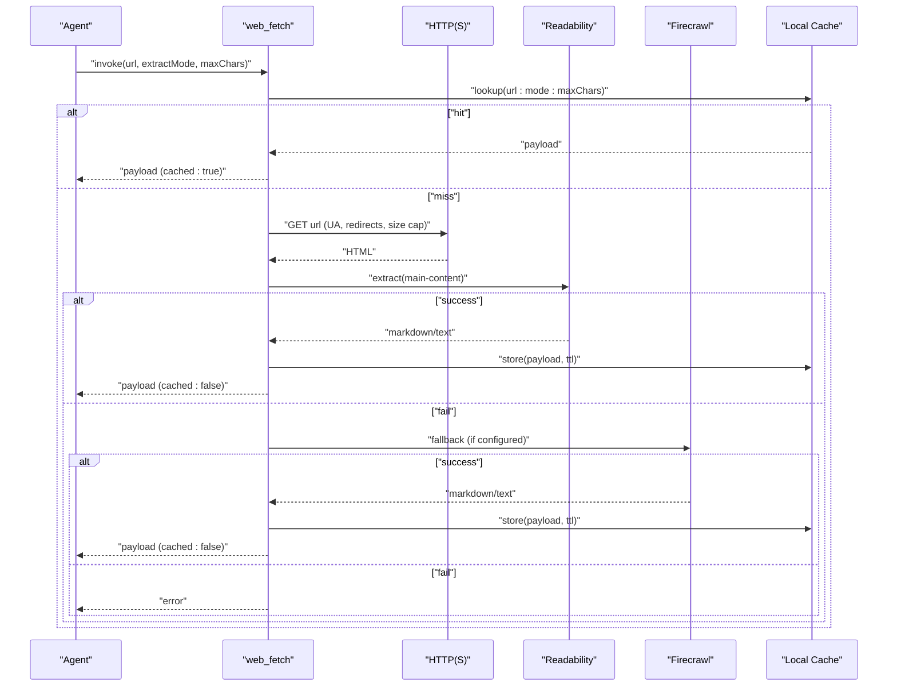
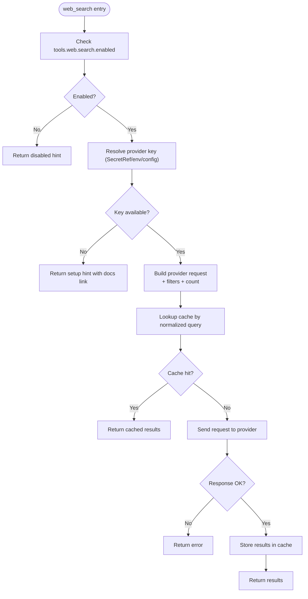
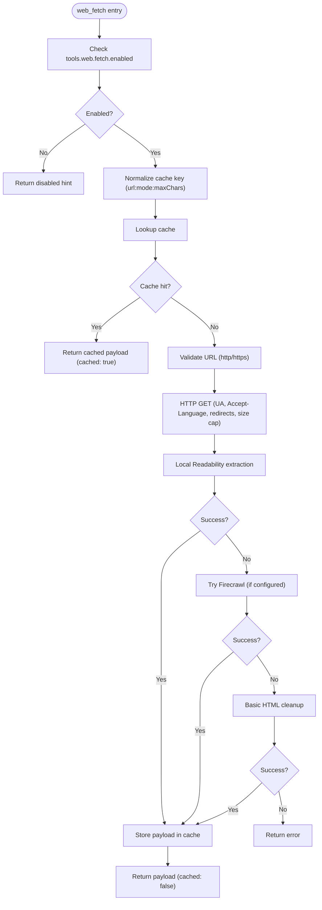
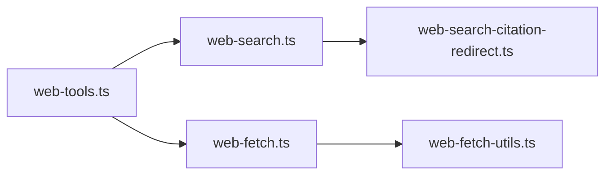

# Web Tools

<cite>
**Referenced Files in This Document**
- [docs/tools/web.md](file://docs/tools/web.md)
- [docs/tools/firecrawl.md](file://docs/tools/firecrawl.md)
- [src/agents/tools/web-search.ts](file://src/agents/tools/web-search.ts)
- [src/agents/tools/web-search-citation-redirect.ts](file://src/agents/tools/web-search-citation-redirect.ts)
- [src/agents/tools/web-search.test.ts](file://src/agents/tools/web-search.test.ts)
- [src/agents/tools/web-search.redirect.test.ts](file://src/agents/tools/web-search.redirect.test.ts)
- [src/agents/tools/web-fetch.ts](file://src/agents/tools/web-fetch.ts)
- [src/agents/tools/web-fetch-utils.ts](file://src/agents/tools/web-fetch-utils.ts)
- [src/agents/tools/web-fetch-visibility.test.ts](file://src/agents/tools/web-fetch-visibility.test.ts)
- [src/agents/tools/web-fetch.test-harness.ts](file://src/agents/tools/web-fetch.test-harness.ts)
- [src/agents/tools/web-fetch.test-mocks.ts](file://src/agents/tools/web-fetch.test-mocks.ts)
- [src/agents/tools/web-tools.ts](file://src/agents/tools/web-tools.ts)
- [src/agents/tools/web-tools.enabled-defaults.test.ts](file://src/agents/tools/web-tools.enabled-defaults.test.ts)
- [src/agents/tools/web-tools.fetch.test.ts](file://src/agents/tools/web-tools.fetch.test.ts)
- [scripts/readability-basic-compare.ts](file://scripts/readability-basic-compare.ts)
</cite>

## Table of Contents
1. [Introduction](#introduction)
2. [Project Structure](#project-structure)
3. [Core Components](#core-components)
4. [Architecture Overview](#architecture-overview)
5. [Detailed Component Analysis](#detailed-component-analysis)
6. [Dependency Analysis](#dependency-analysis)
7. [Performance Considerations](#performance-considerations)
8. [Troubleshooting Guide](#troubleshooting-guide)
9. [Conclusion](#conclusion)
10. [Appendices](#appendices)

## Introduction
This document explains OpenClaw’s web tools for searching and fetching web content. It covers:
- web_search: Search integrations with Brave, Gemini, Grok, Kimi, and Perplexity, including configuration, provider selection, and API key setup.
- web_fetch: Lightweight HTTP fetch and readable content extraction with markdown/text modes, caching, and optional Firecrawl fallback for anti-bot scenarios.

It also documents caching behavior, result limits, performance characteristics, optional Firecrawl integration, provider-specific configuration examples, rate-limiting considerations, and troubleshooting connectivity issues.

## Project Structure
The web tools are implemented as agent tools and documented in the repository’s documentation and source code:
- Documentation: docs/tools/web.md and docs/tools/firecrawl.md provide setup, configuration, and usage guidance.
- Implementation: src/agents/tools/web-search.ts and src/agents/tools/web-fetch.ts implement the tools and their runtime behavior.
- Utilities and tests: Supporting utilities and comprehensive tests validate behavior, SSRF protections, and proxy-aware dispatch.

**Diagram sources**
- [docs/tools/web.md](file://docs/tools/web.md#L1-L389)
- [docs/tools/firecrawl.md](file://docs/tools/firecrawl.md#L1-L63)
- [src/agents/tools/web-search.ts](file://src/agents/tools/web-search.ts#L1-L200)
- [src/agents/tools/web-search-citation-redirect.ts](file://src/agents/tools/web-search-citation-redirect.ts#L1-L120)
- [src/agents/tools/web-search.test.ts](file://src/agents/tools/web-search.test.ts#L1-L200)
- [src/agents/tools/web-search.redirect.test.ts](file://src/agents/tools/web-search.redirect.test.ts#L1-L200)
- [src/agents/tools/web-fetch.ts](file://src/agents/tools/web-fetch.ts#L494-L773)
- [src/agents/tools/web-fetch-utils.ts](file://src/agents/tools/web-fetch-utils.ts#L1-L200)
- [src/agents/tools/web-fetch.test-harness.ts](file://src/agents/tools/web-fetch.test-harness.ts#L1-L49)
- [src/agents/tools/web-fetch.test-mocks.ts](file://src/agents/tools/web-fetch.test-mocks.ts#L1-L200)
- [src/agents/tools/web-tools.ts](file://src/agents/tools/web-tools.ts#L1-L2)
- [src/agents/tools/web-tools.enabled-defaults.test.ts](file://src/agents/tools/web-tools.enabled-defaults.test.ts#L273-L306)
- [src/agents/tools/web-tools.fetch.test.ts](file://src/agents/tools/web-tools.fetch.test.ts#L1-L54)
- [scripts/readability-basic-compare.ts](file://scripts/readability-basic-compare.ts#L1-L49)

**Section sources**
- [docs/tools/web.md](file://docs/tools/web.md#L1-L389)
- [docs/tools/firecrawl.md](file://docs/tools/firecrawl.md#L1-L63)
- [src/agents/tools/web-tools.ts](file://src/agents/tools/web-tools.ts#L1-L2)

## Core Components
- web_search: Performs web searches against configured providers and returns structured results or AI-synthesized answers with citations. It supports result caching and provider auto-detection.
- web_fetch: Performs HTTP GET and extracts readable content (markdown/text) using local extraction first, optionally followed by Firecrawl fallback. It caches results and enforces safety and performance limits.

Key behaviors:
- Caching: Both tools cache results by query or URL with configurable TTL.
- Extraction: web_fetch prioritizes local extraction, then Firecrawl if configured.
- Safety: Strict SSRF protections and hostname validation; configurable redirect limits and response size caps.
- Proxy-aware dispatch: Respects HTTP_PROXY for provider requests.

**Section sources**
- [docs/tools/web.md](file://docs/tools/web.md#L20-L28)
- [docs/tools/web.md](file://docs/tools/web.md#L228-L389)
- [src/agents/tools/web-search.ts](file://src/agents/tools/web-search.ts#L1-L200)
- [src/agents/tools/web-fetch.ts](file://src/agents/tools/web-fetch.ts#L494-L773)

## Architecture Overview
The web tools integrate with provider APIs and optional Firecrawl. The runtime flow is:

**Diagram sources**
- [docs/tools/web.md](file://docs/tools/web.md#L20-L28)
- [src/agents/tools/web-search.ts](file://src/agents/tools/web-search.ts#L1-L200)

**Diagram sources**
- [docs/tools/web.md](file://docs/tools/web.md#L24-L26)
- [docs/tools/web.md](file://docs/tools/web.md#L338-L387)
- [src/agents/tools/web-fetch.ts](file://src/agents/tools/web-fetch.ts#L494-L773)
- [docs/tools/firecrawl.md](file://docs/tools/firecrawl.md#L47-L62)

## Detailed Component Analysis

### web_search
- Purpose: Search the web using Brave, Gemini, Grok, Kimi, or Perplexity.
- Provider auto-detection: Checks environment variables and config fields in a fixed order and falls back to Brave if none are found.
- Configuration fields:
  - tools.web.search.enabled
  - tools.web.search.provider
  - tools.web.search.apiKey (general), or provider-specific apiKey fields
  - tools.web.search.maxResults
  - tools.web.search.timeoutSeconds
  - tools.web.search.cacheTtlMinutes
  - Provider-specific options (e.g., tools.web.search.brave.mode, tools.web.search.gemini.model, tools.web.search.perplexity.baseUrl/model)
- Parameters:
  - query (required)
  - count (1–10)
  - country, language, freshness, date_after, date_before
  - ui_lang (Brave only)
  - domain_filter, max_tokens, max_tokens_per_page (Perplexity only)
- Caching: Query-based cache with configurable TTL.
- Proxy-aware dispatch: Honors HTTP_PROXY environment variable.

**Diagram sources**
- [docs/tools/web.md](file://docs/tools/web.md#L40-L56)
- [docs/tools/web.md](file://docs/tools/web.md#L228-L327)
- [src/agents/tools/web-search.ts](file://src/agents/tools/web-search.ts#L1-L200)

**Section sources**
- [docs/tools/web.md](file://docs/tools/web.md#L30-L56)
- [docs/tools/web.md](file://docs/tools/web.md#L228-L327)
- [src/agents/tools/web-search.ts](file://src/agents/tools/web-search.ts#L1-L200)
- [src/agents/tools/web-search.test.ts](file://src/agents/tools/web-search.test.ts#L1-L200)
- [src/agents/tools/web-search.redirect.test.ts](file://src/agents/tools/web-search.redirect.test.ts#L1-L200)
- [src/agents/tools/web-tools.enabled-defaults.test.ts](file://src/agents/tools/web-tools.enabled-defaults.test.ts#L273-L306)

### web_fetch
- Purpose: Fetch a URL and extract readable content (markdown/text).
- Extraction order:
  1) Local Readability extraction
  2) Optional Firecrawl fallback
  3) Basic HTML cleanup (last resort)
- Configuration fields:
  - tools.web.fetch.enabled
  - tools.web.fetch.maxChars, tools.web.fetch.maxCharsCap
  - tools.web.fetch.maxResponseBytes
  - tools.web.fetch.timeoutSeconds
  - tools.web.fetch.cacheTtlMinutes
  - tools.web.fetch.maxRedirects
  - tools.web.fetch.userAgent
  - tools.web.fetch.readability
  - tools.web.fetch.firecrawl.enabled, apiKey, baseUrl, onlyMainContent, maxAgeMs, timeoutSeconds
- Caching: URL-mode:maxChars-based cache with configurable TTL.
- Safety and limits:
  - Strict SSRF protections and hostname validation
  - Redirect limit enforcement
  - Response size cap before parsing
  - Truncation and warnings for oversized responses
- Firecrawl fallback:
  - Enabled by default when configured
  - Uses stealth/auto proxy mode and cache by default
  - SecretRef resolution occurs only when Firecrawl is active

**Diagram sources**
- [docs/tools/web.md](file://docs/tools/web.md#L328-L387)
- [docs/tools/firecrawl.md](file://docs/tools/firecrawl.md#L47-L62)
- [src/agents/tools/web-fetch.ts](file://src/agents/tools/web-fetch.ts#L494-L773)
- [src/agents/tools/web-fetch-utils.ts](file://src/agents/tools/web-fetch-utils.ts#L1-L200)
- [src/agents/tools/web-fetch.test-harness.ts](file://src/agents/tools/web-fetch.test-harness.ts#L1-L49)
- [src/agents/tools/web-tools.fetch.test.ts](file://src/agents/tools/web-tools.fetch.test.ts#L1-L54)

**Section sources**
- [docs/tools/web.md](file://docs/tools/web.md#L328-L387)
- [docs/tools/firecrawl.md](file://docs/tools/firecrawl.md#L1-L63)
- [src/agents/tools/web-fetch.ts](file://src/agents/tools/web-fetch.ts#L494-L773)
- [src/agents/tools/web-fetch-utils.ts](file://src/agents/tools/web-fetch-utils.ts#L1-L200)
- [src/agents/tools/web-fetch.test-harness.ts](file://src/agents/tools/web-fetch.test-harness.ts#L1-L49)
- [src/agents/tools/web-tools.fetch.test.ts](file://src/agents/tools/web-tools.fetch.test.ts#L1-L54)

### Provider-Specific Configuration Examples
- Brave Search:
  - Provider selection and API key storage via config or environment variable.
  - Optional Brave LLM context mode with provider-specific constraints.
- Perplexity Search:
  - Standard Search API or OpenRouter/Sonar compatibility path via baseUrl/model.
  - Supports advanced extraction controls (max_tokens, max_tokens_per_page) and domain filtering.
- Gemini:
  - Google Search grounding returns AI-synthesized answers with citations.
  - Supports model selection and automatic citation URL resolution with SSRF safeguards.
- Grok and Kimi:
  - Provider-specific API keys and models; documented in the web tools guide.

**Section sources**
- [docs/tools/web.md](file://docs/tools/web.md#L58-L104)
- [docs/tools/web.md](file://docs/tools/web.md#L106-L183)
- [docs/tools/web.md](file://docs/tools/web.md#L185-L227)

### Optional Firecrawl Integration
- Purpose: Anti-bot detection bypass and cached extraction for JS-heavy or blocked pages.
- Activation: Configure apiKey and optional baseUrl; enabled by default when configured.
- Behavior: Automatic stealth/proxy mode and caching; SecretRef resolution only when active.
- Fallback order: Readability → Firecrawl → basic cleanup.

**Section sources**
- [docs/tools/firecrawl.md](file://docs/tools/firecrawl.md#L1-L63)
- [docs/tools/web.md](file://docs/tools/web.md#L338-L387)

## Dependency Analysis
- web_tools exports:
  - createWebFetchTool and fetchFirecrawlContent
  - createWebSearchTool
- web_search depends on:
  - Provider-specific request builders and response normalization
  - Citation redirect resolution for Gemini
  - Cache utilities and SSRF protections
- web_fetch depends on:
  - Readability extraction
  - Firecrawl client (when enabled)
  - Cache utilities and SSRF protections
  - Proxy-aware dispatcher for outbound requests

**Diagram sources**
- [src/agents/tools/web-tools.ts](file://src/agents/tools/web-tools.ts#L1-L2)
- [src/agents/tools/web-search.ts](file://src/agents/tools/web-search.ts#L1-L200)
- [src/agents/tools/web-search-citation-redirect.ts](file://src/agents/tools/web-search-citation-redirect.ts#L1-L120)
- [src/agents/tools/web-fetch.ts](file://src/agents/tools/web-fetch.ts#L494-L773)
- [src/agents/tools/web-fetch-utils.ts](file://src/agents/tools/web-fetch-utils.ts#L1-L200)

**Section sources**
- [src/agents/tools/web-tools.ts](file://src/agents/tools/web-tools.ts#L1-L2)
- [src/agents/tools/web-search.ts](file://src/agents/tools/web-search.ts#L1-L200)
- [src/agents/tools/web-search-citation-redirect.ts](file://src/agents/tools/web-search-citation-redirect.ts#L1-L120)
- [src/agents/tools/web-fetch.ts](file://src/agents/tools/web-fetch.ts#L494-L773)
- [src/agents/tools/web-fetch-utils.ts](file://src/agents/tools/web-fetch-utils.ts#L1-L200)

## Performance Considerations
- Caching:
  - web_search: Query-based cache with configurable TTL.
  - web_fetch: URL-mode:maxChars-based cache with configurable TTL.
- Limits:
  - web_fetch caps response size before parsing and truncates content to protect memory.
  - Redirects and timeouts are configurable to balance reliability and latency.
- Extraction pipeline:
  - Prefer local Readability extraction; Firecrawl adds overhead and credits consumption.
- Proxy-aware dispatch:
  - Honors HTTP_PROXY to route traffic through corporate proxies when needed.

**Section sources**
- [docs/tools/web.md](file://docs/tools/web.md#L20-L28)
- [docs/tools/web.md](file://docs/tools/web.md#L338-L387)
- [src/agents/tools/web-tools.enabled-defaults.test.ts](file://src/agents/tools/web-tools.enabled-defaults.test.ts#L286-L297)

## Troubleshooting Guide
Common issues and resolutions:
- Missing API keys:
  - web_search returns a concise setup hint with a documentation link when keys are absent.
- Invalid URL or protocol:
  - web_fetch rejects non-http/https URLs and throws descriptive errors.
- Private/internal hostnames and SSRF:
  - Strict hostname validation and pinned DNS lookups prevent SSRF; adjust or disable only if you fully trust the environment.
- Oversized responses:
  - web_fetch caps response bytes and truncates content; increase maxResponseBytes cautiously.
- Firecrawl failures:
  - If Firecrawl is configured but fails, verify apiKey and service availability; fallback to local extraction or disable Firecrawl.
- Proxy connectivity:
  - Ensure HTTP_PROXY is set correctly; the dispatcher will route provider requests accordingly.

**Section sources**
- [docs/tools/web.md](file://docs/tools/web.md#L338-L387)
- [src/agents/tools/web-fetch.test-harness.ts](file://src/agents/tools/web-fetch.test-harness.ts#L1-L49)
- [src/agents/tools/web-tools.fetch.test.ts](file://src/agents/tools/web-tools.fetch.test.ts#L1-L54)
- [src/agents/tools/web-tools.enabled-defaults.test.ts](file://src/agents/tools/web-tools.enabled-defaults.test.ts#L286-L297)

## Conclusion
OpenClaw’s web tools provide a robust, secure, and configurable way to search and fetch web content. web_search integrates multiple providers with auto-detection and caching, while web_fetch offers efficient extraction with optional Firecrawl fallback for challenging sites. Proper configuration of API keys, caching, and safety settings ensures reliable operation across environments.

## Appendices

### Provider Selection and Auto-Detection
- Order of preference for selecting a provider when none is explicitly set:
  1) Brave (BRAVE_API_KEY or tools.web.search.apiKey)
  2) Gemini (GEMINI_API_KEY or tools.web.search.gemini.apiKey)
  3) Grok (XAI_API_KEY or tools.web.search.grok.apiKey)
  4) Kimi/Moonshot (KIMI_API_KEY or MOONSHOT_API_KEY or tools.web.search.kimi.apiKey)
  5) Perplexity (PERPLEXITY_API_KEY or OPENROUTER_API_KEY or tools.web.search.perplexity.apiKey)

**Section sources**
- [docs/tools/web.md](file://docs/tools/web.md#L40-L56)

### Rate Limiting and Quotas
- Provider quotas and billing:
  - Brave Search includes monthly free credit; set usage limits in the provider dashboard.
  - Perplexity and other providers may impose request-based quotas; monitor usage and adjust counts/timeouts accordingly.
- Recommendations:
  - Use caching to minimize repeated requests.
  - Tune maxResults/count and freshness to reduce payload sizes.
  - Consider Firecrawl for persistent caching on difficult sites, understanding its credit usage.

**Section sources**
- [docs/tools/web.md](file://docs/tools/web.md#L68-L72)
- [docs/tools/web.md](file://docs/tools/web.md#L74-L82)

### Example Scripts and Utilities
- Readability comparison script demonstrates extraction behavior and validates that basic extraction requires readability enabled or Firecrawl.

**Section sources**
- [scripts/readability-basic-compare.ts](file://scripts/readability-basic-compare.ts#L1-L49)