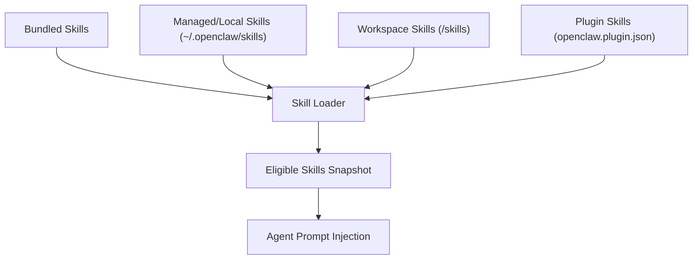
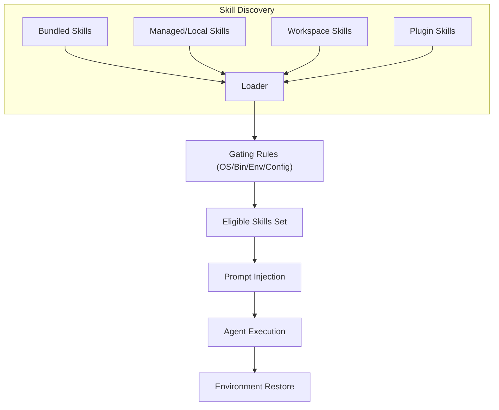
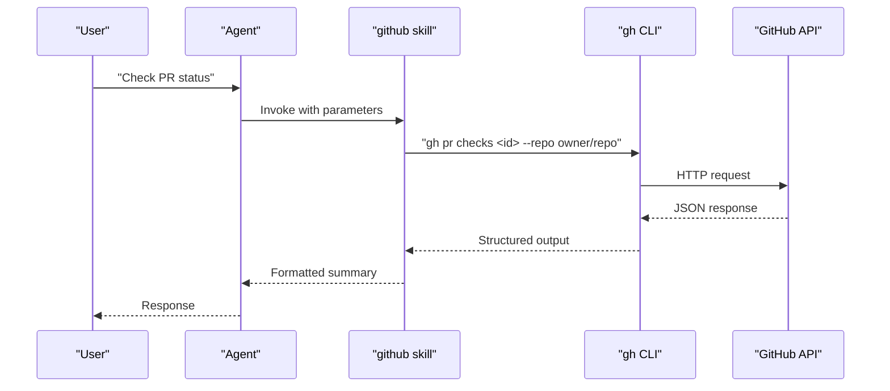
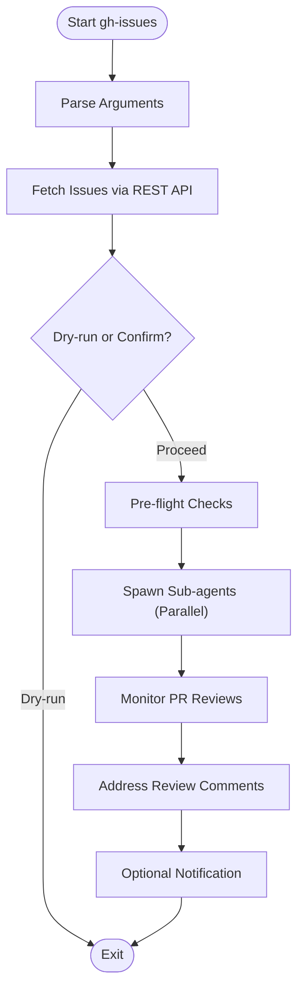
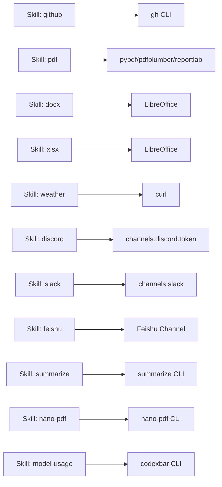

# Built-in Skills Library

<cite>
**Referenced Files in This Document**
- [skills.md](file://docs/tools/skills.md)
- [creating-skills.md](file://docs/tools/creating-skills.md)
- [github/SKILL.md](file://skills/github/SKILL.md)
- [pdf/SKILL.md](file://skills/pdf/SKILL.md)
- [docx/SKILL.md](file://skills/docx/SKILL.md)
- [xlsx/SKILL.md](file://skills/xlsx/SKILL.md)
- [weather/SKILL.md](file://skills/weather/SKILL.md)
- [discord/SKILL.md](file://skills/discord/SKILL.md)
- [slack/SKILL.md](file://skills/slack/SKILL.md)
- [feishu-message-sender/SKILL.md](file://skills/feishu-message-sender/SKILL.md)
- [gh-issues/SKILL.md](file://skills/gh-issues/SKILL.md)
- [summarize/SKILL.md](file://skills/summarize/SKILL.md)
- [nano-pdf/SKILL.md](file://skills/nano-pdf/SKILL.md)
- [model-usage/SKILL.md](file://skills/model-usage/SKILL.md)
- [index.ts](file://extensions/github-copilot/index.ts)
</cite>

## Table of Contents
1. [Introduction](#introduction)
2. [Project Structure](#project-structure)
3. [Core Components](#core-components)
4. [Architecture Overview](#architecture-overview)
5. [Detailed Component Analysis](#detailed-component-analysis)
6. [Dependency Analysis](#dependency-analysis)
7. [Performance Considerations](#performance-considerations)
8. [Troubleshooting Guide](#troubleshooting-guide)
9. [Conclusion](#conclusion)
10. [Appendices](#appendices)

## Introduction
This document presents the built-in skills library of OpenClaw, showcasing the comprehensive collection of pre-built skills available out of the box. It focuses on popular capabilities such as GitHub integration, document processing (PDF, DOCX, XLSX), weather services, and communication platform integrations. For each skill, we explain functionality, configuration options, authentication requirements, rate limiting, and usage patterns. Practical examples demonstrate deployment, configuration, and integration with agents. Guidance is also provided on customization, parameter configuration, advanced usage scenarios, selection criteria, and performance optimization.

## Project Structure
OpenClaw organizes skills as self-contained directories with a SKILL.md file that defines metadata, instructions, and optional scripts. Skills are loaded from three locations with clear precedence:
- Bundled skills (shipped with the installation)
- Managed/local skills (~/.openclaw/skills)
- Workspace skills (<workspace>/skills)

Plugins can ship their own skills, which participate in the same precedence rules. Skills can be gated by environment, config, and binary presence, and can be toggled via configuration.

**Diagram sources**
- [skills.md:13-48](file://docs/tools/skills.md#L13-L48)

**Section sources**
- [skills.md:13-48](file://docs/tools/skills.md#L13-L48)
- [skills.md:189-229](file://docs/tools/skills.md#L189-L229)

## Core Components
This section highlights the built-in skills that align with the documentation objective, grouped by category.

- GitHub integration
  - github: Interact with GitHub via the gh CLI for issues, PRs, CI runs, and API queries.
  - gh-issues: Orchestrator skill to fetch issues, spawn sub-agents, and monitor PR reviews.
- Document processing
  - pdf: Comprehensive PDF operations (merge, split, extract text/tables, create, watermark, encrypt, OCR).
  - docx: DOCX creation, editing, and analysis with docx-js and LibreOffice integration.
  - xlsx: Excel/XLSX editing, formatting, formulas, and recalculation with openpyxl and LibreOffice.
  - nano-pdf: Natural-language editing of specific PDF pages using nano-pdf CLI.
- Weather services
  - weather: Current weather and forecasts via wttr.in or Open-Meteo (no API key required).
- Communication platform integrations
  - discord: Message sending, reactions, reads, edits, deletes, polls, pins, threads, and presence via the message tool.
  - slack: Reaction, pin/unpin, send/edit/delete, read, member info, and emoji list via the slack tool.
  - feishu-message-sender: Sending text, files, images, and mixed messages via Feishu channel.

**Section sources**
- [github/SKILL.md:1-164](file://skills/github/SKILL.md#L1-L164)
- [gh-issues/SKILL.md:1-800](file://skills/gh-issues/SKILL.md#L1-L800)
- [pdf/SKILL.md:1-315](file://skills/pdf/SKILL.md#L1-L315)
- [docx/SKILL.md:1-489](file://skills/docx/SKILL.md#L1-L489)
- [xlsx/SKILL.md:1-299](file://skills/xlsx/SKILL.md#L1-L299)
- [nano-pdf/SKILL.md:1-39](file://skills/nano-pdf/SKILL.md#L1-L39)
- [weather/SKILL.md:1-113](file://skills/weather/SKILL.md#L1-L113)
- [discord/SKILL.md:1-198](file://skills/discord/SKILL.md#L1-L198)
- [slack/SKILL.md:1-145](file://skills/slack/SKILL.md#L1-L145)
- [feishu-message-sender/SKILL.md:1-377](file://skills/feishu-message-sender/SKILL.md#L1-L377)

## Architecture Overview
OpenClaw’s skill system is AgentSkills-compatible and integrates with the agent runtime through a loader that:
- Discovers skills from bundled, managed, workspace, and plugin sources
- Filters skills at load time based on gating rules (OS, binaries, environment, config)
- Injects eligible skills into the agent prompt and restores environment after runs
- Supports hot reload via a skills watcher and session snapshots

**Diagram sources**
- [skills.md:106-187](file://docs/tools/skills.md#L106-L187)
- [skills.md:230-246](file://docs/tools/skills.md#L230-L246)

**Section sources**
- [skills.md:106-187](file://docs/tools/skills.md#L106-L187)
- [skills.md:230-246](file://docs/tools/skills.md#L230-L246)

## Detailed Component Analysis

### GitHub Integration
- Functionality
  - Uses the gh CLI to list/check issues, create/close issues, list/merge PRs, check CI runs, and query GitHub API with JSON output and jq filtering.
  - Includes templates for PR review summaries and issue triage.
- Authentication and gating
  - Requires the gh CLI; installers are provided for brew/apt.
  - Rate limits apply; caching is recommended for repeated queries.
- Usage patterns
  - Always specify --repo owner/repo when not in a git directory.
  - Use URLs directly for quick views.
- Configuration and customization
  - Configure via skills.entries.<name> in ~/.openclaw/openclaw.json with env and apiKey fields.
  - Supports primaryEnv for token injection.

**Diagram sources**
- [github/SKILL.md:66-114](file://skills/github/SKILL.md#L66-L114)

**Section sources**
- [github/SKILL.md:1-164](file://skills/github/SKILL.md#L1-L164)
- [skills.md:106-187](file://docs/tools/skills.md#L106-L187)
- [skills.md:189-229](file://docs/tools/skills.md#L189-L229)

### GitHub Issues Orchestrator (gh-issues)
- Functionality
  - Parses arguments, fetches issues via GitHub REST API (no gh CLI), optionally forks, spawns sub-agents to implement fixes, and monitors PR reviews.
  - Supports dry-run, watch mode, cron mode, and notifications to external channels.
- Authentication and gating
  - Uses GH_TOKEN environment variable; resolves from config if not present.
  - Requires curl, git, gh for argument parsing; API calls use Authorization: Bearer.
- Usage patterns
  - Flags include filtering by label, milestone, assignee, state, and fork mode.
  - Cron mode selects next eligible issue using a cursor file and claims tracking.
- Configuration and customization
  - Configure via skills.entries.gh-issues with apiKey and env injection.
  - Model override per sub-agent and notification channel supported.

**Diagram sources**
- [gh-issues/SKILL.md:21-507](file://skills/gh-issues/SKILL.md#L21-L507)

**Section sources**
- [gh-issues/SKILL.md:1-800](file://skills/gh-issues/SKILL.md#L1-L800)
- [skills.md:106-187](file://docs/tools/skills.md#L106-L187)
- [skills.md:189-229](file://docs/tools/skills.md#L189-L229)

### Document Processing: PDF
- Functionality
  - Read/extract text and tables, merge/split, rotate, watermark, create, fill forms, encrypt/decrypt, extract images, and OCR scanned PDFs.
  - Provides Python libraries (pypdf, pdfplumber, reportlab) and command-line tools (pdftotext, qpdf, pdftk).
- Authentication and gating
  - No API key required; depends on installed binaries and Python libraries.
- Usage patterns
  - Use --json/--jq for structured output and filtering.
  - Combine pypdf and pdfplumber for robust extraction and table handling.
- Configuration and customization
  - Install via provided installer specs; ensure environment supports required tools.

**Section sources**
- [pdf/SKILL.md:1-315](file://skills/pdf/SKILL.md#L1-L315)
- [skills.md:106-187](file://docs/tools/skills.md#L106-L187)

### Document Processing: DOCX
- Functionality
  - Create new DOCX with docx-js, accept tracked changes, convert to images, and edit existing documents by unpacking and repacking XML.
  - Requires LibreOffice for .doc/.docx conversions and tracked-change acceptance; Poppler for document-to-image workflows.
- Authentication and gating
  - No API key required; depends on LibreOffice and Poppler availability.
- Usage patterns
  - Set page size explicitly (US Letter vs A4) and use DXA units for consistent rendering.
  - Avoid Unicode bullets; use numbering configs with LevelFormat.BULLET.
  - Always set table width with DXA and match columnWidths.
- Configuration and customization
  - Follow critical rules for docx-js, headers/footers, images, and table of contents.

**Section sources**
- [docx/SKILL.md:1-489](file://skills/docx/SKILL.md#L1-L489)
- [skills.md:106-187](file://docs/tools/skills.md#L106-L187)

### Document Processing: XLSX
- Functionality
  - Read/analyze data with pandas, create/edit spreadsheets with openpyxl, enforce financial modeling standards, and recalculate formulas with LibreOffice.
  - Emphasizes formulas over hardcoded values and provides verification checklist.
- Authentication and gating
  - No API key required; depends on LibreOffice and git availability.
- Usage patterns
  - Use openpyxl for complex formatting and formulas; pandas for data operations.
  - Recalculate formulas with scripts/recalc.py and interpret JSON error reports.
- Configuration and customization
  - Follow color coding and number formatting standards for financial models.

**Section sources**
- [xlsx/SKILL.md:1-299](file://skills/xlsx/SKILL.md#L1-L299)
- [skills.md:106-187](file://docs/tools/skills.md#L106-L187)

### Document Processing: nano-pdf
- Functionality
  - Edit a specific page in a PDF using natural-language instructions via the nano-pdf CLI.
- Authentication and gating
  - Requires nano-pdf CLI; install via uv installer.
- Usage patterns
  - Page indexing may be 0-based or 1-based; sanity-check outputs.
- Configuration and customization
  - Use installer specs for platform-specific installation.

**Section sources**
- [nano-pdf/SKILL.md:1-39](file://skills/nano-pdf/SKILL.md#L1-L39)
- [skills.md:106-187](file://docs/tools/skills.md#L106-L187)

### Weather Services
- Functionality
  - Retrieve current weather and forecasts via wttr.in or Open-Meteo.
- Authentication and gating
  - No API key required; depends on curl availability.
- Usage patterns
  - Include city, region, or airport code; use format options for one-liners, JSON, or images.
- Configuration and customization
  - Configure via skills.entries.weather in ~/.openclaw/openclaw.json with env and apiKey fields.

**Section sources**
- [weather/SKILL.md:1-113](file://skills/weather/SKILL.md#L1-L113)
- [skills.md:189-229](file://docs/tools/skills.md#L189-L229)

### Communication Platform Integrations

#### Discord
- Functionality
  - Send messages, attach media, react, read, edit/delete, poll, pin, thread, search, and presence via the message tool.
- Authentication and gating
  - Requires channels.discord.token configuration; respects gating for roles, moderation, presence, channels.
- Usage patterns
  - Prefer explicit IDs; use components v2 for rich UI; avoid Markdown tables.
- Configuration and customization
  - Configure via channels configuration; use accountId for multi-account support.

**Section sources**
- [discord/SKILL.md:1-198](file://skills/discord/SKILL.md#L1-L198)

#### Slack
- Functionality
  - React, manage pins, send/edit/delete messages, and fetch member info via the slack tool.
- Authentication and gating
  - Requires channels.slack configuration.
- Usage patterns
  - Collect channelId and messageId; use reactions, pins, and member info actions.
- Configuration and customization
  - Configure via channels configuration.

**Section sources**
- [slack/SKILL.md:1-145](file://skills/slack/SKILL.md#L1-L145)

#### Feishu Message Sender
- Functionality
  - Send text, files, images, and mixed messages via Feishu channel using the message tool.
- Authentication and gating
  - No API key required; depends on Feishu channel configuration.
- Usage patterns
  - Use Python wrappers to send text, files, and images; ensure files are placed in the media outbound directory.
- Configuration and customization
  - Configure via channels configuration; observe file size limits.

**Section sources**
- [feishu-message-sender/SKILL.md:1-377](file://skills/feishu-message-sender/SKILL.md#L1-L377)

### Additional Utilities

#### Summarize
- Functionality
  - Summarize URLs, local files, and YouTube links using the summarize CLI.
- Authentication and gating
  - Requires summarize CLI; install via brew installer.
- Usage patterns
  - Use model flags and service keys (OPENAI_API_KEY, ANTHROPIC_API_KEY, etc.).
- Configuration and customization
  - Optional config file and service tokens.

**Section sources**
- [summarize/SKILL.md:1-88](file://skills/summarize/SKILL.md#L1-L88)
- [skills.md:106-187](file://docs/tools/skills.md#L106-L187)

#### Model Usage
- Functionality
  - Summarize per-model usage costs from CodexBar’s local cost logs.
- Authentication and gating
  - Requires macOS and codexbar CLI; install via brew installer.
- Usage patterns
  - Use scripts to summarize current or all models; supports JSON output.
- Configuration and customization
  - Use codexbar CLI or pass JSON file; override model selection.

**Section sources**
- [model-usage/SKILL.md:1-70](file://skills/model-usage/SKILL.md#L1-L70)
- [skills.md:106-187](file://docs/tools/skills.md#L106-L187)

## Dependency Analysis
Skills rely on external tools and environment variables. The loader enforces gating rules to ensure eligibility:
- OS/platform gating via metadata.openclaw.os
- Binary presence via metadata.openclaw.requires.bins and metadata.openclaw.requires.anyBins
- Environment variables via metadata.openclaw.requires.env
- Configuration gating via metadata.openclaw.requires.config
- Installer specs for brew/node/go/uv/download

**Diagram sources**
- [github/SKILL.md:4-28](file://skills/github/SKILL.md#L4-L28)
- [pdf/SKILL.md:28-315](file://skills/pdf/SKILL.md#L28-L315)
- [docx/SKILL.md:9-14](file://skills/docx/SKILL.md#L9-L14)
- [xlsx/SKILL.md:72-81](file://skills/xlsx/SKILL.md#L72-L81)
- [weather/SKILL.md:4-5](file://skills/weather/SKILL.md#L4-L5)
- [discord/SKILL.md:4](file://skills/discord/SKILL.md#L4)
- [slack/SKILL.md:4](file://skills/slack/SKILL.md#L4)
- [feishu-message-sender/SKILL.md:4-11](file://skills/feishu-message-sender/SKILL.md#L4-L11)
- [summarize/SKILL.md:5-22](file://skills/summarize/SKILL.md#L5-L22)
- [nano-pdf/SKILL.md:5-22](file://skills/nano-pdf/SKILL.md#L5-L22)
- [model-usage/SKILL.md:4-22](file://skills/model-usage/SKILL.md#L4-L22)

**Section sources**
- [skills.md:106-187](file://docs/tools/skills.md#L106-L187)

## Performance Considerations
- Skills snapshot caching
  - Eligible skills are snapshotted at session start and reused across turns, reducing repeated discovery overhead.
- Prompt token impact
  - The system injects a compact XML list of skills into the system prompt; token cost scales with the number and length of skill names/descriptions/locations.
- Sandbox considerations
  - Binary requirements must be satisfied both on host and inside sandbox containers; setupCommand can be used to provision tools.
- Hot reload
  - Skills watcher can refresh the list on SKILL.md changes, enabling “hot reload” behavior.

**Section sources**
- [skills.md:242-246](file://docs/tools/skills.md#L242-L246)
- [skills.md:269-286](file://docs/tools/skills.md#L269-L286)
- [skills.md:138-147](file://docs/tools/skills.md#L138-L147)

## Troubleshooting Guide
- Authentication failures
  - For skills requiring tokens (e.g., weather with API keys, GitHub issues), ensure env vars or config entries are set correctly.
- Rate limiting
  - Many services (GitHub, weather) apply rate limits; cache repeated queries or throttle requests.
- Binary/tool availability
  - Ensure required binaries are installed and accessible in PATH; use installer specs where provided.
- Environment injection
  - Secrets are injected per agent run; verify env and apiKey configuration under skills.entries.<name>.
- Remote macOS nodes
  - macOS-only skills may be eligible when required binaries are present on a connected macOS node with system.run allowed.

**Section sources**
- [skills.md:69-76](file://docs/tools/skills.md#L69-L76)
- [github/SKILL.md:159-164](file://skills/github/SKILL.md#L159-L164)
- [weather/SKILL.md:107-113](file://skills/weather/SKILL.md#L107-L113)
- [skills.md:230-241](file://docs/tools/skills.md#L230-L241)
- [skills.md:248-252](file://docs/tools/skills.md#L248-L252)

## Conclusion
OpenClaw’s built-in skills library provides a robust foundation for automating tasks across development, documentation, and communication domains. By leveraging gating rules, environment injection, and hot reload capabilities, teams can tailor skills to their workflows while maintaining security and performance. Select skills based on platform requirements, authentication needs, and rate constraints, and use the provided configuration mechanisms to optimize performance and reliability.

## Appendices

### Practical Deployment and Configuration Examples
- Enable and configure a skill
  - Add or modify skills.entries.<name> in ~/.openclaw/openclaw.json with enabled, env, apiKey, and config fields.
- Install prerequisites
  - Use installer specs defined in SKILL.md metadata to install required tools.
- Integrate with agents
  - Use slash commands or tool dispatch for user-invocable skills; leverage model invocation for non-user skills.

**Section sources**
- [skills.md:189-229](file://docs/tools/skills.md#L189-L229)
- [skills.md:148-184](file://docs/tools/skills.md#L148-L184)

### Creating Custom Skills
- Create a new workspace skill by adding a directory with a SKILL.md file and optional scripts.
- Follow best practices: be concise, safety-first, and test locally.

**Section sources**
- [creating-skills.md:1-59](file://docs/tools/creating-skills.md#L1-L59)

### GitHub Copilot Provider Integration
- The GitHub Copilot provider plugin resolves tokens and exposes usage snapshots, integrating with OpenClaw’s provider system.

**Section sources**
- [index.ts:1-142](file://extensions/github-copilot/index.ts#L1-L142)