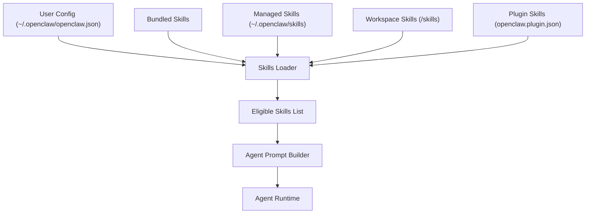
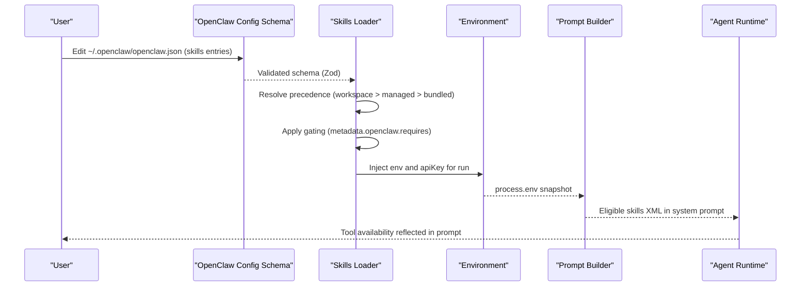
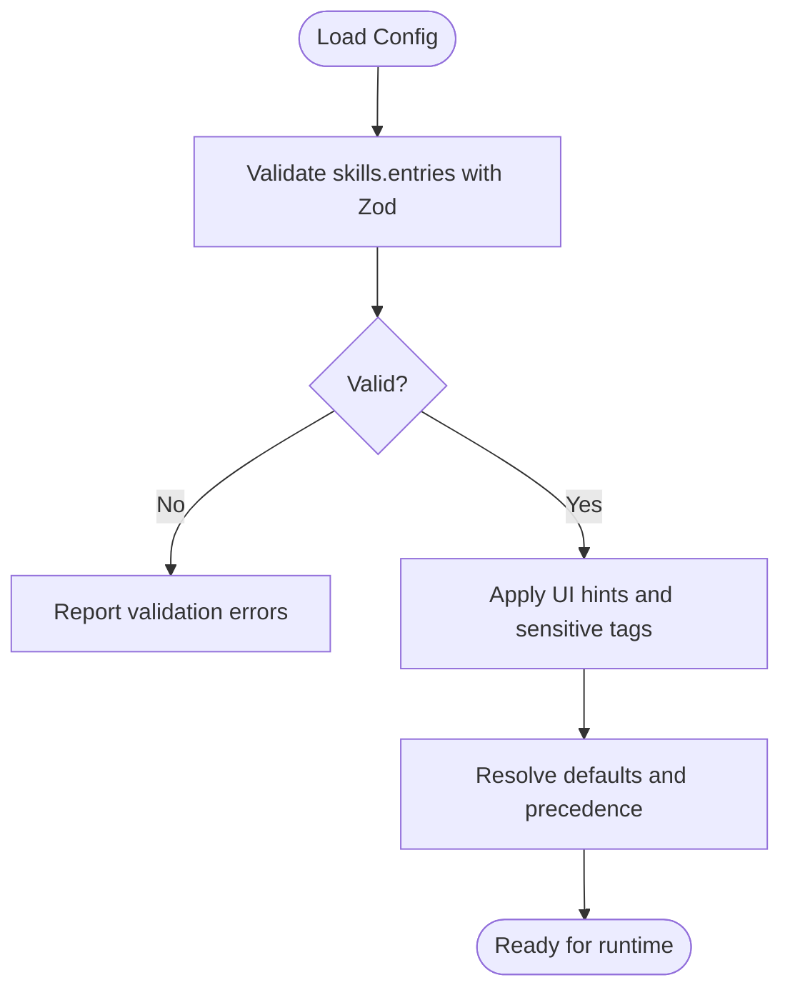
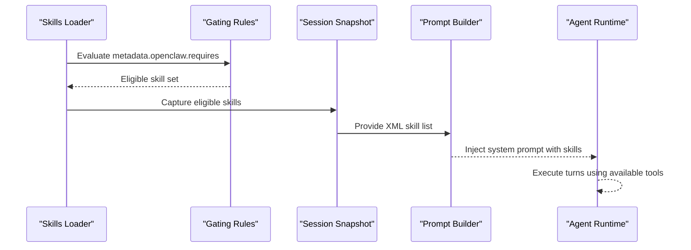
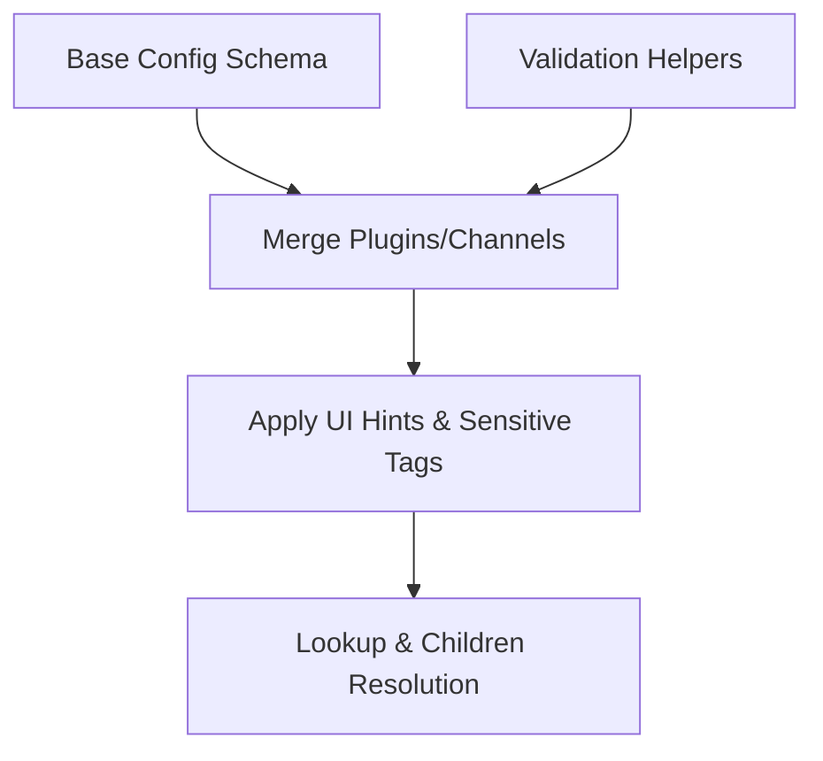

# Skill Configuration & Parameters

<cite>
**Referenced Files in This Document**
- [skills-config.md](file://docs/tools/skills-config.md)
- [skills.md](file://docs/tools/skills.md)
- [schema.ts](file://src/config/schema.ts)
- [zod-schema.ts](file://src/config/zod-schema.ts)
- [schema.hints.ts](file://src/config/schema.hints.ts)
- [config-schema-helpers.ts](file://extensions/shared/config-schema-helpers.ts)
- [openclaw.plugin.json (anthropic)](file://extensions/anthropic/openclaw.plugin.json)
- [openclaw.plugin.json (google)](file://extensions/google/openclaw.plugin.json)
- [openclaw.plugin.json (openai)](file://extensions/openai/openclaw.plugin.json)
- [SKILL.md (lobster)](file://extensions/lobster/SKILL.md)
- [index.ts (lobster)](file://extensions/lobster/index.ts)
</cite>

## Table of Contents
1. [Introduction](#introduction)
2. [Project Structure](#project-structure)
3. [Core Components](#core-components)
4. [Architecture Overview](#architecture-overview)
5. [Detailed Component Analysis](#detailed-component-analysis)
6. [Dependency Analysis](#dependency-analysis)
7. [Performance Considerations](#performance-considerations)
8. [Troubleshooting Guide](#troubleshooting-guide)
9. [Conclusion](#conclusion)
10. [Appendices](#appendices)

## Introduction
This document explains how skills are configured, validated, and integrated into agent workflows in the system. It covers the skill configuration schema, parameter validation, default handling, environment variable integration, dynamic parameter resolution, prompt building, and security considerations. Practical examples demonstrate configuring skills for authentication, API keys, and service-specific settings across different deployment environments.

## Project Structure
Skills are organized as AgentSkills-compatible directories with a SKILL.md frontmatter and optional metadata. They are loaded from three locations with precedence:
- Bundled skills (distributed with the app)
- Managed/local skills (~/.openclaw/skills)
- Workspace skills (<workspace>/skills)

Plugins can ship skills via openclaw.plugin.json entries. Skills can be gated by environment, binaries, and configuration presence.

**Diagram sources**
- [skills.md:13-40](file://docs/tools/skills.md#L13-L40)
- [skills-config.md:11-39](file://docs/tools/skills-config.md#L11-L39)

**Section sources**
- [skills.md:13-40](file://docs/tools/skills.md#L13-L40)
- [skills-config.md:11-39](file://docs/tools/skills-config.md#L11-L39)

## Core Components
- Skill configuration schema and overrides:
  - Global skills settings under skills in the user config
  - Per-skill entries under skills.entries keyed by skill name or metadata.openclaw.skillKey
- Validation and defaults:
  - Zod-based schema enforces structure and types for skills entries
  - UI hints and sensitive path tagging inform the Control UI and redaction
- Environment injection:
  - At runtime, env and apiKey fields are applied to process.env for the agent run
- Dynamic resolution:
  - Watcher refreshes the skills snapshot when SKILL.md changes
  - Snapshot reused per session; changes take effect on next session or when watcher refreshes

**Section sources**
- [skills-config.md:41-78](file://docs/tools/skills-config.md#L41-L78)
- [zod-schema.ts:140-147](file://src/config/zod-schema.ts#L140-L147)
- [schema.ts:449-484](file://src/config/schema.ts#L449-L484)
- [schema.hints.ts:125-147](file://src/config/schema.hints.ts#L125-L147)

## Architecture Overview
The skill configuration pipeline integrates with the global configuration system and agent runtime:

**Diagram sources**
- [zod-schema.ts:140-147](file://src/config/zod-schema.ts#L140-L147)
- [schema.ts:449-484](file://src/config/schema.ts#L449-L484)
- [skills.md:230-247](file://docs/tools/skills.md#L230-L247)

## Detailed Component Analysis

### Skill Configuration Schema
- Top-level skills fields:
  - allowBundled: optional allowlist for bundled skills
  - load: extraDirs, watch, watchDebounceMs
  - install: preferBrew, nodeManager
  - entries: per-skill overrides
- Per-skill entry fields:
  - enabled: toggle
  - env: environment variables injected into the process
  - apiKey: convenience for primary env var; supports plaintext or SecretRef
  - config: arbitrary key-value bag for skill-specific parameters

Validation and defaults:
- Zod schema enforces strict object shapes for skills entries
- Sensitive tagging and UI hints propagate to the Control UI

**Section sources**
- [skills-config.md:41-78](file://docs/tools/skills-config.md#L41-L78)
- [zod-schema.ts:140-147](file://src/config/zod-schema.ts#L140-L147)
- [schema.ts:449-484](file://src/config/schema.ts#L449-L484)
- [schema.hints.ts:125-147](file://src/config/schema.hints.ts#L125-L147)

### Parameter Validation and Defaults
- Validation:
  - Zod schemas define allowed fields and types for skills entries
  - AdditionalProperties and strict object enforcement prevent invalid keys
- Defaults:
  - Optional booleans and records default to undefined unless provided
  - UI hints derive labels, help text, placeholders, and grouping for the Control UI

**Diagram sources**
- [zod-schema.ts:140-147](file://src/config/zod-schema.ts#L140-L147)
- [schema.ts:449-484](file://src/config/schema.ts#L449-L484)
- [schema.hints.ts:125-147](file://src/config/schema.hints.ts#L125-L147)

**Section sources**
- [zod-schema.ts:140-147](file://src/config/zod-schema.ts#L140-L147)
- [schema.ts:449-484](file://src/config/schema.ts#L449-L484)
- [schema.hints.ts:125-147](file://src/config/schema.hints.ts#L125-L147)

### Environment Variable Integration and Dynamic Resolution
- Injection timing:
  - During an agent run, env and apiKey are applied to process.env for that run only
  - Original environment is restored after the run
- Sandbox caveats:
  - In sandboxed sessions, skill processes run inside Docker and do not inherit host process.env
  - Use agents.defaults.sandbox.docker.env or bake env into the custom sandbox image
- Dynamic refresh:
  - Watcher monitors SKILL.md changes and refreshes the skills snapshot
  - Changes take effect on the next agent turn or new session

**Section sources**
- [skills-config.md:67-78](file://docs/tools/skills-config.md#L67-L78)
- [skills.md:230-247](file://docs/tools/skills.md#L230-L247)

### Skill Prompt Building and Agent Workflow Integration
- Eligibility:
  - Skills are filtered at load time using metadata.openclaw.requires (bins, env, config)
  - macOS-only skills may be eligible when a remote macOS node is available and required binaries are present
- Prompt integration:
  - Eligible skills are serialized into a compact XML list injected into the system prompt
  - Token overhead is deterministic and depends on the number and length of skill fields
- Snapshot reuse:
  - Skills snapshot is taken at session start and reused across turns in the same session

**Diagram sources**
- [skills.md:106-187](file://docs/tools/skills.md#L106-L187)
- [skills.md:242-253](file://docs/tools/skills.md#L242-L253)

**Section sources**
- [skills.md:106-187](file://docs/tools/skills.md#L106-L187)
- [skills.md:242-253](file://docs/tools/skills.md#L242-L253)

### Practical Examples

#### Authentication and API Keys
- Example: Configure a skill that uses a primary API key
  - Use skills.entries.<skillKey>.apiKey with either a plaintext string or a SecretRef object
  - Optionally set skills.entries.<skillKey>.env to inject additional environment variables
- Provider-specific plugin integration:
  - Plugins declare providerAuthEnvVars to indicate which environment variables are recognized for authentication
  - Example provider plugin configs:
    - [openclaw.plugin.json (anthropic):1-13](file://extensions/anthropic/openclaw.plugin.json#L1-L13)
    - [openclaw.plugin.json (google):1-13](file://extensions/google/openclaw.plugin.json#L1-L13)
    - [openclaw.plugin.json (openai):1-13](file://extensions/openai/openclaw.plugin.json#L1-L13)

**Section sources**
- [skills-config.md:26-38](file://docs/tools/skills-config.md#L26-L38)
- [openclaw.plugin.json (anthropic):1-13](file://extensions/anthropic/openclaw.plugin.json#L1-L13)
- [openclaw.plugin.json (google):1-13](file://extensions/google/openclaw.plugin.json#L1-L13)
- [openclaw.plugin.json (openai):1-13](file://extensions/openai/openclaw.plugin.json#L1-L13)

#### Service-Specific Settings
- Use skills.entries.<skillKey>.config to pass arbitrary key-value pairs to the skill
- Keys map to the skill name by default; override with metadata.openclaw.skillKey if present
- Example skill frontmatter and gating:
  - [SKILL.md (lobster):1-98](file://extensions/lobster/SKILL.md#L1-L98)

**Section sources**
- [skills.md:189-229](file://docs/tools/skills.md#L189-L229)
- [SKILL.md (lobster):1-98](file://extensions/lobster/SKILL.md#L1-L98)

#### Environment Variable Integration in Sandboxed Sessions
- For sandboxed runs, env variables must be provided via agents.defaults.sandbox.docker.env or baked into the image
- Global env and skills.entries.<skill>.env/apiKey apply to host runs only

**Section sources**
- [skills-config.md:67-78](file://docs/tools/skills-config.md#L67-L78)

### Skill-Specific Configuration Options and Gating
- Gating rules in SKILL.md metadata:
  - bins: required binaries on PATH
  - env: required environment variables (or provided via config)
  - config: required truthy config paths in openclaw.json
  - os: platform filter
  - install: installer specs for UI
- Example gating and install spec:
  - [skills.md:106-187](file://docs/tools/skills.md#L106-L187)

**Section sources**
- [skills.md:106-187](file://docs/tools/skills.md#L106-L187)

### Dynamic Parameter Resolution and Watcher Behavior
- Watcher:
  - Enabled by default; debounced to reduce churn
  - Refreshes the skills snapshot on SKILL.md changes
- Snapshot reuse:
  - Snapshot taken at session start; changes take effect on next session or when watcher refreshes

**Section sources**
- [skills.md:254-267](file://docs/tools/skills.md#L254-L267)
- [skills.md:242-247](file://docs/tools/skills.md#L242-L247)

### Security, Credential Management, and Sensitive Data Handling
- Treat third-party skills as untrusted code; read before enabling
- Prefer sandboxed runs for untrusted inputs and risky tools
- Workspace and extra-dir discovery restricts to configured roots
- Secrets:
  - apiKey supports SecretRef objects to avoid embedding plaintext credentials
  - UI hints mark sensitive fields; redaction policies can be applied
- Plugin provider auth:
  - providerAuthEnvVars declares recognized auth environment variables per provider

**Section sources**
- [skills.md:69-77](file://docs/tools/skills.md#L69-L77)
- [schema.hints.ts:104-124](file://src/config/schema.hints.ts#L104-L124)
- [openclaw.plugin.json (anthropic):1-13](file://extensions/anthropic/openclaw.plugin.json#L1-L13)
- [openclaw.plugin.json (google):1-13](file://extensions/google/openclaw.plugin.json#L1-L13)
- [openclaw.plugin.json (openai):1-13](file://extensions/openai/openclaw.plugin.json#L1-L13)

### Skill Tool Registration and Availability
- Some skills expose tools via plugin registration; sandboxed contexts may restrict availability
- Example:
  - [index.ts (lobster):1-19](file://extensions/lobster/index.ts#L1-L19)

**Section sources**
- [index.ts (lobster):1-19](file://extensions/lobster/index.ts#L1-L19)

## Dependency Analysis
- Configuration schema composition:
  - Base schema merged with plugin and channel contributions
  - UI hints and sensitive path tagging applied consistently
- Helper utilities:
  - requireChannelOpenAllowFrom demonstrates refinement patterns for configuration validation

**Diagram sources**
- [schema.ts:449-484](file://src/config/schema.ts#L449-L484)
- [schema.ts:145-208](file://src/config/schema.ts#L145-L208)
- [config-schema-helpers.ts:11-26](file://extensions/shared/config-schema-helpers.ts#L11-L26)

**Section sources**
- [schema.ts:449-484](file://src/config/schema.ts#L449-L484)
- [schema.ts:145-208](file://src/config/schema.ts#L145-L208)
- [config-schema-helpers.ts:11-26](file://extensions/shared/config-schema-helpers.ts#L11-L26)

## Performance Considerations
- Prompt token overhead:
  - Deterministic overhead and per-skill character costs influence token budget
  - XML escaping increases length; consider model tokenizer characteristics
- Watcher debounce:
  - tune skills.load.watchDebounceMs to balance responsiveness and CPU usage
- Snapshot reuse:
  - reduces repeated scanning and rebuilding of the skills list during a session

**Section sources**
- [skills.md:269-286](file://docs/tools/skills.md#L269-L286)
- [skills.md:254-267](file://docs/tools/skills.md#L254-L267)
- [skills.md:242-247](file://docs/tools/skills.md#L242-L247)

## Troubleshooting Guide
- Validation errors:
  - Review skills.entries schema violations reported by the Zod-based configuration system
- Missing environment variables:
  - Ensure env or apiKey is provided; remember sandboxed sessions require docker.env or custom images
- Gating failures:
  - Verify metadata.openclaw.requires conditions (bins, env, config) are satisfied
- Watcher not refreshing:
  - Confirm skills.load.watch is true and SKILL.md changes are detected
- Token budget exceeded:
  - Reduce the number of skills or trim skill descriptions/names to minimize prompt overhead

**Section sources**
- [zod-schema.ts:140-147](file://src/config/zod-schema.ts#L140-L147)
- [schema.ts:449-484](file://src/config/schema.ts#L449-L484)
- [skills.md:230-247](file://docs/tools/skills.md#L230-L247)
- [skills.md:254-267](file://docs/tools/skills.md#L254-L267)
- [skills.md:269-286](file://docs/tools/skills.md#L269-L286)

## Conclusion
Skill configuration in this system is governed by a strict, validated schema with clear precedence and gating rules. Environment variables and API keys are integrated dynamically per agent run, with special handling for sandboxed environments. The prompt builder incorporates eligible skills deterministically, and the watcher enables hot reloading of changes. By leveraging provider plugin metadata, sensitive path tagging, and careful gating, teams can securely and efficiently manage diverse skill sets across varied deployment environments.

## Appendices

### Appendix A: Configuration Reference Highlights
- Global skills settings:
  - allowBundled, load.extraDirs, load.watch, load.watchDebounceMs, install.preferBrew, install.nodeManager
- Per-skill overrides:
  - enabled, env, apiKey, config
- Environment injection scope:
  - Per agent run; host vs sandboxed behavior differs

**Section sources**
- [skills-config.md:41-78](file://docs/tools/skills-config.md#L41-L78)
- [skills.md:230-247](file://docs/tools/skills.md#L230-L247)