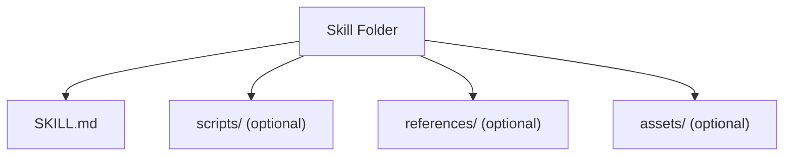
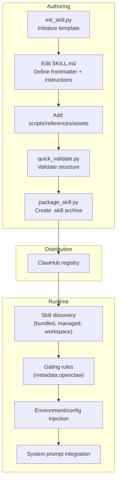
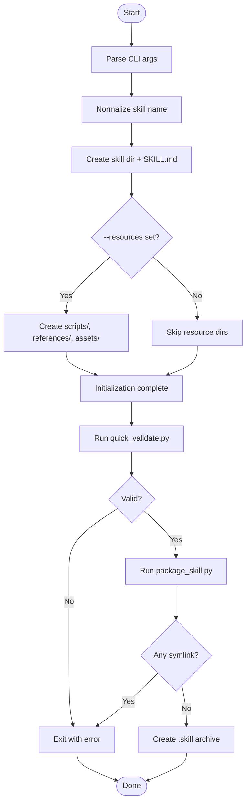
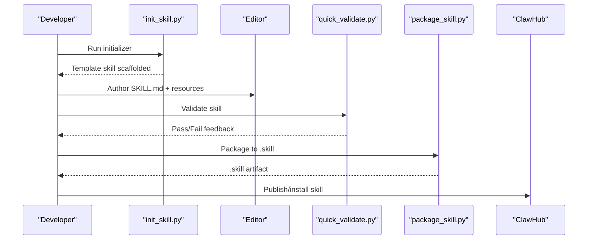
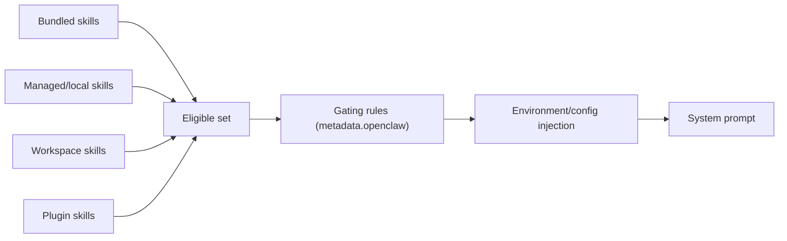

# Skill Development

<cite>
**Referenced Files in This Document**
- [creating-skills.md](file://docs/tools/creating-skills.md)
- [skills.md](file://docs/tools/skills.md)
- [SKILL.md](file://skills/skill-creator/SKILL.md)
- [init_skill.py](file://skills/skill-creator/scripts/init_skill.py)
- [package_skill.py](file://skills/skill-creator/scripts/package_skill.py)
- [quick_validate.py](file://skills/skill-creator/scripts/quick_validate.py)
- [license.txt](file://skills/skill-creator/license.txt)
- [pdf/SKILL.md](file://skills/pdf/SKILL.md)
- [github/SKILL.md](file://skills/github/SKILL.md)
- [openai-image-gen/SKILL.md](file://skills/openai-image-gen/SKILL.md)
- [model-usage/SKILL.md](file://skills/model-usage/SKILL.md)
- [lobster/SKILL.md](file://extensions/lobster/SKILL.md)
</cite>

## Table of Contents
1. [Introduction](#introduction)
2. [Project Structure](#project-structure)
3. [Core Components](#core-components)
4. [Architecture Overview](#architecture-overview)
5. [Detailed Component Analysis](#detailed-component-analysis)
6. [Dependency Analysis](#dependency-analysis)
7. [Performance Considerations](#performance-considerations)
8. [Troubleshooting Guide](#troubleshooting-guide)
9. [Conclusion](#conclusion)
10. [Appendices](#appendices)

## Introduction
This document explains how to develop custom skills for OpenClaw, from concept to deployment. It covers the skill-creator toolkit (initialization, packaging, and validation), the SKILL.md format specification and metadata, the end-to-end development workflow, testing and best practices, practical examples across file processing, API integration, and system automation, plus security, sandboxing, performance, documentation, licensing, and distribution via ClawHub.

## Project Structure
OpenClaw organizes skills as directories with a required SKILL.md and optional bundled resources:
- SKILL.md: YAML frontmatter + Markdown body
- scripts/: executable code (Python/Bash/etc.)
- references/: reference docs loaded on demand
- assets/: output-oriented files (templates, images, etc.)

**Diagram sources**
- [SKILL.md:46-61](file://skills/skill-creator/SKILL.md#L46-L61)

**Section sources**
- [creating-skills.md: 13-48:13-48](file://docs/tools/creating-skills.md#L13-L48)
- [skills.md: 13-40:13-40](file://docs/tools/skills.md#L13-L40)

## Core Components
- Skill-creator toolkit: init_skill.py, package_skill.py, quick_validate.py
- SKILL.md specification and metadata fields
- Example skills demonstrating file processing, API integration, and automation

**Section sources**
- [SKILL.md:1-373](file://skills/skill-creator/SKILL.md#L1-L373)
- [init_skill.py:1-379](file://skills/skill-creator/scripts/init_skill.py#L1-L379)
- [package_skill.py:1-140](file://skills/skill-creator/scripts/package_skill.py#L1-L140)
- [quick_validate.py:1-160](file://skills/skill-creator/scripts/quick_validate.py#L1-L160)

## Architecture Overview
The skill lifecycle spans authoring, validation, packaging, installation, and runtime discovery. At runtime, OpenClaw loads skills from multiple locations, applies gating rules, and injects environment/config into the agent run.

**Diagram sources**
- [skills.md: 13-187:13-187](file://docs/tools/skills.md#L13-L187)
- [creating-skills.md: 17-58:17-58](file://docs/tools/creating-skills.md#L17-L58)
- [init_skill.py:255-317](file://skills/skill-creator/scripts/init_skill.py#L255-L317)
- [package_skill.py:28-112](file://skills/skill-creator/scripts/package_skill.py#L28-L112)
- [quick_validate.py:67-149](file://skills/skill-creator/scripts/quick_validate.py#L67-L149)

## Detailed Component Analysis

### SKILL.md Specification and Metadata
- Required frontmatter: name, description
- Optional frontmatter: homepage, license, allowed-tools, metadata
- metadata.openclaw fields:
  - always, emoji, homepage, os
  - requires.bins, requires.anyBins, requires.env, requires.config
  - primaryEnv
  - install (installer specs)
- Guidance: concise descriptions, single-line frontmatter, use {baseDir} for skill path references

**Section sources**
- [skills.md: 78-187:78-187](file://docs/tools/skills.md#L78-L187)
- [pdf/SKILL.md: 1-5:1-5](file://skills/pdf/SKILL.md#L1-L5)
- [github/SKILL.md: 1-28:1-28](file://skills/github/SKILL.md#L1-L28)
- [openai-image-gen/SKILL.md: 1-24:1-24](file://skills/openai-image-gen/SKILL.md#L1-L24)

### Skill-creator Toolkit
- Initialization: init_skill.py scaffolds a skill directory with a SKILL.md template and optional resource directories
- Validation: quick_validate.py checks frontmatter format, keys, naming rules, and description constraints
- Packaging: package_skill.py validates and zips a skill into a .skill archive, rejecting symlinks and preventing escaping the root

**Diagram sources**
- [init_skill.py:320-379](file://skills/skill-creator/scripts/init_skill.py#L320-L379)
- [quick_validate.py:67-149](file://skills/skill-creator/scripts/quick_validate.py#L67-L149)
- [package_skill.py:28-112](file://skills/skill-creator/scripts/package_skill.py#L28-L112)

**Section sources**
- [SKILL.md:201-373](file://skills/skill-creator/SKILL.md#L201-L373)
- [init_skill.py:1-379](file://skills/skill-creator/scripts/init_skill.py#L1-L379)
- [quick_validate.py:1-160](file://skills/skill-creator/scripts/quick_validate.py#L1-L160)
- [package_skill.py:1-140](file://skills/skill-creator/scripts/package_skill.py#L1-L140)

### Development Workflow: From Concept to Deployment
- Understand the skill with concrete examples
- Plan reusable contents (scripts, references, assets)
- Initialize with init_skill.py
- Edit SKILL.md and add resources
- Validate with quick_validate.py
- Package with package_skill.py
- Iterate based on usage

**Diagram sources**
- [creating-skills.md: 17-58:17-58](file://docs/tools/creating-skills.md#L17-L58)
- [SKILL.md:201-373](file://skills/skill-creator/SKILL.md#L201-L373)
- [package_skill.py:28-112](file://skills/skill-creator/scripts/package_skill.py#L28-L112)

**Section sources**
- [creating-skills.md: 17-58:17-58](file://docs/tools/creating-skills.md#L17-L58)
- [SKILL.md:201-373](file://skills/skill-creator/SKILL.md#L201-L373)

### Practical Examples

#### File Processing: PDF
- Purpose: comprehensive PDF operations (merge, split, extract text/tables, create, rotate, watermark, encrypt, OCR)
- Structure: SKILL.md with Python and CLI examples, references to advanced topics
- Script integration: Python libraries and command-line tools

**Section sources**
- [pdf/SKILL.md: 1-L315:1-315](file://skills/pdf/SKILL.md#L1-L315)

#### API Integration: GitHub
- Purpose: GitHub CLI operations (issues, PRs, CI runs)
- Gating: requires gh binary; installers provided
- Script integration: bash commands and JSON output patterns

**Section sources**
- [github/SKILL.md: 1-L164:1-164](file://skills/github/SKILL.md#L1-L164)

#### System Automation: OpenAI Image Generation
- Purpose: batch image generation via OpenAI Images API
- Gating: requires python3 and OPENAI_API_KEY; installers provided
- Script integration: Python script with flags and output gallery

**Section sources**
- [openai-image-gen/SKILL.md: 1-L93:1-93](file://skills/openai-image-gen/SKILL.md#L1-L93)

#### System Monitoring: Model Usage
- Purpose: summarize per-model usage via CodexBar CLI
- Gating: macOS-only, requires codexbar binary; installers provided
- Script integration: Python script consuming cost JSON

**Section sources**
- [model-usage/SKILL.md: 1-L70:1-70](file://skills/model-usage/SKILL.md#L1-L70)

#### Automation Orchestration: Lobster
- Purpose: multi-step workflows with approval checkpoints
- Behavior: deterministic pipelines, approval gates, resumable execution

**Section sources**
- [lobster/SKILL.md: 1-L98:1-98](file://extensions/lobster/SKILL.md#L1-L98)

### Security, Sandboxing, and Performance

- Security notes
  - Treat third-party skills as untrusted; read before enabling
  - Prefer sandboxed runs for risky tools
  - Workspace and extra-dir discovery rejects escaping paths
  - Secrets injection occurs at host process level during a run; keep secrets out of prompts/logs

- Sandboxing
  - Host binaries checked at load time; sandbox containers must include required binaries
  - Use agents.defaults.sandbox.docker.setupCommand to install inside sandbox
  - Package installs require network egress, writable root FS, and root user in sandbox

- Performance
  - Skills snapshot cached per session; changes take effect on next session
  - Skills watcher supports hot reload on SKILL.md changes
  - Prompt token impact is deterministic; XML list overhead and per-skill length affect cost

**Section sources**
- [skills.md: 69-147:69-147](file://docs/tools/skills.md#L69-L147)
- [skills.md: 242-286:242-286](file://docs/tools/skills.md#L242-L286)

## Dependency Analysis
- Skill discovery precedence: workspace skills > managed/local skills > bundled skills
- Plugins can ship skills via openclaw.plugin.json; they follow normal precedence
- Gating rules under metadata.openclaw.filter the set of eligible skills at load time
- Environment and config overrides applied per agent run

**Diagram sources**
- [skills.md: 13-48:13-48](file://docs/tools/skills.md#L13-L48)
- [skills.md: 106-187:106-187](file://docs/tools/skills.md#L106-L187)

**Section sources**
- [skills.md: 13-48:13-48](file://docs/tools/skills.md#L13-L48)
- [skills.md: 106-187:106-187](file://docs/tools/skills.md#L106-L187)

## Performance Considerations
- Keep SKILL.md body concise; offload detailed references to references/ to reduce context load
- Use scripts/ for deterministic, reusable operations to avoid re-derivation each time
- Leverage the skills watcher to speed up iteration during development
- Monitor token overhead from skills list; minimize unnecessary metadata

[No sources needed since this section provides general guidance]

## Troubleshooting Guide
- Validation failures
  - Missing or malformed frontmatter
  - Unexpected keys in frontmatter
  - Invalid name (hyphen-case, length limits)
  - Description too long or contains angle brackets
- Packaging failures
  - Symlink detected (rejected)
  - Archive would escape skill root
  - Output file conflicts with the archive

Recommended fixes:
- Align frontmatter with allowed properties and naming rules
- Remove angle brackets and excessive length in description
- Ensure no symlinks and that all files reside under the skill root
- Avoid writing the archive into the skill directory itself

**Section sources**
- [quick_validate.py:67-149](file://skills/skill-creator/scripts/quick_validate.py#L67-L149)
- [package_skill.py:28-112](file://skills/skill-creator/scripts/package_skill.py#L28-L112)

## Conclusion
OpenClaw’s skill system is designed for modularity, safety, and performance. The skill-creator toolkit streamlines authoring, validation, and packaging. By following the SKILL.md specification, gating rules, and security/sandboxing guidance, developers can build robust, distributable skills. Use ClawHub to share and maintain skills across environments.

[No sources needed since this section summarizes without analyzing specific files]

## Appendices

### Appendix A: SKILL.md Frontmatter and Metadata Reference
- Required: name, description
- Optional: homepage, license, allowed-tools, metadata
- metadata.openclaw:
  - always, emoji, homepage, os
  - requires.bins, requires.anyBins, requires.env, requires.config
  - primaryEnv
  - install (installer specs)

**Section sources**
- [skills.md: 78-187:78-187](file://docs/tools/skills.md#L78-L187)

### Appendix B: Licensing and Distribution
- License text for the skill-creator toolkit is provided
- Distribute skills as .skill archives produced by package_skill.py
- Publish and discover skills via ClawHub

**Section sources**
- [license.txt:1-203](file://skills/skill-creator/license.txt#L1-L203)
- [creating-skills.md: 56-59:56-59](file://docs/tools/creating-skills.md#L56-L59)