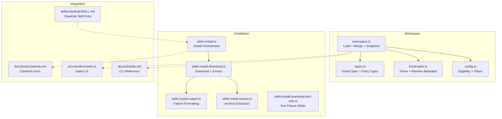
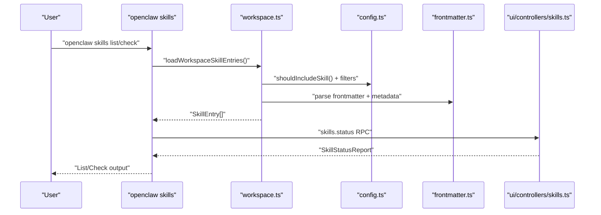
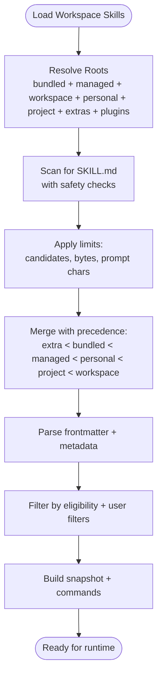
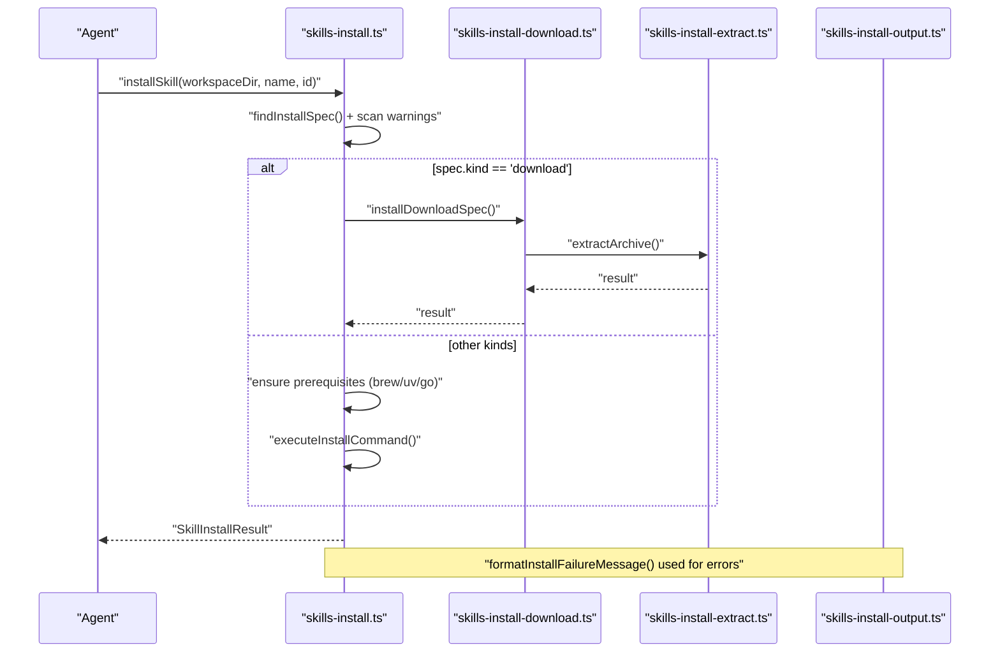
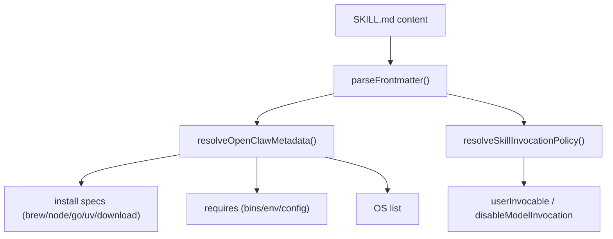
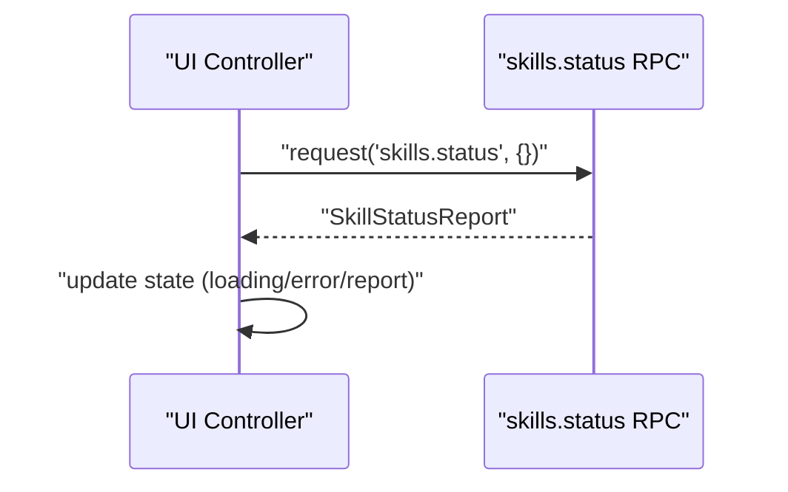
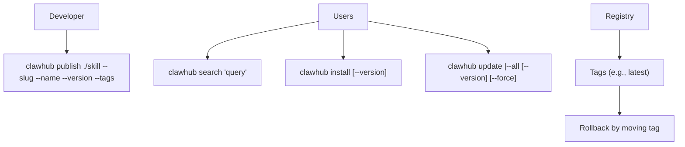
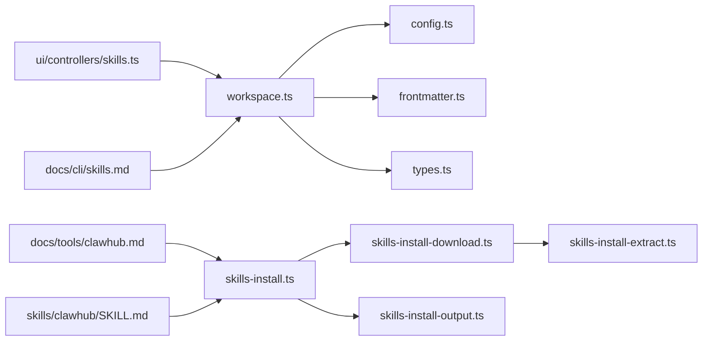

# Skill Registry & Management

<cite>
**Referenced Files in This Document**
- [skills/workspace.ts](file://src/agents/skills/workspace.ts)
- [skills/types.ts](file://src/agents/skills/types.ts)
- [skills/frontmatter.ts](file://src/agents/skills/frontmatter.ts)
- [skills/config.ts](file://src/agents/skills/config.ts)
- [skills/serialize.ts](file://src/agents/skills/serialize.ts)
- [skills-install.ts](file://src/agents/skills-install.ts)
- [skills-install-download.ts](file://src/agents/skills-install-download.ts)
- [skills-install-extract.ts](file://src/agents/skills-install-extract.ts)
- [skills-install-output.ts](file://src/agents/skills-install-output.ts)
- [skills-install.download-test-utils.ts](file://src/agents/skills-install.download-test-utils.ts)
- [clawhub/SKILL.md](file://skills/clawhub/SKILL.md)
- [docs/cli/skills.md](file://docs/cli/skills.md)
- [docs/tools/clawhub.md](file://docs/tools/clawhub.md)
- [ui/controllers/skills.ts](file://ui/src/ui/controllers/skills.ts)
</cite>

## Table of Contents
1. [Introduction](#introduction)
2. [Project Structure](#project-structure)
3. [Core Components](#core-components)
4. [Architecture Overview](#architecture-overview)
5. [Detailed Component Analysis](#detailed-component-analysis)
6. [Dependency Analysis](#dependency-analysis)
7. [Performance Considerations](#performance-considerations)
8. [Troubleshooting Guide](#troubleshooting-guide)
9. [Conclusion](#conclusion)
10. [Appendices](#appendices)

## Introduction
This document explains the skill registry and management system in OpenClaw with a focus on:
- ClawHub integration for discovering, installing, updating, and publishing skills
- Workspace skills lifecycle: loading, activation, deactivation, and synchronization
- Status tracking, dependency resolution, and conflict management
- Practical procedures for installation, updates, and removal
- Versioning, compatibility checking, and rollback strategies
- Relationship among bundled, managed, and workspace skills
- Troubleshooting, performance monitoring, and optimization techniques

## Project Structure
The skill system spans several modules:
- Workspace discovery and composition: loading skills from multiple roots and merging precedence
- Installation pipeline: downloading, extracting, and invoking platform-specific installers
- Frontmatter parsing and metadata resolution: install specs, invocation policy, and requirements
- CLI and UI integration: listing, auditing, and status reporting
- ClawHub skill packaging and distribution

**Diagram sources**
- [skills/workspace.ts:292-527](file://src/agents/skills/workspace.ts#L292-L527)
- [skills/config.ts:71-103](file://src/agents/skills/config.ts#L71-L103)
- [skills/frontmatter.ts:186-223](file://src/agents/skills/frontmatter.ts#L186-L223)
- [skills/types.ts:3-33](file://src/agents/skills/types.ts#L3-L33)
- [skills-install.ts:392-471](file://src/agents/skills-install.ts#L392-L471)
- [skills-install-download.ts:104-142](file://src/agents/skills-install-download.ts#L104-L142)
- [skills-install-extract.ts:140-234](file://src/agents/skills-install-extract.ts#L140-L234)
- [skills-install-output.ts:33-41](file://src/agents/skills-install-output.ts#L33-L41)
- [skills-install.download-test-utils.ts:26-66](file://src/agents/skills-install.download-test-utils.ts#L26-L66)
- [docs/cli/skills.md:1-27](file://docs/cli/skills.md#L1-L27)
- [docs/tools/clawhub.md:46-206](file://docs/tools/clawhub.md#L46-L206)
- [ui/controllers/skills.ts:39-72](file://ui/src/ui/controllers/skills.ts#L39-L72)
- [skills/clawhub/SKILL.md:1-78](file://skills/clawhub/SKILL.md#L1-L78)

**Section sources**
- [skills/workspace.ts:292-527](file://src/agents/skills/workspace.ts#L292-L527)
- [skills/types.ts:3-33](file://src/agents/skills/types.ts#L3-L33)
- [skills/frontmatter.ts:186-223](file://src/agents/skills/frontmatter.ts#L186-L223)
- [skills/config.ts:71-103](file://src/agents/skills/config.ts#L71-L103)
- [skills-install.ts:392-471](file://src/agents/skills-install.ts#L392-L471)
- [skills-install-download.ts:104-142](file://src/agents/skills-install-download.ts#L104-L142)
- [skills-install-extract.ts:140-234](file://src/agents/skills-install-extract.ts#L140-L234)
- [skills-install-output.ts:33-41](file://src/agents/skills-install-output.ts#L33-L41)
- [skills-install.download-test-utils.ts:26-66](file://src/agents/skills-install.download-test-utils.ts#L26-L66)
- [docs/cli/skills.md:1-27](file://docs/cli/skills.md#L1-L27)
- [docs/tools/clawhub.md:46-206](file://docs/tools/clawhub.md#L46-L206)
- [ui/controllers/skills.ts:39-72](file://ui/src/ui/controllers/skills.ts#L39-L72)
- [skills/clawhub/SKILL.md:1-78](file://skills/clawhub/SKILL.md#L1-L78)

## Core Components
- Workspace skill loader and merger: discovers skills from multiple roots (bundled, managed, workspace, personal/project agents), enforces safety and limits, and merges with precedence rules.
- Eligibility and filtering: evaluates OS/platform support, required binaries/env/config, and user-defined filters.
- Frontmatter and metadata: parses SKILL.md frontmatter, normalizes install specs, and resolves invocation policy.
- Installation orchestrator: selects install spec, ensures prerequisites (e.g., brew/uv/go), runs platform-specific commands, and performs safety scans.
- Download and extraction: handles tar.gz, tar.bz2, and zip archives with preflight checks, staged extraction, and path safety.
- Status and UI: exposes skills status via RPC for UI consumption and provides CLI inspection commands.

**Section sources**
- [skills/workspace.ts:292-527](file://src/agents/skills/workspace.ts#L292-L527)
- [skills/config.ts:71-103](file://src/agents/skills/config.ts#L71-L103)
- [skills/frontmatter.ts:186-223](file://src/agents/skills/frontmatter.ts#L186-L223)
- [skills/types.ts:3-33](file://src/agents/skills/types.ts#L3-L33)
- [skills-install.ts:392-471](file://src/agents/skills-install.ts#L392-L471)
- [skills-install-download.ts:104-142](file://src/agents/skills-install-download.ts#L104-L142)
- [skills-install-extract.ts:140-234](file://src/agents/skills-install-extract.ts#L140-L234)
- [ui/controllers/skills.ts:39-72](file://ui/src/ui/controllers/skills.ts#L39-L72)

## Architecture Overview
The system composes skills from multiple sources, validates eligibility, and exposes them to the agent runtime and UI.

**Diagram sources**
- [skills/workspace.ts:660-669](file://src/agents/skills/workspace.ts#L660-L669)
- [skills/config.ts:71-103](file://src/agents/skills/config.ts#L71-L103)
- [skills/frontmatter.ts:186-223](file://src/agents/skills/frontmatter.ts#L186-L223)
- [ui/controllers/skills.ts:39-72](file://ui/src/ui/controllers/skills.ts#L39-L72)
- [docs/cli/skills.md:19-27](file://docs/cli/skills.md#L19-L27)

## Detailed Component Analysis

### Workspace Skills Loading, Activation, and Deactivation
- Discovery roots: bundled, managed, workspace, personal agents, project agents, plus extraDirs and plugin skill dirs.
- Safety and limits: nested root detection, realpath containment, oversized SKILL.md gating, candidate truncation, and prompt character limits.
- Merging precedence: extra < bundled < managed < personal agents < project agents < workspace.
- Activation: eligibility evaluation considers OS, required binaries/env/config, and user filters.
- Deactivation: explicit disable via config or eligibility context.

**Diagram sources**
- [skills/workspace.ts:292-527](file://src/agents/skills/workspace.ts#L292-L527)
- [skills/config.ts:71-103](file://src/agents/skills/config.ts#L71-L103)
- [skills/frontmatter.ts:186-223](file://src/agents/skills/frontmatter.ts#L186-L223)

**Section sources**
- [skills/workspace.ts:292-527](file://src/agents/skills/workspace.ts#L292-L527)
- [skills/config.ts:71-103](file://src/agents/skills/config.ts#L71-L103)

### Installation Pipeline: Download, Extraction, and Execution
- Orchestrator: selects install spec by ID, collects safety scan warnings, and routes to download or platform installer.
- Download flow: resolves target directory, fetches archive, verifies URL, and extracts with safety checks.
- Extraction: supports zip, tar.gz, tar.bz2; tar.bz2 uses staged extraction and preflight checks to prevent path traversal.
- Installer flow: brew, node/npm/pnpm/yarn/bun, go, uv; ensures prerequisites and sets environment (e.g., GOBIN).
- Failure formatting: summarizes stderr/stdout for concise error messages.

**Diagram sources**
- [skills-install.ts:392-471](file://src/agents/skills-install.ts#L392-L471)
- [skills-install-download.ts:104-142](file://src/agents/skills-install-download.ts#L104-L142)
- [skills-install-extract.ts:140-234](file://src/agents/skills-install-extract.ts#L140-L234)
- [skills-install-output.ts:33-41](file://src/agents/skills-install-output.ts#L33-L41)

**Section sources**
- [skills-install.ts:392-471](file://src/agents/skills-install.ts#L392-L471)
- [skills-install-download.ts:104-142](file://src/agents/skills-install-download.ts#L104-L142)
- [skills-install-extract.ts:140-234](file://src/agents/skills-install-extract.ts#L140-L234)
- [skills-install-output.ts:33-41](file://src/agents/skills-install-output.ts#L33-L41)

### Frontmatter Parsing and Metadata Resolution
- Parses SKILL.md frontmatter and normalizes install specs for brew/node/go/uv/download.
- Validates and sanitizes inputs (e.g., URLs, module specs, package specs).
- Resolves metadata blocks: requires (bins/env/config), install specs, OS, and invocation policy.

**Diagram sources**
- [skills/frontmatter.ts:23-223](file://src/agents/skills/frontmatter.ts#L23-L223)
- [skills/types.ts:3-33](file://src/agents/skills/types.ts#L3-L33)

**Section sources**
- [skills/frontmatter.ts:186-223](file://src/agents/skills/frontmatter.ts#L186-L223)
- [skills/types.ts:3-33](file://src/agents/skills/types.ts#L3-L33)

### Status Tracking and UI Integration
- UI controller requests skills status via RPC and updates state.
- CLI reference documents skills inspection commands.

**Diagram sources**
- [ui/controllers/skills.ts:39-72](file://ui/src/ui/controllers/skills.ts#L39-L72)

**Section sources**
- [ui/controllers/skills.ts:39-72](file://ui/src/ui/controllers/skills.ts#L39-L72)
- [docs/cli/skills.md:19-27](file://docs/cli/skills.md#L19-L27)

### ClawHub Integration and Versioning
- Skills can be installed via the ClawHub CLI and published to the registry.
- Versioning uses semantic versions; tags (e.g., latest) point to versions and enable rollback.
- Update uses content hashing to compare local vs published; optional force override applies when mismatches occur.
- Sync scans local skills and publishes new/updated ones; supports bump types and concurrency tuning.

**Diagram sources**
- [docs/tools/clawhub.md:46-206](file://docs/tools/clawhub.md#L46-L206)
- [skills/clawhub/SKILL.md:1-78](file://skills/clawhub/SKILL.md#L1-L78)

**Section sources**
- [docs/tools/clawhub.md:46-206](file://docs/tools/clawhub.md#L46-L206)
- [skills/clawhub/SKILL.md:1-78](file://skills/clawhub/SKILL.md#L1-L78)

## Dependency Analysis
- Coupling: workspace loader depends on eligibility and frontmatter resolution; installation depends on metadata and environment checks.
- Cohesion: each module encapsulates a responsibility (loading, eligibility, parsing, installation).
- External dependencies: platform binaries (brew, tar, npm/pnpm/yarn/bun, go, uv), registry APIs, and sandboxed extraction utilities.

**Diagram sources**
- [skills/workspace.ts:292-527](file://src/agents/skills/workspace.ts#L292-L527)
- [skills/config.ts:71-103](file://src/agents/skills/config.ts#L71-L103)
- [skills/frontmatter.ts:186-223](file://src/agents/skills/frontmatter.ts#L186-L223)
- [skills/types.ts:3-33](file://src/agents/skills/types.ts#L3-L33)
- [skills-install.ts:392-471](file://src/agents/skills-install.ts#L392-L471)
- [skills-install-download.ts:104-142](file://src/agents/skills-install-download.ts#L104-L142)
- [skills-install-extract.ts:140-234](file://src/agents/skills-install-extract.ts#L140-L234)
- [skills-install-output.ts:33-41](file://src/agents/skills-install-output.ts#L33-L41)
- [ui/controllers/skills.ts:39-72](file://ui/src/ui/controllers/skills.ts#L39-L72)
- [docs/cli/skills.md:19-27](file://docs/cli/skills.md#L19-L27)
- [docs/tools/clawhub.md:46-206](file://docs/tools/clawhub.md#L46-L206)
- [skills/clawhub/SKILL.md:1-78](file://skills/clawhub/SKILL.md#L1-L78)

**Section sources**
- [skills/workspace.ts:292-527](file://src/agents/skills/workspace.ts#L292-L527)
- [skills-install.ts:392-471](file://src/agents/skills-install.ts#L392-L471)

## Performance Considerations
- Candidate pruning: limits number of scanned directories and loaded skills per source to control IO and CPU.
- Prompt size control: binary search to fit within character budgets for model prompts.
- Path safety: realpath checks and sandboxed extraction reduce risk and overhead.
- Serialization: serialized operations for workspace sync to avoid concurrent filesystem races.

Practical tips:
- Keep workspace skills organized and avoid overly large directories.
- Use filters to limit skills for specific runs.
- Monitor prompt truncation notices and run audits to trim excessive skills.

**Section sources**
- [skills/workspace.ts:529-565](file://src/agents/skills/workspace.ts#L529-L565)
- [skills/workspace.ts:723-766](file://src/agents/skills/workspace.ts#L723-L766)
- [skills/serialize.ts:1-14](file://src/agents/skills/serialize.ts#L1-L14)

## Troubleshooting Guide
Common scenarios and remedies:
- Missing binaries or environment variables: use eligibility checks and “openclaw skills check” to diagnose; install prerequisites (brew, uv, go) or set env/config.
- Oversized SKILL.md: reduce file size or split skills.
- Unsafe archives: tar.bz2 extraction uses preflight checks; failures indicate malformed or unsafe entries.
- Installation failures: review summarized stderr/stdout; re-run with increased verbosity or adjust timeouts.
- Conflicts and precedence: workspace skills override managed/bundled; verify merge order and filters.
- Status reporting: use UI RPC or CLI to inspect current state and recent messages.

Operational commands:
- List and inspect: openclaw skills list, openclaw skills info <name>, openclaw skills check.

**Section sources**
- [skills-install-output.ts:33-41](file://src/agents/skills-install-output.ts#L33-L41)
- [skills-install.ts:392-471](file://src/agents/skills-install.ts#L392-L471)
- [skills/workspace.ts:332-418](file://src/agents/skills/workspace.ts#L332-L418)
- [docs/cli/skills.md:19-27](file://docs/cli/skills.md#L19-L27)

## Conclusion
OpenClaw’s skill registry integrates workspace discovery, eligibility evaluation, and robust installation pipelines. ClawHub enables versioned distribution with tagging and rollback. The system balances safety, performance, and usability through path containment, prompt limits, staged extraction, and clear status reporting.

## Appendices

### Practical Procedures

- Install a skill via ClawHub:
  - Search: clawhub search "<query>"
  - Install: clawhub install <slug> [--version <ver>]
  - Reload OpenClaw to pick up changes.

- Update skills:
  - Update single: clawhub update <slug> [--version <ver>] [--force]
  - Update all: clawhub update --all [--force]

- Publish a skill:
  - Publish: clawhub publish <path> --slug <slug> --name <name> --version <ver> --tags <tags>

- Remove or restore:
  - Delete/undelete (owner/admin): clawhub delete <slug> --yes, clawhub undelete <slug> --yes

- Audit and verify:
  - openclaw skills check
  - openclaw skills list [--eligible]
  - openclaw skills info <name>

- Workspace sync:
  - Copy workspace skills to another workspace using the workspace loader and serializer to avoid concurrent writes.

**Section sources**
- [docs/tools/clawhub.md:46-206](file://docs/tools/clawhub.md#L46-L206)
- [docs/cli/skills.md:19-27](file://docs/cli/skills.md#L19-L27)
- [skills/workspace.ts:723-766](file://src/agents/skills/workspace.ts#L723-L766)
- [skills/serialize.ts:1-14](file://src/agents/skills/serialize.ts#L1-L14)