# Skills System

<cite>
**Referenced Files in This Document**
- [docs/tools/skills.md](file://docs/tools/skills.md)
- [docs/tools/creating-skills.md](file://docs/tools/creating-skills.md)
- [docs/tools/clawhub.md](file://docs/tools/clawhub.md)
- [docs/tools/skills-config.md](file://docs/tools/skills-config.md)
- [src/agents/skills.ts](file://src/agents/skills.ts)
- [src/gateway/server-methods/skills.ts](file://src/gateway/server-methods/skills.ts)
- [src/agents/skills/workspace.ts](file://src/agents/skills/workspace.ts)
- [src/agents/skills/config.js](file://src/agents/skills/config.js)
- [src/agents/skills/env-overrides.js](file://src/agents/skills/env-overrides.js)
- [src/agents/skills/types.js](file://src/agents/skills/types.js)
- [src/agents/skills/bundled-dir.ts](file://src/agents/skills/bundled-dir.ts)
- [src/agents/skills/refresh.ts](file://src/agents/skills/refresh.ts)
- [src/agents/skills-install.js](file://src/agents/skills-install.js)
- [src/agents/skills-status.js](file://src/agents/skills-status.js)
- [src/infra/skills-remote.js](file://src/infra/skills-remote.js)
- [src/utils/normalize-secret-input.js](file://src/utils/normalize-secret-input.js)
- [skills/nano-banana-pro/SKILL.md](file://skills/nano-banana-pro/SKILL.md)
- [skills/peekaboo/SKILL.md](file://skills/peekaboo/SKILL.md)
- [extensions/lobster/SKILL.md](file://extensions/lobster/SKILL.md)
</cite>

## Table of Contents
1. [Introduction](#introduction)
2. [Project Structure](#project-structure)
3. [Core Components](#core-components)
4. [Architecture Overview](#architecture-overview)
5. [Detailed Component Analysis](#detailed-component-analysis)
6. [Dependency Analysis](#dependency-analysis)
7. [Performance Considerations](#performance-considerations)
8. [Troubleshooting Guide](#troubleshooting-guide)
9. [Conclusion](#conclusion)
10. [Appendices](#appendices)

## Introduction
OpenClaw’s skills system enables an extensible AI skill platform compatible with AgentSkills. Skills are directories containing a SKILL.md with YAML frontmatter and instructions. OpenClaw loads three categories of skills:
- Bundled skills (shipped with the install)
- Managed/local skills (~/.openclaw/skills)
- Workspace skills (<workspace>/skills)

Precedence is workspace > managed/local > bundled. Skills can be gated by environment, binaries, configuration, and OS. The system integrates with the agent loop, supports sandboxing, and provides a public registry (ClawHub) for discovery, installation, updates, and backups.

## Project Structure
The skills system spans documentation, CLI/Gateway server handlers, agent-side loaders, and a large set of bundled skills and plugin-provided skills.

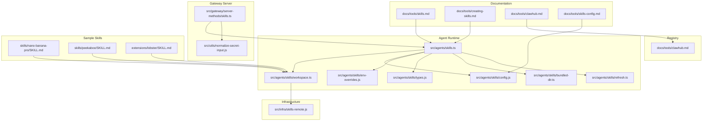

**Diagram sources**
- [docs/tools/skills.md](file://docs/tools/skills.md)
- [docs/tools/creating-skills.md](file://docs/tools/creating-skills.md)
- [docs/tools/clawhub.md](file://docs/tools/clawhub.md)
- [docs/tools/skills-config.md](file://docs/tools/skills-config.md)
- [src/agents/skills.ts](file://src/agents/skills.ts)
- [src/gateway/server-methods/skills.ts](file://src/gateway/server-methods/skills.ts)
- [src/agents/skills/workspace.ts](file://src/agents/skills/workspace.ts)
- [src/agents/skills/config.js](file://src/agents/skills/config.js)
- [src/agents/skills/env-overrides.js](file://src/agents/skills/env-overrides.js)
- [src/agents/skills/types.js](file://src/agents/skills/types.js)
- [src/agents/skills/bundled-dir.ts](file://src/agents/skills/bundled-dir.ts)
- [src/agents/skills/refresh.ts](file://src/agents/skills/refresh.ts)
- [src/infra/skills-remote.js](file://src/infra/skills-remote.js)
- [src/utils/normalize-secret-input.js](file://src/utils/normalize-secret-input.js)
- [skills/nano-banana-pro/SKILL.md](file://skills/nano-banana-pro/SKILL.md)
- [skills/peekaboo/SKILL.md](file://skills/peekaboo/SKILL.md)
- [extensions/lobster/SKILL.md](file://extensions/lobster/SKILL.md)

**Section sources**
- [docs/tools/skills.md](file://docs/tools/skills.md)
- [docs/tools/creating-skills.md](file://docs/tools/creating-skills.md)
- [docs/tools/clawhub.md](file://docs/tools/clawhub.md)
- [docs/tools/skills-config.md](file://docs/tools/skills-config.md)
- [src/agents/skills.ts](file://src/agents/skills.ts)
- [src/gateway/server-methods/skills.ts](file://src/gateway/server-methods/skills.ts)
- [src/agents/skills/workspace.ts](file://src/agents/skills/workspace.ts)
- [src/agents/skills/config.js](file://src/agents/skills/config.js)
- [src/agents/skills/env-overrides.js](file://src/agents/skills/env-overrides.js)
- [src/agents/skills/types.js](file://src/agents/skills/types.js)
- [src/agents/skills/bundled-dir.ts](file://src/agents/skills/bundled-dir.ts)
- [src/agents/skills/refresh.ts](file://src/agents/skills/refresh.ts)
- [src/infra/skills-remote.js](file://src/infra/skills-remote.js)
- [src/utils/normalize-secret-input.js](file://src/utils/normalize-secret-input.js)
- [skills/nano-banana-pro/SKILL.md](file://skills/nano-banana-pro/SKILL.md)
- [skills/peekaboo/SKILL.md](file://skills/peekaboo/SKILL.md)
- [extensions/lobster/SKILL.md](file://extensions/lobster/SKILL.md)

## Core Components
- Skills discovery and precedence:
  - Bundled skills, managed skills (~/.openclaw/skills), workspace skills (<workspace>/skills), and extraDirs via configuration.
  - Precedence: workspace > managed/local > bundled.
- SKILL.md format:
  - YAML frontmatter with name, description, homepage, and metadata.openclaw (single-line JSON).
  - Optional keys: user-invocable, disable-model-invocation, command-dispatch, command-tool, command-arg-mode.
- Gating and eligibility:
  - metadata.openclaw supports always, emoji, homepage, os, requires.bins/anyBins, requires.env, requires.config, primaryEnv, install.
  - Load-time filtering applies environment, binaries, config paths, and OS.
- Environment injection:
  - Per-agent runs inject env and apiKey from config into process.env scoped to the run.
- Session snapshot and hot reload:
  - Eligible skills snapshot taken at session start; watcher refreshes on SKILL.md changes.
- Remote macOS nodes:
  - Eligibility can extend to macOS-only skills when binaries are present on a remote node with system.run allowed.
- Registry and lifecycle:
  - ClawHub provides discovery, install/update/sync; managed skills can be toggled and overridden via configuration.

**Section sources**
- [docs/tools/skills.md](file://docs/tools/skills.md)
- [docs/tools/skills-config.md](file://docs/tools/skills-config.md)
- [src/agents/skills/workspace.ts](file://src/agents/skills/workspace.ts)
- [src/agents/skills/config.js](file://src/agents/skills/config.js)
- [src/agents/skills/env-overrides.js](file://src/agents/skills/env-overrides.js)
- [src/agents/skills/refresh.ts](file://src/agents/skills/refresh.ts)
- [src/infra/skills-remote.js](file://src/infra/skills-remote.js)

## Architecture Overview
The skills system integrates the following flows:
- Discovery: scan bundled, managed, workspace, and extraDirs; filter by gating rules; produce a snapshot.
- Prompt building: inject compact XML of eligible skills into the system prompt.
- Execution: during agent runs, environment is injected and tools are dispatched according to SKILL.md and gating metadata.
- Registry: ClawHub provides install/update/sync; Gateway exposes RPCs for status, bins, install, and update.

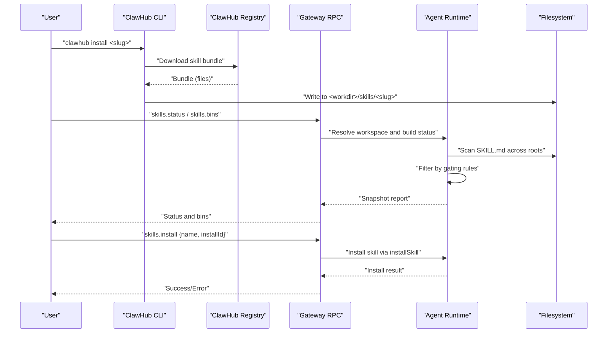

**Diagram sources**
- [docs/tools/clawhub.md](file://docs/tools/clawhub.md)
- [src/gateway/server-methods/skills.ts](file://src/gateway/server-methods/skills.ts)
- [src/agents/skills/workspace.ts](file://src/agents/skills/workspace.ts)
- [src/agents/skills-install.js](file://src/agents/skills-install.js)

## Detailed Component Analysis

### Skills Discovery and Precedence
- Sources and precedence:
  - Bundled skills (lowest)
  - Managed skills (~/.openclaw/skills)
  - Workspace skills (<workspace>/skills)
  - extraDirs (lowest precedence)
- Multi-agent considerations:
  - Per-agent workspace; shared managed skills visible to all agents on the same machine.
- Plugin skills:
  - Plugins can include skills via openclaw.plugin.json; they participate in precedence and gating.

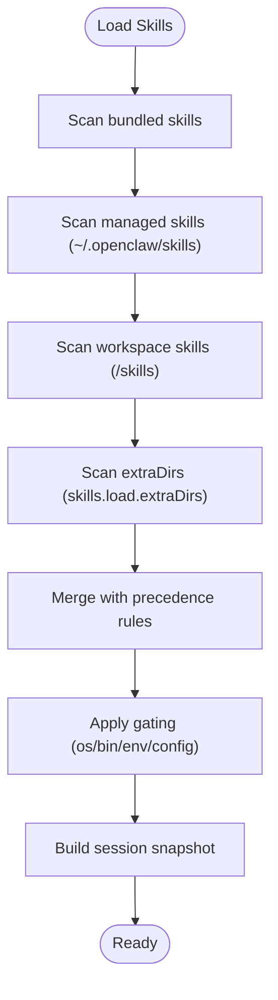

**Diagram sources**
- [docs/tools/skills.md](file://docs/tools/skills.md)
- [src/agents/skills/workspace.ts](file://src/agents/skills/workspace.ts)
- [src/agents/skills/bundled-dir.ts](file://src/agents/skills/bundled-dir.ts)

**Section sources**
- [docs/tools/skills.md](file://docs/tools/skills.md)
- [src/agents/skills/workspace.ts](file://src/agents/skills/workspace.ts)
- [src/agents/skills/bundled-dir.ts](file://src/agents/skills/bundled-dir.ts)

### SKILL.md Format and Metadata
- Required frontmatter: name, description.
- metadata.openclaw (single-line JSON):
  - always, emoji, homepage, os, requires.{bins,anyBins,env,config}, primaryEnv, install.
- Optional keys:
  - user-invocable, disable-model-invocation, command-dispatch, command-tool, command-arg-mode.
- Examples:
  - nano-banana-pro demonstrates requires, primaryEnv, install spec.
  - peekaboo demonstrates os gating and install spec.

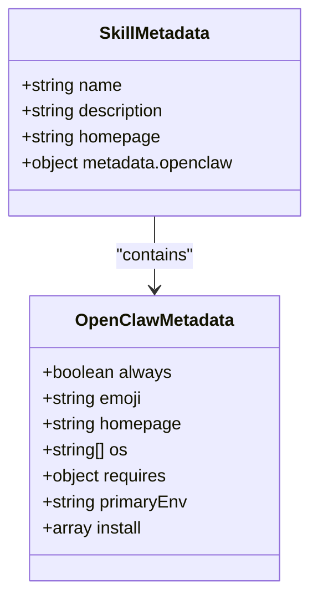

**Diagram sources**
- [skills/nano-banana-pro/SKILL.md](file://skills/nano-banana-pro/SKILL.md)
- [skills/peekaboo/SKILL.md](file://skills/peekaboo/SKILL.md)
- [docs/tools/skills.md](file://docs/tools/skills.md)

**Section sources**
- [docs/tools/skills.md](file://docs/tools/skills.md)
- [skills/nano-banana-pro/SKILL.md](file://skills/nano-banana-pro/SKILL.md)
- [skills/peekaboo/SKILL.md](file://skills/peekaboo/SKILL.md)

### Gating and Eligibility
- Load-time filters:
  - os, requires.bins/anyBins, requires.env, requires.config, always.
- Sandbox considerations:
  - requires.bins checked on host; if sandboxed, binaries must also exist inside the container.
- Installer specs:
  - brew, node/npm/pnpm/yarn/bun, go, download; platform filtering; node manager preference.

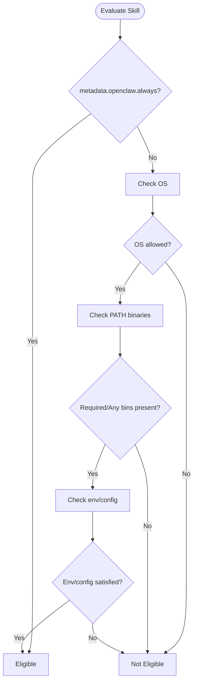

**Diagram sources**
- [docs/tools/skills.md](file://docs/tools/skills.md)
- [src/agents/skills/config.js](file://src/agents/skills/config.js)

**Section sources**
- [docs/tools/skills.md](file://docs/tools/skills.md)
- [src/agents/skills/config.js](file://src/agents/skills/config.js)

### Environment Injection and Secrets
- Per-run environment injection:
  - Apply skills.entries.<key>.env and apiKey to process.env scoped to the agent run.
- Secrets handling:
  - apiKey supports plaintext or SecretRef; normalized before writing config.
- Sandboxed environments:
  - Global env and skills.entries.<skill>.env/apiKey apply to host runs; sandboxed runs require docker.env or baked images.

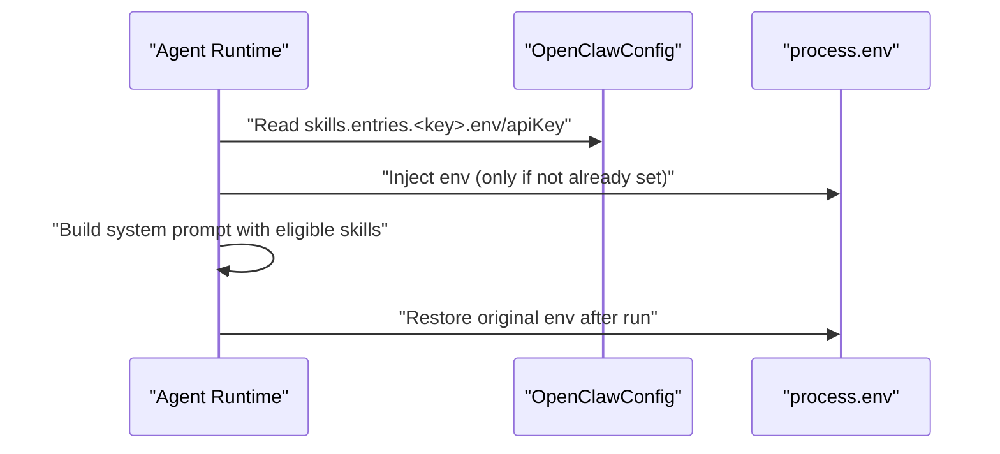

**Diagram sources**
- [docs/tools/skills.md](file://docs/tools/skills.md)
- [src/agents/skills/env-overrides.js](file://src/agents/skills/env-overrides.js)
- [src/utils/normalize-secret-input.js](file://src/utils/normalize-secret-input.js)

**Section sources**
- [docs/tools/skills.md](file://docs/tools/skills.md)
- [src/agents/skills/env-overrides.js](file://src/agents/skills/env-overrides.js)
- [src/utils/normalize-secret-input.js](file://src/utils/normalize-secret-input.js)

### Session Snapshot and Hot Reload
- Snapshot behavior:
  - Captured when a session starts and reused across turns.
- Auto-refresh:
  - Watcher monitors SKILL.md changes; debounced refresh on changes.
- Remote nodes:
  - Eligibility can extend to macOS-only skills when remote node supports required binaries.

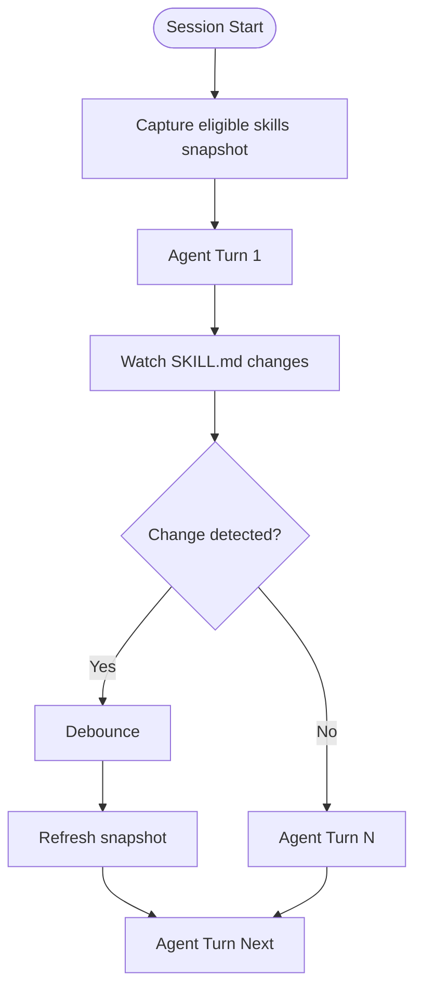

**Diagram sources**
- [docs/tools/skills.md](file://docs/tools/skills.md)
- [src/agents/skills/refresh.ts](file://src/agents/skills/refresh.ts)
- [src/infra/skills-remote.js](file://src/infra/skills-remote.js)

**Section sources**
- [docs/tools/skills.md](file://docs/tools/skills.md)
- [src/agents/skills/refresh.ts](file://src/agents/skills/refresh.ts)
- [src/infra/skills-remote.js](file://src/infra/skills-remote.js)

### Skills Registry (ClawHub) and Lifecycle
- Discovery and install:
  - Browse and install skills; default installs into <workdir>/skills or configured workspace.
- Update and sync:
  - Update all; sync scans local skills and publishes new/updated versions.
- Lifecycle:
  - Managed skills can be toggled and overridden; workspace skills take precedence.

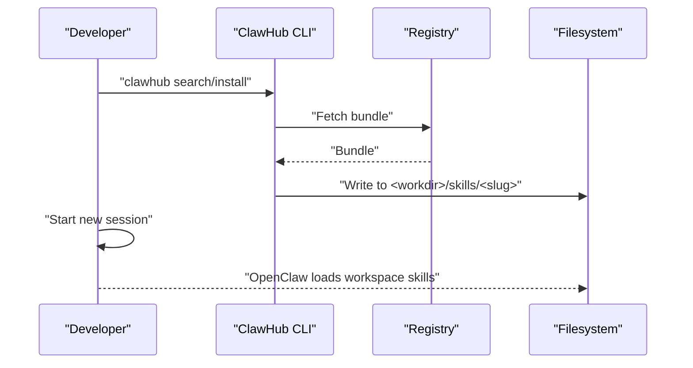

**Diagram sources**
- [docs/tools/clawhub.md](file://docs/tools/clawhub.md)
- [docs/tools/skills.md](file://docs/tools/skills.md)

**Section sources**
- [docs/tools/clawhub.md](file://docs/tools/clawhub.md)
- [docs/tools/skills.md](file://docs/tools/skills.md)

### Agent-Side Skill Loading and Types
- Exposed APIs:
  - resolveSkillsInstallPreferences, buildWorkspaceSkillSnapshot, buildWorkspaceSkillsPrompt, buildWorkspaceSkillCommandSpecs, filterWorkspaceSkillEntries, loadWorkspaceSkillEntries, resolveSkillsPromptForRun, syncSkillsToWorkspace.
- Types:
  - OpenClawSkillMetadata, SkillEligibilityContext, SkillCommandSpec, SkillEntry, SkillInstallSpec, SkillSnapshot, SkillsInstallPreferences.

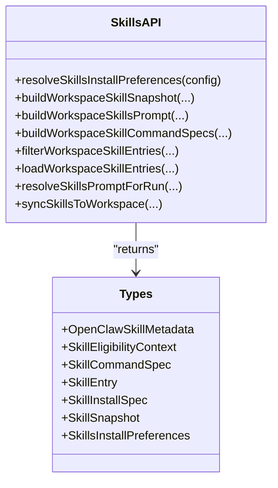

**Diagram sources**
- [src/agents/skills.ts](file://src/agents/skills.ts)
- [src/agents/skills/types.js](file://src/agents/skills/types.js)

**Section sources**
- [src/agents/skills.ts](file://src/agents/skills.ts)
- [src/agents/skills/types.js](file://src/agents/skills/types.js)

### Gateway RPCs for Skills
- skills.status:
  - Validates params, resolves agent workspace, builds status with eligibility (including remote).
- skills.bins:
  - Aggregates required binaries across all workspace dirs.
- skills.install:
  - Installs a skill by name and installId; writes result or error.
- skills.update:
  - Updates skills.entries.<key> fields (enabled, apiKey, env); writes config.

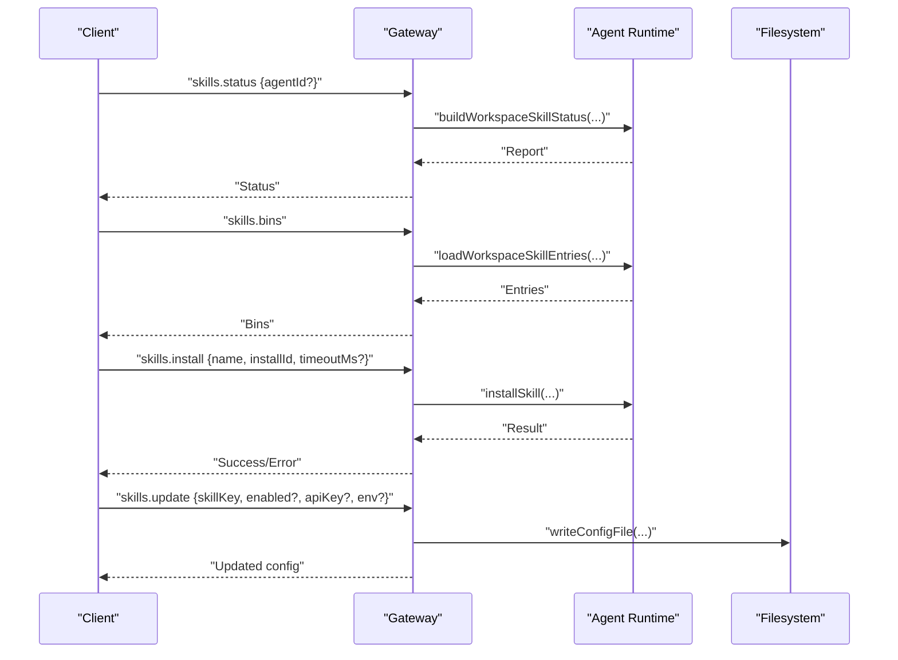

**Diagram sources**
- [src/gateway/server-methods/skills.ts](file://src/gateway/server-methods/skills.ts)
- [src/agents/skills-install.js](file://src/agents/skills-install.js)
- [src/agents/skills/workspace.ts](file://src/agents/skills/workspace.ts)
- [src/utils/normalize-secret-input.js](file://src/utils/normalize-secret-input.js)

**Section sources**
- [src/gateway/server-methods/skills.ts](file://src/gateway/server-methods/skills.ts)
- [src/agents/skills-install.js](file://src/agents/skills-install.js)
- [src/agents/skills/workspace.ts](file://src/agents/skills/workspace.ts)
- [src/utils/normalize-secret-input.js](file://src/utils/normalize-secret-input.js)

### Practical Examples

#### Creating a Custom Workspace Skill
- Steps:
  - Create a directory under <workspace>/skills/<skill-name>.
  - Add a SKILL.md with YAML frontmatter and instructions.
  - Optionally add tools/scripts.
  - Refresh or restart the gateway to discover the new skill.
- Best practices:
  - Be concise; safety-first; test locally.

**Section sources**
- [docs/tools/creating-skills.md](file://docs/tools/creating-skills.md)
- [docs/tools/skills.md](file://docs/tools/skills.md)

#### Using a Sample Skill with Gating
- nano-banana-pro:
  - Demonstrates requires, primaryEnv, install spec, and usage examples.
- peekaboo:
  - Demonstrates os gating and extensive CLI usage.

**Section sources**
- [skills/nano-banana-pro/SKILL.md](file://skills/nano-banana-pro/SKILL.md)
- [skills/peekaboo/SKILL.md](file://skills/peekaboo/SKILL.md)

#### Lobster Workflow (Multi-step with Approval)
- Use cases:
  - Multi-step automations requiring human approval.
- Protocol:
  - run → resume with token → approve → structured output envelope.

**Section sources**
- [extensions/lobster/SKILL.md](file://extensions/lobster/SKILL.md)

## Dependency Analysis
- Internal dependencies:
  - Gateway server methods depend on agent skill loaders, config, and infrastructure for remote eligibility.
  - Agent skill loader depends on workspace scanner, gating config, env overrides, and refresh/watcher.
- External integration:
  - ClawHub CLI writes to filesystem; OpenClaw reads workspace skills on next session.

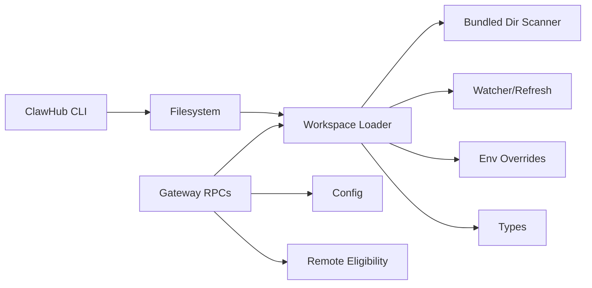

**Diagram sources**
- [src/gateway/server-methods/skills.ts](file://src/gateway/server-methods/skills.ts)
- [src/agents/skills/workspace.ts](file://src/agents/skills/workspace.ts)
- [src/agents/skills/bundled-dir.ts](file://src/agents/skills/bundled-dir.ts)
- [src/agents/skills/refresh.ts](file://src/agents/skills/refresh.ts)
- [src/agents/skills/env-overrides.js](file://src/agents/skills/env-overrides.js)
- [src/agents/skills/types.js](file://src/agents/skills/types.js)
- [src/infra/skills-remote.js](file://src/infra/skills-remote.js)
- [docs/tools/clawhub.md](file://docs/tools/clawhub.md)

**Section sources**
- [src/gateway/server-methods/skills.ts](file://src/gateway/server-methods/skills.ts)
- [src/agents/skills/workspace.ts](file://src/agents/skills/workspace.ts)
- [src/agents/skills/bundled-dir.ts](file://src/agents/skills/bundled-dir.ts)
- [src/agents/skills/refresh.ts](file://src/agents/skills/refresh.ts)
- [src/agents/skills/env-overrides.js](file://src/agents/skills/env-overrides.js)
- [src/agents/skills/types.js](file://src/agents/skills/types.js)
- [src/infra/skills-remote.js](file://src/infra/skills-remote.js)
- [docs/tools/clawhub.md](file://docs/tools/clawhub.md)

## Performance Considerations
- Token impact:
  - Deterministic overhead and per-skill cost when skills are injected into the system prompt.
- Snapshot reuse:
  - Session snapshot reduces repeated scanning; watcher enables hot reload with debounce.
- Sandboxing:
  - Container setup commands and writable root FS are required for installing tools in sandbox.

**Section sources**
- [docs/tools/skills.md](file://docs/tools/skills.md)
- [src/agents/skills/refresh.ts](file://src/agents/skills/refresh.ts)

## Troubleshooting Guide
- Common issues:
  - Skill not appearing: verify precedence and gating (os/bin/env/config).
  - Environment not applied: confirm env/apiKey under skills.entries.<key>; remember scoped injection.
  - Sandbox failures: ensure required binaries exist inside the container or install via setupCommand.
  - Remote eligibility: confirm remote node supports required binaries and system.run is allowed.
- Diagnostics:
  - Use skills.status to inspect eligibility and skills.bins to list required binaries.
  - Update skill config via skills.update to toggle enabled or adjust env/apiKey.

**Section sources**
- [docs/tools/skills.md](file://docs/tools/skills.md)
- [src/gateway/server-methods/skills.ts](file://src/gateway/server-methods/skills.ts)

## Conclusion
OpenClaw’s skills system provides a robust, extensible framework for AI skill development and deployment. It supports multiple skill sources with clear precedence, strong gating and security controls, and seamless integration with the agent loop. The ClawHub registry streamlines discovery, installation, and maintenance. Developers can create custom skills quickly, enforce safety via gating and sandboxing, and optimize performance through snapshots and hot reload.

## Appendices

### Configuration Reference
- skills.allowBundled: allowlist for bundled skills only.
- skills.load.extraDirs: additional directories scanned for skills (lowest precedence).
- skills.load.watch: enable watcher; watchDebounceMs: debounce interval.
- skills.install.preferBrew: prefer brew installers; nodeManager: npm/pnpm/yarn/bun.
- skills.entries.<skillKey>: per-skill overrides (enabled, env, apiKey).

**Section sources**
- [docs/tools/skills-config.md](file://docs/tools/skills-config.md)