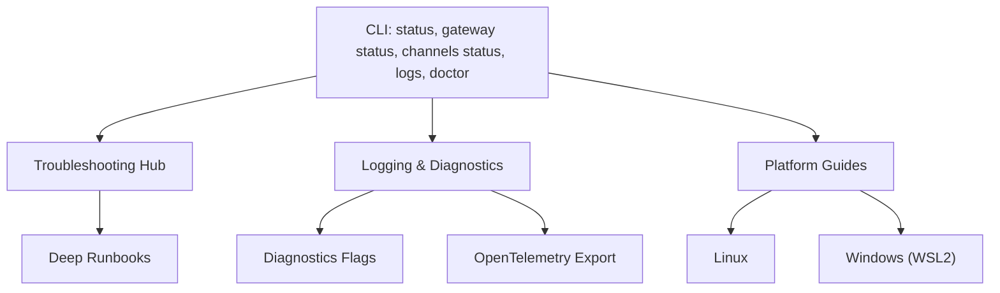
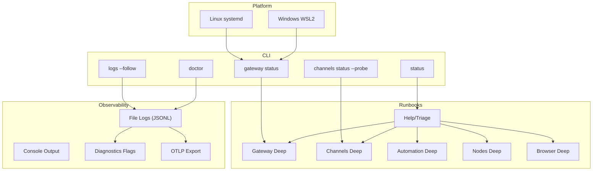
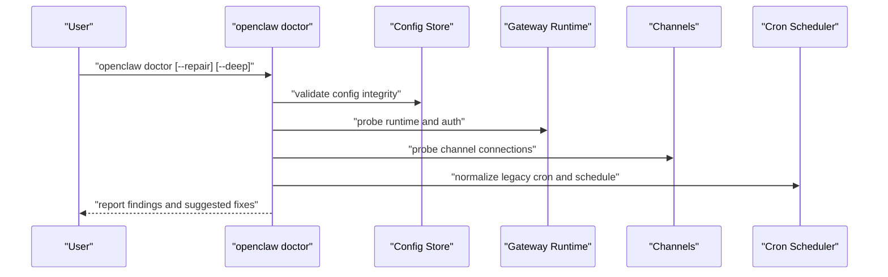
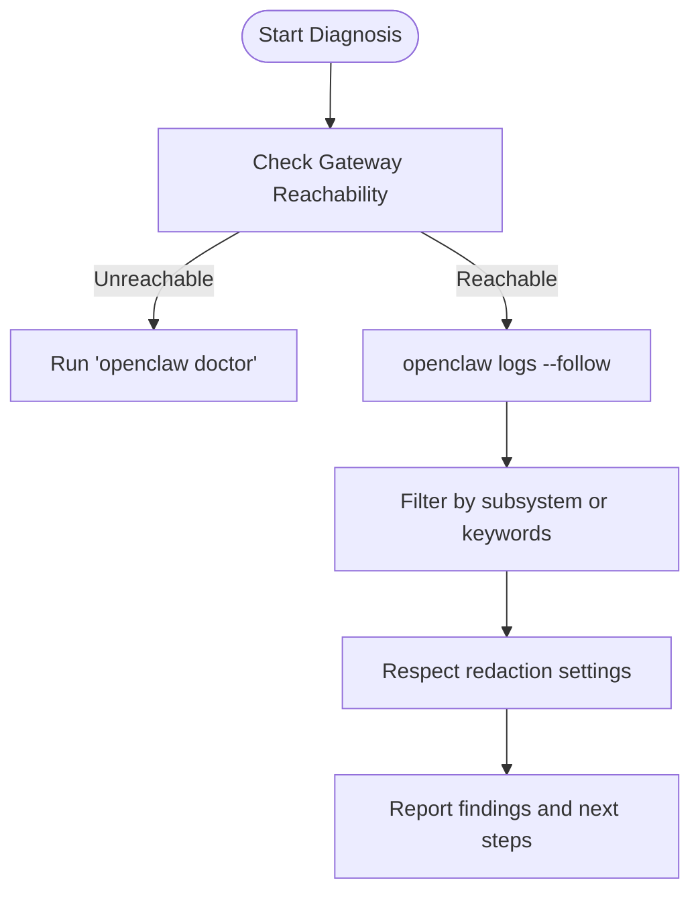
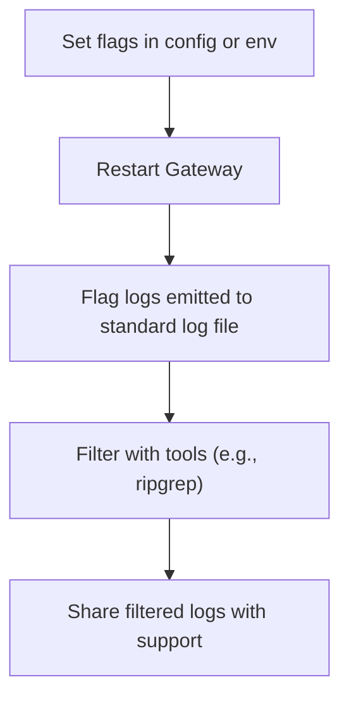
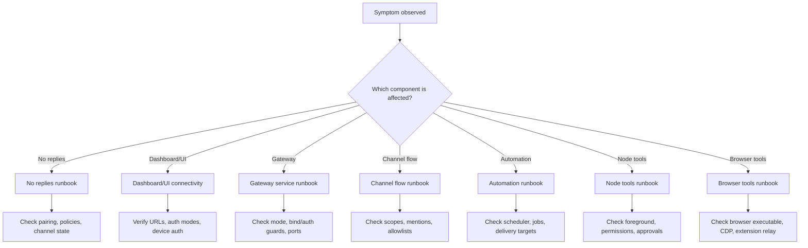
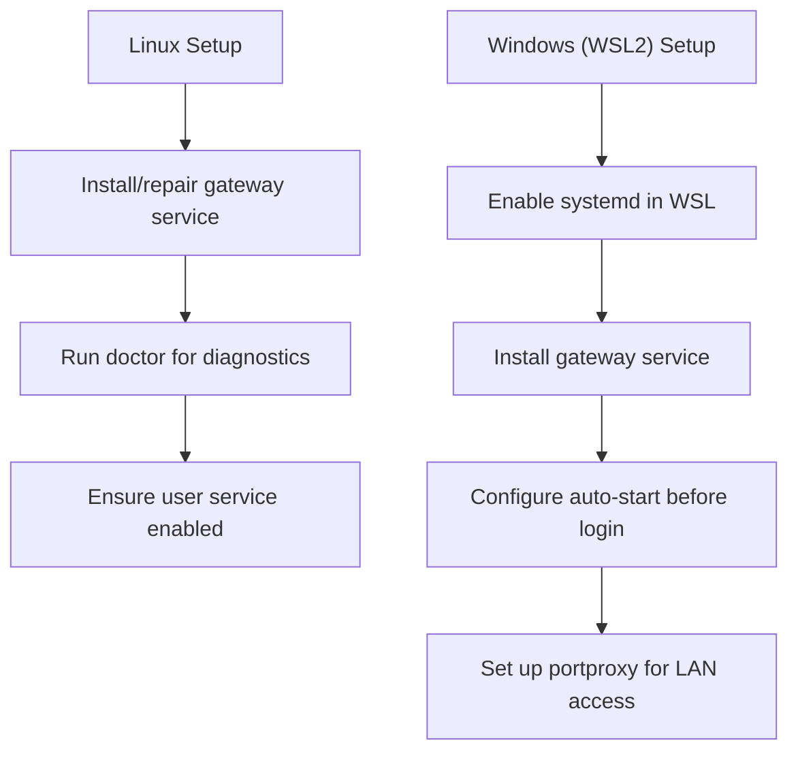
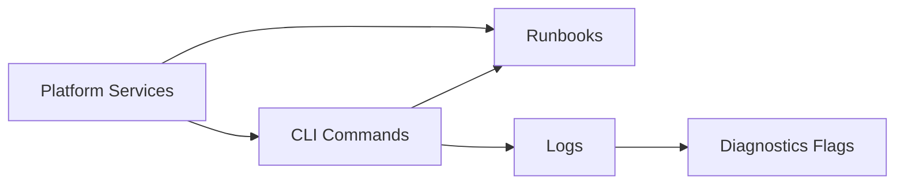

# Troubleshooting & Diagnostics

<cite>
**Referenced Files in This Document**
- [docs/help/troubleshooting.md](file://docs/help/troubleshooting.md)
- [docs/gateway/troubleshooting.md](file://docs/gateway/troubleshooting.md)
- [docs/cli/doctor.md](file://docs/cli/doctor.md)
- [docs/diagnostics/flags.md](file://docs/diagnostics/flags.md)
- [docs/logging.md](file://docs/logging.md)
- [docs/cli/logs.md](file://docs/cli/logs.md)
- [docs/platforms/linux.md](file://docs/platforms/linux.md)
- [docs/platforms/windows.md](file://docs/platforms/windows.md)
- [src/infra/errors.ts](file://src/infra/errors.ts)
- [src/infra/unhandled-rejections.ts](file://src/infra/unhandled-rejections.ts)
- [src/infra/warning-filter.ts](file://src/infra/warning-filter.ts)
- [src/gateway/protocol/schema/error-codes.ts](file://src/gateway/protocol/schema/error-codes.ts)
- [src/gateway/protocol/connect-error-details.ts](file://src/gateway/protocol/connect-error-details.ts)
</cite>

## Table of Contents
1. [Introduction](#introduction)
2. [Project Structure](#project-structure)
3. [Core Components](#core-components)
4. [Architecture Overview](#architecture-overview)
5. [Detailed Component Analysis](#detailed-component-analysis)
6. [Dependency Analysis](#dependency-analysis)
7. [Performance Considerations](#performance-considerations)
8. [Troubleshooting Guide](#troubleshooting-guide)
9. [Conclusion](#conclusion)
10. [Appendices](#appendices)

## Introduction
This document provides comprehensive troubleshooting and diagnostics guidance for OpenClaw. It covers automated diagnostics via the doctor command, manual diagnostic procedures, logging configuration and analysis, diagnostic flags, platform-specific troubleshooting, performance tuning, system optimization, error and warning interpretation, and strategies for resolving network connectivity, authentication, and integration issues.

## Project Structure
OpenClaw’s troubleshooting and diagnostics surface is organized around:
- CLI-driven health checks and log tailing
- Centralized troubleshooting runbooks
- Configurable logging and diagnostics flags
- Platform-specific guidance for Linux and Windows (WSL2)

**Section sources**
- [docs/help/troubleshooting.md](file://docs/help/troubleshooting.md#L13-L36)
- [docs/gateway/troubleshooting.md](file://docs/gateway/troubleshooting.md#L14-L31)
- [docs/logging.md](file://docs/logging.md#L20-L67)
- [docs/diagnostics/flags.md](file://docs/diagnostics/flags.md#L11-L41)
- [docs/platforms/linux.md](file://docs/platforms/linux.md#L37-L63)
- [docs/platforms/windows.md](file://docs/platforms/windows.md#L30-L56)

## Core Components
- Doctor command: Automated health checks, guided repairs, and warnings for configuration and service integrity.
- Logging: File logs (JSONL) and console output with configurable levels, formats, and redaction.
- Diagnostics flags: Targeted debug logs without raising global verbosity.
- Troubleshooting runbooks: Symptom-first triage and deep dives for gateway, channels, automation, nodes, and browsers.
- Platform guides: Linux systemd user services and Windows WSL2 auto-start and port forwarding.

**Section sources**
- [docs/cli/doctor.md](file://docs/cli/doctor.md#L9-L34)
- [docs/logging.md](file://docs/logging.md#L100-L141)
- [docs/diagnostics/flags.md](file://docs/diagnostics/flags.md#L9-L53)
- [docs/help/troubleshooting.md](file://docs/help/troubleshooting.md#L68-L88)
- [docs/platforms/linux.md](file://docs/platforms/linux.md#L65-L94)
- [docs/platforms/windows.md](file://docs/platforms/windows.md#L58-L100)

## Architecture Overview
The diagnostics and troubleshooting architecture integrates CLI commands, centralized runbooks, and observability layers.

**Diagram sources**
- [docs/help/troubleshooting.md](file://docs/help/troubleshooting.md#L13-L36)
- [docs/gateway/troubleshooting.md](file://docs/gateway/troubleshooting.md#L14-L31)
- [docs/logging.md](file://docs/logging.md#L20-L67)
- [docs/diagnostics/flags.md](file://docs/diagnostics/flags.md#L55-L85)
- [docs/platforms/linux.md](file://docs/platforms/linux.md#L65-L94)
- [docs/platforms/windows.md](file://docs/platforms/windows.md#L58-L100)

## Detailed Component Analysis

### Doctor Command
The doctor command performs health checks and guided repairs across gateway and channels. It detects blocking configuration/service issues, handles interactive prompts when running in a TTY, and can repair common problems (e.g., legacy cron normalization, orphan transcript archival, sandbox mode checks).

**Diagram sources**
- [docs/cli/doctor.md](file://docs/cli/doctor.md#L18-L34)
- [docs/gateway/troubleshooting.md](file://docs/gateway/troubleshooting.md#L14-L31)

**Section sources**
- [docs/cli/doctor.md](file://docs/cli/doctor.md#L9-L46)
- [docs/gateway/troubleshooting.md](file://docs/gateway/troubleshooting.md#L14-L31)

### Logging and Log Analysis
OpenClaw writes JSONL file logs and renders console output. The CLI can tail logs remotely, supports JSON and plain modes, and respects environment overrides for log levels. Logs are useful for diagnosing connectivity, authentication, and runtime stability.

**Diagram sources**
- [docs/logging.md](file://docs/logging.md#L40-L67)
- [docs/cli/logs.md](file://docs/cli/logs.md#L9-L29)

**Section sources**
- [docs/logging.md](file://docs/logging.md#L10-L67)
- [docs/cli/logs.md](file://docs/cli/logs.md#L9-L29)

### Diagnostics Flags
Diagnostics flags enable targeted debug logs without raising global verbosity. They support wildcard matching and can be set via config or environment. Flags are safe to leave enabled and only affect the specific subsystems.

**Diagram sources**
- [docs/diagnostics/flags.md](file://docs/diagnostics/flags.md#L13-L53)

**Section sources**
- [docs/diagnostics/flags.md](file://docs/diagnostics/flags.md#L9-L92)

### Troubleshooting Runbooks
The troubleshooting hub provides a symptom-first triage ladder followed by deep runbooks covering:
- No replies
- Dashboard/control UI connectivity
- Gateway service not running
- Channel connected but messages not flowing
- Cron and heartbeat delivery
- Node paired tool failures
- Browser tool failures

**Diagram sources**
- [docs/help/troubleshooting.md](file://docs/help/troubleshooting.md#L68-L88)
- [docs/gateway/troubleshooting.md](file://docs/gateway/troubleshooting.md#L61-L367)

**Section sources**
- [docs/help/troubleshooting.md](file://docs/help/troubleshooting.md#L13-L36)
- [docs/gateway/troubleshooting.md](file://docs/gateway/troubleshooting.md#L14-L31)

### Platform-Specific Troubleshooting
- Linux: systemd user service installation and repair via doctor; gateway service install flows.
- Windows (WSL2): WSL2 prerequisites, enabling linger, installing gateway service, auto-start tasks, and port forwarding for LAN access.

**Diagram sources**
- [docs/platforms/linux.md](file://docs/platforms/linux.md#L37-L63)
- [docs/platforms/linux.md](file://docs/platforms/linux.md#L65-L94)
- [docs/platforms/windows.md](file://docs/platforms/windows.md#L58-L100)
- [docs/platforms/windows.md](file://docs/platforms/windows.md#L102-L146)

**Section sources**
- [docs/platforms/linux.md](file://docs/platforms/linux.md#L37-L63)
- [docs/platforms/linux.md](file://docs/platforms/linux.md#L65-L94)
- [docs/platforms/windows.md](file://docs/platforms/windows.md#L58-L100)
- [docs/platforms/windows.md](file://docs/platforms/windows.md#L102-L146)

## Dependency Analysis
OpenClaw’s diagnostics and troubleshooting rely on:
- CLI commands feeding into centralized runbooks
- Logging and diagnostics flags as the primary data source
- Platform-specific services (systemd, WSL tasks) impacting availability and connectivity

**Diagram sources**
- [docs/help/troubleshooting.md](file://docs/help/troubleshooting.md#L13-L36)
- [docs/logging.md](file://docs/logging.md#L20-L67)
- [docs/diagnostics/flags.md](file://docs/diagnostics/flags.md#L55-L85)
- [docs/platforms/linux.md](file://docs/platforms/linux.md#L65-L94)
- [docs/platforms/windows.md](file://docs/platforms/windows.md#L58-L100)

**Section sources**
- [docs/help/troubleshooting.md](file://docs/help/troubleshooting.md#L13-L36)
- [docs/logging.md](file://docs/logging.md#L20-L67)
- [docs/diagnostics/flags.md](file://docs/diagnostics/flags.md#L55-L85)
- [docs/platforms/linux.md](file://docs/platforms/linux.md#L65-L94)
- [docs/platforms/windows.md](file://docs/platforms/windows.md#L58-L100)

## Performance Considerations
- Prefer targeted diagnostics flags over raising global log levels to reduce noise and overhead.
- Use JSON mode for log processing and filtering to minimize parsing overhead.
- Tune OTLP exporter sampling and flush intervals for high-volume environments.
- Ensure platform services (systemd timers, WSL auto-start) are configured to avoid unnecessary restart loops.

[No sources needed since this section provides general guidance]

## Troubleshooting Guide

### Systematic Diagnosis Flow
1. Run the triage ladder to establish baseline health.
2. Inspect gateway status and RPC probe results.
3. Tail logs and filter for subsystems or keywords.
4. Use doctor to detect configuration/service issues and apply guided repairs.
5. Consult deep runbooks for the affected component.
6. Apply platform-specific fixes (systemd, WSL tasks, port forwarding).

**Section sources**
- [docs/help/troubleshooting.md](file://docs/help/troubleshooting.md#L13-L36)
- [docs/gateway/troubleshooting.md](file://docs/gateway/troubleshooting.md#L14-L31)
- [docs/logging.md](file://docs/logging.md#L40-L67)
- [docs/cli/logs.md](file://docs/cli/logs.md#L9-L29)
- [docs/cli/doctor.md](file://docs/cli/doctor.md#L18-L34)

### Network Connectivity Issues
- Validate gateway URL, bind/auth configuration, and RPC probe.
- Check for port conflicts and non-loopback binds requiring authentication.
- Review device identity and nonce requirements for dashboard/control UI.

**Section sources**
- [docs/gateway/troubleshooting.md](file://docs/gateway/troubleshooting.md#L91-L137)
- [docs/gateway/troubleshooting.md](file://docs/gateway/troubleshooting.md#L139-L167)

### Authentication Problems
- Confirm token/password configuration and mode alignment.
- Resolve device auth challenges (nonce, signature) and migration notes.
- Address rate limiting and identity mismatches.

**Section sources**
- [docs/gateway/troubleshooting.md](file://docs/gateway/troubleshooting.md#L91-L137)
- [src/gateway/protocol/connect-error-details.ts](file://src/gateway/protocol/connect-error-details.ts#L31-L64)

### Integration Failures (Channels, Nodes, Browser)
- Channels: Check scopes, mentions, allowlists, and pairing approvals.
- Nodes: Verify foreground state, OS permissions, and exec approvals.
- Browser: Validate executable path, CDP reachability, and extension relay.

**Section sources**
- [docs/gateway/troubleshooting.md](file://docs/gateway/troubleshooting.md#L169-L198)
- [docs/gateway/troubleshooting.md](file://docs/gateway/troubleshooting.md#L232-L261)
- [docs/gateway/troubleshooting.md](file://docs/gateway/troubleshooting.md#L263-L292)

### Error Codes and Warning Messages
- Error codes: Standardized error envelopes for protocol-level failures.
- Transient network errors: Recognized as non-fatal to prevent unnecessary crashes.
- Warning filter: Suppresses benign deprecation and experimental warnings to reduce noise.

**Section sources**
- [src/gateway/protocol/schema/error-codes.ts](file://src/gateway/protocol/schema/error-codes.ts#L3-L23)
- [src/infra/unhandled-rejections.ts](file://src/infra/unhandled-rejections.ts#L147-L172)
- [src/infra/warning-filter.ts](file://src/infra/warning-filter.ts#L13-L27)

### Logging Configuration and Analysis
- Configure file and console levels, formats, and redaction.
- Use CLI to tail logs with JSON/plain/TTY-aware modes.
- Extract and filter logs for diagnostics; leverage diagnostics flags for targeted subsystem logs.

**Section sources**
- [docs/logging.md](file://docs/logging.md#L100-L141)
- [docs/cli/logs.md](file://docs/cli/logs.md#L9-L29)
- [docs/diagnostics/flags.md](file://docs/diagnostics/flags.md#L55-L85)

### Platform-Specific Fixes
- Linux: Install/repair gateway service and ensure user service is enabled.
- Windows (WSL2): Enable linger, install gateway service, auto-start WSL, and set up portproxy for LAN access.

**Section sources**
- [docs/platforms/linux.md](file://docs/platforms/linux.md#L37-L63)
- [docs/platforms/linux.md](file://docs/platforms/linux.md#L65-L94)
- [docs/platforms/windows.md](file://docs/platforms/windows.md#L58-L100)
- [docs/platforms/windows.md](file://docs/platforms/windows.md#L102-L146)

## Conclusion
OpenClaw’s diagnostics and troubleshooting ecosystem centers on a robust CLI, centralized runbooks, and configurable logging/diagnostics. By following the systematic diagnosis flow, leveraging doctor for automated repairs, and applying platform-specific guidance, most issues can be identified and resolved efficiently. Use diagnostics flags for targeted insights, maintain appropriate log levels, and consult the deep runbooks for component-specific scenarios.

[No sources needed since this section summarizes without analyzing specific files]

## Appendices

### Quick Reference: Common Commands
- Triage ladder: status, gateway status, channels status --probe, logs --follow, doctor
- Logs: openclaw logs --follow, --json, --limit, --local-time
- Doctor: openclaw doctor, --repair, --deep
- Platform: Linux systemd user service, Windows WSL2 auto-start and portproxy

**Section sources**
- [docs/help/troubleshooting.md](file://docs/help/troubleshooting.md#L13-L36)
- [docs/cli/logs.md](file://docs/cli/logs.md#L17-L29)
- [docs/cli/doctor.md](file://docs/cli/doctor.md#L18-L24)
- [docs/platforms/linux.md](file://docs/platforms/linux.md#L65-L94)
- [docs/platforms/windows.md](file://docs/platforms/windows.md#L58-L100)