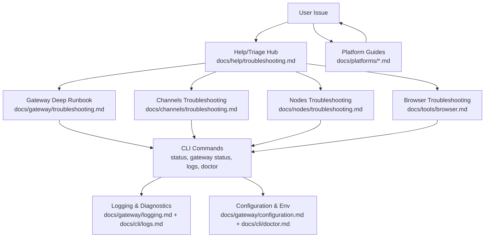
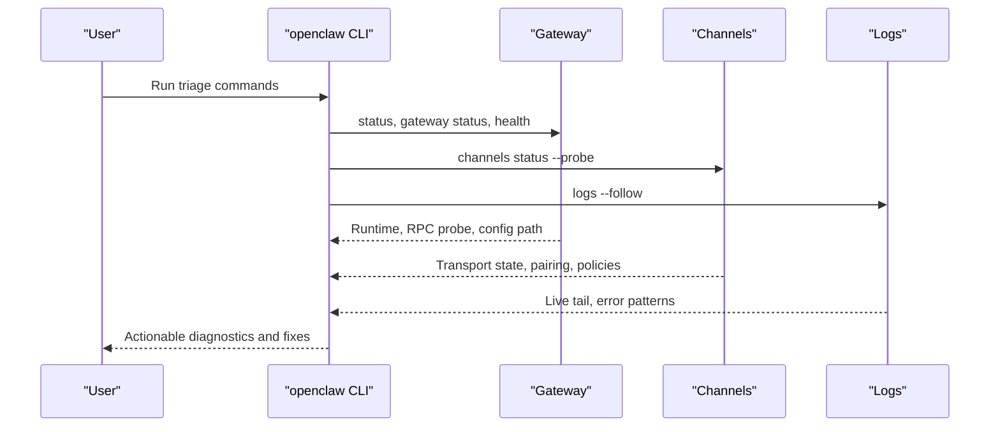
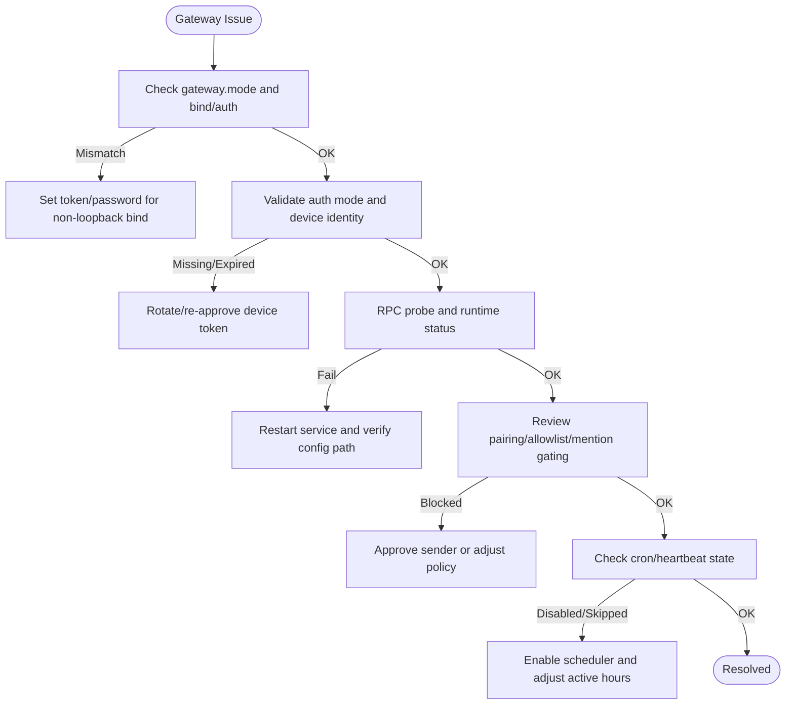
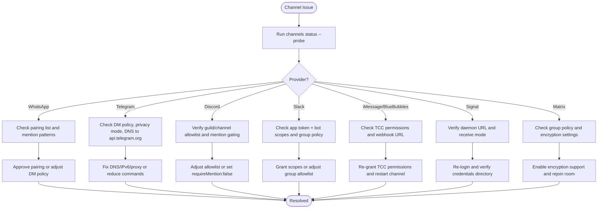
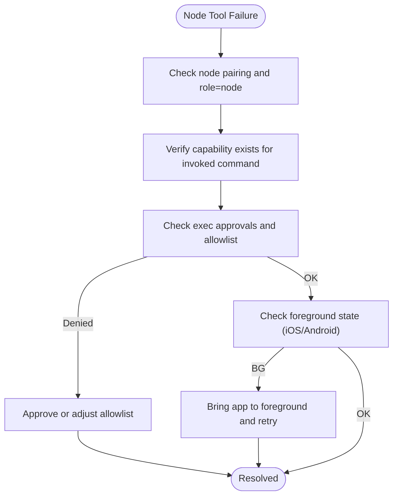
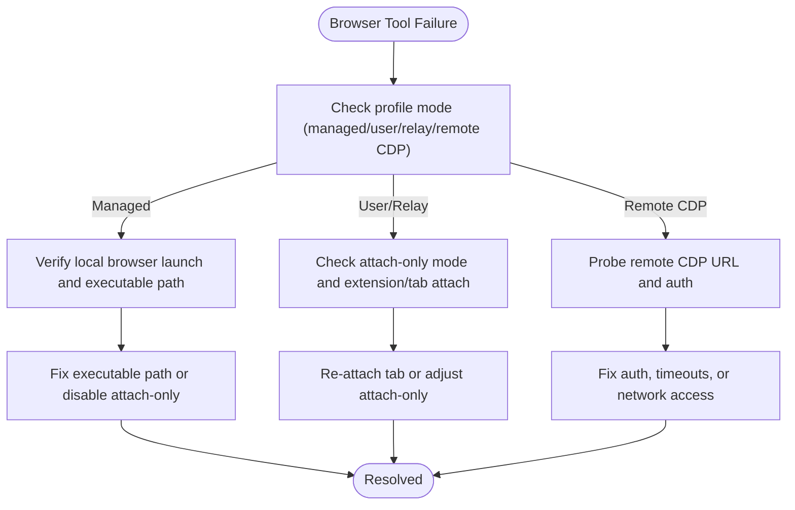
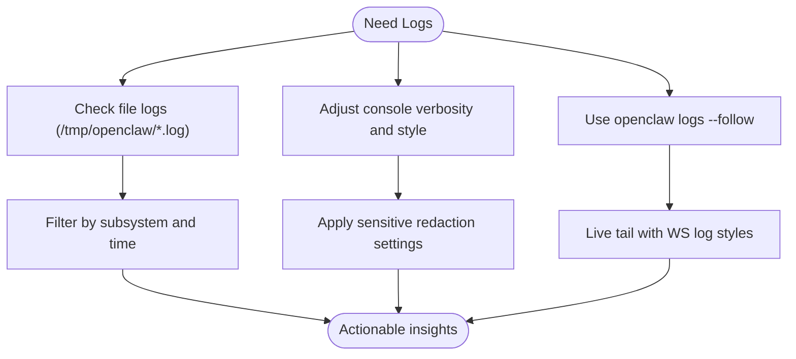
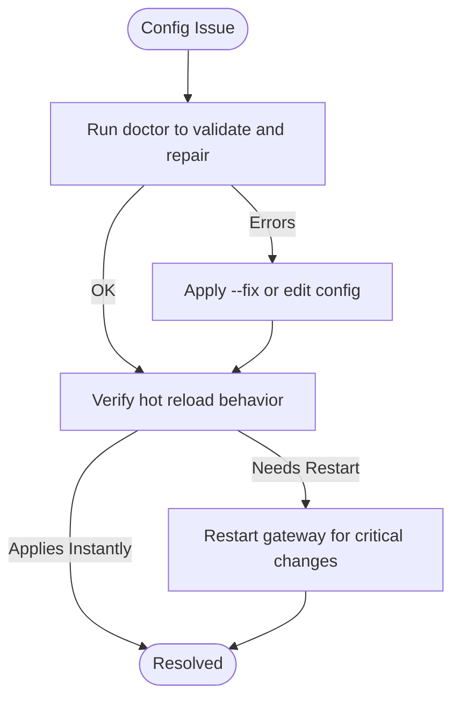
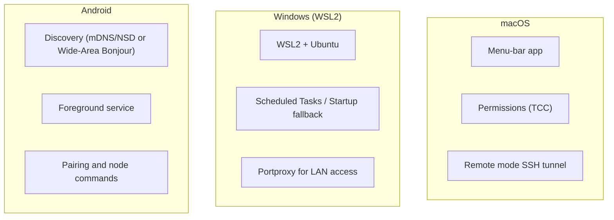
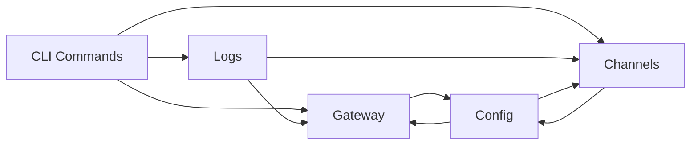

# Troubleshooting & FAQ

<cite>
**Referenced Files in This Document**
- [docs/help/troubleshooting.md](file://docs/help/troubleshooting.md)
- [docs/gateway/troubleshooting.md](file://docs/gateway/troubleshooting.md)
- [docs/channels/troubleshooting.md](file://docs/channels/troubleshooting.md)
- [docs/nodes/troubleshooting.md](file://docs/nodes/troubleshooting.md)
- [docs/debug/node-issue.md](file://docs/debug/node-issue.md)
- [docs/gateway/logging.md](file://docs/gateway/logging.md)
- [docs/cli/logs.md](file://docs/cli/logs.md)
- [docs/install/installer.md](file://docs/install/installer.md)
- [docs/platforms/android.md](file://docs/platforms/android.md)
- [docs/platforms/windows.md](file://docs/platforms/windows.md)
- [docs/platforms/macos.md](file://docs/platforms/macos.md)
- [docs/tools/browser.md](file://docs/tools/browser.md)
- [docs/gateway/configuration.md](file://docs/gateway/configuration.md)
- [docs/cli/doctor.md](file://docs/cli/doctor.md)
</cite>

## Table of Contents
1. [Introduction](#introduction)
2. [Project Structure](#project-structure)
3. [Core Components](#core-components)
4. [Architecture Overview](#architecture-overview)
5. [Detailed Component Analysis](#detailed-component-analysis)
6. [Dependency Analysis](#dependency-analysis)
7. [Performance Considerations](#performance-considerations)
8. [Troubleshooting Guide](#troubleshooting-guide)
9. [Conclusion](#conclusion)
10. [Appendices](#appendices)

## Introduction
This Troubleshooting & FAQ section consolidates practical, step-by-step guidance for diagnosing and resolving common OpenClaw issues across gateway connectivity, channel integration, agent functionality, and plugin issues. It includes diagnostic tools, logging strategies, debugging techniques, platform-specific notes, configuration pitfalls, and escalation paths. The goal is to help you isolate problems quickly, apply targeted fixes, and restore reliable operation with minimal downtime.

## Project Structure
OpenClaw’s troubleshooting ecosystem is organized around:
- A fast triage hub for symptom-first investigations
- Deep runbooks for gateway, channels, nodes, and browser
- CLI tools for status, logs, and health checks
- Platform-specific guides for macOS, Windows (WSL2), and Android
- Configuration and environment management references

**Diagram sources**
- [docs/help/troubleshooting.md:1-299](file://docs/help/troubleshooting.md#L1-L299)
- [docs/gateway/troubleshooting.md:1-380](file://docs/gateway/troubleshooting.md#L1-L380)
- [docs/channels/troubleshooting.md:1-119](file://docs/channels/troubleshooting.md#L1-L119)
- [docs/nodes/troubleshooting.md:1-115](file://docs/nodes/troubleshooting.md#L1-L115)
- [docs/tools/browser.md:1-775](file://docs/tools/browser.md#L1-L775)
- [docs/gateway/logging.md:1-114](file://docs/gateway/logging.md#L1-L114)
- [docs/cli/logs.md:1-29](file://docs/cli/logs.md#L1-L29)
- [docs/gateway/configuration.md:1-634](file://docs/gateway/configuration.md#L1-L634)
- [docs/cli/doctor.md:1-47](file://docs/cli/doctor.md#L1-L47)
- [docs/platforms/android.md:1-168](file://docs/platforms/android.md#L1-L168)
- [docs/platforms/windows.md:1-242](file://docs/platforms/windows.md#L1-L242)
- [docs/platforms/macos.md:1-227](file://docs/platforms/macos.md#L1-L227)

**Section sources**
- [docs/help/troubleshooting.md:1-299](file://docs/help/troubleshooting.md#L1-L299)
- [docs/gateway/troubleshooting.md:1-380](file://docs/gateway/troubleshooting.md#L1-L380)
- [docs/channels/troubleshooting.md:1-119](file://docs/channels/troubleshooting.md#L1-L119)
- [docs/nodes/troubleshooting.md:1-115](file://docs/nodes/troubleshooting.md#L1-L115)
- [docs/tools/browser.md:1-775](file://docs/tools/browser.md#L1-L775)
- [docs/gateway/logging.md:1-114](file://docs/gateway/logging.md#L1-L114)
- [docs/cli/logs.md:1-29](file://docs/cli/logs.md#L1-L29)
- [docs/gateway/configuration.md:1-634](file://docs/gateway/configuration.md#L1-L634)
- [docs/cli/doctor.md:1-47](file://docs/cli/doctor.md#L1-L47)
- [docs/platforms/android.md:1-168](file://docs/platforms/android.md#L1-L168)
- [docs/platforms/windows.md:1-242](file://docs/platforms/windows.md#L1-L242)
- [docs/platforms/macos.md:1-227](file://docs/platforms/macos.md#L1-L227)

## Core Components
- Triage ladder: a prioritized CLI sequence to diagnose health across gateway, channels, and logs
- Gateway runbook: deep diagnostics for connectivity, auth, permissions, and scheduling
- Channel runbook: provider-specific failure signatures and quick fixes
- Nodes runbook: pairing, foreground requirements, permissions, and exec approvals
- Browser runbook: managed vs relay profiles, attach-only modes, and remote CDP troubleshooting
- Logging and diagnostics: file logs, console verbosity, and WS log styles
- Configuration and environment: strict validation, hot reload, and secret refs
- Platform guides: macOS, Windows (WSL2), and Android specifics

**Section sources**
- [docs/help/troubleshooting.md:13-36](file://docs/help/troubleshooting.md#L13-L36)
- [docs/gateway/troubleshooting.md:14-31](file://docs/gateway/troubleshooting.md#L14-L31)
- [docs/channels/troubleshooting.md:13-30](file://docs/channels/troubleshooting.md#L13-L30)
- [docs/nodes/troubleshooting.md:13-36](file://docs/nodes/troubleshooting.md#L13-L36)
- [docs/tools/browser.md:46-127](file://docs/tools/browser.md#L46-L127)
- [docs/gateway/logging.md:13-114](file://docs/gateway/logging.md#L13-L114)
- [docs/gateway/configuration.md:61-73](file://docs/gateway/configuration.md#L61-L73)
- [docs/gateway/configuration.md:436-475](file://docs/gateway/configuration.md#L436-L475)

## Architecture Overview
The troubleshooting architecture centers on a CLI-driven triage loop that probes the gateway, channels, and logs, then drills down into provider-specific runbooks. Platform-specific guides complement this with OS-level nuances.

**Diagram sources**
- [docs/help/troubleshooting.md:17-36](file://docs/help/troubleshooting.md#L17-L36)
- [docs/gateway/troubleshooting.md:18-31](file://docs/gateway/troubleshooting.md#L18-L31)
- [docs/cli/logs.md:17-29](file://docs/cli/logs.md#L17-L29)

**Section sources**
- [docs/help/troubleshooting.md:68-88](file://docs/help/troubleshooting.md#L68-L88)
- [docs/gateway/troubleshooting.md:14-31](file://docs/gateway/troubleshooting.md#L14-L31)
- [docs/cli/logs.md:17-29](file://docs/cli/logs.md#L17-L29)

## Detailed Component Analysis

### Gateway Troubleshooting
Common symptoms and checks:
- Gateway not starting or service not running
  - Validate mode, bind, and auth; check for port conflicts and non-loopback binds without credentials
- Dashboard/UI connectivity issues
  - Validate URL, auth mode, device identity, and nonce/signature flows
- No replies despite connected channels
  - Review pairing, allowlists, mention gating, and policy filters
- Cron or heartbeat not firing
  - Confirm scheduler enabled, next wake present, and delivery targets valid
- Post-upgrade regressions
  - Auth/URL override behavior, stricter bind/auth guards, and device pairing drift

**Diagram sources**
- [docs/gateway/troubleshooting.md:152-181](file://docs/gateway/troubleshooting.md#L152-L181)
- [docs/gateway/troubleshooting.md:91-151](file://docs/gateway/troubleshooting.md#L91-L151)
- [docs/gateway/troubleshooting.md:61-90](file://docs/gateway/troubleshooting.md#L61-L90)
- [docs/gateway/troubleshooting.md:213-244](file://docs/gateway/troubleshooting.md#L213-L244)
- [docs/gateway/troubleshooting.md:307-380](file://docs/gateway/troubleshooting.md#L307-L380)

**Section sources**
- [docs/gateway/troubleshooting.md:152-181](file://docs/gateway/troubleshooting.md#L152-L181)
- [docs/gateway/troubleshooting.md:91-151](file://docs/gateway/troubleshooting.md#L91-L151)
- [docs/gateway/troubleshooting.md:61-90](file://docs/gateway/troubleshooting.md#L61-L90)
- [docs/gateway/troubleshooting.md:213-244](file://docs/gateway/troubleshooting.md#L213-L244)
- [docs/gateway/troubleshooting.md:307-380](file://docs/gateway/troubleshooting.md#L307-L380)

### Channel Troubleshooting
Provider-specific failure signatures and quick fixes:
- WhatsApp: pairing approvals, mention gating, and reconnect loops
- Telegram: DM policy, privacy mode, DNS/proxy to API endpoints, and command menu limits
- Discord: guild/channel allowlist and mention gating
- Slack: socket mode tokens and scopes, DM policy, and group allowlist
- iMessage/BlueBubbles: webhook reachability, TCC permissions, and pairing approvals
- Signal: daemon reachability and receive mode
- Matrix: group policy and encrypted room setup

**Diagram sources**
- [docs/channels/troubleshooting.md:31-119](file://docs/channels/troubleshooting.md#L31-L119)

**Section sources**
- [docs/channels/troubleshooting.md:31-119](file://docs/channels/troubleshooting.md#L31-L119)

### Nodes Troubleshooting
Focus areas:
- Foreground-only capabilities on iOS/Android (canvas, camera, screen)
- OS permissions and location modes
- Exec approvals and allowlist enforcement
- Pairing vs approvals distinction

**Diagram sources**
- [docs/nodes/troubleshooting.md:37-91](file://docs/nodes/troubleshooting.md#L37-L91)

**Section sources**
- [docs/nodes/troubleshooting.md:37-91](file://docs/nodes/troubleshooting.md#L37-L91)

### Browser Troubleshooting
Profiles and modes:
- Managed vs user vs extension relay vs remote CDP
- Attach-only profiles and relay bind host
- Private network SSRF policy and remote CDP timeouts
- Troubleshooting steps for Linux and WSL2/Windows remote CDP

**Diagram sources**
- [docs/tools/browser.md:46-127](file://docs/tools/browser.md#L46-L127)
- [docs/tools/browser.md:303-433](file://docs/tools/browser.md#L303-L433)

**Section sources**
- [docs/tools/browser.md:46-127](file://docs/tools/browser.md#L46-L127)
- [docs/tools/browser.md:303-433](file://docs/tools/browser.md#L303-L433)

### Logging and Diagnostics
- File logs: JSON lines under /tmp/openclaw/, configurable via logging.file and logging.level
- Console logs: TTY-aware, subsystem prefixes, and WS log styles
- CLI logs: tail Gateway logs remotely via RPC
- WS logs: normal vs verbose modes and compact/full styles

**Diagram sources**
- [docs/gateway/logging.md:18-114](file://docs/gateway/logging.md#L18-L114)
- [docs/cli/logs.md:17-29](file://docs/cli/logs.md#L17-L29)

**Section sources**
- [docs/gateway/logging.md:18-114](file://docs/gateway/logging.md#L18-L114)
- [docs/cli/logs.md:17-29](file://docs/cli/logs.md#L17-L29)

### Configuration and Environment
- Strict validation: unknown keys or invalid values cause refusal to start
- Hot reload: hybrid mode applies safe changes instantly; critical changes trigger restart
- Secrets and env: SecretRef, env vars, and inline substitutions
- Doctor: guided repairs, state integrity checks, and warnings for Docker sandbox

**Diagram sources**
- [docs/gateway/configuration.md:61-73](file://docs/gateway/configuration.md#L61-L73)
- [docs/gateway/configuration.md:436-475](file://docs/gateway/configuration.md#L436-L475)
- [docs/cli/doctor.md:18-47](file://docs/cli/doctor.md#L18-L47)

**Section sources**
- [docs/gateway/configuration.md:61-73](file://docs/gateway/configuration.md#L61-L73)
- [docs/gateway/configuration.md:436-475](file://docs/gateway/configuration.md#L436-L475)
- [docs/cli/doctor.md:18-47](file://docs/cli/doctor.md#L18-L47)

### Platform-Specific Issues
- macOS
  - Menu-bar app manages launchd, permissions, and node capabilities
  - Remote mode uses SSH tunnels; deep links and exec approvals
- Windows (WSL2)
  - Recommended path via WSL2; scheduled tasks fallback; portproxy for exposing services
- Android
  - Discovery via mDNS/NSD or Wide-Area Bonjour; foreground service and pairing

**Diagram sources**
- [docs/platforms/macos.md:15-227](file://docs/platforms/macos.md#L15-L227)
- [docs/platforms/windows.md:19-242](file://docs/platforms/windows.md#L19-L242)
- [docs/platforms/android.md:26-168](file://docs/platforms/android.md#L26-L168)

**Section sources**
- [docs/platforms/macos.md:15-227](file://docs/platforms/macos.md#L15-L227)
- [docs/platforms/windows.md:19-242](file://docs/platforms/windows.md#L19-L242)
- [docs/platforms/android.md:26-168](file://docs/platforms/android.md#L26-L168)

## Dependency Analysis
The troubleshooting workflow depends on CLI commands feeding logs and configuration state to actionable runbooks. Platform differences introduce additional dependencies (e.g., WSL portproxy, macOS SSH tunnels, Android discovery).

**Diagram sources**
- [docs/help/troubleshooting.md:17-36](file://docs/help/troubleshooting.md#L17-L36)
- [docs/gateway/logging.md:18-114](file://docs/gateway/logging.md#L18-L114)
- [docs/gateway/configuration.md:61-73](file://docs/gateway/configuration.md#L61-L73)

**Section sources**
- [docs/help/troubleshooting.md:17-36](file://docs/help/troubleshooting.md#L17-L36)
- [docs/gateway/logging.md:18-114](file://docs/gateway/logging.md#L18-L114)
- [docs/gateway/configuration.md:61-73](file://docs/gateway/configuration.md#L61-L73)

## Performance Considerations
- Reduce noise: tune logging.consoleLevel and logging.level to balance observability and overhead
- Avoid excessive restarts: leverage hot reload for non-critical changes
- Monitor WS log volume: use compact/full styles judiciously during debugging
- Optimize browser operations: prefer managed profile for isolated automation; use attach-only sparingly

[No sources needed since this section provides general guidance]

## Troubleshooting Guide

### Systematic First 60 Seconds
- Run the triage ladder in order and interpret expected signals
- If RPC probe fails but runtime is running, check auth mode and device identity
- If channels show connected but no replies, review pairing and policy filters

**Section sources**
- [docs/help/troubleshooting.md:13-36](file://docs/help/troubleshooting.md#L13-L36)
- [docs/gateway/troubleshooting.md:14-31](file://docs/gateway/troubleshooting.md#L14-L31)

### Authentication Failures
- Device identity required or nonce/signature mismatches
- AUTH_TOKEN_MISMATCH with retry hints; rotate/re-approve device token if needed
- Auth detail codes quick map for precise next actions

**Section sources**
- [docs/gateway/troubleshooting.md:91-151](file://docs/gateway/troubleshooting.md#L91-L151)
- [docs/gateway/troubleshooting.md:120-130](file://docs/gateway/troubleshooting.md#L120-L130)

### Connection Problems
- Gateway start blocked due to mode/bind/auth mismatch
- Another gateway instance listening or port conflicts
- Post-upgrade bind/auth guardrails stricter

**Section sources**
- [docs/gateway/troubleshooting.md:152-181](file://docs/gateway/troubleshooting.md#L152-L181)
- [docs/gateway/troubleshooting.md:307-349](file://docs/gateway/troubleshooting.md#L307-L349)

### Channel Integration Issues
- Channel connected but messages not flowing
  - Mention gating, pairing/policy, and missing permissions
- Provider-specific quick fixes
  - WhatsApp, Telegram, Discord, Slack, iMessage/BlueBubbles, Signal, Matrix

**Section sources**
- [docs/gateway/troubleshooting.md:182-212](file://docs/gateway/troubleshooting.md#L182-L212)
- [docs/channels/troubleshooting.md:31-119](file://docs/channels/troubleshooting.md#L31-L119)

### Agent Functionality and Automation
- Cron or heartbeat not firing
  - Scheduler disabled, outside active hours, or unknown account ID
- Anthropic 429 for long context
  - Disable context1m, enable Extra Usage, or configure fallback models

**Section sources**
- [docs/gateway/troubleshooting.md:213-244](file://docs/gateway/troubleshooting.md#L213-L244)
- [docs/gateway/troubleshooting.md:32-60](file://docs/gateway/troubleshooting.md#L32-L60)

### Node Issues
- Foreground-only capabilities and permissions
- Exec approvals and allowlist enforcement
- Pairing vs approvals distinction

**Section sources**
- [docs/nodes/troubleshooting.md:37-91](file://docs/nodes/troubleshooting.md#L37-L91)

### Browser Tool Failures
- Managed vs relay vs remote CDP profiles
- Attach-only mode and extension relay requirements
- Remote CDP timeouts and SSRF policy

**Section sources**
- [docs/tools/browser.md:46-127](file://docs/tools/browser.md#L46-L127)
- [docs/tools/browser.md:303-433](file://docs/tools/browser.md#L303-L433)

### Platform-Specific Scenarios
- macOS
  - Launchd control, permissions, and remote mode SSH tunnels
- Windows (WSL2)
  - Scheduled tasks fallback, portproxy for LAN access
- Android
  - Discovery via mDNS/NSD or Wide-Area Bonjour, foreground service

**Section sources**
- [docs/platforms/macos.md:35-227](file://docs/platforms/macos.md#L35-L227)
- [docs/platforms/windows.md:68-242](file://docs/platforms/windows.md#L68-L242)
- [docs/platforms/android.md:26-168](file://docs/platforms/android.md#L26-L168)

### Diagnostic Tools and Logging Strategies
- Use CLI logs to tail Gateway logs remotely
- Adjust console verbosity and WS log styles for detailed inspection
- Apply sensitive redaction and filter logs by subsystem

**Section sources**
- [docs/cli/logs.md:17-29](file://docs/cli/logs.md#L17-L29)
- [docs/gateway/logging.md:35-114](file://docs/gateway/logging.md#L35-L114)

### Configuration and Environment Pitfalls
- Strict validation errors block startup
- Hot reload behavior varies by category; critical changes require restart
- Secrets and env var substitution; doctor can guide repairs

**Section sources**
- [docs/gateway/configuration.md:61-73](file://docs/gateway/configuration.md#L61-L73)
- [docs/gateway/configuration.md:436-475](file://docs/gateway/configuration.md#L436-L475)
- [docs/cli/doctor.md:18-47](file://docs/cli/doctor.md#L18-L47)

### Escalation Procedures and Community Resources
- Use the fast triage ladder and share outputs when requesting help
- Installer internals and flags for automation and headless runs
- Community channels and issue templates for bug reports and feature requests

**Section sources**
- [docs/help/troubleshooting.md:203-317](file://docs/help/troubleshooting.md#L203-L317)
- [docs/install/installer.md:10-416](file://docs/install/installer.md#L10-L416)

## Conclusion
Effective troubleshooting in OpenClaw hinges on a disciplined triage loop, provider-specific runbooks, and robust logging. By leveraging the CLI diagnostics, understanding platform nuances, and applying configuration best practices, most issues can be resolved quickly. For persistent problems, escalate with precise diagnostics and community resources.

[No sources needed since this section summarizes without analyzing specific files]

## Appendices

### Frequently Asked Questions (FAQ)
- Installation and setup
  - Recommended install paths and onboarding steps
  - Windows installer issues and WSL2 guidance
  - Raspberry Pi and ARM compatibility tips
- Configuration basics
  - Bind/auth behavior changes and token requirements
  - Config hot reload modes and validation
- Models and providers
  - Anthropic 429 rate limits and long-context usage
  - Model failover and provider auth profiles
- Gateway and remote access
  - Ports, remote mode, and unauthorized errors
  - Tailscale and SSH tunneling
- Logging and debugging
  - Log locations, console styles, and WS log modes
  - Troubleshooting Node + tsx crashes

**Section sources**
- [docs/help/faq.md:203-317](file://docs/help/faq.md#L203-L317)
- [docs/help/faq.md:318-533](file://docs/help/faq.md#L318-L533)
- [docs/help/faq.md:534-800](file://docs/help/faq.md#L534-L800)
- [docs/debug/node-issue.md:11-86](file://docs/debug/node-issue.md#L11-L86)