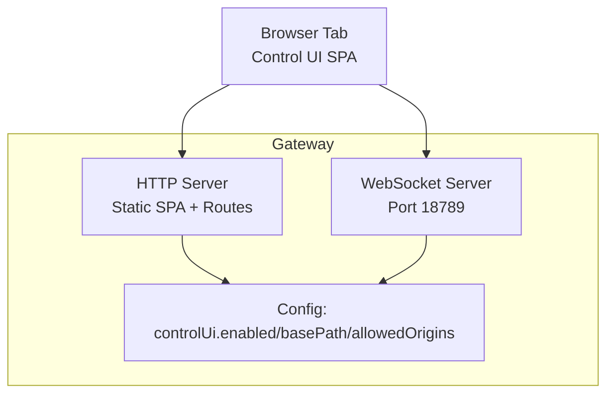
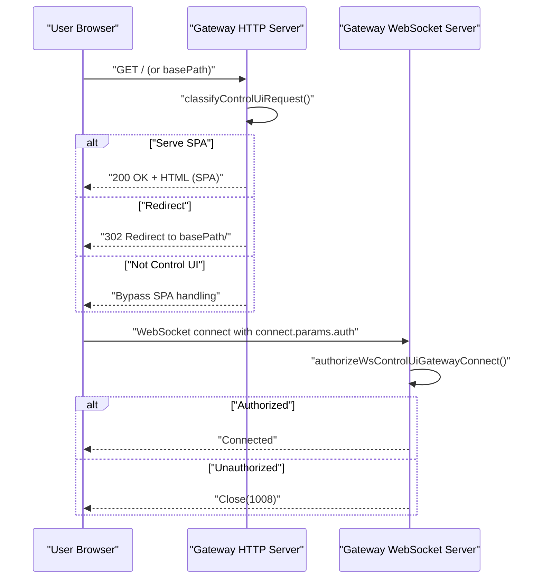
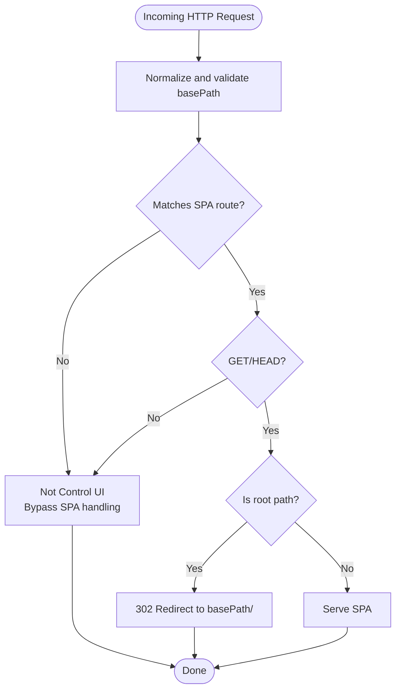
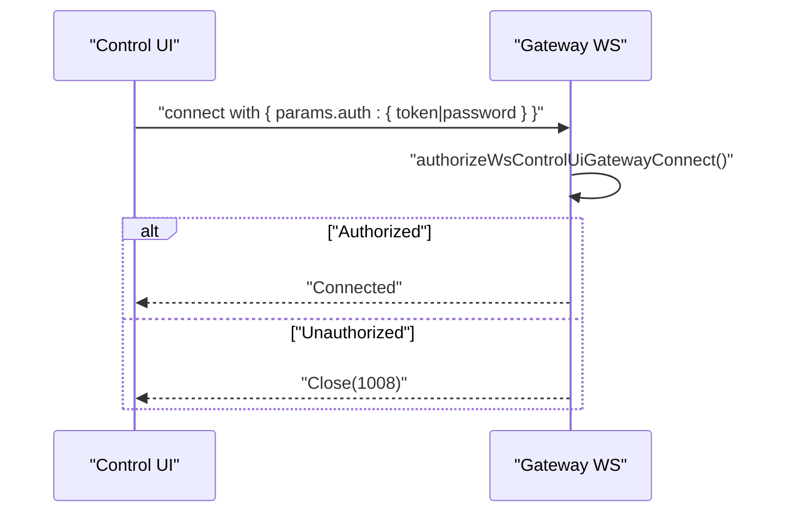
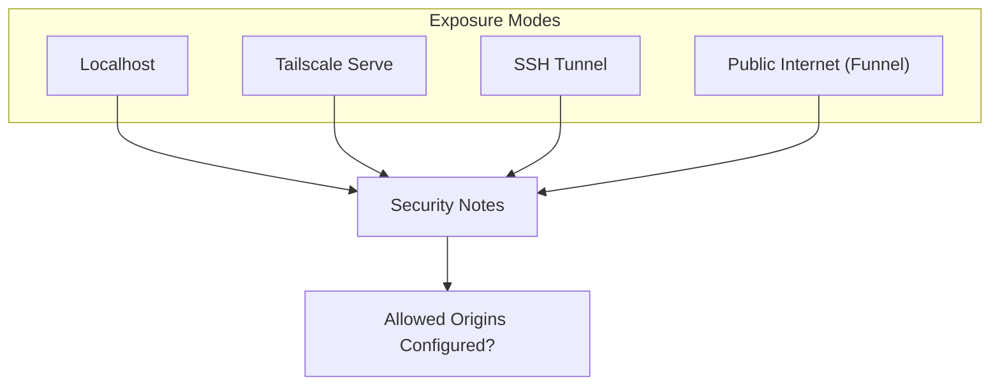
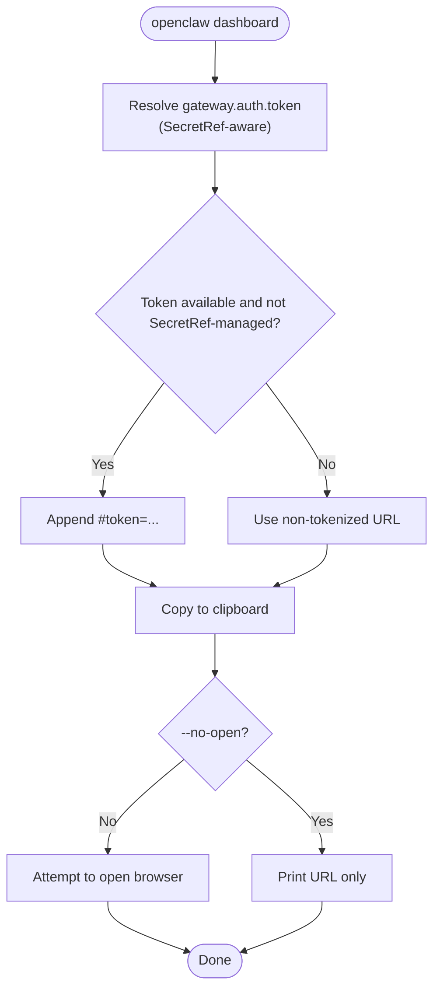
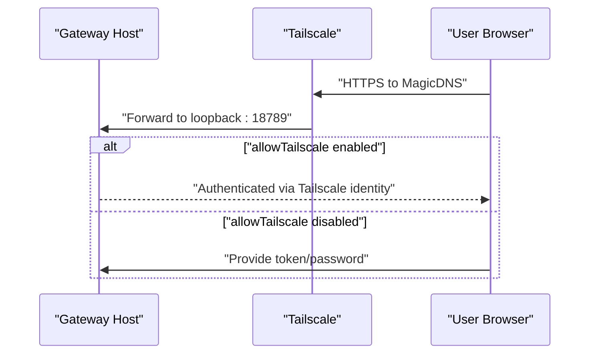
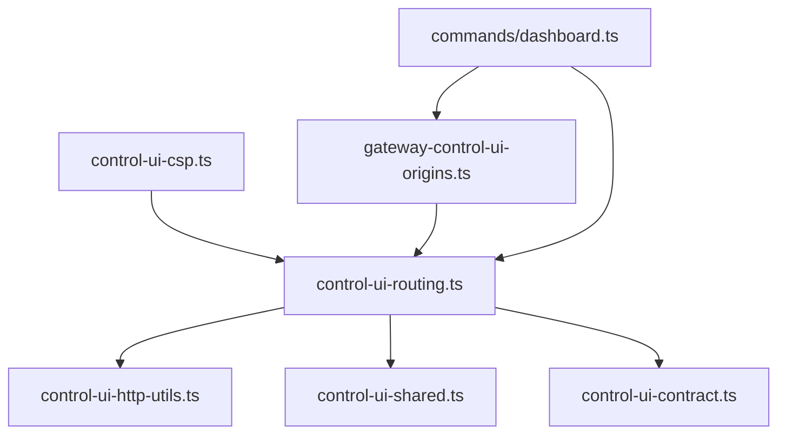

# Dashboard Overview

<cite>
**Referenced Files in This Document**
- [docs/web/dashboard.md](file://docs/web/dashboard.md)
- [docs/web/control-ui.md](file://docs/web/control-ui.md)
- [docs/web/index.md](file://docs/web/index.md)
- [src/commands/dashboard.ts](file://src/commands/dashboard.ts)
- [src/gateway/control-ui-routing.ts](file://src/gateway/control-ui-routing.ts)
- [src/gateway/control-ui-csp.ts](file://src/gateway/control-ui-csp.ts)
- [src/gateway/control-ui-http-utils.ts](file://src/gateway/control-ui-http-utils.ts)
- [src/gateway/control-ui-contract.ts](file://src/gateway/control-ui-contract.ts)
- [src/gateway/control-ui-shared.ts](file://src/gateway/control-ui-shared.ts)
- [src/config/gateway-control-ui-origins.ts](file://src/config/gateway-control-ui-origins.ts)
</cite>

## Table of Contents
1. [Introduction](#introduction)
2. [Project Structure](#project-structure)
3. [Core Components](#core-components)
4. [Architecture Overview](#architecture-overview)
5. [Detailed Component Analysis](#detailed-component-analysis)
6. [Dependency Analysis](#dependency-analysis)
7. [Performance Considerations](#performance-considerations)
8. [Troubleshooting Guide](#troubleshooting-guide)
9. [Conclusion](#conclusion)

## Introduction
This document provides a comprehensive overview of OpenClaw’s web control interface (Control UI), focusing on the dashboard architecture, default access patterns, authentication mechanisms, and security posture. It explains how the Control UI is served at the root path by default (or under a configurable basePath), how authentication is enforced during the WebSocket handshake, and how to securely expose the dashboard locally, over Tailscale, or via SSH tunnels. It also covers quick access methods, token-based security, and troubleshooting steps for unauthorized access and connection issues.

## Project Structure
The Control UI is part of the Gateway’s web surface and is served from the same port as the Gateway WebSocket. The UI is a static single-page application built from the repository’s UI assets and hosted by the Gateway when assets are present. Configuration options control whether the UI is enabled, its base path, allowed origins, and related security settings.

**Diagram sources**
- [docs/web/index.md](file://docs/web/index.md#L11-L17)
- [src/gateway/control-ui-routing.ts](file://src/gateway/control-ui-routing.ts#L11-L51)
- [src/gateway/control-ui-contract.ts](file://src/gateway/control-ui-contract.ts#L1-L10)

**Section sources**
- [docs/web/index.md](file://docs/web/index.md#L11-L35)

## Core Components
- Control UI routing and classification: Determines whether an incoming HTTP request targets the Control UI SPA, probes, plugin routes, or other handlers.
- Control UI CSP: Enforces a strict Content Security Policy to mitigate XSS and framing risks.
- Control UI HTTP utilities: Provides helpers for read-only HTTP methods and standardized responses.
- Control UI contract: Defines the bootstrap configuration endpoint and shape used by the UI to initialize.
- Control UI shared utilities: Normalize basePath, construct avatar URLs, and resolve assistant avatars.
- Allowed origins resolver: Ensures non-loopback binds have explicit allowed origins configured, with safe defaults and safeguards.

**Section sources**
- [src/gateway/control-ui-routing.ts](file://src/gateway/control-ui-routing.ts#L1-L52)
- [src/gateway/control-ui-csp.ts](file://src/gateway/control-ui-csp.ts#L1-L18)
- [src/gateway/control-ui-http-utils.ts](file://src/gateway/control-ui-http-utils.ts#L1-L16)
- [src/gateway/control-ui-contract.ts](file://src/gateway/control-ui-contract.ts#L1-L10)
- [src/gateway/control-ui-shared.ts](file://src/gateway/control-ui-shared.ts#L1-L69)
- [src/config/gateway-control-ui-origins.ts](file://src/config/gateway-control-ui-origins.ts#L1-L92)

## Architecture Overview
The Gateway serves the Control UI as a static SPA from either the root path or a configurable basePath. Requests are classified to decide whether to serve the SPA, redirect, or bypass the UI entirely. Authentication is enforced at the WebSocket handshake via a token or password supplied by the UI. For non-loopback deployments, allowed origins must be explicitly configured to prevent CSRF and cross-origin hijacking.

**Diagram sources**
- [src/gateway/control-ui-routing.ts](file://src/gateway/control-ui-routing.ts#L11-L51)
- [docs/web/control-ui.md](file://docs/web/control-ui.md#L26-L31)

## Detailed Component Analysis

### Control UI Serving and basePath
- Default location: The Control UI is served at the root path by default.
- basePath customization: The UI can be mounted under a configurable basePath (for example, /openclaw). The router classifies requests based on basePath and redirects appropriately.
- SPA catch-all: Requests that match the SPA route are served as the UI; probe routes and plugin routes are excluded from the SPA fallback to maintain proper gateway functionality.

**Diagram sources**
- [src/gateway/control-ui-routing.ts](file://src/gateway/control-ui-routing.ts#L11-L51)

**Section sources**
- [docs/web/index.md](file://docs/web/index.md#L11-L17)
- [src/gateway/control-ui-routing.ts](file://src/gateway/control-ui-routing.ts#L11-L51)

### Authentication Mechanisms and WebSocket Handshake
- Authentication is enforced during the WebSocket handshake via connect.params.auth, supporting:
  - token
  - password
- The UI stores the token for the current browser tab session and selected gateway URL in sessionStorage, and removes it from the URL after load. Passwords are not persisted.
- First-time connections from new devices require pairing approval, even on trusted Tailnets.

**Diagram sources**
- [docs/web/control-ui.md](file://docs/web/control-ui.md#L26-L31)
- [docs/web/dashboard.md](file://docs/web/dashboard.md#L23-L24)

**Section sources**
- [docs/web/control-ui.md](file://docs/web/control-ui.md#L26-L31)
- [docs/web/control-ui.md](file://docs/web/control-ui.md#L33-L62)
- [docs/web/dashboard.md](file://docs/web/dashboard.md#L23-L24)

### Security Considerations and Exposure Modes
- Admin surface: The Control UI is an admin surface (chat, config, exec approvals). Do not expose it publicly.
- Recommended exposure:
  - Localhost
  - Tailscale Serve (tokenless for Control UI/WebSocket when allowTailscale is enabled and trusted)
  - SSH tunnel
- Insecure HTTP: Plain HTTP triggers a non-secure context in the browser, blocking WebCrypto. Prefer HTTPS (Tailscale Serve) or localhost.
- Allowed origins: For non-loopback deployments, explicitly set allowedOrigins. Defaults are seeded for localhost and custom binds; otherwise startup may refuse without explicit configuration.
- CSP: The UI enforces a strict CSP to block framing and inline scripts, with permissive styles and explicit font/image/connect sources.

**Diagram sources**
- [docs/web/dashboard.md](file://docs/web/dashboard.md#L26-L29)
- [docs/web/index.md](file://docs/web/index.md#L96-L113)
- [src/config/gateway-control-ui-origins.ts](file://src/config/gateway-control-ui-origins.ts#L46-L91)
- [src/gateway/control-ui-csp.ts](file://src/gateway/control-ui-csp.ts#L1-L18)

**Section sources**
- [docs/web/dashboard.md](file://docs/web/dashboard.md#L26-L29)
- [docs/web/index.md](file://docs/web/index.md#L96-L113)
- [src/config/gateway-control-ui-origins.ts](file://src/config/gateway-control-ui-origins.ts#L46-L91)
- [src/gateway/control-ui-csp.ts](file://src/gateway/control-ui-csp.ts#L1-L18)

### Quick Access Methods and Token-Based Security
- Local quick open: http://127.0.0.1:18789/ (or http://localhost:18789/)
- CLI-driven access: The dashboard command resolves the configured token (including SecretRef-managed tokens), copies the URL to the clipboard, and attempts to open the browser. For SecretRef-managed tokens, it intentionally avoids embedding the token in the URL to prevent leakage.
- Token storage: The UI keeps the token in sessionStorage for the current tab and selected gateway URL; it is stripped from the URL after load. Passwords are not persisted.

**Diagram sources**
- [src/commands/dashboard.ts](file://src/commands/dashboard.ts#L50-L118)
- [docs/cli/dashboard.md](file://docs/cli/dashboard.md#L13-L23)
- [docs/web/control-ui.md](file://docs/web/control-ui.md#L240-L246)

**Section sources**
- [docs/web/dashboard.md](file://docs/web/dashboard.md#L31-L44)
- [src/commands/dashboard.ts](file://src/commands/dashboard.ts#L50-L118)
- [docs/cli/dashboard.md](file://docs/cli/dashboard.md#L13-L23)
- [docs/web/control-ui.md](file://docs/web/control-ui.md#L240-L246)

### Tailscale Integration and Remote Access
- Integrated Serve: Keep the Gateway on loopback and use Tailscale Serve to proxy it with HTTPS. When allowTailscale is enabled, Serve requests can authenticate via Tailscale identity headers. HTTP APIs still require token/password.
- Tailnet bind + token: Bind to tailnet and supply a token; open the UI at the Tailscale IP with the configured basePath.
- Funnel: For public exposure, use Tailscale Funnel with password-based auth.

**Diagram sources**
- [docs/web/control-ui.md](file://docs/web/control-ui.md#L118-L153)
- [docs/web/index.md](file://docs/web/index.md#L37-L94)

**Section sources**
- [docs/web/control-ui.md](file://docs/web/control-ui.md#L118-L153)
- [docs/web/index.md](file://docs/web/index.md#L37-L94)

## Dependency Analysis
The Control UI relies on several Gateway subsystems for routing, security, and configuration:

**Diagram sources**
- [src/gateway/control-ui-routing.ts](file://src/gateway/control-ui-routing.ts#L1-L52)
- [src/gateway/control-ui-http-utils.ts](file://src/gateway/control-ui-http-utils.ts#L1-L16)
- [src/gateway/control-ui-shared.ts](file://src/gateway/control-ui-shared.ts#L1-L69)
- [src/gateway/control-ui-contract.ts](file://src/gateway/control-ui-contract.ts#L1-L10)
- [src/gateway/control-ui-csp.ts](file://src/gateway/control-ui-csp.ts#L1-L18)
- [src/config/gateway-control-ui-origins.ts](file://src/config/gateway-control-ui-origins.ts#L1-L92)
- [src/commands/dashboard.ts](file://src/commands/dashboard.ts#L1-L118)

**Section sources**
- [src/gateway/control-ui-routing.ts](file://src/gateway/control-ui-routing.ts#L1-L52)
- [src/gateway/control-ui-csp.ts](file://src/gateway/control-ui-csp.ts#L1-L18)
- [src/config/gateway-control-ui-origins.ts](file://src/config/gateway-control-ui-origins.ts#L1-L92)
- [src/commands/dashboard.ts](file://src/commands/dashboard.ts#L1-L118)

## Performance Considerations
- SPA routing is lightweight and relies on static file serving; performance primarily depends on network latency and browser rendering.
- Authentication occurs at the WebSocket handshake; minimizing unnecessary reconnects improves UX.
- CSP and allowed origins configurations are static and evaluated once per request classification.

## Troubleshooting Guide
Common issues and resolutions:
- Unauthorized / 1008:
  - Ensure the Gateway is reachable (local: check status; remote: establish an SSH tunnel and open the forwarded localhost URL).
  - Retrieve or supply the token from the gateway host:
    - Plaintext config: read the configured token.
    - SecretRef-managed config: resolve the external secret provider or export the token in the current shell, then rerun the dashboard command.
    - No token configured: generate a new gateway token.
  - Paste the token into the dashboard settings and reconnect.
- Pairing required:
  - New devices require one-time pairing approval. List and approve pending requests, then reconnect.
- Insecure context (plain HTTP):
  - Switch to HTTPS (Tailscale Serve) or open the UI locally to avoid browser restrictions.
- Non-loopback origins:
  - Ensure allowedOrigins is configured for your deployment. Defaults are provided for localhost and custom binds; otherwise startup may refuse without explicit configuration.

**Section sources**
- [docs/web/dashboard.md](file://docs/web/dashboard.md#L45-L53)
- [docs/web/control-ui.md](file://docs/web/control-ui.md#L33-L62)
- [docs/web/index.md](file://docs/web/index.md#L96-L113)

## Conclusion
OpenClaw’s Control UI is a secure, configurable browser interface served alongside the Gateway’s WebSocket. It is designed for local and trusted remote access, with authentication enforced at the WebSocket handshake and strict CSP and origin policies. Use the CLI to quickly open the dashboard with appropriate token handling, prefer localhost or Tailscale Serve for secure exposure, and follow the troubleshooting steps for common connection and authorization issues.