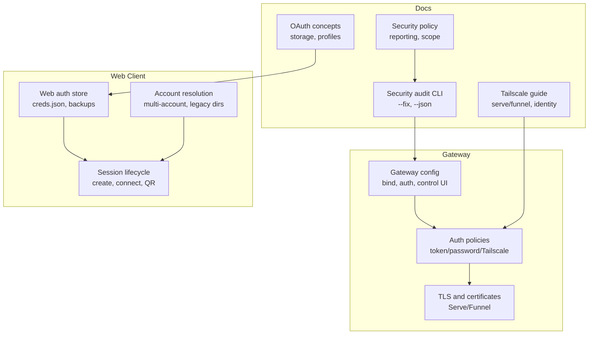
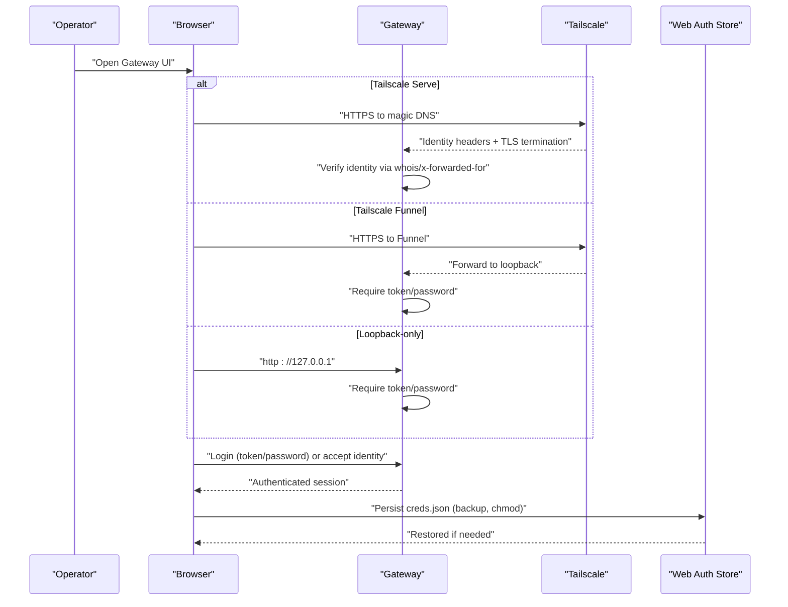
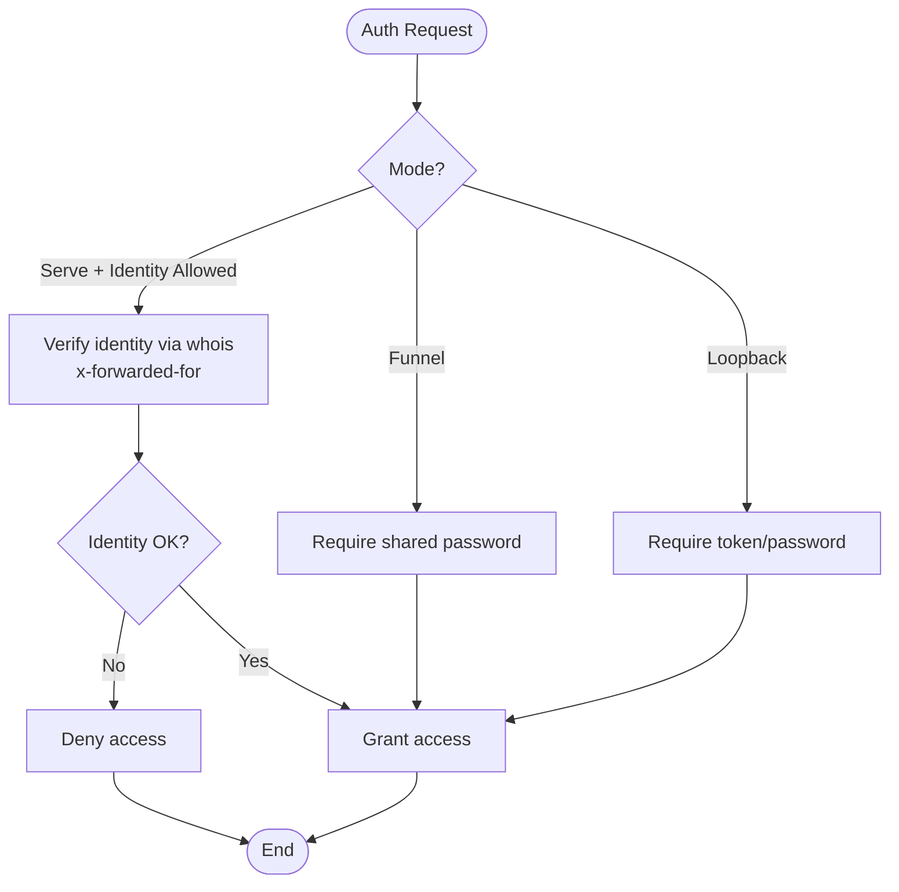
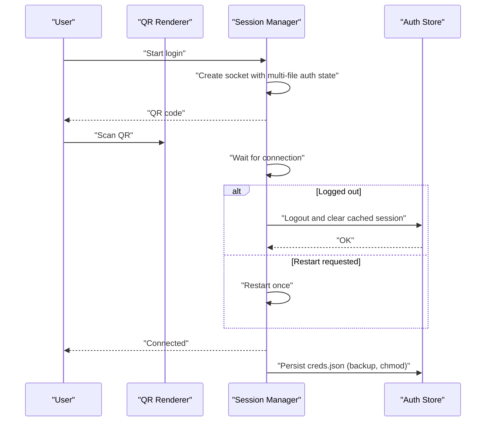
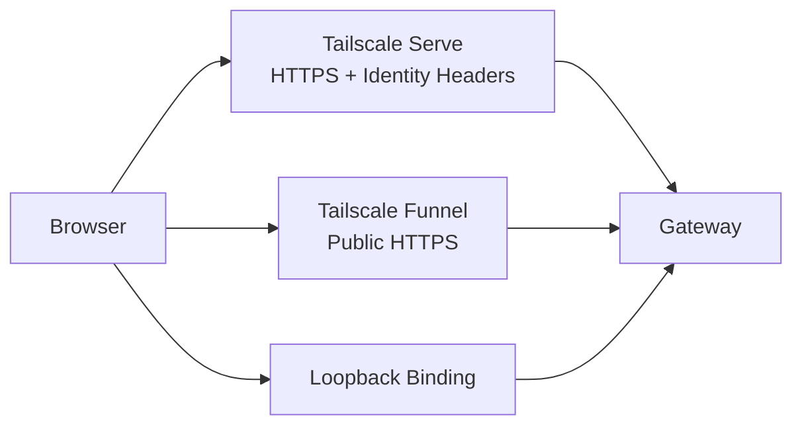
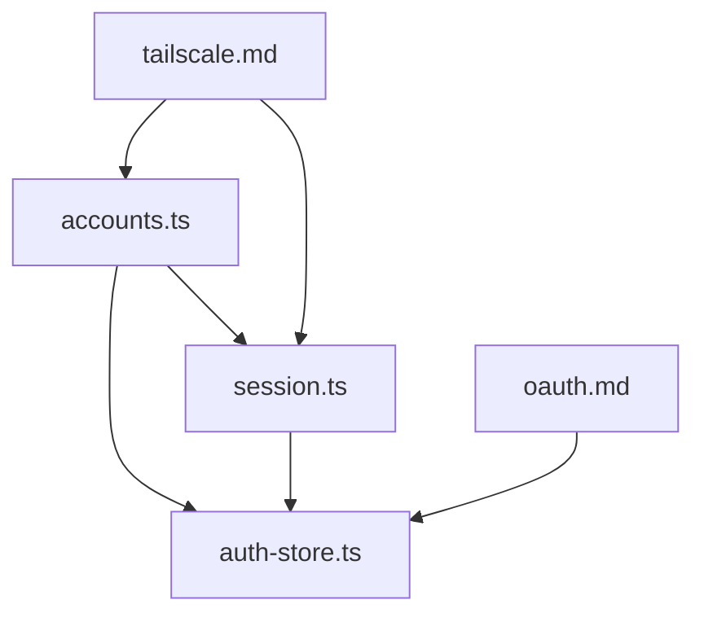

# Web Interface Security

<cite>
**Referenced Files in This Document**
- [SECURITY.md](file://SECURITY.md)
- [authentication.md](file://docs/gateway/authentication.md)
- [tailscale.md](file://docs/gateway/tailscale.md)
- [oauth.md](file://docs/concepts/oauth.md)
- [security.md](file://docs/cli/security.md)
- [auth-store.ts](file://src/web/auth-store.ts)
- [accounts.ts](file://src/web/accounts.ts)
- [session.ts](file://src/web/session.ts)
- [login.ts](file://src/web/login.ts)
- [login-qr.ts](file://src/web/login-qr.ts)
</cite>

## Table of Contents
1. [Introduction](#introduction)
2. [Project Structure](#project-structure)
3. [Core Components](#core-components)
4. [Architecture Overview](#architecture-overview)
5. [Detailed Component Analysis](#detailed-component-analysis)
6. [Dependency Analysis](#dependency-analysis)
7. [Performance Considerations](#performance-considerations)
8. [Troubleshooting Guide](#troubleshooting-guide)
9. [Conclusion](#conclusion)
10. [Appendices](#appendices)

## Introduction
This document provides comprehensive web interface security guidance for OpenClaw’s web components. It focuses on authentication, authorization, and security hardening for the Gateway control UI and related HTTP endpoints. It covers token-based and password-based authentication, Tailscale integration, secure communication, certificate management, and TLS configuration. It also documents browser security considerations, cookie policies, session management, CSP/XSS/CSRF protections, operational deployment patterns, and incident response procedures.

OpenClaw’s web interface is intended for local use by default. Remote exposure should be carefully controlled and layered with strong authentication, identity headers, and network segmentation.

## Project Structure
OpenClaw’s web interface security spans:
- Gateway configuration and authentication policies
- OAuth and API key credential management
- Tailscale-based remote exposure with identity headers
- Web client-side session persistence and credential storage
- CLI security audit and remediation tools

**Diagram sources**
- [SECURITY.md](file://SECURITY.md#L225-L243)
- [security.md](file://docs/cli/security.md#L17-L72)
- [tailscale.md](file://docs/gateway/tailscale.md#L9-L43)
- [oauth.md](file://docs/concepts/oauth.md#L41-L56)
- [auth-store.ts](file://src/web/auth-store.ts#L13-L34)
- [accounts.ts](file://src/web/accounts.ts#L77-L114)
- [session.ts](file://src/web/session.ts#L90-L161)

**Section sources**
- [SECURITY.md](file://SECURITY.md#L225-L243)
- [security.md](file://docs/cli/security.md#L17-L72)
- [tailscale.md](file://docs/gateway/tailscale.md#L9-L43)
- [oauth.md](file://docs/concepts/oauth.md#L41-L56)
- [auth-store.ts](file://src/web/auth-store.ts#L13-L34)
- [accounts.ts](file://src/web/accounts.ts#L77-L114)
- [session.ts](file://src/web/session.ts#L90-L161)

## Core Components
- Authentication and Authorization
  - Token-based auth for HTTP endpoints and Tailscale identity headers
  - Password-based auth for Tailscale Funnel and loopback exposure
  - OAuth and API key credential storage and rotation
- Secure Communication and TLS
  - Tailscale Serve (HTTPS) and Funnel (public HTTPS) with enforced auth
  - Loopback-only binding guidance and canvas host notes
- Web Client Session Management
  - Multi-file auth state persisted to disk with backups and permissions
  - QR-based login flow with active login tracking and timeouts
- Security Auditing and Hardening
  - CLI security audit with fix recommendations and JSON output
  - Trust model and deployment assumptions for local-only use

**Section sources**
- [authentication.md](file://docs/gateway/authentication.md#L9-L18)
- [tailscale.md](file://docs/gateway/tailscale.md#L21-L43)
- [oauth.md](file://docs/concepts/oauth.md#L41-L56)
- [SECURITY.md](file://SECURITY.md#L225-L243)
- [security.md](file://docs/cli/security.md#L17-L72)
- [auth-store.ts](file://src/web/auth-store.ts#L51-L80)
- [login-qr.ts](file://src/web/login-qr.ts#L108-L214)

## Architecture Overview
The web interface relies on:
- Gateway control UI and HTTP endpoints bound to loopback by default
- Optional Tailscale Serve (tailnet-only HTTPS) or Funnel (public HTTPS) for remote access
- Strong authentication via token/password or Tailscale identity headers
- Web client credentials stored securely on disk with backups and restrictive permissions

**Diagram sources**
- [tailscale.md](file://docs/gateway/tailscale.md#L21-L43)
- [session.ts](file://src/web/session.ts#L47-L84)
- [auth-store.ts](file://src/web/auth-store.ts#L51-L80)

**Section sources**
- [tailscale.md](file://docs/gateway/tailscale.md#L21-L43)
- [session.ts](file://src/web/session.ts#L47-L84)
- [auth-store.ts](file://src/web/auth-store.ts#L51-L80)

## Detailed Component Analysis

### Authentication Mechanisms
- Token-based auth
  - Used for HTTP API endpoints and Tailscale Funnel
  - Enforced when Tailscale Serve is not used or when explicit credentials are required
- Password-based auth
  - Required for Tailscale Funnel to avoid public exposure
  - Stored via environment variable or configuration
- Tailscale identity headers
  - When Serve is enabled and allowed, identity headers are verified via local Tailscale daemon
  - Only accepted for loopback requests with forwarded headers
- OAuth and API keys
  - Tokens and keys are stored per-agent in a token sink file
  - Profiles support multiple accounts and per-session routing

**Diagram sources**
- [tailscale.md](file://docs/gateway/tailscale.md#L28-L42)
- [authentication.md](file://docs/gateway/authentication.md#L9-L18)
- [oauth.md](file://docs/concepts/oauth.md#L41-L56)

**Section sources**
- [tailscale.md](file://docs/gateway/tailscale.md#L21-L43)
- [authentication.md](file://docs/gateway/authentication.md#L9-L18)
- [oauth.md](file://docs/concepts/oauth.md#L41-L56)

### Web Client Session Management
- Credential persistence
  - Multi-file auth state stored under a dedicated directory with backups
  - Backups are created before writes and restored if primary file is corrupted
  - File permissions are set to restrictive modes
- Login flow
  - QR generation and rendering for web-based login
  - Active login tracking with TTL and restart handling for specific disconnect reasons
  - Graceful cleanup on logout or session loss
- Account resolution
  - Supports default and legacy auth directories
  - Multi-account configuration with per-account overrides

**Diagram sources**
- [login-qr.ts](file://src/web/login-qr.ts#L108-L214)
- [session.ts](file://src/web/session.ts#L90-L161)
- [auth-store.ts](file://src/web/auth-store.ts#L51-L80)

**Section sources**
- [auth-store.ts](file://src/web/auth-store.ts#L51-L80)
- [session.ts](file://src/web/session.ts#L90-L161)
- [login-qr.ts](file://src/web/login-qr.ts#L108-L214)
- [accounts.ts](file://src/web/accounts.ts#L77-L114)

### Secure Communication Protocols, Certificates, and TLS
- Tailscale Serve
  - Provides HTTPS and tailnet routing; identity headers are injected
  - Requires HTTPS enabled for the tailnet
- Tailscale Funnel
  - Public HTTPS with enforced shared password auth
  - Supported ports include 443, 8443, and 10000
- Loopback-only binding
  - Recommended default to minimize exposure
  - Canvas host routes are intentionally network-visible for trusted node scenarios behind firewall/tailnet controls

**Diagram sources**
- [tailscale.md](file://docs/gateway/tailscale.md#L15-L43)
- [SECURITY.md](file://SECURITY.md#L227-L242)

**Section sources**
- [tailscale.md](file://docs/gateway/tailscale.md#L15-L43)
- [SECURITY.md](file://SECURITY.md#L227-L242)

### Content Security Policy (CSP), XSS Protection, and CSRF Mitigation
- CSP
  - The repository does not define a centralized CSP header for the Gateway control UI in the analyzed files. If CSP is required, deploy a reverse proxy or middleware to inject a strict CSP header tailored to your deployment.
- XSS protection
  - Avoid inline scripts and eval in UI templates. Prefer externalized scripts and secure template rendering.
  - Sanitize any user-generated content and escape HTML in views.
- CSRF mitigation
  - Enforce SameSite cookies and Origin/Referer checks for state-changing requests.
  - Use anti-CSRF tokens for forms and AJAX endpoints.
  - Restrict cross-origin embedding via X-Frame-Options and frame-ancestors in CSP.

[No sources needed since this section provides general guidance]

### Browser Security Considerations, Cookie Policies, and Session Management
- Cookies
  - Use HttpOnly and Secure flags for session cookies when cookies are used.
  - Set SameSite=Lax or Strict depending on your CSRF risk tolerance.
- Session management
  - Enforce short idle timeouts and explicit logout.
  - Invalidate sessions on logout and on credential changes.
- Transport security
  - Prefer HTTPS/TLS for all browser traffic.
  - Use HSTS where appropriate and ensure proper certificate chain validation.

[No sources needed since this section provides general guidance]

### Security Hardening for Exposing the Web Interface
- Recommended deployment patterns
  - Bind to loopback by default; avoid public exposure.
  - Use Tailscale Serve for tailnet-only access or Funnel with shared password for public access.
- Network controls
  - Firewall rules to restrict inbound connections to loopback or tailnet.
  - Reverse proxy with TLS termination only if exposing publicly.
- Least privilege
  - Run the Gateway with minimal privileges and least-required capabilities.
  - Restrict filesystem access and avoid mounting sensitive paths.

**Section sources**
- [SECURITY.md](file://SECURITY.md#L225-L243)
- [tailscale.md](file://docs/gateway/tailscale.md#L100-L126)

### Threat Mitigation Strategies
- Identity verification
  - When using Tailscale Serve, verify forwarded identity headers via the local Tailscale daemon.
- Credential storage
  - Persist credentials with backups and restrictive permissions; restore from backup on corruption.
- Operational hygiene
  - Rotate passwords and tokens regularly; use CLI security audit to identify risky settings.
  - Avoid storing secrets in plaintext or version control.

**Section sources**
- [tailscale.md](file://docs/gateway/tailscale.md#L28-L42)
- [auth-store.ts](file://src/web/auth-store.ts#L51-L80)
- [security.md](file://docs/cli/security.md#L17-L72)

### Security Auditing, Vulnerability Assessment, and Incident Response
- Security audit
  - Use the CLI to run audits and apply safe fixes; export JSON for CI checks.
  - Audit flags dangerous parameters and insecure defaults.
- Vulnerability reporting
  - Follow the security policy for responsible disclosure and triage fast path.
- Incident response
  - Revoke compromised credentials immediately.
  - Review logs and identity headers for unauthorized access.
  - Apply remediations from the security audit and update configurations.

**Section sources**
- [security.md](file://docs/cli/security.md#L17-L72)
- [SECURITY.md](file://SECURITY.md#L20-L47)

## Dependency Analysis
- Internal dependencies
  - Web session management depends on the auth store for credential persistence and restoration.
  - Account resolution determines which auth directory to use, including legacy paths.
  - Tailscale integration influences authentication mode and identity verification.
- External dependencies
  - Tailscale CLI and daemon for Serve/Funnel and identity verification.
  - OAuth providers for token exchange and refresh flows.

**Diagram sources**
- [accounts.ts](file://src/web/accounts.ts#L77-L114)
- [session.ts](file://src/web/session.ts#L90-L161)
- [auth-store.ts](file://src/web/auth-store.ts#L51-L80)
- [tailscale.md](file://docs/gateway/tailscale.md#L21-L43)
- [oauth.md](file://docs/concepts/oauth.md#L41-L56)

**Section sources**
- [accounts.ts](file://src/web/accounts.ts#L77-L114)
- [session.ts](file://src/web/session.ts#L90-L161)
- [auth-store.ts](file://src/web/auth-store.ts#L51-L80)
- [tailscale.md](file://docs/gateway/tailscale.md#L21-L43)
- [oauth.md](file://docs/concepts/oauth.md#L41-L56)

## Performance Considerations
- Minimize credential file churn by batching saves and using queued persistence.
- Use QR-based flows with TTLs to avoid resource leaks.
- Prefer Serve over Funnel for internal access to leverage HTTPS and identity headers.

[No sources needed since this section provides general guidance]

## Troubleshooting Guide
- Authentication issues
  - If Tailscale Serve is not verifying identity, ensure HTTPS is enabled and the local Tailscale daemon is reachable.
  - For Funnel, confirm shared password is set and correct.
- Session problems
  - On logout or restart signals, clear cached credentials and regenerate QR.
  - Restore from backup if primary credentials file is corrupted.
- Audit findings
  - Apply safe fixes from the security audit; review JSON output for critical findings.

**Section sources**
- [tailscale.md](file://docs/gateway/tailscale.md#L28-L42)
- [login.ts](file://src/web/login.ts#L52-L64)
- [auth-store.ts](file://src/web/auth-store.ts#L51-L80)
- [security.md](file://docs/cli/security.md#L58-L72)

## Conclusion
OpenClaw’s web interface is designed for local operation with optional, strongly controlled remote exposure via Tailscale. Robust authentication (token/password/Tailscale identity), secure credential storage, and strict deployment assumptions form the foundation of its security posture. Operators should enforce HTTPS/TLS, apply the security audit recommendations, and follow responsible disclosure practices for vulnerability reporting.

[No sources needed since this section summarizes without analyzing specific files]

## Appendices
- Appendix A: Authentication modes and enforcement
  - Token/password for loopback and Funnel
  - Tailscale identity verification for Serve
- Appendix B: Credential storage and backup
  - Multi-file auth state, backups, and permission enforcement
- Appendix C: Security audit checklist
  - Apply fixes, review JSON output, and remediate risky settings

[No sources needed since this section provides general guidance]