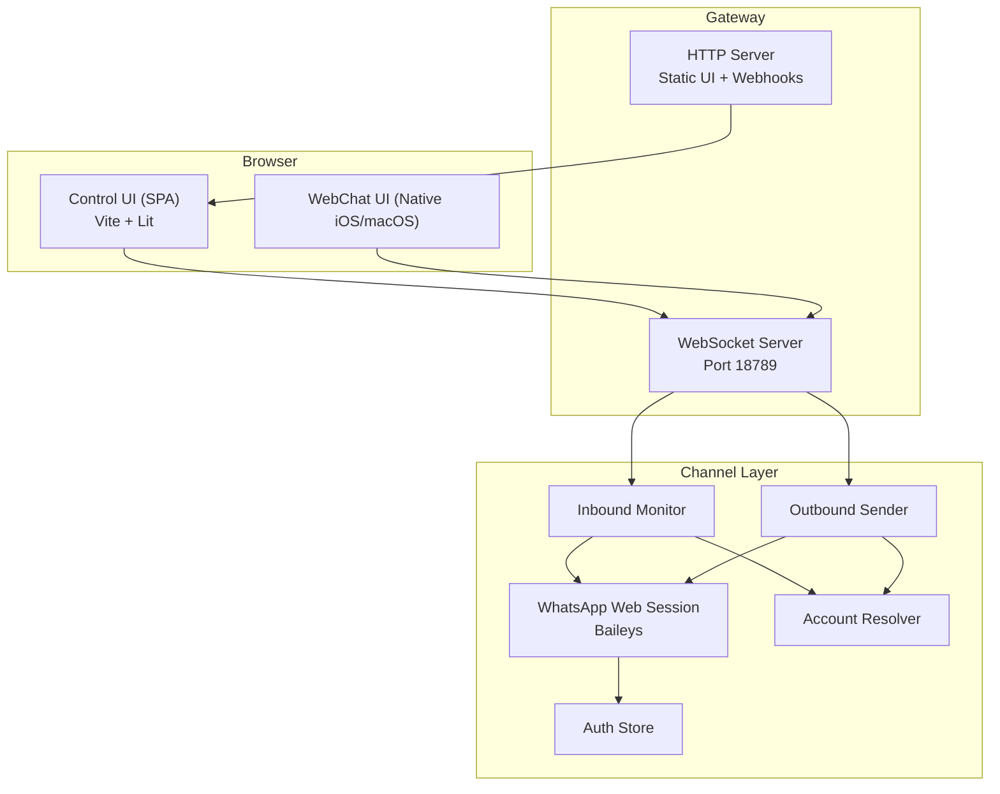
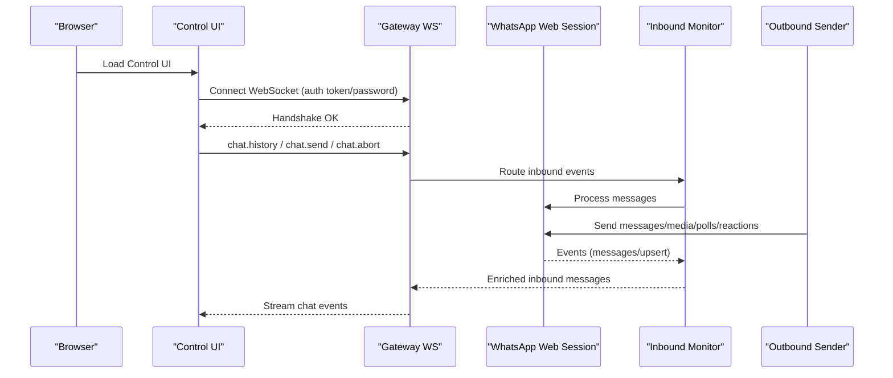
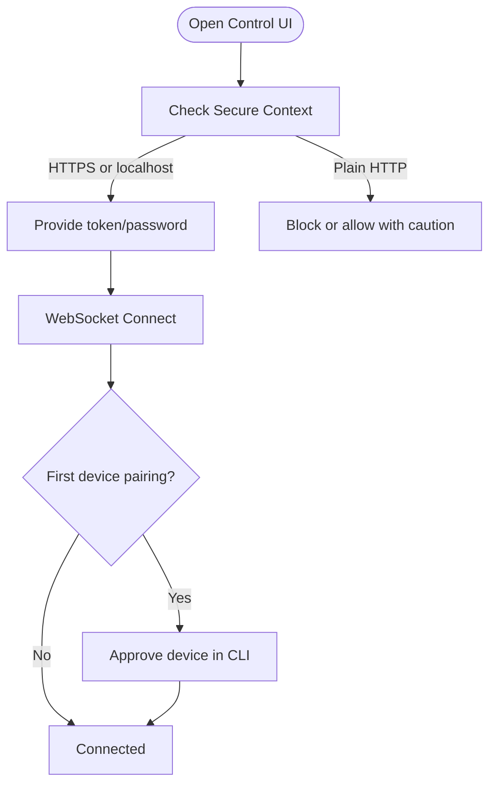
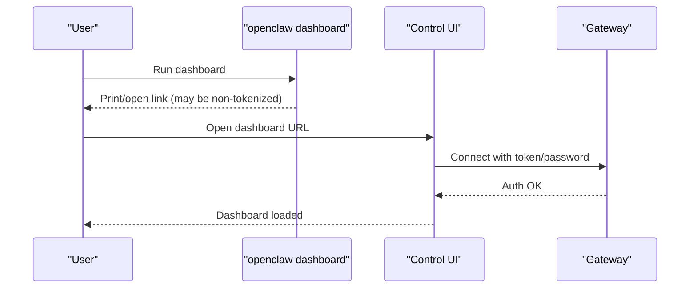
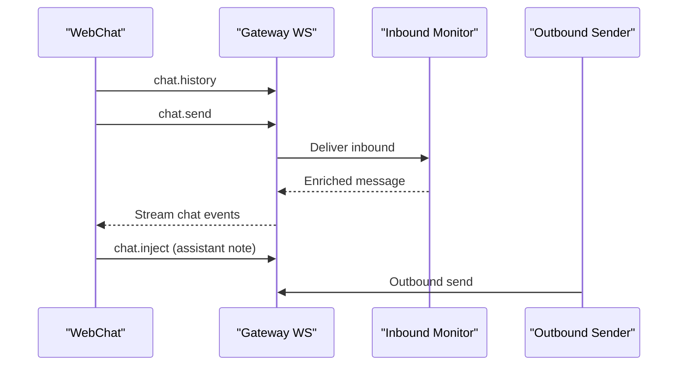
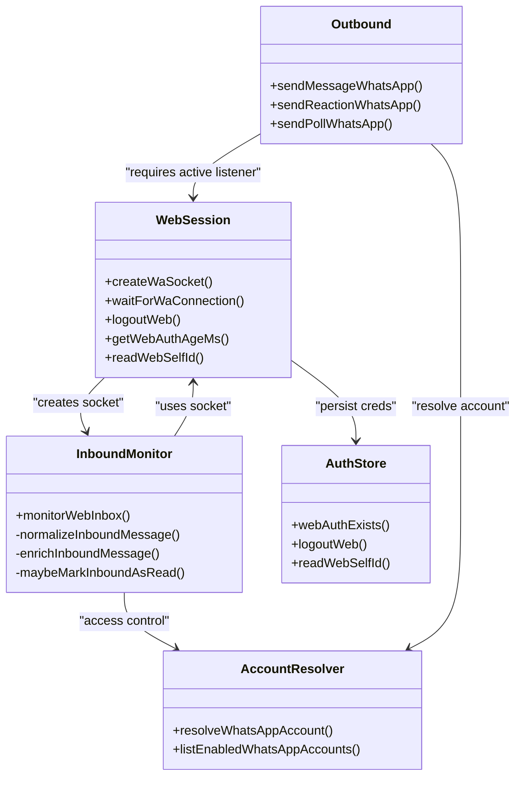
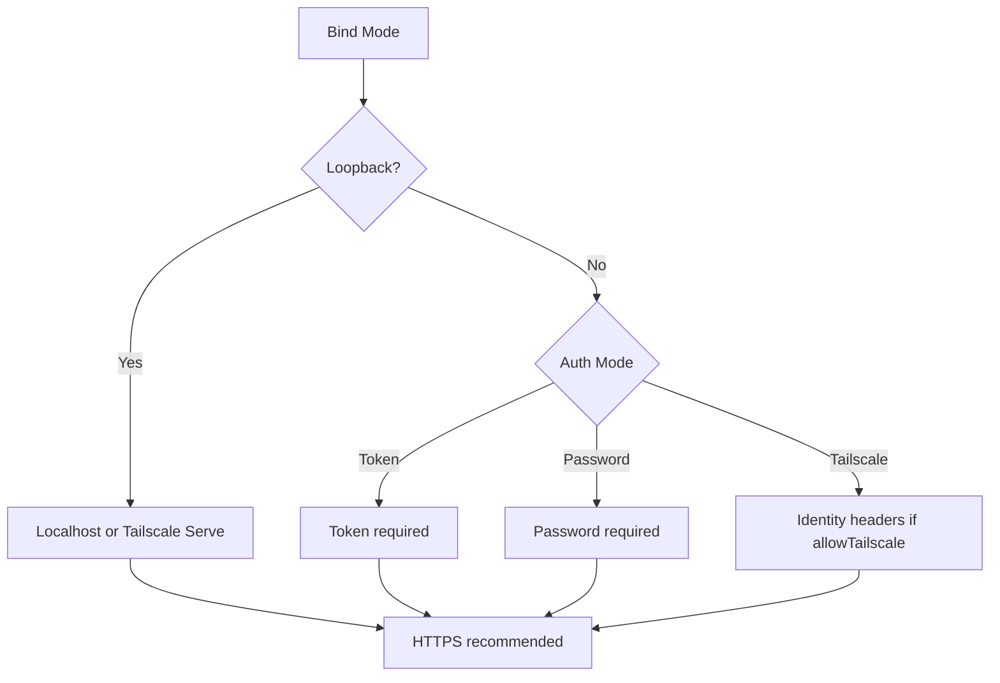
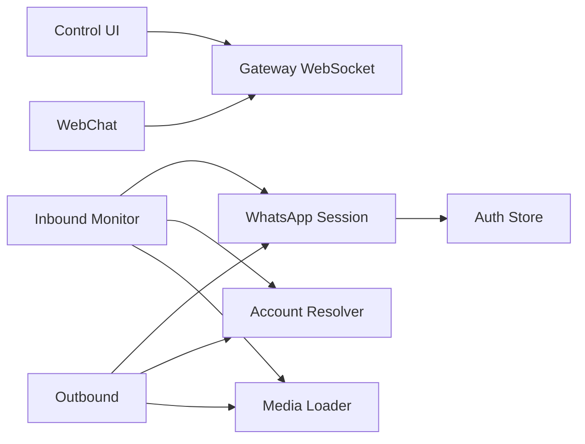

# Web Interface

<cite>
**Referenced Files in This Document**
- [docs/web/index.md](file://docs/web/index.md)
- [docs/web/dashboard.md](file://docs/web/dashboard.md)
- [docs/web/control-ui.md](file://docs/web/control-ui.md)
- [docs/web/webchat.md](file://docs/web/webchat.md)
- [src/web/session.ts](file://src/web/session.ts)
- [src/web/accounts.ts](file://src/web/accounts.ts)
- [src/web/auth-store.ts](file://src/web/auth-store.ts)
- [src/web/inbound/monitor.ts](file://src/web/inbound/monitor.ts)
- [src/web/outbound.ts](file://src/web/outbound.ts)
- [src/web/media.ts](file://src/web/media.ts)
- [src/web/login.ts](file://src/web/login.ts)
</cite>

## Table of Contents
1. [Introduction](#introduction)
2. [Project Structure](#project-structure)
3. [Core Components](#core-components)
4. [Architecture Overview](#architecture-overview)
5. [Detailed Component Analysis](#detailed-component-analysis)
6. [Dependency Analysis](#dependency-analysis)
7. [Performance Considerations](#performance-considerations)
8. [Troubleshooting Guide](#troubleshooting-guide)
9. [Conclusion](#conclusion)
10. [Appendices](#appendices)

## Introduction
This document describes the web-based control panel and dashboard for OpenClaw, including the browser Control UI, dashboard access and authentication, and WebChat capabilities. It explains the web interface architecture, authentication mechanisms, security considerations, dashboard components (session management, channel monitoring, system status), WebChat implementation, real-time messaging, and user interaction patterns. It also covers customization, theming, branding, deployment and hosting considerations, performance optimization, and troubleshooting guidance for common web interface issues.

## Project Structure
The web interface surface is primarily served by the Gateway on the same port as the WebSocket. The browser Control UI is a Vite + Lit SPA that communicates directly with the Gateway WebSocket. The WebChat UI (native macOS/iOS) also connects to the same Gateway WebSocket. Channel-specific flows (e.g., WhatsApp Web) are handled by the web session layer and inbound/outbound processors.

**Diagram sources**
- [docs/web/index.md](file://docs/web/index.md#L11-L17)
- [docs/web/control-ui.md](file://docs/web/control-ui.md#L11-L16)
- [src/web/inbound/monitor.ts](file://src/web/inbound/monitor.ts#L40-L43)
- [src/web/outbound.ts](file://src/web/outbound.ts#L32-L39)
- [src/web/session.ts](file://src/web/session.ts#L90-L161)
- [src/web/accounts.ts](file://src/web/accounts.ts#L116-L149)
- [src/web/auth-store.ts](file://src/web/auth-store.ts#L82-L102)

**Section sources**
- [docs/web/index.md](file://docs/web/index.md#L9-L17)
- [docs/web/control-ui.md](file://docs/web/control-ui.md#L9-L16)

## Core Components
- Browser Control UI: Single-page application served by the Gateway, communicating directly with the Gateway WebSocket. Capabilities include chat, channels, instances, sessions, cron jobs, skills, nodes, exec approvals, configuration editing, debugging, logs, and updates.
- WebChat: Native iOS/macOS chat UI connecting to the same Gateway WebSocket; deterministic routing ensures replies return to WebChat.
- Channel Web Layer: WhatsApp Web session management, inbound monitoring, outbound sending, media handling, and credential persistence.
- Authentication and Security: Token/password-based auth for WebSocket and HTTP, optional Tailscale identity headers, device pairing, and secure context requirements.

**Section sources**
- [docs/web/control-ui.md](file://docs/web/control-ui.md#L72-L90)
- [docs/web/webchat.md](file://docs/web/webchat.md#L10-L16)
- [src/web/session.ts](file://src/web/session.ts#L90-L161)
- [src/web/inbound/monitor.ts](file://src/web/inbound/monitor.ts#L25-L47)
- [src/web/outbound.ts](file://src/web/outbound.ts#L17-L31)

## Architecture Overview
The Gateway exposes:
- A static HTTP server serving the Control UI and optional webhooks.
- A WebSocket server on the same port for real-time chat and control operations.
- A channel layer for WhatsApp Web, including session lifecycle, inbound message processing, outbound sending, and media handling.

**Diagram sources**
- [docs/web/control-ui.md](file://docs/web/control-ui.md#L26-L31)
- [src/web/inbound/monitor.ts](file://src/web/inbound/monitor.ts#L397-L426)
- [src/web/outbound.ts](file://src/web/outbound.ts#L17-L31)
- [src/web/session.ts](file://src/web/session.ts#L163-L184)

## Detailed Component Analysis

### Browser Control UI
- Purpose: Admin surface for chat, configuration, channels, sessions, cron, skills, nodes, exec approvals, debugging, logs, and updates.
- Authentication: Provided during WebSocket handshake via token or password; settings panel stores token per tab and selected gateway URL; passwords are not persisted.
- Device Pairing: First connection from a new device requires explicit approval; local connections are auto-approved.
- Localization: First-load localization based on browser locale; selectable language saved in browser storage.
- Access modes: Localhost, Tailscale Serve (HTTPS), Tailnet bind with token, or SSH tunnel; HTTPS recommended to avoid insecure context restrictions.
- Build and hosting: Static files served from dist/control-ui; optional absolute base path; dev server can target a remote Gateway.

**Diagram sources**
- [docs/web/control-ui.md](file://docs/web/control-ui.md#L118-L153)
- [docs/web/control-ui.md](file://docs/web/control-ui.md#L33-L62)

**Section sources**
- [docs/web/control-ui.md](file://docs/web/control-ui.md#L18-L31)
- [docs/web/control-ui.md](file://docs/web/control-ui.md#L118-L153)
- [docs/web/control-ui.md](file://docs/web/control-ui.md#L154-L194)
- [docs/web/control-ui.md](file://docs/web/control-ui.md#L196-L217)

### Dashboard (Control UI) Access and Authentication
- Default URL: http://<host>:18789/ (basePath optional).
- Admin surface: Requires authentication; dashboard URL tokens are kept in sessionStorage and stripped from the URL after load.
- Recommended access: Localhost, Tailscale Serve, or SSH tunnel; avoid public exposure.
- Token basics: Token from gateway.auth.token or OPENCLAW_GATEWAY_TOKEN; CLI can pass token via URL fragment for one-time bootstrap; SecretRef-managed tokens are handled securely.

**Diagram sources**
- [docs/web/dashboard.md](file://docs/web/dashboard.md#L31-L44)
- [docs/web/dashboard.md](file://docs/web/dashboard.md#L45-L53)

**Section sources**
- [docs/web/dashboard.md](file://docs/web/dashboard.md#L10-L29)
- [docs/web/dashboard.md](file://docs/web/dashboard.md#L37-L44)

### WebChat Implementation and Real-Time Messaging
- Status: Native iOS/macOS chat UI connects directly to the Gateway WebSocket.
- Behavior: Uses chat.history, chat.send, chat.inject; history bounded by Gateway; aborted runs preserve partial assistant output; if Gateway unreachable, WebChat is read-only.
- Routing: Replies deterministically return to WebChat.

**Diagram sources**
- [docs/web/webchat.md](file://docs/web/webchat.md#L24-L32)
- [src/web/inbound/monitor.ts](file://src/web/inbound/monitor.ts#L397-L426)
- [src/web/outbound.ts](file://src/web/outbound.ts#L17-L31)

**Section sources**
- [docs/web/webchat.md](file://docs/web/webchat.md#L10-L16)
- [docs/web/webchat.md](file://docs/web/webchat.md#L24-L32)

### Channel Monitoring and Session Management (WhatsApp Web)
- Session lifecycle: Creates Baileys socket with multi-file auth state, prints QR when needed, handles connection updates, and saves credentials with backups.
- Inbound monitoring: Normalizes messages, enforces access control, marks read receipts, debounces bursts, downloads media, and emits enriched inbound messages.
- Outbound sending: Converts markdown, resolves JIDs, loads media with SSRF and local path safeguards, composes typing indicators, and sends messages/polls/reactions.
- Accounts and policies: Resolves per-account configuration (e.g., allowFrom/group policies), media limits, and chunking options.

**Diagram sources**
- [src/web/session.ts](file://src/web/session.ts#L90-L161)
- [src/web/inbound/monitor.ts](file://src/web/inbound/monitor.ts#L25-L47)
- [src/web/outbound.ts](file://src/web/outbound.ts#L17-L31)
- [src/web/accounts.ts](file://src/web/accounts.ts#L116-L149)
- [src/web/auth-store.ts](file://src/web/auth-store.ts#L82-L102)

**Section sources**
- [src/web/session.ts](file://src/web/session.ts#L90-L161)
- [src/web/inbound/monitor.ts](file://src/web/inbound/monitor.ts#L167-L237)
- [src/web/outbound.ts](file://src/web/outbound.ts#L17-L31)
- [src/web/accounts.ts](file://src/web/accounts.ts#L116-L149)
- [src/web/auth-store.ts](file://src/web/auth-store.ts#L82-L102)

### Authentication Mechanisms and Security
- Default auth: Required by default (token/password or Tailscale identity headers).
- Tailscale Serve: Identity headers can satisfy Control UI/WebSocket auth when allowTailscale is true; HTTP API endpoints still require token/password.
- Device pairing: Required for new devices; local connections auto-approved; each browser profile generates a unique device ID.
- Secure context: Plain HTTP blocks WebCrypto; HTTPS (Serve) or localhost recommended.
- Origins: Non-loopback deployments must set allowedOrigins explicitly; Host-header fallback is dangerous.

**Diagram sources**
- [docs/web/index.md](file://docs/web/index.md#L96-L113)
- [docs/web/control-ui.md](file://docs/web/control-ui.md#L118-L153)

**Section sources**
- [docs/web/index.md](file://docs/web/index.md#L96-L113)
- [docs/web/control-ui.md](file://docs/web/control-ui.md#L33-L62)
- [docs/web/control-ui.md](file://docs/web/control-ui.md#L154-L194)

### Web Interface Customization, Theming, and Branding
- Language support: First-load localization based on browser locale; selectable language saved in browser storage; non-English translations are lazy-loaded.
- Base path: Optional basePath for UI and webhooks; absolute base path supported for builds.
- Branding: Not explicitly documented in the referenced files; branding is typically controlled via UI build assets and configuration.

**Section sources**
- [docs/web/control-ui.md](file://docs/web/control-ui.md#L63-L71)
- [docs/web/index.md](file://docs/web/index.md#L24-L35)
- [docs/web/index.md](file://docs/web/index.md#L114-L121)

### Deployment, Hosting, and Performance Optimization
- Serving: Static UI from dist/control-ui; optional basePath; dev server can target remote Gateway.
- Remote access: SSH tunnel or Tailscale; HTTPS recommended.
- Performance: Media optimization for images; capped fetch sizes; debounced inbound handling; bounded chat history; compressed payloads where applicable.

**Section sources**
- [docs/web/index.md](file://docs/web/index.md#L114-L121)
- [docs/web/control-ui.md](file://docs/web/control-ui.md#L196-L217)
- [src/web/media.ts](file://src/web/media.ts#L233-L402)
- [src/web/inbound/monitor.ts](file://src/web/inbound/monitor.ts#L70-L114)

## Dependency Analysis
The web interface components exhibit clear separation of concerns:
- UI depends on Gateway WebSocket for all operations.
- Channel layer depends on session management and account resolution.
- Inbound and outbound flows share common media handling and JID resolution.

**Diagram sources**
- [src/web/inbound/monitor.ts](file://src/web/inbound/monitor.ts#L40-L43)
- [src/web/outbound.ts](file://src/web/outbound.ts#L32-L39)
- [src/web/session.ts](file://src/web/session.ts#L90-L161)
- [src/web/accounts.ts](file://src/web/accounts.ts#L116-L149)
- [src/web/auth-store.ts](file://src/web/auth-store.ts#L82-L102)
- [src/web/media.ts](file://src/web/media.ts#L404-L413)

**Section sources**
- [src/web/inbound/monitor.ts](file://src/web/inbound/monitor.ts#L40-L47)
- [src/web/outbound.ts](file://src/web/outbound.ts#L17-L31)
- [src/web/session.ts](file://src/web/session.ts#L90-L161)
- [src/web/accounts.ts](file://src/web/accounts.ts#L116-L149)
- [src/web/auth-store.ts](file://src/web/auth-store.ts#L82-L102)
- [src/web/media.ts](file://src/web/media.ts#L404-L413)

## Performance Considerations
- Media handling: Images are optimized and resized to fit platform limits; GIFs and PNGs are treated specially; fetch caps prevent excessive memory usage.
- Debouncing: Rapid inbound messages from the same sender are batched to reduce processing overhead.
- History bounds: Chat history responses are truncated to maintain UI responsiveness.
- Logging: Verbose logging can be enabled for diagnostics; otherwise minimal overhead.

[No sources needed since this section provides general guidance]

## Troubleshooting Guide
- Unauthorized/1008: Ensure Gateway is reachable; retrieve or supply token from gateway.auth.token or OPENCLAW_GATEWAY_TOKEN; if SecretRef-managed, resolve externally or export token in shell.
- Plain HTTP blocking: Use HTTPS (Tailscale Serve) or open locally; insecure context blocks WebCrypto.
- Device pairing required: Use CLI to list and approve pending requests; local connections auto-approved.
- Login issues (WhatsApp Web): Session logged out clears cached web session; re-run login and scan QR; restarts with specific code handled with retry.

**Section sources**
- [docs/web/dashboard.md](file://docs/web/dashboard.md#L45-L53)
- [docs/web/control-ui.md](file://docs/web/control-ui.md#L154-L194)
- [src/web/login.ts](file://src/web/login.ts#L52-L67)
- [src/web/session.ts](file://src/web/session.ts#L134-L146)

## Conclusion
The OpenClaw web interface provides a powerful admin surface via the browser Control UI and a native WebChat experience, both connecting to the same Gateway WebSocket. Robust authentication, device pairing, and Tailscale integration ensure secure access, while the channel layer offers reliable WhatsApp Web connectivity with strong safeguards for media and file access. Proper deployment practices, secure contexts, and performance-conscious defaults make the web interface suitable for both local and remote administration.

[No sources needed since this section summarizes without analyzing specific files]

## Appendices

### Appendix A: Web Surfaces and Bind Modes
- Integrated Serve (recommended): Keep Gateway on loopback and use Tailscale Serve proxy.
- Tailnet bind + token: Expose on tailnet with token/password.
- Public internet (Funnel): Requires password mode; use Tailscale Funnel.

**Section sources**
- [docs/web/index.md](file://docs/web/index.md#L37-L94)

### Appendix B: Configuration Reference (selected)
- gateway.controlUi.enabled/basePath
- gateway.auth.mode/token/password
- gateway.controlUi.allowedOrigins
- gateway.tailscale.mode
- gateway.bind/port

**Section sources**
- [docs/web/index.md](file://docs/web/index.md#L24-L35)
- [docs/web/index.md](file://docs/web/index.md#L96-L113)
- [docs/web/control-ui.md](file://docs/web/control-ui.md#L47-L62)