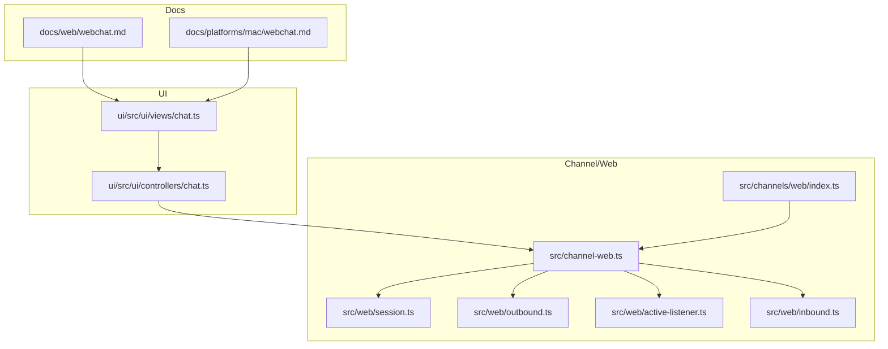
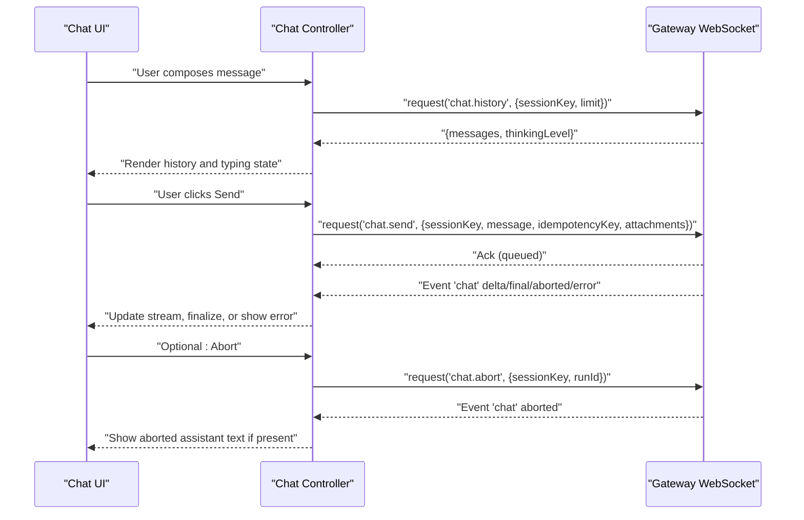
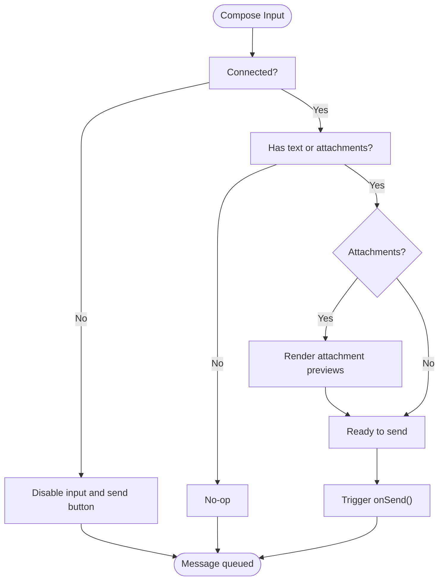
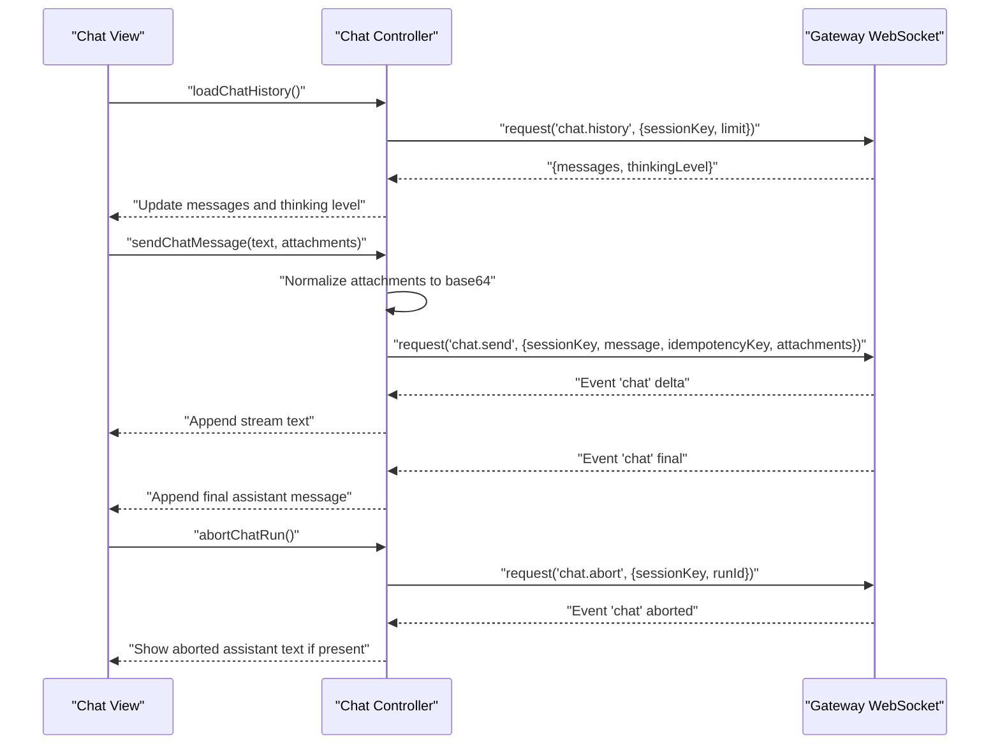
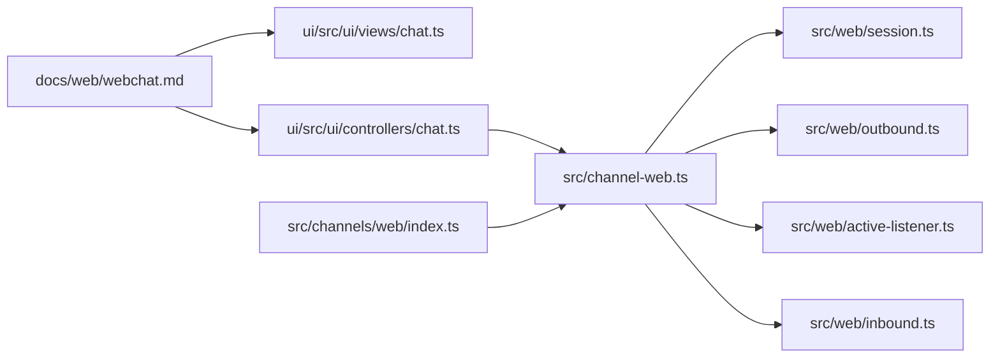

# WebChat Interface

<cite>
**Referenced Files in This Document**
- [docs/web/webchat.md](file://docs/web/webchat.md)
- [docs/platforms/mac/webchat.md](file://docs/platforms/mac/webchat.md)
- [src/web/session.ts](file://src/web/session.ts)
- [src/web/outbound.ts](file://src/web/outbound.ts)
- [src/web/active-listener.ts](file://src/web/active-listener.ts)
- [src/web/inbound.ts](file://src/web/inbound.ts)
- [src/channels/web/index.ts](file://src/channels/web/index.ts)
- [src/channel-web.ts](file://src/channel-web.ts)
- [ui/src/ui/views/chat.ts](file://ui/src/ui/views/chat.ts)
- [ui/src/ui/controllers/chat.ts](file://ui/src/ui/controllers/chat.ts)
- [src/gateway/test-helpers.server.ts](file://src/gateway/test-helpers.server.ts)
</cite>

## Table of Contents
1. [Introduction](#introduction)
2. [Project Structure](#project-structure)
3. [Core Components](#core-components)
4. [Architecture Overview](#architecture-overview)
5. [Detailed Component Analysis](#detailed-component-analysis)
6. [Dependency Analysis](#dependency-analysis)
7. [Performance Considerations](#performance-considerations)
8. [Troubleshooting Guide](#troubleshooting-guide)
9. [Security and Privacy](#security-and-privacy)
10. [Conclusion](#conclusion)

## Introduction
This document describes the WebChat interface for OpenClaw, focusing on the web-based messaging capabilities and the real-time chat experience. It explains how the chat UI integrates with the Gateway WebSocket, how messages are composed and sent, how attachments are handled, and how conversations are managed. It also covers WebSocket connectivity, real-time updates, message synchronization, customization and accessibility, browser requirements, performance considerations, and security and privacy controls.

## Project Structure
The WebChat implementation spans documentation, UI rendering and logic, and backend channel integration:
- Documentation: overview and configuration guidance for WebChat and related topics.
- UI: chat view rendering, composition, attachment handling, and event orchestration.
- Controllers: chat state management, history loading, message sending, and event handling.
- Channel/Web: session lifecycle, outbound messaging, inbound monitoring, and active listener abstraction.



**Diagram sources**
- [docs/web/webchat.md](file://docs/web/webchat.md#L1-L62)
- [docs/platforms/mac/webchat.md](file://docs/platforms/mac/webchat.md#L1-L44)
- [ui/src/ui/views/chat.ts](file://ui/src/ui/views/chat.ts#L1-L637)
- [ui/src/ui/controllers/chat.ts](file://ui/src/ui/controllers/chat.ts#L1-L337)
- [src/channel-web.ts](file://src/channel-web.ts#L1-L34)
- [src/web/session.ts](file://src/web/session.ts#L1-L313)
- [src/web/outbound.ts](file://src/web/outbound.ts#L1-L195)
- [src/web/active-listener.ts](file://src/web/active-listener.ts#L1-L37)
- [src/web/inbound.ts](file://src/web/inbound.ts#L1-L5)
- [src/channels/web/index.ts](file://src/channels/web/index.ts#L1-L13)

**Section sources**
- [docs/web/webchat.md](file://docs/web/webchat.md#L1-L62)
- [docs/platforms/mac/webchat.md](file://docs/platforms/mac/webchat.md#L1-L44)
- [ui/src/ui/views/chat.ts](file://ui/src/ui/views/chat.ts#L1-L637)
- [ui/src/ui/controllers/chat.ts](file://ui/src/ui/controllers/chat.ts#L1-L337)
- [src/channel-web.ts](file://src/channel-web.ts#L1-L34)
- [src/web/session.ts](file://src/web/session.ts#L1-L313)
- [src/web/outbound.ts](file://src/web/outbound.ts#L1-L195)
- [src/web/active-listener.ts](file://src/web/active-listener.ts#L1-L37)
- [src/web/inbound.ts](file://src/web/inbound.ts#L1-L5)
- [src/channels/web/index.ts](file://src/channels/web/index.ts#L1-L13)

## Core Components
- Chat UI (Lit + TypeScript): renders messages, handles composition, attachment preview, and user actions.
- Chat controller: manages state, loads history, sends messages, and processes real-time events.
- Channel/Web integration: creates and maintains a WhatsApp Web session, exposes an Active Web Listener for sending and receiving.
- Gateway WebSocket: the transport for chat history, sending, aborting, injecting, and receiving events.

Key responsibilities:
- Composition and attachments: capture text input, manage image attachments, and convert to base64 previews.
- Real-time updates: stream assistant text deltas, finalize messages, handle aborts, and surface tool messages.
- Conversation management: maintain message groups, reading indicators, and queue notifications.

**Section sources**
- [ui/src/ui/views/chat.ts](file://ui/src/ui/views/chat.ts#L241-L481)
- [ui/src/ui/controllers/chat.ts](file://ui/src/ui/controllers/chat.ts#L30-L93)
- [src/web/session.ts](file://src/web/session.ts#L90-L161)
- [src/web/outbound.ts](file://src/web/outbound.ts#L17-L112)
- [src/web/active-listener.ts](file://src/web/active-listener.ts#L11-L29)
- [docs/web/webchat.md](file://docs/web/webchat.md#L24-L32)

## Architecture Overview
The WebChat UI communicates with the Gateway over WebSocket. The UI requests chat history, sends messages, aborts runs, and injects assistant notes. The Gateway routes messages to the appropriate channel (e.g., WhatsApp Web) and emits events back to the UI.



**Diagram sources**
- [ui/src/ui/views/chat.ts](file://ui/src/ui/views/chat.ts#L424-L478)
- [ui/src/ui/controllers/chat.ts](file://ui/src/ui/controllers/chat.ts#L66-L93)
- [ui/src/ui/controllers/chat.ts](file://ui/src/ui/controllers/chat.ts#L152-L243)
- [ui/src/ui/controllers/chat.ts](file://ui/src/ui/controllers/chat.ts#L245-L260)
- [ui/src/ui/controllers/chat.ts](file://ui/src/ui/controllers/chat.ts#L262-L336)
- [docs/web/webchat.md](file://docs/web/webchat.md#L24-L32)

## Detailed Component Analysis

### Chat UI Rendering and Interaction
The chat view renders:
- Message thread with grouping and separators.
- Streaming text segments interleaved with tool messages.
- Attachment previews with remove actions.
- Compose area with textarea auto-resize, Enter/Send behavior, and paste handling for images.
- Queue indicators, fallback/compaction notices, and focus mode toggle.

User interaction patterns:
- Press Enter to send (Shift+Enter for line break).
- Paste images to attach previews.
- Remove attachments before sending.
- Abort ongoing runs or start new sessions.



**Diagram sources**
- [ui/src/ui/views/chat.ts](file://ui/src/ui/views/chat.ts#L424-L478)
- [ui/src/ui/views/chat.ts](file://ui/src/ui/views/chat.ts#L166-L205)

**Section sources**
- [ui/src/ui/views/chat.ts](file://ui/src/ui/views/chat.ts#L241-L481)
- [ui/src/ui/views/chat.ts](file://ui/src/ui/views/chat.ts#L166-L205)

### Chat Controller: State, History, Sending, and Events
The controller manages:
- Loading chat history via WebSocket method and filtering silent replies.
- Building user messages with text and image content blocks.
- Converting attachment data URLs to base64 for the API.
- Tracking run IDs, streaming segments, and timestamps.
- Handling real-time events: delta, final, aborted, and error.



**Diagram sources**
- [ui/src/ui/controllers/chat.ts](file://ui/src/ui/controllers/chat.ts#L66-L93)
- [ui/src/ui/controllers/chat.ts](file://ui/src/ui/controllers/chat.ts#L152-L243)
- [ui/src/ui/controllers/chat.ts](file://ui/src/ui/controllers/chat.ts#L245-L260)
- [ui/src/ui/controllers/chat.ts](file://ui/src/ui/controllers/chat.ts#L262-L336)

**Section sources**
- [ui/src/ui/controllers/chat.ts](file://ui/src/ui/controllers/chat.ts#L30-L93)
- [ui/src/ui/controllers/chat.ts](file://ui/src/ui/controllers/chat.ts#L152-L243)
- [ui/src/ui/controllers/chat.ts](file://ui/src/ui/controllers/chat.ts#L245-L260)
- [ui/src/ui/controllers/chat.ts](file://ui/src/ui/controllers/chat.ts#L262-L336)

### Channel/Web Integration: Session, Outbound, and Active Listener
The Channel/Web module provides:
- Session creation and connection management for WhatsApp Web.
- Outbound message sending with media handling and Markdown conversion.
- An Active Web Listener abstraction for sending messages, reactions, and polls, and for composing indicators.

```mermaid
classDiagram
class ActiveWebListener {
+sendMessage(to, text, mediaBuffer?, mediaType?, options?) Promise~{messageId}~
+sendPoll(to, poll) Promise~{messageId}~
+sendReaction(chatJid, messageId, emoji, fromMe, participant?) Promise~void~
+sendComposingTo(to) Promise~void~
+close?() Promise~void~
}
class WebOutbound {
+sendMessageWhatsApp(to, body, options) Promise~{messageId,toJid}~
+sendReactionWhatsApp(chatJid, messageId, emoji, options) Promise~void~
+sendPollWhatsApp(to, poll, options) Promise~{messageId,toJid}~
}
class WebSession {
+createWaSocket(printQr, verbose, opts) Promise~socket~
+waitForWaConnection(sock) Promise~void~
+logoutWeb() void
+logWebSelfId() void
+webAuthExists() boolean
}
ActiveWebListener <.. WebOutbound : "used by"
WebOutbound ..> WebSession : "requires active listener"
```

**Diagram sources**
- [src/web/active-listener.ts](file://src/web/active-listener.ts#L11-L29)
- [src/web/outbound.ts](file://src/web/outbound.ts#L17-L112)
- [src/web/session.ts](file://src/web/session.ts#L90-L161)

**Section sources**
- [src/web/active-listener.ts](file://src/web/active-listener.ts#L1-L37)
- [src/web/outbound.ts](file://src/web/outbound.ts#L1-L195)
- [src/web/session.ts](file://src/web/session.ts#L1-L313)
- [src/channels/web/index.ts](file://src/channels/web/index.ts#L1-L13)
- [src/channel-web.ts](file://src/channel-web.ts#L1-L34)

### Inbound Monitoring and Deduplication
Inbound monitoring extracts text, media placeholders, and location data from incoming messages and deduplicates repeated events to avoid redundant UI updates.

**Section sources**
- [src/web/inbound.ts](file://src/web/inbound.ts#L1-L5)

### WebSocket Client Test Helper
A helper demonstrates how a WebSocket client connects to the Gateway with origin headers and validates handshake responses, useful for testing and understanding client behavior.

**Section sources**
- [src/gateway/test-helpers.server.ts](file://src/gateway/test-helpers.server.ts#L668-L704)

## Dependency Analysis
The WebChat stack depends on:
- UI rendering and controller logic for user interaction and state.
- Channel/Web for session management and outbound operations.
- Gateway WebSocket for transport and event-driven updates.



**Diagram sources**
- [docs/web/webchat.md](file://docs/web/webchat.md#L1-L62)
- [ui/src/ui/views/chat.ts](file://ui/src/ui/views/chat.ts#L1-L637)
- [ui/src/ui/controllers/chat.ts](file://ui/src/ui/controllers/chat.ts#L1-L337)
- [src/channel-web.ts](file://src/channel-web.ts#L1-L34)
- [src/web/session.ts](file://src/web/session.ts#L1-L313)
- [src/web/outbound.ts](file://src/web/outbound.ts#L1-L195)
- [src/web/active-listener.ts](file://src/web/active-listener.ts#L1-L37)
- [src/web/inbound.ts](file://src/web/inbound.ts#L1-L5)
- [src/channels/web/index.ts](file://src/channels/web/index.ts#L1-L13)

**Section sources**
- [docs/web/webchat.md](file://docs/web/webchat.md#L1-L62)
- [ui/src/ui/views/chat.ts](file://ui/src/ui/views/chat.ts#L1-L637)
- [ui/src/ui/controllers/chat.ts](file://ui/src/ui/controllers/chat.ts#L1-L337)
- [src/channel-web.ts](file://src/channel-web.ts#L1-L34)
- [src/web/session.ts](file://src/web/session.ts#L1-L313)
- [src/web/outbound.ts](file://src/web/outbound.ts#L1-L195)
- [src/web/active-listener.ts](file://src/web/active-listener.ts#L1-L37)
- [src/web/inbound.ts](file://src/web/inbound.ts#L1-L5)
- [src/channels/web/index.ts](file://src/channels/web/index.ts#L1-L13)

## Performance Considerations
- History truncation: chat.history is bounded to improve stability and reduce payload sizes.
- Streaming deltas: UI appends incremental text to minimize re-renders and maintain responsiveness.
- Attachment previews: base64 previews are rendered locally; large images may impact memory and rendering performance.
- Tool message interleaving: ensures correct visual ordering without duplicating content.
- Gateway persistence: aborted partial assistant text may persist into history when buffered output exists.

[No sources needed since this section provides general guidance]

## Troubleshooting Guide
Common issues and remedies:
- Gateway unreachable: WebChat becomes read-only; verify gateway connectivity and authentication.
- Authentication failures: Ensure gateway auth is configured; token/password or trusted proxy settings may apply.
- No reply behavior: Silent replies are filtered client-side; confirm assistant output is not suppressed unintentionally.
- Attachment send failures: Verify base64 conversion and media limits; check media kinds and types supported by the channel.
- WebSocket handshake timeouts: Confirm origin header and client identity; use the provided test helper pattern to validate connections.

**Section sources**
- [docs/web/webchat.md](file://docs/web/webchat.md#L24-L32)
- [ui/src/ui/controllers/chat.ts](file://ui/src/ui/controllers/chat.ts#L9-L28)
- [ui/src/ui/controllers/chat.ts](file://ui/src/ui/controllers/chat.ts#L152-L243)
- [src/gateway/test-helpers.server.ts](file://src/gateway/test-helpers.server.ts#L668-L704)

## Security and Privacy
- Remote mode: The macOS/iOS SwiftUI chat UI connects directly to the Gateway WebSocket; remote mode tunnels the control port over SSH/Tailscale.
- Authentication: Gateway WebSocket requires authentication; options include token/password or trusted proxy auth for browser clients.
- Data plane: The UI uses chat.history, chat.send, chat.abort, chat.inject, and events chat, agent, presence, tick, health.
- Session isolation: Deterministic routing ensures replies return to WebChat; sessions can be switched within the UI.

**Section sources**
- [docs/platforms/mac/webchat.md](file://docs/platforms/mac/webchat.md#L14-L16)
- [docs/web/webchat.md](file://docs/web/webchat.md#L42-L61)

## Conclusion
OpenClaw’s WebChat delivers a responsive, real-time chat experience over the Gateway WebSocket. The UI integrates tightly with the chat controller to manage history, streaming, and events, while the Channel/Web stack provides robust session and outbound operations. With clear configuration options, security controls, and performance-conscious design, WebChat supports reliable messaging across local and remote deployments.