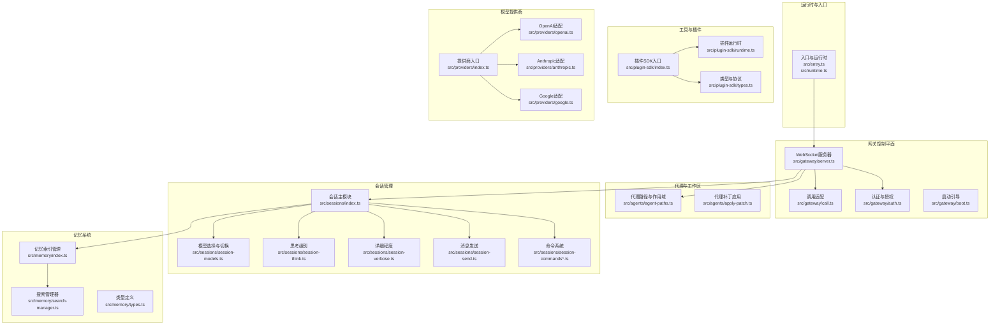
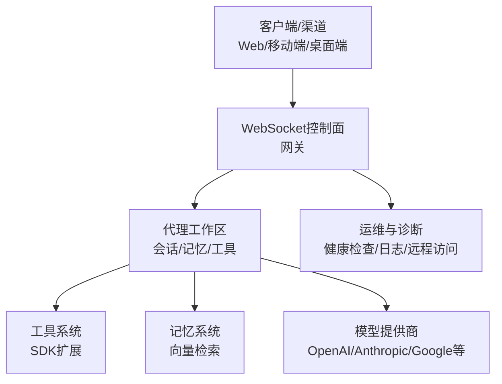
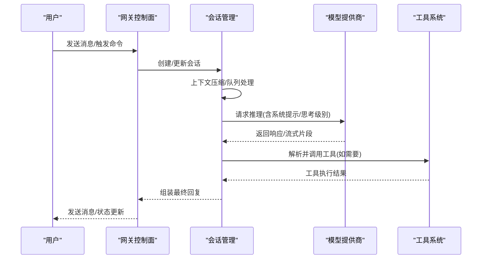
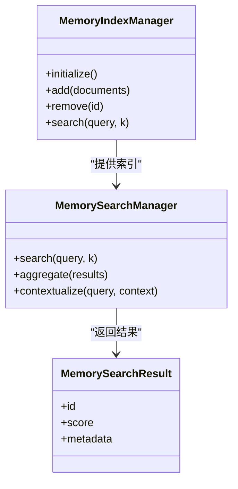
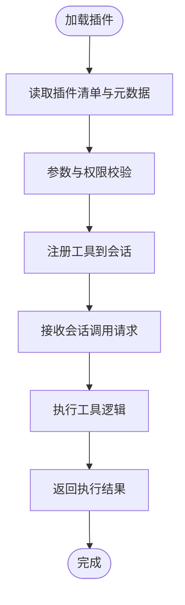
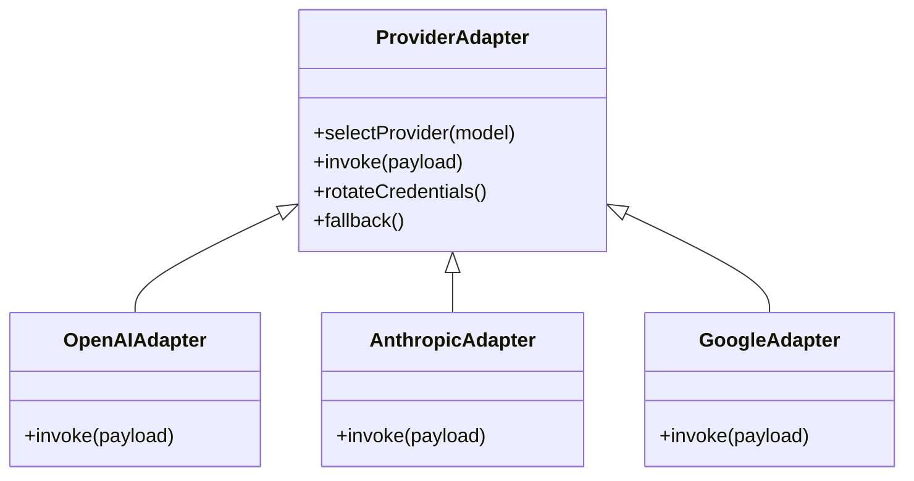
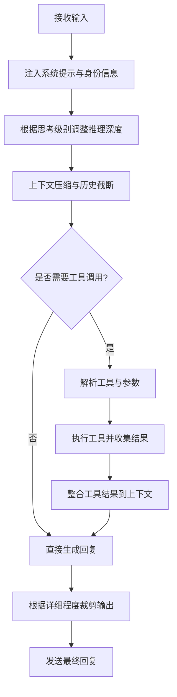
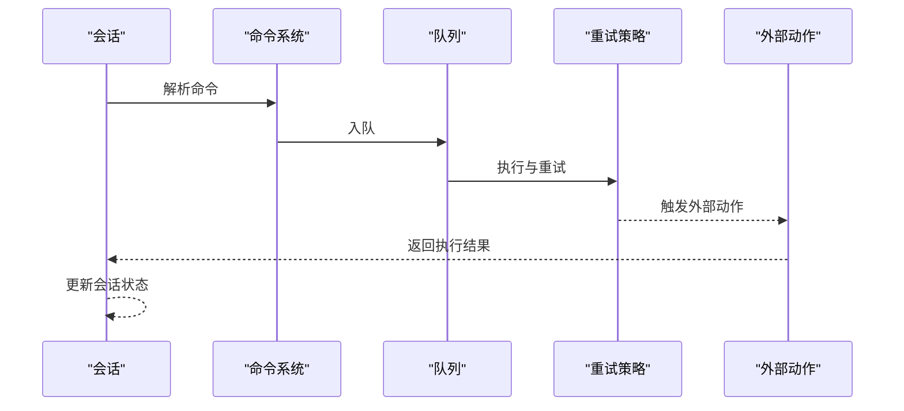
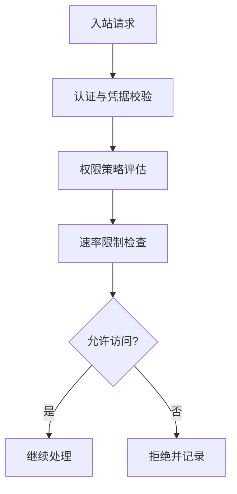
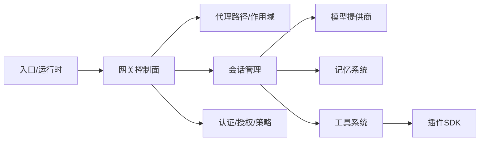

# AI代理平台

<cite>
**本文引用的文件**
- [README.md](file://README.md)
- [VISION.md](file://VISION.md)
- [AGENTS.md](file://AGENTS.md)
- [src/entry.ts](file://src/entry.ts)
- [src/runtime.ts](file://src/runtime.ts)
- [src/gateway/server.ts](file://src/gateway/server.ts)
- [src/gateway/call.ts](file://src/gateway/call.ts)
- [src/gateway/auth.ts](file://src/gateway/auth.ts)
- [src/gateway/auth-mode-policy.ts](file://src/gateway/auth-mode-policy.ts)
- [src/gateway/auth-rate-limit.ts](file://src/gateway/auth-rate-limit.ts)
- [src/gateway/auth-config-utils.ts](file://src/gateway/auth-config-utils.ts)
- [src/gateway/boot.ts](file://src/gateway/boot.ts)
- [src/gateway/canvas-capability.ts](file://src/gateway/canvas-capability.ts)
- [src/gateway/agent-prompt.ts](file://src/gateway/agent-prompt.ts)
- [src/gateway/assistant-identity.ts](file://src/gateway/assistant-identity.ts)
- [src/agents/agent-paths.ts](file://src/agents/agent-paths.ts)
- [src/agents/apply-patch.ts](file://src/agents/apply-patch.ts)
- [src/agents/auth-profiles/constants.ts](file://src/agents/auth-profiles/constants.ts)
- [src/agents/api-key-rotation.ts](file://src/agents/api-key-rotation.ts)
- [src/memory/index.ts](file://src/memory/index.ts)
- [src/memory/search-manager.ts](file://src/memory/search-manager.ts)
- [src/memory/types.ts](file://src/memory/types.ts)
- [src/plugin-sdk/index.ts](file://src/plugin-sdk/index.ts)
- [src/plugin-sdk/runtime.ts](file://src/plugin-sdk/runtime.ts)
- [src/plugin-sdk/types.ts](file://src/plugin-sdk/types.ts)
- [src/providers/index.ts](file://src/providers/index.ts)
- [src/providers/openai.ts](file://src/providers/openai.ts)
- [src/providers/anthropic.ts](file://src/providers/anthropic.ts)
- [src/providers/google.ts](file://src/providers/google.ts)
- [src/sessions/index.ts](file://src/sessions/index.ts)
- [src/sessions/session.ts](file://src/sessions/session.ts)
- [src/sessions/history.ts](file://src/sessions/history.ts)
- [src/sessions/pruning.ts](file://src/sessions/pruning.ts)
- [src/sessions/compaction.ts](file://src/sessions/compaction.ts)
- [src/sessions/queue.ts](file://src/sessions/queue.ts)
- [src/sessions/streaming.ts](file://src/sessions/streaming.ts)
- [src/sessions/retry.ts](file://src/sessions/retry.ts)
- [src/sessions/typing-indicators.ts](file://src/sessions/typing-indicators.ts)
- [src/sessions/usage-tracking.ts](file://src/sessions/usage-tracking.ts)
- [src/sessions/context.ts](file://src/sessions/context.ts)
- [src/sessions/messages.ts](file://src/sessions/messages.ts)
- [src/sessions/system-prompt.ts](file://src/sessions/system-prompt.ts)
- [src/sessions/session-tool.ts](file://src/sessions/session-tool.ts)
- [src/sessions/session-pruning.ts](file://src/sessions/session-pruning.ts)
- [src/sessions/session-workspace.ts](file://src/sessions/session-workspace.ts)
- [src/sessions/session-models.ts](file://src/sessions/session-models.ts)
- [src/sessions/session-think.ts](file://src/sessions/session-think.ts)
- [src/sessions/session-thinking-levels.ts](file://src/sessions/session-thinking-levels.ts)
- [src/sessions/session-verbose.ts](file://src/sessions/session-verbose.ts)
- [src/sessions/session-send.ts](file://src/sessions/session-send.ts)
- [src/sessions/session-commands.ts](file://src/sessions/session-commands.ts)
- [src/sessions/session-commands-internal.ts](file://src/sessions/session-commands-internal.ts)
- [src/sessions/session-commands-external.ts](file://src/sessions/session-commands-external.ts)
- [src/sessions/session-commands-internal-send.ts](file://src/sessions/session-commands-internal-send.ts)
- [src/sessions/session-commands-internal-history.ts](file://src/sessions/session-commands-internal-history.ts)
- [src/sessions/session-commands-internal-list.ts](file://src/sessions/session-commands-internal-list.ts)
- [src/sessions/session-commands-internal-spawn.ts](file://src/sessions/session-commands-internal-spawn.ts)
- [src/sessions/session-commands-internal-send.ts](file://src/sessions/session-commands-internal-send.ts)
- [src/sessions/session-commands-internal-history.ts](file://src/sessions/session-commands-internal-history.ts)
- [src/sessions/session-commands-internal-list.ts](file://src/sessions/session-commands-internal-list.ts)
- [src/sessions/session-commands-internal-spawn.ts](file://src/sessions/session-commands-internal-spawn.ts)
- [src/sessions/session-commands-external-send.ts](file://src/sessions/session-commands-external-send.ts)
- [src/sessions/session-commands-external-history.ts](file://src/sessions/session-commands-external-history.ts)
- [src/sessions/session-commands-external-list.ts](file://src/sessions/session-commands-external-list.ts)
- [src/sessions/session-commands-external-spawn.ts](file://src/sessions/session-commands-external-spawn.ts)
- [src/sessions/session-commands-external-send.ts](file://src/sessions/session-commands-external-send.ts)
- [src/sessions/session-commands-external-history.ts](file://src/sessions/session-commands-external-history.ts)
- [src/sessions/session-commands-external-list.ts](file://src/sessions/session-commands-external-list.ts)
- [src/sessions/session-commands-external-spawn.ts](file://src/sessions/session-commands-external-spawn.ts)
- [src/sessions/session-commands-internal-send.ts](file://src/sessions/session-commands-internal-send.ts)
- [src/sessions/session-commands-internal-history.ts](file://src/sessions/session-commands-internal-history.ts)
- [src/sessions/session-commands-internal-list.ts](file://src/sessions/session-commands-internal-list.ts)
- [src/sessions/session-commands-internal-spawn.ts](file://src/sessions/session-commands-internal-spawn.ts)
- [src/sessions/session-commands-external-send.ts](file://src/sessions/session-commands-external-send.ts)
- [src/sessions/session-commands-external-history.ts](file://src/sessions/session-commands-external-history.ts)
- [src/sessions/session-commands-external-list.ts](file://src/sessions/session-commands-external-list.ts)
- [src/sessions/session-commands-external-spawn.ts](file://src/sessions/session-commands-external-spawn.ts)
- [src/sessions/session-commands-internal-send.ts](file://src/sessions/session-commands-internal-send.ts)
- [src/sessions/session-commands-internal-history.ts](file://src/sessions/session-commands-internal-history.ts)
- [src/sessions/session-commands-internal-list.ts](file://src/sessions/session-commands-internal-list.ts)
- [src/sessions/session-commands-internal-spawn.ts](file://src/sessions/session-commands-internal-spawn.ts)
- [src/sessions/session-commands-external-send.ts](file://src/sessions/session-commands-external-send.ts)
- [src/sessions/session-commands-external-history.ts](file://src/sessions/session-commands-external-history.ts)
- [src/sessions/session-commands-external-list.ts](file://src/sessions/session-commands-external-list.ts)
- [src/sessions/session-commands-external-spawn.ts](file://src/sessions/session-commands-external-spawn.ts)
- [src/sessions/session-commands-internal-send.ts](file://src/sessions/session-commands-internal-send.ts)
- [src/sessions/session-commands-internal-history.ts](file://src/sessions/session-commands-internal-history.ts)
- [src/sessions/session-commands-internal-list.ts](file://src/sessions/session-commands-internal-list.ts)
- [src/sessions/session-commands-internal-spawn.ts](file://src/sessions/session-commands-internal-spawn.ts)
- [src/sessions/session-commands-external-send.ts](file://src/sessions/session-commands-external-send.ts)
- [src/sessions/session-commands-external-history.ts](file://src/sessions/session-commands-external-history.ts)
- [src/sessions/session-commands-external-list.ts](file://src/sessions/session-commands-external-list.ts)
- [src/sessions/session-commands-external-spawn.ts](file://src/sessions/session-commands-external-spawn.ts)
- [src/sessions/session-commands-internal-send.ts](file://src/sessions/session-commands-internal-send.ts)
- [src/sessions/session-commands-internal-history.ts](file://src/sessions/session-commands-internal-history.ts)
- [src/sessions/session-commands-internal-list.ts](file://src/sessions/session-commands-internal-list.ts)
- [src/sessions/session-commands-internal-spawn.ts](file://src/sessions/session-commands-internal-spawn.ts)
- [src/sessions/session-commands-external-send.ts](file://src/sessions/session-commands-external-send.ts)
- [src/sessions/session-commands-external-history.ts](file://src/sessions/session-commands-external-history.ts)
- [src/sessions/session-commands-external-list.ts](file://src/sessions/session-commands-external-list.ts)
- [src/sessions/session-commands-external-spawn.ts](file://src/sessions/session-commands-external-spawn.ts)
- [src/sessions/session-commands-internal-send.ts](file://src/sessions/session-commands-internal-send.ts)
- [src/sessions/session-commands-internal-history.ts](file://src/sessions/session-commands-internal-history.ts)
- [src/sessions/session-commands-internal-list.ts](file://src/sessions/session-commands-internal-list.ts)
- [src/sessions/session-commands-internal-spawn.ts](file://src/sessions/session-commands-internal-spawn.ts)
- [src/sessions/session-commands-external-send.ts](file://src/sessions/session-commands-external-send.ts)
- [src/sessions/session-commands-external-history.ts](file://src/sessions/session-commands-external-history.ts)
- [src/sessions/session-commands-external-list.ts](file://src/sessions/session-commands-external-list.ts)
- [src/sessions/session-commands-external-spawn.ts](file://src/sessions/session-commands-external-spawn.ts)
- [src/sessions/session-commands-internal-send.ts](file://src/sessions/session-commands-internal-send.ts)
- [src/sessions/session-commands-internal-history.ts](file://src/sessions/session-commands-internal-history.ts)
- [src/sessions/session-commands-internal-list.ts](file://src/sessions/session-commands-internal-list.ts)
- [src/sessions/session-commands-internal-spawn.ts](file://src/sessions/session-commands-internal-spawn.ts)
- [src/sessions/session-commands-external-send.ts](file://src/sessions/session-commands-external-send.ts)
- [src/sessions/session-commands-external-history.ts](file://src/sessions/session-commands-external-history.ts)
- [src/sessions/session-commands-external-list.ts](file://src/sessions/session-commands-external-list.ts)
- [src/sessions/session-commands-external-spawn.ts](file://src/sessions/session-commands-external-spawn.ts)
- [src/sessions/session-commands-internal-send.ts](file://src/sessions/session-commands-internal-send.ts)
- [src/sessions/session-commands-internal-history.ts](file://src/sessions/session-commands-internal-history.ts)
- [src/sessions/session-commands-internal-list.ts](file://src/sessions/session-commands-internal-list.ts)
-......
</cite>

## 目录
1. [简介](#简介)
2. [项目结构](#项目结构)
3. [核心组件](#核心组件)
4. [架构总览](#架构总览)
5. [详细组件分析](#详细组件分析)
6. [依赖关系分析](#依赖关系分析)
7. [性能考虑](#性能考虑)
8. [故障排除指南](#故障排除指南)
9. [结论](#结论)
10. [附录](#附录)

## 简介
本文件面向OpenClaw AI代理平台的技术文档，聚焦于代理系统的架构设计与实现细节，涵盖会话管理、记忆存储、工具调用、多模型提供商集成（OpenAI、Anthropic、Google等）、代理的思考与决策机制、行动执行流程、工具系统的扩展机制、最佳实践与性能优化建议以及故障排除指南。文档以仓库现有源码为依据，结合官方文档与规范，提供可操作的参考与指导。

## 项目结构
OpenClaw采用模块化与分层架构：入口与运行时在src目录下组织，网关作为控制平面通过WebSocket提供统一服务；代理围绕“会话-记忆-工具-模型”闭环构建；插件体系通过plugin-sdk扩展；多通道适配器覆盖主流即时通讯平台；内存子系统支持向量检索与搜索管理；providers抽象多家模型供应商；sessions模块提供完整的会话生命周期管理。

图表来源
- [src/entry.ts](file://src/entry.ts#L1-L200)
- [src/runtime.ts](file://src/runtime.ts#L1-L200)
- [src/gateway/server.ts](file://src/gateway/server.ts#L1-L200)
- [src/gateway/call.ts](file://src/gateway/call.ts#L1-L200)
- [src/gateway/auth.ts](file://src/gateway/auth.ts#L1-L200)
- [src/gateway/boot.ts](file://src/gateway/boot.ts#L1-L200)
- [src/agents/agent-paths.ts](file://src/agents/agent-paths.ts#L1-L200)
- [src/agents/apply-patch.ts](file://src/agents/apply-patch.ts#L1-L200)
- [src/sessions/index.ts](file://src/sessions/index.ts#L1-L200)
- [src/sessions/session-models.ts](file://src/sessions/session-models.ts#L1-L200)
- [src/sessions/session-think.ts](file://src/sessions/session-think.ts#L1-L200)
- [src/sessions/session-verbose.ts](file://src/sessions/session-verbose.ts#L1-L200)
- [src/sessions/session-send.ts](file://src/sessions/session-send.ts#L1-L200)
- [src/sessions/session-commands.ts](file://src/sessions/session-commands.ts#L1-L200)
- [src/memory/index.ts](file://src/memory/index.ts#L1-L12)
- [src/memory/search-manager.ts](file://src/memory/search-manager.ts#L1-L200)
- [src/memory/types.ts](file://src/memory/types.ts#L1-L200)
- [src/plugin-sdk/index.ts](file://src/plugin-sdk/index.ts#L1-L200)
- [src/plugin-sdk/runtime.ts](file://src/plugin-sdk/runtime.ts#L1-L200)
- [src/plugin-sdk/types.ts](file://src/plugin-sdk/types.ts#L1-L200)
- [src/providers/index.ts](file://src/providers/index.ts#L1-L200)
- [src/providers/openai.ts](file://src/providers/openai.ts#L1-L200)
- [src/providers/anthropic.ts](file://src/providers/anthropic.ts#L1-L200)
- [src/providers/google.ts](file://src/providers/google.ts#L1-L200)

章节来源
- [README.md](file://README.md#L185-L240)
- [VISION.md](file://VISION.md#L1-L111)
- [AGENTS.md](file://AGENTS.md#L42-L120)

## 核心组件
- 入口与运行时：负责加载配置、初始化运行环境与守护进程，协调各子系统启动。
- 网关控制平面：提供WebSocket控制面，承载会话、工具、事件与运维接口；包含认证、速率限制、权限策略与启动引导。
- 代理与工作区：管理代理路径、作用域与补丁应用，支撑多代理路由与隔离。
- 会话管理：提供完整的会话生命周期，包括模型选择、思考级别、详细程度、消息发送、命令系统与上下文管理。
- 记忆系统：抽象记忆索引与搜索管理，支持向量检索与结果聚合。
- 工具与插件：通过SDK暴露插件能力，支持扩展工具与节点。
- 模型提供商：统一适配多家模型供应商，支持凭据轮换与失败回退。

章节来源
- [src/entry.ts](file://src/entry.ts#L1-L200)
- [src/runtime.ts](file://src/runtime.ts#L1-L200)
- [src/gateway/server.ts](file://src/gateway/server.ts#L1-L200)
- [src/gateway/auth.ts](file://src/gateway/auth.ts#L1-L200)
- [src/agents/agent-paths.ts](file://src/agents/agent-paths.ts#L1-L200)
- [src/agents/apply-patch.ts](file://src/agents/apply-patch.ts#L1-L200)
- [src/sessions/index.ts](file://src/sessions/index.ts#L1-L200)
- [src/memory/index.ts](file://src/memory/index.ts#L1-L12)
- [src/plugin-sdk/index.ts](file://src/plugin-sdk/index.ts#L1-L200)
- [src/providers/index.ts](file://src/providers/index.ts#L1-L200)

## 架构总览
OpenClaw以“网关控制平面 + 多通道适配器 + 代理工作区 + 工具与记忆”的分层架构实现。网关作为单一WS控制平面，承载会话、工具、事件与运维；代理围绕会话进行思考、决策与行动；工具通过SDK扩展；记忆通过向量检索增强上下文；模型提供商通过统一适配层接入。

图表来源
- [README.md](file://README.md#L185-L240)
- [src/gateway/server.ts](file://src/gateway/server.ts#L1-L200)
- [src/sessions/index.ts](file://src/sessions/index.ts#L1-L200)
- [src/memory/index.ts](file://src/memory/index.ts#L1-L12)
- [src/plugin-sdk/index.ts](file://src/plugin-sdk/index.ts#L1-L200)
- [src/providers/index.ts](file://src/providers/index.ts#L1-L200)

## 详细组件分析

### 会话管理
会话是代理的核心载体，贯穿思考、决策与行动全过程。OpenClaw提供从创建、上下文压缩、队列处理到消息发送与命令系统的完整链路。

图表来源
- [src/sessions/index.ts](file://src/sessions/index.ts#L1-L200)
- [src/sessions/session-models.ts](file://src/sessions/session-models.ts#L1-L200)
- [src/sessions/session-think.ts](file://src/sessions/session-think.ts#L1-L200)
- [src/sessions/session-verbose.ts](file://src/sessions/session-verbose.ts#L1-L200)
- [src/sessions/session-send.ts](file://src/sessions/session-send.ts#L1-L200)
- [src/sessions/session-commands.ts](file://src/sessions/session-commands.ts#L1-L200)
- [src/providers/index.ts](file://src/providers/index.ts#L1-L200)

章节来源
- [src/sessions/index.ts](file://src/sessions/index.ts#L1-L200)
- [src/sessions/session-models.ts](file://src/sessions/session-models.ts#L1-L200)
- [src/sessions/session-think.ts](file://src/sessions/session-think.ts#L1-L200)
- [src/sessions/session-verbose.ts](file://src/sessions/session-verbose.ts#L1-L200)
- [src/sessions/session-send.ts](file://src/sessions/session-send.ts#L1-L200)
- [src/sessions/session-commands.ts](file://src/sessions/session-commands.ts#L1-L200)

### 记忆存储
记忆系统通过索引管理与搜索管理器实现向量检索与结果聚合，支持按主题或上下文快速召回相关信息，提升代理的长期对话与任务执行能力。

图表来源
- [src/memory/index.ts](file://src/memory/index.ts#L1-L12)
- [src/memory/search-manager.ts](file://src/memory/search-manager.ts#L1-L200)
- [src/memory/types.ts](file://src/memory/types.ts#L1-L200)

章节来源
- [src/memory/index.ts](file://src/memory/index.ts#L1-L12)
- [src/memory/search-manager.ts](file://src/memory/search-manager.ts#L1-L200)
- [src/memory/types.ts](file://src/memory/types.ts#L1-L200)

### 工具系统与扩展机制
工具系统通过SDK暴露统一接口，支持内置工具与自定义工具的开发与注册。插件运行时负责解析工具声明、参数校验与执行调度，并与会话上下文集成。

图表来源
- [src/plugin-sdk/index.ts](file://src/plugin-sdk/index.ts#L1-L200)
- [src/plugin-sdk/runtime.ts](file://src/plugin-sdk/runtime.ts#L1-L200)
- [src/plugin-sdk/types.ts](file://src/plugin-sdk/types.ts#L1-L200)

章节来源
- [src/plugin-sdk/index.ts](file://src/plugin-sdk/index.ts#L1-L200)
- [src/plugin-sdk/runtime.ts](file://src/plugin-sdk/runtime.ts#L1-L200)
- [src/plugin-sdk/types.ts](file://src/plugin-sdk/types.ts#L1-L200)

### 模型提供商集成
OpenClaw通过统一的提供商适配层对接多家模型供应商，支持凭据轮换与失败回退，确保稳定性与可用性。

图表来源
- [src/providers/index.ts](file://src/providers/index.ts#L1-L200)
- [src/providers/openai.ts](file://src/providers/openai.ts#L1-L200)
- [src/providers/anthropic.ts](file://src/providers/anthropic.ts#L1-L200)
- [src/providers/google.ts](file://src/providers/google.ts#L1-L200)

章节来源
- [src/providers/index.ts](file://src/providers/index.ts#L1-L200)
- [src/providers/openai.ts](file://src/providers/openai.ts#L1-L200)
- [src/providers/anthropic.ts](file://src/providers/anthropic.ts#L1-L200)
- [src/providers/google.ts](file://src/providers/google.ts#L1-L200)

### 代理思考过程与决策机制
代理的思考过程由“系统提示注入 + 思考级别 + 详细程度 + 上下文压缩 + 工具调用 + 结果整合”构成。思考级别影响推理深度与成本，详细程度控制输出粒度，上下文压缩与队列处理保障长程对话的稳定性。

图表来源
- [src/gateway/agent-prompt.ts](file://src/gateway/agent-prompt.ts#L1-L200)
- [src/gateway/assistant-identity.ts](file://src/gateway/assistant-identity.ts#L1-L200)
- [src/sessions/session-think.ts](file://src/sessions/session-think.ts#L1-L200)
- [src/sessions/session-verbose.ts](file://src/sessions/session-verbose.ts#L1-L200)
- [src/sessions/session-models.ts](file://src/sessions/session-models.ts#L1-L200)
- [src/sessions/session-commands.ts](file://src/sessions/session-commands.ts#L1-L200)

章节来源
- [src/gateway/agent-prompt.ts](file://src/gateway/agent-prompt.ts#L1-L200)
- [src/gateway/assistant-identity.ts](file://src/gateway/assistant-identity.ts#L1-L200)
- [src/sessions/session-think.ts](file://src/sessions/session-think.ts#L1-L200)
- [src/sessions/session-verbose.ts](file://src/sessions/session-verbose.ts#L1-L200)
- [src/sessions/session-models.ts](file://src/sessions/session-models.ts#L1-L200)
- [src/sessions/session-commands.ts](file://src/sessions/session-commands.ts#L1-L200)

### 行动执行流程
行动执行由会话命令系统驱动，支持内部与外部命令的分发与执行，结合队列与重试策略保证可靠性。

图表来源
- [src/sessions/session-commands.ts](file://src/sessions/session-commands.ts#L1-L200)
- [src/sessions/queue.ts](file://src/sessions/queue.ts#L1-L200)
- [src/sessions/retry.ts](file://src/sessions/retry.ts#L1-L200)
- [src/sessions/session-commands-internal-send.ts](file://src/sessions/session-commands-internal-send.ts#L1-L200)
- [src/sessions/session-commands-external-send.ts](file://src/sessions/session-commands-external-send.ts#L1-L200)

章节来源
- [src/sessions/session-commands.ts](file://src/sessions/session-commands.ts#L1-L200)
- [src/sessions/queue.ts](file://src/sessions/queue.ts#L1-L200)
- [src/sessions/retry.ts](file://src/sessions/retry.ts#L1-L200)
- [src/sessions/session-commands-internal-send.ts](file://src/sessions/session-commands-internal-send.ts#L1-L200)
- [src/sessions/session-commands-external-send.ts](file://src/sessions/session-commands-external-send.ts#L1-L200)

### 安全与认证
网关提供认证、授权、速率限制与权限策略，确保在多渠道与多代理场景下的安全边界与合规性。

图表来源
- [src/gateway/auth.ts](file://src/gateway/auth.ts#L1-L200)
- [src/gateway/auth-mode-policy.ts](file://src/gateway/auth-mode-policy.ts#L1-L200)
- [src/gateway/auth-rate-limit.ts](file://src/gateway/auth-rate-limit.ts#L1-L200)
- [src/gateway/auth-config-utils.ts](file://src/gateway/auth-config-utils.ts#L1-L200)

章节来源
- [src/gateway/auth.ts](file://src/gateway/auth.ts#L1-L200)
- [src/gateway/auth-mode-policy.ts](file://src/gateway/auth-mode-policy.ts#L1-L200)
- [src/gateway/auth-rate-limit.ts](file://src/gateway/auth-rate-limit.ts#L1-L200)
- [src/gateway/auth-config-utils.ts](file://src/gateway/auth-config-utils.ts#L1-L200)

## 依赖关系分析
OpenClaw的依赖呈现清晰的分层与弱耦合特征：入口与运行时依赖网关；网关依赖代理路径与会话；会话依赖模型、记忆与工具；工具依赖SDK；模型依赖提供商适配层。认证与策略贯穿控制面，确保跨模块的安全一致性。

图表来源
- [src/entry.ts](file://src/entry.ts#L1-L200)
- [src/runtime.ts](file://src/runtime.ts#L1-L200)
- [src/gateway/server.ts](file://src/gateway/server.ts#L1-L200)
- [src/gateway/auth.ts](file://src/gateway/auth.ts#L1-L200)
- [src/agents/agent-paths.ts](file://src/agents/agent-paths.ts#L1-L200)
- [src/sessions/index.ts](file://src/sessions/index.ts#L1-L200)
- [src/memory/index.ts](file://src/memory/index.ts#L1-L12)
- [src/plugin-sdk/index.ts](file://src/plugin-sdk/index.ts#L1-L200)
- [src/providers/index.ts](file://src/providers/index.ts#L1-L200)

章节来源
- [src/entry.ts](file://src/entry.ts#L1-L200)
- [src/runtime.ts](file://src/runtime.ts#L1-L200)
- [src/gateway/server.ts](file://src/gateway/server.ts#L1-L200)
- [src/gateway/auth.ts](file://src/gateway/auth.ts#L1-L200)
- [src/agents/agent-paths.ts](file://src/agents/agent-paths.ts#L1-L200)
- [src/sessions/index.ts](file://src/sessions/index.ts#L1-L200)
- [src/memory/index.ts](file://src/memory/index.ts#L1-L12)
- [src/plugin-sdk/index.ts](file://src/plugin-sdk/index.ts#L1-L200)
- [src/providers/index.ts](file://src/providers/index.ts#L1-L200)

## 性能考虑
- 会话上下文压缩与队列处理：通过上下文压缩与队列限流降低长程对话的延迟与资源占用。
- 流式输出与分块传输：在支持的渠道上采用流式输出与分块传输，改善用户体验与网络效率。
- 记忆检索优化：合理设置检索top-k与聚合策略，平衡召回质量与查询延迟。
- 工具调用批量化：对可并行的工具调用进行批量化执行，减少等待时间。
- 模型选择与缓存：优先使用高吞吐模型进行草稿生成，使用高精度模型进行最终确认；利用提示缓存与会话复用降低重复计算。
- 并发与资源限制：通过速率限制与资源配额控制并发，避免过载。

## 故障排除指南
- 网关健康检查：使用健康检查接口与日志定位连接、认证与授权问题。
- 会话状态排查：通过会话列表、历史与状态命令查看会话元数据与异常。
- 工具执行问题：检查工具清单、参数与权限，核对执行结果与错误日志。
- 记忆检索异常：验证索引完整性、向量维度与检索阈值。
- 模型调用失败：检查凭据轮换、配额与回退策略，确认提供商可用性。
- 安全策略误判：核对认证模式、速率限制与白名单配置。

章节来源
- [src/gateway/server.ts](file://src/gateway/server.ts#L1-L200)
- [src/sessions/session-commands.ts](file://src/sessions/session-commands.ts#L1-L200)
- [src/sessions/session-commands-internal-list.ts](file://src/sessions/session-commands-internal-list.ts#L1-L200)
- [src/sessions/session-commands-internal-history.ts](file://src/sessions/session-commands-internal-history.ts#L1-L200)
- [src/sessions/session-commands-external-list.ts](file://src/sessions/session-commands-external-list.ts#L1-L200)
- [src/sessions/session-commands-external-history.ts](file://src/sessions/session-commands-external-history.ts#L1-L200)
- [src/memory/search-manager.ts](file://src/memory/search-manager.ts#L1-L200)
- [src/providers/index.ts](file://src/providers/index.ts#L1-L200)
- [src/gateway/auth.ts](file://src/gateway/auth.ts#L1-L200)

## 结论
OpenClaw通过清晰的分层架构与模块化设计，实现了从会话管理、记忆存储到工具扩展与模型集成的完整代理闭环。其安全默认与可观测性设计，配合完善的命令系统与性能优化策略，为个人与团队提供了强大而可控的AI助理平台。建议在生产环境中遵循安全策略、性能优化与故障排除最佳实践，持续迭代以满足复杂场景需求。

## 附录
- 快速开始与安装：参见项目根README中的安装与入门指引。
- 配置参考：参见官方文档中的配置参考与示例。
- 安全与合规：参见安全指南与合规要求。
- 开发与贡献：参见贡献指南与代码风格规范。

章节来源
- [README.md](file://README.md#L50-L120)
- [VISION.md](file://VISION.md#L41-L111)
- [AGENTS.md](file://AGENTS.md#L172-L296)