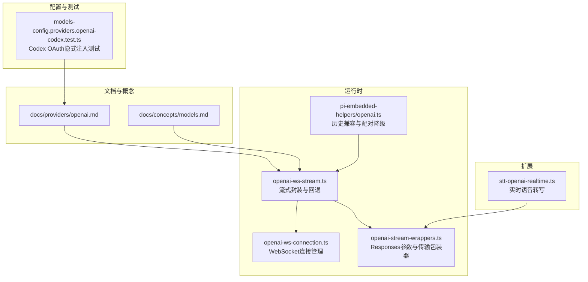
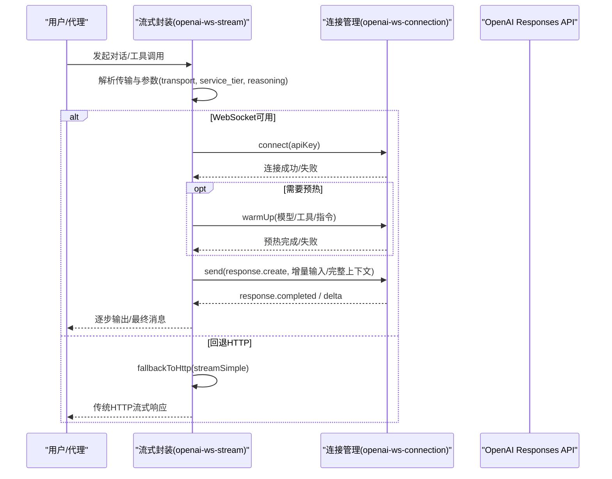
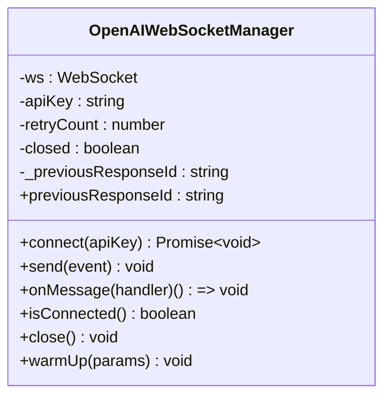
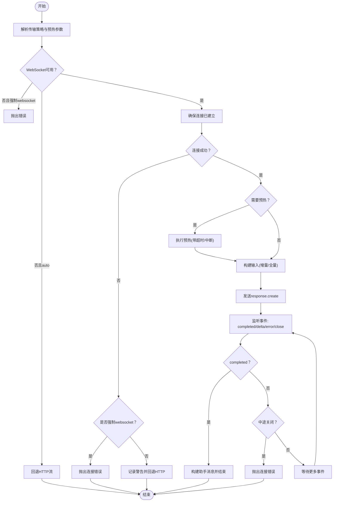
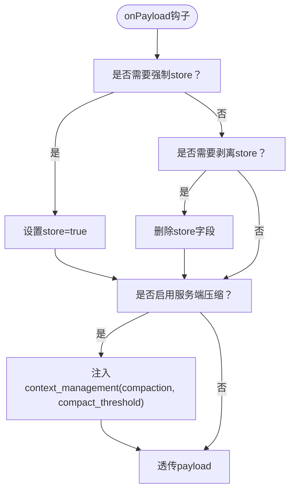
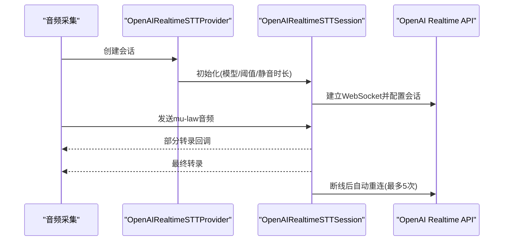
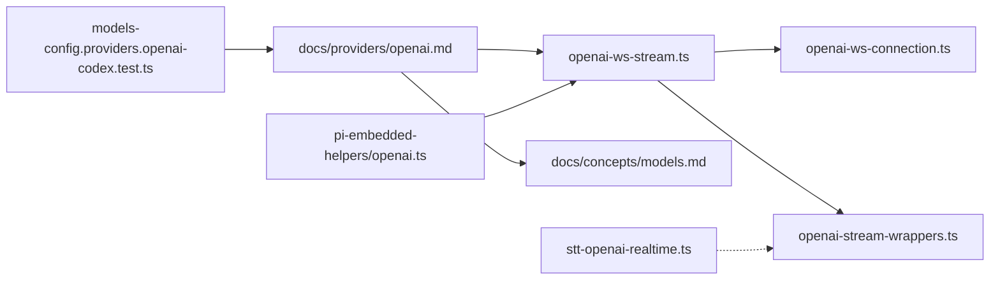

# OpenAI集成

<cite>
**本文引用的文件**
- [docs/providers/openai.md](file://docs/providers/openai.md)
- [src/agents/openai-ws-connection.ts](file://src/agents/openai-ws-connection.ts)
- [src/agents/openai-ws-stream.ts](file://src/agents/openai-ws-stream.ts)
- [src/agents/pi-embedded-helpers/openai.ts](file://src/agents/pi-embedded-helpers/openai.ts)
- [src/agents/pi-embedded-runner/openai-stream-wrappers.ts](file://src/agents/pi-embedded-runner/openai-stream-wrappers.ts)
- [extensions/voice-call/src/providers/stt-openai-realtime.ts](file://extensions/voice-call/src/providers/stt-openai-realtime.ts)
- [src/agents/models-config.providers.openai-codex.test.ts](file://src/agents/models-config.providers.openai-codex.test.ts)
- [docs/concepts/models.md](file://docs/concepts/models.md)
</cite>

## 目录
1. [简介](#简介)
2. [项目结构](#项目结构)
3. [核心组件](#核心组件)
4. [架构总览](#架构总览)
5. [详细组件分析](#详细组件分析)
6. [依赖关系分析](#依赖关系分析)
7. [性能考量](#性能考量)
8. [故障排除指南](#故障排除指南)
9. [结论](#结论)
10. [附录](#附录)

## 简介
本文件面向在OpenClaw中集成OpenAI模型提供商的开发者与运维人员，系统性说明OpenAI API的接入方式、认证与端点配置、模型选择与参数映射、流式响应处理、错误重试与回退策略，并提供可直接参考的配置片段路径与常见问题排查建议。内容覆盖：
- 认证方式：OpenAI API Key与Codex订阅（OAuth）
- 端点与传输：Responses API（WebSocket优先）、SSE回退、Realtime STT
- 模型与参数：模型系列、上下文窗口、生成参数（温度、最大令牌、工具选择、推理等）
- 流式与增量：WebSocket会话复用、增量输入、文本增量事件
- 错误处理与回退：自动重连、失败回退HTTP、会话清理
- 配置示例与排障：CLI安装、配置片段、常见限制与配额问题

## 项目结构
OpenAI集成涉及以下关键模块：
- 文档层：提供OpenAI使用说明、认证与传输默认行为
- 运行时层：WebSocket连接管理、流式封装、参数适配
- 语音扩展：OpenAI Realtime STT（音频转写）
- 配置与测试：模型配置合成、Codex OAuth隐式注入、模型策略

图表来源
- [docs/providers/openai.md](file://docs/providers/openai.md#L1-L246)
- [src/agents/openai-ws-connection.ts](file://src/agents/openai-ws-connection.ts#L1-L529)
- [src/agents/openai-ws-stream.ts](file://src/agents/openai-ws-stream.ts#L1-L754)
- [src/agents/pi-embedded-runner/openai-stream-wrappers.ts](file://src/agents/pi-embedded-runner/openai-stream-wrappers.ts#L1-L258)
- [src/agents/pi-embedded-helpers/openai.ts](file://src/agents/pi-embedded-helpers/openai.ts#L1-L271)
- [extensions/voice-call/src/providers/stt-openai-realtime.ts](file://extensions/voice-call/src/providers/stt-openai-realtime.ts#L1-L312)
- [src/agents/models-config.providers.openai-codex.test.ts](file://src/agents/models-config.providers.openai-codex.test.ts#L1-L157)

章节来源
- [docs/providers/openai.md](file://docs/providers/openai.md#L1-L246)
- [docs/concepts/models.md](file://docs/concepts/models.md#L1-L222)

## 核心组件
- 认证与端点
  - API Key：通过环境变量或配置注入，用于直接调用OpenAI Responses API
  - Codex订阅：通过OAuth获取访问令牌，使用Codex Responses API端点
- 传输与流式
  - 默认传输：WebSocket优先，自动回退SSE；可强制指定
  - WebSocket预热：首次连接时发送不生成输出的预热请求以降低首轮延迟
- 参数与模型
  - 支持的生成参数：温度、最大输出令牌、top_p、工具选择、推理努力/摘要
  - 服务等级（service_tier）：auto/default/flex/priority
  - 响应式服务端压缩：针对Responses API自动注入压缩提示
- 语音扩展
  - OpenAI Realtime STT：基于WebSocket的低延迟音频转写，内置VAD与部分结果回调

章节来源
- [docs/providers/openai.md](file://docs/providers/openai.md#L15-L167)
- [src/agents/openai-ws-connection.ts](file://src/agents/openai-ws-connection.ts#L246-L303)
- [src/agents/openai-ws-stream.ts](file://src/agents/openai-ws-stream.ts#L340-L363)
- [src/agents/pi-embedded-runner/openai-stream-wrappers.ts](file://src/agents/pi-embedded-runner/openai-stream-wrappers.ts#L159-L169)
- [extensions/voice-call/src/providers/stt-openai-realtime.ts](file://extensions/voice-call/src/providers/stt-openai-realtime.ts#L1-L312)

## 架构总览
下图展示OpenAI集成的整体数据流与控制流，从会话到消息转换、WebSocket连接、事件驱动与回退逻辑。

图表来源
- [src/agents/openai-ws-stream.ts](file://src/agents/openai-ws-stream.ts#L432-L726)
- [src/agents/openai-ws-connection.ts](file://src/agents/openai-ws-connection.ts#L320-L428)

章节来源
- [src/agents/openai-ws-stream.ts](file://src/agents/openai-ws-stream.ts#L432-L726)
- [src/agents/openai-ws-connection.ts](file://src/agents/openai-ws-connection.ts#L284-L529)

## 详细组件分析

### 组件A：WebSocket连接管理（OpenAI Responses API）
- 职责
  - 维护持久WebSocket连接，自动重连（最多5次，指数退避）
  - 记录上一次完成响应的ID，用于后续增量输入
  - 支持“预热”请求（generate=false）以预加载模型
  - 类型化事件定义，覆盖响应生命周期、文本增量、函数调用参数增量、速率限制更新与错误
- 关键接口
  - 连接/断开/发送/监听
  - 预热接口
- 错误处理
  - 初始连接失败：Promise拒绝；若无监听者则避免未处理错误
  - 自动重连：超过最大重试次数后发出错误事件
  - 消息解析失败与非预期形状：安全发出错误事件

图表来源
- [src/agents/openai-ws-connection.ts](file://src/agents/openai-ws-connection.ts#L284-L529)

章节来源
- [src/agents/openai-ws-connection.ts](file://src/agents/openai-ws-connection.ts#L1-L529)

### 组件B：流式封装与回退（WebSocket → HTTP）
- 职责
  - 为每个会话维护一个连接管理器实例
  - 增量输入：仅发送自上次调用以来新增的工具结果
  - 透明回退：WebSocket不可用或失败时回退至HTTP流
  - 会话清理：释放资源，防止泄漏
- 传输策略
  - transport: auto/sse/websocket
  - 强制websocket时，失败直接抛出；auto模式下失败回退HTTP并记录警告
- 参数透传
  - 温度、最大输出令牌、top_p、工具选择、推理努力/摘要
- 预热策略
  - 可配置开启/关闭；超时与中断处理

图表来源
- [src/agents/openai-ws-stream.ts](file://src/agents/openai-ws-stream.ts#L432-L726)

章节来源
- [src/agents/openai-ws-stream.ts](file://src/agents/openai-ws-stream.ts#L1-L754)

### 组件C：OpenAI参数与Responses包装器
- 功能
  - 服务等级（service_tier）解析与注入
  - Responses API的store字段强制/剥离策略
  - 服务端上下文压缩提示注入（context_management）
  - Codex与OpenAI默认传输策略（Codex默认auto；OpenAI默认auto且启用预热）
- 关键点
  - 对于直接OpenAI Responses（openai/*），默认启用预热
  - 对于openai/*且store不受支持的兼容场景，剥离store字段
  - 自动注入压缩阈值（默认70%上下文窗口或80000）

图表来源
- [src/agents/pi-embedded-runner/openai-stream-wrappers.ts](file://src/agents/pi-embedded-runner/openai-stream-wrappers.ts#L171-L204)

章节来源
- [src/agents/pi-embedded-runner/openai-stream-wrappers.ts](file://src/agents/pi-embedded-runner/openai-stream-wrappers.ts#L1-L258)

### 组件D：历史兼容与配对降级（OpenAI）
- 场景
  - 当OpenAI Responses API拒绝包含独立reasoning项的转录时，降级思维块以保持历史可用
  - 当工具调用与reasoning配对缺失时，去除function_call.id后缀以避免重放失败
- 目的
  - 提升历史可重放性与跨版本兼容性

章节来源
- [src/agents/pi-embedded-helpers/openai.ts](file://src/agents/pi-embedded-helpers/openai.ts#L82-L200)

### 组件E：OpenAI Realtime STT（语音转写）
- 特性
  - 使用mu-law音频（无需转换）
  - 内置服务器端VAD（静音检测）
  - 低延迟流式转写，支持部分转录回调
- 连接与重连
  - WebSocket连接，失败自动指数退避重连（最多5次）

图表来源
- [extensions/voice-call/src/providers/stt-openai-realtime.ts](file://extensions/voice-call/src/providers/stt-openai-realtime.ts#L105-L181)

章节来源
- [extensions/voice-call/src/providers/stt-openai-realtime.ts](file://extensions/voice-call/src/providers/stt-openai-realtime.ts#L1-L312)

## 依赖关系分析
- 文档与配置
  - 文档明确认证方式、端点与传输默认行为
  - 模型策略与别名、回退链路由概念文档统一规范
- 运行时耦合
  - 流式封装依赖连接管理器与参数包装器
  - 语音扩展独立于主流程，但共享Responses生态（同属OpenAI生态）
- 外部依赖
  - WebSocket库、OpenAI Responses与Realtime API端点
  - OAuth（Codex）与环境变量（API Key）

图表来源
- [docs/providers/openai.md](file://docs/providers/openai.md#L1-L246)
- [docs/concepts/models.md](file://docs/concepts/models.md#L1-L222)
- [src/agents/openai-ws-stream.ts](file://src/agents/openai-ws-stream.ts#L1-L754)
- [src/agents/openai-ws-connection.ts](file://src/agents/openai-ws-connection.ts#L1-L529)
- [src/agents/pi-embedded-runner/openai-stream-wrappers.ts](file://src/agents/pi-embedded-runner/openai-stream-wrappers.ts#L1-L258)
- [src/agents/pi-embedded-helpers/openai.ts](file://src/agents/pi-embedded-helpers/openai.ts#L1-L271)
- [extensions/voice-call/src/providers/stt-openai-realtime.ts](file://extensions/voice-call/src/providers/stt-openai-realtime.ts#L1-L312)
- [src/agents/models-config.providers.openai-codex.test.ts](file://src/agents/models-config.providers.openai-codex.test.ts#L1-L157)

章节来源
- [src/agents/openai-ws-stream.ts](file://src/agents/openai-ws-stream.ts#L1-L754)
- [src/agents/openai-ws-connection.ts](file://src/agents/openai-ws-connection.ts#L1-L529)
- [src/agents/pi-embedded-runner/openai-stream-wrappers.ts](file://src/agents/pi-embedded-runner/openai-stream-wrappers.ts#L1-L258)
- [src/agents/pi-embedded-helpers/openai.ts](file://src/agents/pi-embedded-helpers/openai.ts#L1-L271)
- [extensions/voice-call/src/providers/stt-openai-realtime.ts](file://extensions/voice-call/src/providers/stt-openai-realtime.ts#L1-L312)
- [src/agents/models-config.providers.openai-codex.test.ts](file://src/agents/models-config.providers.openai-codex.test.ts#L1-L157)

## 性能考量
- 传输选择
  - WebSocket优先可显著降低首轮延迟（预热机制）
  - auto模式在失败时回退SSE，保证可用性
- 增量输入
  - 仅发送新增工具结果，减少上下文大小与往返时间
- 服务端压缩
  - 在支持的Responses模型上自动注入压缩提示，减少存储与传输成本
- 重连与超时
  - 指数退避与超时控制避免资源占用与雪崩效应

## 故障排除指南
- 认证失败
  - API Key缺失或无效：检查环境变量与配置；确认API Key权限范围
  - Codex OAuth过期：通过onboard或models命令刷新；关注OAuth状态
- 连接与重连
  - WebSocket频繁断开：检查网络质量与防火墙；观察重连日志
  - 预热失败：确认模型与工具定义；缩短预热超时或禁用预热
- 回退与兼容
  - WebSocket不可用回退HTTP：确认transport配置；必要时强制SSE
  - Responses API报错（如store字段不支持）：启用剥离store或更换兼容模型
- 速率限制与配额
  - 速率限制更新事件：根据返回的剩余配额与重置时间调整并发
  - 配额不足：升级账户或减少并发；使用回退策略与缓存

章节来源
- [src/agents/openai-ws-connection.ts](file://src/agents/openai-ws-connection.ts#L430-L455)
- [src/agents/openai-ws-stream.ts](file://src/agents/openai-ws-stream.ts#L467-L501)
- [src/agents/pi-embedded-runner/openai-stream-wrappers.ts](file://src/agents/pi-embedded-runner/openai-stream-wrappers.ts#L85-L105)

## 结论
OpenAI集成在OpenClaw中通过“WebSocket优先、SSE回退”的传输策略与“预热+增量输入”的优化，实现了低延迟与高可用的多轮工具调用体验。配合服务端压缩、服务等级与参数透传，满足不同场景下的性能与成本需求。文档与测试共同保障了认证方式、端点与参数的正确性与稳定性。

## 附录

### 配置示例与片段路径
- API Key认证与模型选择
  - CLI安装与非交互式设置：参见
    - [docs/providers/openai.md](file://docs/providers/openai.md#L20-L26)
  - 配置片段（含环境变量与primary模型）：参见
    - [docs/providers/openai.md](file://docs/providers/openai.md#L28-L35)
- Codex订阅（OAuth）
  - CLI登录与wizard流程：参见
    - [docs/providers/openai.md](file://docs/providers/openai.md#L45-L53)
  - 配置片段（primary模型映射）：参见
    - [docs/providers/openai.md](file://docs/providers/openai.md#L55-L61)
- 传输与预热
  - 传输选项与默认行为：参见
    - [docs/providers/openai.md](file://docs/providers/openai.md#L72-L80)
  - 禁用/启用预热：参见
    - [docs/providers/openai.md](file://docs/providers/openai.md#L108-L142)
- 服务等级与Responses压缩
  - service_tier参数：参见
    - [docs/providers/openai.md](file://docs/providers/openai.md#L146-L166)
  - 服务端压缩开关与阈值：参见
    - [docs/providers/openai.md](file://docs/providers/openai.md#L168-L236)

章节来源
- [docs/providers/openai.md](file://docs/providers/openai.md#L15-L246)

### 模型与参数映射
- 模型选择与回退链路
  - 参考模型CLI与策略：参见
    - [docs/concepts/models.md](file://docs/concepts/models.md#L16-L30)
- 生成参数透传
  - 温度、最大输出令牌、top_p、工具选择、推理努力/摘要：参见
    - [src/agents/openai-ws-stream.ts](file://src/agents/openai-ws-stream.ts#L558-L590)
- 服务等级解析
  - service_tier解析与注入：参见
    - [src/agents/pi-embedded-runner/openai-stream-wrappers.ts](file://src/agents/pi-embedded-runner/openai-stream-wrappers.ts#L159-L169)

章节来源
- [docs/concepts/models.md](file://docs/concepts/models.md#L16-L30)
- [src/agents/openai-ws-stream.ts](file://src/agents/openai-ws-stream.ts#L558-L590)
- [src/agents/pi-embedded-runner/openai-stream-wrappers.ts](file://src/agents/pi-embedded-runner/openai-stream-wrappers.ts#L159-L169)

### Codex OAuth隐式注入验证
- 当存在Codex OAuth配置时，隐式注入openai-codex提供程序与Responses API端点
- 测试覆盖：参见
  - [src/agents/models-config.providers.openai-codex.test.ts](file://src/agents/models-config.providers.openai-codex.test.ts#L45-L107)

章节来源
- [src/agents/models-config.providers.openai-codex.test.ts](file://src/agents/models-config.providers.openai-codex.test.ts#L1-L157)