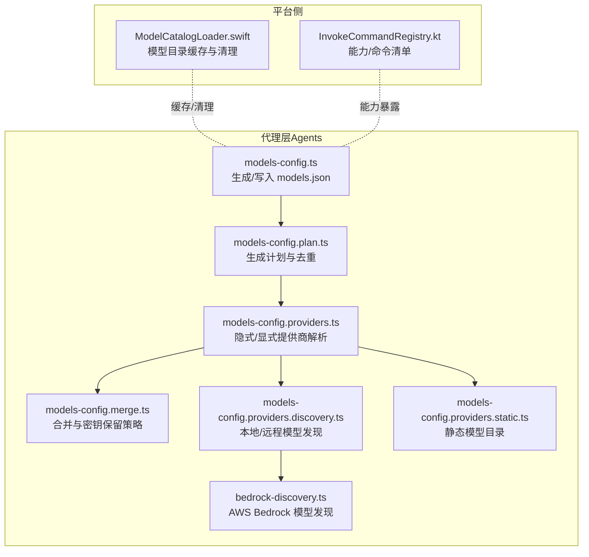
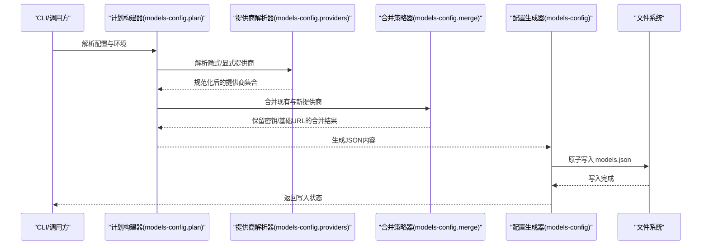
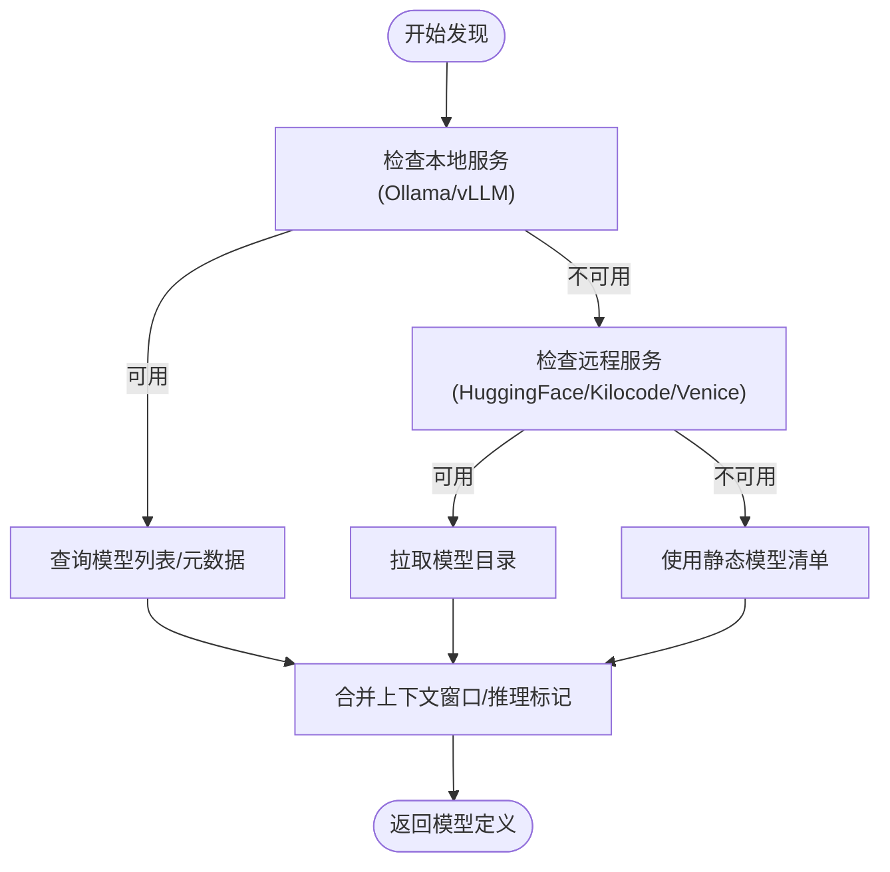
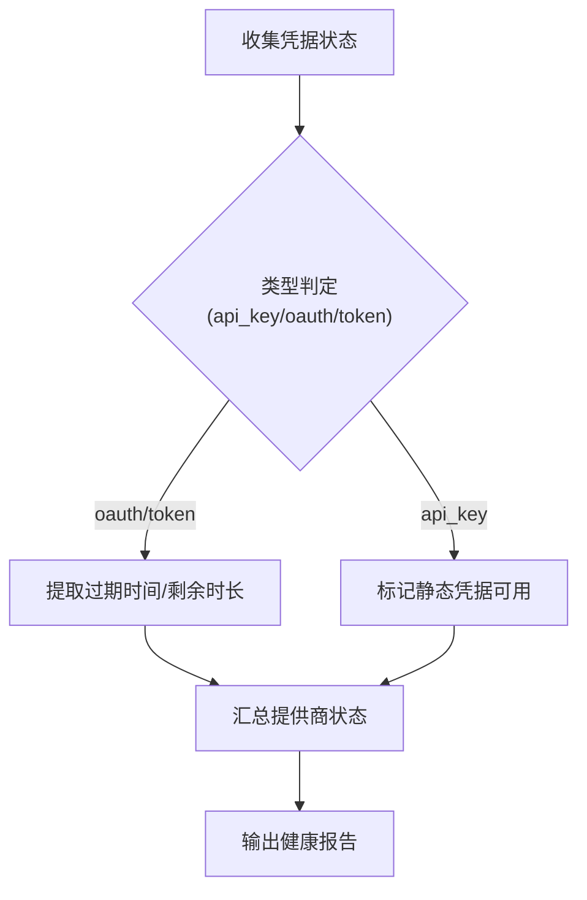
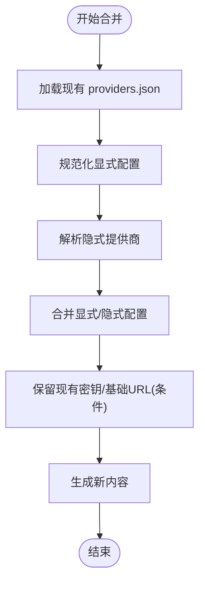
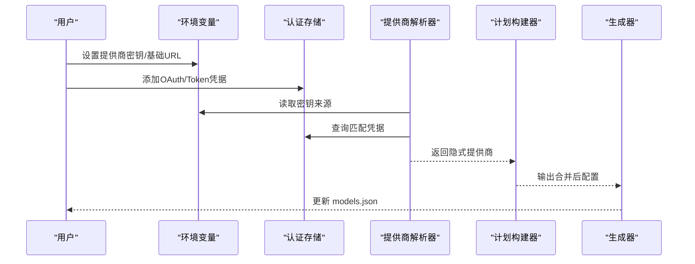
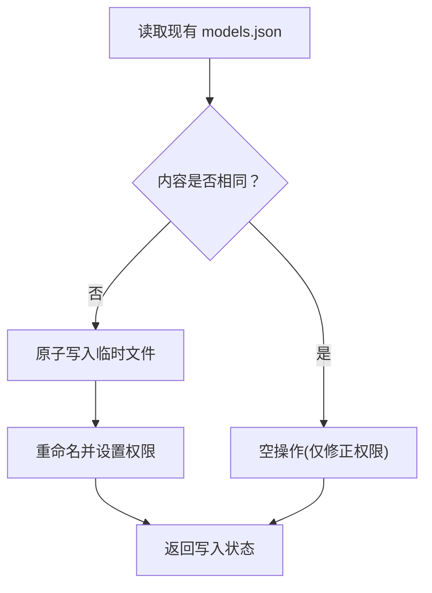
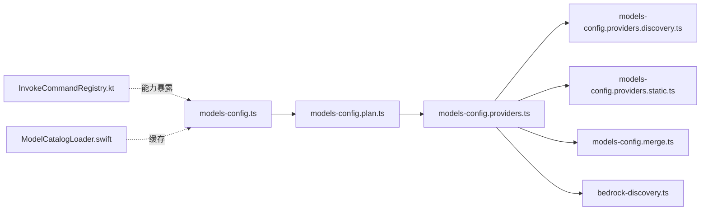

# 提供商集成概览

<cite>
**本文引用的文件**
- [src/agents/models-config.ts](file://src/agents/models-config.ts)
- [src/agents/models-config.plan.ts](file://src/agents/models-config.plan.ts)
- [src/agents/models-config.providers.ts](file://src/agents/models-config.providers.ts)
- [src/agents/models-config.merge.ts](file://src/agents/models-config.merge.ts)
- [src/agents/models-config.providers.discovery.ts](file://src/agents/models-config.providers.discovery.ts)
- [src/agents/models-config.providers.static.ts](file://src/agents/models-config.providers.static.ts)
- [src/agents/bedrock-discovery.ts](file://src/agents/bedrock-discovery.ts)
- [src/agents/models-config.write-serialization.test.ts](file://src/agents/models-config.write-serialization.test.ts)
- [apps/macos/Sources/OpenClaw/ModelCatalogLoader.swift](file://apps/macos/Sources/OpenClaw/ModelCatalogLoader.swift)
- [src/commands/onboard-auth.config-shared.ts](file://src/commands/onboard-auth.config-shared.ts)
- [src/commands/onboard-auth.config-core.ts](file://src/commands/onboard-auth.config-core.ts)
- [src/config/types.auth.ts](file://src/config/types.auth.ts)
- [src/agents/auth-health.ts](file://src/agents/auth-health.ts)
- [src/infra/provider-usage.fetch.gemini.ts](file://src/infra/provider-usage.fetch.gemini.ts)
- [apps/android/app/src/main/java/ai/openclaw/app/node/InvokeCommandRegistry.kt](file://apps/android/app/src/main/java/ai/openclaw/app/node/InvokeCommandRegistry.kt)
- [apps/android/app/src/test/java/ai/openclaw/app/node/InvokeCommandRegistryTest.kt](file://apps/android/app/src/test/java/ai/openclaw/app/node/InvokeCommandRegistryTest.kt)
</cite>

## 目录
1. [简介](#简介)
2. [项目结构](#项目结构)
3. [核心组件](#核心组件)
4. [架构总览](#架构总览)
5. [详细组件分析](#详细组件分析)
6. [依赖关系分析](#依赖关系分析)
7. [性能考量](#性能考量)
8. [故障排查指南](#故障排查指南)
9. [结论](#结论)
10. [附录](#附录)

## 简介
本文件面向OpenClaw AI模型提供商集成，系统化阐述整体架构与设计理念，覆盖以下关键主题：
- 模型发现机制：本地/远程模型自动探测与静态目录合并
- 能力检测系统：基于运行时环境与凭据状态的能力评估
- 配置管理策略：显式配置、隐式探测、合并策略与安全密钥保留
- 提供商注册流程：自动探测、手动配置与动态更新
- 模型目录管理：models.json生成、版本控制与并发写入保障
- 提供商能力矩阵：功能支持、限制条件与兼容性检查
- 最佳实践与常见问题

## 项目结构
OpenClaw在“代理层”集中处理提供商与模型配置，核心位于agents子模块；平台侧（macOS/Android）负责能力暴露与缓存。

图示来源
- [src/agents/models-config.ts](file://src/agents/models-config.ts#L79-L114)
- [src/agents/models-config.plan.ts](file://src/agents/models-config.plan.ts#L87-L128)
- [src/agents/models-config.providers.ts](file://src/agents/models-config.providers.ts#L661-L735)
- [src/agents/models-config.merge.ts](file://src/agents/models-config.merge.ts#L182-L217)
- [src/agents/models-config.providers.discovery.ts](file://src/agents/models-config.providers.discovery.ts#L226-L292)
- [src/agents/models-config.providers.static.ts](file://src/agents/models-config.providers.static.ts#L153-L437)
- [src/agents/bedrock-discovery.ts](file://src/agents/bedrock-discovery.ts#L148-L226)
- [apps/macos/Sources/OpenClaw/ModelCatalogLoader.swift](file://apps/macos/Sources/OpenClaw/ModelCatalogLoader.swift#L125-L159)
- [apps/android/app/src/main/java/ai/openclaw/app/node/InvokeCommandRegistry.kt](file://apps/android/app/src/main/java/ai/openclaw/app/node/InvokeCommandRegistry.kt#L204-L234)

章节来源
- [src/agents/models-config.ts](file://src/agents/models-config.ts#L1-L115)
- [src/agents/models-config.plan.ts](file://src/agents/models-config.plan.ts#L1-L129)
- [src/agents/models-config.providers.ts](file://src/agents/models-config.providers.ts#L1-L827)

## 核心组件
- 模型配置生成器：负责读取现有models.json、生成新内容并原子写入，同时确保文件权限与并发安全。
- 计划构建器：根据显式/隐式提供商与合并策略，决定是否跳过、空操作或写入新文件。
- 提供商解析器：从环境变量、认证存储与静态清单中解析隐式/显式提供商，并进行规范化与头部/密钥处理。
- 合并策略器：在“合并模式”下保留已有密钥与基础URL等敏感信息，避免重复输入与泄露风险。
- 发现器：对本地（Ollama/vLLM/HuggingFace/Kilocode/Venice）与云端（AWS Bedrock）模型进行动态发现。
- 平台适配：macOS缓存模型目录；Android按设备能力动态暴露命令与能力清单。

章节来源
- [src/agents/models-config.ts](file://src/agents/models-config.ts#L79-L114)
- [src/agents/models-config.plan.ts](file://src/agents/models-config.plan.ts#L87-L128)
- [src/agents/models-config.providers.ts](file://src/agents/models-config.providers.ts#L661-L735)
- [src/agents/models-config.merge.ts](file://src/agents/models-config.merge.ts#L182-L217)
- [src/agents/models-config.providers.discovery.ts](file://src/agents/models-config.providers.discovery.ts#L114-L292)
- [src/agents/bedrock-discovery.ts](file://src/agents/bedrock-discovery.ts#L148-L226)
- [apps/macos/Sources/OpenClaw/ModelCatalogLoader.swift](file://apps/macos/Sources/OpenClaw/ModelCatalogLoader.swift#L125-L159)
- [apps/android/app/src/main/java/ai/openclaw/app/node/InvokeCommandRegistry.kt](file://apps/android/app/src/main/java/ai/openclaw/app/node/InvokeCommandRegistry.kt#L204-L234)

## 架构总览
OpenClaw的提供商集成采用“计划-生成-写入”的流水线，结合隐式探测与显式配置，形成最终的模型目录（models.json）。平台侧负责能力暴露与缓存，确保跨端一致性。

图示来源
- [src/agents/models-config.plan.ts](file://src/agents/models-config.plan.ts#L87-L128)
- [src/agents/models-config.providers.ts](file://src/agents/models-config.providers.ts#L661-L735)
- [src/agents/models-config.merge.ts](file://src/agents/models-config.merge.ts#L182-L217)
- [src/agents/models-config.ts](file://src/agents/models-config.ts#L79-L114)

## 详细组件分析

### 模型发现机制
- 本地发现：Ollama/vLLM通过HTTP接口查询模型列表，按需补充上下文窗口与推理标记。
- 远程发现：HuggingFace/Kilocode/Venice/Verce AI Gateway通过API获取模型目录；Bedrock使用AWS SDK枚举可用模型。
- 静态目录：部分提供商以内置清单为主，结合动态发现作为回退。

图示来源
- [src/agents/models-config.providers.discovery.ts](file://src/agents/models-config.providers.discovery.ts#L114-L292)
- [src/agents/models-config.providers.static.ts](file://src/agents/models-config.providers.static.ts#L153-L437)
- [src/agents/bedrock-discovery.ts](file://src/agents/bedrock-discovery.ts#L148-L226)

章节来源
- [src/agents/models-config.providers.discovery.ts](file://src/agents/models-config.providers.discovery.ts#L1-L293)
- [src/agents/models-config.providers.static.ts](file://src/agents/models-config.providers.static.ts#L1-L438)
- [src/agents/bedrock-discovery.ts](file://src/agents/bedrock-discovery.ts#L1-L227)

### 能力检测系统
- 认证健康度：聚合OAuth/Token/API Key状态，计算过期时间与总体健康等级。
- 平台能力：Android按设备特性（相机/位置/短信/语音唤醒/运动传感器）动态暴露命令与能力清单。
- 使用情况：按提供商维度汇总额度使用率（如Gemini），辅助容量规划。

图示来源
- [src/agents/auth-health.ts](file://src/agents/auth-health.ts#L244-L283)
- [src/config/types.auth.ts](file://src/config/types.auth.ts#L1-L29)
- [apps/android/app/src/main/java/ai/openclaw/app/node/InvokeCommandRegistry.kt](file://apps/android/app/src/main/java/ai/openclaw/app/node/InvokeCommandRegistry.kt#L204-L234)
- [apps/android/app/src/test/java/ai/openclaw/app/node/InvokeCommandRegistryTest.kt](file://apps/android/app/src/test/java/ai/openclaw/app/node/InvokeCommandRegistryTest.kt#L72-L116)
- [src/infra/provider-usage.fetch.gemini.ts](file://src/infra/provider-usage.fetch.gemini.ts#L51-L87)

章节来源
- [src/agents/auth-health.ts](file://src/agents/auth-health.ts#L244-L283)
- [src/config/types.auth.ts](file://src/config/types.auth.ts#L1-L29)
- [apps/android/app/src/main/java/ai/openclaw/app/node/InvokeCommandRegistry.kt](file://apps/android/app/src/main/java/ai/openclaw/app/node/InvokeCommandRegistry.kt#L204-L234)
- [apps/android/app/src/test/java/ai/openclaw/app/node/InvokeCommandRegistryTest.kt](file://apps/android/app/src/test/java/ai/openclaw/app/node/InvokeCommandRegistryTest.kt#L72-L116)
- [src/infra/provider-usage.fetch.gemini.ts](file://src/infra/provider-usage.fetch.gemini.ts#L51-L87)

### 配置管理策略
- 显式配置：用户直接在配置中声明提供商、基础URL、API类型与模型列表。
- 隐式探测：从环境变量与认证存储中推断可用提供商，自动注入基础URL与API类型。
- 合并策略：在“合并模式”下保留现有密钥与基础URL，避免重复输入；显式基础URL优先于隐式保留。
- 安全处理：密钥引用标记与环境变量名规范化，防止明文泄露；对AWS SDK模式自动填充凭据来源。

图示来源
- [src/agents/models-config.plan.ts](file://src/agents/models-config.plan.ts#L87-L128)
- [src/agents/models-config.providers.ts](file://src/agents/models-config.providers.ts#L275-L430)
- [src/agents/models-config.merge.ts](file://src/agents/models-config.merge.ts#L182-L217)

章节来源
- [src/agents/models-config.plan.ts](file://src/agents/models-config.plan.ts#L1-L129)
- [src/agents/models-config.providers.ts](file://src/agents/models-config.providers.ts#L275-L430)
- [src/agents/models-config.merge.ts](file://src/agents/models-config.merge.ts#L182-L217)

### 提供商注册流程
- 自动探测：扫描环境变量与认证存储，按提供商类型构建隐式配置。
- 手动配置：用户在配置中显式声明提供商与模型，优先级高于隐式。
- 动态更新：当隐式探测到新的凭据或本地模型变化时，重新生成models.json并保持敏感信息不被覆盖。

图示来源
- [src/agents/models-config.providers.ts](file://src/agents/models-config.providers.ts#L661-L735)
- [src/agents/models-config.plan.ts](file://src/agents/models-config.plan.ts#L87-L128)
- [src/agents/models-config.ts](file://src/agents/models-config.ts#L79-L114)

章节来源
- [src/agents/models-config.providers.ts](file://src/agents/models-config.providers.ts#L450-L735)
- [src/commands/onboard-auth.config-shared.ts](file://src/commands/onboard-auth.config-shared.ts#L119-L149)
- [src/commands/onboard-auth.config-core.ts](file://src/commands/onboard-auth.config-core.ts#L469-L491)

### 模型目录管理
- 生成与写入：确保目标目录存在，原子写入临时文件后重命名为最终文件，最后设置严格权限。
- 版本控制：比较当前内容与现有文件，仅在变更时写入；空操作时仅修正权限。
- 并发控制：同一路径写入加锁，串行化写入，避免竞态与覆盖。
- 平台缓存：macOS将模型目录缓存至应用缓存区，失败时记录警告并清理旧缓存。

图示来源
- [src/agents/models-config.ts](file://src/agents/models-config.ts#L79-L114)
- [src/agents/models-config.write-serialization.test.ts](file://src/agents/models-config.write-serialization.test.ts#L14-L54)
- [apps/macos/Sources/OpenClaw/ModelCatalogLoader.swift](file://apps/macos/Sources/OpenClaw/ModelCatalogLoader.swift#L125-L159)

章节来源
- [src/agents/models-config.ts](file://src/agents/models-config.ts#L1-L115)
- [src/agents/models-config.write-serialization.test.ts](file://src/agents/models-config.write-serialization.test.ts#L1-L55)
- [apps/macos/Sources/OpenClaw/ModelCatalogLoader.swift](file://apps/macos/Sources/OpenClaw/ModelCatalogLoader.swift#L125-L159)

### 提供商能力矩阵
- 支持的功能：文本/图像输入、推理标记、成本与上下文窗口标注、API表面（OpenAI兼容/Anthropic等）。
- 限制条件：部分提供商要求显式模型列表（如Pi内核），否则无法注入API密钥；AWS Bedrock需具备流式响应与文本模态。
- 兼容性检查：对Google/Gemini模型ID进行兼容性归一化；对Antigravity低配前缀进行标准化。

章节来源
- [src/agents/models-config.providers.ts](file://src/agents/models-config.providers.ts#L220-L273)
- [src/agents/models-config.providers.discovery.ts](file://src/agents/models-config.providers.discovery.ts#L226-L292)
- [src/agents/models-config.providers.static.ts](file://src/agents/models-config.providers.static.ts#L153-L437)
- [src/agents/bedrock-discovery.ts](file://src/agents/bedrock-discovery.ts#L52-L125)

## 依赖关系分析
- 组件耦合：生成器依赖计划器与解析器；解析器依赖发现器与静态目录；合并器独立于写入流程但影响内容。
- 外部依赖：AWS SDK（Bedrock）、HTTP客户端（本地/远程模型发现）、文件系统（models.json）。
- 平台依赖：Android运行时标志驱动命令/能力清单；macOS缓存模型目录。

图示来源
- [src/agents/models-config.ts](file://src/agents/models-config.ts#L1-L115)
- [src/agents/models-config.plan.ts](file://src/agents/models-config.plan.ts#L1-L129)
- [src/agents/models-config.providers.ts](file://src/agents/models-config.providers.ts#L1-L827)
- [src/agents/models-config.merge.ts](file://src/agents/models-config.merge.ts#L1-L218)
- [src/agents/models-config.providers.discovery.ts](file://src/agents/models-config.providers.discovery.ts#L1-L293)
- [src/agents/models-config.providers.static.ts](file://src/agents/models-config.providers.static.ts#L1-L438)
- [src/agents/bedrock-discovery.ts](file://src/agents/bedrock-discovery.ts#L1-L227)
- [apps/android/app/src/main/java/ai/openclaw/app/node/InvokeCommandRegistry.kt](file://apps/android/app/src/main/java/ai/openclaw/app/node/InvokeCommandRegistry.kt#L204-L234)
- [apps/macos/Sources/OpenClaw/ModelCatalogLoader.swift](file://apps/macos/Sources/OpenClaw/ModelCatalogLoader.swift#L125-L159)

章节来源
- [src/agents/models-config.ts](file://src/agents/models-config.ts#L1-L115)
- [src/agents/models-config.plan.ts](file://src/agents/models-config.plan.ts#L1-L129)
- [src/agents/models-config.providers.ts](file://src/agents/models-config.providers.ts#L1-L827)
- [src/agents/models-config.merge.ts](file://src/agents/models-config.merge.ts#L1-L218)
- [src/agents/models-config.providers.discovery.ts](file://src/agents/models-config.providers.discovery.ts#L1-L293)
- [src/agents/models-config.providers.static.ts](file://src/agents/models-config.providers.static.ts#L1-L438)
- [src/agents/bedrock-discovery.ts](file://src/agents/bedrock-discovery.ts#L1-L227)
- [apps/android/app/src/main/java/ai/openclaw/app/node/InvokeCommandRegistry.kt](file://apps/android/app/src/main/java/ai/openclaw/app/node/InvokeCommandRegistry.kt#L204-L234)
- [apps/macos/Sources/OpenClaw/ModelCatalogLoader.swift](file://apps/macos/Sources/OpenClaw/ModelCatalogLoader.swift#L125-L159)

## 性能考量
- 并发写入：models.json写入采用串行化门闩，避免多进程/多任务同时写入导致的数据竞争。
- 缓存与去重：Bedrock发现器内置缓存与刷新间隔，减少频繁调用；隐式/显式提供商合并时去重键名。
- 本地发现批量化：Ollama/vLLM发现采用批量查询与并发限制，降低网络开销。
- 权限最小化：写入后立即修正权限，减少潜在安全风险。

章节来源
- [src/agents/models-config.ts](file://src/agents/models-config.ts#L60-L77)
- [src/agents/models-config.write-serialization.test.ts](file://src/agents/models-config.write-serialization.test.ts#L14-L54)
- [src/agents/models-config.providers.discovery.ts](file://src/agents/models-config.providers.discovery.ts#L114-L172)
- [src/agents/bedrock-discovery.ts](file://src/agents/bedrock-discovery.ts#L23-L50)

## 故障排查指南
- 无法写入models.json：检查目标目录权限与磁盘空间；确认无其他进程占用；查看并发写入锁状态。
- 模型未出现在目录：确认隐式探测已识别凭据；检查显式配置是否覆盖；验证本地服务可达性。
- 凭据状态异常：检查OAuth/Token是否过期；确认API Key来源是否正确；查看认证健康度报告。
- 平台能力缺失：确认设备特性开关（相机/位置/短信/语音唤醒/运动传感器）已启用；核对命令/能力清单过滤逻辑。
- 使用率统计异常：检查提供商额度接口返回；确认模型ID归一化是否生效。

章节来源
- [src/agents/models-config.ts](file://src/agents/models-config.ts#L79-L114)
- [src/agents/auth-health.ts](file://src/agents/auth-health.ts#L244-L283)
- [apps/android/app/src/main/java/ai/openclaw/app/node/InvokeCommandRegistry.kt](file://apps/android/app/src/main/java/ai/openclaw/app/node/InvokeCommandRegistry.kt#L204-L234)
- [src/infra/provider-usage.fetch.gemini.ts](file://src/infra/provider-usage.fetch.gemini.ts#L51-L87)

## 结论
OpenClaw的提供商集成通过“计划-生成-写入”流水线，结合隐式探测与显式配置，实现了高可维护性的模型目录管理。平台侧的能力暴露与缓存进一步提升了跨端一致性与用户体验。遵循本文的最佳实践与排障建议，可有效提升集成稳定性与安全性。

## 附录
- 最佳实践
  - 在合并模式下尽量保留现有密钥与基础URL，避免重复输入。
  - 对本地模型发现设置合理的超时与批处理上限，平衡准确性与性能。
  - 使用认证健康度工具定期检查凭据状态，提前预警过期风险。
  - 平台侧根据设备能力动态暴露命令与能力清单，避免不必要的功能展示。
- 常见问题
  - models.json未更新：确认计划器返回“写入”动作；检查并发写入锁是否释放。
  - 模型ID不一致：启用模型ID归一化（如Google/Gemini）；核对静态与动态目录差异。
  - 平台能力缺失：检查运行时标志与清单过滤条件；确保设备特性已开启。