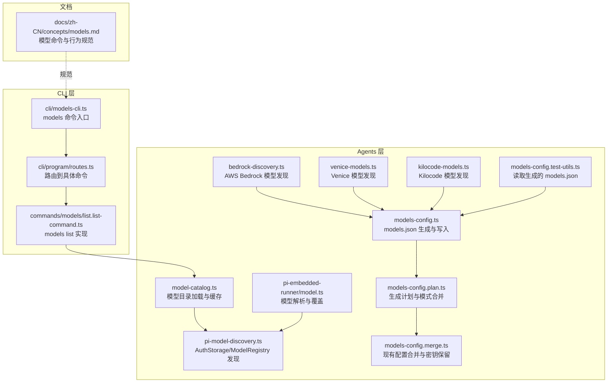
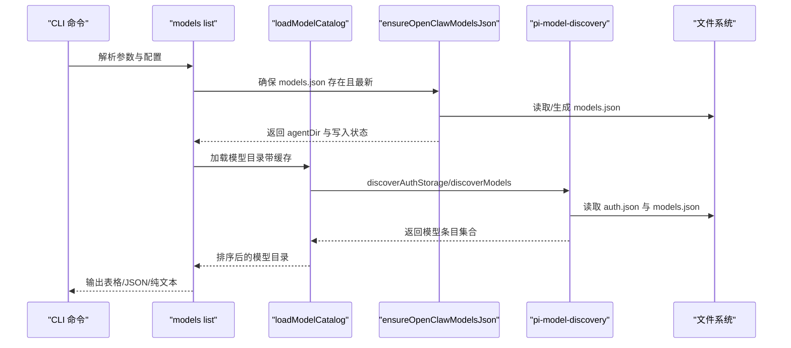
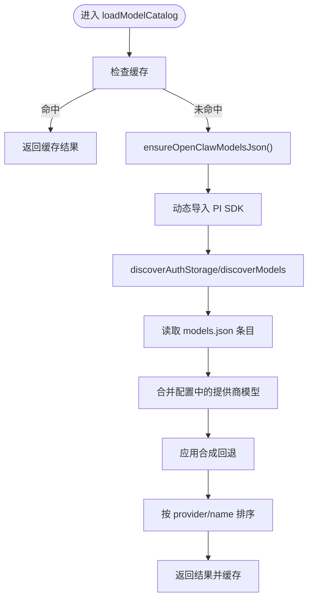
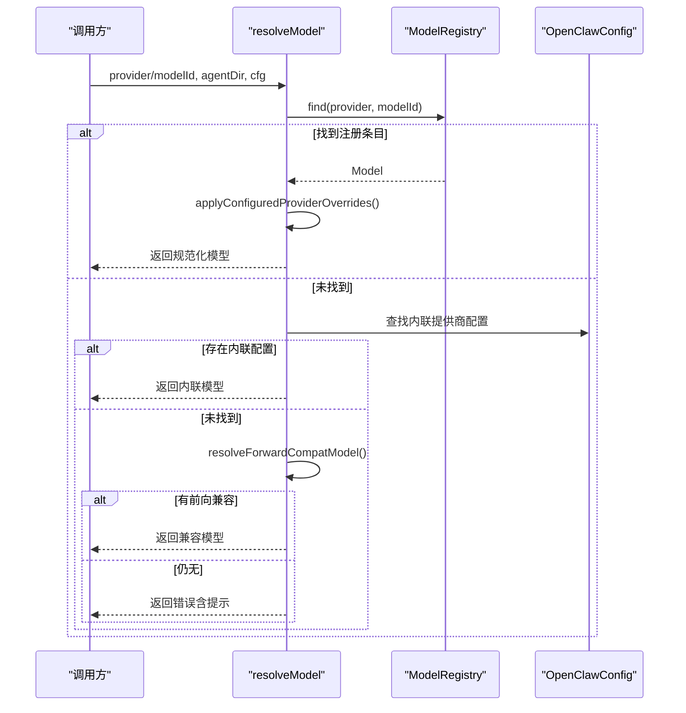
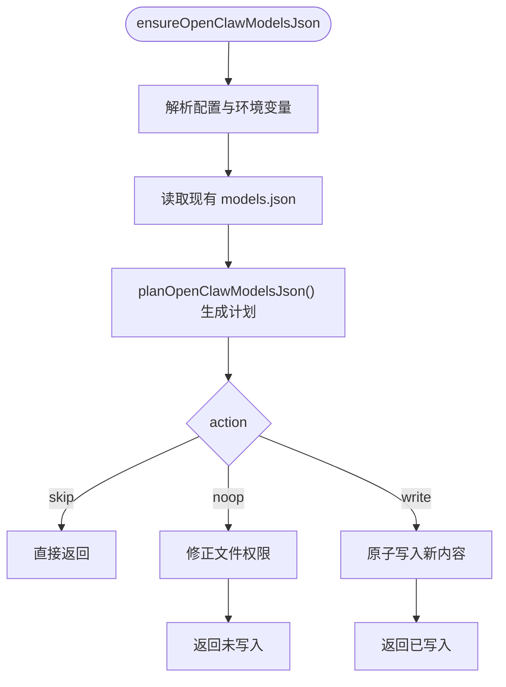
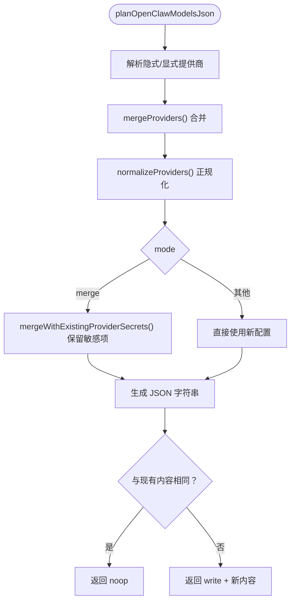
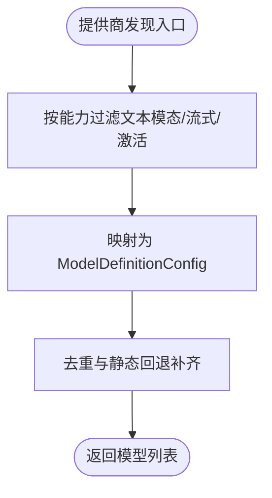
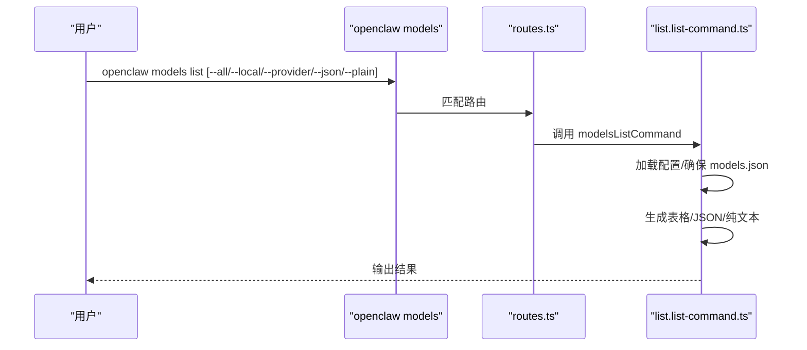
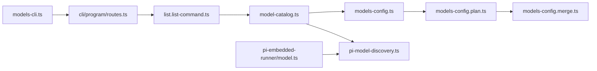

# 模型发现与注册

<cite>
**本文档引用的文件**
- [src/agents/model-catalog.ts](file://src/agents/model-catalog.ts)
- [src/agents/pi-model-discovery.ts](file://src/agents/pi-model-discovery.ts)
- [src/agents/pi-model-discovery-runtime.ts](file://src/agents/pi-model-discovery-runtime.ts)
- [src/agents/pi-embedded-runner/model.ts](file://src/agents/pi-embedded-runner/model.ts)
- [src/agents/models-config.ts](file://src/agents/models-config.ts)
- [src/agents/models-config.plan.ts](file://src/agents/models-config.plan.ts)
- [src/agents/models-config.merge.ts](file://src/agents/models-config.merge.ts)
- [src/agents/models-config.test-utils.ts](file://src/agents/models-config.test-utils.ts)
- [src/agents/bedrock-discovery.ts](file://src/agents/bedrock-discovery.ts)
- [src/agents/venice-models.ts](file://src/agents/venice-models.ts)
- [src/agents/kilocode-models.ts](file://src/agents/kilocode-models.ts)
- [src/commands/models/list.list-command.ts](file://src/commands/models/list.list-command.ts)
- [src/cli/models-cli.ts](file://src/cli/models-cli.ts)
- [src/cli/program/routes.ts](file://src/cli/program/routes.ts)
- [docs/zh-CN/concepts/models.md](file://docs/zh-CN/concepts/models.md)
</cite>

## 目录
1. [简介](#简介)
2. [项目结构](#项目结构)
3. [核心组件](#核心组件)
4. [架构总览](#架构总览)
5. [详细组件分析](#详细组件分析)
6. [依赖关系分析](#依赖关系分析)
7. [性能考量](#性能考量)
8. [故障排除指南](#故障排除指南)
9. [结论](#结论)
10. [附录](#附录)

## 简介
本技术文档聚焦于 OpenClaw 的“模型发现与注册”机制，涵盖以下关键主题：
- 自动模型扫描算法：文件系统遍历、配置文件解析、API 端点探测
- 模型注册流程：元数据提取、能力检测、兼容性验证
- 模型目录生成机制：models.json 结构设计与更新策略
- 动态模型发现：热插拔支持与实时更新
- 调试工具与故障排除方法

目标是帮助开发者与运维人员理解并高效维护模型发现与注册体系。

## 项目结构
围绕模型发现与注册的相关模块主要分布在 agents 子系统与 CLI 命令层：
- agents 层负责模型目录生成、发现与注册、能力检测与兼容性处理
- CLI 层提供模型列表、状态、别名与回退等管理命令
- 文档层提供模型命令与行为规范

**图表来源**
- [src/agents/model-catalog.ts](file://src/agents/model-catalog.ts#L1-L310)
- [src/agents/pi-model-discovery.ts](file://src/agents/pi-model-discovery.ts#L1-L153)
- [src/agents/pi-embedded-runner/model.ts](file://src/agents/pi-embedded-runner/model.ts#L1-L292)
- [src/agents/models-config.ts](file://src/agents/models-config.ts#L1-L115)
- [src/agents/models-config.plan.ts](file://src/agents/models-config.plan.ts#L1-L129)
- [src/agents/models-config.merge.ts](file://src/agents/models-config.merge.ts#L182-L217)
- [src/agents/models-config.test-utils.ts](file://src/agents/models-config.test-utils.ts#L1-L9)
- [src/agents/bedrock-discovery.ts](file://src/agents/bedrock-discovery.ts#L94-L146)
- [src/agents/venice-models.ts](file://src/agents/venice-models.ts#L495-L550)
- [src/agents/kilocode-models.ts](file://src/agents/kilocode-models.ts#L158-L190)
- [src/cli/models-cli.ts](file://src/cli/models-cli.ts#L33-L65)
- [src/cli/program/routes.ts](file://src/cli/program/routes.ts#L177-L192)
- [src/commands/models/list.list-command.ts](file://src/commands/models/list.list-command.ts#L1-L42)
- [docs/zh-CN/concepts/models.md](file://docs/zh-CN/concepts/models.md#L102-L146)

**章节来源**
- [src/agents/model-catalog.ts](file://src/agents/model-catalog.ts#L1-L310)
- [src/agents/models-config.ts](file://src/agents/models-config.ts#L1-L115)
- [src/cli/models-cli.ts](file://src/cli/models-cli.ts#L33-L65)

## 核心组件
- 模型目录加载与缓存：负责从 models.json 加载模型条目，合并配置与回退，并提供查询接口
- PI SDK 发现：封装 AuthStorage 与 ModelRegistry，用于发现与注册模型
- 模型解析与覆盖：根据配置对发现的模型进行 API、URL、头部、上下文窗口等覆盖
- models.json 生成与更新：基于配置与环境变量生成 models.json，支持原子写入与并发锁
- 生成计划与合并：决定是否跳过、空操作或写入新内容；在 merge 模式下保留敏感信息
- 提供商发现扩展：Bedrock、Venice、Kilocode 等云端/本地提供商的模型发现与过滤
- CLI 命令：models list/status/set 等命令的入口与路由

**章节来源**
- [src/agents/model-catalog.ts](file://src/agents/model-catalog.ts#L193-L278)
- [src/agents/pi-model-discovery.ts](file://src/agents/pi-model-discovery.ts#L142-L153)
- [src/agents/pi-embedded-runner/model.ts](file://src/agents/pi-embedded-runner/model.ts#L141-L263)
- [src/agents/models-config.ts](file://src/agents/models-config.ts#L79-L115)
- [src/agents/models-config.plan.ts](file://src/agents/models-config.plan.ts#L87-L129)
- [src/agents/models-config.merge.ts](file://src/agents/models-config.merge.ts#L182-L217)

## 架构总览
OpenClaw 的模型发现与注册采用“配置驱动 + 运行时发现 + 缓存”的分层架构：
- 配置层：OpenClawConfig 决定提供商集合、模式（merge/noop/skip）、隐式提供商
- 发现层：PI SDK 的 AuthStorage/ModelRegistry 与各提供商发现器（Bedrock/Venice/Kilocode）
- 生成层：models.json 计划与写入，确保原子性与权限安全
- 解析层：运行时解析模型引用，应用覆盖与兼容性回退
- 展示层：CLI 与 UI 基于模型目录进行展示与交互

**图表来源**
- [src/commands/models/list.list-command.ts](file://src/commands/models/list.list-command.ts#L17-L42)
- [src/agents/model-catalog.ts](file://src/agents/model-catalog.ts#L193-L278)
- [src/agents/models-config.ts](file://src/agents/models-config.ts#L79-L115)
- [src/agents/pi-model-discovery.ts](file://src/agents/pi-model-discovery.ts#L142-L153)

## 详细组件分析

### 组件A：模型目录加载与缓存（model-catalog）
职责：
- 从 models.json 加载模型条目，标准化字段（id/name/provider/contextWindow/reasoning/input）
- 合并配置中的显式提供商模型
- 应用合成回退（synthetic fallbacks）
- 提供查询、排序与能力判断函数

关键流程：
- 使用 Promise 缓存避免重复加载
- 动态导入 PI SDK，失败时不污染缓存
- 对空结果不缓存，以便后续重试

**图表来源**
- [src/agents/model-catalog.ts](file://src/agents/model-catalog.ts#L193-L278)
- [src/agents/models-config.ts](file://src/agents/models-config.ts#L79-L115)
- [src/agents/pi-model-discovery.ts](file://src/agents/pi-model-discovery.ts#L142-L153)

**章节来源**
- [src/agents/model-catalog.ts](file://src/agents/model-catalog.ts#L193-L310)

### 组件B：PI SDK 发现（pi-model-discovery）
职责：
- 将 PI SDK 的 AuthStorage/ModelRegistry 包装为本地可用
- 从认证存储中解析凭据，清理旧静态 auth.json 条目
- 创建内存后端或从存储初始化 AuthStorage
- 以 agentDir/models.json 作为模型注册表路径

关键点：
- 兼容不同版本的 PI SDK（discover* 辅助函数）
- 支持运行时设置 API Key/OAuth 凭证
- 清理 legacy 静态 auth.json 条目，保持安全权限

**章节来源**
- [src/agents/pi-model-discovery.ts](file://src/agents/pi-model-discovery.ts#L1-L153)

### 组件C：模型解析与覆盖（pi-embedded-runner/model）
职责：
- 在运行时解析模型引用，优先使用注册表条目
- 应用配置覆盖（baseUrl/api/headers/input/contextWindow/maxTokens/cost）
- 处理前向兼容回退（forward-compat）
- 对特定提供商（如 openrouter）提供透传代理能力
- 生成“未知模型”错误提示，含本地提供商认证提示

**图表来源**
- [src/agents/pi-embedded-runner/model.ts](file://src/agents/pi-embedded-runner/model.ts#L141-L263)

**章节来源**
- [src/agents/pi-embedded-runner/model.ts](file://src/agents/pi-embedded-runner/model.ts#L1-L292)

### 组件D：models.json 生成与更新（models-config）
职责：
- 读取现有 models.json 并解析
- 生成写入计划（skip/noop/write）
- 原子写入（临时文件 + rename），并设置安全权限
- 并发写入锁，避免竞态

**图表来源**
- [src/agents/models-config.ts](file://src/agents/models-config.ts#L79-L115)
- [src/agents/models-config.plan.ts](file://src/agents/models-config.plan.ts#L87-L129)

**章节来源**
- [src/agents/models-config.ts](file://src/agents/models-config.ts#L1-L115)
- [src/agents/models-config.plan.ts](file://src/agents/models-config.plan.ts#L1-L129)

### 组件E：生成计划与合并（models-config.plan 与 merge）
职责：
- 解析隐式与显式提供商，合并配置
- 在 merge 模式下保留现有敏感信息（apiKey/baseUrl 等）
- 正规化提供商（含 secret 默认值与 ref 管理）

**图表来源**
- [src/agents/models-config.plan.ts](file://src/agents/models-config.plan.ts#L28-L129)
- [src/agents/models-config.merge.ts](file://src/agents/models-config.merge.ts#L182-L217)

**章节来源**
- [src/agents/models-config.plan.ts](file://src/agents/models-config.plan.ts#L1-L129)
- [src/agents/models-config.merge.ts](file://src/agents/models-config.merge.ts#L182-L217)

### 组件F：提供商发现扩展（Bedrock/Venice/Kilocode）
职责：
- Bedrock：过滤具备文本模态与流式响应能力的模型
- Venice：网络错误重试、静态回退与异常处理
- Kilocode：静态回退与去重、错误降级

**图表来源**
- [src/agents/bedrock-discovery.ts](file://src/agents/bedrock-discovery.ts#L94-L146)
- [src/agents/venice-models.ts](file://src/agents/venice-models.ts#L495-L550)
- [src/agents/kilocode-models.ts](file://src/agents/kilocode-models.ts#L158-L190)

**章节来源**
- [src/agents/bedrock-discovery.ts](file://src/agents/bedrock-discovery.ts#L94-L146)
- [src/agents/venice-models.ts](file://src/agents/venice-models.ts#L495-L550)
- [src/agents/kilocode-models.ts](file://src/agents/kilocode-models.ts#L158-L190)

### 组件G：CLI 命令与路由（models list/status/set）
职责：
- models list：列出模型（全部/本地/按提供商），支持 JSON/纯文本输出
- 路由：将命令路径映射到具体实现
- 文档：命令行为与参考链接

**图表来源**
- [src/cli/models-cli.ts](file://src/cli/models-cli.ts#L33-L65)
- [src/cli/program/routes.ts](file://src/cli/program/routes.ts#L177-L192)
- [src/commands/models/list.list-command.ts](file://src/commands/models/list.list-command.ts#L17-L42)
- [docs/zh-CN/concepts/models.md](file://docs/zh-CN/concepts/models.md#L102-L146)

**章节来源**
- [src/cli/models-cli.ts](file://src/cli/models-cli.ts#L33-L65)
- [src/cli/program/routes.ts](file://src/cli/program/routes.ts#L177-L192)
- [src/commands/models/list.list-command.ts](file://src/commands/models/list.list-command.ts#L1-L42)
- [docs/zh-CN/concepts/models.md](file://docs/zh-CN/concepts/models.md#L102-L146)

## 依赖关系分析
- model-catalog.ts 依赖：
  - models-config.ts（确保 models.json）
  - pi-model-discovery.ts（discoverAuthStorage/discoverModels）
- pi-embedded-runner/model.ts 依赖：
  - pi-model-discovery.ts（discoverModels）
  - 配置与前向兼容逻辑
- models-config.ts 依赖：
  - models-config.plan.ts（生成计划）
  - models-config.merge.ts（合并策略）
- CLI 依赖：
  - commands/models/list.list-command.ts（命令实现）
  - cli/program/routes.ts（路由）

**图表来源**
- [src/commands/models/list.list-command.ts](file://src/commands/models/list.list-command.ts#L1-L42)
- [src/agents/model-catalog.ts](file://src/agents/model-catalog.ts#L1-L310)
- [src/agents/models-config.ts](file://src/agents/models-config.ts#L1-L115)
- [src/agents/models-config.plan.ts](file://src/agents/models-config.plan.ts#L1-L129)
- [src/agents/models-config.merge.ts](file://src/agents/models-config.merge.ts#L182-L217)
- [src/agents/pi-model-discovery.ts](file://src/agents/pi-model-discovery.ts#L1-L153)
- [src/agents/pi-embedded-runner/model.ts](file://src/agents/pi-embedded-runner/model.ts#L1-L292)
- [src/cli/models-cli.ts](file://src/cli/models-cli.ts#L33-L65)
- [src/cli/program/routes.ts](file://src/cli/program/routes.ts#L177-L192)

**章节来源**
- [src/agents/model-catalog.ts](file://src/agents/model-catalog.ts#L1-L310)
- [src/agents/models-config.ts](file://src/agents/models-config.ts#L1-L115)
- [src/agents/pi-model-discovery.ts](file://src/agents/pi-model-discovery.ts#L1-L153)
- [src/agents/pi-embedded-runner/model.ts](file://src/agents/pi-embedded-runner/model.ts#L1-L292)
- [src/agents/models-config.plan.ts](file://src/agents/models-config.plan.ts#L1-L129)
- [src/agents/models-config.merge.ts](file://src/agents/models-config.merge.ts#L182-L217)
- [src/cli/models-cli.ts](file://src/cli/models-cli.ts#L33-L65)
- [src/cli/program/routes.ts](file://src/cli/program/routes.ts#L177-L192)
- [src/commands/models/list.list-command.ts](file://src/commands/models/list.list-command.ts#L1-L42)

## 性能考量
- 缓存与重试：
  - 模型目录加载使用 Promise 缓存，避免重复 IO
  - 动态导入 PI SDK 放在 try/catch 内部，失败不污染缓存
- 并发与原子写入：
  - models.json 写入使用并发锁与临时文件 + rename，降低竞争风险
  - 文件权限统一设置为安全模式
- 能力过滤与回退：
  - 发现阶段即过滤无效模型，减少后续处理开销
  - 合成回退与静态回退保证可用性，降低运行时失败率

[本节为通用指导，无需特定文件来源]

## 故障排除指南
常见问题与定位建议：
- 无法加载模型目录
  - 检查 models.json 是否存在与可读
  - 查看动态导入 PI SDK 的错误日志
  - 确认 ensureOpenClawModelsJson 已成功写入
- 未知模型错误
  - 特别关注本地提供商（ollama/vLLM）需要认证注册
  - 检查配置中的 providers 与别名
- 认证状态异常
  - 使用 models status 或相关健康检查命令查看提供商状态
  - 检查凭据存储与过期时间
- CLI 输出不符合预期
  - 使用 --json/--plain 选项获取机器可读/纯文本输出
  - 按提供商过滤：--provider
  - 参考命令行为与参考文档

**章节来源**
- [src/agents/model-catalog.ts](file://src/agents/model-catalog.ts#L263-L274)
- [src/agents/pi-embedded-runner/model.ts](file://src/agents/pi-embedded-runner/model.ts#L276-L291)
- [src/agents/auth-health.ts](file://src/agents/auth-health.ts#L244-L283)
- [docs/zh-CN/concepts/models.md](file://docs/zh-CN/concepts/models.md#L102-L146)

## 结论
OpenClaw 的模型发现与注册机制通过“配置驱动 + 运行时发现 + 安全写入 + 缓存优化”的组合，实现了稳定、可扩展且可调试的模型目录管理。结合 CLI 与文档规范，用户可以高效地发现、注册、覆盖与管理模型，满足多提供商、多平台的复杂场景需求。

[本节为总结，无需特定文件来源]

## 附录

### A. models.json 结构与更新策略
- 结构要点
  - 根对象包含 providers 映射
  - 每个提供商包含 baseUrl、api、models 列表、headers 等
  - 支持 secret 引用与默认值
- 更新策略
  - skip：无提供商定义时跳过生成
  - noop：内容未变化，仅修正权限
  - write：生成新内容并原子写入
  - merge 模式：保留现有敏感信息（apiKey/baseUrl 等）

**章节来源**
- [src/agents/models-config.plan.ts](file://src/agents/models-config.plan.ts#L16-L26)
- [src/agents/models-config.plan.ts](file://src/agents/models-config.plan.ts#L87-L129)
- [src/agents/models-config.merge.ts](file://src/agents/models-config.merge.ts#L182-L217)

### B. 动态模型发现与热插拔
- 运行时发现
  - 通过 discoverModels 获取注册表条目
  - 支持配置覆盖与前向兼容回退
- 热插拔与实时更新
  - 通过 ensureOpenClawModelsJson 重新生成 models.json
  - 未生成新内容时返回 noop，避免不必要的刷新
  - 模型目录加载使用缓存，必要时可禁用缓存强制刷新

**章节来源**
- [src/agents/pi-model-discovery.ts](file://src/agents/pi-model-discovery.ts#L150-L153)
- [src/agents/models-config.ts](file://src/agents/models-config.ts#L79-L115)
- [src/agents/model-catalog.ts](file://src/agents/model-catalog.ts#L193-L202)

### C. 调试工具与测试辅助
- 读取生成的 models.json
  - 提供测试工具函数读取 agentDir 下的 models.json
- CLI 调试
  - models list/status 支持 JSON/纯文本输出
  - 按提供商过滤与全量目录展示
- 日志与错误
  - 模型目录加载失败会记录警告并避免缓存污染
  - 未知模型错误包含本地提供商认证提示

**章节来源**
- [src/agents/models-config.test-utils.ts](file://src/agents/models-config.test-utils.ts#L1-L9)
- [src/cli/models-cli.ts](file://src/cli/models-cli.ts#L33-L65)
- [src/agents/model-catalog.ts](file://src/agents/model-catalog.ts#L263-L274)
- [src/agents/pi-embedded-runner/model.ts](file://src/agents/pi-embedded-runner/model.ts#L276-L291)