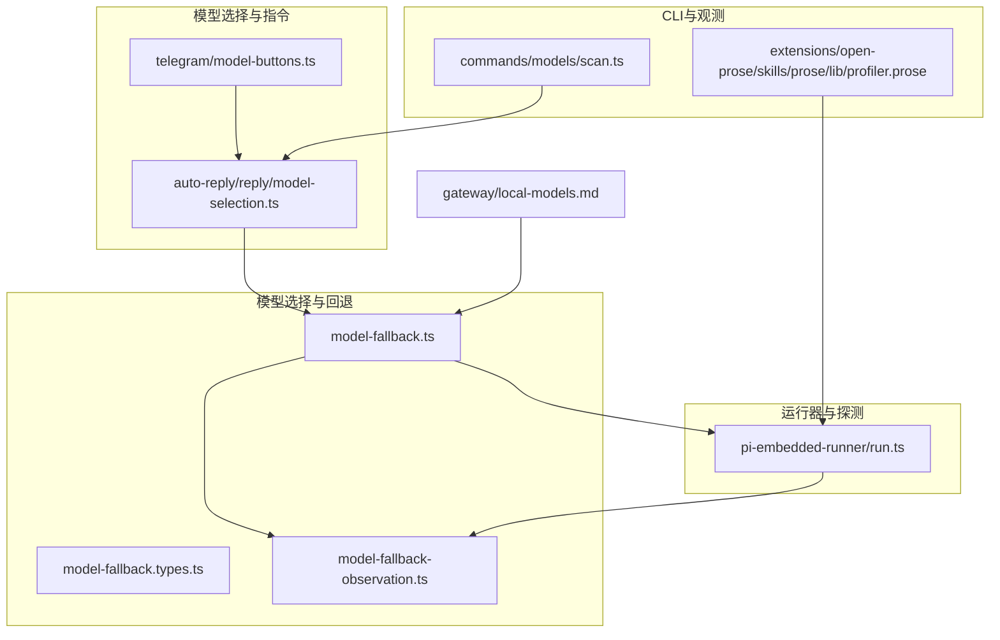
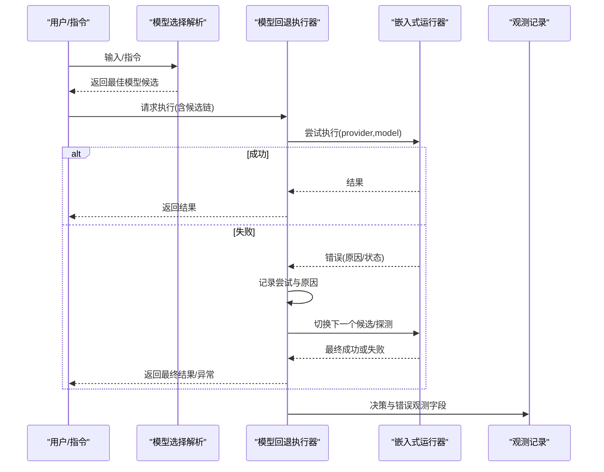
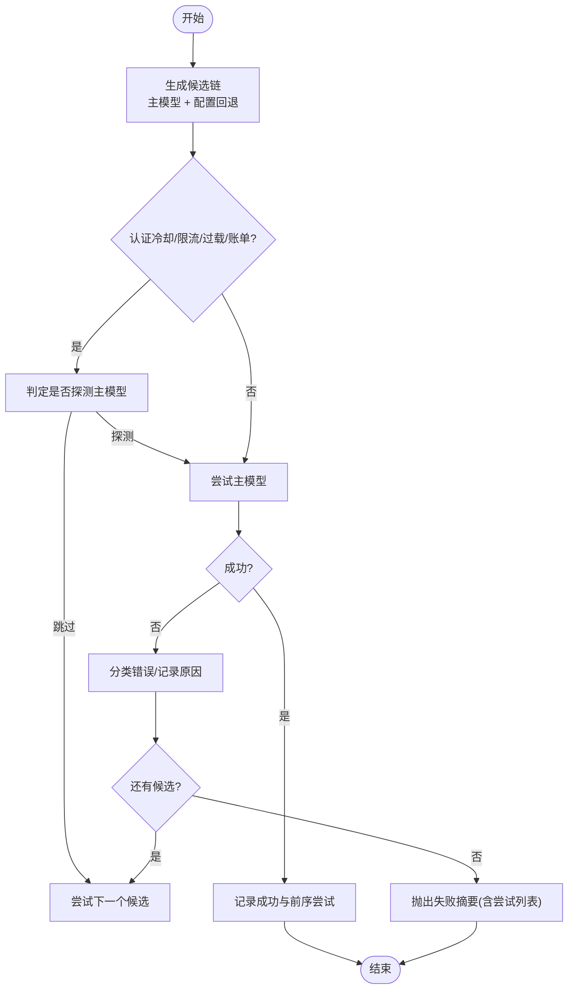
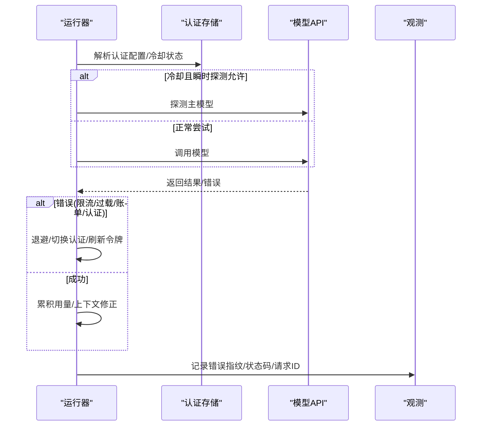
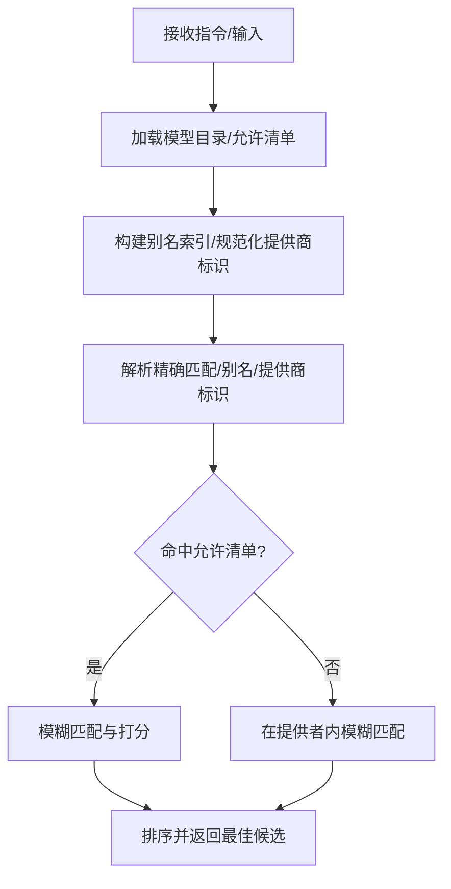
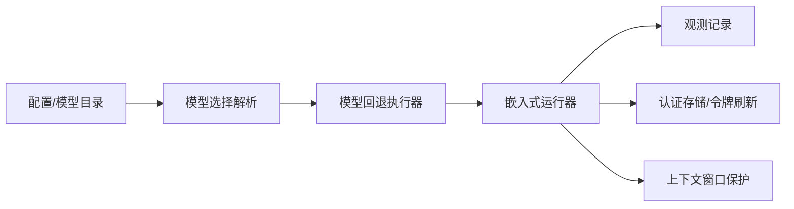

# 模型选择策略

<cite>
**本文引用的文件**
- [src/agents/model-fallback.ts](file://src/agents/model-fallback.ts)
- [src/agents/model-fallback.types.ts](file://src/agents/model-fallback.types.ts)
- [src/agents/model-fallback-observation.ts](file://src/agents/model-fallback-observation.ts)
- [src/agents/pi-embedded-runner/run.ts](file://src/agents/pi-embedded-runner/run.ts)
- [src/auto-reply/reply/model-selection.ts](file://src/auto-reply/reply/model-selection.ts)
- [src/telegram/model-buttons.ts](file://src/telegram/model-buttons.ts)
- [src/commands/models/scan.ts](file://src/commands/models/scan.ts)
- [docs/zh-CN/gateway/local-models.md](file://docs/zh-CN/gateway/local-models.md)
- [extensions/open-prose/skills/prose/lib/profiler.prose](file://extensions/open-prose/skills/prose/lib/profiler.prose)
</cite>

## 目录
1. [引言](#引言)
2. [项目结构](#项目结构)
3. [核心组件](#核心组件)
4. [架构总览](#架构总览)
5. [详细组件分析](#详细组件分析)
6. [依赖关系分析](#依赖关系分析)
7. [性能考量](#性能考量)
8. [故障排查指南](#故障排查指南)
9. [结论](#结论)
10. [附录](#附录)

## 引言
本文件面向OpenClaw的“模型选择策略”，系统化阐述模型选择算法、负载均衡与性能评估、成本优化策略、故障转移机制、模型优先级管理、回退策略与多阶段失败处理、以及监控指标与基准测试方法。目标是帮助开发者与运维人员在复杂多模型、多供应商、多认证配置下，构建稳定、可观察、可调优的模型选择与运行体系。

## 项目结构
围绕模型选择的关键代码分布在以下模块：
- 模型回退与运行器：负责从候选链路中按优先级尝试执行，并在失败时进行回退、探测与降级。
- 模型选择与指令解析：负责根据用户输入、会话状态、允许清单与别名索引进行模糊匹配与排序。
- 认证与配额探测：在冷却期或限流/过载/账单问题时，进行受控探测与回退策略。
- 用户交互与CLI工具：支持用户选择模型、扫描模型能力与上下文窗口、输出性能分析报告。
- 文档与示例：提供混合配置、本地优先与托管回退的最佳实践。

**图表来源**
- [src/agents/model-fallback.ts](file://src/agents/model-fallback.ts#L502-L715)
- [src/agents/model-fallback.types.ts](file://src/agents/model-fallback.types.ts#L1-L16)
- [src/agents/model-fallback-observation.ts](file://src/agents/model-fallback-observation.ts#L1-L28)
- [src/agents/pi-embedded-runner/run.ts](file://src/agents/pi-embedded-runner/run.ts#L255-L800)
- [src/auto-reply/reply/model-selection.ts](file://src/auto-reply/reply/model-selection.ts#L428-L609)
- [src/telegram/model-buttons.ts](file://src/telegram/model-buttons.ts#L84-L115)
- [src/commands/models/scan.ts](file://src/commands/models/scan.ts#L81-L115)
- [docs/zh-CN/gateway/local-models.md](file://docs/zh-CN/gateway/local-models.md#L70-L118)
- [extensions/open-prose/skills/prose/lib/profiler.prose](file://extensions/open-prose/skills/prose/lib/profiler.prose#L271-L400)

**章节来源**
- [src/agents/model-fallback.ts](file://src/agents/model-fallback.ts#L1-L769)
- [src/agents/pi-embedded-runner/run.ts](file://src/agents/pi-embedded-runner/run.ts#L1-L800)
- [src/auto-reply/reply/model-selection.ts](file://src/auto-reply/reply/model-selection.ts#L1-L609)
- [src/telegram/model-buttons.ts](file://src/telegram/model-buttons.ts#L84-L115)
- [src/commands/models/scan.ts](file://src/commands/models/scan.ts#L81-L115)
- [docs/zh-CN/gateway/local-models.md](file://docs/zh-CN/gateway/local-models.md#L70-L118)
- [extensions/open-prose/skills/prose/lib/profiler.prose](file://extensions/open-prose/skills/prose/lib/profiler.prose#L271-L400)

## 核心组件
- 模型回退执行器：根据配置与当前请求，生成候选模型列表，逐个尝试执行，记录每次尝试的错误原因与状态，必要时进行冷却探测与回退。
- 运行器与探测：在认证配置、上下文窗口、超载/限流/账单等场景下，进行受控探测与回退，避免无意义重试。
- 模型选择与指令解析：基于别名索引、允许清单、默认模型与模糊匹配规则，对用户输入进行评分与排序，返回最佳匹配。
- 观测与日志：记录回退决策、错误指纹、HTTP状态码、请求ID等，便于定位与审计。
- CLI与扫描：提供模型扫描、上下文长度与参数推断、图像/工具可用性探测，辅助性能与成本评估。
- 文档与示例：提供混合配置、区域托管与本地优先的回退策略示例。

**章节来源**
- [src/agents/model-fallback.ts](file://src/agents/model-fallback.ts#L502-L715)
- [src/agents/pi-embedded-runner/run.ts](file://src/agents/pi-embedded-runner/run.ts#L500-L800)
- [src/auto-reply/reply/model-selection.ts](file://src/auto-reply/reply/model-selection.ts#L428-L609)
- [src/agents/model-fallback-observation.ts](file://src/agents/model-fallback-observation.ts#L1-L28)
- [src/commands/models/scan.ts](file://src/commands/models/scan.ts#L81-L115)
- [docs/zh-CN/gateway/local-models.md](file://docs/zh-CN/gateway/local-models.md#L70-L118)

## 架构总览
模型选择策略贯穿“解析—选择—回退—运行—观测”闭环。解析层负责将用户意图映射到候选模型；选择层基于别名与允许清单进行模糊匹配与打分；回退层在失败时按优先级切换并进行受控探测；运行层在认证、上下文与资源约束下执行；观测层记录决策与错误以便持续优化。

**图表来源**
- [src/auto-reply/reply/model-selection.ts](file://src/auto-reply/reply/model-selection.ts#L428-L609)
- [src/agents/model-fallback.ts](file://src/agents/model-fallback.ts#L502-L715)
- [src/agents/pi-embedded-runner/run.ts](file://src/agents/pi-embedded-runner/run.ts#L255-L800)
- [src/agents/model-fallback-observation.ts](file://src/agents/model-fallback-observation.ts#L1-L28)

## 详细组件分析

### 组件A：模型回退执行器（runWithModelFallback）
职责与流程
- 生成候选链：根据配置与默认模型，结合允许清单与别名索引，构建主模型与回退链。
- 冷却与探测：在认证冷却、限流、过载、账单等情况下，决定是否探测主模型或跳过。
- 尝试执行：逐个尝试候选，捕获错误并记录原因与状态，必要时触发回退。
- 失败汇总：若所有候选均失败，抛出包含完整尝试摘要的错误。

关键特性
- 候选收集：支持显式候选与允许清单过滤，确保回退链不受外部限制影响。
- 冷却决策：区分持久性与瞬时性问题，对账单/限流/过载采用受控探测。
- 错误分类：将未知错误归类为可回退错误，避免非可重试错误被误判。
- 观测记录：记录每次尝试的原因、状态、错误摘要，便于审计与优化。

**图表来源**
- [src/agents/model-fallback.ts](file://src/agents/model-fallback.ts#L502-L715)

**章节来源**
- [src/agents/model-fallback.ts](file://src/agents/model-fallback.ts#L502-L715)
- [src/agents/model-fallback.types.ts](file://src/agents/model-fallback.types.ts#L1-L16)

### 组件B：嵌入式运行器与探测（pi-embedded-runner）
职责与流程
- 解析与校验：解析模型、上下文窗口、认证配置，应用上下文保护阈值。
- 认证与配额：按优先级选择认证配置，处理冷却与瞬时探测，必要时刷新第三方令牌。
- 超载与限流：对过载错误进行指数退避与中断感知，避免风暴。
- 错误归类与回退：将认证/账单/限流/超时等错误归类为可回退原因，驱动上层回退。
- 使用统计：累积输入/输出/缓存用量，修正上下文大小计算，避免工具往返导致的膨胀。

**图表来源**
- [src/agents/pi-embedded-runner/run.ts](file://src/agents/pi-embedded-runner/run.ts#L500-L800)
- [src/agents/model-fallback-observation.ts](file://src/agents/model-fallback-observation.ts#L1-L28)

**章节来源**
- [src/agents/pi-embedded-runner/run.ts](file://src/agents/pi-embedded-runner/run.ts#L500-L800)

### 组件C：模型选择与指令解析（auto-reply）
职责与流程
- 指令解析：从用户指令中提取模型请求，支持别名与模糊匹配。
- 允许清单与目录：加载模型目录，构建允许集合，过滤不允许的模型。
- 模糊匹配与打分：基于提供商标识、模型名称、别名、常见变体词与编辑距离，进行多维度打分与排序。
- 会话覆盖：支持会话/父会话的模型覆盖，必要时重置无效覆盖。
- 默认思考/推理级别：根据模型能力与配置解析默认思维/推理级别。

**图表来源**
- [src/auto-reply/reply/model-selection.ts](file://src/auto-reply/reply/model-selection.ts#L428-L609)

**章节来源**
- [src/auto-reply/reply/model-selection.ts](file://src/auto-reply/reply/model-selection.ts#L1-L609)

### 组件D：用户交互与选择（Telegram按钮）
职责与流程
- 构建回调数据：将“provider/model”编码为回调数据，支持紧凑模式以满足字节限制。
- 安全与兼容：在超出上限时回退到紧凑格式，保证交互可用性。

**章节来源**
- [src/telegram/model-buttons.ts](file://src/telegram/model-buttons.ts#L84-L115)

### 组件E：CLI扫描与性能观测
职责与流程
- 扫描：对模型进行工具/图像可用性探测，记录延迟与上下文长度，输出汇总与表格。
- 性能分析：提供按模型/子代理/绑定的耗时、令牌、成本与效率分析，支持趋势跟踪与对比。

**章节来源**
- [src/commands/models/scan.ts](file://src/commands/models/scan.ts#L81-L115)
- [extensions/open-prose/skills/prose/lib/profiler.prose](file://extensions/open-prose/skills/prose/lib/profiler.prose#L271-L400)

## 依赖关系分析
- 模型回退执行器依赖：
  - 配置解析与模型选择：用于生成候选链与别名索引。
  - 认证与冷却：用于判定是否探测主模型。
  - 观测记录：用于记录决策与错误字段。
- 运行器依赖：
  - 认证存储与令牌刷新：用于处理认证失败与第三方令牌。
  - 上下文窗口保护：用于避免超大上下文导致的失败。
  - 观测记录：用于错误归因与审计。
- 模型选择依赖：
  - 模型目录与允许清单：用于过滤与打分。
  - 会话存储：用于读取/重置模型覆盖。

**图表来源**
- [src/auto-reply/reply/model-selection.ts](file://src/auto-reply/reply/model-selection.ts#L428-L609)
- [src/agents/model-fallback.ts](file://src/agents/model-fallback.ts#L502-L715)
- [src/agents/pi-embedded-runner/run.ts](file://src/agents/pi-embedded-runner/run.ts#L500-L800)
- [src/agents/model-fallback-observation.ts](file://src/agents/model-fallback-observation.ts#L1-L28)

**章节来源**
- [src/agents/model-fallback.ts](file://src/agents/model-fallback.ts#L502-L715)
- [src/agents/pi-embedded-runner/run.ts](file://src/agents/pi-embedded-runner/run.ts#L500-L800)
- [src/auto-reply/reply/model-selection.ts](file://src/auto-reply/reply/model-selection.ts#L428-L609)

## 性能考量
- 回退链长度与顺序：优先选择高可用、低延迟、低成本的模型，减少失败重试次数。
- 冷却探测策略：对瞬时性问题（限流/过载/账单）采用受控探测，避免长时间冷却导致的不可用。
- 退避与中断：对过载错误采用指数退避与中断感知，降低风暴风险。
- 上下文修正：使用最后一次调用的缓存字段修正上下文大小，避免工具往返导致的膨胀。
- 扫描与基准：通过CLI扫描与性能分析脚本，识别热点、并行机会与批处理机会，指导模型降级与并行化。

[本节为通用性能建议，不直接分析具体文件]

## 故障排查指南
- 错误归类与观测：利用观测记录中的错误预览、哈希、HTTP状态码、请求ID等字段快速定位问题类型与来源。
- 回退摘要：当所有候选均失败时，查看尝试摘要，确认失败原因与顺序，判断是否需要调整回退链或配置。
- 冷却与探测：检查认证冷却状态与探测间隔，确认是否因冷却导致跳过探测。
- 超载与限流：关注过载退避次数与延迟，必要时降低并发或切换更稳定的模型。
- 账单与认证：核对认证配置与第三方令牌刷新状态，确保账单问题得到及时恢复。

**章节来源**
- [src/agents/model-fallback-observation.ts](file://src/agents/model-fallback-observation.ts#L1-L28)
- [src/agents/model-fallback.ts](file://src/agents/model-fallback.ts#L180-L198)
- [src/agents/pi-embedded-runner/run.ts](file://src/agents/pi-embedded-runner/run.ts#L779-L798)

## 结论
OpenClaw的模型选择策略通过“解析—选择—回退—运行—观测”的闭环，实现了在多模型、多供应商、多认证配置下的稳健运行。其核心在于：
- 明确的回退链与受控探测，平衡稳定性与响应速度；
- 基于别名与允许清单的智能选择，兼顾易用性与合规；
- 对认证、上下文、资源的综合保护，提升成功率；
- 丰富的观测与分析工具，支撑持续优化与成本控制。

## 附录

### A. 模型优先级管理与动态权重
- 手动配置：通过配置文件定义主模型与回退链，确保在同供应商内按版本差异进行回退。
- 自动调整：根据扫描结果与性能分析，动态调整回退顺序与默认模型。
- 动态权重：结合成本、延迟与成功率，对候选进行加权排序（建议在上层策略中实现，以避免过度复杂化）。

**章节来源**
- [src/agents/model-fallback.ts](file://src/agents/model-fallback.ts#L252-L327)
- [src/commands/models/scan.ts](file://src/commands/models/scan.ts#L81-L115)
- [extensions/open-prose/skills/prose/lib/profiler.prose](file://extensions/open-prose/skills/prose/lib/profiler.prose#L271-L400)

### B. 故障转移机制与用户体验保障
- 错误检测：对认证、账单、限流、过载、超时等进行分类，避免误判。
- 降级策略：在账单/认证问题时，允许探测主模型以尽快恢复；在过载/限流时采用退避与切换认证。
- 用户体验：通过CLI扫描与性能分析，提前发现瓶颈；通过Telegram按钮与模糊匹配，简化用户选择。

**章节来源**
- [src/agents/pi-embedded-runner/run.ts](file://src/agents/pi-embedded-runner/run.ts#L543-L591)
- [src/telegram/model-buttons.ts](file://src/telegram/model-buttons.ts#L84-L115)
- [src/commands/models/scan.ts](file://src/commands/models/scan.ts#L81-L115)

### C. 回退策略与多阶段失败处理
- 多阶段失败处理：主模型失败后，按回退链依次尝试；若仍失败，记录摘要并抛出。
- 恢复机制：探测冷却到期或接近到期时，对主模型进行探测以恢复；刷新第三方令牌以应对认证问题。

**章节来源**
- [src/agents/model-fallback.ts](file://src/agents/model-fallback.ts#L502-L715)
- [src/agents/pi-embedded-runner/run.ts](file://src/agents/pi-embedded-runner/run.ts#L674-L714)

### D. 监控指标与性能基准测试
- 监控指标：错误预览/哈希、HTTP状态码、请求ID、令牌用量、耗时、并行因子、成本/时间趋势。
- 基准测试：使用CLI扫描与性能分析脚本，输出按模型/子代理/绑定的统计，支持对比与趋势分析。

**章节来源**
- [src/agents/model-fallback-observation.ts](file://src/agents/model-fallback-observation.ts#L1-L28)
- [extensions/open-prose/skills/prose/lib/profiler.prose](file://extensions/open-prose/skills/prose/lib/profiler.prose#L271-L400)
- [src/commands/models/scan.ts](file://src/commands/models/scan.ts#L81-L115)

### E. 混合配置与最佳实践
- 混合配置：托管为主、本地备用；或本地优先、托管作为安全网。
- 区域托管：在特定区域托管提供商中选择模型，以满足数据主权与低延迟需求。

**章节来源**
- [docs/zh-CN/gateway/local-models.md](file://docs/zh-CN/gateway/local-models.md#L70-L118)