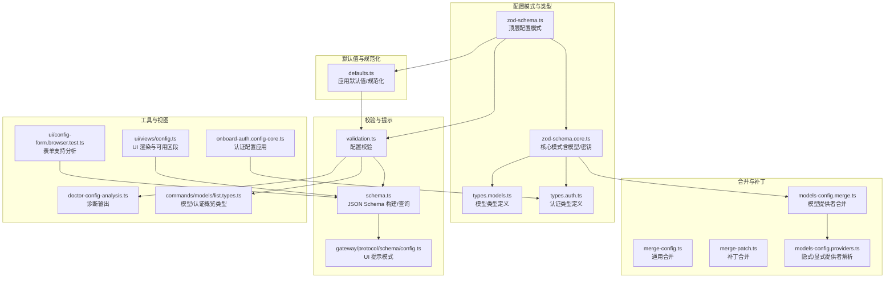
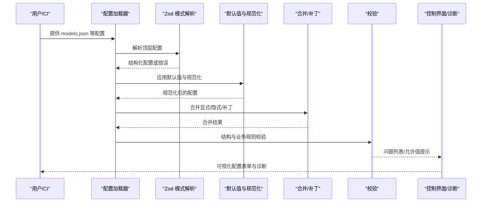
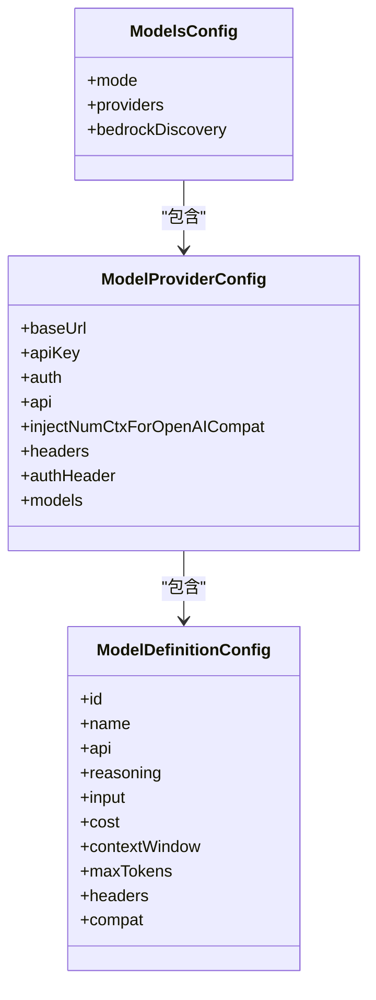
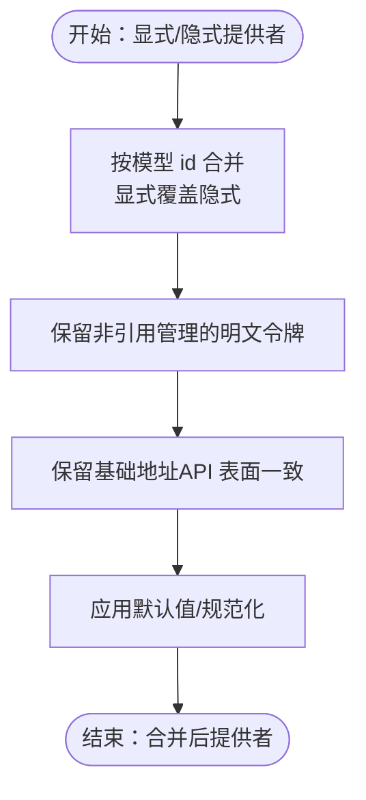
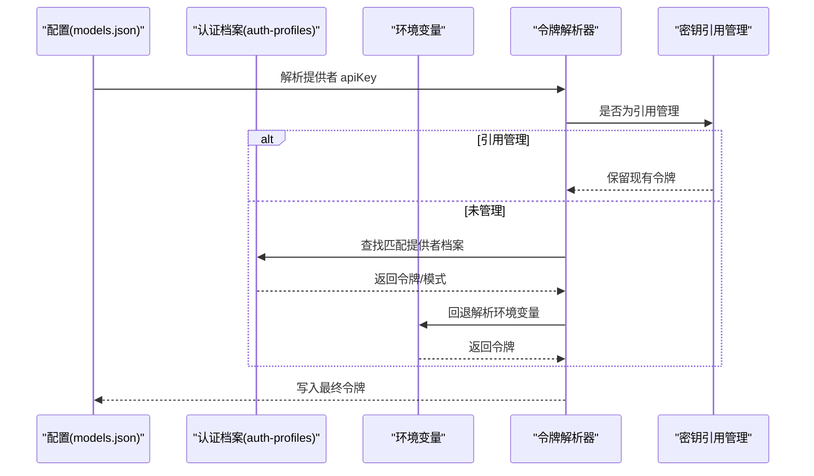
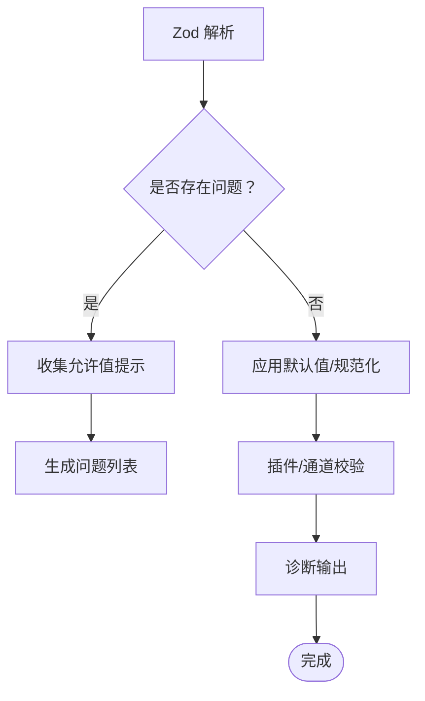
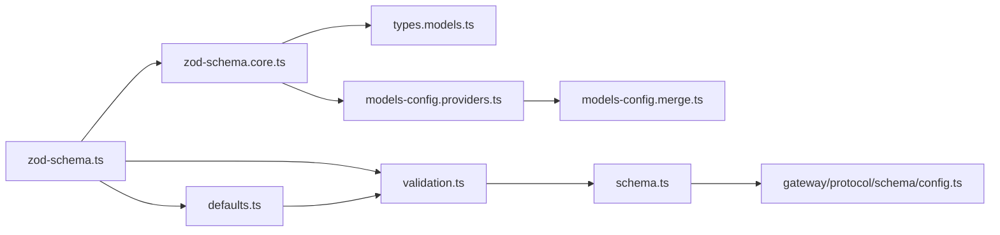

# 配置管理

<cite>
**本文引用的文件**
- [src/config/zod-schema.ts](file://src/config/zod-schema.ts)
- [src/config/zod-schema.core.ts](file://src/config/zod-schema.core.ts)
- [src/config/types.models.ts](file://src/config/types.models.ts)
- [src/config/defaults.ts](file://src/config/defaults.ts)
- [src/config/validation.ts](file://src/config/validation.ts)
- [src/config/schema.ts](file://src/config/schema.ts)
- [src/config/merge-config.ts](file://src/config/merge-config.ts)
- [src/config/merge-patch.ts](file://src/config/merge-patch.ts)
- [src/config/types.auth.ts](file://src/config/types.auth.ts)
- [src/agents/models-config.providers.ts](file://src/agents/models-config.providers.ts)
- [src/agents/models-config.merge.ts](file://src/agents/models-config.merge.ts)
- [src/commands/doctor-config-analysis.ts](file://src/commands/doctor-config-analysis.ts)
- [src/commands/models/list.types.ts](file://src/commands/models/list.types.ts)
- [src/commands/onboard-auth.config-core.ts](file://src/commands/onboard-auth.config-core.ts)
- [src/gateway/protocol/schema/config.ts](file://src/gateway/protocol/schema/config.ts)
- [ui/src/ui/config-form.browser.test.ts](file://ui/src/ui/config-form.browser.test.ts)
- [ui/src/ui/views/config.ts](file://ui/src/ui/views/config.ts)
</cite>

## 目录
1. [简介](#简介)
2. [项目结构](#项目结构)
3. [核心组件](#核心组件)
4. [架构总览](#架构总览)
5. [详细组件分析](#详细组件分析)
6. [依赖关系分析](#依赖关系分析)
7. [性能考量](#性能考量)
8. [故障排查指南](#故障排查指南)
9. [结论](#结论)
10. [附录](#附录)

## 简介
本文件面向 OpenClaw 模型配置管理系统，系统化梳理配置文件结构、合并策略、认证配置管理、验证与错误处理，并提供模板与最佳实践建议。重点围绕 models.json 的格式规范与字段定义、默认值与覆盖规则、冲突解决策略、认证凭据存储与轮换、以及配置校验与诊断流程展开。

## 项目结构
OpenClaw 的配置体系由“模式定义（Zod Schema）”“类型与默认值”“合并与补丁”“校验与提示”“模型配置解析与合并”等模块组成，形成从“静态约束”到“动态合并”的完整闭环。

图表来源
- [src/config/zod-schema.ts](file://src/config/zod-schema.ts#L206-L800)
- [src/config/zod-schema.core.ts](file://src/config/zod-schema.core.ts#L1-L732)
- [src/config/types.models.ts](file://src/config/types.models.ts#L1-L77)
- [src/config/types.auth.ts](file://src/config/types.auth.ts#L1-L29)
- [src/config/defaults.ts](file://src/config/defaults.ts#L1-L537)
- [src/config/validation.ts](file://src/config/validation.ts#L1-L605)
- [src/config/schema.ts](file://src/config/schema.ts#L1-L712)
- [src/config/merge-config.ts](file://src/config/merge-config.ts#L1-L39)
- [src/config/merge-patch.ts](file://src/config/merge-patch.ts)
- [src/agents/models-config.merge.ts](file://src/agents/models-config.merge.ts#L1-L218)
- [src/agents/models-config.providers.ts](file://src/agents/models-config.providers.ts#L1-L827)
- [src/commands/doctor-config-analysis.ts](file://src/commands/doctor-config-analysis.ts#L112-L152)
- [src/commands/models/list.types.ts](file://src/commands/models/list.types.ts#L1-L34)
- [src/commands/onboard-auth.config-core.ts](file://src/commands/onboard-auth.config-core.ts#L469-L491)
- [src/gateway/protocol/schema/config.ts](file://src/gateway/protocol/schema/config.ts#L53-L100)
- [ui/src/ui/config-form.browser.test.ts](file://ui/src/ui/config-form.browser.test.ts#L340-L359)
- [ui/src/ui/views/config.ts](file://ui/src/ui/views/config.ts#L405-L420)

章节来源
- [src/config/zod-schema.ts](file://src/config/zod-schema.ts#L206-L800)
- [src/config/zod-schema.core.ts](file://src/config/zod-schema.core.ts#L256-L263)
- [src/config/types.models.ts](file://src/config/types.models.ts#L72-L77)
- [src/config/defaults.ts](file://src/config/defaults.ts#L213-L347)
- [src/config/validation.ts](file://src/config/validation.ts#L229-L286)
- [src/config/schema.ts](file://src/config/schema.ts#L429-L484)

## 核心组件
- 模式与类型：通过 Zod 定义顶层配置结构，包含 models、auth、secrets 等核心域；模型域使用独立模式与类型定义，确保字段约束与枚举合法。
- 默认值与规范化：在不破坏用户配置的前提下，对缺失字段进行默认填充，并对模型与代理配置进行一致性规范化。
- 合并与补丁：提供通用合并函数与补丁合并策略，用于将显式配置与隐式/默认配置融合。
- 校验与提示：基于 Zod 解析与自定义规则，生成结构化问题列表；同时构建 JSON Schema 与 UI 提示，辅助控制界面与诊断工具。
- 模型配置解析：解析隐式与显式提供者，合并模型清单与令牌设置，处理覆盖与保留策略。

章节来源
- [src/config/zod-schema.ts](file://src/config/zod-schema.ts#L206-L800)
- [src/config/zod-schema.core.ts](file://src/config/zod-schema.core.ts#L256-L263)
- [src/config/defaults.ts](file://src/config/defaults.ts#L213-L347)
- [src/config/merge-config.ts](file://src/config/merge-config.ts#L8-L39)
- [src/config/merge-patch.ts](file://src/config/merge-patch.ts)
- [src/config/validation.ts](file://src/config/validation.ts#L229-L286)
- [src/config/schema.ts](file://src/config/schema.ts#L429-L484)
- [src/agents/models-config.providers.ts](file://src/agents/models-config.providers.ts#L661-L735)
- [src/agents/models-config.merge.ts](file://src/agents/models-config.merge.ts#L100-L114)

## 架构总览
下图展示从配置读取到最终生效的关键流程：模式解析 → 默认值与规范化 → 合并/补丁 → 校验与提示 → UI/诊断工具消费。

图表来源
- [src/config/zod-schema.ts](file://src/config/zod-schema.ts#L206-L800)
- [src/config/defaults.ts](file://src/config/defaults.ts#L213-L347)
- [src/config/merge-config.ts](file://src/config/merge-config.ts#L8-L39)
- [src/config/merge-patch.ts](file://src/config/merge-patch.ts)
- [src/config/validation.ts](file://src/config/validation.ts#L229-L286)
- [src/config/schema.ts](file://src/config/schema.ts#L429-L484)

## 详细组件分析

### models.json 格式规范与字段定义
- 顶级结构：包含 models 域，其下可选字段包括 mode（合并策略）、providers（提供者映射）、bedrockDiscovery（可选）。
- 提供者（Provider）：每个提供者需包含 baseUrl；可选 apiKey（支持字符串或密钥引用）、auth（认证方式）、api（接口类型）、injectNumCtxForOpenAICompat、headers（键值对，值可为密钥引用）、authHeader、models（模型数组）。
- 模型（Model）：至少包含 id、name；可选 api、reasoning、input（文本/图像）、cost（输入/输出/缓存读写成本）、contextWindow、maxTokens、headers、compat（兼容性配置）。
- 接口类型（ModelApi）：限定枚举值，如 openai-completions、openai-responses、anthropic-messages、google-generative-ai、github-copilot、bedrock-converse-stream、ollama 等。

图表来源
- [src/config/types.models.ts](file://src/config/types.models.ts#L52-L61)
- [src/config/types.models.ts](file://src/config/types.models.ts#L34-L50)
- [src/config/zod-schema.core.ts](file://src/config/zod-schema.core.ts#L256-L263)
- [src/config/zod-schema.core.ts](file://src/config/zod-schema.core.ts#L229-L242)
- [src/config/zod-schema.core.ts](file://src/config/zod-schema.core.ts#L206-L227)

章节来源
- [src/config/types.models.ts](file://src/config/types.models.ts#L72-L77)
- [src/config/zod-schema.core.ts](file://src/config/zod-schema.core.ts#L256-L263)
- [src/config/zod-schema.core.ts](file://src/config/zod-schema.core.ts#L229-L242)
- [src/config/zod-schema.core.ts](file://src/config/zod-schema.core.ts#L206-L227)

### 配置合并策略：默认值、覆盖规则与冲突解决
- 默认值应用：对模型与代理配置进行默认值填充（如 reasoning/input/cost/contextWindow/maxTokens/api），并在必要时规范化（如模型别名、API 类型推断）。
- 通用合并：针对对象字段逐项覆盖，支持对 undefined 值的删除选项，避免无意覆盖。
- 补丁合并：提供补丁合并能力，防止原型污染等风险，确保安全合并。
- 模型提供者合并：
  - 显式与隐式提供者合并：以显式配置为主，隐式提供者的模型按 id 合并，未显式声明的模型保留隐式提供者中的输入/推理等属性。
  - 令牌与基础地址保留：当提供者未显式设置 apiKey/baseUrl 或其 API 表面一致时，保留现有配置，避免无谓覆盖。
  - 令牌引用管理：若提供者由密钥引用管理，则不覆盖其已存在的明文令牌，除非显式指定。

图表来源
- [src/agents/models-config.merge.ts](file://src/agents/models-config.merge.ts#L36-L98)
- [src/agents/models-config.merge.ts](file://src/agents/models-config.merge.ts#L182-L217)
- [src/config/merge-config.ts](file://src/config/merge-config.ts#L8-L24)
- [src/config/merge-patch.ts](file://src/config/merge-patch.ts)
- [src/config/defaults.ts](file://src/config/defaults.ts#L213-L347)

章节来源
- [src/config/defaults.ts](file://src/config/defaults.ts#L213-L347)
- [src/config/merge-config.ts](file://src/config/merge-config.ts#L8-L39)
- [src/config/merge-patch.ts](file://src/config/merge-patch.ts)
- [src/agents/models-config.merge.ts](file://src/agents/models-config.merge.ts#L100-L114)
- [src/agents/models-config.merge.ts](file://src/agents/models-config.merge.ts#L182-L217)

### 认证配置管理：API 密钥存储、轮换机制与安全策略
- 认证配置结构：支持 profiles（按提供者分组的凭据档案）、order（提供者下的优先顺序）、cooldowns（账单退避与失败窗口）。
- 凭据来源：支持 api_key/oauth/token 三种模式；令牌可来自环境变量、文件或外部命令执行器。
- 轮换与安全：
  - 令牌引用：支持将令牌以密钥引用形式存储，避免明文写入配置文件。
  - 引用标记：对非环境变量引用使用特定标记，便于在持久化时识别与替换。
  - 环境变量回退：当提供者未显式配置 apiKey 且存在模型清单时，自动从环境或认证档案中回退解析。
  - 令牌保留策略：若提供者由密钥引用管理，且已有非空明文令牌，将保留该令牌，避免覆盖。

图表来源
- [src/config/types.auth.ts](file://src/config/types.auth.ts#L1-L29)
- [src/config/zod-schema.core.ts](file://src/config/zod-schema.core.ts#L150-L181)
- [src/agents/models-config.providers.ts](file://src/agents/models-config.providers.ts#L315-L396)
- [src/agents/models-config.providers.ts](file://src/agents/models-config.providers.ts#L131-L203)
- [src/agents/models-config.merge.ts](file://src/agents/models-config.merge.ts#L148-L180)
- [src/commands/onboard-auth.config-core.ts](file://src/commands/onboard-auth.config-core.ts#L469-L491)

章节来源
- [src/config/types.auth.ts](file://src/config/types.auth.ts#L13-L29)
- [src/config/zod-schema.core.ts](file://src/config/zod-schema.core.ts#L150-L181)
- [src/agents/models-config.providers.ts](file://src/agents/models-config.providers.ts#L315-L396)
- [src/agents/models-config.merge.ts](file://src/agents/models-config.merge.ts#L148-L180)
- [src/commands/onboard-auth.config-core.ts](file://src/commands/onboard-auth.config-core.ts#L469-L491)

### 配置验证与错误处理：语法检查、有效性验证与故障诊断
- 语法检查：基于 Zod 模式解析，生成结构化问题列表；支持收集允许值集合，增强诊断提示。
- 有效性验证：
  - 代理头像路径限制：仅允许工作区内相对路径、HTTP(S) URL 或数据 URI。
  - 网关绑定与 Tailscale：当启用 serve/funnel 时，绑定必须为本地回环。
  - 插件与通道：校验未知通道与心跳目标合法性；缺失插件以警告形式提示，移除插件以警告提示。
- 诊断输出：提供诊断工具输出，提示 include 路径越界、OpenCode Zen 覆盖等场景。

图表来源
- [src/config/validation.ts](file://src/config/validation.ts#L229-L286)
- [src/config/validation.ts](file://src/config/validation.ts#L148-L196)
- [src/config/validation.ts](file://src/config/validation.ts#L198-L223)
- [src/config/validation.ts](file://src/config/validation.ts#L308-L306)
- [src/commands/doctor-config-analysis.ts](file://src/commands/doctor-config-analysis.ts#L112-L152)

章节来源
- [src/config/validation.ts](file://src/config/validation.ts#L229-L286)
- [src/config/validation.ts](file://src/config/validation.ts#L148-L196)
- [src/config/validation.ts](file://src/config/validation.ts#L198-L223)
- [src/config/validation.ts](file://src/config/validation.ts#L308-L306)
- [src/commands/doctor-config-analysis.ts](file://src/commands/doctor-config-analysis.ts#L112-L152)

### 配置模板与最佳实践
- 多环境配置：
  - 使用 include 机制组织共享片段，确保 include 路径位于配置目录内。
  - 通过环境变量与密钥引用区分开发/生产环境，避免明文写入。
- 团队协作规范：
  - 统一提供者命名与模型别名，减少歧义。
  - 对敏感字段使用密钥引用，定期轮换令牌并更新档案。
  - 在 CI 中运行校验与诊断，提前发现配置问题。

章节来源
- [src/commands/doctor-config-analysis.ts](file://src/commands/doctor-config-analysis.ts#L130-L152)
- [ui/src/ui/config-form.browser.test.ts](file://ui/src/ui/config-form.browser.test.ts#L340-L359)
- [ui/src/ui/views/config.ts](file://ui/src/ui/views/config.ts#L405-L420)

## 依赖关系分析
- 模式层依赖：顶层配置依赖核心模式（模型/密钥/通道等），模型域进一步依赖类型定义。
- 合并层依赖：模型提供者合并依赖隐式/显式解析与令牌解析逻辑。
- 校验层依赖：校验依赖模式解析、默认值应用与插件注册表信息。
- UI 层依赖：控制界面依赖 JSON Schema 与 UI 提示，用于渲染与交互。

图表来源
- [src/config/zod-schema.ts](file://src/config/zod-schema.ts#L206-L800)
- [src/config/zod-schema.core.ts](file://src/config/zod-schema.core.ts#L256-L263)
- [src/config/types.models.ts](file://src/config/types.models.ts#L1-L77)
- [src/config/defaults.ts](file://src/config/defaults.ts#L213-L347)
- [src/config/validation.ts](file://src/config/validation.ts#L229-L286)
- [src/agents/models-config.providers.ts](file://src/agents/models-config.providers.ts#L661-L735)
- [src/agents/models-config.merge.ts](file://src/agents/models-config.merge.ts#L100-L114)
- [src/config/schema.ts](file://src/config/schema.ts#L429-L484)
- [src/gateway/protocol/schema/config.ts](file://src/gateway/protocol/schema/config.ts#L53-L100)

章节来源
- [src/config/zod-schema.ts](file://src/config/zod-schema.ts#L206-L800)
- [src/config/zod-schema.core.ts](file://src/config/zod-schema.core.ts#L256-L263)
- [src/config/defaults.ts](file://src/config/defaults.ts#L213-L347)
- [src/config/validation.ts](file://src/config/validation.ts#L229-L286)
- [src/agents/models-config.providers.ts](file://src/agents/models-config.providers.ts#L661-L735)
- [src/agents/models-config.merge.ts](file://src/agents/models-config.merge.ts#L100-L114)
- [src/config/schema.ts](file://src/config/schema.ts#L429-L484)
- [src/gateway/protocol/schema/config.ts](file://src/gateway/protocol/schema/config.ts#L53-L100)

## 性能考量
- 模式构建缓存：JSON Schema 合并与提示构建采用缓存机制，降低重复计算开销。
- 校验与提示：通过结构化问题收集与允许值汇总，减少 UI 重复渲染与无效请求。
- 合并策略：仅在必要时进行深层合并，避免对大配置树的全量扫描。

## 故障排查指南
- 语法错误：根据 Zod 生成的问题路径与消息定位字段，结合允许值提示快速修正。
- 通道/心跳目标错误：检查通道 ID 与心跳目标是否在允许集合内，必要时扩展插件注册表。
- 包含路径越界：确保 include 路径位于配置根目录下，避免越界访问。
- OpenCode Zen 覆盖：当显式提供者覆盖内置目录时，可能影响 per-model API 路由与计费，建议移除覆盖项并重新引导。

章节来源
- [src/config/validation.ts](file://src/config/validation.ts#L229-L286)
- [src/commands/doctor-config-analysis.ts](file://src/commands/doctor-config-analysis.ts#L112-L152)

## 结论
OpenClaw 的配置管理体系以强约束的模式定义为基础，配合默认值与规范化、安全的合并与补丁策略、完善的校验与诊断能力，实现了从“可配置”到“可维护”的闭环。通过密钥引用与令牌保留策略，兼顾了安全性与灵活性；通过 UI 提示与诊断工具，提升了团队协作效率与问题定位速度。

## 附录
- 模型/认证概览类型：用于命令行与 UI 展示提供者有效载荷、环境与 models.json 来源等信息。
- 控制界面集成：UI 侧通过 JSON Schema 分析可用区段与不支持路径，确保表单渲染与提示准确。

章节来源
- [src/commands/models/list.types.ts](file://src/commands/models/list.types.ts#L19-L34)
- [ui/src/ui/config-form.browser.test.ts](file://ui/src/ui/config-form.browser.test.ts#L340-L359)
- [ui/src/ui/views/config.ts](file://ui/src/ui/views/config.ts#L405-L420)