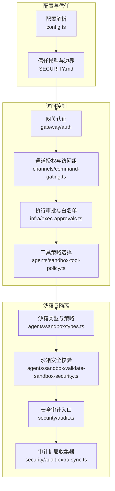
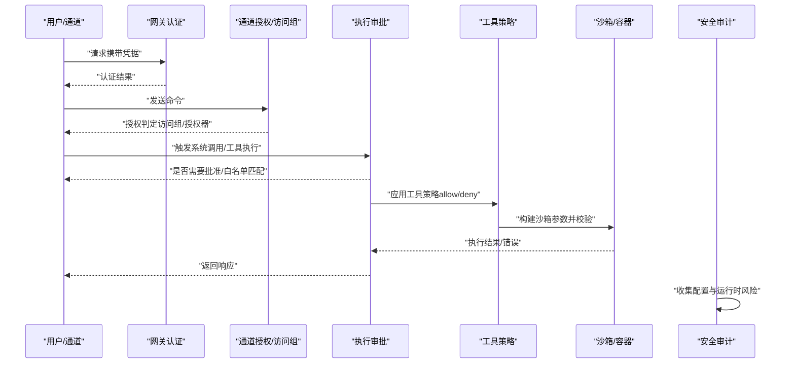
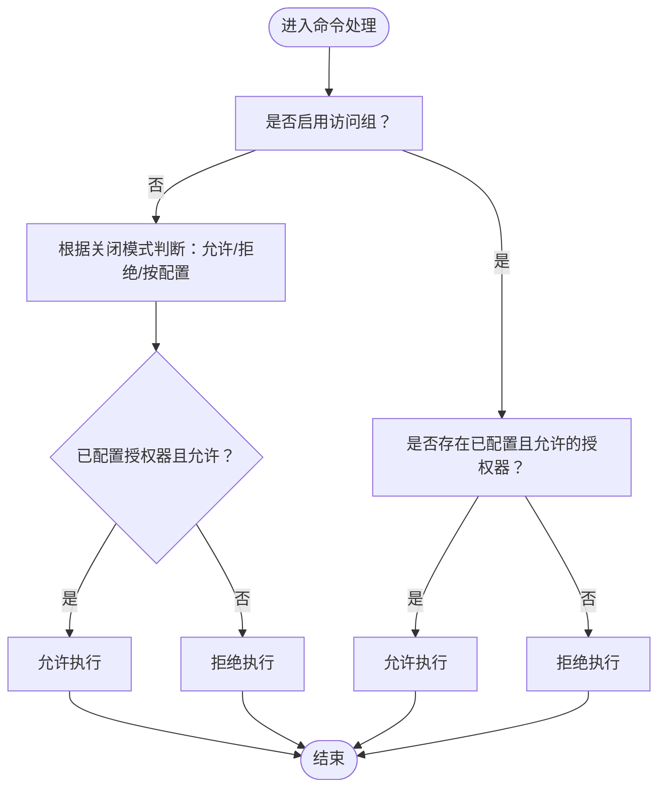
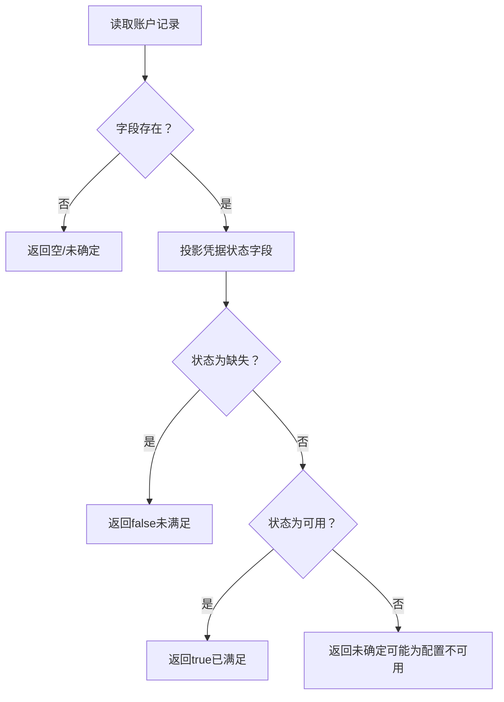
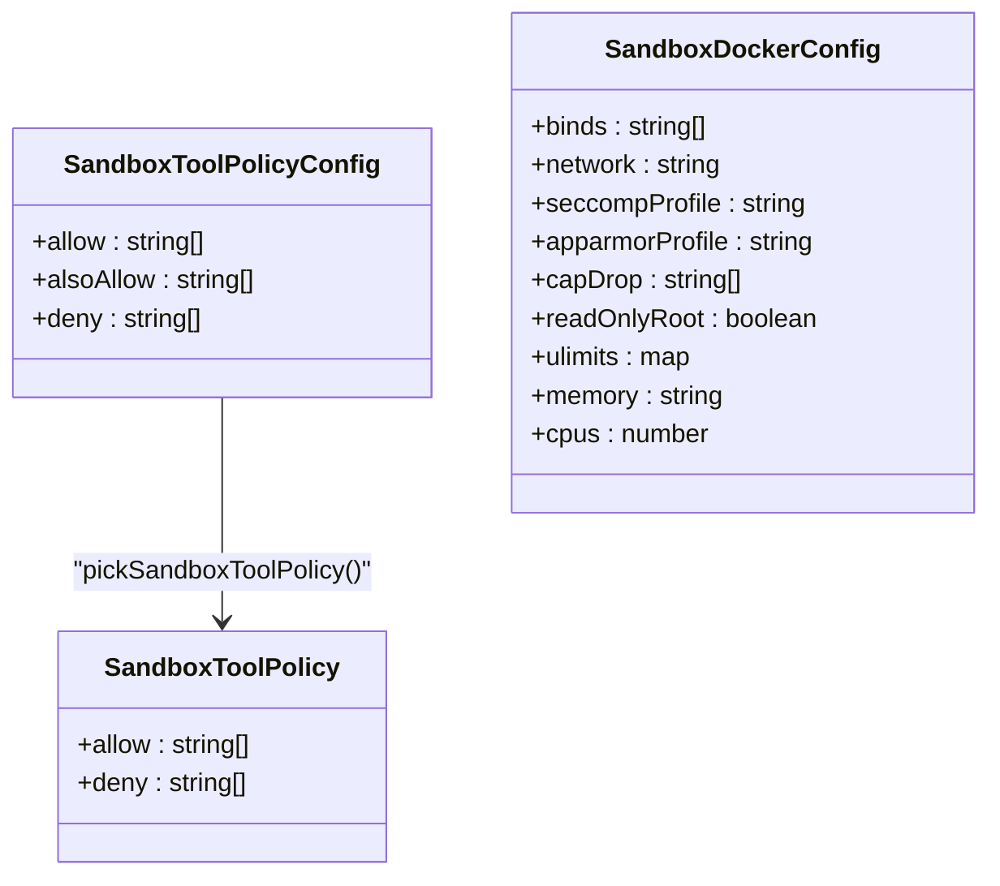
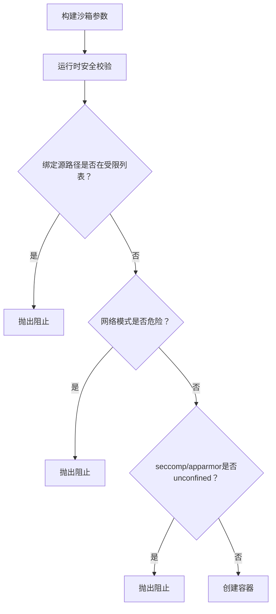
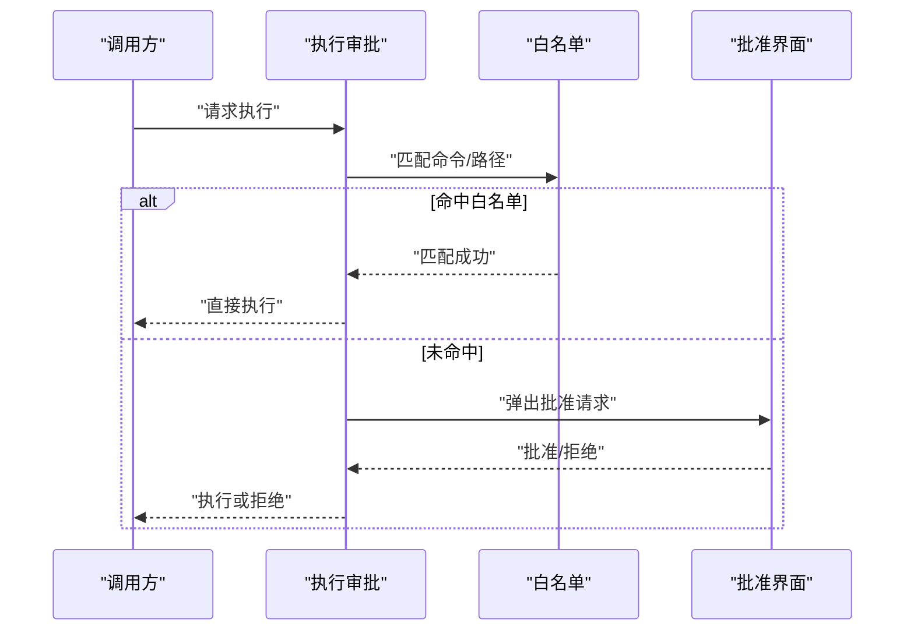
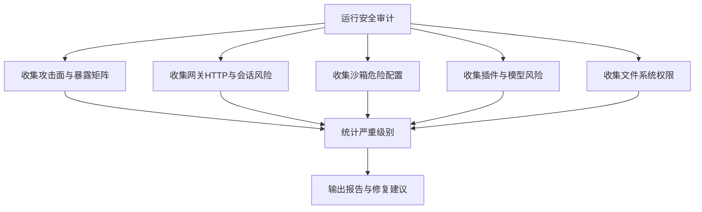

# 安全策略与权限控制

<cite>
**本文引用的文件**
- [SECURITY.md](file://SECURITY.md)
- [audit.ts](file://src/security/audit.ts)
- [audit-extra.sync.ts](file://src/security/audit-extra.sync.ts)
- [validate-sandbox-security.ts](file://src/agents/sandbox/validate-sandbox-security.ts)
- [sandbox-tool-policy.ts](file://src/agents/sandbox-tool-policy.ts)
- [types.ts](file://src/agents/sandbox/types.ts)
- [exec-approvals.ts](file://src/infra/exec-approvals.ts)
- [command-gating.ts](file://src/channels/command-gating.ts)
- [config.ts](file://src/config/config.ts)
- [secretref-credential-surface.md](file://docs/reference/secretref-credential-surface.md)
- [status.command.ts](file://src/commands/status.command.ts)
- [THREAT-MODEL-ATLAS.md](file://docs/security/THREAT-MODEL-ATLAS.md)
</cite>

## 目录
1. [简介](#简介)
2. [项目结构](#项目结构)
3. [核心组件](#核心组件)
4. [架构总览](#架构总览)
5. [详细组件分析](#详细组件分析)
6. [依赖关系分析](#依赖关系分析)
7. [性能考量](#性能考量)
8. [故障排查指南](#故障排查指南)
9. [结论](#结论)
10. [附录](#附录)

## 简介
本文件面向OpenClaw的安全策略与权限控制系统，聚焦代理的安全架构、身份验证与授权控制、访问管理、认证配置文件系统（多账户管理、凭据轮换与安全存储）、路径与工具策略（文件系统访问控制、网络访问限制、系统调用防护）、沙箱隔离机制（进程隔离、资源限制、安全边界）以及安全配置最佳实践（最小权限、安全审计与合规检查）。同时提供安全事件监控与威胁检测的实施建议。

## 项目结构
OpenClaw在多个层面实现安全控制：
- 配置与信任模型：通过配置文件定义信任边界、执行模式与默认策略。
- 沙箱与容器：对工具执行进行容器化隔离，限制网络、文件系统与内核能力。
- 访问控制：基于工具策略与执行审批，实现“最小权限+显式批准”的执行控制。
- 身份验证与授权：通过网关认证、通道授权器与访问组策略，控制命令与操作的可用性。
- 凭据与密钥：集中化的凭据表面与安全存储策略，支持凭据轮换与审计。

**图表来源**
- [config.ts](file://src/config/config.ts#L1-L28)
- [SECURITY.md](file://SECURITY.md#L88-L170)
- [command-gating.ts](file://src/channels/command-gating.ts#L1-L45)
- [exec-approvals.ts](file://src/infra/exec-approvals.ts#L1-L200)
- [sandbox-tool-policy.ts](file://src/agents/sandbox-tool-policy.ts#L1-L38)
- [types.ts](file://src/agents/sandbox/types.ts#L1-L91)
- [validate-sandbox-security.ts](file://src/agents/sandbox/validate-sandbox-security.ts#L1-L306)
- [audit.ts](file://src/security/audit.ts#L1-L200)
- [audit-extra.sync.ts](file://src/security/audit-extra.sync.ts#L804-L901)

**章节来源**
- [config.ts](file://src/config/config.ts#L1-L28)
- [SECURITY.md](file://SECURITY.md#L88-L170)

## 核心组件
- 信任模型与边界：明确“单用户受信操作员”模型，强调会话标识仅作路由控制而非多租户授权边界；插件为受信计算基；工作区与内存文件为受信本地状态。
- 身份验证与授权：网关认证作为受信操作员入口；通道侧通过访问组与授权器控制文本命令；控制命令在未授权时可被阻断。
- 执行审批与工具策略：默认拒绝执行（deny），允许通过白名单或显式批准；工具策略支持通配符与叠加规则；沙箱工具策略可合并全局与代理级配置。
- 沙箱与容器安全：严格禁止危险绑定挂载、host网络、容器命名空间加入、unconfined seccomp/apparmor等；强制资源限制与只读根文件系统。
- 安全审计：统一入口收集攻击面、网关暴露、沙箱危险配置、插件与模型风险、文件系统权限等发现项，并输出严重级别与修复建议。

**章节来源**
- [SECURITY.md](file://SECURITY.md#L88-L170)
- [command-gating.ts](file://src/channels/command-gating.ts#L1-L45)
- [exec-approvals.ts](file://src/infra/exec-approvals.ts#L1-L200)
- [sandbox-tool-policy.ts](file://src/agents/sandbox-tool-policy.ts#L1-L38)
- [types.ts](file://src/agents/sandbox/types.ts#L1-L91)
- [validate-sandbox-security.ts](file://src/agents/sandbox/validate-sandbox-security.ts#L1-L306)
- [audit.ts](file://src/security/audit.ts#L1131-L1156)

## 架构总览
下图展示从配置到执行的关键路径与安全控制点：

**图表来源**
- [command-gating.ts](file://src/channels/command-gating.ts#L31-L45)
- [exec-approvals.ts](file://src/infra/exec-approvals.ts#L482-L521)
- [sandbox-tool-policy.ts](file://src/agents/sandbox-tool-policy.ts#L21-L37)
- [validate-sandbox-security.ts](file://src/agents/sandbox/validate-sandbox-security.ts#L283-L306)
- [audit.ts](file://src/security/audit.ts#L1131-L1156)

## 详细组件分析

### 身份验证与授权控制
- 网关认证：认证通过后视为受信操作员，会话标识仅用于路由，不构成多租户授权边界。
- 通道授权与访问组：当启用访问组时，需配置授权器；若未配置授权器则按策略拒绝；支持“关闭时允许/拒绝/按配置”三种模式。
- 控制命令阻断：当允许文本命令但无授权时，阻断控制命令执行。

**图表来源**
- [command-gating.ts](file://src/channels/command-gating.ts#L8-L29)

**章节来源**
- [SECURITY.md](file://SECURITY.md#L88-L103)
- [command-gating.ts](file://src/channels/command-gating.ts#L1-L45)

### 认证配置文件系统（多账户、凭据轮换与安全存储）
- 多账户管理：通道账户条目支持多账号字段清理与存在性判定，便于切换与轮换。
- 凭据轮换：通过“已配置不可用”状态与“可用”状态投影，识别凭据生命周期阶段。
- 安全存储策略：凭据表面清单定义可由secrets命令配置/审计的键路径，避免将运行时生成或轮换中的凭据纳入支持范围。

**图表来源**
- [account-snapshot-fields.ts](file://src/channels/account-snapshot-fields.ts#L80-L181)

**章节来源**
- [secretref-credential-surface.md](file://docs/reference/secretref-credential-surface.md#L1-L89)
- [account-snapshot-fields.ts](file://src/channels/account-snapshot-fields.ts#L80-L181)

### 路径策略与工具策略
- 工具策略选择：支持allow/deny列表，alsoAllow在无显式allow时视为在隐式允许全部基础上叠加；通配符与apply_patch特殊处理。
- 路径与文件系统访问：沙箱绑定挂载严格限制，禁止危险源路径与保留目标路径；支持外部源路径与保留目标路径的危险开关（仅在完全信任时使用）。
- 网络访问限制：严格禁止host网络与容器命名空间加入；自定义桥接网络或明确危险开关为例外。
- 系统调用防护：禁止unconfined seccomp与apparmor；强制cap-drop ALL、只读根文件系统、资源限制与DNS/hosts白名单。

**图表来源**
- [sandbox-tool-policy.ts](file://src/agents/sandbox-tool-policy.ts#L3-L37)
- [validate-sandbox-security.ts](file://src/agents/sandbox/validate-sandbox-security.ts#L16-L37)

**章节来源**
- [sandbox-tool-policy.ts](file://src/agents/sandbox-tool-policy.ts#L1-L38)
- [validate-sandbox-security.ts](file://src/agents/sandbox/validate-sandbox-security.ts#L1-L306)

### 沙箱隔离机制
- 进程隔离：容器网络默认none，禁止host与容器命名空间加入；必要时使用自定义桥接网络。
- 资源限制：强制cap-drop ALL、只读根文件系统、内存/CPU/句柄/进程数限制、临时文件系统挂载。
- 安全边界：禁止敏感宿主路径绑定；保留目标路径（如/workspace）保护；校验绑定规范与符号链接逃逸加固。

**图表来源**
- [validate-sandbox-security.ts](file://src/agents/sandbox/validate-sandbox-security.ts#L283-L306)
- [audit-extra.sync.ts](file://src/security/audit-extra.sync.ts#L884-L901)

**章节来源**
- [validate-sandbox-security.ts](file://src/agents/sandbox/validate-sandbox-security.ts#L1-L306)
- [audit-extra.sync.ts](file://src/security/audit-extra.sync.ts#L822-L901)

### 执行审批与最小权限
- 默认安全策略：执行安全等级deny，除非白名单命中或显式批准。
- 白名单与分析：支持正则模式匹配与使用记录；miss时可按ask策略触发批准。
- 命令授权：结合工具策略与执行审批，确保最小权限与可追溯。

**图表来源**
- [exec-approvals.ts](file://src/infra/exec-approvals.ts#L482-L521)

**章节来源**
- [exec-approvals.ts](file://src/infra/exec-approvals.ts#L1-L200)
- [exec-approvals.ts](file://src/infra/exec-approvals.ts#L482-L521)

### 安全审计与合规检查
- 统一入口：收集攻击面、网关暴露、沙箱危险配置、插件与模型风险、文件系统权限等。
- 发现分级：critical/warn/info三档；CLI输出重要发现摘要与修复建议。
- 深度探测：可选对网关进行探测，记录尝试、URL、连通性与关闭原因。

**图表来源**
- [audit.ts](file://src/security/audit.ts#L1131-L1156)
- [status.command.ts](file://src/commands/status.command.ts#L473-L508)

**章节来源**
- [audit.ts](file://src/security/audit.ts#L1-L200)
- [audit.ts](file://src/security/audit.ts#L1131-L1156)
- [status.command.ts](file://src/commands/status.command.ts#L473-L508)

## 依赖关系分析
- 配置层：config.ts导出配置加载与校验接口，为信任模型与策略解析提供基础。
- 沙箱层：types.ts定义沙箱配置与工具策略数据结构；validate-sandbox-security.ts在运行时强制安全约束；sandbox-tool-policy.ts负责策略合并。
- 授权层：command-gating.ts在通道侧实现访问组与授权器逻辑；exec-approvals.ts在执行前进行白名单与批准决策。
- 审计层：audit.ts聚合各模块发现；audit-extra.sync.ts提供具体收集器，覆盖文件系统、网关、沙箱、插件等。

```mermaid
graph LR
CFG["config.ts"] --> TRUST["SECURITY.md"]
TRUST --> AUTH["网关认证"]
AUTH --> GATE["command-gating.ts"]
GATE --> APPROVAL["exec-approvals.ts"]
APPROVAL --> TOOLPOL["sandbox-tool-policy.ts"]
TOOLPOL --> SB_TYPES["types.ts"]
SB_TYPES --> SB_VALIDATE["validate-sandbox-security.ts"]
AUDIT["audit.ts"] --> AUDIT_EXTRA["audit-extra.sync.ts"]
SB_VALIDATE --> AUDIT
```

**图表来源**
- [config.ts](file://src/config/config.ts#L1-L28)
- [SECURITY.md](file://SECURITY.md#L88-L170)
- [command-gating.ts](file://src/channels/command-gating.ts#L1-L45)
- [exec-approvals.ts](file://src/infra/exec-approvals.ts#L1-L200)
- [sandbox-tool-policy.ts](file://src/agents/sandbox-tool-policy.ts#L1-L38)
- [types.ts](file://src/agents/sandbox/types.ts#L1-L91)
- [validate-sandbox-security.ts](file://src/agents/sandbox/validate-sandbox-security.ts#L1-L306)
- [audit.ts](file://src/security/audit.ts#L1-L200)
- [audit-extra.sync.ts](file://src/security/audit-extra.sync.ts#L804-L901)

**章节来源**
- [config.ts](file://src/config/config.ts#L1-L28)
- [audit.ts](file://src/security/audit.ts#L1-L200)

## 性能考量
- 沙箱启动成本：容器创建与安全校验带来额外开销；建议在需要隔离的场景启用非main/all模式，避免不必要的容器化。
- 执行审批延迟：批准流程引入交互延迟；可通过白名单减少miss频率，降低人工干预。
- 审计扫描范围：深度审计对网关探测与代码安全性评估耗时较长；建议在CI/离线场景使用浅层审计，在生产环境定期运行深层审计。

## 故障排查指南
- 沙箱创建失败
  - 检查危险网络模式（host、container:*）、unconfined seccomp/apparmor、危险绑定挂载与保留目标路径。
  - 参考运行时安全校验错误信息与审计发现，调整配置或开启危险开关（仅在完全信任时）。
- 执行被拒绝
  - 确认工具策略是否允许该工具；检查白名单是否命中；必要时发起批准请求。
- 权限与多用户风险
  - 审计文件系统权限，修正world-readable/writable；避免共享主机/配置的多用户部署。
- 威胁检测与事件监控
  - 使用安全审计输出的发现项与严重级别，建立告警阈值；对关键发现（如危险沙箱配置、网关暴露）立即修复。

**章节来源**
- [validate-sandbox-security.ts](file://src/agents/sandbox/validate-sandbox-security.ts#L283-L306)
- [audit.ts](file://src/security/audit.ts#L1131-L1156)
- [status.command.ts](file://src/commands/status.command.ts#L473-L508)

## 结论
OpenClaw通过“受信操作员+最小权限+显式批准+容器沙箱”的组合实现安全控制。信任模型明确了边界，通道授权与访问组强化了入站控制，执行审批与工具策略确保出站最小化，沙箱与容器安全校验提供强隔离与资源限制，安全审计贯穿始终以持续发现与修复风险。遵循本文最佳实践与实施指南，可在个人助理与企业共享场景中获得稳健的安全保障。

## 附录
- 威胁模型参考：包含初始访问、持久化、影响等类别与残余风险评估，指导缓解措施制定。
- 安全扫描：推荐使用detect-secrets进行机密泄露扫描，并结合安全审计与合规检查。

**章节来源**
- [THREAT-MODEL-ATLAS.md](file://docs/security/THREAT-MODEL-ATLAS.md#L168-L604)
- [SECURITY.md](file://SECURITY.md#L275-L286)