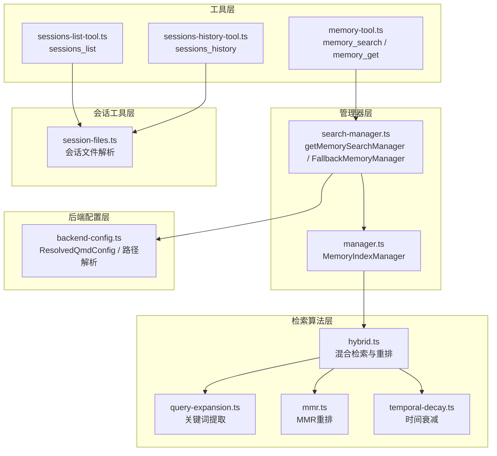
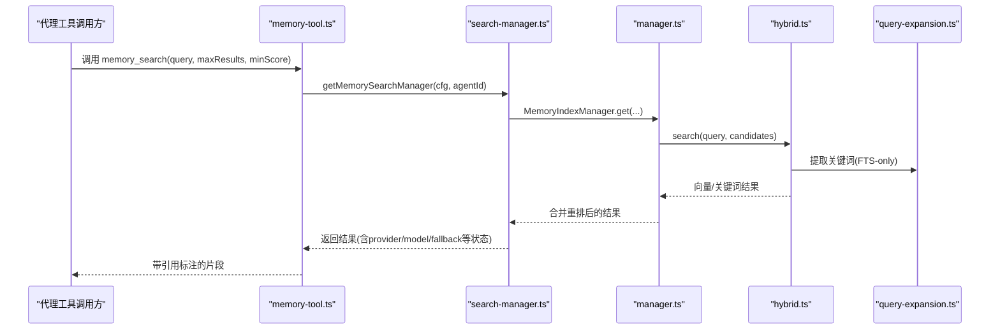
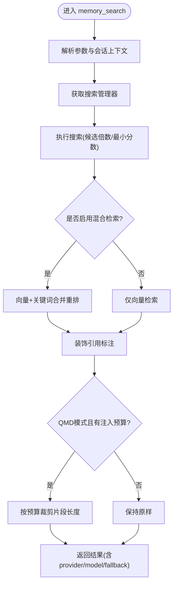
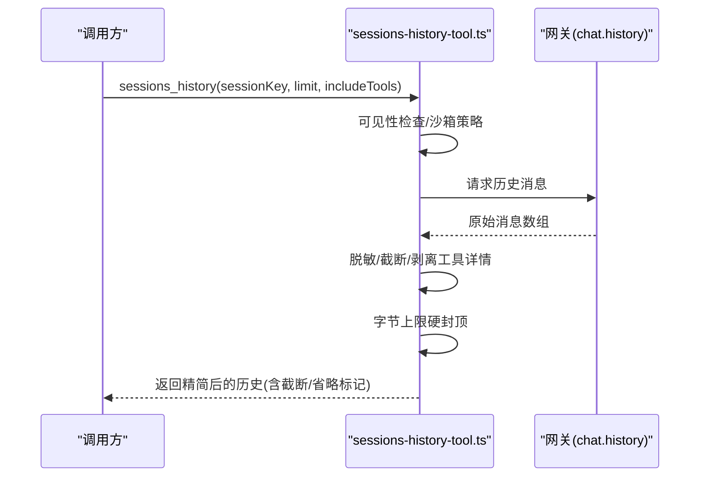
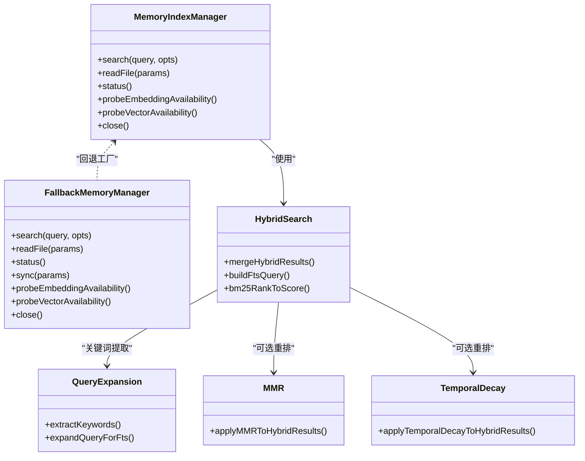
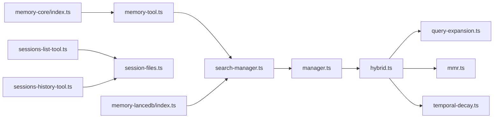

# 内存工具

<cite>
**本文引用的文件**
- [src/agents/tools/memory-tool.ts](file://src/agents/tools/memory-tool.ts)
- [src/memory/manager.ts](file://src/memory/manager.ts)
- [src/memory/search-manager.ts](file://src/memory/search-manager.ts)
- [src/memory/backend-config.ts](file://src/memory/backend-config.ts)
- [src/memory/hybrid.ts](file://src/memory/hybrid.ts)
- [src/memory/query-expansion.ts](file://src/memory/query-expansion.ts)
- [src/memory/mmr.ts](file://src/memory/mmr.ts)
- [src/memory/temporal-decay.ts](file://src/memory/temporal-decay.ts)
- [src/memory/session-files.ts](file://src/memory/session-files.ts)
- [src/agents/tools/sessions-list-tool.ts](file://src/agents/tools/sessions-list-tool.ts)
- [src/agents/tools/sessions-history-tool.ts](file://src/agents/tools/sessions-history-tool.ts)
- [extensions/memory-core/index.ts](file://extensions/memory-core/index.ts)
- [extensions/memory-lancedb/index.ts](file://extensions/memory-lancedb/index.ts)
</cite>

## 目录
1. [简介](#简介)
2. [项目结构](#项目结构)
3. [核心组件](#核心组件)
4. [架构总览](#架构总览)
5. [详细组件分析](#详细组件分析)
6. [依赖关系分析](#依赖关系分析)
7. [性能考量](#性能考量)
8. [故障排除指南](#故障排除指南)
9. [结论](#结论)
10. [附录](#附录)

## 简介
本文件面向OpenClaw内存工具，系统性阐述以下能力与实现细节：
- 内存搜索工具：memory_search（语义检索 + 关键词检索 + 混合重排）
- 内存读取工具：memory_get（安全按行读取片段）
- 会话历史工具：sessions_history（跨会话消息历史读取与隐私保护）
- 会话列表工具：sessions_list（按类型/活跃度筛选并可选加载最后消息）
- 记忆检索算法：向量检索、关键词检索、混合重排、MMR多样性重排、时间衰减
- 索引机制：SQLite内置FTS与向量扩展、嵌入缓存、增量同步与只读恢复
- 查询优化策略：候选集倍数、最小分数过滤、注入字符限制、批处理与并发控制
- 数据持久化与缓存：SQLite数据库、嵌入缓存表、会话文件解析与哈希
- 隐私保护：敏感信息脱敏、历史内容截断、工具结果剥离、字节上限硬封顶
- 实际使用示例：会话管理与状态跟踪、CLI与插件集成
- 性能调优与故障排除：超时与配额处理、向量可用性探测、批量失败熔断

## 项目结构
OpenClaw内存工具由“工具层”“管理器层”“后端配置层”“检索算法层”“会话工具层”构成，形成清晰分层与职责分离。

图示来源
- [src/agents/tools/memory-tool.ts](file://src/agents/tools/memory-tool.ts#L1-L243)
- [src/memory/search-manager.ts](file://src/memory/search-manager.ts#L1-L253)
- [src/memory/manager.ts](file://src/memory/manager.ts#L1-L803)
- [src/memory/hybrid.ts](file://src/memory/hybrid.ts#L1-L156)
- [src/memory/query-expansion.ts](file://src/memory/query-expansion.ts#L1-L811)
- [src/memory/mmr.ts](file://src/memory/mmr.ts#L1-L215)
- [src/memory/temporal-decay.ts](file://src/memory/temporal-decay.ts#L1-L168)
- [src/memory/session-files.ts](file://src/memory/session-files.ts#L1-L132)
- [src/memory/backend-config.ts](file://src/memory/backend-config.ts#L1-L355)

章节来源
- [src/agents/tools/memory-tool.ts](file://src/agents/tools/memory-tool.ts#L1-L243)
- [src/memory/manager.ts](file://src/memory/manager.ts#L1-L803)
- [src/memory/search-manager.ts](file://src/memory/search-manager.ts#L1-L253)
- [src/memory/backend-config.ts](file://src/memory/backend-config.ts#L1-L355)
- [src/memory/hybrid.ts](file://src/memory/hybrid.ts#L1-L156)
- [src/memory/query-expansion.ts](file://src/memory/query-expansion.ts#L1-L811)
- [src/memory/mmr.ts](file://src/memory/mmr.ts#L1-L215)
- [src/memory/temporal-decay.ts](file://src/memory/temporal-decay.ts#L1-L168)
- [src/memory/session-files.ts](file://src/memory/session-files.ts#L1-L132)
- [src/agents/tools/sessions-list-tool.ts](file://src/agents/tools/sessions-list-tool.ts#L1-L259)
- [src/agents/tools/sessions-history-tool.ts](file://src/agents/tools/sessions-history-tool.ts#L1-L271)

## 核心组件
- 内存搜索工具（memory_search）
  - 参数：query、maxResults、minScore
  - 行为：根据配置选择QMD或内置索引；支持会话热身；返回带引用标注的片段；支持注入字符限制裁剪
- 内存读取工具（memory_get）
  - 参数：path、from、lines
  - 行为：安全读取指定Markdown片段，支持从行号开始读取若干行
- 会话历史工具（sessions_history）
  - 参数：sessionKey、limit、includeTools
  - 行为：跨会话读取消息历史，进行敏感信息脱敏、内容截断、工具详情剥离、字节上限硬封顶
- 会话列表工具（sessions_list）
  - 参数：kinds、limit、activeMinutes、messageLimit
  - 行为：按类型/活跃度筛选，可并发加载最后N条消息，支持沙箱可见性策略

章节来源
- [src/agents/tools/memory-tool.ts](file://src/agents/tools/memory-tool.ts#L40-L140)
- [src/agents/tools/sessions-list-tool.ts](file://src/agents/tools/sessions-list-tool.ts#L26-L31)
- [src/agents/tools/sessions-history-tool.ts](file://src/agents/tools/sessions-history-tool.ts#L20-L27)
- [extensions/memory-core/index.ts](file://extensions/memory-core/index.ts#L1-L38)

## 架构总览
OpenClaw内存工具采用“工具层-管理器层-后端配置层-检索算法层”的分层架构，并通过回退管理器在QMD不可用时自动切换至内置索引。

图示来源
- [src/agents/tools/memory-tool.ts](file://src/agents/tools/memory-tool.ts#L55-L98)
- [src/memory/search-manager.ts](file://src/memory/search-manager.ts#L25-L86)
- [src/memory/manager.ts](file://src/memory/manager.ts#L256-L364)
- [src/memory/hybrid.ts](file://src/memory/hybrid.ts#L57-L155)
- [src/memory/query-expansion.ts](file://src/memory/query-expansion.ts#L735-L780)

## 详细组件分析

### 组件A：内存搜索与读取工具（memory_search / memory_get）
- 设计要点
  - 工具参数校验与默认值处理
  - 会话上下文解析与引用标注开关（auto/always/never）
  - 注入字符限制裁剪（QMD模式）
  - 错误处理与配额/限流提示
- 执行流程
  - 解析工具上下文（配置+会话键）
  - 获取搜索管理器（QMD优先，失败回退内置）
  - 执行搜索（候选集倍数、最小分数、混合检索）
  - 结果装饰（引用标注）与裁剪
  - 返回包含provider/model/fallback/status等元信息
- 安全与隐私
  - 引用标注仅在直接聊天中默认开启
  - 失败时返回禁用标记与建议操作

图示来源
- [src/agents/tools/memory-tool.ts](file://src/agents/tools/memory-tool.ts#L55-L98)
- [src/memory/manager.ts](file://src/memory/manager.ts#L256-L364)
- [src/memory/hybrid.ts](file://src/memory/hybrid.ts#L57-L155)

章节来源
- [src/agents/tools/memory-tool.ts](file://src/agents/tools/memory-tool.ts#L40-L140)

### 组件B：内存读取工具（memory_get）
- 设计要点
  - 路径合法性检查（工作区限定+额外路径白名单）
  - 支持从行号开始读取若干行，避免一次性加载大文件
  - 异常捕获并返回禁用标记与错误信息
- 使用场景
  - 在memory_search返回片段后，按需精确拉取所需行区间，降低上下文开销

章节来源
- [src/agents/tools/memory-tool.ts](file://src/agents/tools/memory-tool.ts#L101-L140)
- [src/memory/manager.ts](file://src/memory/manager.ts#L553-L624)

### 组件C：会话历史工具（sessions_history）
- 设计要点
  - 可见性策略与沙箱限制
  - 敏感信息脱敏（redactSensitiveText）
  - 内容截断（字符上限）与工具详情剥离
  - 字节上限硬封顶（JSON字节），防止超大响应
- 隐私保护
  - 对消息内容、思考内容、部分JSON进行截断
  - 删除usage/cost/details等高开销字段
  - 图像数据仅保留大小信息并标记省略

图示来源
- [src/agents/tools/sessions-history-tool.ts](file://src/agents/tools/sessions-history-tool.ts#L169-L271)

章节来源
- [src/agents/tools/sessions-history-tool.ts](file://src/agents/tools/sessions-history-tool.ts#L1-L271)

### 组件D：会话列表工具（sessions_list）
- 设计要点
  - 支持按类型过滤（main/group/cron/hook/node/other）
  - 活跃分钟数筛选与限制
  - 可选加载最后N条消息（并发worker池）
  - 会话可见性与沙箱策略
- 输出
  - 列表行包含显示键、类型、渠道、更新时间、模型/令牌统计等

章节来源
- [src/agents/tools/sessions-list-tool.ts](file://src/agents/tools/sessions-list-tool.ts#L1-L259)

### 组件E：检索算法与索引机制
- 检索算法
  - 向量检索：基于嵌入模型生成查询向量，SQLite向量表相似度匹配
  - 关键词检索：FTS全文检索，构建查询词集合，BM25归一化得分
  - 混合重排：加权融合向量与文本得分，支持MMR多样性重排与时间衰减
  - 查询扩展：多语言停用词过滤、有效关键词提取、日文/中文n-gram增强
- 索引机制
  - SQLite内置FTS与向量扩展（可选）
  - 嵌入缓存表（减少重复计算）
  - 会话文件解析：JSONL逐条解析，提取用户/助手消息，敏感信息脱敏，生成行映射
  - 只读数据库恢复：检测只读错误后重建连接并重试
- 批处理与并发
  - 批量失败熔断阈值（默认2次）
  - 并发控制与轮询间隔配置

图示来源
- [src/memory/manager.ts](file://src/memory/manager.ts#L61-L800)
- [src/memory/search-manager.ts](file://src/memory/search-manager.ts#L104-L246)
- [src/memory/hybrid.ts](file://src/memory/hybrid.ts#L1-L156)
- [src/memory/query-expansion.ts](file://src/memory/query-expansion.ts#L1-L811)
- [src/memory/mmr.ts](file://src/memory/mmr.ts#L1-L215)
- [src/memory/temporal-decay.ts](file://src/memory/temporal-decay.ts#L1-L168)

章节来源
- [src/memory/manager.ts](file://src/memory/manager.ts#L1-L803)
- [src/memory/hybrid.ts](file://src/memory/hybrid.ts#L1-L156)
- [src/memory/query-expansion.ts](file://src/memory/query-expansion.ts#L1-L811)
- [src/memory/mmr.ts](file://src/memory/mmr.ts#L1-L215)
- [src/memory/temporal-decay.ts](file://src/memory/temporal-decay.ts#L1-L168)
- [src/memory/session-files.ts](file://src/memory/session-files.ts#L1-L132)

### 组件F：后端配置与CLI/插件集成
- 后端配置
  - 支持builtin/qmd两种后端
  - QMD模式下可配置命令、集合、会话导出、更新/嵌入周期、超时、限制等
  - 默认搜索模式为“search”，以兼顾交互速度与召回
- CLI与插件
  - memory-core插件注册memory_search/memory_get工具
  - memory-lancedb插件提供向量存储工具（memory_recall/memory_store/memory_forget）

章节来源
- [src/memory/backend-config.ts](file://src/memory/backend-config.ts#L1-L355)
- [extensions/memory-core/index.ts](file://extensions/memory-core/index.ts#L1-L38)
- [extensions/memory-lancedb/index.ts](file://extensions/memory-lancedb/index.ts#L353-L462)

## 依赖关系分析
- 工具层依赖管理器层提供的统一接口
- 管理器层依赖检索算法层（向量/关键词/混合/重排）
- 搜索管理器负责在QMD与内置索引间回退
- 会话工具依赖会话文件解析模块
- 插件层通过registerTool暴露工具

图示来源
- [src/agents/tools/memory-tool.ts](file://src/agents/tools/memory-tool.ts#L1-L243)
- [src/memory/search-manager.ts](file://src/memory/search-manager.ts#L1-L253)
- [src/memory/manager.ts](file://src/memory/manager.ts#L1-L803)
- [src/memory/hybrid.ts](file://src/memory/hybrid.ts#L1-L156)
- [src/memory/query-expansion.ts](file://src/memory/query-expansion.ts#L1-L811)
- [src/memory/mmr.ts](file://src/memory/mmr.ts#L1-L215)
- [src/memory/temporal-decay.ts](file://src/memory/temporal-decay.ts#L1-L168)
- [src/memory/session-files.ts](file://src/memory/session-files.ts#L1-L132)
- [src/agents/tools/sessions-list-tool.ts](file://src/agents/tools/sessions-list-tool.ts#L1-L259)
- [src/agents/tools/sessions-history-tool.ts](file://src/agents/tools/sessions-history-tool.ts#L1-L271)
- [extensions/memory-core/index.ts](file://extensions/memory-core/index.ts#L1-L38)
- [extensions/memory-lancedb/index.ts](file://extensions/memory-lancedb/index.ts#L353-L462)

## 性能考量
- 候选集与结果集控制
  - 候选倍数：根据maxResults动态扩大候选集，提升混合检索召回
  - 最小分数过滤：严格/宽松双阈值策略，避免空结果
  - 注入字符限制：QMD模式下按预算裁剪，平衡上下文与召回
- 检索策略优化
  - 向量检索：维度匹配与向量扩展可用性探测
  - 关键词检索：构建FTS查询，BM25归一化，关键词OR扩展
  - 混合重排：向量权重与文本权重可调，MMR多样性重排可选，时间衰减可选
- I/O与并发
  - 会话文件并发解析与消息加载（最大并发4）
  - 批处理失败熔断与等待策略
- 超时与配额
  - 嵌入探针与超时控制
  - 配额耗尽时返回明确提示与修复建议

[本节为通用指导，无需特定文件引用]

## 故障排除指南
- 嵌入/提供商不可用
  - 现象：返回disabled/unavailable/error/warning/action字段
  - 排查：检查提供商配置、配额、网络连通性
  - 处理：根据action提示充值/切换提供商后重试
- 只读数据库错误
  - 现象：SQLite只读错误
  - 处理：自动重建连接并重试；查看readonlyRecovery统计
- 批处理失败
  - 现象：batch failures达到阈值
  - 处理：检查并发设置、轮询间隔、超时配置
- QMD不可用
  - 现象：回退至内置索引
  - 处理：确认QMD命令可用、路径正确、权限足够

章节来源
- [src/agents/tools/memory-tool.ts](file://src/agents/tools/memory-tool.ts#L195-L212)
- [src/memory/manager.ts](file://src/memory/manager.ts#L468-L551)
- [src/memory/search-manager.ts](file://src/memory/search-manager.ts#L104-L246)

## 结论
OpenClaw内存工具通过“工具层-管理器层-算法层”的清晰分层，结合QMD与内置索引的回退机制，提供了稳定、可扩展的记忆检索能力。其在混合检索、MMR多样性重排、时间衰减、注入预算裁剪、只读恢复、批量失败熔断等方面具备完善的工程化设计。配合会话历史与列表工具，形成完整的会话管理与状态跟踪闭环。建议在生产环境中合理配置候选倍数、最小分数、注入预算与批处理参数，并启用必要的隐私保护与超时控制。

[本节为总结性内容，无需特定文件引用]

## 附录
- 实际使用示例（概念性说明）
  - 会话管理与状态跟踪
    - 使用sessions_list列出主会话、群组、定时任务等，按活跃度筛选
    - 使用sessions_history读取目标会话最后N条消息，进行脱敏与截断
    - 在memory_search后使用memory_get精确拉取所需片段，降低上下文开销
  - 数据持久化与缓存
    - 内置索引：SQLite + FTS + 向量扩展 + 嵌入缓存
    - 会话文件：JSONL解析，生成行映射与哈希，便于溯源与增量同步
  - 隐私保护
    - 工具结果剥离、usage/cost/details删除
    - 敏感信息脱敏、内容截断、图像数据省略
- 性能调优建议
  - 合理设置候选倍数与最小分数，避免过度召回导致延迟
  - 在CPU受限环境优先使用“search”模式，必要时启用“query”模式
  - 启用MMR与时间衰减以提升结果质量与时效性
  - 调整批处理并发与超时，平衡吞吐与稳定性

[本节为概念性内容，无需特定文件引用]